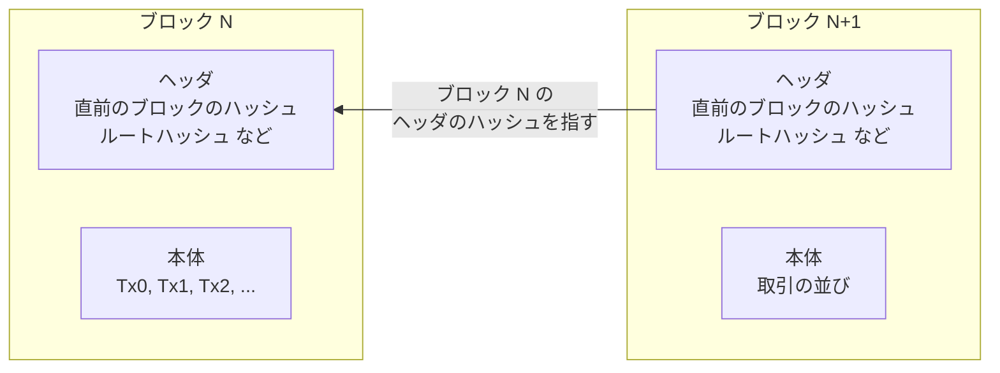
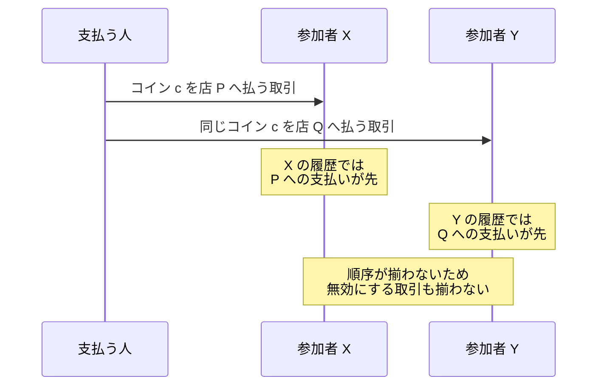
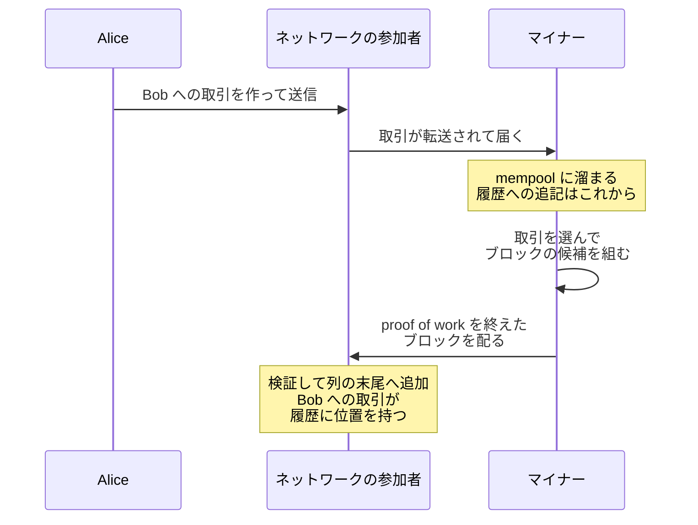
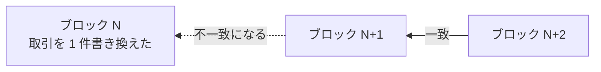

Bitcoin のブロックは、発生した取引をまとめて 1 つに束ね、直前のブロックへの参照でチェーン状に繋いだデータの単位です。ブロックの列がブロックチェーンで、Bitcoin の参加者はこの列を送金の履歴として共有するよう動きます。

ここで扱うのは、[Bitcoin Merkle Tree](../bitcoin-merkle-tree/) のノートを読むために必要な範囲、つまりブロックの構造と、取引がブロックへ取り込まれる事の意味だけです。誰がブロックを作る権利を得るのかを決める [proof of work](../proof-of-work/)（作業証明）の詳細、コインの残高の管理方式、取引に付く署名の仕組みは扱いません。

この構造を知りたくなる場面の代表は、送金が確定したと言える条件を知りたい時です。Bitcoin で代金を受け取る人は、どの時点で商品を渡してよいのかを判断する事になります。この判断の基準は、取引が作られた事ではなく、取引がブロックへ取り込まれたかどうかと、その後ろに積まれたブロックの数です。2 つの違いは後半の「取引が作られてからブロックに入るまで」で説明します。

ブロック 2 つが繋がった様子を以下に示します。

上図のとおり、各ブロックはヘッダと本体に分かれ、ヘッダの中の「直前のブロックのハッシュ」が 1 つ前のブロックを指します。この参照の繰り返しがチェーンを作ります。ヘッダのもう 1 つの項目であるルートハッシュは、本体の取引の並び全体を代表する値です。

---

### なぜブロックという単位が必要なのか

Bitcoin には、履歴を管理する中央のサーバがありません。世界中の参加者がそれぞれ履歴の複製を持ち、どの取引がどの順序で履歴に入ったのかについて、共通の認識を作る必要があります。

共通の認識が要る典型が、同じコインを使おうとする取引の競合です。同じコインを使う取引が複数作られても、同じ有効な履歴の中で両方を成立させる事はできません。どちらか一方だけを残す事になり、その判断は、全参加者が取引の並びについて同じ認識を持って初めて揃います。

順序が揃わないまま同じコインが 2 回使われた場合に、何が起きるかを以下に示します。

上図の状態を放置すると、参加者ごとに残高の計算が食い違います。ブロックは、この並びを共有するための単位です。Bitcoin は複数の取引をブロックにまとめ、ブロックを順番に繋いだ列で履歴を表します。

ブロックの中でも取引には順序があり、どのブロックのどの位置に入ったかで、共有された履歴の中での取引の位置が決まります。[Bitcoin の白書](https://bitcoin.org/bitcoin.pdf)も、まとめた項目のハッシュに時刻を付けて公開し、その時点でデータが存在した事を示す timestamp server を設計の出発点に置いています。

ブロックを作れるのは、proof of work という計算作業を終えた参加者です。proof of work は、ヘッダのハッシュが決められた条件を満たすまで、ヘッダの中の値（nonce）を変えてハッシュを計算し直す作業です。新しいブロックがおよそ 10 分に 1 個のペースで列の末尾へ追加されるよう、条件の厳しさは自動で調整されます。proof of work の説明はここまでの理解に留め、詳細は [Proof of Work](../proof-of-work/) のノートに譲ります。

---

### 取引が作られてからブロックに入るまで

取引（transaction）は、コインの移動を記録するデータです。通常の取引は、過去に自分が受け取った取引の出力を入力として参照し、新しい宛先と金額を出力として並べ、使う資格を示す署名を添えます。例外はブロックの先頭に置かれるコインベース取引で、過去の出力を参照せず、ブロックを作った参加者が報酬を受け取ります。宛先や金額の表し方の詳細は、ブロックを理解する範囲では要りません。

作られた取引は、参加者から参加者へ転送されて Bitcoin のネットワーク全体へ広まります。各参加者は、受け取った取引をまだブロックに入っていない取引の置き場（mempool）に溜めます。この時点の取引は、共有された履歴のどこにも位置を持っていません。

ブロックを作る参加者（マイナー）は、mempool から取引を選んで並べ、ブロックの候補を組み立ててから proof of work の計算を行います。取引には手数料が付き、取り込んだマイナーの報酬になるため、混雑時はサイズあたりの手数料が高い取引が優先されます。

計算を終えたマイナーのブロックはネットワークへ広まり、各参加者は proof of work と取引の内容を検証して、通ったブロックを自分の持つ列の末尾へ追加します。取引がブロックに入るとは、この選抜と追記を通過した事を指します。

Alice が Bob へ支払う取引が、作られてから履歴に載るまでの流れを以下に示します。

上図の最後まで進んで初めて、Bob は支払いがブロックに入ったと確認できます。取引を作って送信しただけの段階では、mempool の混み具合と手数料の相場によっては、長く取り込まれない事もあります。

---

### ブロックヘッダとブロック本体

ブロックは、80 バイトのヘッダと、取引の並びを収めた本体に分かれます。ブロック全体の大きさは block weight という単位で上限（400 万 weight）が決められており、実際のブロックは数 MB 規模、取引数にして数千件です。ヘッダの 6 項目を以下に示します。

| 項目 | 大きさ | 何を表すか |
|---|---|---|
| バージョン | 4 バイト | ブロックの形式の世代（新規則への対応表明にも使う） |
| 直前のブロックのハッシュ | 32 バイト | 1 つ前のブロックのヘッダを 2 回 SHA-256 した値 |
| ルートハッシュ（Merkle root） | 32 バイト | 本体の取引の並び全体を代表する値 |
| 時刻 | 4 バイト | マイナーが申告するおおよその作成時刻 |
| bits | 4 バイト | proof of work の合格条件（target）の圧縮表現 |
| nonce | 4 バイト | 合格するハッシュを探すために変え続ける値 |

表の 3 行目のルートハッシュは、本体の取引を 2 つずつ、SHA-256（Secure Hash Algorithm 256、出力が 32 バイトのハッシュ関数）を 2 回ずつ適用しながら畳み込み、1 つにまとめた値です。取引の中身が 1 件でも書き換われば別の値になるため、この 32 バイトだけで本体の数千件を代表できます。木の作り方と包含証明の仕組みは [Merkle Tree](../merkle-tree/) で、Bitcoin での計算規則と検証は [Bitcoin Merkle Tree](../bitcoin-merkle-tree/) で扱っています。

ヘッダと本体を分ける利点は、履歴の確認に必要な情報量を選べる点にあります。ブロックチェーン全体は数百 GB になる一方、ヘッダは 1 ブロック 80 バイトなので、全ブロックぶん集めても数十 MB に収まります。携帯端末のようにブロック全体を持てない参加者は、ヘッダの列だけを持ち、取引の有効性の検証を他の参加者へ任せます。

---

### 直前のハッシュがチェーンを作る

ヘッダの「直前のブロックのハッシュ」は、1 つ前のブロックのヘッダ全体を SHA-256 で 2 回ハッシュした 32 バイトで、ブロックの識別子でもあります。各ブロックが 1 つ前を指す事で、最初のブロックまで一本道で辿れる列ができます。

この繋ぎ方は改竄の検出に効きます。過去のブロックの取引を 1 バイトでも書き換えると、そのブロックのルートハッシュが変わり、ヘッダのハッシュも変わります。すると次のブロックが持つ「直前のブロックのハッシュ」と一致しなくなります。

書き換えの影響が後ろへ伝わる様子を以下に示します。図の矢印は、ヘッダが持つ参照の向きです。

上図で、ブロック N の取引を書き換えるとブロック N のヘッダのハッシュが変わり、ブロック N+1 が持つ参照と一致しなくなります。繋がりを取り戻すには N+1 以降の全ヘッダの作り直しが要り、ヘッダを 1 つ作り直すたびに proof of work もやり直しになります。後ろにブロックが積まれるほど、書き換えに必要な計算量が膨らみます。

なお、チェーンの末尾は一時的に分岐する事があります。複数のマイナーがほぼ同時にブロックを作ると、参加者ごとに別の末尾を見ている状態になります。各参加者は、積まれた計算量が最も大きい列（条件の厳しさが同じ期間なら、最も長い列）を正しい履歴として採用するため、どちらかの列が先に伸びた時点で分岐は解消します。

短い列に入っていた取引はブロックから外れ、mempool に戻って改めて取り込みを待ちます。取り込まれた時点で取引は履歴に位置を持つものの、末尾に近い位置は巻き戻りで失われる事があります。取り込まれた直後の取引が「確定」ではなく「確定へ向かう」と表現されるのは、このためです。

---

### 利点

- ブロック 1 個ぶんの取引の順序と採否をまとめて決められる
- 過去の書き換えが、直前のハッシュの不一致として後続の全ブロックへ伝わる
- ヘッダ 80 バイトの列だけで、チェーンの繋がりと proof of work を検証できる
- ルートハッシュを通じて、本体を持たない参加者にも取引の包含を確かめる手段を用意できる

4 番目の性質を実現する仕組みが Merkle Tree で、木と証明の基本は [Merkle Tree](../merkle-tree/)、Bitcoin での検証の手順は [Bitcoin Merkle Tree](../bitcoin-merkle-tree/) で説明しています。

---

### 欠点

以下は、中央のサーバを置かずに履歴を 1 本へ揃える事を優先した結果として現れる制約です。

- 取引を作ってからブロックに入るまで待ち時間があり、ブロックの間隔は平均でおよそ 10 分になる
- ブロックの大きさに上限があり、混雑時はサイズあたりの手数料が高い取引から取り込まれやすい
- チェーンの末尾は巻き戻る可能性があり、直後の 1 ブロックだけでは確定と扱いにくい

3 番目の巻き戻りへの実用上の対処は、取引の入ったブロックの後ろに積まれたブロックの数（confirmation、確認数）を数える事です。Bitcoin の白書も、受け取る側が後続のブロックを待ってから受け入れる前提で、攻撃の成功確率を計算しています。何個待てば十分かは金額とリスクの許容度で変わるため、ここでは扱いません。
