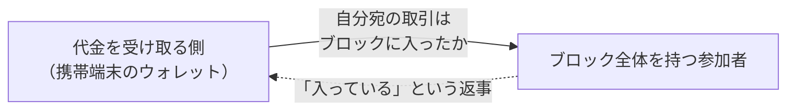
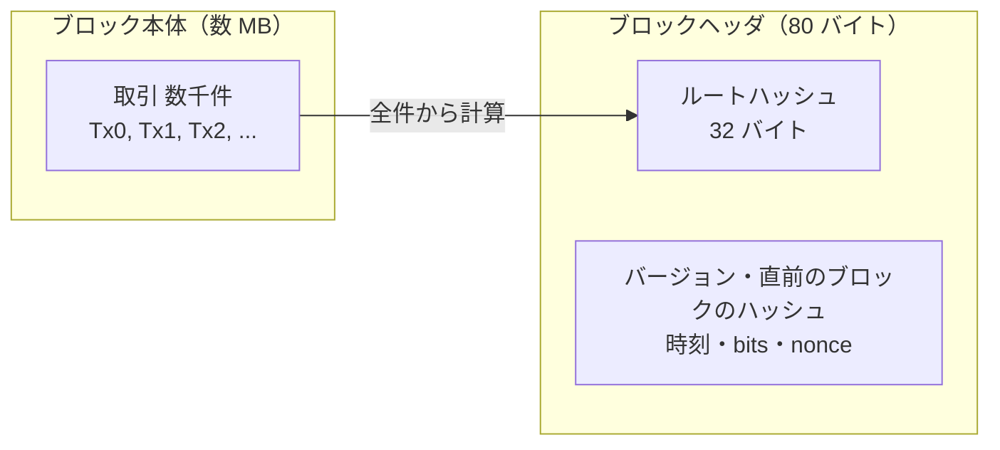
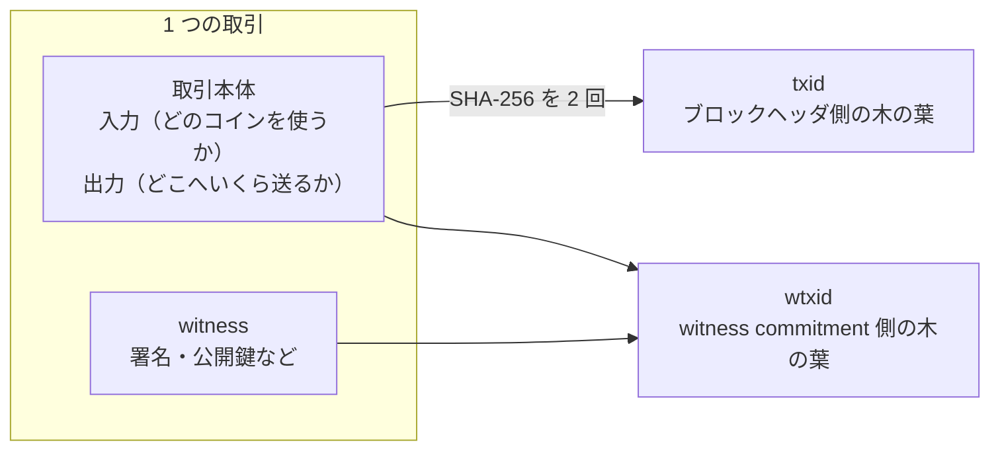
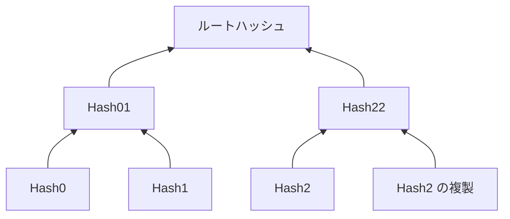
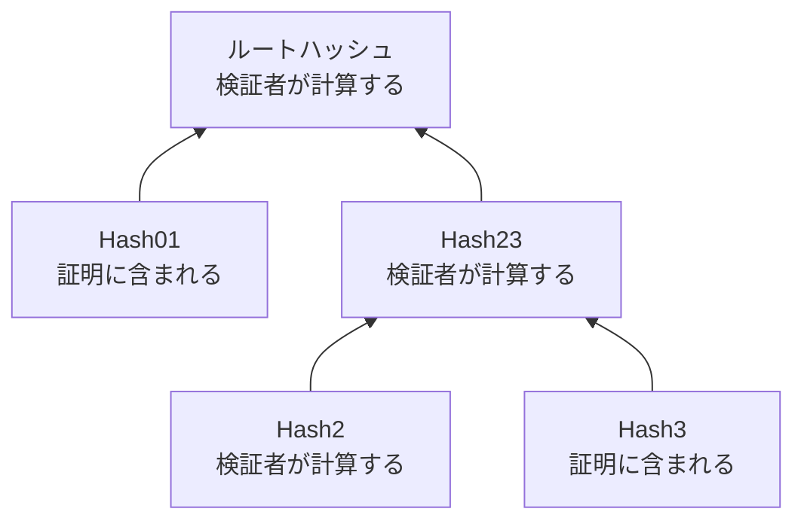
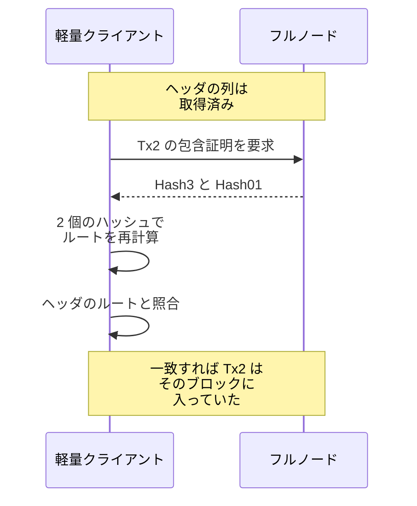
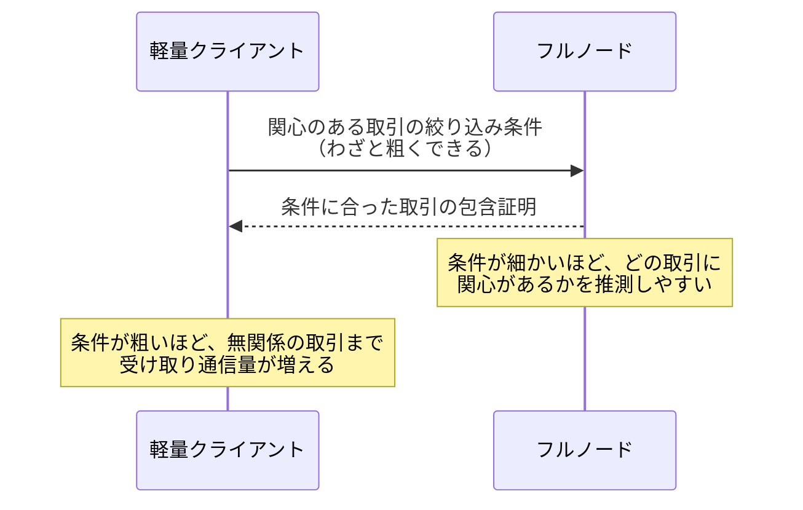

Bitcoin は、ブロックに入った取引（transaction、以下の図では Tx と略します）の並びを Merkle Tree で 1 つのルートハッシュへ畳み込み、80 バイトのブロックヘッダに収めています。ここでは、Bitcoin が何を葉にして木を組み立てているのか、その木で取引の包含をどう検証するのかを説明します。

前提は 2 つあります。木の作り方と包含証明の仕組みは [Merkle Tree](../merkle-tree/) で、ブロック・ブロックヘッダ・取引の関係は [Bitcoin Block](../bitcoin-block/) で説明しています。[Bitcoin の白書](https://bitcoin.org/bitcoin.pdf)も、取引を Merkle Tree でハッシュ化し、ブロックのハッシュに入れるのはルートだけだと書いています。取引を並べる順序を決めるのはブロックを作ったノード（ネットワークに参加する計算機）で、順序が変われば別のルートハッシュになります。

この仕組みが効く場面の代表は、支払いの受け取りです。送金の取引は、作られてネットワークへ流れただけでは、まだどのブロックにも入っていません。どこかのブロックへ取り込まれて初めて、共有された履歴の中に位置を持ちます。そのため、代金を受け取る側は、自分宛の取引がブロックに入った事を見届けてから商品を渡したいはずです。厳密には、その後ろに積まれたブロックの数（[Bitcoin Block](../bitcoin-block/) で説明した確認数）まで見て判断します。ここで扱うのは、その前段にあたる「入った事」の確認です。

受け取る側が置かれる状況を以下に示します。



上図の「入っている」という返事は、そのままでは証拠になりません。返事の裏を取ろうにも、ブロックチェーン全体は数百 GB あり、携帯端末のウォレットには収まりません。ルートハッシュと包含証明の組は、この返事を手元で検算できる証拠へ置き換えます。

---

### 全件を渡す検証と何が違うのか

取引の並びを 1 つの値で代表するだけなら、全件を順に連結してハッシュを 1 回計算すれば足ります。この方法では、ある取引の包含を確かめるたびに、数千件・数 MB のブロック全体を受け取って計算し直す事になります。Merkle Tree の包含証明なら、受け取るのは件数の対数、数千件でもハッシュ十数個です（[Merkle Tree](../merkle-tree/) の「葉が増えても証明は少しずつしか増えない」）。

ヘッダとブロック本体の大きさの関係を以下に示します。



上図のとおり、ヘッダ側の 32 バイトが本体の数千件を代表します。ブロックと取引を自力で完全に検証する参加者をフルノード、ブロックヘッダだけを保持して取引の有効性の検証をフルノードへ任せる参加者を軽量クライアントと呼びます。フルノードの条件は検証を自分で行う事で、検証を終えた古いブロックのデータを削除して動いているフルノードもあります。軽量クライアントは、携帯端末のように全件を保持し続けられない環境で使われます。

---

### 葉は txid

葉は、各取引の txid です。txid は、witness データを含まない形式へ整えた取引に、SHA-256（Secure Hash Algorithm 256、出力が 32 バイトのハッシュ関数）を 2 回適用した値です。葉が並んだら、隣同士を左から順に組にして連結し、その組へ SHA-256 を 2 回適用した値を 1 段上のノードにします。1 つになるまで繰り返した結果が、ブロックヘッダに入るルートハッシュです。

witness データは、そのコインを使う資格を満たしている事を示すための、署名や公開鍵などのデータです。2017 年の Segregated Witness（分離された witness、SegWit）という仕様変更で、取引本体から分離した領域に置かれるようになりました。

署名には、取引の中身を変えないまま第三者が値だけを作り替えられる余地があり、txid の計算に含めると、同じ内容の取引の識別子が送金の途中で変わってしまいます。この問題は transaction malleability（取引展性）と呼ばれ、witness を txid の外へ出した事が解決策の 1 つでした。

取引と 2 つの識別子の関係を以下に示します。



上図のとおり、ブロックヘッダ側の木に witness は入りません。仕様変更の提案文書である BIP（Bitcoin Improvement Proposal）の [141 番](https://github.com/bitcoin/bips/blob/master/bip-0141.mediawiki)は、witness まで含めた識別子である wtxid で別の木を作り、そのルートをコインベース取引（ブロックの先頭に置かれる、ブロック作成者が報酬を受け取る取引）の出力へ埋め込む witness commitment を定めています。witness が改竄されていない事は、wtxid の木で保証します。

---

### 奇数の葉は最後を複製する

木の組み立て方は Merkle Tree で 1 通りに決まっておらず、Bitcoin の作り方は数ある流儀の 1 つです。Bitcoin は、段の中のノード数が奇数になると最後のノードを複製してから組を作ります。[Bitcoin Core の実装](https://github.com/bitcoin/bitcoin/blob/master/src/consensus/merkle.cpp)のコメントは、この複製を「which is unusual in Merkle trees」（Merkle Tree では異例）と断っています。

取引 3 件のブロックでの複製を以下に示します。



上図の Hash22 は、Hash2 を 2 つ連結した組のハッシュです。この木は、4 件目の取引として Tx2 をもう一度並べた場合と同じ形になります。

複製規則の副作用として、異なる取引の並びから同じルートハッシュが決まる形が存在します。同じコメントは「This results in certain sequences of transactions leading to the same merkle root」（この結果、ある種の取引の並びが同じ merkle root へ至る）と書いています。SHA-256 の衝突ではなく、木の構築規則に由来する一致です。

放置すると、細工したブロックを無効と記録した事で、同じハッシュを持つ正当なブロックまで受け取れなくなる攻撃（[CVE-2012-2459](https://en.bitcoin.it/wiki/Common_Vulnerabilities_and_Exposures#CVE-2012-2459)）に繋がります。そのため Bitcoin Core は、段の末尾で同じハッシュ 2 つを組にする箇所を検出し、そのブロックを棄却しています。

複製しない流儀もあります。Certificate Transparency の RFC 9162 は、葉の件数から木の形を決める分割規則を使っており、奇数の扱いを含む構築規則の違いは [Merkle Tree Design](../merkle-tree-design/) で扱います。

---

### 包含証明の形式と検証

取引 4 件のブロックで、Tx2 の包含を示す時に何が渡るかを以下に示します。木と証明の読み方は [Merkle Tree](../merkle-tree/) の包含証明と同じです。



上図で証明として渡るのは Hash3 と Hash01 の 2 個で、検証者は Tx2 から Hash2 を求め、根まで再計算して手元のルートハッシュと照合します。左右をどう知るかは証明の形式ごとに決まっており、Bitcoin では各段での番号から決まります。0 から数えると Hash2 は番号 2 で、偶数なので相手は右の Hash3 です。1 つ上の段で Hash23 は番号 1 になり、奇数なので相手は左の Hash01 です。

この情報を受け取って検証する関数を以下に示します。ハッシュは内部のバイト順のまま渡します。txid をチェーンの中身を表示する Web サービス（ブロックエクスプローラ）からコピーすると、慣習で逆順の 16 進表記になっており、そのままでは一致しません。

```go
// verifyMerkleProof は、葉のハッシュと包含証明からルートハッシュを再計算し、
// 期待するルートハッシュと一致するかを返します。
// path は葉に近い段から並べ、siblingIsRight[i] は path[i] が右側にあった事を表します。
func verifyMerkleProof(leaf [32]byte, path [][32]byte, siblingIsRight []bool, root [32]byte) bool {
	if len(path) != len(siblingIsRight) {
		return false
	}

	h := leaf
	for i, sibling := range path {
		if siblingIsRight[i] {
			h = doubleSHA256(h[:], sibling[:])
		} else {
			h = doubleSHA256(sibling[:], h[:])
		}
	}
	return h == root
}

// doubleSHA256 は、2 つのハッシュを連結して SHA-256 を 2 回適用します。
func doubleSHA256(left, right []byte) [32]byte {
	buf := make([]byte, 0, len(left)+len(right))
	buf = append(buf, left...)
	buf = append(buf, right...)

	first := sha256.Sum256(buf)
	return sha256.Sum256(first[:])
}
```

上のコードで繰り返す回数は `path` の長さです。奇数のノードを複製する Bitcoin の作り方では、葉の件数を 2 の冪へ切り上げた木と同じ深さになるため、葉が n 件なら段数は `ceil(log2 n)` です。例えば、取引が 3000 件のブロックなら段数は 12 で、32 バイトのハッシュを 12 個、合わせて 384 バイトです。そのブロック本体が 1 MB だとすると、384 バイトは 1/2000 以下に収まります。

上のコードは、Bitcoin のハッシュ計算規則から包含証明の骨組みだけを抜き出して単純化したものです。左右のハッシュを連結する、連結した値へ SHA-256 を 2 回適用する、根まで再計算する、という 3 つだけを見せており、Bitcoin が実際に送る証明の形式を再現したものではありません。

実際に流れる証明の形式も 1 通りではありません。[BIP 37](https://github.com/bitcoin/bips/blob/master/bip-0037.mediawiki) が定める `merkleblock` メッセージは、partial Merkle tree と呼ばれる形式で、`total_transactions`・`hashes`・`flags` の 3 つを送ります。受け取った側は取引の総数から木の形を復元し、`flags` のビットを深さ優先で読みながら `hashes` を消費して、根まで計算します。ここでの `siblingIsRight` は、この走査を省いて手順を見せるためのものです。

---

### SPV - ヘッダだけで取引を確かめる

軽量クライアントが持っているのは、ブロックヘッダの列だけです。ヘッダはルートハッシュを含むため、包含証明を受け取れば、その取引がヘッダの指すブロックに入っていた事を自力で確かめられます。Bitcoin の白書はこの手順を Simplified Payment Verification（簡易支払い検証）と呼んでおり、一般には SPV と略されます。

この照合にフルノードへの信用は要りません。入っていない取引が入っていると見せかけるには、既に決まっているルートハッシュへ、実際とは異なる取引と証明から辿り着く必要があります。安全なハッシュ関数を使っている限り、そのような入力を作る事は現実的に困難です。

軽量クライアントとフルノードのやり取りを以下に示します。



上図の最後で一致した時に確かめられたのは、Tx2 がそのブロックに入っていた事だけです。証明を受け取ったクライアントは Tx2 が有効な取引だと確かめたのではないか、と考える方がいるかもしれません。白書は「He can't check the transaction for himself, but by linking it to a place in the chain, he can see that a network node has accepted it」（利用者自身が取引を検証する事はできないが、チェーン上の場所と結び付ける事で、ネットワークのノードがそれを受け入れた事は分かる）と書いています。

署名が正しいか、使おうとしている残高が既に使われていないかについては、そのブロックを受け入れたノードの判断と、後ろにブロックが積み上がった事実だけが間接的な裏付けになります。

注意点として、包含証明だけでは、そのルートハッシュを含むブロックヘッダが正しいチェーンに属する事までは証明できません。ヘッダの列のどれを正しいチェーンとして採用するかは、各ヘッダが満たす [proof of work](../proof-of-work/)（計算作業）の量と、どの列を選ぶかの規則で決まります。Merkle Tree の外側にある話なので、ここでは扱いません。

白書も、この検証が信頼できるのは正直なノードがネットワークを支配している間だけで、攻撃者が上回ると脆くなると、成立条件を限定しています。

---

### 利点

- ブロック全体を持たない参加者が、取引 1 件の包含を自力で検証できる
- 証明のサイズが件数の対数で、数千件のブロックでも数百バイトに収まる
- witness を別の木に分けた事で、txid の木は署名の作り替えの影響を受けない
- 使い終わった取引の枝をハッシュ 1 つへ置き換える圧縮に道を残している

4 番目について、Bitcoin の白書は、使い終わった取引を木から外し、代わりにその枝をまとめたハッシュを残す事で古いブロックを圧縮する案を挙げています。なお Bitcoin Core の枝刈りはブロックファイルごと消す別の方式で、白書のこの案は実装されていません。

---

### 欠点

以下は、証明のサイズと引き換えに現れる制約です。

- 素朴に証明を要求すると、どの取引に関心があるかが相手のノードへ伝わる
- SPV が確かめるのはブロックへの包含だけで、取引の有効性までは確かめない
- 複製規則の副作用として、同じルートハッシュになる別の取引の並びが存在する（検出して棄却する）

どの取引に関心があるかが伝わる問題に対して、BIP 37 は、関係の無い取引もいくらか混ぜて受け取る仕組みを定めました。BIP 37 は、精度の高い絞り込みを使うと自分のウォレットに関係する取引だけが届く代わりに、相手のノードが取引と IP アドレスを結び付けられると書いています。通信量と匿名性のどちらを取るかの選択になります。この駆け引きを以下に示します。



なお [Bitcoin Core 0.19.0.1](https://github.com/bitcoin/bitcoin/blob/master/doc/release-notes/release-notes-0.19.0.1.md) は、サービス拒否攻撃の経路を断つ目的で、この絞り込みを受け付ける設定を既定で無効にしました。現在は、ブロックごとに作った要約をクライアントが引き取って手元で照合する compact block filters（形式は [BIP 158](https://github.com/bitcoin/bips/blob/master/bip-0158.mediawiki)、取得の手順は [BIP 157](https://github.com/bitcoin/bips/blob/master/bip-0157.mediawiki)）へ寄っています。
