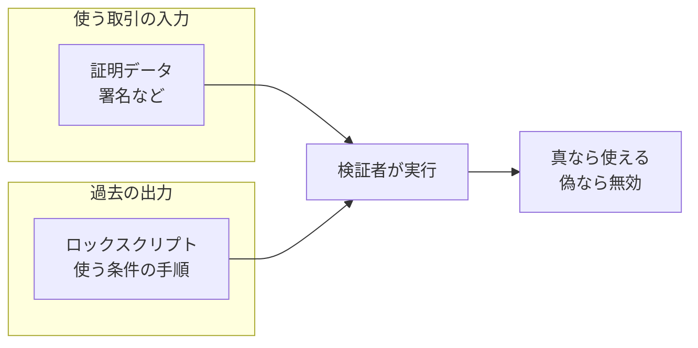
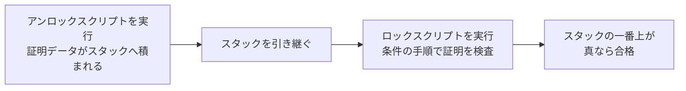
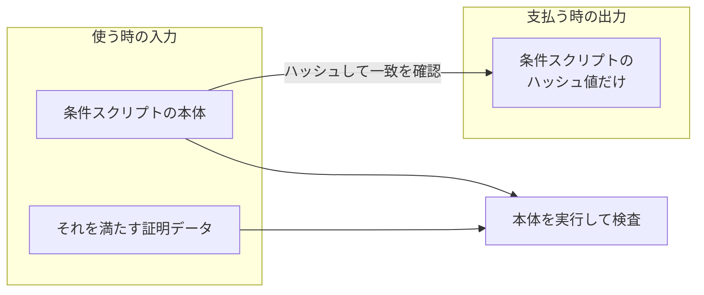

Bitcoin Script は、取引の出力に「使う条件」を書くための小さなプログラミング言語です。[UTXO](../utxo/) のノートで「出力には金額と使う条件が書かれる」とだけ述べ、条件式の書き方は扱わずにいました。その中身がこの言語です。ここでは代表的な条件である P2PKH（Pay to Public Key Hash）を軸に実行の仕組みを説明し、命令（opcode）の全一覧や、手数料・サイズの上限の規則は扱いません。

条件と証明の対応は、[Digital Signature](../digital-signature/) で見た「出力に公開鍵のハッシュ値が置かれ、使う側は公開鍵と署名を出す」という形が代表です。この形が P2PKH で、名前も「公開鍵のハッシュ値へ払う」という意味です。Script は、この照合の手順そのものを出力の中にデータとして埋め込みます。検証する参加者は、埋め込まれた手順を実行して、結果が真になるかどうかで資格の有無を判定します。

条件と証明が噛み合う様子を以下に示します。



上図のとおり、条件（ロックスクリプト）と証明データは別の取引に分かれて存在し、使う時に初めて組み合わされて実行されます。[Bitcoin Wiki の Script のページ](https://en.bitcoin.it/wiki/Script)は、実行が失敗せずに終わり、スタックの一番上に真（0 でない値）が残る事を取引の有効条件として説明しています。

---

### なぜ条件をプログラムで書くのか

「公開鍵のハッシュ値と署名を照合する」という手順を検証プログラムへ直接書き込んでも、支払いは成立します。その作りでは、条件が全ての出力で 1 種類に固定されます。複数人の署名を要求する、期限が来るまで使えなくする、といった別の条件が欲しくなるたびに、全参加者の検証プログラムを書き換える事になります。

Script は、条件を検証プログラムそのものではなく、出力のデータとして持たせます。検証プログラムが持つのは「スクリプトを実行して結果を見る」という枠組みだけです。[Bitcoin Wiki も、2 つの秘密鍵を要求する事も、複数の鍵の組み合わせを要求する事も、鍵を全く要求しない事もできると、この柔軟さを説明しています](https://en.bitcoin.it/wiki/Script)。

例えば、次のような条件が同じ枠組みの上で表せます。

| 条件 | 何を要求するか |
| --- | --- |
| P2PK（Pay to Public Key） | 指定した公開鍵に対応する署名 |
| P2PKH（Pay to Public Key Hash） | ハッシュ値が一致する公開鍵と、その署名 |
| multisig | n 個の公開鍵のうち m 個ぶんの署名 |
| タイムロック付きの条件 | 指定した時刻やブロック高より後である事 |

表の条件はどれも、検証者から見れば「スクリプトを実行して真になるか」という同じ問いです。既存の命令で表現できる条件なら、新しい形が増えても検証プログラムを書き換える必要はありません。

---

### ロックスクリプトとアンロックスクリプト

条件と証明データは、それぞれ決まった置き場所を持ちます。出力に置かれる条件をロックスクリプト（scriptPubKey）と呼びます。従来の形式では、入力の scriptSig がアンロックスクリプトとして使われ、証明データを積む命令の並びになっています。

[Bitcoin Merkle Tree](../bitcoin-merkle-tree/) で説明した witness を使う形式では、証明データの置き場所だけでなく、検証手順も形式ごとに異なります。ここでは詳細を扱わず、以降は witness を使わない従来の形式を前提に説明し、まずは命令の流れを追いやすい P2PKH を例にします。

従来の形式での検証の実行順を以下に示します。



上図のとおり、先にアンロックスクリプトを実行して証明データをスタックへ積み、その状態を引き継いでロックスクリプトを実行します。スタックは「後に積んだ物を先に取り出す」入れ物です。多くの命令は、スタックへ値を積んだり、スタックの上の値を取り出して処理したりします。

この分担で、ロックスクリプトを取引へ書き込むのは、出力を作る取引を組む支払う側になります。条件の中身は受け取る側が示したアドレスが決めており、支払う側はそれをロックスクリプトの形へ組み立てます。受け取った側は次に使う時、その条件を満たすアンロックスクリプトを用意します。

---

### スタックで実行する - P2PKH を追う

最も広く知られた条件である P2PKH の実行を命令単位で追います。ロックスクリプトとアンロックスクリプトは次の形です。`<>` で囲んだ部分はデータで、それ以外が命令です。

```text
ロックスクリプト:   OP_DUP OP_HASH160 <公開鍵のハッシュ値> OP_EQUALVERIFY OP_CHECKSIG
アンロックスクリプト: <署名> <公開鍵>
```

命令は 4 つだけです。OP_DUP はスタックの一番上を複製します。OP_HASH160 は一番上の値に SHA-256 と RIPEMD-160 を順に適用します（[Hash Function](../hash-function/) で触れた 20 バイトへの短縮です）。OP_EQUALVERIFY は上の 2 つを比べ、一致しなければ実行を失敗させます。OP_CHECKSIG は署名を公開鍵で検証し、結果の真偽をスタックへ残します。

実行の各段階でスタックがどう変わるかを以下に示します。左が先に実行される命令で、スタックは左端が一番上です。

| 実行する物 | 実行後のスタック（左が一番上） |
| --- | --- |
| `<署名>` を積む | 署名 |
| `<公開鍵>` を積む | 公開鍵、署名 |
| OP_DUP | 公開鍵、公開鍵、署名 |
| OP_HASH160 | 計算したハッシュ値、公開鍵、署名 |
| `<公開鍵のハッシュ値>` を積む | 条件のハッシュ値、計算したハッシュ値、公開鍵、署名 |
| OP_EQUALVERIFY | 公開鍵、署名 |
| OP_CHECKSIG | 真（署名が正しい場合） |

表の OP_EQUALVERIFY までが「出力に書かれたハッシュ値と一致する公開鍵か」の確認で、最後の OP_CHECKSIG が「その公開鍵に対応する署名か」の確認です。[Digital Signature](../digital-signature/) の図で示した 2 段階の照合が、そのまま命令の並びになっています。最後にスタックへ真が残れば、この入力は条件を満たした事になります。

---

### ループの無い言語 - 実行は必ず停止する

Script にはループがありません。[Bitcoin Wiki は、Script を意図的に（intentionally）チューリング完全にしていない、ループの無い言語だと説明しています](https://en.bitcoin.it/wiki/Script)。命令は左から右へ 1 度ずつ実行されるだけなので、実行される命令の数はスクリプトに書かれた数を超えず、どんなスクリプトも必ず停止します。

この性質は、全参加者が全取引を検証するという Bitcoin の構成と噛み合っています。検証者は、見知らぬ相手が書いたスクリプトを無条件で実行する立場にあります。停止しないスクリプトや、実行コストが際限なく膨らむスクリプトを作れてしまうと、取引の検証そのものが攻撃の入り口になります。実際の検証コストは、命令数の上限や署名検証の回数の上限といった別の制限とあわせて、予測できる範囲に保たれています。

条件分岐（OP_IF）はあるので、「期限前なら 2 人の署名、期限後なら 1 人の署名」のような場合分けは書けます。書けないのは、繰り返しと、実行をまたいで残る状態です。この制限が表現力の上限をどう決めるかは、欠点の節で扱います。

---

### スクリプトのハッシュへ払う - P2SH

条件が複雑になると、ロックスクリプトが長くなり、その分だけ出力のデータも膨らみます。支払う側が受け取る側の複雑な条件を全て知り、正しく出力へ書き込む必要もあります。P2SH（Pay to Script Hash）は、条件の本体ではなく、条件のハッシュ値へ払う形式です。

P2SH での支払いと使用の分担を以下に示します。



上図のとおり、使う時には条件スクリプトの本体と証明の両方を出します。検証者は、本体のハッシュ値が出力の値と一致する事を確かめてから、本体を実行します。条件の中身を知り、データとして持ち運ぶ責任が、支払う側から受け取る側（条件を設計した本人）へ移ります。多くの公開鍵を並べる multisig のような長い条件は、この形式との組み合わせで使われます。

[UTXO](../utxo/) で触れた「アドレスは条件を組み立てるための情報を符号化した文字列」は、P2PKH なら公開鍵のハッシュ値、P2SH なら条件スクリプトのハッシュ値を運んでいます。

---

### 利点

以下は、使う条件を検証プログラムではなく取引のデータとして持たせた事で得られる性質です。

- 署名 1 つから複数署名・時間条件まで、同じ実行の仕組みの上で表せる
- ループが無く実行が必ず停止し、命令数などの上限とあわせて検証コストを見積もれる
- 全参加者が同じ検証規則を適用するため、同じ取引について独立に同じ判定へ到達できる

---

### 欠点

以下は、見知らぬ相手のスクリプトを全参加者が実行する前提で、停止と検証コストの予測しやすさを優先した結果として現れる制約です。

- 繰り返しと、実行をまたいで残る状態が無く、残高の管理や複雑な取り決めをスクリプト単体では表せない
- 一度出力に置いた条件は変更できず、誤った条件は修正の手段が無い
- 常に真を返す条件も書けてしまい、その出力は誰でも使える

1 番目の制約を別の方向へ振ったのが、[UTXO](../utxo/) の比較で触れた Ethereum です。Ethereum は実行をまたいで残る状態を持つプログラムを置けるようにした一方、実行量を計って上限を課し、代価を求める仕組みを別に用意する必要がありました。どちらの設計も、条件の表現力と検証の予測しやすさの釣り合いを選んだ結果です。
