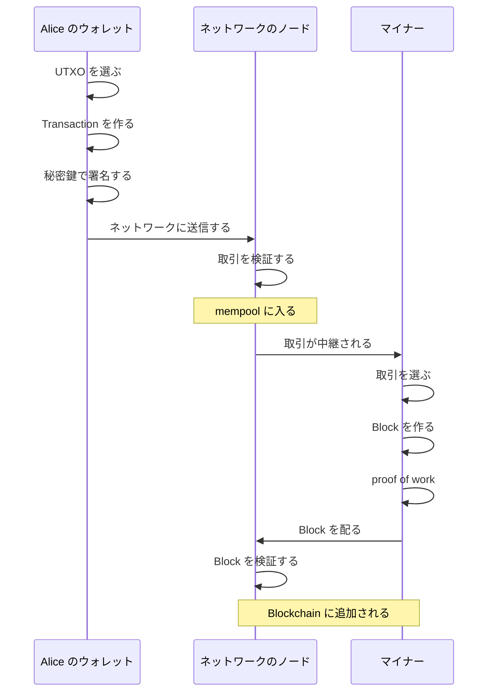
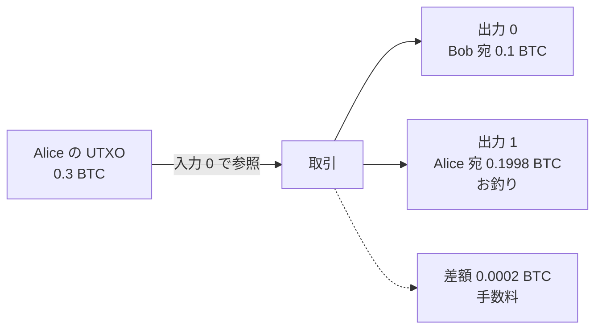
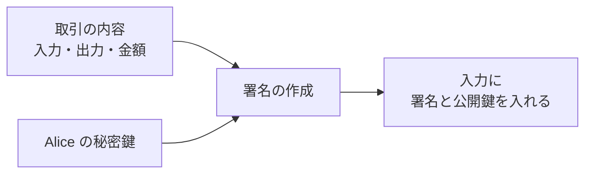
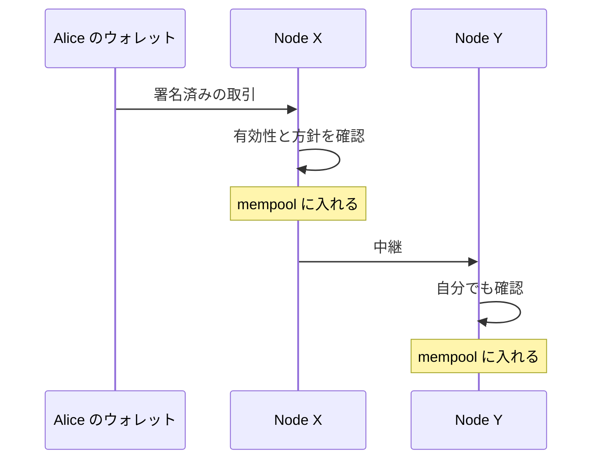
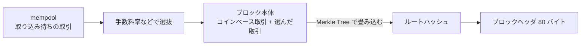
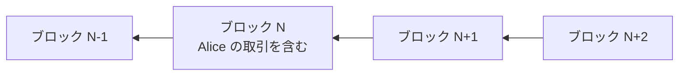

Bitcoin の送金は、ウォレット（鍵を管理し、取引を組み立てるソフトウェア）が取引を作り、ネットワークに流し、マイナーがブロックに取り込むまでの段階を通ります。取引が共有された履歴の中に位置を持つのは最後の段階で、送信した時点ではまだどこにも記録されていません。以下では、Alice が Bob に 0.1 BTC（BTC は Bitcoin の通貨単位）を送る 1 件の取引で、作成からブロックへの取り込みまでを順に追います。

本ノートでは、各段階で何が起きるのかと、どの仕組みが登場するのかを扱い、[署名の計算手順](../digital-signature/)、[Bitcoin Script の命令](../bitcoin-script/)、[SHA-256（Secure Hash Algorithm 256、Bitcoin が使うハッシュ関数）の内部](../hash-function/)、[Merkle Tree の構築規則](../merkle-tree-design/)、[合格条件の計算](../proof-of-work/)といった詳細は、各ノートに譲ります。全体の問題設定は [Blockchain Basics](../blockchain-basics/) で整理しています。

送金がブロックに取り込まれるまでの間に、取引が今どこまで進んでいるのかを知りたくなる事があります。代表的な場面は、ウォレットで送信を終えた後の待ち時間です。画面には「未確認」と表示され、しばらく経ってから確認済みに変わります。その間に取引がどこを通り、誰が何を確かめているのかは、ウォレットの画面からは見えません。

送信から取り込みまでの流れを以下に示します。

上記の図のうち、Alice のウォレットが行うのは、取引の組み立てから署名を経て、ネットワークに送信するまでです。以降は、受け取ったノードとマイナーの作業になります。署名済みの取引そのものを後から書き換える事はできず、内容を変える場合は新しい取引を作る事になります。

---

### ウォレットが UTXO を選んで取引を組み立てる

Bitcoin に口座はなく、Alice の残高は、Alice の鍵で使える [UTXO](../utxo/)（Unspent Transaction Output、未使用の取引出力）を集めた合計です。ウォレットは、その中から支払いに足りる組み合わせを選びます。ここでは、0.3 BTC の UTXO を 1 つだけ持っている場合を例にします。

入力は選んだ UTXO を丸ごと消費するため、支払う額との差はお釣りとして自分宛の出力に戻します。以下が組み立てた取引の形です。

上記の図の手数料は、取引のどこにも項目として書かれません。入力の合計から出力の合計を引いた差が、この取引を取り込んだマイナーの報酬になります。金額は例で、いくら残すかは取引を作る人が決めます。出力とお釣りの扱いは [UTXO](../utxo/) で説明しています。

出力には、金額とあわせて「使う条件」が書かれます。Bob のアドレスは、この条件を組み立てるための情報を符号化した文字列で、ウォレットはアドレスから条件を作って出力に入れます。条件の書き方は [Bitcoin Script](../bitcoin-script/) で説明しています。

支払いたい額に足りる UTXO が 1 つも無い場合は、複数の UTXO を入力に並べて合算します。入力が増えるほど取引のデータは大きくなり、同じ扱いを受けるのに必要な手数料も増えます。どの UTXO を選ぶかは、手数料と、手元に残る UTXO の細かさの両方に効いてきます。

---

### 秘密鍵で署名して使う資格を証明する

この時点の取引には、Alice の UTXO を使うと書いてあるだけで、それを使う資格を示す証明が入っていません。入力が参照する出力には条件が書かれており、代表的な P2PKH（Pay to Public Key Hash）では、出力に書かれたハッシュ値と一致する公開鍵と、その鍵で作った署名を出す事が条件になります。

Alice は取引の内容を対象に秘密鍵で署名を作り、公開鍵と一緒に入力に入れます。以下が署名の材料と行き先です。

上記の図の署名は取引の内容と結び付いているため、途中の誰かが宛先や金額を書き換えると検証が通らなくなります。取引のどの範囲を署名の対象に含めるかは sighash type という指定で選べ、最も広く使われる指定では全ての入力と出力が範囲に入ります。指定の種類と署名の計算は [Digital Signature](../digital-signature/) で説明しています。

署名を入れ終えた取引は、参照先の UTXO の情報と組み合わせて検証できるデータになります。受け取ったノードは、Alice に問い合わせる事なく、手元の UTXO 集合と取引に含まれる証明を使って、出力を使う条件が満たされているかを判定できます。

---

### ネットワークに流れ、各ノードが検証して mempool に入る

ウォレットは、出来上がった取引を接続しているノードに送ります。受け取ったノードは、取引として有効かを自分で検証し、さらに自身の mempool と中継の方針を満たす場合に受け入れて隣のノードに中継します。有効性の主な確認項目は次の 4 つです。

- 参照先の出力が UTXO 集合に残っているか（既に使われていないか）
- 入力に添えられた証明が、出力に書かれた条件を満たすか
- 出力の金額の合計が、入力の合計を超えていないか
- 取引の形式と大きさが規則に収まっているか

受け入れられた取引は、まだブロックに入っていない取引の置き場（[mempool](../mempool/)）に入ります。mempool はノードごとに持つもので、届く順や方針の違いによって中身は完全には一致しません。取引が広まる様子は以下の通りです。

上記の図の Node X と Node Y は、それぞれ独立に確認しています。有効性の判定は共通の規則で決まる一方、mempool に入れるかどうかと中継するかどうかには各ノードの方針が効くため、あるノードが持っている取引を別のノードが持っていない事も起こります。方針の中身と、入った取引が消える場面は [Mempool](../mempool/) で説明しています。

ノードは、同じ UTXO を使う競合取引をそのまま両方保持するわけではありません。条件によっては、後から届いた競合取引が既存の取引を置き換える場合もあります。競合が参照の重複として表れる理由は [UTXO](../utxo/)、条件と証明の照合は [Bitcoin Script](../bitcoin-script/) で説明しています。

各ノードが自分で確認するのは、他のノードの判定を信じずに済ませるからです。確認に必要な材料は取引そのものと手元の UTXO 集合だけで、外部への問い合わせは必要ありません。送信元が誰であっても、有効性の確認を通らない取引は先に中継されません。

---

### マイナーが取引を選び、ブロックの候補を組む

mempool の取引は、まだ履歴のどこにも位置を持っていません。位置を与えるのはブロックへの取り込みで、ブロックの候補を作る参加者をマイナー（miner）と呼びます。マイナーは mempool から取引を選んで並べ、ブロックの候補を組み立てます。

ブロックには取り込めるデータ量に上限があるため、混雑している時は、サイズあたりの手数料率が高い取引から取り込まれやすくなります。Alice の取引は、この選抜を通るまで mempool で待ちます。候補が組み上がるまでは以下の通りです。

上記の図の先頭に置くコインベース取引は、過去の出力を参照せず、ブロックを作った参加者が報酬と手数料を受け取る取引です。ヘッダにはルートハッシュのほかに、直前のブロックのハッシュ値、時刻、合格条件、nonce が入ります。ヘッダの項目は [Bitcoin Block](../bitcoin-block/)、木の作り方と Bitcoin での規則は [Merkle Tree](../merkle-tree/) と [Bitcoin Merkle Tree](../bitcoin-merkle-tree/) で説明しています。

---

### proof of work で条件を満たすヘッダを探す

候補が組み上がっても、そのままではブロックとして受け入れられません。ヘッダのハッシュ値が、決められた値（target）以下になっている必要があります。マイナーは、ヘッダの nonce などを変えながらハッシュを計算し直し、合格する値が出るまで試行を繰り返します。

ハッシュ値は入力が少し変わるだけで全く別の値になるため、条件を満たすヘッダを狙って作る方法は知られていません。総当たりに近い試行を繰り返す事になり、合格を得るには平均して大量の計算が必要です。受け取ったノードは、同じ計算を 1 度やり直すだけで条件の成立を確かめられます。

この試行は、多数のマイナーがそれぞれ別の候補で同時に進めています。取引の並びも報酬の宛先も候補ごとに違うため、どのマイナーが先に合格するかで、Alice の取引が入るブロックの中身は変わります。Alice の取引を選ばなかった候補が先に合格すれば、Alice はもう 1 回、次のブロックを待つ事になります。

合格したマイナーは、ブロックをネットワークに配ります。ブロックが見つかる間隔が平均およそ 10 分になるよう、条件の厳しさは定期的に調整されます。target の表し方と調整の規則は [Proof of Work](../proof-of-work/)、ハッシュ関数の性質は [Hash Function](../hash-function/) で説明しています。

---

### 他のノードがブロックを検証し、チェーンに繋ぐ

ブロックを受け取ったノードは、proof of work の成立、直前のブロックとの繋がり、中の取引 1 件ずつの有効性を検証します。[白書](https://bitcoin.org/bitcoin.pdf)も、ブロックを受け入れるのは中の全ての取引が有効で、かつ使用済みでない場合だけだと書かれています。通ったブロックは自分の持つチェーンの末尾に追加され、消費された出力が UTXO 集合から消え、新しくできた出力が足されます。

Bob から見ると、自分宛の出力が UTXO 集合に加わります。ブロック全体を持たない携帯端末のウォレットは、ヘッダと少数のハッシュだけで自分宛の取引がブロックに入った事を確かめられます。この方法で確かめられるのは、その取引がブロックに含まれている事です。ブロック内の全ての取引をフルノードと同じように検証するものではありません。手順は [Bitcoin Merkle Tree](../bitcoin-merkle-tree/) で説明しています。

取り込まれた後、チェーンがどう伸びるかは、以下の通りです。

上記の図の状態で、Alice の取引の確認数は 3 です。取引を含むブロック自身を 1 個目として数え、後ろに 2 個積まれています。ウォレットが表示する確認数は、この数です。後ろに積まれるブロックが増えるほど、その位置を覆すのに必要な計算量は大きくなります。

チェーンの末尾は一時的に分岐する事があり、外れた列に入っていた取引は mempool に戻ります。そのため、取り込まれた直後の取引は確定ではなく確定に向かう状態です。何個待てば十分かは、金額とリスクの許容度で変わります。分岐の解消と確認数の扱いは [Bitcoin Block](../bitcoin-block/)、確定済みとして扱ってよい条件は [Finality](../finality/) で説明しています。

---

### 各段階と、詳細を説明しているノート

ここまでの 6 段階と、各段階で主に働く仕組みの対応は以下の通りです。

| 段階 | 主に働く仕組み | 詳細 |
| --- | --- | --- |
| UTXO を選び、取引を組み立てる | UTXO、Bitcoin Script | [UTXO](../utxo/) / [Bitcoin Script](../bitcoin-script/) |
| 秘密鍵で署名する | デジタル署名 | [Digital Signature](../digital-signature/) |
| 各ノードが検証し、mempool に入れる | UTXO 集合、Bitcoin Script、ノードの方針 | [UTXO](../utxo/) / [Bitcoin Script](../bitcoin-script/) / [Mempool](../mempool/) |
| ブロックの候補を組む | Merkle Tree、ブロックヘッダ | [Merkle Tree](../merkle-tree/) / [Bitcoin Merkle Tree](../bitcoin-merkle-tree/) |
| proof of work で合格を探す | ハッシュ関数、target | [Proof of Work](../proof-of-work/) / [Hash Function](../hash-function/) |
| チェーンに追加され、確認数が積まれる | ブロックとチェーン | [Bitcoin Block](../bitcoin-block/) |

1 件の送金で登場するのは、この 6 段階に現れた仕組みです。同じ仕組みは、中央の管理者が居ない環境で決める必要がある事への割り当てとして [Blockchain Basics](../blockchain-basics/) で整理しています。次に読むノートは、詳細の列から選んでください。
