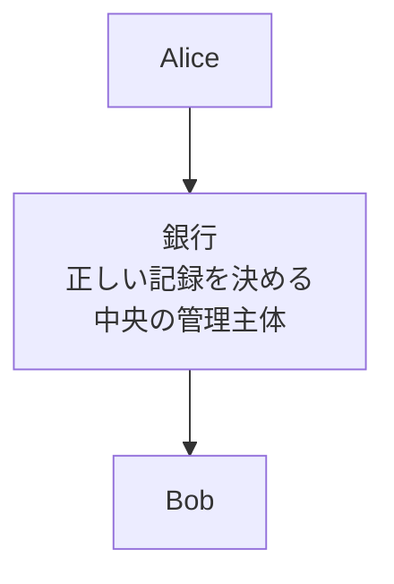
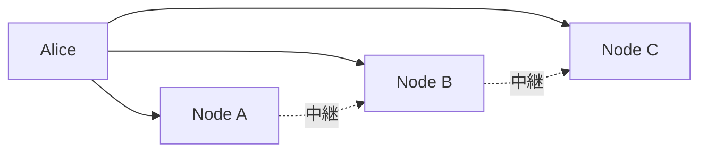

ブロックチェーンは、取引の履歴を参加者がそれぞれ複製して持ち、新しい取引をまとめた塊を順に繋いで追記していくデータの持ち方です。まとめた塊をブロックと呼び、ブロックの列がチェーンになります。Bitcoin は、この持ち方で送金の履歴を共有します。

ここで扱うのは、中央の管理主体が居ない環境で同じ履歴を共有するために何を決める必要があるのかと、Bitcoin がそれぞれへどの仕組みを当てているのかです。仕組みの原理と内部構造には立ち入らず、問題と名前の対応だけを示します。各仕組みの説明は、末尾の対応表から辿れます。

---

### 中央の管理主体がいる場合

銀行の送金では、口座の残高と入出金の履歴を銀行が管理します。内部で DB（Database、データベース）が複製・分散されていても、どの記録を正しいものとするかは銀行が決められます。利用者から見た経路を以下に示します。

上図の銀行が決めているのは 3 つです。送金を指示したのが口座の持ち主かどうか、同じ資金を使う指示のどちらを通すか、どの記録を正しい履歴とするかです。利用者は、この判断を銀行に任せる形で送金します。

判断を任せられる相手が居る事は、システムの前提として効いています。[Bitcoin の白書](https://bitcoin.org/bitcoin.pdf)は、金融機関を通さずに一方から他方へ直接送る支払いを目的として挙げています。この目的を選ぶと、上の 3 つを決める相手が居なくなります。

---

### 中央管理者がいないと何を決める必要があるか

Bitcoin のネットワークには、参加の登録も許可も要りません。ソフトウェアを動かせば誰でもノード（ネットワークへ参加する計算機）になれ、各ノードが履歴の複製を持ちます。取引は、ノードからノードへ転送されて全体へ広まります。

取引が広まる様子を以下に示します。

上図の Node A・Node B・Node C は対等で、どれか 1 台の判断が他を従わせるわけではありません。誰でも参加できるため、参加者の頭数も基準になりません。1 人が多数のノードを動かせるためです。決める必要があるのは、次の 7 つです。

- その資金を使う資格を示せるか
- 同じ資金が二重に使われていないか
- 取引をどんなデータとして表すか
- 支払いの条件をどう表すか
- 多数の取引をどうまとめるか
- どの履歴を採用するか
- データの変更や履歴の改変をどう検出し、どう困難にするか

Bitcoin は、これらへ別々の仕組みを当てています。

---

### 取引を表し、有効かを判定する仕組み

デジタル署名は、秘密鍵を持つ人だけが作れて、対になる公開鍵を持つ誰もが検証できるデータです。支払う人は取引へ署名を添え、各ノードは、その署名を使って出力を使う条件が満たされているかを検証します。確かめられるのは資格の有無で、支払った人が誰であるかは分かりません（[Digital Signature](../digital-signature/)）。

UTXO（Unspent Transaction Output、未使用の取引出力）は、コインの置き場である「出力」のうち、まだ使われていない物です。支払いは、過去の出力を丸ごと消費して新しい出力を作る形で表されます。同じ出力を使う取引が 2 つあれば、参照の重複としてデータに表れます。どちらを履歴へ残すかは、後述の proof of work と履歴の採用の規則が決めます（[UTXO](../utxo/)）。

Bitcoin Script は、出力に「使う条件」を書くための小さな言語です。代表的な条件は「この公開鍵に対応する署名を添えた者だけが使える」で、各ノードは、条件と証明の照合をプログラムの実行として行えます（[Bitcoin Script](../bitcoin-script/)）。

---

### 履歴をまとめ、書き換えを困難にする仕組み

ハッシュ関数は、任意の長さのデータを固定長の短い値へ変換する関数です。入力が 1 バイト変わるだけで出力が別の値になるため、データの変更が短い値の違いとして現れます。この性質が、以降の 3 つの仕組みの土台になります（[Hash Function](../hash-function/)）。

Merkle Tree は、多数のデータをハッシュ関数で畳み込み、1 つの値へまとめる木構造です。ブロックに入った取引の並びは、この値としてブロックヘッダへ反映されます。取引を 1 件でも書き換えると、ヘッダの値が変わります（[Merkle Tree](../merkle-tree/)、[Bitcoin Merkle Tree](../bitcoin-merkle-tree/)）。

ブロックは、取引をまとめて履歴へ追加する単位です。各ブロックのヘッダは直前のブロックのハッシュ値を持つため、過去のブロックを書き換えると、その後ろのブロックとの繋がりが崩れます（[Bitcoin Block](../bitcoin-block/)）。

proof of work（作業証明）は、ブロックを追加する条件として課される計算作業です。合格を得るには平均して大量の試行が要る一方、受け取った側は少ない計算で条件の成立を確かめられます。各ノードは、積まれた計算量が最も大きい列を正しい履歴として採用します。過去のブロックを書き換えるには、その後ろの作業をやり直す事になります（[Proof of Work](../proof-of-work/)）。

---

### 問題と仕組みの対応

ここまでに挙げた問題と、各仕組みの役割を整理すると以下になります。

| 決める必要がある事 | Bitcoin で使う仕組み | 詳細 |
| --- | --- | --- |
| その資金を使う資格を示せるか | デジタル署名 | [Digital Signature](../digital-signature/) |
| 取引をどう表し、二重使用を見分けるか | UTXO | [UTXO](../utxo/) |
| 支払いの条件をどう表すか | Bitcoin Script | [Bitcoin Script](../bitcoin-script/) |
| データの変更を短い値へ反映する | ハッシュ関数 | [Hash Function](../hash-function/) |
| 取引をまとめ、内容をヘッダへ反映する | Merkle Tree | [Merkle Tree](../merkle-tree/) / [Bitcoin Merkle Tree](../bitcoin-merkle-tree/) / [Merkle Tree Design](../merkle-tree-design/) |
| 履歴を追加する単位 | ブロックとチェーン | [Bitcoin Block](../bitcoin-block/) |
| 次のブロックを誰が追加し、どの履歴を採用するか | proof of work | [Proof of Work](../proof-of-work/) |
| 過去の履歴の書き換えを困難にする | ブロックのチェーンと proof of work | [Bitcoin Block](../bitcoin-block/) / [Proof of Work](../proof-of-work/) |

表の下 3 行は、1 つの仕組みで成り立つものではありません。ハッシュ関数は変更を短い値へ反映するだけで、値ごと書き換えられる場合には効きません。ブロックのチェーンと proof of work が積み重なって初めて、過去の履歴の書き換えが困難になります。

1 件の送金の中でこれらがどの順に登場するのかは、[Bitcoin Transaction Lifecycle](../bitcoin-transaction-lifecycle/) で扱います。Alice が Bob へ送る取引を 1 件だけ追う形で、ウォレットが組み立てる所からブロックへ取り込まれるまでを説明しています。
