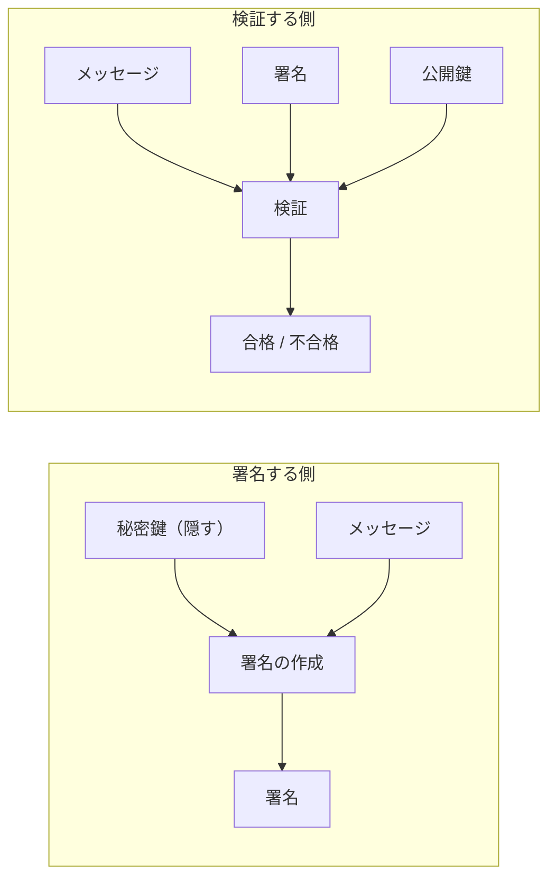
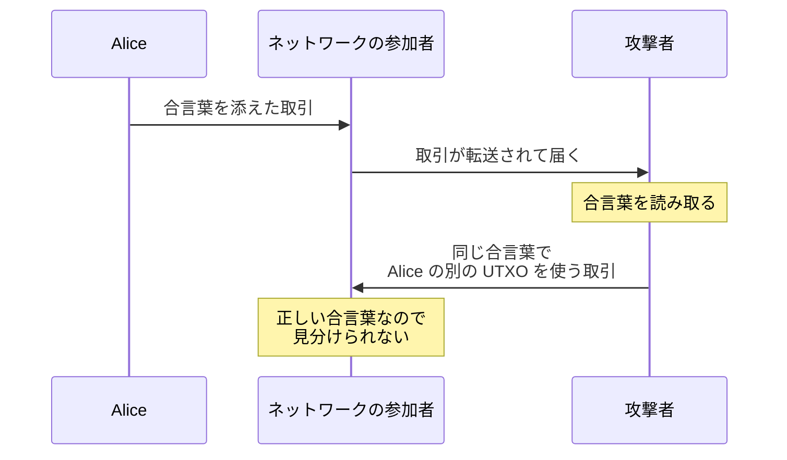
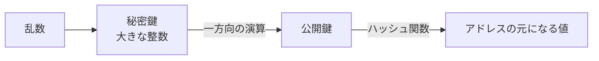
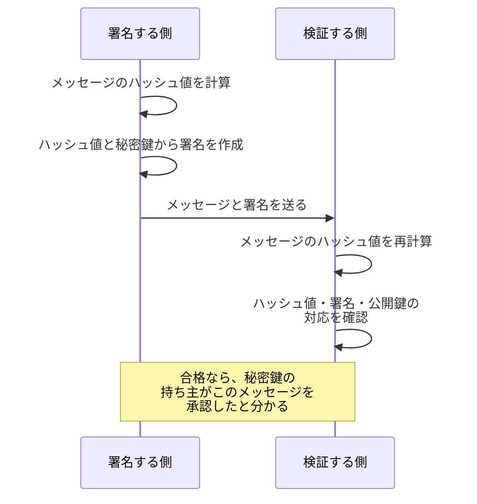
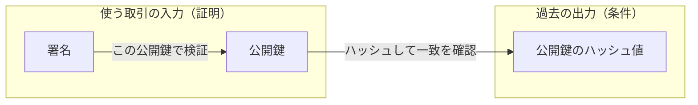

デジタル署名は、秘密鍵の持ち主だけが作れて、対になる公開鍵を持つ誰もが検証できるデータです。メッセージに署名を添えると、受け取った側は「秘密鍵の持ち主がこのメッセージを承認した事」と「メッセージが署名の後に書き換えられていない事」を確かめられます。ここでは署名の役割と使われ方を扱い、楕円曲線の数学的な計算手順は扱いません。

この仕組みを知りたくなる場面の代表は、[UTXO](../utxo/) のノートに出てきた「使う資格の証明」の実体を知りたい時です。Bob が自分宛の出力を使うには、出力に書かれた条件を満たす証明を入力へ添える必要がありました。その証明の代表がデジタル署名で、[Bitcoin の白書がコインを「電子署名のチェーン」と定義した](https://bitcoin.org/bitcoin.pdf)のも、所有の移転が署名の連なりとして表されるためです。

署名を作る側と検証する側の関係を以下に示します。

上図のとおり、検証する側が使うのはメッセージ・署名・公開鍵の 3 つだけで、全て公開して差し支えない情報です。秘密鍵は署名の作成にだけ要り、検証には登場しません。この非対称が、世界中の参加者がそれぞれ検証する Bitcoin の構成と噛み合います。

---

### なぜ署名が必要なのか

Bitcoin の取引は、誰でも作ってネットワークへ流せます。出力に「持ち主だけが使える」という制限を掛けるには、持ち主である事の証明を取引に含める必要があります。単純な案は、出力を作る時に合言葉を決めておき、使う時にその合言葉を添える方式です。

この案は、検証者が世界中に居る環境では成立しません。合言葉を添えた取引はネットワーク全体へ転送されるので、検証した参加者の全員が合言葉を知ります。合言葉が使い回せる情報である限り、見た人はそれを使って残りのコインを奪う取引を作れます。合言葉方式が壊れる流れを以下に示します。

上図の問題は、証明そのものが再利用できる点にあります。合言葉のハッシュ値を出力に置き、使う時に原文を見せる改良も考えられます。この改良は事前に合言葉を隠せるものの、使う瞬間には原文が公開されます。その取引がブロックへ入る前に、公開された原文だけを流用し、宛先を自分宛へ書き換えた別の取引を作れてしまいます。

2 つの案に共通する穴は、証明が「誰が・どの取引で使うか」と結び付いていない事です。必要なのは、見せても悪用できない証明で、デジタル署名は証明（署名）をメッセージの中身と結び付ける事でこれを実現します。署名は「このメッセージについての証明」としてしか通用せず、別の取引に流用しても検証で不合格になります。秘密鍵そのものはネットワークへ一度も流れません。

---

### 鍵ペア - 公開する鍵と隠す鍵

署名の土台は、対になる 2 つの鍵です。秘密鍵は乱数から作る大きな整数で、持ち主だけが保管します。公開鍵は秘密鍵から一方向の演算で導出した値で、誰に見せても構いません。

Bitcoin の秘密鍵は 256 ビットの整数なので、取り得る値はおよそ 2 の 256 乗通りあります。[Hash Function](../hash-function/) の試行回数の表で見た規模で、偶然同じ秘密鍵が生成される事や、総当たりで当てられる事は心配しなくてよい大きさです。なお、鍵の総数と、公開鍵から秘密鍵を求める難しさは別の数字になります。

代表的な形式での、鍵とアドレスの導出の流れを以下に示します。図の矢印は導出の向きで、逆向きの計算は現実的にできません。

秘密鍵から公開鍵を計算するのは一瞬で、公開鍵から秘密鍵を求める問題は楕円曲線離散対数問題（Elliptic Curve Discrete Logarithm Problem、ECDLP）と呼ばれ、現実的な計算量では解けないと考えられています。逆向きが困難という見た目は [Hash Function](../hash-function/) の一方向性と似ているものの、根拠になっている問題は別です。ここで使う曲線と演算の具体は、後半の「Bitcoin での署名」で触れます。

上図の最後の段が、[UTXO](../utxo/) で触れた「アドレスは条件を組み立てるための情報を符号化した文字列」の中身です。形式によっては、公開鍵をハッシュ関数で短縮した値がアドレスの材料になります。

鍵ペアは誰の許可も無しに手元で作れます。銀行口座の開設のような登録の手続きは無く、乱数から秘密鍵を作った瞬間に、対応するアドレス宛のコインを受け取る準備が整います。1 人 1 個という決まりも無く、ウォレットは多数の鍵ペアを内部で管理します。[UTXO](../utxo/) の残高計算で「手元の鍵で使える UTXO を拾い出し」と書いたのは、この鍵の束が前提です。

---

### 署名と検証 - 公開情報だけで確かめる

署名の対象は、メッセージそのものではなくメッセージのハッシュ値です。署名の計算は決まった大きさの数を相手にするので、どんな大きさのメッセージも、まず固定長のハッシュ値へ要約してから署名します。署名の作成は「メッセージのハッシュ値と秘密鍵から署名を計算する」処理で、検証は「メッセージのハッシュ値・署名・公開鍵の 3 つが対応しているかを確かめる」処理です。流れを以下に示します。

上図の検証が合格した時に分かるのは、「対応する秘密鍵の持ち主がこのメッセージに署名した」事と、「メッセージが署名の後に書き換えられていない」事の 2 つです。メッセージを 1 バイトでも書き換えるとハッシュ値が変わり、署名との対応が崩れて不合格になります。取引の文脈では、この 2 つが「出力の持ち主が、この内容の取引を承認した」事の検証になります。署名の対象に含まれた宛先や金額を後から書き換えれば署名が崩れるので、承認していない内容へ書き換えた支払いは通りません。

冒頭の合言葉方式との違いも、ここで回収できます。合言葉は何に添えても同じ文字列なので、見た人が再利用できました。署名はメッセージごとに別の値になり、公開しても、別のメッセージに対する署名を作る材料にはなりません。

ハッシュ値を経由する分だけ、署名の安全性はハッシュ関数の性質にも依存します。同じハッシュ値を持つ別のメッセージを作れるなら、片方への署名がもう片方にも通用してしまいます。[Hash Function](../hash-function/) の第二原像計算困難性と衝突耐性は、署名の流用を防ぐ土台としてここで効いています。

検証が保証しない事も 1 つ押さえておきます。署名は鍵とメッセージの対応を示すだけで、その鍵の持ち主が現実の誰なのかは示しません。鍵と人を結び付けるには証明書のような別の仕組みが要り、ここでは扱いません。Bitcoin はこの結び付けを必要としない設計で、署名を求める条件が付いた出力では、鍵を持っている事それ自体が、コインを使う資格になります。

---

### Bitcoin での署名 - ECDSA と secp256k1

Bitcoin の署名には、ECDSA（Elliptic Curve Digital Signature Algorithm、楕円曲線を使うデジタル署名方式）が使われます。楕円曲線には複数の規格があり、Bitcoin は [secp256k1](https://en.bitcoin.it/wiki/Secp256k1) という曲線を使います。秘密鍵は 256 ビットの整数で、この曲線の上の演算で公開鍵を導出します。

P2PKH（Pay to Public Key Hash）や P2WPKH（Pay to Witness Public Key Hash）などの代表的な形式では、署名と公開鍵が「使う資格の証明」として入力側に置かれます。P2PKH では入力の scriptSig という欄に、P2WPKH では [Bitcoin Merkle Tree](../bitcoin-merkle-tree/) で説明した witness 領域に置かれます。

これらの形式では、出力の条件に公開鍵のハッシュ値が置かれ、使う側は公開鍵と署名の 2 つを出します。証明の出し方は形式ごとに違い、公開鍵を入力側で示さない形式もあります。検証の噛み合わせを以下に示します。

上図の検証者は、入力の公開鍵をハッシュして出力の値と一致する事と、署名がその公開鍵での検証に合格する事の 2 つを確かめます。条件の書き方の仕組みは [Bitcoin Script](../bitcoin-script/) で扱います。

署名の対象には、署名自身を含められません。署名を計算する時点で、その値はまだ存在しないためです。Bitcoin では、決められた規則に従って、取引の一部と、使用する出力の情報から署名対象のハッシュ値を組み立てます。

どの入力・出力を署名の範囲に含めるかは sighash type という指定で選べます。最も広く使われる指定では取引の全ての入力と出力が範囲に入り、通常の支払いで宛先や金額を書き換えると署名が崩れるのはこのためです。範囲を狭める指定もあり、外した部分は後から書き換えられても署名は崩れません。組み立ての規則は形式ごとに違い、ここでは扱いません。

1 つのメッセージに対する正しい署名は、1 通りではありません。ECDSA には、秘密鍵を知らない第三者が、有効な署名の値を別の有効な値へ作り替えられる余地があります。署名の値だけが変わっても検証は合格し続けるため、署名を含めて txid を計算すると、取引の内容が同じまま識別子だけが変わります。[Bitcoin Merkle Tree](../bitcoin-merkle-tree/) で説明した transaction malleability の一因がこれで、witness が txid の計算から外されている背景になっています。

なお、2021 年の Taproot という仕様変更で、ECDSA に加えて Schnorr 署名という別の署名方式も使えるようになりました。役割は同じ「使う資格の証明」で、方式の違いはここでは扱いません。

---

### 利点

以下は、資格の証明をデジタル署名で表した事で得られる性質です。

- 検証に使う物が全て公開情報で、世界中の参加者が独立に検証できる
- 署名がメッセージの中身と結び付いており、別の取引へ流用できない
- 秘密鍵を一度も見せずに、持ち主である事を証明できる
- 鍵ペアを手元で作れるので、口座開設のような登録の手続きが要らない

---

### 欠点

以下は、資格の全てを鍵に集約した事の裏返しとして現れる制約です。

- 秘密鍵を失うと、対応する UTXO を使う手段が失われる（再発行の仕組みが無い）
- 秘密鍵が漏れると、漏れた先の誰でも正当な署名を作れる（取り消しの仕組みが無い）
- 署名は鍵とメッセージの対応しか示さず、鍵の持ち主が誰かは別の問題として残る
- ECDSA は署名のたびに使う乱数の質に敏感で、同じ乱数を別のメッセージへ 2 回使うと秘密鍵が計算で求まる

1 番目と 2 番目は、中央の管理者を置かない事の代償です。パスワードの再設定にあたる救済の窓口が存在しないため、秘密鍵の保管そのものが利用者の責任になります。暗号を破らなくても、秘密鍵の保管場所を突けばコインを動かせるので、攻撃の焦点は鍵の管理へ集まります。
