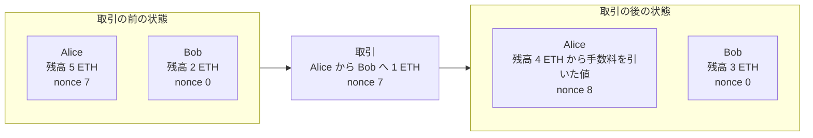
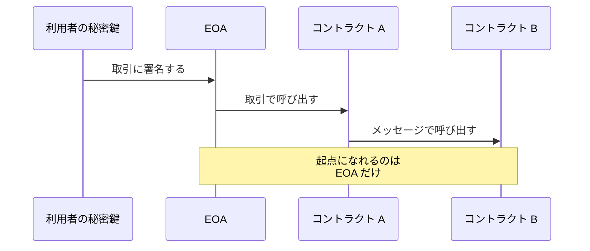
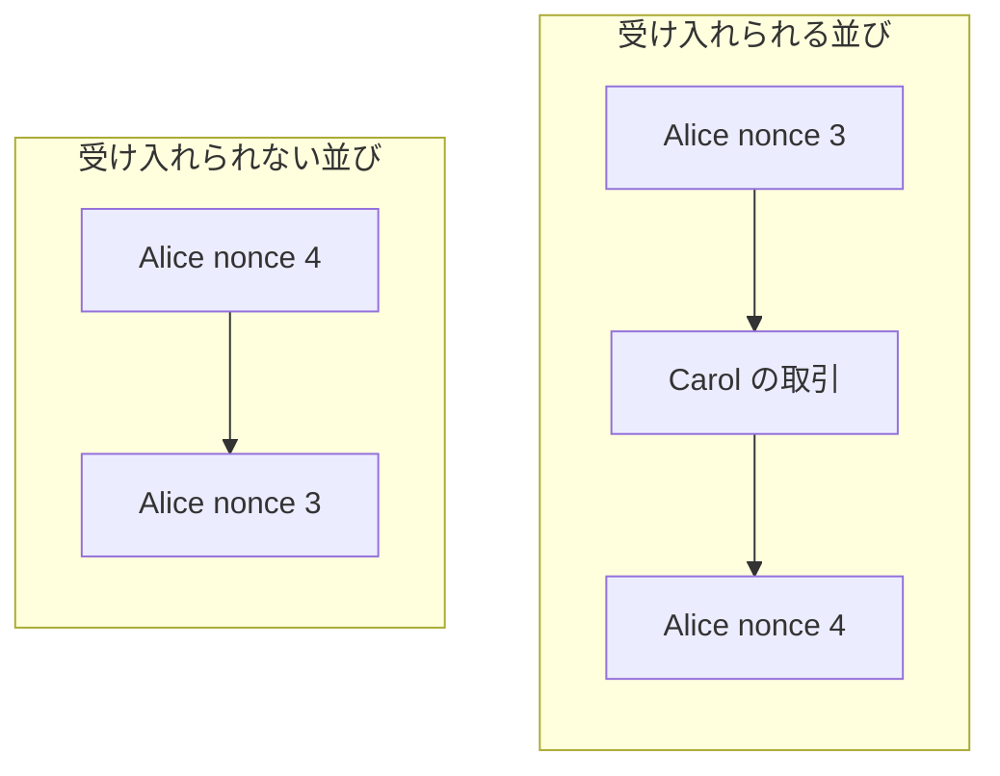
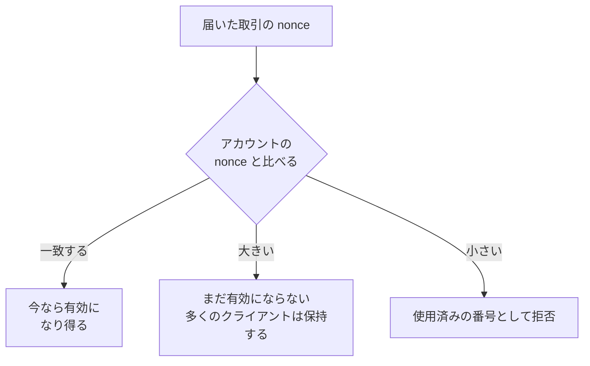
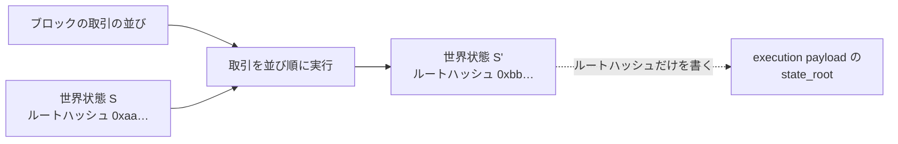

アカウントモデル（account model）は、アドレスごとに残高などの状態を保存し、取引がその状態を書き換える形で送金を表すモデルです。Ethereum が採用しています。[UTXO](../utxo/) で説明した Bitcoin の表し方には残高という保存された値が無く、コインは使い切りの出力として存在します。同じ送金でも、アカウントモデルは保存された数値を書き換え、UTXO モデルは出力を作り直します。

この違いが表に出るのは、ウォレットから送金を続けて出した時ではないでしょうか。2 件の送金を短い間隔で出すと、ウォレットが付けた通し番号（nonce）の小さい方から順に取り込まれ、1 件目が取り込まれないうちは 2 件目も待たされます。同じアカウントから自動で取引を出すサービスを書くなら、この番号を誰が採番するのかを決める事になります。

本ノートでは、アカウントが持つ状態と、取引がその状態をどう変えるのかを扱い、EVM（Ethereum Virtual Machine）の命令やスマートコントラクトの書き方、手数料の決まり方は扱いません。ブロックを繋いで履歴を作る部分も対象外です。

1 件の送金がアカウントの状態をどう書き換えるのかを以下に示します。

上図の Bob のように受け取るだけのアカウントでは、nonce は動きません。送り主の残高からは、送る 1 ETH に加えて手数料も引かれます。手数料は、実行に要した計算量を gas という単位で計り、その量と単価から決まります。

---

### アカウントが持つ 4 つの状態

Ethereum のアカウントは、アドレスに対応付けられた 4 つの項目で表されます。公式ドキュメントが挙げる項目を以下に示します。

| 項目 | 何を表すか |
| --- | --- |
| nonce | 取引の順序付けやコントラクト作成に使われるカウンタ。通常の EOA では取引の送信ごとに増える |
| balance | そのアドレスが持つ wei の量。1 ETH は `10^18` wei |
| storageRoot | そのアカウントの記憶領域の中身を符号化した Merkle Patricia Trie のルートノードのハッシュ |
| codeHash | EVM 上のそのアカウントのコードのハッシュ |

公式ドキュメントは 1 行目の nonce を「[the number of transactions sent from an externally-owned account or the number of contracts created by a contract account](https://ethereum.org/en/developers/docs/accounts/)」（外部所有アカウントから送られた取引の件数、またはコントラクトアカウントが作ったコントラクトの件数）と定義しています。

通常の EOA では、この理解で足ります。EIP-7702 の委任コードを使う EOA では実行中の処理で nonce がさらに進む場合があるので、送った取引の件数と常に一致する訳ではありません。

3 行目の記憶領域には、コードが実行のたびに読み書きし、次の実行にも残したい値が入ります。例えば、トークンの残高表がここに置かれます。中身をまとめる Merkle Patricia Trie の構造は、後の「世界状態と execution layer の `state_root`」で扱います。

4 つの項目は、どのアカウントにもあります。従来の EOA では記憶領域が空で、`codeHash` も空のコードを表す値でした。コードと記憶領域を実際に使うのは主にコントラクトアカウントで、後の「EOA とコントラクトアカウント」で扱う EIP-7702 の後は、EOA も委任を通じてコードと自分の記憶領域を使い得ます。

---

### EOA とコントラクトアカウント

アカウントには 2 種類あります。利用者が秘密鍵で制御する EOA（Externally Owned Account、外部所有アカウント）と、アドレスにコードが結び付いたコントラクトアカウント（contract account）です。コントラクトアカウントのコードは、そのアカウントへの呼び出しを受けた時に実行されます。

2 種類の違いは、取引を起こせるかどうかに出ます。公式ドキュメントは、コントラクトアカウントについて「[Can only send messages in response to receiving a transaction](https://ethereum.org/en/developers/docs/accounts/)」（取引を受け取った事に応じてメッセージを送る事しかできない）と書いています。署名して送り出す取引の起点になれるのは EOA だけです。

1 件の取引が 2 つのコントラクトへ届くまでを以下に示します。

上図でコントラクト A からコントラクト B への呼び出しは、EOA が出した取引の実行の中で起きます。ここでのメッセージは、取引と違って署名も nonce も持たず、実行の中でコントラクトから別のコントラクトへ渡されます。コントラクト B は取引を直接受け取らずに、このメッセージでコードが動きます。

従来は、コードの有無を 2 種類の見分けの手掛かりにできました。公式ドキュメントも、EOA について「[the codeHash field is the hash of an empty string](https://ethereum.org/en/developers/docs/accounts/)」（codeHash の項目は空文字列のハッシュになる）と書いています。

今の Ethereum では、コードが空なら EOA という判定は成り立ちません。2025 年に実施された Pectra というプロトコルの更新で [EIP-7702](https://eips.ethereum.org/EIPS/eip-7702) が有効になり、EOA は指定したコントラクトのコードへ自分の取引の実行を委ねられるようになりました。EIP は Ethereum Improvement Proposal の略で、仕様変更の提案を指します。

委任先を指す短いデータがコードの項目へ書かれるため、コードを持つ EOA が存在します。委任先のコードは EOA のアドレスで動くため、読み書きする記憶領域も EOA のものになります。概念上の違いは、EOA が秘密鍵による認証を起点に取引を送り出せるのに対し、コントラクトアカウントはコードの実行によって動く点にあります。コードや記憶領域を使っているかどうかだけでは、2 種類を見分けられません。

---

### nonce が防ぐ事と、制約する順序

残高を引いて足すだけを取引の内容にすると、同じ取引データをもう一度ネットワークへ流せば、同じ支払いを再び実行できます。[署名](../digital-signature/)は取引のデータに対して作られるため、データが同じなら検証を何度でも通ります。

[UTXO](../utxo/) では、この再生が構造として止まります。取引が消費する出力は outpoint で名指しされており、一度消費された出力は集合から消えるため、同じ取引は 2 度成立しません。アカウントモデルには消費される対象が無く、更新される残高があるだけです。

その役割を担うのが nonce です。以下では、通常の EOA が取引を送る場合を扱い、EIP-7702 の委任コードの実行で nonce が追加で変わる場合は除きます。取引には送り主の nonce を書く項目があり、その値は、送り主のアカウントが今持っている nonce と一致している必要があります。取り込まれると 1 増えるため、同じ取引をもう一度流しても古い番号として弾かれます。

『Mastering Ethereum』第 2 版の第 6 章は「[every single transaction is unique, even when sending the same amount of ether to the same recipient address multiple times](https://masteringethereum.xyz/chapter_6.html)」（同じ額を同じ宛先へ何度送っても、取引はどれも別の物になる）と説明しています。

止まるのは同じチェーンでの再送です。別のチェーンへの再生は、chain ID を署名の対象に含める事で防ぎます。この仕組みを legacy transaction へ導入したのが [EIP-155](https://eips.ethereum.org/EIPS/eip-155) で、現在の typed transaction も chain ID を署名の対象に含みます。

#### nonce が増えるのはどの時点か

nonce の一致は、取引が有効である条件の 1 つです。このほかに署名が有効か、手数料と送る額を払える残高があるかなども検査されます。ここを通らない取引はブロックへ入れられず、アカウントの nonce も動きません。

実行が始まった後にコードが `REVERT` した場合や gas を使い切った場合、その取引による状態の変更は取り消されます。それでも送り主の nonce の増加と手数料の支払いは残るため、次に有効な番号は 1 つ進んだままです。

#### ブロックの並びが順序を決め、nonce が同じ送り主の中を縛る

実行の順序を決めているのは、ブロックに並んだ取引の並びです。全てのノードがその並びのとおりに実行するため、どのノードへ先に届いたかに関わらず、結果は全員で一致します。nonce が無くても、並びさえ決まれば実行の順序は定まります。

nonce が制約するのは、同じ送り主が出した取引どうしの前後だけです。ブロックを作る参加者は取引の並べ方を決められます。ただし、同じ送り主の取引を番号の小さい順に置かない並びは、受け入れられません。

同じ送り主の 2 件を含む 2 通りの並びを以下に示します。

上図の受け入れられる並びでは、Alice の 2 件の間に別の送り主の取引が入っています。受け入れられない並びの先頭にある nonce 4 は、その時点の Alice の nonce（3）と一致しないため、取引として有効になりません。

#### 飛んだ番号と、同じ番号の競合

番号が飛んだ取引も、その時点では有効になりません。nonce 0 の取引の後に nonce 2 を送ると、欠けた 1 が取り込まれるまで、2 はブロックへ入りません。同章は「[The Ethereum network processes transactions sequentially based on the nonce](https://masteringethereum.xyz/chapter_6.html)」（Ethereum のネットワークは nonce に従って取引を順に処理する）と説明しています。

通常の EOA では、多くのクライアントがその間 mempool へ置いて待ちます。保持そのものはコンセンサス規則ではなくクライアントの方針で、保持する件数や時間の上限を超えると捨てられます。未確認の取引の置き場の性質は、Bitcoin を例に [Mempool](../mempool/) で扱っています。

届いた取引の nonce と、送り主のアカウントの nonce を比べた結果の行き先を以下に示します。

上図で「まだ有効にならない」へ落ちた取引は、欠けた番号の取引が取り込まれた時点で有効になり得ます。

同じ番号を 2 件へ付けた場合、両方が同じチェーンへ入る事はありません。片方が取り込まれた時点でアカウントの nonce が進み、もう片方は古い番号になります。どちらが残るかはコンセンサス規則では決まらず、クライアントの方針とブロックを作る参加者の選択で決まります。

送った取引の差し替えは、この性質を使います。多くのクライアントは、手数料を一定以上引き上げた後発の取引で、同じ番号の先着を置き換えます。同じアカウントから複数のプログラムが同時に取引を出すと、番号の重複や欠けが起きます。冒頭で挙げた採番の設計はここに効き、1 か所へ集めるなどの調整が要ると考えられます。

---

### 世界状態と execution layer の `state_root`

全アカウントの現在の状態をまとめた物を世界状態（world state）と呼びます。公式ドキュメントは「[Instead of a distributed ledger, Ethereum is a distributed state machine](https://ethereum.org/en/developers/docs/evm/)」（Ethereum は分散台帳ではなく分散状態機械である）と書いています。取引は、この状態を次の状態へ移す入力です。

世界状態は、アドレスを `keccak256` でハッシュした値を経路に使う trie で表されます。現在の Ethereum の本番ネットワーク（Mainnet）では、modified Merkle Patricia Trie が使われます。キーで経路が決まる trie を Merkle Tree と組み合わせた構造の性質は、[Merkle Tree Design](../merkle-tree-design/) で扱っています。

ブロックに入るのは状態そのものではありません。実行した後の状態と、そこから書かれる値の関係を以下に示します。

上図の S' はノードが自分で保持し、外へ書かれるのは 1 つのルートハッシュだけです。公式ドキュメントは、この項目を「[root hash for the global state after applying changes in this block](https://ethereum.org/en/developers/docs/blocks/)」（このブロックでの変更を適用した後の、全体の状態のルートハッシュ）と説明しています。

`state_root` は、取引の並びを含む execution payload に書かれます。合意層（consensus layer）のブロックにも同じ名前の項目があるため、ここで扱うのは EVM の状態を代表する execution layer の `state_root` だと断っておきます。

[公式ドキュメント](https://ethereum.org/en/developers/docs/blocks/)は、全てのクライアントが execution payload の取引を実行し直し、得られた状態が `state_root` と一致する事を確かめると書いています。一致しなければ、そのブロックは受け入れられません。

[Bitcoin Block](../bitcoin-block/) で説明した Bitcoin のブロックヘッダは、そのブロックに入った取引の並びを代表する値を持っていました。Ethereum の execution layer では、取引の並びを代表する値に加えて、実行し終えた後の状態を代表する値を持ちます。ハッシュした値から経路が一意に決まるため、あるアカウントが存在しない事も 1 本の経路で示せます。

---

### 利点

以下は、アカウントごとに状態を保存し、連番の nonce で送り主ごとの順序を縛る Ethereum の設計から得られる性質です。

- アドレスを 1 つ引けば残高が読めるため、支払いのたびに使う入力を選ぶ処理が要らない
- 同じチェーンでの同じ取引データの再送が、通し番号の不一致で弾かれる
- 同じ送り主が出した取引の前後が、ネットワークの到着順に関わらず番号どおりに決まる
- 実行をまたいで残る記憶領域をアカウントが持てるため、コードが状態を読み書きできる

---

### 欠点

以下は、同じ設計の裏返しとして現れる制約です。

- 番号を送り主が決めるため、同じアカウントから並行して取引を出すと調整が要る
- 番号が 1 つ欠けると、後続の取引がその番号の取り込みまで有効にならない
- 取引の結果が実行時点の状態で変わるため、取引のデータだけを見ても結果が決まらない
- ノードが保持する状態が、使われているアカウントと記憶領域の分だけ大きくなる

1 つ目と 2 つ目は、同じ送り主の取引を番号で 1 本に並べる事の裏返しです。番号を連番にせず、別の方法で取引の重複を弾くアカウントモデルもあり、この制約はモデルではなく nonce の決め方から来ています。

4 つ目は、状態の持ち方の違いから来ます。UTXO では、検証に使う UTXO 集合から、消費された出力を外せます。アカウントモデルでは、実行に必要なアカウントと記憶領域の状態を保持し続ける事になります。記憶領域の値は上書きも 0 への書き戻しもできるので、個々の書き込みが永久に残る訳ではありません。どこまでを保持するのかは、モデルではなく Ethereum の状態の設計で決まります。

---

### UTXO モデルとの違い

2 つのモデルは、コインの所在をどう表すかで分かれます。違いを以下に示します。

| | アカウントモデル | UTXO モデル |
| --- | --- | --- |
| 資産の表し方 | アカウントの状態として残高を保存する | 使い切りの出力として持つ |
| 残高の求め方 | アカウントの項目を読む | 手元の鍵で使える UTXO を合計する |
| 支払い | 残高から金額を引き、宛先の残高へ足す | 出力を使い切り、お釣りの出力を作る |
| 競合の扱い | 同じ送り主の同じ通し番号の取引が両立しない | 同じ outpoint への参照が両立しない |
| 同じ取引の再送 | アカウントの通し番号が進んでいるため無効 | 参照先が使用済みになり無効 |

表に入らない差が、取引を組み立てる手順にあります。UTXO では、支払いのたびに手元の出力を選んで合算し、余りをお釣りの出力として作ります。アカウントモデルでは、この選択とお釣りの出力を作る手順が要りません。

どちらのモデルでも、取引の検証には現在の状態が要ります。競合が同じ番号として表れるか、同じ outpoint への参照として表れるかも、状態の表し方から決まります。UTXO から見た同じ比較は [UTXO](../utxo/) にも置いてあります。
