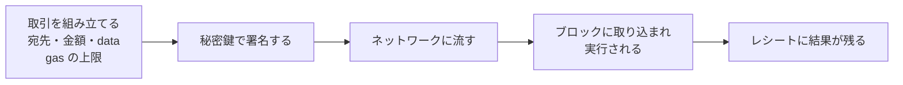
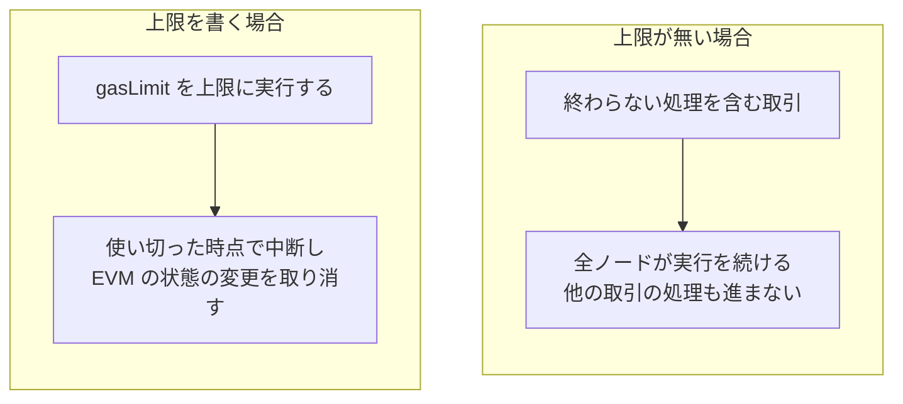
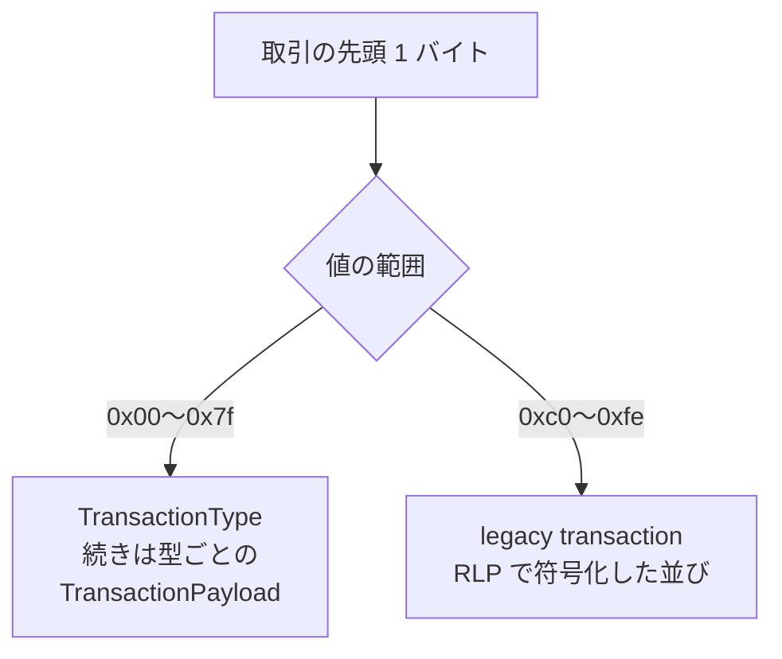
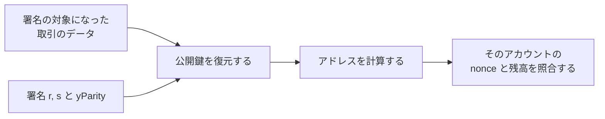
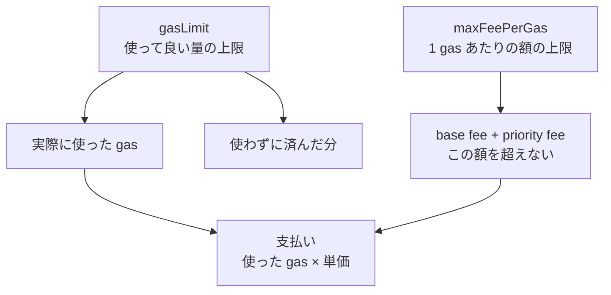
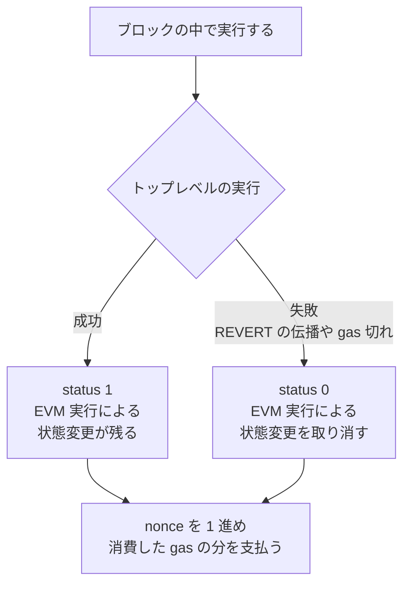

取引（transaction）は、EOA（Externally Owned Account、外部所有アカウント）が秘密鍵で署名した指示のデータです。[公式ドキュメント](https://ethereum.org/en/developers/docs/transactions/)も、取引をアカウントからの、暗号で署名された指示だと定義しています。送金も、コントラクトの呼び出しも、コントラクトの作成も、この 1 つの形で表されます。

コントラクトとは、アドレスの下にコードと storage（値を保存する領域）を持つアカウントです。取引の宛先がコードを実行するアカウントであれば、そのコードが EVM（Ethereum Virtual Machine）で実行されます。

読者がこの形に触れるのは、ウォレットの確認画面ではないでしょうか。金額のほかに「ガスの上限」や「最大手数料」が並び、実行に失敗した取引からも手数料が引かれます。どちらも、取引が送金の指示にとどまらず、宛先のコードを動かす依頼にもなる事から出てきます。前者は「手数料は使った gas と単価で決まる」、後者は「実行の結果はレシートに残る」でこの場面に戻ります。

本ノートでは、1 件の取引に何が書かれ、送り主がどう確かめられ、手数料がどう決まるのかを扱います。アカウントが持つ状態と nonce による順序は [Ethereum Account Model](../ethereum-account-model/) で扱っており、EVM の命令とコントラクトの書き方は扱いません。

取引が作られてから結果が残るまでを以下に示します。

上記の図で秘密鍵を使うのは、署名の段階だけです。中継するノードが中身を書き換える事自体はできます。書き換えた取引がどう扱われるのかは、「送り主は署名から復元される」で扱います。

---

### なぜ取引に gas の上限を書くのか

Bitcoin の取引は、消費する出力と作る出力を並べたデータで、検証に必要な手間が中身からほぼ決まります（[UTXO](../utxo/)）。Ethereum の取引は宛先のコードを動かせるため、何段階の処理になるのかがデータを見ただけでは決まりません。

素朴に「実行が終わるまで動かす」形にすると、終わらない処理を含む取引を 1 件流すだけで、全ノードの計算を占有できます。実行の量を測る単位が gas で、公式ドキュメントは「[the unit that measures the amount of computational effort required to execute specific operations](https://ethereum.org/en/developers/docs/gas/)」（特定の操作の実行に要する計算量を測る単位）と定義しています。

[同じページ](https://ethereum.org/en/developers/docs/gas/)は、1 件あたりの上限を課す理由として、コードの中の意図しない、または悪意のある無限ループなど、計算の浪費を防ぐ事を挙げています。送り主は、その取引が使って良い gas の上限を自分で書きます。

上限の有無で実行がどう変わるのかは、以下の通りです。

処理が終わらなくても、実行は gasLimit で止まります。止まった取引の手数料は「手数料は使った gas と単価で決まる」で扱います。

---

### 取引に書かれる項目

以降では、Type 2 transaction を中心の例にし、その実行に使う gas（execution gas）と手数料を扱います。EIP-4844 が足した blob gas とその手数料は対象外とします。

仕様変更の提案である EIP（Ethereum Improvement Proposal）の 1 つ、[EIP-1559](https://eips.ethereum.org/EIPS/eip-1559) が手数料を base fee と priority fee の 2 段に分け、その形の取引に付いた先頭バイトが 0x02 です。1 件の取引が持つ主な項目は以下の通りです。

| 項目 | 何を決めるか |
| --- | --- |
| nonce | 送り主のアカウントの通し番号 |
| to | 宛先のアドレス。空のバイト列にすると新しいコントラクトの作成になる |
| value | 宛先に送る wei の量 |
| data | 宛先のコードに渡す任意の長さのデータ |
| gasLimit | この取引が使って良い gas の上限 |
| maxFeePerGas | 1 gas あたりに払う額の上限 |
| maxPriorityFeePerGas | 1 gas あたりで、ブロックを作る参加者に渡す分の上限 |
| accessList | 実行中に触る予定のアドレスと storage key を先に申告する。使わない場合は空のリストにする |
| chainId | どのチェーン向けの取引か |
| 署名 | 送り主が承認した証拠。`r`、`s` と、公開鍵の復元に使う `yParity` |

nonce が何を防ぎ、どの範囲の順序を縛るのかは [Ethereum Account Model](../ethereum-account-model/) で扱っています。value と data は独立していて、`value` が 0 でも `data` を渡してコントラクトを呼べます。

accessList は、列挙するだけで安くなる項目ではありません。列挙した分にも gas が掛かります。その代わりに、申告したアドレスと storage key は最初から触った事のある扱い（warm）になり、実行中のアクセスが安く済みます。

EIP-2930 も、一覧に無い所へのアクセスは「[possible, but become more expensive](https://eips.ethereum.org/EIPS/eip-2930)」（可能。ただし、より高くつく）と書かれています。実行中に触らない項目まで並べると、申告の分だけ gas が増えます。

項目の並びは 1 通りではありません。EIP-2718 は「[`TransactionType || TransactionPayload` is a valid transaction](https://eips.ethereum.org/EIPS/eip-2718)」（TransactionType と TransactionPayload を繋いだ物が有効な取引になる）と書いており、先頭の 1 バイトで中身の読み方が切り替わります。

先頭のバイトで読み方が分かれる様子は以下の通りです。

上記の図で TransactionType を持つ側が typed transaction で、Type 2 もここに入ります。この分岐があるため、新しい項目を持つ型を足しても、古い形の取引はそのまま検証できます。RLP（Recursive Length Prefix）は、Ethereum がデータを並べる時に使う符号化の規則です。

0x80 から 0xbf で始まるデータは、どちらの形にも当てはまりません。0xff は将来の拡張用に予約されています。

型はほかにもあります。legacy transaction は、maxFeePerGas と maxPriorityFeePerGas の代わりに gasPrice を 1 つ持ちます。chain ID を独立した項目としては持たず、EIP-155 に従う物では署名の中に埋め込みます。

[EIP-4844](https://eips.ethereum.org/EIPS/eip-4844) の blob transaction は、blob と呼ばれる大きなデータを伴い、実行用の gas とは別に blob gas という単位で課金されます。同じ EIP はこれを通常の gas から独立した新しい種類の gas だと書いており、blob gas と blob fee はここでは扱いません。

EIP-7702 の型もあります。EOA がコードの実行先を指定できるようにする仕組みで、EOA とコントラクトの境界には、この型による例外があります。

---

### 送り主は署名から復元される

上の表に、送り主のアドレスを書く項目がありません。取引のデータには送り主が入っておらず、署名から復元します。[『Mastering Ethereum』第 2 版の第 6 章](https://masteringethereum.xyz/chapter_6.html)も、legacy transaction の形を説明する中で、EOA の公開鍵が ECDSA 署名の `v`、`r`、`s` の 3 つの値から導けると書かれています。公開鍵からアドレスが決まるため、送り主も決まります。

ここでの復元は、手元の公開鍵で署名を検証する操作とは別です。楕円曲線を使う署名方式である ECDSA では、署名と対象のデータから公開鍵の候補が求まり、legacy transaction の `v` や typed transaction の `yParity` が、どれを使うのかを指します。署名の計算は [Digital Signature](../digital-signature/) で扱っています。

署名から送り主が決まるまでは以下の通りです。

上記の図で、取引のデータを 1 バイトでも書き換えると、署名の対象が変わります。元の署名をそのまま付けても、復元されるのは元の送り主とは別のアドレスになるか、復元そのものが失敗します。どちらにしても、元の送り主が承認した取引としては成立しません。

署名済みの取引をそのまま別のチェーンに流されると、送り主が承認していない送金が成立してしまいます。これを防ぐために、署名の対象に chain ID を入れます。

入るかどうかは取引の形で変わります。typed transaction と、[EIP-155 に従う legacy transaction](https://eips.ethereum.org/EIPS/eip-155) では、署名のためのハッシュを計算する対象に chain ID を含めます。同じ EIP は、chain ID を含めない以前の署名も引き続き有効だと書いており、その形の取引に chain ID は入りません。チェーンをまたいだ再利用の詳細は [Ethereum Account Model](../ethereum-account-model/) で扱っています。

---

### 手数料は使った gas と単価で決まる

送り主が払う額は、`使った gas × (base fee + priority fee)` で決まります。base fee はブロックごとに決まる 1 gas あたりの最低額で、priority fee はブロックを作る参加者に渡す上乗せ分です。[公式ドキュメント](https://ethereum.org/en/developers/docs/gas/)は、base fee の分が焼却されて流通から取り除かれ、priority fee の分が参加者に渡ると説明されています。base fee がブロックごとにどう調整されるのかは扱いません。

取引に書く 2 つの上限は、この式の別々の場所に効きます。gasLimit は使う量の上限で、maxFeePerGas は 1 gas あたりの額の上限です。delegation の無い通常の EOA に data 無しで ETH を送るだけなら 21,000 gas で、data を付けたりコードが動いたりすると増えます。

実際に渡る priority fee は、maxPriorityFeePerGas と、maxFeePerGas から base fee を引いた残りのうち、小さい方になります。base fee が maxFeePerGas を超えている間、その取引は取り込まれません。2 つの上限が支払いに効く形は以下の通りです。

実行が gasLimit に届かずに終われば、使わずに済んだ分は手数料になりません。それでも取引を出す時点では、`gasLimit × maxFeePerGas + value` の残高が必要です。ウォレットの確認画面に出る「最大手数料」は、実際に引かれる額ではなく、この `gasLimit × maxFeePerGas` を指します。

実行を始めた後、途中で gas を使い切った場合は扱いが変わります。公式ドキュメントは「[the EVM will revert any changes, but all the gas provided will still be consumed for the work performed](https://ethereum.org/en/developers/docs/gas/)」（EVM は変更を全て取り消す。ただし、行った処理の分として、渡された gas は全て消費される）と書かれています。

gasLimit の分の gas が消費され、その gas に対する手数料を払う事になります。しかし、失敗した実行がいつもこの形になる訳ではありません。`REVERT` 命令で中止した場合は、残った gas が消費されずに終わります。この命令は「実行の結果はレシートに残る」で扱います。

実行を始められない場合もあります。単純な送金に 20,000 の gasLimit を付けた例について、[同じページ](https://ethereum.org/en/developers/docs/gas/)は、その取引がブロックに入る前に拒否され、gas は消費されないと書かれています。

境目になるのは、実行を始める前に必ず必要な分です。この分を intrinsic gas と呼び、上に挙げた単純な送金なら 21,000 で、data や accessList を付ければ、その内容に応じて増えます。gasLimit がこれに届かない取引は実行を始められません。満たしていれば、少なくとも gasLimit が intrinsic gas に足りない事を理由に拒否される事はなくなります。

---

### 実行の結果はレシートに残る

取引がブロックに入った事は、実行が成功した事を意味しません。失敗した実行も、手数料を払った取引としてブロックに残ります。結果を読み取る先が、取引ごとに作られる取引レシート（receipt）です。

実行を途中で中止し、状態の変更を取り消す命令が `REVERT` で、gas を使い切らずに失敗する道はここから生まれます。成否は、レシートの中の 1 つの値で表されます。EIP-658 はこの項目を「[a status code, 0 indicating failure ... and 1 indicating success](https://eips.ethereum.org/EIPS/eip-658)」（0 が失敗、1 が成功を示す状態コード）と定めています。

この値が表すのは、取引のトップレベルの実行が成功したかどうかです。コントラクトが別のコントラクトを呼び、その中で `REVERT` が起きても、呼び出し元がその失敗を受け止めて最後まで進めば、取引としては成功になります。

[同じ EIP](https://eips.ethereum.org/EIPS/eip-658) は、`REVERT` 命令が入った後は、gas を使い切った場合に限り取引が失敗したと利用者が仮定できなくなったと書いており、消費した gas の量から成否を判定できない事が、この項目を入れた理由の 1 つになっています。

プロトコルが定めるレシートの中身は 4 つです。[EIP-2718 は legacy receipt を `rlp([status, cumulativeGasUsed, logsBloom, logs])` と書かれています](https://eips.ethereum.org/EIPS/eip-2718)。状態コード、そのブロックでの累計の gas、ログを絞り込むための logs bloom、実行中にコードが出したログです。typed transaction のレシートには、この 4 つの前に型のバイトが付きます。1 件が使った量はこの中に無く、前の取引の累計との差として求まります。

ノードに問い合わせる時に見るのは、この形そのものではありません。[JSON-RPC のドキュメント](https://ethereum.org/en/developers/docs/apis/json-rpc/)によれば、`eth_getTransactionReceipt` は、1 件が使った量の `gasUsed` や、実際に払った単価の `effectiveGasPrice` も含めて返します。プロトコルが記録する項目と、API が組み立てて返す項目は別だという事です。

実行の結果で何が分かれるのかは、以下の通りです。

取り消されるのは、EVM の実行中に生じた状態の変更です。`value` の移動も、コードが storage に書き込んだ分もここに入ります。失敗した取引で送った額は送り主に残り、消えるのは手数料の分だけという事です。

一方、取引の処理として行う nonce の更新と手数料の支払いは、どちらの経路でも残ります（[Ethereum Account Model](../ethereum-account-model/)）。冒頭で挙げた、失敗した取引からも手数料が引かれる場面は、この合流から来ます。

---

### この設計で得られる性質

以下は、実行の依頼を署名付きのデータにし、gas の上限を書かせる形から出てきます。

- 送り主のアドレスを書かなくても、署名から復元して残高と nonce を照合できる
- 実行の量が事前に決まらない処理でも、1 件あたりの上限を gasLimit で切れる
- 送金、コントラクトの呼び出し、コントラクトの作成が 1 つの形で表される
- 先頭 1 バイトの型により、古い形の取引を残したまま新しい項目を足せる

---

### 利用時に生じる制約

以下は、同じ形の裏返しとして現れます。

- 実行に必要な gas を送る前に見積もる事になり、外すと実行を始められないか、gas 切れで失敗する
- 実行に失敗しても、消費した gas の分の手数料は支払う。gas 切れなら gasLimit の分が消費される
- 実行時の状態によって結果が変わるため、送った時点では成否が決まらない
- 取引のデータだけでは何が起きるか読み取れず、data の中身の解釈が必要

1 つ目と 2 つ目は、実行の量を事前に決められないコードを扱えるようにした事の裏返しです。見積もりを外した時の損失を小さくするため、ウォレットはノードに依頼し、ブロックに入れずに同じ取引を試してもらって、使われた gas の量を見積もります。試した時点と実行される時点で状態が違えば、必要な量も変わります。

3 つ目は Ethereum に固有の性質ではありません。実行時の状態を入力に取るプログラムであれば、依頼した時点の状態と実行される時点の状態が違う限り、同じ形で現れます。

---

### Bitcoin の取引との違い

2 つのチェーンの取引は、何を指示するデータなのかで分かれます。以下が違いです。

| | Ethereum の取引 | Bitcoin の取引 |
| --- | --- | --- |
| 指示する内容 | アカウントの状態の更新。宛先でコードが実行される場合は、その実行を伴う | 出力の消費と、新しい出力の作成 |
| 手数料の書き方 | gas の上限と 1 gas あたりの上限を項目として書く | 項目を持たず、入力の合計と出力の合計の差として指定する |
| 額の決まり方 | 使った gas に、その時の単価を掛けて決まる | 取引の大きさと、狙う手数料率からウォレットが出力の額を決める |
| 送り主の表し方 | 署名から復元する | 送り主の項目を持たず、入力ごとに使う資格を証明する |
| 失敗した実行の扱い | ブロックに残り、レシートの状態コードが 0 になる | 検証に失敗する取引は、有効なチェーンに現れない |

上の表で 3 行目が対になっているのは、額が決まる時点です。Ethereum では実行してみるまで使う gas が確定しないのに対し、Bitcoin では取引を組み立てた時点で差額が確定します。

表の最後の行が、2 つの差が最も出る所です。Bitcoin では条件を満たさない取引が無効になるだけで、失敗という結果は記録に残りません。Ethereum では実行の途中まで進んだ事実が手数料として残り、結果がレシートに書かれます。取引が作られてからブロックに入るまでの流れは、Bitcoin を例に [Bitcoin Transaction Lifecycle](../bitcoin-transaction-lifecycle/) で扱っています。
