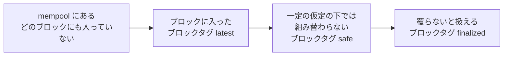
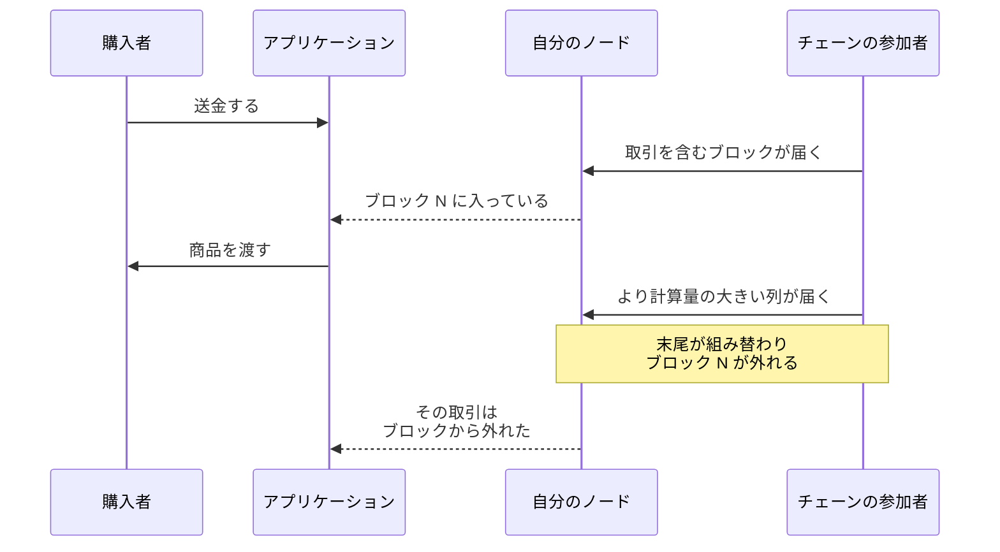
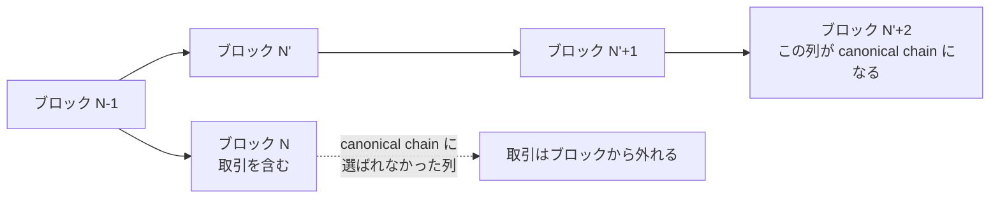
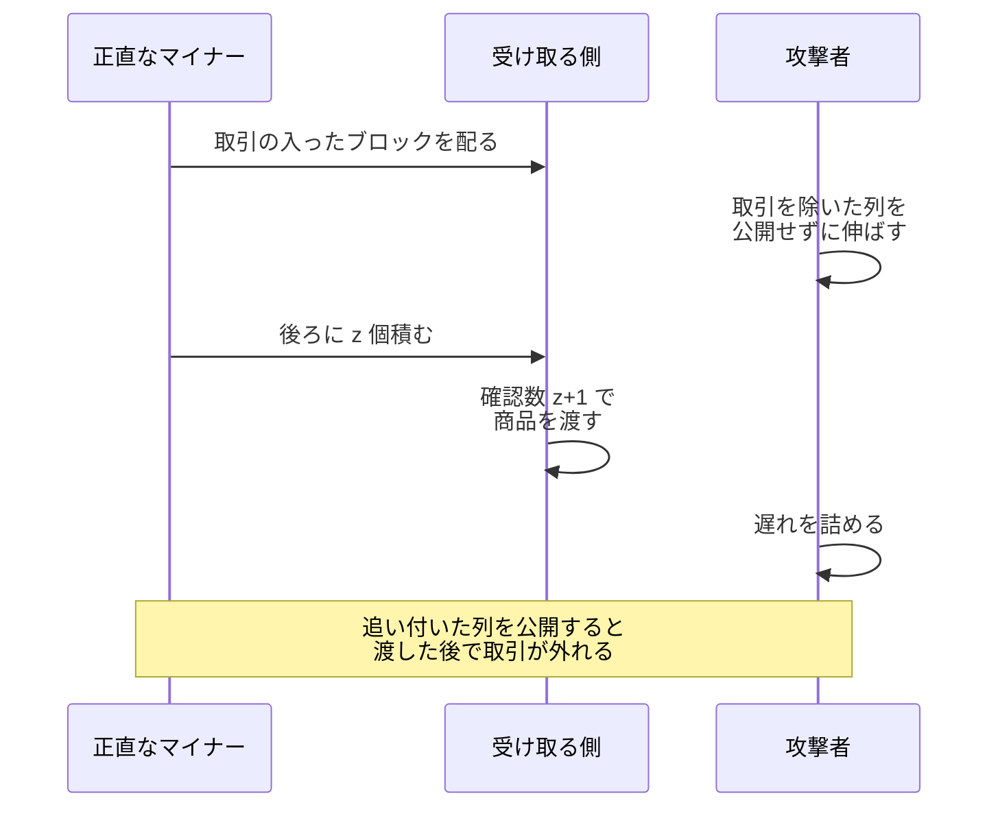
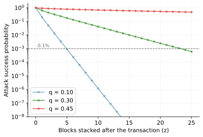
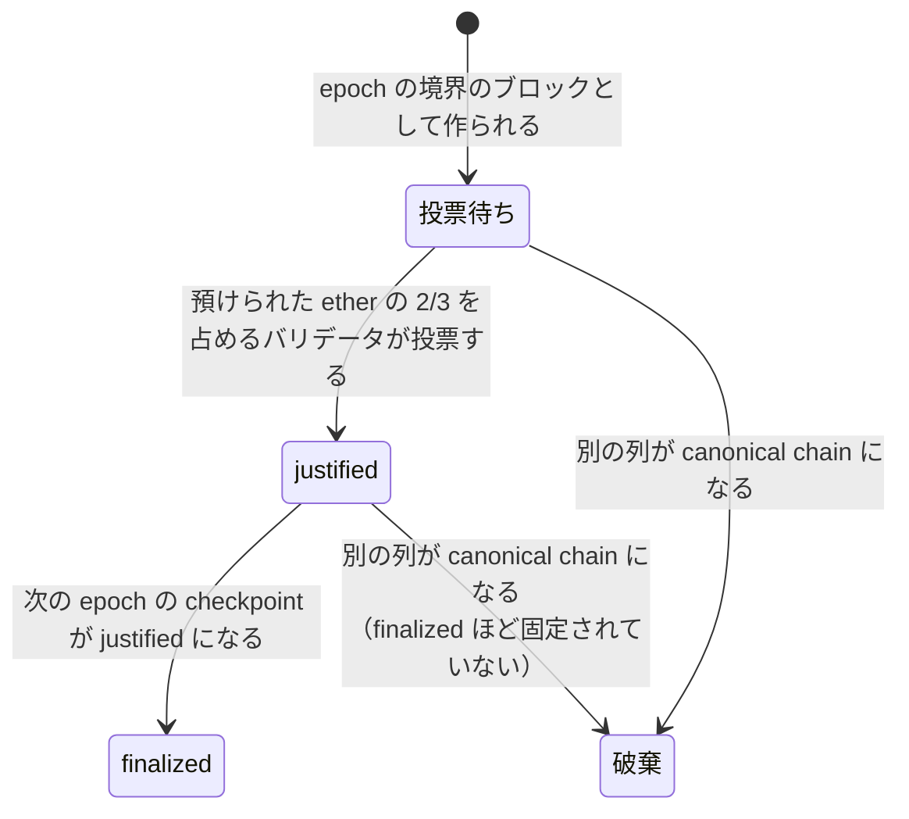
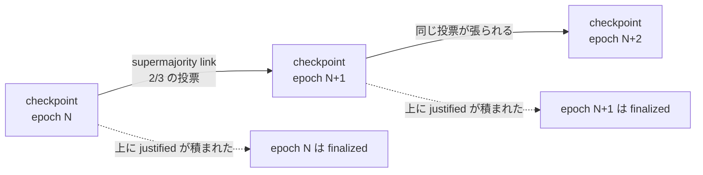
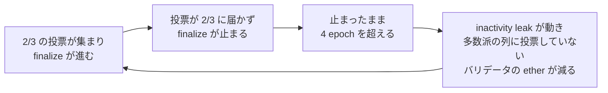
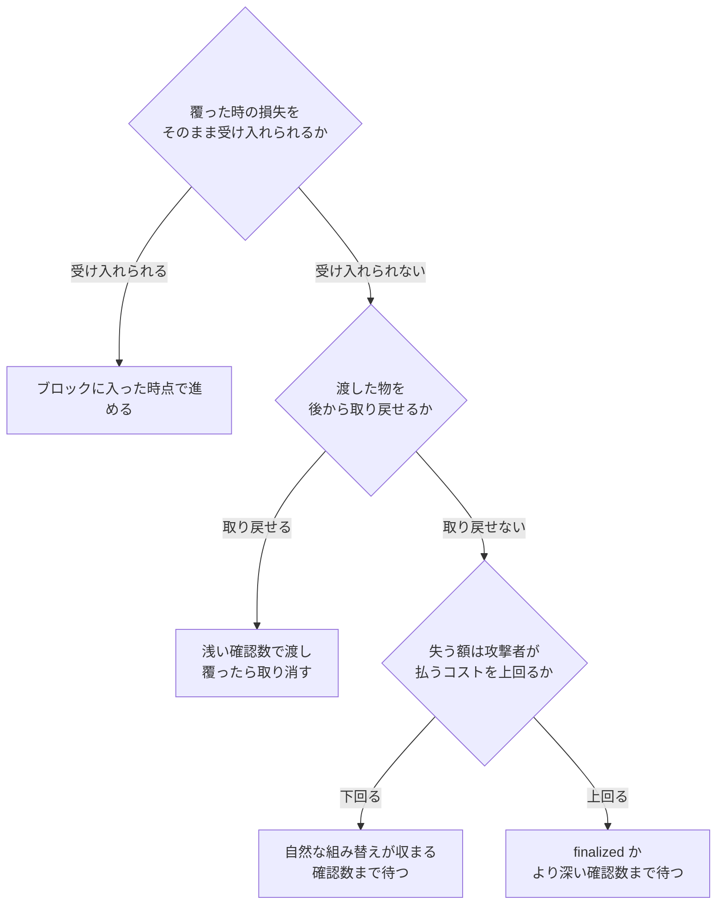
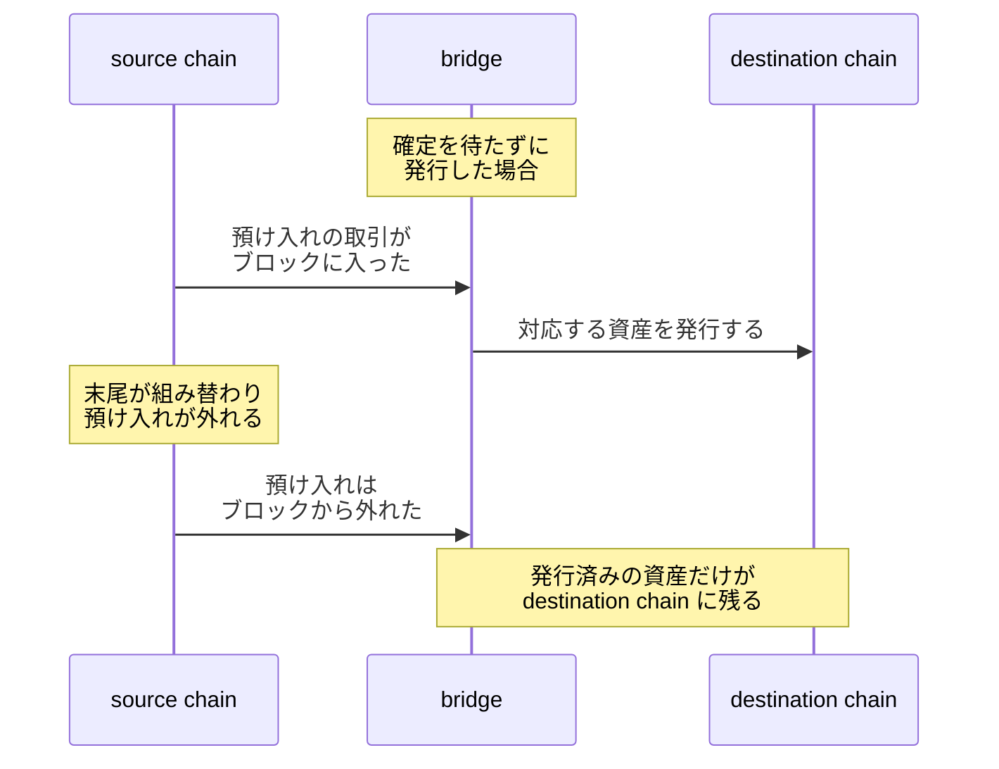

finality（ファイナリティ、確定性）は、一度確定したと扱った取引が後から覆らない性質です。この性質を注意深く扱う必要があるのは、入金を検知して商品を発送したり、[アカウントの残高](../ethereum-account-model/)を加算したりするアプリケーションを書く時です。取引が後から履歴から消えても、渡した物は戻ってきません。

取引がブロックに入った事と、その取引をもう覆らないものとして扱える事は、別です。Ethereum のノードはこの段階の違いを `latest`・`safe`・`finalized` の 3 つに分けており、残高を尋ねる `eth_getBalance` でも、アドレスと一緒にどれで見るのかを渡します。ブロック番号を知らなくても位置で指せる文字列なので、ブロックタグと呼びます。

本ノートでは、取引をアプリケーションがいつ確定済みとして扱えるのかを説明します。1 件の取引が通る段階と、3 つのタグの対応は以下の通りです。

`latest` を読むコードは最も早く反応できます。その代わり、読んだ内容が覆る確率も最も高くなります。1 件の送金がどの段階を通るのかは、[Bitcoin Transaction Lifecycle](../bitcoin-transaction-lifecycle/) で追っています。

---

### なぜ「ブロックに入った」と「確定した」を分けるのか

最新のブロックだけを見て入金を判定すると、次の流れで商品を失います。

記録が消えるわけではありませんが、渡した商品は戻りません。ブロックが外れる典型的な例は、複数のマイナーがほぼ同時にブロックを作り、チェーンの末尾が一時的に 2 本に分かれた場合です。分かれた直後は、どちらの列も規則を満たしています。

各参加者は、積まれた計算量が最も大きい列を canonical chain（正しい履歴として扱う列）に選びます。この差し替えを reorg（chain reorganization、チェーンの組み替え）と呼びます。[Bitcoin Block](../bitcoin-block/) が「巻き戻り」と呼んでいるのは、reorg で取引がブロックから外れる現象です。

外れた取引が無効になったわけではありません。ただし、取り込みを待つ状態に戻るかどうかは、プロトコルの外で決まります。

取引がまだ有効で、新しい canonical chain の取引と競合しない場合に限り、そのノードの [mempool](../mempool/) に戻る事があります。どの取引をどこまで戻すかは、ノードの実装と設定で変わります。

逆に、支払う人が同じコインを別の宛先に使う取引を先に通した場合、その取引を含む列を canonical chain としているノードは、元の取引を受け入れなくなります。

---

### confirmation が数えているのは確率

Bitcoin には、この取引はもう覆らないと宣言する仕組みがありません。代わりに使うのが確認数（confirmation）で、取引を含むブロック自身を 1 個目として数え、後ろに積まれたブロックを足した値です。後ろにブロックが積まれるほど、その取引を外すためにやり直す [proof of work](../proof-of-work/) は大きくなります。

正直なマイナーは、規則どおりにブロックを作り、見つけたらすぐ公開する参加者です。やり直しが間に合うのは、攻撃者が公開せずに伸ばした列が、その列に追い付いた時です。

追い付ける確率は、Gambler's Ruin（賭博者の破産問題）として計算できます。[Bitcoin の白書](https://bitcoin.org/bitcoin.pdf)が想定しているのは、支払った本人がハッシュ計算能力の割合 `q` を握り、取引を送った時点から、その支払いを取り消した列を公開せずに伸ばして追い付こうとする攻撃です。

攻撃者のハッシュ計算能力の割合 `q` を 0.10 とすると、`z` が 5 の時点で成功確率は 0.1% を下回ります。`q` が大きいほど、同じ確率まで下げるのに必要な `z` は増えます。

確率は `z` に対して指数的に下がる一方、0 には届きません。この性質を probabilistic finality（確率的な確定性）と呼びます。

成功確率が 0.1% を下回る `z` を `q` ごとに並べると、以下が得られます。

| 攻撃者のハッシュ計算能力の割合 `q` | 必要な `z`（後ろに積むブロック数） | 確認数（`z + 1`） |
| --- | --- | --- |
| 0.10 | 5 | 6 |
| 0.15 | 8 | 9 |
| 0.20 | 11 | 12 |
| 0.25 | 15 | 16 |
| 0.30 | 24 | 25 |
| 0.35 | 41 | 42 |
| 0.40 | 89 | 90 |
| 0.45 | 340 | 341 |

確認数 6 が Bitcoin の規則として定められていると考える方がいるかもしれません。しかし白書にあるのは、`q` を 0.10 と仮定した時に `z` が 5 で確率が 0.1% を下回るという計算だけです。`q` を 0.30 と置けば、同じ 0.1% を下回るのに確認数は 25 必要です。

この表の値は、上のモデルの中での確率です。ネットワークの分断、実装とコンセンサスの不具合、参加者の調整による介入はモデルの外にあるので、`q` を 0.10 と置いた確認数 6 も絶対的な安全の基準にはなりません。

---

### checkpoint への投票が finality を作る

Ethereum のバリデータ（validator）は、ether をプロトコルに預けて、ブロックの提案と検証と投票を行う参加者です。規則に反する投票を残すと、預けた ether が減らされます。

この投票を finality に変える仕組みが Casper FFG（Casper the Friendly Finality Gadget）です。投票の対象になるのは[全てのブロックではなく、epoch の境界にあるブロックだけ](https://ethereum.org/en/developers/docs/consensus-mechanisms/pos/gasper/)で、これを checkpoint と呼びます。Ethereum の時間は 12 秒の slot に区切られ、32 slot で 1 epoch（6 分 24 秒）になります。

checkpoint は 2 段階で確定します。預けられた ether の 2/3 を占めるバリデータが投票すると justified になり、次の epoch の checkpoint まで justified になった時点で finalized に変わります。

確定が投票より 1 epoch 遅れるのは、この 2 段階のためです。末尾の checkpoint は justified までしか進めず、finalized に届くのは次の epoch の投票が集まってからです。2 つの checkpoint を繋ぐ 2/3 の投票は supermajority link と呼ばれ、これが途切れずに続く限り、justified は 1 つずつ先へ延びていきます。

finalized な checkpoint と矛盾する別の checkpoint を finalized にすると、預けられた ether の 1/3 以上を占めるバリデータが、処罰の対象になる投票を証拠として残します。これが [Casper FFG](https://arxiv.org/abs/1710.09437) の accountable safety で、矛盾する finality が成立した時には、預けられた ether の少なくとも 1/3 が失われます。誰が矛盾する投票をしたのかを特定できる点が、計算量を積み直す方式との違いです。

---

### finalized と「十分安全」は別の判断

finalized も確認数の閾値も、もう覆らないだろうという判断です。しかし、線を引いた主体が違います。

`finalized` という保証には、例外が書き添えられています。ブロックタグを定義している [Ethereum 実行層 API の schema](https://github.com/ethereum/execution-apis/blob/main/src/schemas/block.yaml) には、「cannot be re-orged outside of manual intervention driven by community coordination」（コミュニティの調整による手動の介入を除いて、reorg され得ない）とあります。

この「手動の介入」が何を指すのかは、Bitcoin の事例で見えます。

2013 年 3 月、実装の間で規則が食い違ってチェーンが 2 本に分かれました。片方が当時のハッシュ計算能力の約 60% を持っていた一方、もう片方の実装はそのブロックを規則違反として拒み続けたため、分岐は自動では解消しませんでした。マイニングプールが古いバージョンへ切り替えた事で、チェーンは 1 本に戻りました。[BIP 50](https://github.com/bitcoin/bips/blob/master/bip-0050.mediawiki) には、実験として行われた二重支払いが成立した事も記録されています。

チェーンの選択を決めたのは、プロトコルではなく、外にいる人の調整です。Bitcoin には Ethereum の finalized checkpoint に相当する宣言がないため、これは finality が覆った例ではありません。

3 つのブロックタグのうち、まだ触れていない `safe` は、`latest` と `finalized` の間にあります。ブロックタグの定義では、多数派が正直であるという仮定と、ネットワークの遅延が想定の範囲に収まるという仮定の下で、reorg されない最も新しいブロックを指します。

どのブロックが `safe` かを決めるのは、取引を実行する実行層ではなく、バリデータの投票を集める合意層（consensus layer）です。アプリケーションが問い合わせるノードは、合意層と実行層をつなぐ Engine API 越しに渡された値を返しています。

`safe` が意味するのは仮定の下での安全性で、処罰を根拠にした保証ではありません。仮定が崩れれば、誰も処罰されないまま `safe` なブロックが覆り得る点が、`finalized` との違いです。

4 つの判断が、どこに、誰の手で線を引いているのかは、以下の通りです。

| 判断の拠り所 | 何が言えるか | 引いた主体 |
| --- | --- | --- |
| `latest` | 健全な状態でも外れ得る | クライアントの観測 |
| `safe` | 正直な多数派と、遅延が想定内という仮定の下では reorg されない | 合意層（仮定を根拠に） |
| `finalized` | 手動の介入を除いて覆らない | プロトコル（処罰を根拠に） |
| 確認数の閾値 | 白書のモデルの下で、覆る確率が自分で決めた値を下回った | アプリケーションの運用 |

---

### finalize が止まる時に起きる事

Casper FFG が証明しているのは、accountable safety と plausible liveness の 2 つです。

前者は、矛盾する finality が成立した時に、その責任を負うバリデータを特定できるという性質です。後者は、過去に何が起きていても、2/3 のバリデータが規則に従っている限り、誰も処罰されずに次の checkpoint を finalize できる、という別の性質です。覆らない事と止まらない事は、別々に証明されています。

その 2/3 が集まらない状態から抜け出す手段は、Casper FFG の外にあります。Ethereum は finality が 4 epoch 進まないと inactivity leak に入り、多数派の列に投票していないバリデータの残高を減らしていきます。投票している側が残りの ether の 2/3 を占めるところまで減らす仕組みで、その間に復帰したバリデータは減らされる側から外れます。

finality が進まなくても、ブロックの生成自体は続けられます。その間に進まなくなるのは `finalized` を待つアプリケーションで、`latest` だけを見ているコードは finalize の停止に気付きません。

---

### 確認数をいくつ待つかを決める材料

確認数の閾値は、チェーンではなくアプリケーションが決めます。判断の出発点は、覆った時の損失をそのまま受け入れられるかどうかです。

攻撃コストを問うのは、分岐の最後です。攻撃者がいなくても、複数のマイナーが同時にブロックを作れば組み替えは起きます。

待てる時間も材料です。ブロック間隔が 10 分のチェーンで確認数 6 まで待つと、取り込まれてから 50 分、送信から数えると 1 時間ほどかかります。Ethereum の `finalized` が指すのは順調な時でも 2 epoch 前の checkpoint なので、現在から見ると 12 分から 19 分ほど過去のブロックです。

チェーンの性質も、同じ確認数の意味を変えます。ハッシュ計算能力が少数の参加者に集中している proof of work のチェーンでは、仮定する `q`（攻撃者が握るハッシュ計算能力の割合）を大きく取る方が現実的で、必要な `z` はその分だけ増えます。

少額はブロックに入った時点、中額は決めた確認数、高額は finalized と、金額のレンジごとに待つ段階を変える運用に落ち着きます。閾値を設定として外に出しておくと、変える時にコードを触らずに済みます。

取引を見つけた時のブロックのハッシュを控えておくと、後から同じ位置に残っているかを確かめられます。組み替えに気付けるのは、状態を 1 度読んで終わりにしないアプリケーションだけです。

---

### 別のチェーンの状態をいつ信じるか

2 つのチェーンをまたいで資産を移す bridge も、同じ判断をプログラムとして下しています。source chain（送り出す側のチェーン）で資産が預けられた事を確かめてから、destination chain（受け取る側のチェーン）で対応する資産を発行します。

destination chain に裏付けのない資産が残るのは、bridge が預け入れを確定と扱うのが早すぎたからです。どの段階で発行するかは bridge の設計者が選んでいます。

取引がブロックに入っている事は、[Bitcoin Merkle Tree](../bitcoin-merkle-tree/) の包含証明で確かめられます。しかし、包含証明が示すのはブロックの中にある事までで、そのブロックが canonical chain に残るかどうかは別です。確率的な finality を相手にする bridge は、何ブロック待つかを自分で決めます。

相手が Casper FFG のような finality gadget を持つチェーンなら、確認数を自分で決める代わりに、プロトコルが finalized とした状態を検証する方法があります。Ethereum には、finalized としたヘッダを追跡できる Light Client Protocol があり、[その仕様](https://github.com/ethereum/consensus-specs/blob/master/specs/altair/light-client/sync-protocol.md)には、想定する利用先の 1 つとして cross-chain bridge を動かす環境が挙げられています。

この手順で軽量クライアントが受け取るのは、sync committee（署名役として一定期間ごとに選ばれるバリデータの一団）が署名した attested header と、そのヘッダの state が指す finalized checkpoint への finality branch です。署名でヘッダを認証し、branch でその先の finalized checkpoint を確かめます。Casper FFG に参加する全バリデータの投票を 1 票ずつ数え上げるわけではありません。

この署名と branch をどこまで信頼して良いのかは、軽量クライアントの設計に踏み込む話です。

---

### 確定を待たずに進めて良い場面

以下は、確認数を積む前に進めても損害が限定される場面です。

- 覆った時の損害が、攻撃者の払うコストより明らかに小さい少額の受け取り
- アカウントの機能開放のように、後から停止して取り消せる操作
- 残高を仮に加算し、確定後に差額を調整する会計上の記録
- 未確認である事を添えて取引の状態を見せるだけの、価値を渡さない表示
- 同じ運営者が両端を持ち、食い違いを後から直せる内部の移動

最後の項目だけは、覆った時に誰かが損害を引き受ける前提の上に立っています。引き受ける相手が決まっていない設計では、待つ選択の方が安全だと考えられます。
