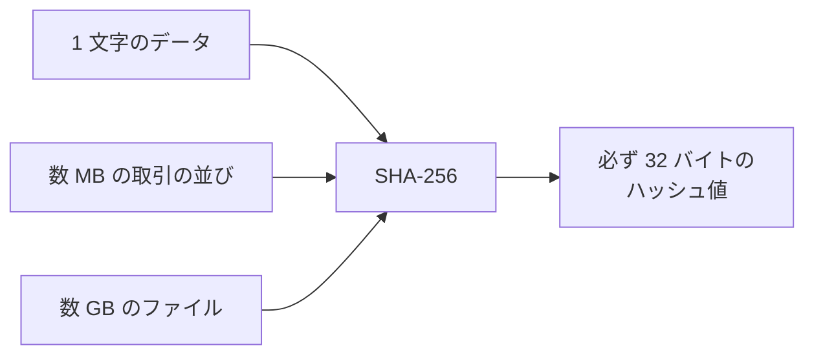
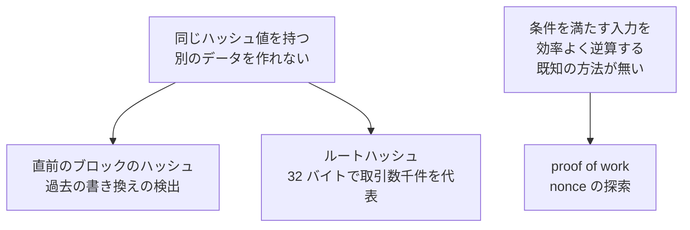
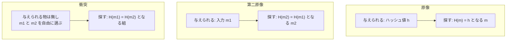
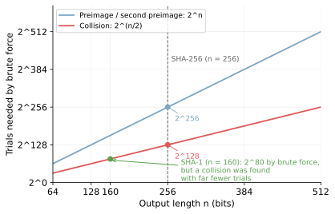
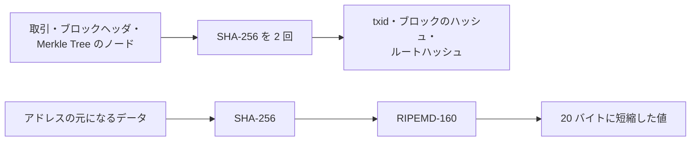

ハッシュ関数は、任意の長さのデータを固定長の値に変換する関数です。変換後の値をハッシュ値と呼びます。ここで扱うのは、その中でも改竄の検出に耐える性質を持つ暗号学的ハッシュ関数で、通信のエラー検出だけを目的とした関数（CRC、Cyclic Redundancy Check など）は対象外です。SHA-256 の内部の計算手順も扱いません。

この性質を知りたくなる場面の代表は、このセクションの他のノートを読む時です。[Bitcoin Block](../bitcoin-block/) の「取引を 1 バイトでも書き換えると別の値になる」も、[Bitcoin Merkle Tree](../bitcoin-merkle-tree/) の「32 バイトで数千件を代表できる」も、[Proof of Work](../proof-of-work/) の「総当たりより良い方法が知られていない」も、全てハッシュ関数の性質を根拠にしています。

ダウンロードページの checksum や、バージョン管理ツール Git のコミット ID のように、ブロックチェーンの外でも同じ性質が使われています。ハッシュ関数が Bitcoin のどの問題を引き受けているのかは、[Blockchain Basics](../blockchain-basics/) で他の仕組みと並べて整理しています。

入力と出力の関係を以下に示します。

上記の図のとおり、入力がどれだけ大きくても、出力は決まった長さに収まります。同じ入力からは必ず同じ出力が得られ、計算した人によって値が変わる事はありません。改竄の検出には、この 2 つにもう 1 つ性質が加わります。元のデータと同じハッシュ値を持つ別のデータを現実的な計算量では作れない、という性質です。困難さの中身は「3 つの耐性」の節で展開します。

---

### なぜ 32 バイトの比較で改竄を検出できるのか

データが書き換えられていない事を確かめる素朴な方法は、正しいデータと全バイトを比較する事です。この方法では、比較のたびに正しいデータの完全な複製が手元に必要です。ハッシュ値を使えば、保持と比較の対象は 32 バイトで済みます。

受け取ったデータのハッシュ値を自分で計算し、既に知っている正しいハッシュ値と比べて、一致すればデータは書き換えられていないとみなします。例えば Linux ディストリビューションの配布ページは、イメージと並べて SHA-256 のハッシュ値を載せており、ダウンロードした側は手元で `sha256sum` を実行して破損や差し替えを検出します。

ただし、この方法が守るのはデータとハッシュ値の対応だけです。比較の基準になる正しいハッシュ値そのものを攻撃者が差し替えられるなら、検出は成立しません。改竄されにくい経路で正しいハッシュ値を先に手に入れておく事が前提です。Bitcoin では、ブロックヘッダの連鎖と proof of work がこの基準値を守る役割を担っています。

この「一致すれば同じデータとみなす」という判断は、同じハッシュ値を持つ別のデータを作れない事に立脚しています。作れてしまうなら、攻撃者はデータを差し替えてもハッシュ値の比較を通過できます。Bitcoin がハッシュ値に委ねている役割は以下の通りです。図の矢印は、どの用途がどの性質を利用しているかの対応です。

上記の図の「別のデータを作れない」は、次の節で説明する 3 つの耐性のうちの 2 つです。「効率よく逆算する既知の方法が無い」事は、3 つのうちの原像計算困難性と同じ「出力から入力に」の向きの困難さで、条件を満たす入力を探す場面に当てはめた形になります。proof of work との結び付きは、雪崩効果の節で説明します。

---

### 3 つの耐性 - 何が与えられて何を探すのか

ハッシュ関数の安全性は、3 つの性質に分けて整理されます。冒頭で挙げた「同じハッシュ値を持つ別のデータを作れない」という困難さはそのうちの 2 つで、残る 1 つはハッシュ値だけから元のデータを求める困難さです。3 つは、攻撃者に何が与えられ、何を探すのかで区別します。関数を `H`、入力を `m`（2 つを区別する時は `m1` と `m2`）、ハッシュ値を `h` と書きます。

| 性質 | 与えられる物 | 探す物 |
| --- | --- | --- |
| 原像計算困難性（preimage resistance） | ハッシュ値 h | `H(m) = h` になる入力 m |
| 第二原像計算困難性（second preimage resistance） | 入力 m1 | 同じハッシュ値になる別の入力 m2 |
| 衝突耐性（collision resistance） | 何も与えられない | 同じハッシュ値になる任意の組 m1 と m2 |

3 つの違いを図でも示します。

改竄の検出で直接効いているのは第二原像計算困難性です。攻撃者の手元には書き換えたい正しいデータ（m1）があり、同じハッシュ値を持つ偽データ（m2）を探すためです。例えば、ブロックに取り込まれた他人の取引について、同じ txid を持つ別の取引に差し替える攻撃は、第二原像を探す問題になります。原像計算困難性は、ハッシュ値から元のデータを推測させない一方向性で、パスワードの保存などで効きます。

衝突耐性は両方の入力を攻撃者が自由に選べる分だけ条件が緩く、3 つの中で最初に破られやすい性質です。衝突耐性が必要なのは、攻撃者が両方の入力を用意できる場面です。デジタル署名は文書そのものではなくハッシュ値に対して作られるため（[Digital Signature](../digital-signature/)）、同じハッシュ値を持つ文書には同じ署名がそのまま通用します。例えば、署名してもらう正規の文書と差し替え用の文書の両方を攻撃者が作れるなら、同じハッシュ値を持つ組を最初から仕込めます。

3 つは別の性質なので、破られ方も別々に進みます。例えば [SHA-1 は 2017 年に衝突の実例が公表され](https://shattered.io/)、内容の異なる 2 つの PDF が同じハッシュ値を持つ事が実証されました。一方で、SHA-1 のハッシュ値から原像を求める現実的な攻撃は公表されていません。衝突が作れる関数を改竄の検出に使い続けるのは危険で、SHA-1 は署名や証明書の用途から段階的に外されました。

---

### 衝突は必ず存在する - 見つける困難さが安全性を決める

出力の 32 バイトは 256 ビットで、各ビットが 0 か 1 の 2 通りなので、取り得る値は 2 の 256 乗通りです。入力はほぼ任意の長さを取れるため、種類はそれよりはるかに多くあります。入力の方が多い以上、同じハッシュ値を持つ入力の組は数え切れないほど存在します。衝突が必ず存在するのに検出に使えるのかと、疑問に思うかもしれません。安全性の根拠は、衝突が「存在しない」事ではなく、「見つけるのに現実的でない計算量が必要」事です。

出力のビット数 n に対して、総当たり（brute force）で必要な試行回数の目安は以下の通りです。縦軸は対数で、目盛りは 2 の何乗かで振っています。

衝突だけ桁が小さいのは、多数の入力のハッシュ値を溜めながら「どれか 2 つが一致する」のを待てるからです。23 人集まると誕生日が重なる組が半数の確率で生じる、という誕生日のパラドックスと同じ数え方になります。それでも 2 の 128 乗回は、計算機を並べても現実的な時間では終わらない回数です。

この試行回数は総当たりを仮定した数字で、関数の内部構造に近道が見つかると一気に縮みます。上記の図の SHA-1 がその実例で、ハッシュ関数の寿命は、近道がどれだけ見つかるかで決まります。

---

### 雪崩効果 - 入力の小さな違いが出力全体に広がる

暗号学的ハッシュ関数は、入力のわずかな違いを出力全体に波及させます。この性質は雪崩効果（avalanche effect）と呼ばれ、理想的には入力の 1 ビットの変化で出力の半分程度のビットが変わります。実際に、最後の 1 文字（ビットにすると 5 個ぶん）だけが違う 2 つの入力の SHA-256 は以下の通りです。

| 入力 | SHA-256 のハッシュ値 |
| --- | --- |
| hello | `2cf24dba5fb0a30e26e83b2ac5b9e29e1b161e5c1fa7425e73043362938b9824` |
| hellp | `fdd7585e08c4e2afd71dcabdb4636c89d557a3f42db9e2040c8bbd1708aa4ce7` |

2 つのハッシュ値に共通の面影はありません。雪崩効果は、この見た目のとおり、入力の小さな違いが出力全体に広がる様子を示す性質です。ただし、広がり方が激しい事から「狙った出力になる入力を効率よく見つける方法が無い」までは導けません。近道が無いかどうかは、雪崩効果とは別に確かめる事になります。

proof of work の課題は、ハッシュ値を 256 ビットの数として読み、合格の基準になる値（target）以下になる入力を見つける事です。target が小さい状態は、直感的に「先頭にビットの 0 が並ぶ」と表現される事もあります。探すのは特定の 1 つのハッシュ値になる入力ではなく、条件を満たす範囲に入る入力なので、必要な試行回数は条件の厳しさで決まります。

SHA-256 には、条件を満たす入力を効率よく逆算する既知の方法がなく、入力を少し変えた時の次の出力を有効に予測する手掛かりも得られません。そのため、[Proof of Work](../proof-of-work/) の「nonce の探索」で説明したとおり、nonce などを変えながらハッシュ計算を繰り返す事になります。

---

### SHA-256 - Bitcoin が使う標準関数

SHA-256（Secure Hash Algorithm 256）は、NIST（米国国立標準技術研究所）が [FIPS 180-4](https://nvlpubs.nist.gov/nistpubs/FIPS/NIST.FIPS.180-4.pdf) という標準で定めたハッシュ関数で、出力は 256 ビット（32 バイト）です。仕様が公開されているため、世界中の参加者が同じ実装を持ち、同じ入力から同じハッシュ値を再計算できます。この再計算のしやすさが、検証を全参加者に分散させる Bitcoin の前提になっています。

Bitcoin での適用のされ方は、これまでのノートで見たとおりです。以下が 2 つの経路です。

上記の図の上の経路で、1 回ではなく 2 回続けて適用する理由は、ここでは扱いません。下の経路にある RIPEMD-160 は出力 160 ビットの別のハッシュ関数で、支払いの宛先に使うアドレス（[UTXO](../utxo/) で触れた、使う条件を組み立てるための情報を符号化した文字列）の形式によっては、この経路で短縮した値を使います。

---

### 利点

以下は、暗号学的ハッシュ関数を改竄の検出に使う事で得られる性質です。

- データの大きさに関わらず、保持と比較の対象が 32 バイトで済む
- 同じ入力から誰が計算しても同じ値が得られ、中央の照合サーバが必要ない
- 書き換えられたデータは、既に共有したハッシュ値との不一致として検出できる
- 計算が速く、数 MB のブロックの検証にも実用上の支障が無い

---

### 欠点

以下は、固定長の値に要約する事の裏返しとして現れる制約です。

- 衝突が原理的に存在し、安全性は「見つける計算が現実的でない」という計算量の仮定で成り立つ
- 内部構造への近道が見つかった関数（SHA-1 など）は、用途から外して移行する必要がある
- ハッシュ値の不一致からは「どこが書き換えられたか」は分からない
- 計算の速さは総当たりの速さでもあり、パスワードの保存のような用途では不利に働く

4 番目の補足として、パスワードの保存には、意図的に計算を遅く調整できる専用の関数が使われます。例えば bcrypt は、計算の繰り返し回数を設定で増やせるパスワード専用のハッシュ関数です。改竄の検出とパスワードの保存では、速さに求める方向が逆になります。
