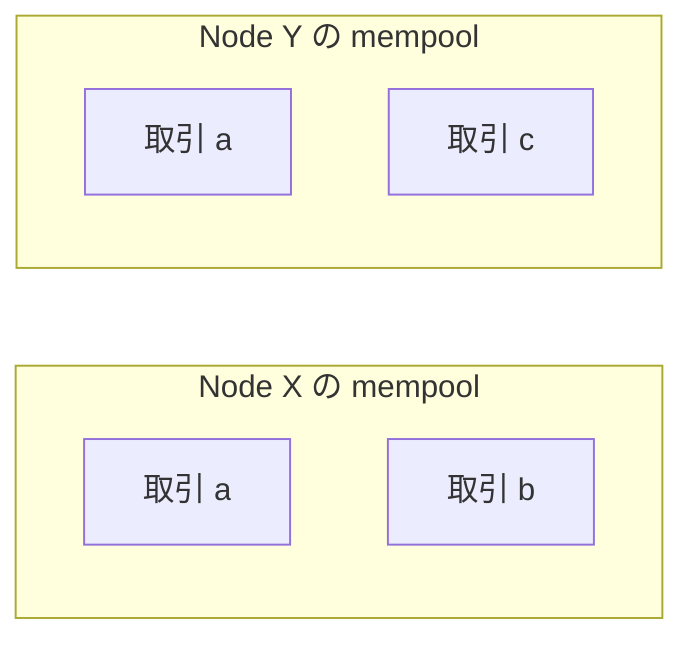
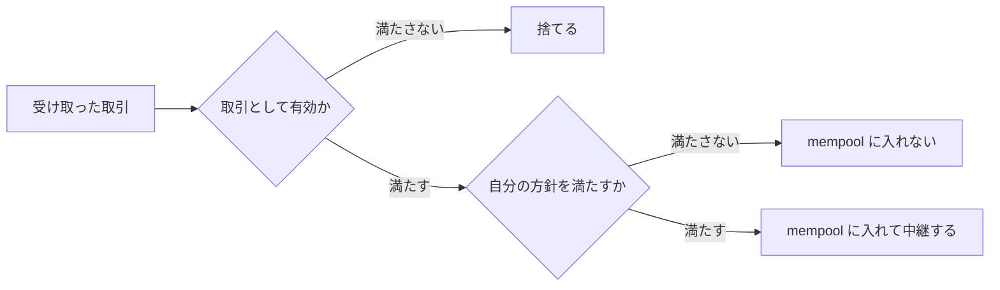
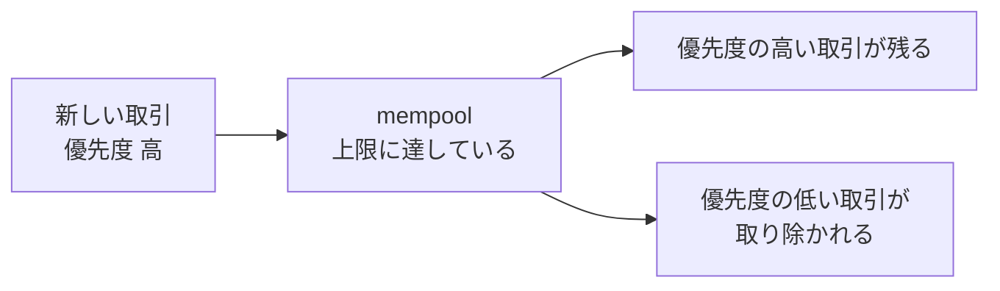
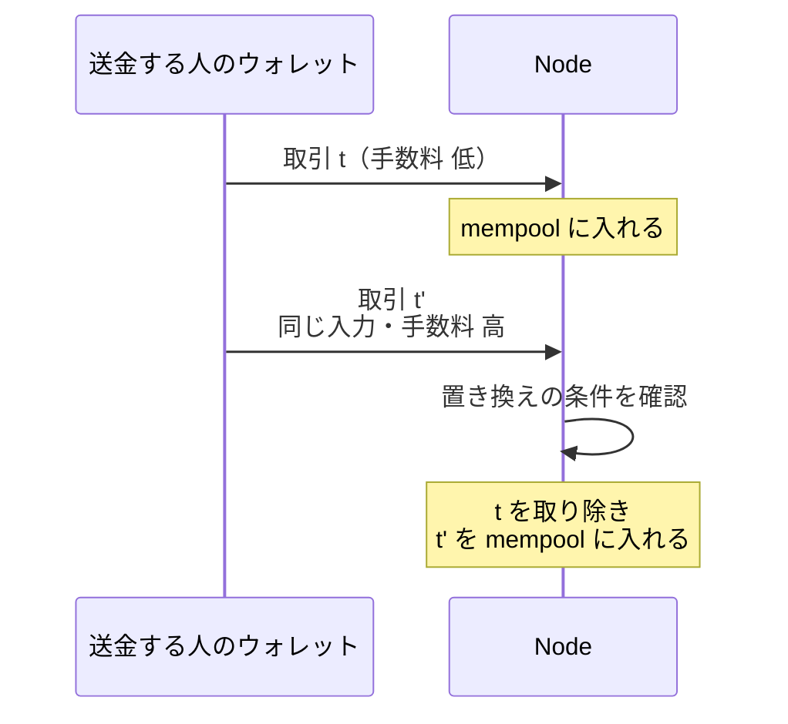

mempool（memory pool）は、まだブロックに入っていない取引をノードが一時的に置いておく場所です。ノードは受け取った取引を検証してから mempool に入れ、隣のノードに中継します。ブロックを作る参加者は、この置き場から取り込む取引を選びます。

ここで扱うのは、ノードが取引を受け入れるかどうかをどう決めるのかと、入った取引が消えたり置き換わったりする場面です。取引と手数料の表し方は [UTXO](../utxo/)、ブロックへの取り込みと確認数は [Bitcoin Block](../bitcoin-block/)、1 件の送金の流れは [Bitcoin Transaction Lifecycle](../bitcoin-transaction-lifecycle/) で説明しています。設定項目の一覧と既定値は扱いません。

この置き場の性質が表に出るのは、送った取引がなかなか取り込まれない時です。エクスプローラによって「未確認」の見え方が違ったり、しばらく待つと取引が消えていたりします。原因の多くは、mempool がノードごとの持ち物である事にあります。

2 台のノードが別の中身を持つ様子を以下に示します。

上記の図の取引 b と取引 c は、片方のノードだけが持っています。ネットワーク全体で 1 つの mempool を共有する仕組みは無く、どのノードから見るかで中身が変わります。

---

### なぜ有効性の判定だけでは足りないのか

取引が有効かどうかの規則は、全ノードが同じ結論に到達する必要があります。ブロックに入った取引の採否が参加者ごとに割れると、どのブロックを受け入れるかの判断まで割れ、履歴が 1 本に揃わなくなるからです。

受け入れの判断は事情が違います。ブロックに入る前の取引はまだ履歴のどこにも位置を持っておらず、それを手元に置くかどうかで他の参加者と揃える必要がありません。ノードは自分のメモリと通信帯域を使って取引を保持し、中継します。

有効な取引を無制限に受け入れる作りにすると、この資源が使い切られます。手数料をほとんど付けない取引を大量に送り付けられても、有効である限り受け入れて中継する事になるからです。そこで各ノードは、有効性の確認とは別に、自分が持って中継する価値があるかを判定します。

以下が 2 段の判定です。

上記の図の 1 つ目の判定は全ノードで共通の規則、2 つ目はノードごとの方針です。1 つ目は、同じチェーンの状態を前提にすれば、どのノードでも同じ結果になります。2 つ目で落ちた取引は、別の方針を持つノードなら受け入れる事があります。

2 つを分けておくと、資源の使い方をノードごとに調整できます。共通の規則を変えるには参加者の足並みを揃える必要がある一方、自分が何を持ち、何を中継するかは、他のノードと相談せずに決められるからです。

---

### consensus rule と policy の違い

有効性を決める規則は consensus rule（合意規則）、受け入れと中継の方針は policy（ポリシー）と呼ばれます。Bitcoin の代表的な実装である [Bitcoin Core のドキュメント](https://github.com/bitcoin/bitcoin/blob/master/doc/policy/README.md)は、policy が、consensus に加えて未確認の取引に課す検証規則であり、ノードごとに設定できるものだと説明されています。

同じドキュメントには「Policy is not applied to transactions in blocks」（policy はブロックに入った取引には適用されない）という一文があります。判定に使われるのは consensus rule だけ、という事になります。

以下が 2 つの違いです。

| | consensus rule | policy |
| --- | --- | --- |
| 役割 | 取引やブロックの有効性を決める | 未確認の取引を保持し、中継するかを決める |
| mempool に入れる時 | 前提として確認する | 追加で確認する |
| ブロックを検証する時 | 適用する | 適用しない |
| ノードごとの差 | 同じ規則に従う必要がある | ノードごとに違い得る |

未確認の取引も consensus rule を満たしている事が前提で、policy はその上に足される確認です。policy を満たさない取引でも、ブロックの中の文脈で consensus rule を満たしていれば、有効な取引として受け入れられます。中継されにくいだけで、マイナーに直接届いて取り込まれる経路は残っています。「非標準な取引」と「無効な取引」は別物になります。

方針が緩いノードだけが持っている取引は、他のノードから見えません。未確認の段階でどの取引が存在するのかは、観測するノードによって違います。ブロックに取り込まれると、その取引は consensus rule に基づく共有された履歴の一部になり、policy で持つかどうかが分かれる状態から抜けます。

---

### 受け入れと追い出しを決める材料

判定の材料は実装と設定で決まります。Bitcoin Core が持つ代表的なものは次の 4 つです。

- 仮想サイズあたりの手数料が、そのノードの決めた最低の手数料率を下回らないか
- 取引の形式が、見慣れた形の範囲に収まっているか
- mempool に保持している量が上限に達していないか
- 未確認の取引どうしが依存関係で繋がった集合が、ノードの定めた範囲に収まっているか

1 つ目の最低の手数料率は、手数料の極端に低い取引を mempool と中継の対象から外すための基準です。メモリと通信帯域を大量に使う送り付けは、この基準で抑えられます。2 つ目は、Bitcoin Core が標準的とみなす形式だけを通常の中継の対象とするための判定で、consensus 上の有効性とは別の条件になります。

3 つ目の上限は、判定を通った取引にも効いてきます。mempool が上限に達すると、手数料の面で優先度の低い取引や取引の集合から取り除かれると[設計のドキュメント](https://github.com/bitcoin/bitcoin/blob/master/doc/policy/mempool-design.md)は説明しています。以下が取り除かれる取引です。

上記の図で取り除かれた取引は、そのノードから消えます。取引そのものが無効になったわけではなく、別のノードがまだ持っていれば、後から中継されて戻ってくる事もあります。優先度をどう決めるかは実装が変えてくる部分なので、詳細は上のドキュメントに譲ります。

4 つ目の依存関係は、次の取引が未確認の取引の出力を入力で参照する形で生まれます。繋がりが大きいほど、1 件を取り除いた時に一緒に mempool から取り除く必要のある取引が増えます。

---

### 競合する取引と置き換え

同じ入力を使う 2 つの取引は、同じ有効な履歴の中で両方は成立しません（[UTXO](../utxo/)）。ノードは、片方を mempool に入れた後にもう片方を受け取っても、そのまま両方を保持する事はしません。どちらを持つのかの判定が、ブロックに入る前の段階でも必要です。

後から来た取引が既存の取引を置き換える場合があり、この置き換えは replace-by-fee（RBF）と呼ばれます。[Bitcoin Core](https://github.com/bitcoin/bitcoin/blob/master/doc/policy/mempool-replacements.md) は、置き換えによって mempool の手数料の面での状態が悪化しない事や、追加の中継コストに見合う手数料を払う事などを確認します。条件はバージョンによって変わるため、詳細は上のドキュメントで確認してください。

置き換えが起きる流れは以下の通りです。

上記の図の取引 t は、置き換えが成立した時点でそのノードの mempool から消えます。手数料を低く付けすぎた送金をやり直す手段として使われる一方、受け取る側から見れば、未確認の取引の内容が変わり得るという事になります。Bitcoin の仕様提案である [BIP（Bitcoin Improvement Proposal）125](https://github.com/bitcoin/bips/blob/master/bip-0125.mediawiki) も、置き換えられる取引の受取人が、確認されるまで支払いとして扱わない選択を取れると書かれています。

条件が手数料の増加を求めるのは、置き換えを繰り返す形の送り付けを避けるからです。同じドキュメントは、手数料率だけを条件にすると、少しずつ小さい取引を何度も中継させる余地が残ると説明されています。置き換えのたびに帯域ぶんの手数料を求めておけば、繰り返す側にコストが積み上がります。

置き換えを認めるかどうかと、どの取引を対象にするかは方針の一部です。[BIP 125](https://github.com/bitcoin/bips/blob/master/bip-0125.mediawiki) は、置き換えを許す意思を取引の中で示す方法と、当時の実装が使っていた条件を定めました。Bitcoin Core の現在の方針はそこから変わっており、意思表示の有無によらず置き換えを認める設定が [v28.0](https://github.com/bitcoin/bitcoin/blob/master/doc/release-notes/release-notes-28.0.md) で既定になりました。

---

### 送った取引が見えなくなる場面

冒頭に挙げた「取り込まれない」「消えた」という見え方は、ここまでの判定の結果として説明が付きます。以下が代表的な組み合わせです。

| 見えている事 | 起きている事 |
| --- | --- |
| エクスプローラによって未確認かどうかが違う | 観測しているノードの mempool の中身が違う |
| しばらく待つと取引が消えた | 手数料の面での優先度が低く、容量の制限などで取り除かれた可能性がある |
| 同じ資金を使う別の取引が見えている | 競合する取引が受け入れられ、既存の取引が置き換えられた可能性がある |

いずれの場合も、取引そのものが無効になったわけではありません。別のノードがまだ持っていれば中継されて戻る事もあり、手数料を上げた取引を作り直して送る事もできます。確定するのはブロックに取り込まれた後で、そこから先の扱いは [Bitcoin Block](../bitcoin-block/) の確認数の話になります。

---

### mempool を前提にできる事

- ブロックが作られる前に取引がネットワークに広まり、マイナーは手元の置き場から選ぶだけで済む
- 手数料の面での優先順位が付き、混雑時にどれから取り込まれるかの目安になる
- ブロックに入る前の段階で、同じ入力を使う取引の競合を見つけられる

3 番目は、支払いを受け取る側にも効いてきます。ブロックを待たずに、自分が観測できる範囲で競合する取引が流れている事を知る手掛かりになるからです。競合する取引が別の経路だけを通っている場合は、自分のノードから見えない事もあります。

---

### mempool の制約

以下は、ノードごとに持つ置き場である事の裏返しとして現れる制約です。

- ネットワーク全体で 1 つの mempool は存在せず、観測するノードによって中身が違う
- 入った取引が、追い出しや置き換えで手元から消える事がある
- 未確認の段階では取り込まれる保証が無く、支払いの完了として扱えない
- 巻き戻りでブロックから外れた取引が、条件を満たせば mempool に戻り、改めて取り込みを待つ事がある

4 番目の巻き戻りは、[Bitcoin Block](../bitcoin-block/) で説明したチェーンの末尾の分岐で起きます。取り込まれたはずの取引が未確認の状態に戻る事があるため、確認数を待たずに受け取りを確定させると、待ち時間を短くした分の危険を引き受ける事になります。
