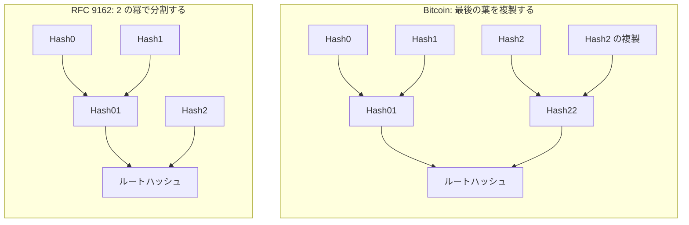
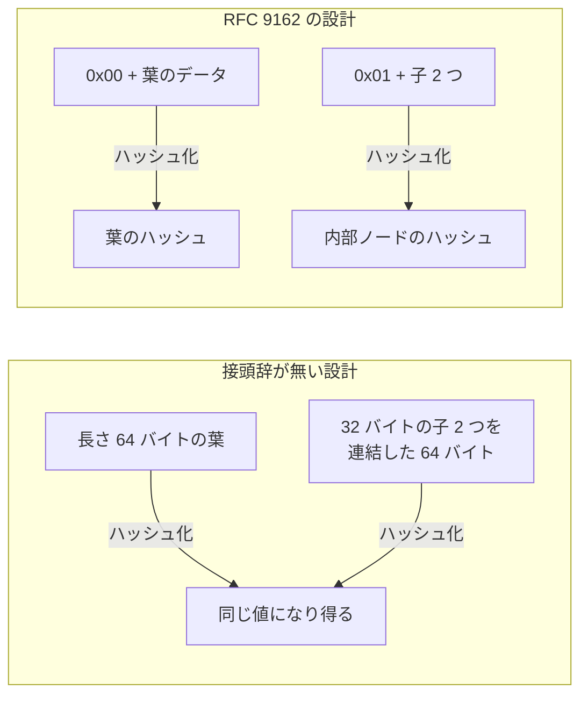
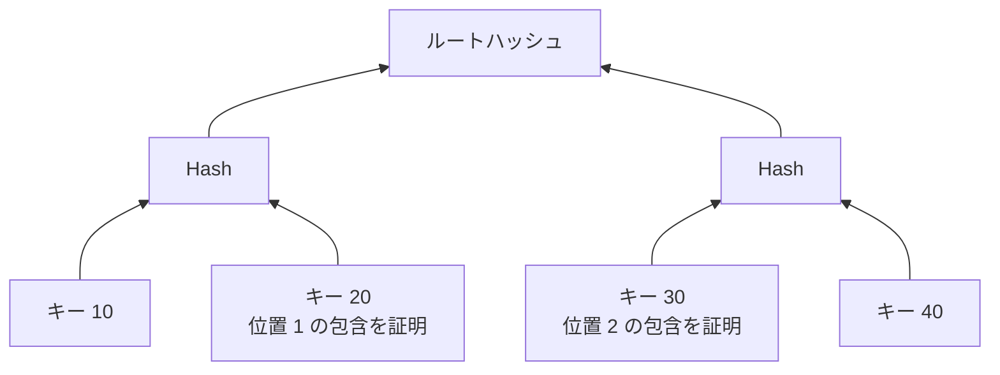

Merkle Tree の構築方法は 1 通りに決まっていません。奇数の葉をどう組むか、葉と内部ノードをどうハッシュするか、葉をどう並べるかは、それぞれのプロトコルが決める設計事項です。ルートハッシュが何を保証しているのかは、この規則を決めて初めて確定します。

この規則が問題になるのは、新しいプロトコルへ Merkle Tree を組み込む時と、既存プロトコルの証明を検証する実装を書く時です。同じ名前で呼ばれていても、Bitcoin と Certificate Transparency と Ethereum では規則が違い、ある規則で作られた証明を別の規則で検証すると一致しません。木の作り方と包含証明の仕組みは [Merkle Tree](../merkle-tree/) を前提とします。

---

### 奇数の葉の扱いが木の形を決める

葉が奇数になった時の扱いは、大きく 2 つの流儀に分かれます。Bitcoin は、段の中のノード数が奇数になると最後のノードを複製してから組を作ります。複製が生む「異なる並びから同じルートハッシュが決まる」副作用と、その検出は [Bitcoin Merkle Tree](../bitcoin-merkle-tree/) で扱っています。

TLS 証明書の発行記録を追記専用のログへ残す仕組みを定めた [RFC 9162](https://www.rfc-editor.org/rfc/rfc9162.html)（Certificate Transparency Version 2.0）は複製しません。葉が n 件なら、n 未満で最大の 2 の冪で 2 つに分ける規則を再帰的に当てはめて木の形を決めます。この流儀では木の形が葉の件数で変わり、葉によって根までの段数が違う事もあります。

葉 3 件での違いを以下に示します。

上図の 2 つは、同じ 3 件の葉から別のルートハッシュを導きます。Bitcoin の木は全ての葉が同じ深さに揃い、RFC 9162 の木は Hash2 だけが浅い位置に付きます。どちらかが正しいという話ではなく、作る実装と検証する実装が同じ規則を使わない限り証明が成立しない、という点が設計事項たる理由です。

---

### 接頭辞で葉と内部ノードを分ける

葉と内部ノードを同じ入力空間で同じ手順でハッシュする設計では、木の構造が証明の中身だけからは決まりません。内部ノードのハッシュは 32 バイトの子 2 つ、合わせて 64 バイトを入力に取った値で、葉のハッシュは長さの決まっていない元のデータを入力に取ります。長さがちょうど 64 バイトの葉があると、その葉のハッシュは、2 つの子を持つ内部ノードのハッシュと同じ形で計算された値になります。

受け取った 32 バイトが葉なのか内部ノードなのかは、証明そのものからは決まらない設計があり得ます。RFC 9162 は、葉と内部ノードで異なる接頭辞を付けて入力空間を分ける事で、この曖昧さを消しています。葉は `MTH({d[0]}) = HASH(0x00 || d[0])`、内部ノードは `MTH(D_n) = HASH(0x01 || MTH(D[0:k]) || MTH(D[k:n]))` と定義されており、入力の先頭 1 バイトが違うため 2 つのハッシュは一致しません。

接頭辞の有無による違いを以下に示します。

RFC 自身が、接頭辞で入力空間を分ける目的を「this domain separation is required to give second preimage resistance」と書いています。second preimage resistance（第 2 原像計算困難性）は、ある値と同じハッシュになる別の入力を見つけられない性質です。

ハッシュ関数そのものが安全でも、木の構築規則が曖昧なら問題は生じ得ます。木の構築規則はプロトコル設計の一部で、新しく Merkle Tree を設計するなら、接頭辞で葉と内部ノードを分ける方が安全だと考えられます。

---

### 不在の証明は葉の並べ方で決まる

キー順に整列していない Merkle Tree では、対数サイズの証明で不在を示せません。葉の位置が検索キーから決まっていないため、ある 1 件が入っていない事を確かめる側は、全件を受け取って端から照合する事になります。

Bitcoin のブロックは、ブロック作成者が選んで決めた取引の順序で葉が並びます。RFC 9162 のログは追記専用で、ログへ追加された順に葉が並びます。並び方の決まり方は違うものの、どちらもキーから葉の位置を絞れない点は同じで、不在の証明には全件の照合が要ります。

キー順に葉を並べると、不在を対数サイズで示せるようになります。探しているキーの前後に来る 2 件の包含を証明し、その 2 件の位置が隣り合っている事を示せば、間に別の葉が入る余地はありません。キー順に並べた木で、キー 25 の不在を示す例を以下に示します。

キー 20 が位置 1 に、キー 30 が位置 2 に入っている事を 2 つの包含証明で示せば、位置が隣り合っているため、20 と 30 の間に 25 が入る余地はありません。

キーから経路が決まる trie を使う方法もあります。根から経路を辿り、その先が空である事を 1 本の経路だけで示せます。Ethereum はこの型の Merkle Patricia Trie を使っており、アカウントのアドレスを keccak256 でハッシュした値を経路として状態を引きます（[公式ドキュメント](https://ethereum.org/en/developers/docs/data-structures-and-encoding/patricia-merkle-trie/)）。不在の証明も同じ経路で行い、[EIP-1186](https://eips.ethereum.org/EIPS/eip-1186) は、アカウントや値が存在しない場合もその事実を検証できるだけのデータを返すと定めています。

---

### 葉の並べ方 3 通りの比較

3 つの持ち方で、証明できる事とコストがどう変わるかを以下に示します。

| | Merkle Tree（キー順に整列しない） | Merkle Tree（キー順に整列する） | キーで経路が決まる trie |
|---|---|---|---|
| 包含証明のサイズ | ハッシュ `O(log n)` 個 | ハッシュ `O(log n)` 個 | ノード数は対数。1 ノードが兄弟を複数含むため実サイズは数倍以上 |
| 不在の証明 | 全件を渡して照合する | 前後 2 件の包含と隣接で示せる | 経路 1 本で示せる |
| 葉を 1 件追加する計算量 | 内部ノードを保持していれば根までの `O(log n)` | 挿入位置から根までの再計算と、並び替えの維持が要る | 経路上のノードを保持していれば `O(log n)`。ノードの分割や併合が加わる |
| 代表例 | Bitcoin のブロック、RFC 9162 のログ | 一部の認証付き辞書 | Ethereum の Merkle Patricia Trie |

キー順の木と trie は、葉を置く位置をキーから決める分だけ、追加のたびに並びの維持や経路の組み替えが要ります。証明したい内容が包含だけで済むなら、キー順に整列しない木を選ぶ方が扱いやすいと考えられます。
