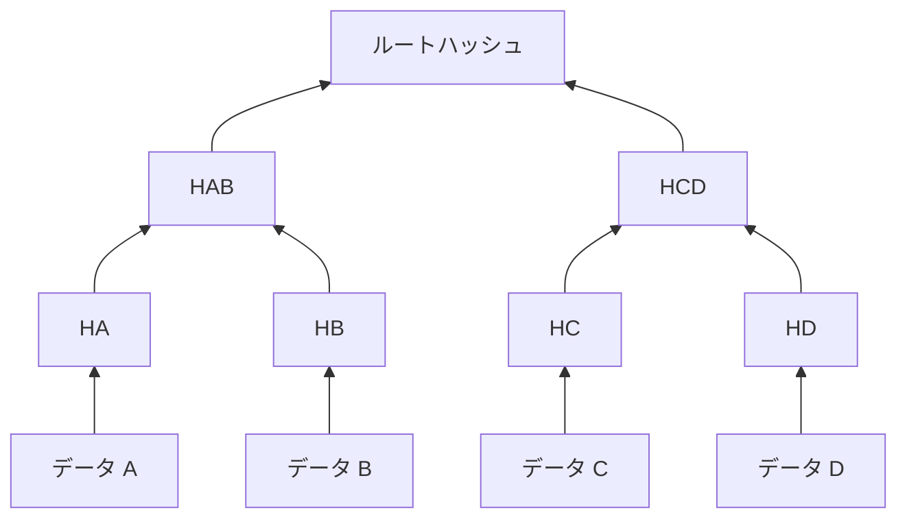
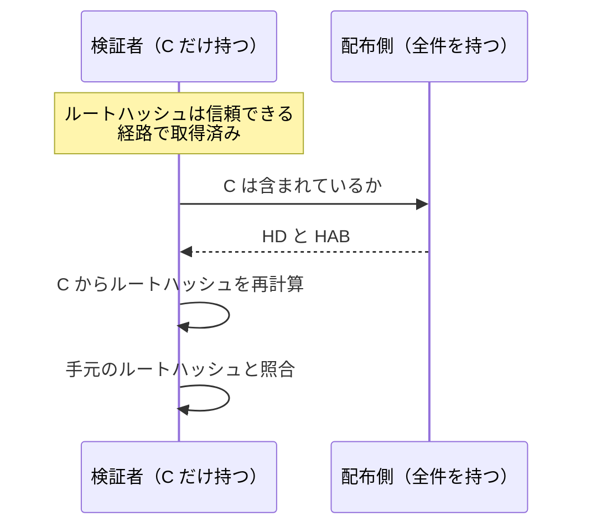
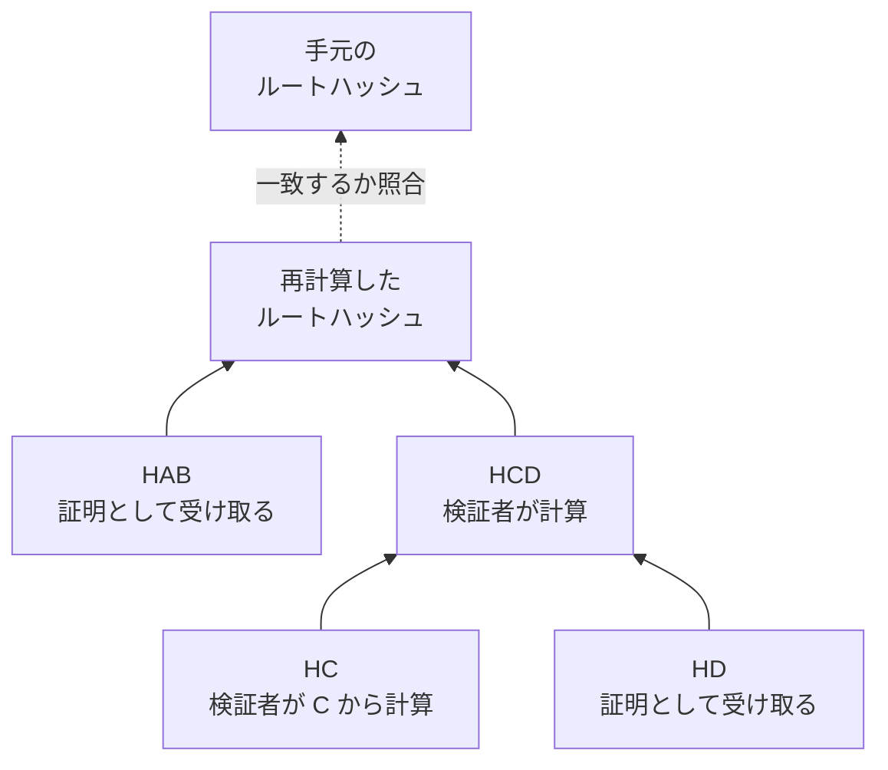
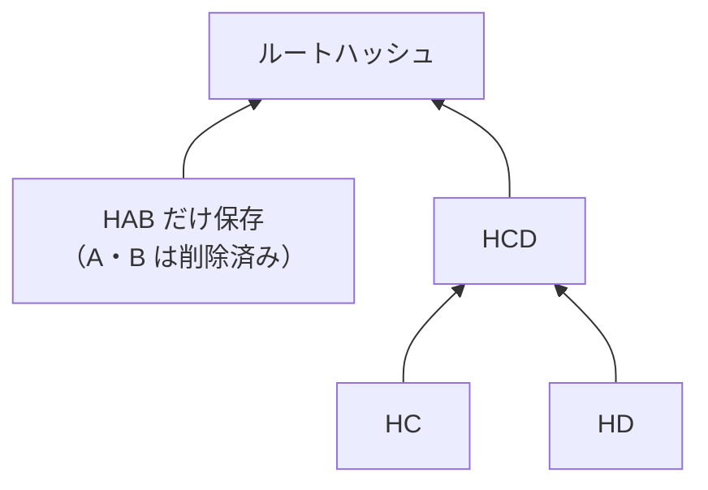

Merkle Tree（マークルツリー、ハッシュ木）は、データの並びを 2 つずつハッシュ関数で畳み込み、最後に 1 つの値へまとめる木構造です。まとまった 1 つの値をルートハッシュと呼びます。全件を持つ側は、データ 1 件と少数のハッシュだけを渡して、その 1 件が並びに確かに含まれていた事を相手に検証させられます。

この証明が効くのは、データの集まり全体を持てない相手に、一部だけを渡して検証させたい場面です。代表例は Bitcoin で、白書には、数千件の取引を含むブロックを丸ごと保持しないクライアントが、少数のハッシュだけで自分宛の取引 1 件がブロックに入っている事を確かめる方式が示されています。

説明には A・B・C・D という 4 件のデータだけを使い、Bitcoin の詳細には立ち入りません。ハッシュ関数は、異なる入力から同じハッシュ値を意図的に作る事が現実的にできない、安全なものを使う前提です。Bitcoin への当てはめは、末尾の「どこで使われているか」から [Bitcoin Merkle Tree](../bitcoin-merkle-tree/) へ繋ぎます。

---

### 木の作り方とルートハッシュ

4 件のデータ A・B・C・D からルートハッシュがどう決まるかを以下に示します。図の矢印は、下の値から上の値を計算する向きです。

作り方は 3 手順です。各データをハッシュして HA から HD を作る。隣同士を左から組にし、HA と HB をこの順にバイト列として繋げてハッシュした値 HAB を 1 段上に置く（HC と HD から作る HCD も同様）。値が 1 つになるまで同じ操作を繰り返し、最後に残った値がルートハッシュです。

上図の最下段にある HA から HD を葉、HAB と HCD を内部ノードと呼びます。木の同じ高さに並ぶ値のまとまりが段です。葉が奇数の場合にどう組むかは決め方が複数あり、[Merkle Tree Design](../merkle-tree-design/) で扱います。

ルートハッシュは、4 件の内容と並び順の両方を代表します。C を 1 バイトでも書き換えると、HC が変わり、HCD が変わり、ルートハッシュも変わります。並びを B・A・C・D へ入れ替えた場合も、連結する順序が変わるため別のルートハッシュになります。

---

### 包含証明

登場人物は 2 者です。全件を持つ配布側と、C を 1 件だけ持つ検証者です。検証者は、正しいルートハッシュを信頼できる経路で入手済みとします（証明を送ってくる相手からルートハッシュも受け取ると、両方を偽造できるため検証になりません）。確かめたいのは、手元の C が、そのルートハッシュの表す並びに確かに含まれていた事です。2 者のやり取りを以下に示します。

上図で配布側が渡すのは、HD と HAB の 2 個だけです。この並びを包含証明と呼びます。証明に入るのは、C から根まで登る道の各段で連結相手になるハッシュ 1 個ずつなので、証明の個数は段の数と一致します。検証者の計算を以下に示します。

検証者の手順は 3 つです。手元の C をハッシュして HC を作る。HC の右に受け取った HD を繋げてハッシュし、HCD を得る。HCD の左に受け取った HAB を繋げてハッシュし、出てきた値を手元のルートハッシュと照合する。一致すれば、C はルートハッシュが代表する 4 件の中に確かに入っていました。連結する順序で結果が変わるため、証明の各ハッシュには「左右どちら側に置くか」の情報も添えられています。

A・B・D の元データは 1 件も受け取っていません。A と B は HAB の中に畳み込まれており、中身を知らなくても計算は進みます。初めて見る場合は、HAB の中身を知らずに検証が終わる事が不思議に感じられる筈です。ハッシュ値さえあれば上の段の計算は進む、という点が Merkle Tree の核心です。

偽造は、安全なハッシュ関数を使う限り現実的にできません。攻撃者は C の代わりの偽データも、証明側のハッシュも自由に選べます。どう選んでも、最後に再計算した値を手元のルートハッシュへ一致させるには、同じ値へ辿り着く別の入力を見つける必要があり、冒頭で置いたハッシュ関数の前提がこれを排除します。ただし、この保証は木の構築規則の決め方にも依存します。「欠点」の 4 番目と [Merkle Tree Design](../merkle-tree-design/) で扱います。

---

### 葉が増えても証明は少しずつしか増えない

証明の個数は段の数と同じでした。葉が 8 件になると段が 1 つ増えるため、証明のハッシュは 3 個になります。葉が倍になるごとに段は 1 つしか増えず、証明も 1 個しか増えません。葉が n 件の時の段の数、つまり証明の個数は `ceil(log2 n)` です。

具体的な件数で以下に示します。

| 葉の数 | 証明のハッシュの個数 |
|---|---|
| 4 | 2 |
| 8 | 3 |
| 1,024 | 10 |
| 約 100 万 | 20 |

全件を渡して検証する方式では、転送量が件数に比例して伸びます。Merkle Tree の包含証明なら、100 万件でもハッシュ 20 個です。出力が 32 バイトのハッシュ関数なら 640 バイトで、この差が、冒頭に挙げた「集まり全体を持てない相手に検証させる」場面を成立させています。

---

### 利点

- ルートハッシュ 1 つを持っていれば、任意の 1 件の包含を確かめられる
- 証明のサイズが件数の対数に収まり、件数が 2 倍になってもハッシュが 1 個増えるだけで済む
- 1 件でも書き換わるとルートハッシュが変わり、改竄が上位へ伝わる
- 元データを削除しても、その枝をまとめたハッシュを残せば、残りの葉の包含証明を作り続けられる

4 番目の性質を以下に示します。A と B を使い終わって削除しても、HAB さえ残せば C や D の包含証明はそのまま作れます。

---

### 欠点

以下は、証明のサイズを対数へ抑える事を優先した結果として現れる制約です。

- 対数サイズの証明では、含まれていない事を示せない
- ルートハッシュが正しいかどうかは、別の仕組みで確かめる必要がある
- 葉を追加・変更するたびに、根までの各段を計算し直す
- 奇数の葉の扱いや、葉と内部ノードの区別をどう決めるかで、保証の内容が変わる

この木で不在を示せないのは、検索するキーから葉の位置を絞れないためです。別のデータ E がどこにも無い事を示すには全ての葉を確かめるしかなく、少数のハッシュでは代われません。キーから位置が決まるように葉を並べる対策と、4 番目に挙げた構築規則の決め方は [Merkle Tree Design](../merkle-tree-design/) で扱います。

---

### 適さないケース

- 含まれていない事の証明が要る用途
- 葉の更新のたびに、新しいルートハッシュを信頼できる形で配り直す必要がある構成
- 検証する側がどのみち全件を保持している構成
- 葉が数件しかない構成。証明のサイズが全件を渡す場合とほとんど変わらない

---

### どこで使われているか

Bitcoin は、ブロックに入った取引の識別子（txid）を葉にして、ルートハッシュをブロックヘッダに収めています。ブロック全体を持たないクライアントは、ヘッダの列と包含証明だけで自分宛の取引を確かめられます。Bitcoin 固有の計算規則と検証の仕組みは [Bitcoin Merkle Tree](../bitcoin-merkle-tree/) で、前提となるブロックの構造は [Bitcoin Block](../bitcoin-block/) で説明しています。

TLS 証明書の発行記録を追記専用のログへ残す Certificate Transparency（[RFC 9162](https://www.rfc-editor.org/rfc/rfc9162.html)）も、ログ全体をルートハッシュで代表し、個々の証明書の包含を対数サイズで証明します。Ethereum は、キーで経路が決まる trie と組み合わせた Merkle Patricia Trie でアカウントの状態を管理しています。プロトコルごとの構築規則の違いは [Merkle Tree Design](../merkle-tree-design/) で扱います。
