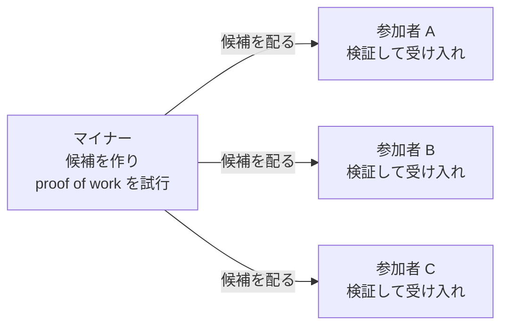
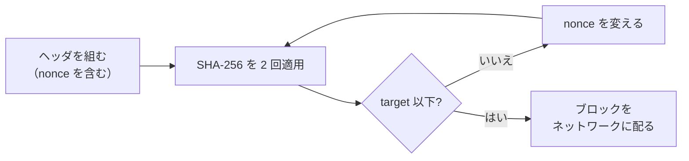
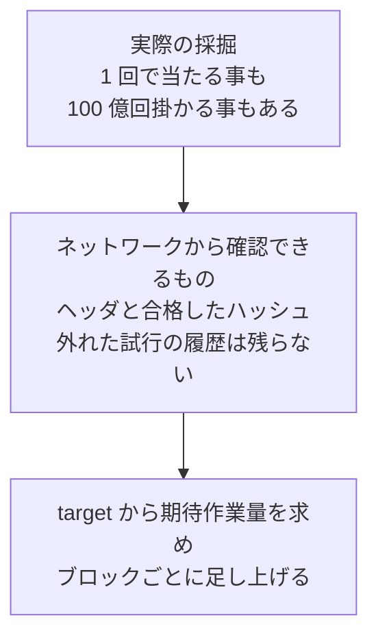
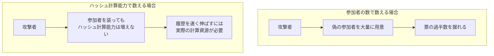
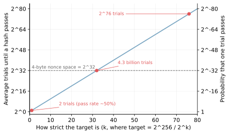
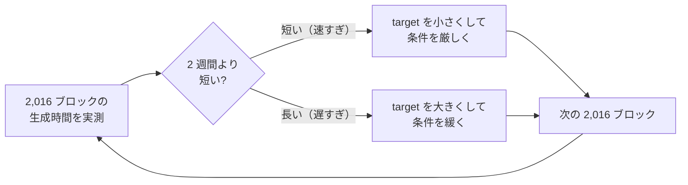
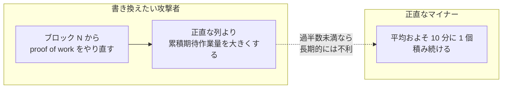

proof of work（作業証明）は、条件を満たすハッシュ値の提示を参加者に課す仕組みで、その値を見付けるには平均すると大量のハッシュ計算が必要です。作る側は合格が出るまで試行を繰り返す一方、入力とハッシュ値の組を受け取った側は、同じ入力に同じハッシュ計算を 1 度やり直すだけで、条件の成立を確かめられます。

注意点として、提示されたハッシュ値は、実際に行われた計算の回数を証明しません。運が良ければ 1 回目の試行で合格する事もあり、受け取った側から実際の回数は分かりません。この仕組みを支えるのは、合格を得るには平均で大量の試行が必要で、検証は 1 回の計算で済むという非対称性です。

合格を得るために平均して必要な作業量は「期待作業量」、単位時間あたりに実行できるハッシュ計算の量は「ハッシュ計算能力」と、以下では呼び分けます。実際の試行回数は、この 2 つのどちらとも別で、外から観測できない値です。

Bitcoin では、ブロックが有効な候補として受け入れられるには proof of work を満たす必要があります。ブロックの候補を作り、合格のハッシュを探す参加者をマイナー（miner）と呼びます。マイナーと他の参加者の関係を以下に示します。



上記の図のとおり、マイナーは候補をネットワークに配るだけで、受け取った各参加者が proof of work と他の規則を検証し、有効なら自分の列に受け入れます。権利を配る主体は居ません。ここで説明するのは Bitcoin の proof of work で、ブロックとヘッダの構造は [Bitcoin Block](../bitcoin-block/) の内容を前提にします。採掘用ハードウェアの詳細や報酬の経済性には触れません。

[Bitcoin の白書](https://bitcoin.org/bitcoin.pdf)は、この仕組みを Adam Back の Hashcash（電子メールの送信に少量の計算を課して大量送信を防ぐ提案）に似たものとして導入しています。proof of work が必要なのは、参加者の名簿が無いネットワークで、誰のブロック候補が履歴を前に進めるかを競争で決める場面です。

Bitcoin のブロックは、取引の並びを全参加者で共有するための単位でした。誰かがその並びの末尾に追加する役を担う必要があるものの、Bitcoin には登録も許可も無く、役を任せる相手を選ぶ名簿が存在しません。

マイナーは、ヘッダの中の nonce という値を変えながらハッシュを計算し、決められた上限（target）を下回る値が出るまで繰り返します。作業の全体は以下の通りです。



上記の図の試行の繰り返しが採掘（マイニング）で、合格のハッシュが出た時点で、ブロックを有効な候補としてネットワークに配れます。受け取った参加者は、proof of work に加えて取引の中身も検証してから、ブロックを自分の列に受け入れます。

---

### なぜ計算作業が票になるのか

[Bitcoin Block](../bitcoin-block/) で見たとおり、チェーンの末尾が分岐した時、各参加者は累積した期待作業量が最も大きい列を正しい履歴として採用します。白書も「多数決は、最大の proof of work の労力が投じられた最長のチェーンによって表される」と述べており、どの列が正しいかという多数決の票が累積した期待作業量です。白書の「最長」は、条件の厳しさが同じ期間なら長さと期待作業量が一致する前提の言い方です。ここで、票を参加者の数で数えられない事が名簿の無いネットワークの制約になります。

この期待作業量は、実際に実行された計算の回数ではありません。実際の回数と、ネットワークが評価する量の関係は以下の通りです。



上記の図のとおり、各参加者はブロックヘッダと合格したハッシュを確認できるものの、そこまでに何回失敗したかは分かりません。そこで、各ブロックの target から期待作業量を求め、ブロックごとに足し上げた累積が列を比較する基準になります。Bitcoin Core が列の比較に使う chainwork も、この累積で、実行された SHA-256 の回数の記録ではありません。

白書は、この問題を「多数決の基準を 1 IP アドレス 1 票にすると、多数の IP アドレスを確保できる者に乗っ取られ得る。proof of work は本質的に 1 CPU 1 票である」と説明されています。1 人が多数の参加者を装う攻撃はシビル攻撃（Sybil attack）と呼ばれ、安く量産できるものを票に使う限り避けられません。

なお、白書が CPU と呼ぶものは、採掘の主力が ASIC（Application-Specific Integrated Circuit、SHA-256 の計算だけを高速に行う採掘専用チップ）に移った現在では、実質的にハッシュ計算の能力と読み替えると分かりやすいと考えられます。

数え方の違いで何が起きるかは、以下の通りです。



上記の図の右側では、ブロックを見付ける機会がハッシュ計算能力に紐付いています。偽の参加者を増やしてもハッシュ計算能力は増えないため、履歴を伸ばす力は増えません。ハッシュ計算能力を増やすには現実の計算資源とそれを動かすコストが必要なため、票の偽造に実費が掛かります。安全の根拠が、参加者の身元ではなく物理的な資源の消費に置き換わっています。

---

### target - 合格の条件を数で表す

ヘッダに SHA-256（Secure Hash Algorithm 256、出力が 32 バイト = 256 ビットのハッシュ関数）を 2 回適用したハッシュ値を 256 ビットの数として読み、その値が target と呼ぶ基準値を超えなければ合格です。ハッシュを 2 回重ねる理由は白書に書かれていないため、ここでは規則としてそのまま扱います。

target はヘッダの bits 項目に圧縮して収められており、[Bitcoin Block](../bitcoin-block/) のヘッダの表で「合格条件（target）の圧縮表現」と書いた項目が、この target です。

SHA-256 の出力に既知の偏りは見付かっておらず、確率の計算では、2^256 通りある 256 ビットの値のどれも同じ確からしさで出るとみなします。この見方に立つと、1 回の試行が合格する確率は「target 以下の値の個数 ÷ 2^256」で決まります。

0 から target までの値は target + 1 個あるので、厳密には (target + 1) ÷ 2^256 で、概算では target ÷ 2^256 と見て差し支えありません。target を半分にすれば合格の確率もほぼ半分に、必要な試行回数の平均はほぼ 2 倍になります。

target を 2^256 の 1/2^k と書くと、1 回の試行が合格する確率（pass rate）は 2^-k、合格までの平均試行回数（average trials）は 2^k です。k を大きくした時の 2 つの値は以下の通りです。



白書には、この非対称性が「必要な作業量の平均は、要求するゼロビットの数に対して指数的に増え、検証はハッシュを 1 回実行するだけで済む」と書かれています。ゼロビットという表現は、target が小さいほどハッシュの上位ビットに 0 が並ぶ事を指した言い方で、実装での判定は target との大小比較です。

---

### nonce の探索 - 総当たりを繰り返す事になる理由

近道として考えられるのは、target 以下のハッシュ値から入力を逆算する方法と、入力を少し変えた時の次の出力を予測して当たりを絞る方法です。SHA-256 にはそのどちらも知られておらず、入力を少しずつ変えては出力を確かめる総当たりより、必要な試行回数を減らせる方法も見付かっていません。白書も、実装を「ブロックのハッシュが要求されたゼロビットを持つ値になるまで、ブロックの中の nonce を増やしていく」と書かれています。

近道が見付かればこの前提は崩れます。逆算の難しさは [Hash Function](../hash-function/) の「3 つの耐性」で、近道が見付かった関数の扱いは同じノートの欠点で説明しています。SHA-1 のように、近道が見付かって用途から外された関数も実際にあります。

総当たりの骨格をコードにすると以下になります。header はヘッダを規約どおりに直列化した 80 バイトで、nonce は末尾の 4 バイトに入ります。

```go
// mine は、2 回の SHA-256 が target 以下になる nonce を探します。
func mine(header []byte, target *big.Int) (uint32, bool) {
	buf := make([]byte, len(header))
	copy(buf, header)
	for nonce := uint32(0); ; nonce++ {
		binary.LittleEndian.PutUint32(buf[76:], nonce)
		first := sha256.Sum256(buf)
		second := sha256.Sum256(first[:])
		// Go の SHA-256 が返すバイト列を、Bitcoin の proof of work 判定で
		// 使う整数の表現に合わせて反転する
		slices.Reverse(second[:])
		if new(big.Int).SetBytes(second[:]).Cmp(target) <= 0 {
			return nonce, true
		}
		if nonce == math.MaxUint32 {
			// nonce を使い切った。ヘッダの別の項目を変えて再挑戦する
			return 0, false
		}
	}
}
```

上のコードの反転は、ハッシュ値の整数としての読み方を Bitcoin の判定に合わせる処理です。途中で合格を見付けて抜けた場合、それまでの試行の結果は何も残りません。試行の間で成果は引き継がれず、外れたハッシュは捨てるだけです。

nonce は 4 バイトなので、全て試しても約 43 億通り（2^32 通り）です。target の節の図で引いた破線がこの上限で、合格の確率が 1/2^76 ほどの水準では、43 億回の試行で合格が出ない事の方が普通です。しかも現在の採掘装置は毎秒それを超える回数を計算します。nonce を使い切ったら、ヘッダの別の場所を変えて続けるしかありません。

[Bitcoin Wiki](https://en.bitcoin.it/wiki/Block_hashing_algorithm) は、nonce が一巡するたびにコインベース取引の中の extraNonce という領域を増やし、[ルートハッシュ](../bitcoin-merkle-tree/)を作り直すと説明されています。ヘッダの中身が変われば、nonce の全パターンをもう一度試せます。

合格した nonce を横取りして自分のブロックに使えるのではないか、と考える方がいるかもしれません。nonce はヘッダ全体のハッシュに対する合格なので、報酬の宛先を自分に変えるとコインベース取引が変わり、ルートハッシュ経由でヘッダも変わって不合格に戻ります。作業の成果は、作業を始める前に固定したブロックの中身（報酬の宛先を含む）にしか使えません。

---

### 難易度の調整 - 平均 10 分に戻す仕組み

ネットワーク全体のハッシュ計算能力は、装置の追加や撤退で常に変わります。target が固定なら、ハッシュ計算能力が増えるほどブロックの平均の間隔は縮み、[Bitcoin Block](../bitcoin-block/) で前提にした「およそ 10 分に 1 個」は保てません。白書は、この補正を「難易度は、1 時間あたりのブロック数の平均を目標とする移動平均で決める。生成が速すぎれば難易度が上がる」と書かれています。

実装の規則は次のとおりです。[Bitcoin Developer Guide](https://developer.bitcoin.org/devguide/block_chain.html) によると、2,016 ブロックごとに、ヘッダの時刻からその 2,016 ブロックの生成に掛かった時間を求め、理想値の 1,209,600 秒（2 週間、10 分 × 2,016 ブロック）と比べて target を比例配分で調整します。1 回の調整幅には上限があり、難易度を上げる方向は 4 倍（+300%）、下げる方向は 4 分の 1（−75%）までです。

この調整が保つのは、長期的な平均がおよそ 10 分に戻る事だけです。個々のブロックの間隔は試行の運でばらつき、参加するハッシュ計算能力が急に変わっても、次の調整までは前の target のまま進みます。

なお、同ガイドは、実装の off-by-one により計測が実際には 2,015 ブロック分の時刻差になり、わずかな偏りが生じるとも注記しています。

以下が調整の繰り返しです。



上記の図の実測に使う時刻は、マイナーが申告するヘッダの時刻です。全参加者が同じヘッダの列から同じ規則で次の target を計算できるため、難易度の調整に管理者は必要ありません。申告された時刻をどこまで信用するか、偽装にどう耐えるかの検証規則は、ここでは扱いません。[Bitcoin Block](../bitcoin-block/) のノートで「条件の厳しさは自動で調整される」と書いた仕組みの中身が、この 2,016 ブロックごとの再計算です。

---

### 書き換えの壁として働く

[Bitcoin Block](../bitcoin-block/) では、過去の取引を書き換えると後続の全ヘッダの作り直しが必要だと説明しました。proof of work は、その作り直し 1 回ごとの値段を付けている側です。白書には「過去のブロックを書き換えるには、そのブロックと後続の全ブロックの proof of work をやり直し、さらに正直なノードの作業に追い付いて追い越す必要がある」と書かれています。

正直なマイナーは、規則どおりにブロックを作り、見つけたらすぐ公開する参加者です。追い付く必要があるのは、書き換えの間もその列が伸び続けるからです。白書は「CPU 能力の過半数を正直なノードが握っていれば、正直なチェーンが最も速く伸び、競合するどのチェーンも引き離す」とも述べています。逆に言えば、この壁はハッシュ計算能力の過半数を正直なマイナーが持つ事を前提にしており、そこが崩れた場合の保証はありません。

攻撃者が背負う競争は以下の通りです。



上記の図の競争で、攻撃者のハッシュ計算能力が過半数未満でも、運が続けば一時的に追い付く事はあり得ます。ただし、取引の上に積まれたブロックが増えるほど、追い付くために必要な幸運は大きくなります。白書も、追い付くべきブロック数が増えるほど攻撃者の成功確率は指数的に下がると分析しています。

[Bitcoin Block](../bitcoin-block/) のノートで、取り込まれた直後の取引は「確定に向かう」としか言えないと述べた事の裏返しで、確からしさは時間とともに積み上がります。

---

### 利点

- 参加に許可も名簿も必要なく、誰でも採掘と検証に加われる
- 生成には平均して大きな作業量が必要な一方、検証は 1 度の計算し直しで済む
- 偽の参加者を量産しても、ブロック追加の多数決の票は増えない
- 難易度の調整によって、参加するハッシュ計算能力が増減してもブロック間隔の長期的な平均がおよそ 10 分に戻る

---

### 欠点

以下は、安全の根拠を物理的な資源の消費に置いた事の帰結です。

- 採掘の計算は合格のハッシュを探す事だけに使われ、大きなハッシュ計算能力の維持には装置と電力のコストが必要
- ブロック間隔の平均を保つ設計のため、取引が取り込まれるまでの待ち時間は縮まらない
- ハッシュ計算能力の過半数を握る主体が現れると、書き換えを防ぐ前提が崩れる
- 採掘が装置の性能競争になり、ハッシュ計算能力が専用ハードウェアを持つ参加者に集中しやすい

1 番目の電力は、proof of work への批判で最も多く挙がる点です。計算の中身は合格探し以外の意味を持たないものの、その消費こそが票の偽造を高価にしている当のものなので、消費を削れば安全の根拠も一緒に細ります。

---

### 適さないケース

- 参加者の名簿がある許可制のネットワーク。参加者が既知なら、[Leader and Followers](../../distributed-systems/leader-and-followers/) のような構成や[クォーラム](../../distributed-systems/quorum/)を使う合意方式など、参加者を前提にした方法を選べる
- 秒単位で確定してほしい決済や更新（ここで扱った Bitcoin の作りでは、ブロックの間隔と確認の積み上げを待つ）
- 電力と装置のコストを正当化できない規模のシステム

1 番目が最も重要な判定だと考えられます。proof of work が支払っているコストは、全て「参加者を特定も信頼もできない」という前提への対価です。その前提が無い環境で採用すると、対価だけを払う事になります。
