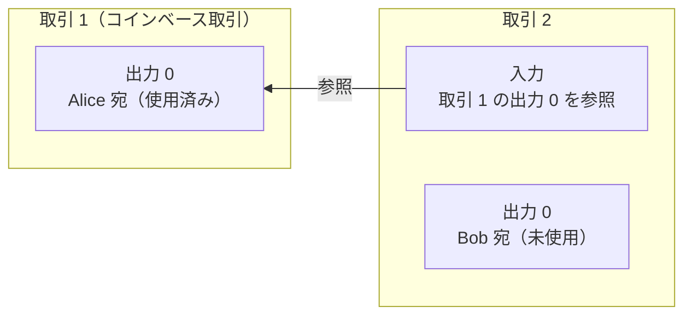
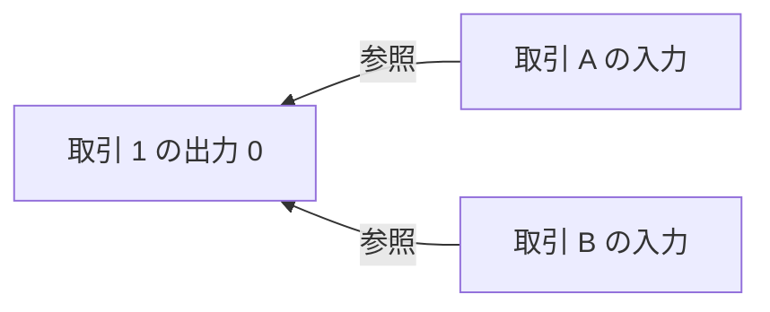
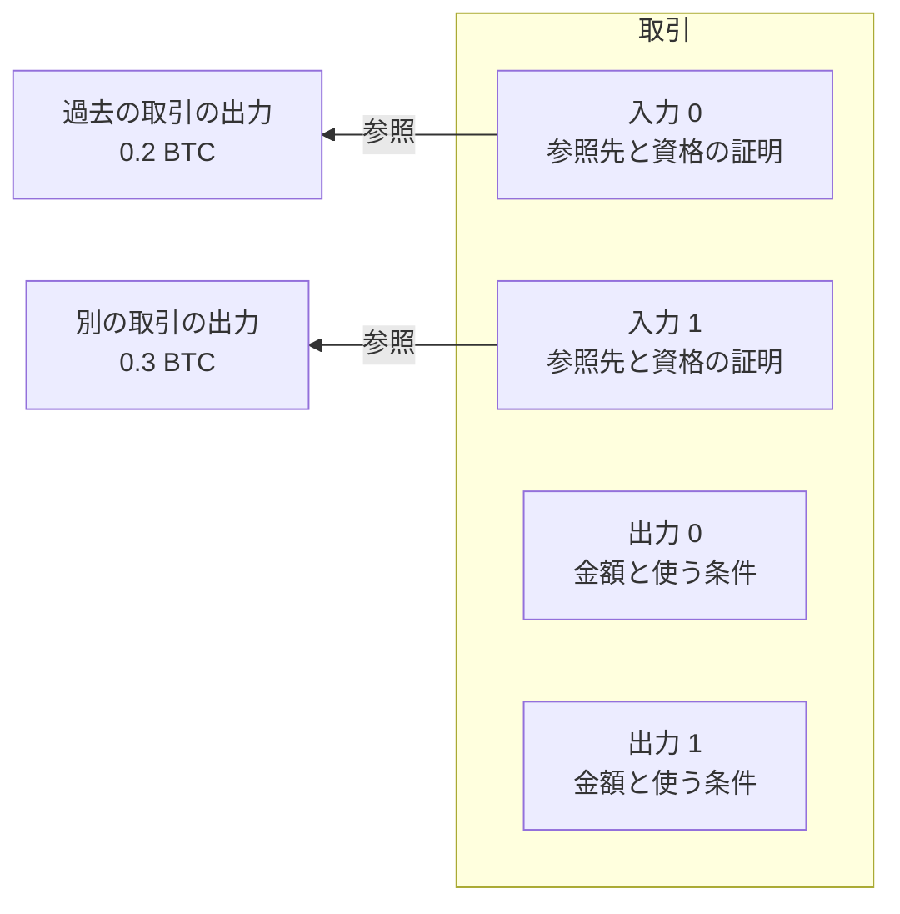
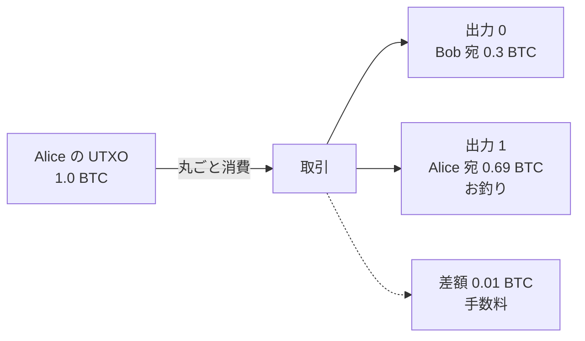
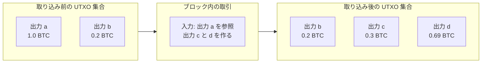

UTXO（Unspent Transaction Output、未使用の取引出力）は、取引の出力（金額と使う条件が書かれた、コインの置き場）のうち、まだ別の取引に消費されていない物です。Bitcoin には口座という仕組みも、残高という 1 つの値を直接更新する場所もありません。支払いは、過去の取引が作った出力を丸ごと消費し、新しい出力を作る事で表されます。まだ消費されていない出力を集めた物は、UTXO 集合（UTXO set）と呼ばれます。

ここで扱うのは、取引（transaction）の構造と、UTXO で残高と支払いがどう表されるかです。取引がブロックに取り込まれて履歴の中の位置を得る流れは [Bitcoin Block](../bitcoin-block/) で説明しています。使う資格を確かめる署名の計算と、出力に書く条件の言語（Script）の中身は扱いません。

この表し方を知りたくなる場面の代表は、ウォレットが表示する残高の正体を知りたい時です。画面に出る「0.5 BTC」のような数は、どこかに保存された値ではなく、自分宛の UTXO を集めて合計した結果です。支払いの余りがお釣りの出力になる事も、手数料が入力と出力の差として決まる事も、この表し方から導かれます。後半の「UTXO 集合と残高の計算」でこの場面に戻ります。

コインが取引から取引に渡っていく様子を以下に示します。図の矢印は、入力が持つ参照の向きです。

上記の図で、取引 1 の出力は、それを消費する取引 2 がブロックに取り込まれた時点で使用済みになり、コインは Bob 宛の出力に移ります。まだ消費されていない Bob 宛の出力が UTXO で、Bob はこれを参照し、使う資格を証明する取引を作ればコインを使えます。図の取引 1 はコインベース取引（[Bitcoin Block](../bitcoin-block/) で説明した、ブロックの先頭に置かれる報酬の取引）で、出力の参照をどこまでも遡ると、コインベース取引に行き着きます。

Bitcoin の白書も、コインを「[a chain of digital signatures](https://bitcoin.org/bitcoin.pdf)」（電子署名のチェーン）と定義しています。コインの実体は口座に記録された数値ではなく、取引から取引に連なる出力と、それを使う資格の証明です。ただし、取引は複数の入力と複数の出力を持てるため、実際の連なりは 1 本の鎖ではなく、合流と分岐を持つグラフになります。

---

### UTXO では競合をどう表すのか

Bitcoin には履歴を管理する中央のサーバが無く、取引が有効かどうかは世界中の参加者がそれぞれ検証します。この環境で問題になるのが、同じコインを 2 回使おうとする取引の競合の表し方です。比較のために、残高だけで状態を表し、「Alice の残高から 0.3 BTC 引いて Bob の残高に 0.3 BTC 足す」という素朴な方式を考えます。

この方式の取引が消費するのは Alice の残高という状態で、取引のデータには「残高から引く」としか書かれていません。例えば、残高 0.4 BTC の Alice が 0.3 BTC の支払いを 2 つ作ると、2 つは同じ残高を取り合っています。

しかし、この方式の取引には、Alice の残高のうちどの部分を取るのかを名指しする識別子が無く、2 つを並べて見比べても、同じ物を取り合っているとは表れません。残高を追って初めて、両方は成立しないと分かります。残高で状態を表す実際の方式（アカウントモデル）が競合をどう扱うかは、「アカウントモデルとの違い」で触れます。

UTXO では、入力が「どの取引の何番目の出力を消費するか」の指定（outpoint）を取引の中に持ちます。入力に書かれるのは参照で、その入力を含む取引がブロックに取り込まれると、参照先の出力が消費済みになります。同じ outpoint を参照する取引が 2 つあれば、両方が同じ有効な履歴で成立できない事が、参照の重複としてデータに表れます。

素朴な方式では、検証に Alice の残高という現在の状態を追う必要がありました。現在の状態が必要な事は、UTXO の検証でも変わりません。参照先の出力が消費されずに残っているか、金額はいくらか、使う条件を満たしているかの確認が必要です。違いは、どの状態を消費するかが取引の中に名指しされている点です。

同じ出力を 2 つの取引が参照した状態は以下の通りです。

上記の図の取引 A と取引 B は同じ outpoint を参照しているため、有効な履歴の中で両方が成立する事はありません。ただし、どちらを残すかを決めるには、取引の順序についての合意が別に必要です。その順序を作る仕組みがブロックのチェーンで、[Bitcoin Block](../bitcoin-block/) で説明しています。UTXO が引き受けるのは、競合を参照の重複として見える形にする部分です。

---

### 取引は入力と出力の並び

取引は、入力（input）の並びと出力（output）の並びを持つデータです。入力は過去の出力を消費し、出力は新しいコインの置き場になります。入力 2 つと出力 2 つを持つ取引の形は以下の通りです。図の矢印は、入力が持つ参照の向きです。

上記の図の取引が使えるのは、0.2 BTC と 0.3 BTC を合わせた 0.5 BTC です。出力 2 つの金額の合計は、この 0.5 BTC 以下にする必要があります。合計が 0.5 BTC を下回った場合の差の行き先は、後述の手数料です。以下が入力と出力の主な項目です。

| 項目 | 置き場所 | 何を表すか |
| --- | --- | --- |
| 参照先（outpoint） | 入力 | どの取引（txid）の何番目の出力を消費するか |
| 使う資格の証明 | 入力 | 参照先の条件を満たす署名などのデータ |
| 金額 | 出力 | satoshi 単位の整数 |
| 使う条件 | 出力 | この出力を使うために満たすべき条件 |

txid は取引の識別子です。出力には 0 から始まる番号が付き、入力は txid とこの番号の組（outpoint）で参照先を指します。satoshi は Bitcoin の最小の通貨単位で、金額は全て satoshi 単位の整数として記録されます。1 BTC は 1 億 satoshi です。

txid の計算方法は、[Bitcoin Merkle Tree](../bitcoin-merkle-tree/) の「葉は txid」で説明しています。SegWit（Segregated Witness）では、署名などを格納する witness という領域が追加されました。この領域が txid の計算に含まれない事も、同じ節で扱っています。

表の 4 行目の「使う条件」は、Script という条件を書くための小さな言語で表現されます。代表的な条件は「この公開鍵に対応する署名を添えた者だけが使える」で、支払いの宛先に使うアドレスは、この条件を組み立てるための情報を符号化した文字列です。条件式の書き方は、ここでは扱いません。

手数料の項目は、取引のどこにもありません。[白書](https://bitcoin.org/bitcoin.pdf)は、出力の金額の合計が入力の合計より少なければ、その差が手数料としてその取引を含むブロックの報酬に加わると書かれています。手数料は、取引を取り込んだマイナーの報酬になります。

---

### お釣りは自分宛の出力で作る

入力は出力を丸ごと消費します。出力の一部だけを使う書き方は、取引の形式に存在しません。出力は使用済みか未使用かの 2 つの状態しか持たず、金額が減っていく中間の状態が無いため、二重使用かどうかは、参照先の出力が UTXO 集合にまだ残っているかどうかで判定できます。

手元の UTXO の金額が支払いたい額と一致する事は稀なので、多くの取引は、余った分を自分宛の出力として戻します。この自分宛の出力がお釣り（change）です。例えば、1.0 BTC の UTXO を 1 つ持つ Alice が、Bob に 0.3 BTC 払う取引は以下の通りです。この図の矢印は、これまでの参照の向きとは逆で、コインが移る向きです。

上記の図の手数料 0.01 BTC は、出力としてどこにも書かれず、入力と出力の差として残ります。金額は例で、手数料をいくら残すかは取引を作る人が決めます。[白書](https://bitcoin.org/bitcoin.pdf)は、典型的な取引の形として、1 つの大きな入力か小さな金額を組み合わせる複数の入力と、支払い先とお釣り先（あれば）という最大 2 つの出力を挙げています。これは白書での説明の形で、出力を 3 つ以上持つ取引も作れます。

金額が足りない時は、複数の UTXO を入力に並べて合算します。入力が増えるほど取引のデータは大きくなります。マイナーは通常、仮想サイズ（witness 部分を割り引いて数えた取引の大きさ）あたりの手数料率（feerate）が高い取引を優先して取り込むため（[Bitcoin Block](../bitcoin-block/)）、大きい取引が同じ優先度を得るには多くの手数料が必要です。そのため、細かい UTXO ばかり持っている人は、同じ金額の支払いでも手数料がかさみやすいと考えられます。

---

### UTXO 集合と残高の計算

フルノード（[Bitcoin Merkle Tree](../bitcoin-merkle-tree/) で説明した、ブロックと取引を自力で検証する参加者）は、冒頭で定義した UTXO 集合を保ちます。ブロックを 1 つ受け入れるたびに、中の各取引について、入力が消費した出力を集合から消し、新しくできた出力を集合に足します。

ブロックの取り込みで集合が入れ替わる様子は以下の通りです。

上記の図の入れ替えを続けると、集合にはまだ消費されていない出力だけが残り続けます。入力が集合に無い出力を参照する取引は無効です。既に消費された出力への参照も、初めから存在しない出力への参照も、同じ「集合に無い」という判定で弾かれます。参照先が集合に残っている事は検証項目の 1 つで、実際の検証ではこのほかに、金額の合計や使う条件の確認なども行われます。

集合の中身は、どの参加者も同じチェーンから同じ規則で組み立てるため、チェーンが同じなら一致します。中央のサーバが残高を配らなくても、全参加者が同じ判定基準を持てます。なお、チェーンの末尾が巻き戻った場合（[Bitcoin Block](../bitcoin-block/) で説明した分岐の解消）は、外れたブロックの取引が集合に加えた変更も取り消されます。

残高は、この集合から計算します。「Alice の残高」という記録はどこにも無く、ウォレットは、出力の「使う条件」を手元の鍵で満たせる UTXO を拾い出し、金額を合計して残高として表示します。冒頭の「0.5 BTC」という表示の正体はこの合計です。

残高がどこにも保存されていない事は、口座に慣れていると意外に感じられるかもしれません。例えば、0.3 BTC と 0.2 BTC の UTXO を 2 つ持つ状態と、0.5 BTC の UTXO を 1 つ持つ状態は、画面の上ではどちらも同じ 0.5 BTC になります。

---

### UTXO モデルの性質

以下は、コインを使い切りの出力の連鎖として表した事で得られる性質です。

- コインの所在の正本が取引の連なりそのもので、UTXO 集合はそこから組み立て直せる
- 二重使用の競合が、同じ outpoint への参照の重複として構造に表れる
- 一度消費された出力を参照する取引は、参照先が集合から消えているため同じチェーンに再び取り込めない
- 出力の参照を遡る事で、その出力に繋がる過去の取引を辿れる

---

### UTXO モデルの制約

以下は、口座という状態を持たない事の裏返しとして現れる制約です。

- 出力を一部だけ使えないため、入力の合計が支払い額と手数料に一致しなければ余りをお釣りの出力として作る事になる
- 細かい UTXO が溜まると、支払いに多くの入力が必要で、取引が大きくなって手数料がかさむ
- 残高を直接持たないため、支払いのたびに金額に見合う UTXO の組を選んで合算する事になる

細かい UTXO は、自分宛にまとめて送る取引で 1 つの出力に統合できます。ただし、その統合の取引にも手数料が掛かります。

---

### アカウントモデルとの違い

アカウントモデルは、口座ごとに残高を状態として保存し、取引が残高を直接増減させる表し方です。例えば、Bitcoin と同じくブロックチェーンを使う基盤である Ethereum が採用しており、利用者が鍵で管理する口座（EOA、Externally Owned Account、外部所有アカウント）は、残高と取引の通し番号（nonce）を持ちます。この表し方の詳細は [Ethereum Account Model](../ethereum-account-model/) で扱っています。

EOA の nonce は、そのアカウントから実行された取引に応じて 1 ずつ増える通し番号です。取引は次に来るべき番号を名乗り、同じ番号の取引は 1 つしか取り込まれません。この nonce は、[Bitcoin Block](../bitcoin-block/) で説明したブロックヘッダの nonce（合格するハッシュを探すために変え続ける値）とは別物です。以下が 2 つのモデルの違いです。

| | UTXO モデル | アカウントモデル |
| --- | --- | --- |
| 残高 | 手元の鍵で使える UTXO を合計して計算する | 口座の状態として保存する |
| 支払い | 出力を使い切り、お釣りの出力を作る | 残高から金額を引く |
| 競合の扱い | 同じ outpoint への参照が両立しない | 同じ通し番号の取引が両立しない |
| 同じ取引の再実行 | 参照先が使用済みになり無効 | 口座の通し番号が進んでいるため無効 |

どちらのモデルも、取引の検証には現在の状態が必要です。違いは状態の表し方で、アカウントモデルは口座の残高と通し番号を更新し、UTXO モデルは既存の出力を消費して新しい出力を作ります。競合する取引が同じ outpoint への参照として明示される事は、この表し方から導かれる UTXO モデルの性質です。
