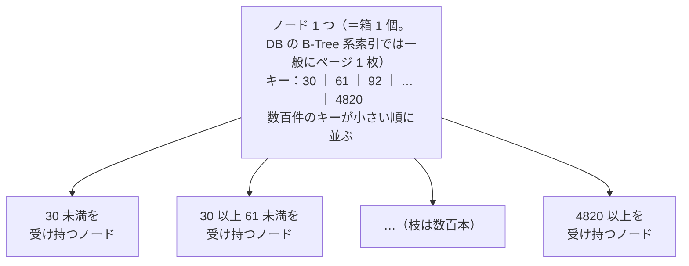
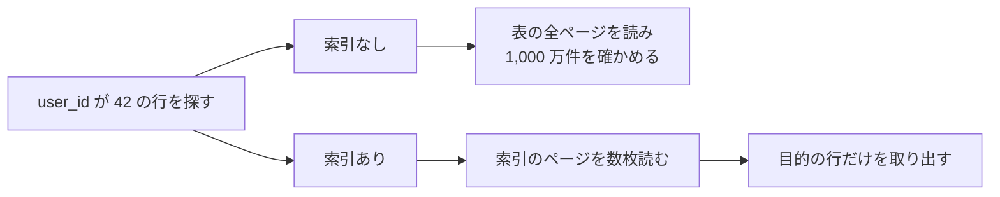
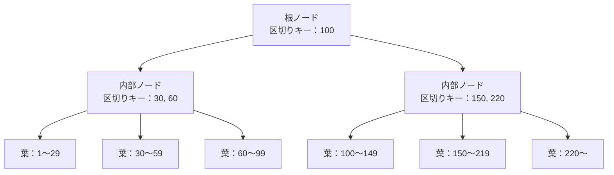
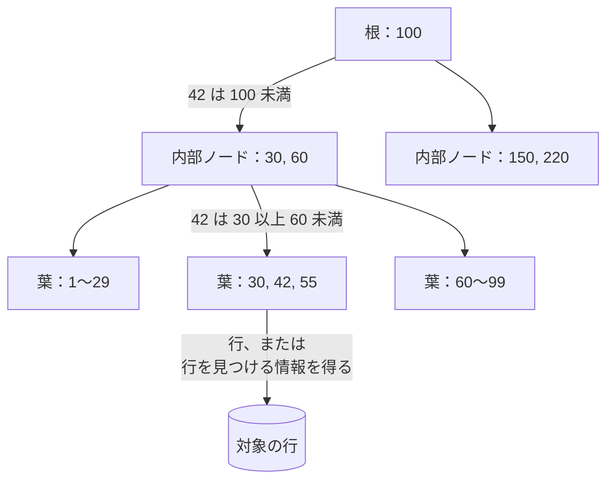
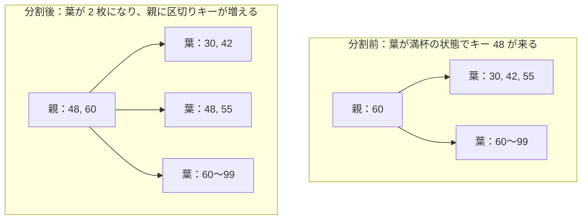
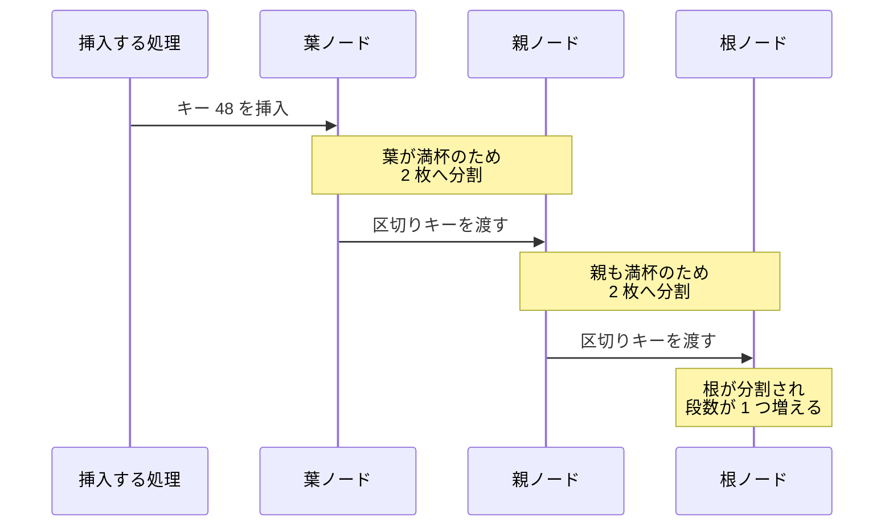
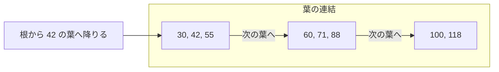

B-Tree は、1 つのノードに数百件のキーを並べる事で、木の段数を数段に抑えた探索木です。ノードとは木を構成する 1 つの箱を指します。この構造が最もよく使われるのは、RDB（リレーショナルデータベース）の索引（インデックス、index）の実装で、`CREATE INDEX` で作られる一般的な索引や、主キー・一意制約を支える索引には B-Tree 系の構造が広く使われます。

そのため、`WHERE user_id = 42` のような等値の絞り込み、`WHERE created_at BETWEEN ... AND ...` のような範囲の絞り込み、`ORDER BY created_at` のような並べ替えを DB が効率よく処理できるかどうかは、多くの場合この構造が土台になっています。

ただし、全ての DB の全ての索引が B-Tree だという意味ではありません。ハッシュ索引や全文検索用の索引など別系統の構造を持つ製品もあり、同じ製品の中でも用途で使い分けられます。以下では、その B-Tree 系の索引が、なぜ DB にとって都合の良い構造なのかを追います。

---

### 前提と説明の範囲

DB は表や索引をページという固定長の単位で管理し、ストレージとバッファキャッシュ（メモリ上に置くページの控え）の間でもページ単位で扱います。DB の B-Tree 系索引では、このページ 1 枚をそのまま 1 ノードとして構成する実装が一般的です。ノードをページへ合わせるのは B-Tree というデータ構造そのものの定義ではなく、ページ単位の入出力に構造を寄せるための実装上の選択になります。

ここまでに出てきたノードの姿を以下に示します。

上図の一番上にある箱 1 個がノードです。中にはキーが小さい順に数百件並び、隣り合うキーで区切られた区間ごとに、1 つ下のノードへの枝が伸びます。1 つの箱から枝が数百本へ分かれるので、箱を数個たどるだけで膨大な件数の中から目的のキーへ行き着けます。

本ノートで、説明する範囲も決めておきます。ここでは、1 台の DB が 1 本の索引を引く場合を扱い、複数の処理が同時に木を書き換える時の排他制御と、削除で空いたページの回収は対象外とします。以降の図と説明は、値を葉へ集めた B+tree という形で描きます。B-Tree と B+tree の違いは「葉に値を集める B+tree」の節で扱います。

---

### なぜ索引が必要なのか

この構造が必要になる場面の代表は、行数が増え続ける表からの絞り込みです。例えば、1,000 万件の注文が入った表から `user_id = 42` の注文だけを取り出すとします。ほかに使える手段が無ければ、DB は表の全ての行を読み、条件に合うかを 1 件ずつ確かめます。読む量が表の大きさに比例するため、注文が積み上がるほど同じ問い合わせの応答時間が伸びます。

索引は、この読み取りを必要なページだけへ絞ります。ただし、索引そのものもディスク上のデータ構造なので、索引を引く事自体にも読み出しが発生します。B-Tree の設計は、その読み出しを何回で済ませるかに向いています。

索引の有無で、ディスクから読むページがどう変わるかを以下に示します。

上図の索引なしの経路では、読むページ数が表の大きさで決まります。索引ありの経路で決まるのは、索引の木を降りる回数と、条件に一致した行を取り出すために読むページの枚数だけです。B-Tree が答えを出しているのは、この降りる回数をどこまで小さくできるかという問いになります。

---

### なぜ二分探索木では足りないのか

キーの順に並んだ探索木なら二分探索木でも同じ事ができるのではないか、と考える方がいるかもしれません。しかし、二分探索木をディスク上の索引に使うと、最悪の場合は木の段数と同じ回数だけページの読み出しが発生します。

DB がストレージとやり取りする単位はページなので、1 バイトだけ必要な場合もページ 1 枚をまるごと読み込む事になります。ページの大きさは製品で違い、MySQL の InnoDB は索引のページについて[「The default size of an index page is 16KB」（索引ページの既定の大きさは 16KB）と書いています](https://dev.mysql.com/doc/refman/8.4/en/innodb-physical-structure.html)。

二分探索木のノードはキー 1 個とポインタ 2 本しか持ちません。ポインタとは、別のページの位置を指す数バイトの値です。ノードをページに 1 個ずつ置くと、16KB を読んでも得られるのは比較 1 回分の情報になります。

そこで、1 ページに入るだけキーを詰め、1 回の読み出しで枝を数百方向へ絞ります。1 つのノードから伸びる枝の本数を分岐数と呼びます。分岐数を `f`、索引に入っているキーの件数を `n` とすると、根から葉まで通過するノードの個数はおよそ `log(n) / log(f)` になります。この個数が、ここで言う段数です。

分岐数を変えた時に段数がどう変わるかを以下に示します。

| 1 ノードの分岐数 | 1 億件を収めるのに必要な段数 |
| --- | --- |
| 2（二分探索木） | 27 段 |
| 100 | 4 段 |
| 500 | 3 段 |

この表は、全てのノードが十分に埋まっていて、内部ノードの分岐数がどこでも一定だとみなした理想化した概算です。実際の段数は、キーの長さやページヘッダの大きさ、ページがどこまで埋まっているか、葉と内部ノードで 1 ページに入る件数が違う事などで変わります。桁の感覚を掴むための目安として見てください。

それでも、分岐数を 2 から 500 へ増やすと段数が 27 から 3 の水準へ縮むという傾向は動きません。比較の総回数で見れば、二分探索木も B-Tree もどちらも `log(n)` に比例します。差が付くのは、その比較がページをまたぐかどうかで、B-Tree はノードの中の比較をページ 1 枚の内側へ閉じ込めています。

件数が 10 倍になっても段数は 1 つ増えるかどうかなので、表が育っても降りる回数はほとんど動きません。ただし、段数がそのまま毎回のディスク読み出し回数になるわけではありません。根や上位の内部ページは全ての探索が通るためアクセス頻度が高く、バッファキャッシュに残りやすいからです。実際に何回の物理 I/O が発生するかは、索引の大きさ、よく触られるデータの範囲、割り当てられたメモリ量、アクセスの偏り方などで変わります。

---

### ノードに詰め込むキーとポインタ

B-Tree のノードは、木の中の位置によって 3 種類に分かれます。一番上にある 1 つが根ノード、一番下に並ぶのが葉ノード、その間にあるのが内部ノードです。実装の一例として、PostgreSQL のドキュメントは、[葉が表の行を指す項目を持ち、内部ノードが 1 つ下の段を指す項目を持つと説明しています](https://www.postgresql.org/docs/current/btree.html)（原文では「tuples that point to table rows」と「tuples that point to the next level down」）。

同じ箇所には「Typically, over 99% of all pages are leaf pages.」（通常、全ページの 99% 超が葉ページになる）とあります。索引のページの大半は葉で、上の段は木を降りるための道案内だけを担うという事です。件数が増えた時に増えるのも、そのほとんどが葉のページになります。

根と内部ノードが持つ値が、区切りキーです。区切りキーは、下の段のどのページへ進むかを分ける境目の値になります。キーが 2 個並んでいれば、その 2 個で数直線が 3 つの区間に割れ、ポインタが 3 本伸びます。

キーと枝の対応を以下に示します。

上図の根は区切りキー 1 個で 2 本、内部ノードは 2 個で 3 本の枝を持ちます。葉が持つのは区切りキーではなく、キーと、そのキーに対応する行を見つけるための情報です。探している値がどの区間に入るかを決めれば、次に読むページが 1 枚に定まります。

葉に何が入るかは実装で分かれます。例えば PostgreSQL の通常の B-tree index は、表の本体（ヒープ）に置かれた行への参照を葉へ持ちます。InnoDB では、主キーの順に行を並べたクラスタ化索引の葉に行データそのものが入り、それ以外の列に張るセカンダリ索引の葉には主キーの値が入ります。どの形でも、葉まで降りればその先で目的の行に辿り着けるという点は共通します。

1 ノードに何件入るかは、ページの大きさとキーの長さで決まります。例えば、ページを 8KB、1 件あたりキー 8 バイトとポインタ 8 バイトの合計 16 バイトとして単純に割ると、1 ノードにおよそ 500 件が入ります。実際にはページのヘッダや 1 件ごとの管理用の領域も必要になるため、入る件数はこれより少なくなります。

キーが長い文字列であれば件数はさらに減り、段数が増えやすくなります。この計算は、索引を張る列の型が探索の速さに効く経路の 1 つです。比較そのもののコストも型で変わるので、速さが決まる要因はこれだけではありません。

---

### 根から葉へ降りる探索

探索は根から始まり、区間の判定を段ごとに 1 回ずつ行いながら葉まで降ります。葉に到達すると、その中でキーを探し当て、そこから対象の行そのもの、または対象の行を見つけるための情報を得ます。降りている間に木が書き換わらない限り、経路は 1 本に定まります。

先ほどの木でキー 42 を探す経路を以下に示します。

上図では、索引を 3 枚降りて目的のキーへ辿り着いています。判定に使っている材料は、そのページに載っている区切りキーだけです。探索の途中で分岐が枝分かれしないので、索引を降りる回数は段数で決まります。葉から先で追加のページを読むかどうかは実装と問い合わせによって変わり、葉に行データが入っている場合や、必要な列が索引だけで揃う場合には、そこで読み取りが完結する事もあります。実際に読むページの枚数は、一致する行が複数の葉にまたがればその分だけ増えます。

同じ形の探索が、範囲を指定した問い合わせにも効きます。`user_id` が 42 以上 90 以下という条件なら、42 が入った葉まで 1 度降りて、そこから条件を外れるまでキーを順に読み進めます。等値の検索と範囲の検索が同じ木で処理できる点は、キーを順序で並べた構造だからこそ成り立ちます。

---

### 満杯のノードを分割して段数を保つ

キーを挿入していくと、いずれかの葉が満杯になります。B-Tree は、満杯になったノードを 2 つへ分割して空きを作ります。PostgreSQL は、この操作を[「A page split operation makes room for items that originally belonged on the overflowing page by moving a portion of the items to a new page.」（ページ分割は、あふれたページに元々あった項目の一部を新しいページへ移す事で空きを作る）と説明しています](https://www.postgresql.org/docs/current/btree.html)。

葉が 1 枚割れた時に、親が何を受け取るのかを以下に示します。分割に関係する枝だけを抜き出した図で、親はほかにも枝を持ちます。

上図で動いているのは、元の葉に入っていたキーの後半です。48 と 55 が新しい葉へ移り、その新しい葉の先頭にあたる 48 が、親の区切りキーとしてコピーされます。親から見ると下向きのポインタが 1 本増え、区間が 1 つ細かくなります。60 以上の範囲を受け持つ隣の葉は、この分割では変更されません。段数もこの操作では変わりません。

葉を割る時に、境目の 48 は右側の葉に残ったまま、親にも区切りキーとしてコピーされます。これは値を葉に集めた形だからです。値を内部ノードにも置く古典的な B-Tree では、境目のキーは上の段へ移り、下からは取り除かれます。上の段のキーが道案内でしかないか、値の置き場所も兼ねるかで、分割の後始末が変わります。

親も満杯だった場合は、親を割り、その区切りキーをさらに上の段へ渡します。PostgreSQL は、この連鎖を[「Page splits 'cascade upwards' in a recursive fashion.」（ページ分割は再帰的に上へ連鎖する）と書いています](https://www.postgresql.org/docs/current/btree.html)。連鎖が根まで届くと、元の根の 1 つ上に新しい根が作られます。

分割が根まで連鎖した場合の流れを以下に示します。

上図で段数が増えているのは、根が割れた時だけです。根が割れると、その下にある葉は全て同時に 1 段深くなります。葉が単独で深くなる経路は無いので、全ての葉は同じ深さに並び続けます。偏った順序でキーを入れても、木の片側だけが深くなる状態は生まれません。

1 回の分割では、割れた 2 枚と区切りキーを受け取る親をはじめ、複数のページが書き換わります。何枚がどの順で書き換わるかは実装で違い、同じ段のページを横に繋いでいる実装なら隣のページも更新の対象になります。そのため実際の DB では、分割の途中でクラッシュしても索引を復旧できる仕組みが別に要ります。[WAL](/notes/distributed-systems/write-ahead-log/) や、実装ごとに定められたページ分割の手順がその役割を担います。ここでは、その詳細までは扱いません。

分割した 2 枚がどこまで埋まるかは、挿入の順序で変わります。InnoDB のドキュメントは、昇順か降順に挿入した場合のページが[「about 15/16 full」（およそ 15/16 まで埋まる）、ランダムな順なら「from 1/2 to 15/16 full」（1/2 から 15/16 まで埋まる）になると書いています](https://dev.mysql.com/doc/refman/8.4/en/innodb-physical-structure.html)。順序に沿った挿入はページを高い充填率で使いやすい一方、ランダムな位置への挿入では途中のページで分割が起こりやすく、同じ件数でも索引が大きくなる場合があります。

連番のように末尾へ追加していく場合は、右端のページを割る動きが特別に扱われます。PostgreSQL は、葉ページを指定した割合まで詰めるのは索引を作り直す時と[「when extending the index at the right」（索引を右端へ伸ばす時）だと書いています](https://www.postgresql.org/docs/current/sql-createindex.html)。この割合の既定値は 90 で、左のページを詰めたまま残せるので索引は小さく収まります。

同じ件数でも、埋まり方が悪いほど索引のページ数が増え、段数が増える方向へ動きます。索引を張る列に連番を選ぶか、値が散らばる識別子を選ぶかで、索引の大きさが変わり得るという事です。ここから先の判断は、扱うデータ量や製品の実装まで見ないと決まりません。

---

### 葉に値を集める B+tree

DB が実際に使う索引の多くは、B-Tree そのものではなく B+tree と呼ばれる変種です。2 つの違いは、葉より上のノードに何を置くかにあります。B-Tree は内部ノードにもキーと値の組を置き、探索が途中で終わる場合があります。B+tree は上の段に区切りキーだけを置き、値は全て葉に集めます。

値を上の段から追い出すと、1 ページに入る区切りキーの数が増え、分岐数が上がりやすくなります。加えて、探索が葉まで降りる形に揃うので、どのキーでも木を降りる回数が揃います。

値の置き方は、同じ製品の中でも用途で分かれます。SQLite のファイルフォーマットの説明は、[表を格納する木が「store all data in the leaves」（全てのデータを葉へ格納する）、索引の木が「store no data at all」（データを一切格納しない）だと書いています](https://sqlite.org/fileformat2.html)。表を格納する木は値を葉へ集めた B+tree の形で、索引の木は内部ノードにもキーの本体を置き、行のデータだけを持ちません。

もう 1 つ、DB の B+tree 実装でよく見られる工夫として、範囲の走査を速くするために同じ段のページを横に繋ぐ形があります。例えば PostgreSQL は、[葉に限らず各段のページが前後に辿れる双方向のリストとして繋がっていると書いています](https://www.postgresql.org/docs/current/btree.html)（原文は「each level of the tree can be used as a doubly-linked list of pages」）。

範囲を取り出す時に、この横の繋がりがどう働くかを以下に示します。

上図で根から降りているのは 1 度だけです。42 以上 90 以下を取り出す条件なら、最初の葉に着いた後は横の繋がりを辿るだけで済み、上の段へ戻る動きが要りません。`ORDER BY` の並べ方が索引の並び順と一致していれば、整列の処理も省けます。

一方、SQLite の葉ページは兄弟へのポインタを持たないため、葉から隣の葉へ直接リンクを辿る構造ではありません。範囲の取り出しで上の段へ戻らずに済むかどうかは、このように実装によって変わります。

注意点として、製品のドキュメントに出てくる「B-tree」は、多くの場合この系統の総称です。MySQL の用語集は[「The use of the term B-tree is intended as a reference to the general class of index design.」（B-tree という用語は、索引設計の一般的な系統を指すものとして使っている）と断っています](https://dev.mysql.com/doc/refman/8.4/en/glossary.html)。各ストレージエンジンの構造は、古典的な B-Tree にない工夫を持つ変種と見なしてよいとも書かれています。

名前で構造を判断せず、値がどこにあるかと、同じ段が繋がっているかを見る方が確実だと考えられます。この 2 点が分かれば、範囲の取り出しに何回の降下が要るかと、並べ替えを省けるかが読み取れます。

---

### 利点

- 分岐数を上げる事で段数が縮み、1 件の探索で辿る索引ページを数枚に抑えられる
- 全ての葉が同じ深さに並ぶので、どのキーでも索引を降りる回数が揃う
- キーが順序で並ぶので、等値の検索と範囲の検索を同じ索引で処理できる
- 索引の並び順と一致する並べ替えなら、整列の処理を省ける
- 挿入と削除をどの順で受けても、根から葉までの段数が全ての葉で揃い続ける

---

### 欠点

以下は、ページ単位の読み書きと順序の維持を優先した結果として現れる制約です。

- 挿入のたびに木を降りる必要があり、書き込みが読み出しを伴う
- ランダムな位置への挿入が続くと途中のページで分割が起こりやすく、ページの充填率が下がる場合がある
- 充填率が下がると、同じ件数でも索引のページ数が増える
- 表の更新に加えて索引の更新も要るため、索引を増やすほど書き込みが遅くなる
- 削除で空いたページを詰め直す仕組みは実装ごとに違い、索引が膨らんだままになる事がある

---

### B-Tree 索引の効果が小さくなりやすいケース

- 書き込みが非常に多く、索引を維持するコストが読み取りの短縮で得られる利益を上回る場合
- 問い合わせの結果として表の大部分を読むような、選択性の低い条件で絞り込む場合
- 大量の行を読む問い合わせが処理の中心で、表を順に走査する方法の方が有利になる場合

2 つ目の選択性とは、条件で絞り込んだ結果が表全体のどれくらいの割合に収まるかを指します。ここで注意したいのは、値の種類が数種類しかないから索引が役に立たない、とは限らない点です。値が 2 種類でも、一方が全体の 0.01% しか無ければ、その値で絞り込む問い合わせに索引が効く場合があります。効きにくくなるのは、条件に一致する行が表の大部分を占め、索引を辿った末に結局ほとんどの行を読む場合です。

3 つ目も同様で、大量の行を読むからといって索引が常に無駄になるわけではありません。必要な列が索引だけで揃えば、行の本体を読まずに索引の走査だけで答えを返せる場合もあります。それでも、読む行が増えるほど、順に全体を走査する方法の相対的な有利さが増していきます。どちらが速いかは、DB のプランナが統計情報を見て見積もる領域です。

---

### ハッシュ索引との違い

同じ「索引」でも、ハッシュ索引はキーをハッシュ値へ変換して置き場所を決めます。ハッシュ値とは、キーから計算した固定長の値で、元の大小関係を保ちません。順序の情報を捨てる代わりに、B-Tree のように根から葉まで木を降りる動作が無くなります。

| | B-Tree | ハッシュ索引 |
| --- | --- | --- |
| キーの並び | 順序を保って格納する | ハッシュ値で散らばる |
| 等値の検索 | 段数の分だけ木を降りる | ハッシュ値が指すページから読む |
| 範囲の検索 | 葉を辿って取り出せる | 索引を使えない |
| 並べ替え | 葉の順序をそのまま使える | 別に整列が要る |

表の 4 行のうち 3 行は、キーの順序を保つかどうかから出ています。順序を保つ B-Tree は範囲の検索と並べ替えにも使え、順序を捨てるハッシュ索引は等値の検索へ用途が絞られるという事です。

上位の段がキャッシュに残っていれば、B-Tree の等値検索でも実際に読むページはかなり少なく抑えられます。ハッシュ索引は、用途を等値の検索だけへ限定できる場合の候補になります。ただし、それが B-Tree より本当に速くなるかは、DB の実装、データ量、キャッシュの状況、アクセスパターンなどに依存します。用途を等値の検索へ絞り切れないなら、B-Tree 系の索引の方が汎用性が高く、既定の選択として扱いやすいと考えられます。
