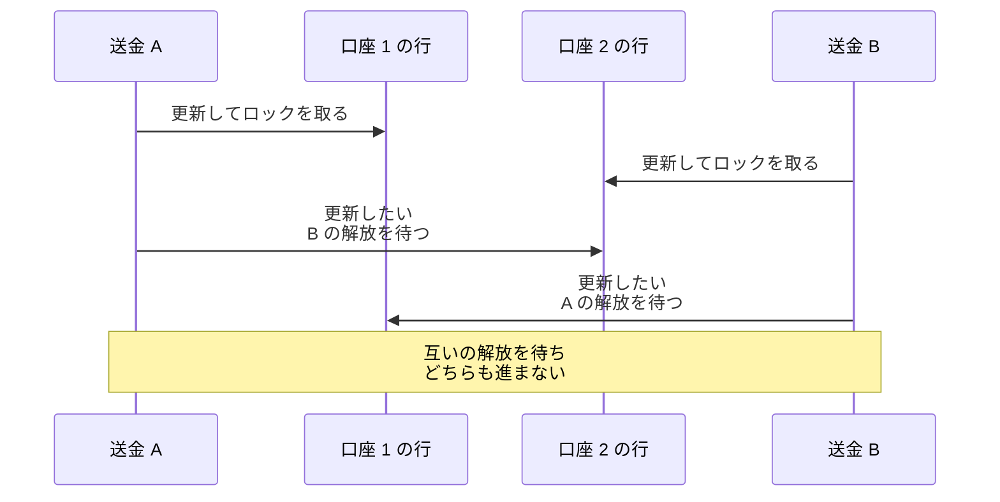
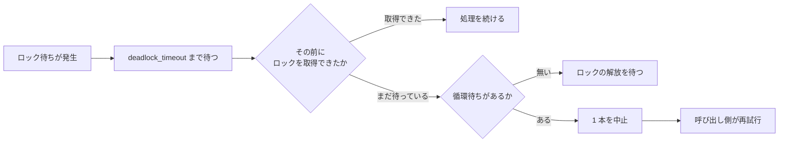
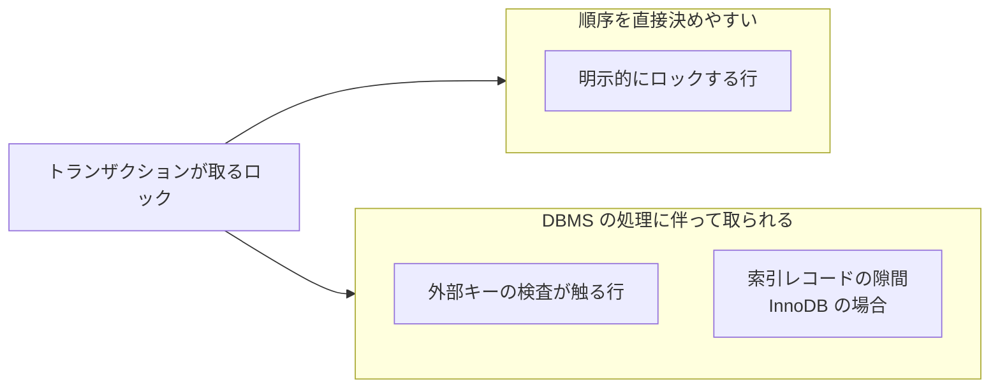

Deadlock（デッドロック）は、2 本以上のトランザクションが、それぞれ自分の取ったロックを持ったまま他のトランザクションのロックの解放を待ち、待つ先を辿ると自分へ戻ってしまうために、どれも先へ進めなくなる状態です。

開発者がこの名前を目にするのは、エラーログの中ではないでしょうか。PostgreSQL は `deadlock detected`、MySQL は `Deadlock found when trying to get lock; try restarting transaction` を返します。手元で 1 本ずつ動かしている間は出ず、同じ処理が同時に走る本番環境で遭遇しやすいです。

MySQL のドキュメントは、デッドロックを「[a situation in which multiple transactions are unable to proceed because each transaction holds a lock that is needed by another one](https://dev.mysql.com/doc/refman/8.4/en/innodb-deadlocks.html)」（複数のトランザクションが、それぞれ他方の必要とするロックを持っているために、どれも先へ進めない状況）と定義しています。

本ノートでは PostgreSQL の挙動を基本に説明し、挙動が違う箇所では MySQL と Oracle Database の例も示します。トランザクションへ何を入れるかの判断は [Transaction Scope](../transaction-scope/)、分離レベルは [Transaction Isolation](../transaction-isolation/) の題材とします。

前提を 1 つ置きます。行を更新すると DBMS（Database Management System）はその行にロックを取り、通常はトランザクションが終わるまで解放しません。1 行目を更新した後に 2 行目を待っている間も、1 行目は握ったままです。

2 本が同じ 2 行を逆の順で触った場合を以下に示します。



上図の送金 A と送金 B は、待つ相手が互いに相手になっています。誰が誰を待っているのかを辿ると出発点へ戻るため、この関係を循環待ち（circular wait）と呼びます。2 本とは限りません。A が B を、B が C を、C が A を待つ形でも同じく循環します。

順序が揃っていれば、後から来た方は最初に競合した行で待ち、先に来た方が終われば進めます。この例で循環待ちを作っているのは、2 本が同じ 2 行を逆の順で取得している事です。トランザクションを短くすると、ロックを持っている時間が縮んで競合そのものは起きにくくなります。ただし、トランザクションを短くするだけでは、逆順取得という原因そのものは消えません。

---

### DBMS はデッドロックをどう終わらせるか

循環待ちができても、結果が壊れるわけではありません。多くの DBMS はこの循環を検出し、関わっているどれかを巻き戻します。PostgreSQL は「[automatically detects deadlock situations and resolves them by aborting one of the transactions involved](https://www.postgresql.org/docs/current/explicit-locking.html)」（デッドロックの状況を自動的に検出し、関係するトランザクションのうち 1 本を中止して解決する）と書いています。

どれが巻き戻されるかは、アプリケーションからは選べません。同じドキュメントは「Exactly which transaction will be aborted is difficult to predict and should not be relied upon」（どのトランザクションが中止されるのかを正確に予測するのは難しく、当てにするべきではない）と付け加えています。自分が書いた処理は、成功する事もあれば犠牲として中止される事もある、という前提で組む事になります。

待ちが起きてから処置に至るまでの段を以下に示します。



上図の検査は、待つたびに走るわけではありません。PostgreSQL で検査の契機になるのは、待ち時間が `deadlock_timeout` を超えた時です。[ドキュメント](https://www.postgresql.org/docs/current/runtime-config-locks.html)は、検査そのもののコストが高いため一定時間待ってから調べる設計だと説明し、既定を 1 秒としています。その前にロックを取得できた待ちは、検査に掛からないまま終わります。循環が見付からなければ、そのままロックの解放を待ちます。

`deadlock_timeout` は検査を始めるまでの時間で、待ちを打ち切る時間ではありません。循環していない待ちがいつ終わるのかは別の設定で決まります。[PostgreSQL](https://www.postgresql.org/docs/current/runtime-config-client.html) の `lock_timeout` は既定が 0 で、この打ち切りは無効です。[MySQL](https://dev.mysql.com/doc/refman/8.4/en/innodb-parameters.html) の `innodb_lock_wait_timeout` は既定が 50 秒です。この時間を超えた時に巻き戻されるのは、既定では待っていたその 1 文だけで、トランザクション自体は続きます。

[同じページ](https://dev.mysql.com/doc/refman/8.4/en/innodb-parameters.html#sysvar_innodb_rollback_on_timeout)によれば、`innodb_rollback_on_timeout` を有効にした場合に限り、トランザクション全体が巻き戻ります。

中止する単位も DBMS で分かれます。ここで注意したいのは、直前のロック待ちのタイムアウトと、循環を見付けて解くデッドロックの検出が別の仕組みだという事です。MySQL のストレージエンジンである InnoDB は、既定でデッドロックを検出します。[InnoDB のドキュメント](https://dev.mysql.com/doc/refman/8.4/en/innodb-deadlocks.html)によれば、検出して犠牲に選ばれたトランザクションは、1 文ではなく全体が巻き戻されます。検出は設定で止める事もでき、止めた場合はロック待ちのタイムアウトが循環待ちを解く役目を引き受けます。

[Oracle Database](https://docs.oracle.com/en/database/oracle/oracle-database/23/cncpt/data-concurrency-and-consistency.html) はトランザクションではなく、デッドロックに関わった 1 文を巻き戻します。この時に解放されるのはその文に伴うロックの一部で、それ以前の文で取得したロックや変更はトランザクションの中に残ります。

同じドキュメントは「Usually, the signaled transaction should be rolled back explicitly, but it can retry the rolled-back statement after waiting」（通常、通知を受けたトランザクションは明示的に巻き戻すべきだが、待ってから巻き戻された文を再試行する事もできる）と書いています。

アプリケーション側では、デッドロックのエラーを受けたトランザクションを明示的に巻き戻す設計にしておくと、DBMS ごとの単位の違いに引きずられません。

---

### 取得順序を揃える

代表的な防ぎ方は、ロックを取る順序を全ての経路で揃える事です。PostgreSQL のドキュメントは、最善の防御が一般には「[being certain that all applications using a database acquire locks on multiple objects in a consistent order](https://www.postgresql.org/docs/current/explicit-locking.html)」（そのデータベースを使う全てのアプリケーションが、複数のオブジェクトへ一貫した順序でロックを取るようにする事）だと書いています。

同じドキュメントは、条件をもう 1 つ挙げています。「the first lock acquired on an object in a transaction is the most restrictive mode that will be needed for that object」（トランザクションの中で 1 つのオブジェクトへ最初に取るロックが、そのオブジェクトに対して必要になる最も制限の強いモードである事）も確実にすべきだと書いています。

行へのロックには種類があります。[PostgreSQL](https://www.postgresql.org/docs/current/explicit-locking.html) の行レベルロックは、`FOR KEY SHARE`、`FOR SHARE`、`FOR NO KEY UPDATE`、`FOR UPDATE` の 4 つのモードを持ちます。同じ行へ複数のトランザクションが同時にロックを持てるかどうかは、モードの組み合わせで決まります。共存できる組み合わせがある一方、`FOR UPDATE` は他の行レベルロックと競合します。

競合しにくいモードで同じ行を押さえた 2 本が、更新のために両方とも `FOR UPDATE` へ上げようとする場合を考えます。互いに相手が離すのを待つため、順序が揃っていても循環待ちになります。後で更新する行は、最初の読み取りから `SELECT ... FOR UPDATE` のように必要なモードで取っておくと、この引き上げ待ちを避けられます。

順序を揃える方法として、更新対象を主キーの昇順へ並べ替えてから適用する形があります。プレースホルダは PostgreSQL の記法です。

```go
type accountUpdate struct {
	AccountID int64
	Delta     int64
}

// applyUpdates は、口座 ID の昇順で残高を更新する。
// accounts の対象行について、どの呼び出しも同じ順序でロックを取る。
func applyUpdates(ctx context.Context, db *sql.DB, updates []accountUpdate) error {
	sorted := slices.Clone(updates)
	slices.SortFunc(sorted, func(a, b accountUpdate) int {
		return cmp.Compare(a.AccountID, b.AccountID)
	})

	tx, err := db.BeginTx(ctx, nil)
	if err != nil {
		return err
	}
	defer func() { _ = tx.Rollback() }()

	for _, u := range sorted {
		res, err := tx.ExecContext(ctx,
			`UPDATE accounts SET balance = balance + $1 WHERE id = $2`,
			u.Delta, u.AccountID)
		if err != nil {
			return err
		}
		n, err := res.RowsAffected()
		if err != nil {
			return err
		}
		if n != 1 {
			return fmt.Errorf("account %d: updated %d rows, want 1", u.AccountID, n)
		}
	}
	return tx.Commit()
}
```

更新した行が 1 件でない場合にエラーを返しているのは、口座が見付からない更新を黙って飛ばすと、片側だけ適用された送金が確定するためです。この関数は 1 回の試行しか行いません。デッドロックで中止された時は、呼び出し側が関数ごと実行し直します。

途中の `UPDATE` で失敗した場合は `defer` に置いた `tx.Rollback()` が走ります。そのため、それまでに適用した更新も残りません。`Commit()` が成功した後にも同じ `Rollback()` は走ります。その場合は `sql.ErrTxDone` が返るだけで、確定した内容には影響しません。

並べ替えのキーが主キーである必要はありません。条件は、全ての対象に対して決定的な順序を作れる事、その順序に使う値がロック取得中に変わらない事、全ての経路が同じ規則で並べる事です。同順位があり得るキーを使うなら、`priority ASC, id ASC` のように、主キーのような一意な値を最後の比較キーへ加えます。

この方法を成り立たせるには、少なくとも次の 4 つが要ります。

- 競合するロックについて、取得順序を一貫させている。`UPDATE` が暗黙に取るロックも同じ対象に含める
- 1 つの対象へ後からより競合の強いモードが必要になるなら、可能な場合は最初からそのモードで取る
- 対象と取得順序を、競合するロックを取り始める前に決められる
- 同じロック対象を共有する全ての経路が、同じ規則を守っている

3 つ目は、トランザクションを始める前に対象が分かっている事までは求めません。トランザクションの中で決めても、競合するロックを取り始める前に順序が定まっていれば足ります。`WHERE status = 'pending'` のように 1 文で複数行を更新する形が難しいのは、その 1 文の中で DBMS がどの順序で対象行へ到達するかを、アプリケーション側から決めにくいためです。`SELECT ... ORDER BY id FOR UPDATE` で対象を確定しながら順序を決めた上で更新するか、そもそも対象と順序を決められない処理として再試行で受ける事になります。

抜けやすいのは 4 つ目です。1 箇所でも別の順序でロックを取る経路が残っていると、その経路と他の経路の間で循環待ちができます。同じ表の中だけの話ではありません。`accounts` から `transfers` の順で触る経路と、`transfers` から `accounts` の順で触る経路があれば、それだけで循環します。バッチ処理や管理画面のように、通常の経路と別に書かれたコードが該当します。

---

### 順序を揃えても残る原因

アプリケーションが取得順序を直接決めやすいのは、自分で明示的にロックする行です。DBMS はそれ以外にも、外部キーの検査や索引の走査に伴ってロックを取るため、その全てを SQL の並べ替えだけで制御できるわけではありません。`UPDATE ... WHERE ...` のように 1 文で複数の行を更新する場合も、どの行から処理するかをアプリケーション側から直接指定しにくく、実行計画の影響を受けます。

1 つのトランザクションが取るロックの内訳を以下に示します。



上図の下側は、書いた SQL の並べ替えからは順序を制御しにくい部分です。外部キーの検査は、子側の `INSERT` と `UPDATE` に加えて、親側の `DELETE` と親キーの `UPDATE` でも走ります。[MySQL のドキュメント](https://dev.mysql.com/doc/refman/8.4/en/innodb-locks-set.html)は、制約の検査が要る操作が、検査のために見た行へ共有のレコードロックを設定すると書いています。

親を消す経路と子を挿す経路は、書いた SQL の上では別の表を触っています。ロックの上では同じ行で交わるため、順序を決める時に見落とします。[Foreign Key](../foreign-key/) を張った表を更新する経路は、この形で交差します。

隙間へのロックは MySQL の InnoDB の機構で、PostgreSQL には同じ仕組みがありません。ここでの隙間は、索引に並んだキーとキーの間を指します。隙間にもロックを掛けるのは、条件に合う行が後から挿入されるのを防ぐためです。

隙間まで掛かるかどうかは、[分離レベル](../transaction-isolation/)で変わります。InnoDB の既定である REPEATABLE READ では、索引を走査する `UPDATE` や `SELECT ... FOR UPDATE` に、索引レコードとその手前の隙間をまとめた next-key lock が使われると[MySQL のドキュメント](https://dev.mysql.com/doc/refman/8.4/en/innodb-locking.html)は書いています。ただし常に隙間を含むわけではなく、一意索引を一意に定まる条件で検索した場合は、索引レコードだけのロックになります。[分離レベルのページ](https://dev.mysql.com/doc/refman/8.4/en/innodb-transaction-isolation-levels.html)によれば、READ COMMITTED では、通常の検索や走査に対する隙間へのロックが大きく減ります。

どの隙間に掛かるかは走査した索引と分離レベルで決まるので、書いた SQL の行だけを見ても分かりません。

そのため、順序を揃えてもデッドロックが残る前提で設計します。順序の統一は発生を減らす手段で、無くす手段ではありません。

---

### 再試行まで含めて設計する

中止されたトランザクションを再試行する経路は、最後まで捨てられません。再試行を組む時に決める事は 3 つあります。

- 再試行してよい中止かどうかの判別。デッドロックによる中止と直列化の失敗は、やり直すと通る事がある
- 上限の回数と、試行の間隔。失敗した処理が揃って再試行すると、また同じ競合を起こす
- 再試行する単位。トランザクションの先頭からやり直すので、その中で読んだ値も読み直す

判別には、DBMS が返すエラーの識別子を使います。PostgreSQL は SQLSTATE の `40P01` をデッドロックへ、`40001` を直列化の失敗へ割り当てています。MySQL はサーバのエラー番号 `1213` をデッドロックへ割り当てており、その SQLSTATE は `40001` です。SQLSTATE だけで横断的に判定すると、2 つの DBMS で別の事象が同じ値に見えます。

`40P01` を受けたトランザクションは、その途中から処理を続けられません。巻き戻した上で、新しいトランザクションとして先頭からやり直します。Go の `database/sql` であれば、先の `applyUpdates` のようにトランザクション 1 本を関数へ収めておくと、その関数を呼び直すだけで再試行の単位が揃います。

文法の誤りや、入力値そのものに原因がある `NOT NULL` 違反・`CHECK` 違反のような失敗は、同じ入力をそのまま再試行しても解消しません。中止の理由を見ずに一律で再試行すると、こうした失敗を上限まで繰り返す事になります。

間隔には、待ち時間へランダムなずれを入れます。高負荷の時ほど多くの処理が同時に失敗しやすく、全てが同じ長さだけ待つと揃って再試行して、また同じロック競合を起こします。上限まで試して成功しなかった処理は、業務としての失敗として扱い、利用者へ返すか、後で処理する列へ移します。

対処ごとに効く範囲と残る問題を以下に示します。

| 対処 | 効く範囲 | 残る問題 |
| --- | --- | --- |
| 取得順序を揃える | 明示的に順序を決められるロック | 外部キーの検査や隙間など、SQL から順序を制御しにくいロックまでは防ぎ切れない |
| 最初から必要なモードで取る | 同じ行でのモードの引き上げ | 競合しにくいモードで足りる読み取りまで待たせる |
| トランザクションを短くする | ロックを持つ時間と、競合が重なる確率 | 逆順で取得する経路が残っていれば、原因自体は消えない |
| 再試行する | 中止された全てのデッドロック | 応答時間が伸びる。上限に達した時の扱いを決める |

再試行はトランザクションを丸ごとやり直す処理なので、[Transaction Scope](../transaction-scope/) で扱った範囲の決め方がそのまま効きます。外部 API の呼び出しが範囲の中にあると、再試行のたびに要求が飛びます。範囲を DB の更新だけに絞っておけば、再試行の副作用は DB の中に閉じます。
