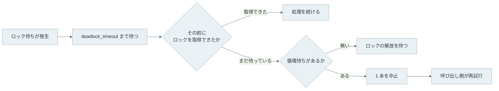
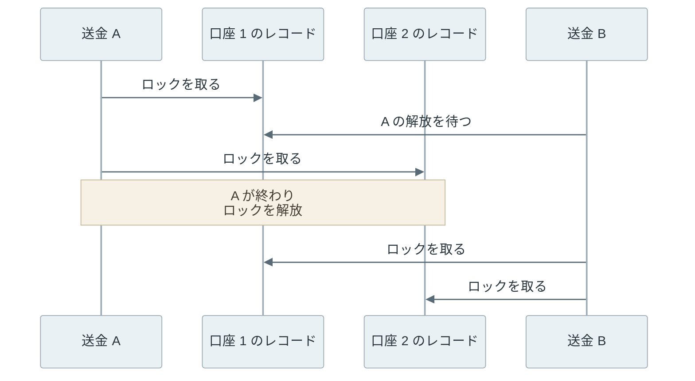
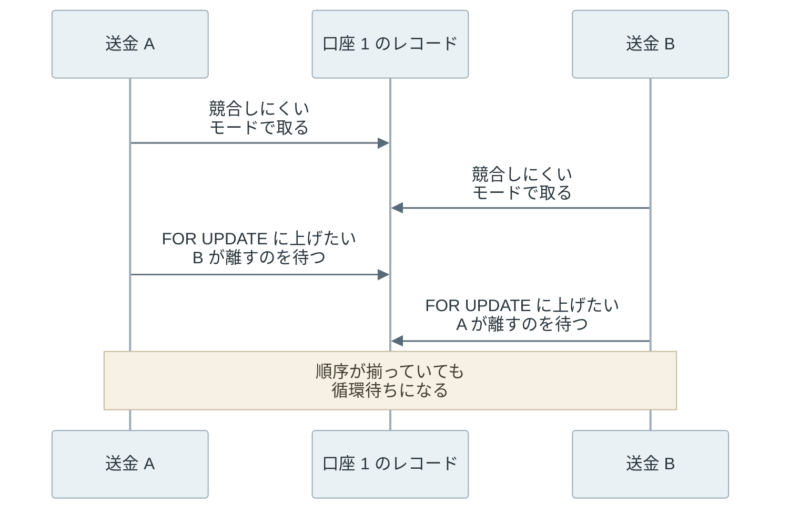
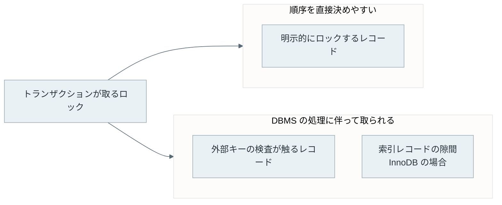
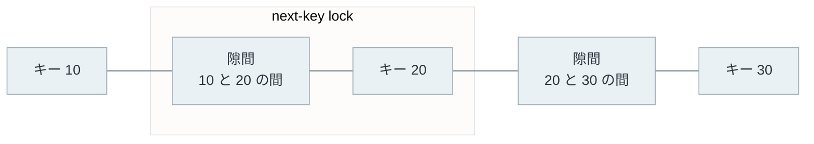
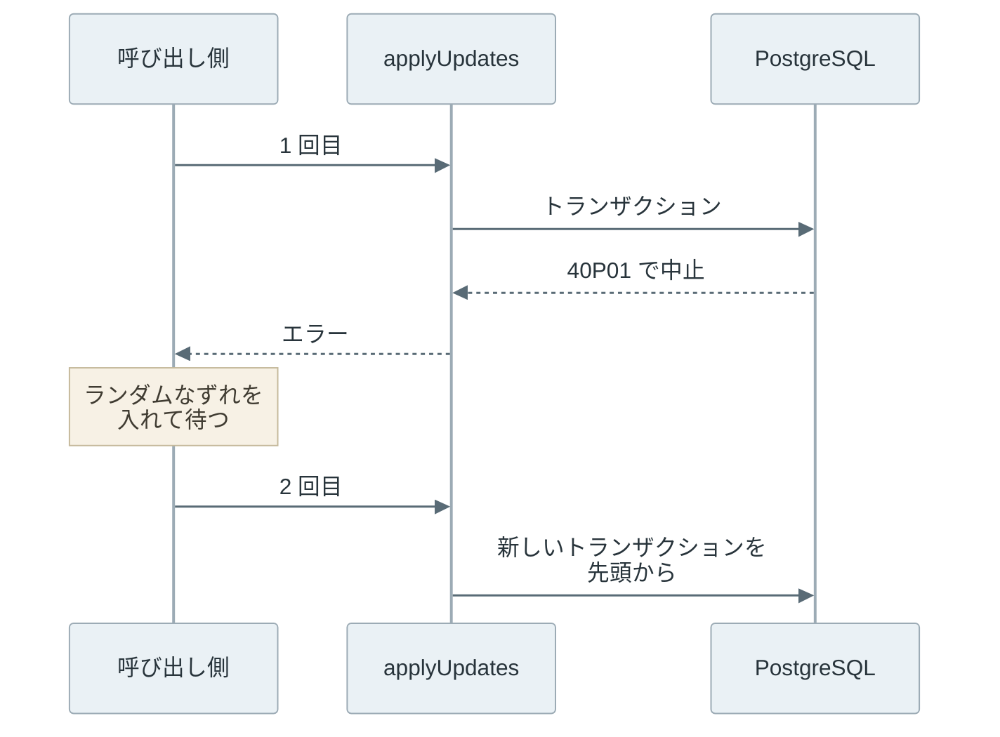

Deadlock（デッドロック）は、2 本以上のトランザクションが互いのロックの解放を待ち、どれも先に進めなくなる状態です。レコードを更新すると DBMS（Database Management System）はそのレコードにロックを取り、通常はトランザクションが終わるまで解放しません。

デッドロックを検出すると、PostgreSQL は `deadlock detected`、MySQL は `Deadlock found when trying to get lock; try restarting transaction` を返します。手元で 1 本ずつ動かしている間は出ず、同じ処理が同時に走る本番環境で遭遇しやすいです。

1 件目を更新した後に 2 件目を待っている間も、1 件目のロックは握ったままです。例えば、2 本が同じ 2 件を逆の順で触った場合（左）と、同じ順で触った場合（右）を次の図に示します。



上記の図の左では、送金 A と送金 B が互いに相手を待っています。誰が誰を待っているのかを辿ると出発点に戻るため、この関係を循環待ち（circular wait）と呼びます。A が B、B が C、C が A を待つ 3 本の形でも同じく循環します。右のように取る順序を揃えると、送金 B は待つだけで環になりません。

<br>

本記事では、PostgreSQL の挙動を基本に、デッドロックの終わり方と防ぎ方を説明します。挙動が違う箇所では MySQL と Oracle Database の例も示します。検出の仕組みから再試行まで、次の疑問に答えます。

- DBMS は、デッドロックをどう見つけて終わらせるのか。
- ロックの取得順序を揃えるには、何が必要なのか。
- 同じ 1 件を同じ順序で触る 2 本が、なぜデッドロックするのか。
- 中止されたトランザクションは、どう再試行すれば良いのか。

トランザクションに何を入れるかの判断は [Transaction Scope](../transaction-scope/)、分離レベルは [Transaction Isolation](../transaction-isolation/) の題材とします。

---

### DBMS によるデッドロックの検出と中止

循環待ちができると、多くの DBMS はこの循環を検出し、関わっているどれかを巻き戻します。

どれを巻き戻すかは、アプリケーションからは選べません。[PostgreSQL のドキュメント](https://www.postgresql.org/docs/current/explicit-locking.html#LOCKING-DEADLOCKS)も、どのトランザクションが中止されるかは予測しにくく、当てにしてはいけないとしています。

以下は、待ちが起きてから処置に至るまでの流れです。


```mermaid
%%{init: {"theme":"base","themeVariables":{"primaryColor":"#eaf1f5","primaryTextColor":"#28343b","primaryBorderColor":"#9cabb5","lineColor":"#596b76","textColor":"#28343b","actorBkg":"#eaf1f5","actorBorder":"#9cabb5","actorTextColor":"#28343b","actorLineColor":"#9cabb5","signalColor":"#596b76","signalTextColor":"#28343b","noteBkgColor":"#f7f1e5","noteBorderColor":"#c5b99b","noteTextColor":"#403c32","activationBkgColor":"#edf3ef","activationBorderColor":"#9aafa1"}}}%%
flowchart LR
    W["ロック待ちが発生"] --> T["deadlock_timeout まで待つ"]
    T --> U{"その前に<br/>ロックを取得できたか"}
    U -->|"取得できた"| P["処理を続ける"]
    U -->|"まだ待っている"| C{"循環待ちがあるか"}
    C -->|"無い"| H["ロックの解放を待つ"]
    C -->|"ある"| K["1 本を中止"]
    K --> R["呼び出し側が再試行"]
    classDef default fill:#eaf1f5,stroke:#9cabb5,color:#28343b;
```

PostgreSQL が上記の図の検査を始めるのは、待つたびではなく、待ち時間が `deadlock_timeout` を超えた時です。検査のコストが高いため、[一定時間待ってから調べる設計](https://www.postgresql.org/docs/current/runtime-config-locks.html)で、既定は 1 秒です。

`deadlock_timeout` は検査を始めるまでの時間で、待ちを打ち切る時間ではありません。循環していない待ちは検出の対象外で、別の打ち切り設定が無ければ待ち続けます。[PostgreSQL](https://www.postgresql.org/docs/current/runtime-config-client.html) の `lock_timeout` は既定が 0 で、この打ち切りは無効です。

---

### 中止される範囲

デッドロックで中止される範囲は、PostgreSQL と MySQL の [InnoDB](https://dev.mysql.com/doc/refman/8.4/en/innodb-deadlocks.html)（MySQL のストレージエンジン）ではトランザクション全体、Oracle Database ではデッドロックに関わった 1 文だけです。[Oracle Database](https://docs.oracle.com/en/database/oracle/oracle-database/23/cncpt/data-concurrency-and-consistency.html) で解放されるのはその文に伴うロックの一部で、それ以前の文で取得したロックや変更はトランザクションの中に残ります。

デッドロックの検出と、ロック待ちのタイムアウトは別の仕組みです。InnoDB は `innodb_deadlock_detect` で検出を止めることもでき、止めた場合はロック待ちのタイムアウトで待機を中止します。

[MySQL](https://dev.mysql.com/doc/refman/8.4/en/innodb-parameters.html) の `innodb_lock_wait_timeout`（既定は 50 秒）を超えた時に巻き戻されるのは、既定では待っていたその 1 文だけで、トランザクション自体は続きます。[MySQL のドキュメント](https://dev.mysql.com/doc/refman/8.4/en/innodb-parameters.html#sysvar_innodb_rollback_on_timeout)によれば、`innodb_rollback_on_timeout` を有効にした場合に限り、トランザクション全体が巻き戻ります。

以下は、1 本のトランザクションの中で巻き戻る範囲を並べた図です。


- title: PostgreSQL / InnoDB のデッドロック検出
  steps:
  - 文 1：巻き戻す
  - 文 2：巻き戻す
  - 待っていた文：巻き戻す
- title: InnoDB のロック待ちタイムアウト（既定）/ Oracle Database のデッドロック
  steps:
  - 文 1：残る
  - 文 2：残る
  - 待っていた文：巻き戻す


上記の図の下側の Oracle Database は、文を巻き戻したトランザクションにエラーを返します。ドキュメントによれば、そのトランザクションは通常、明示的に巻き戻します。トランザクションを続けたまま、少し待ってから巻き戻された文だけを再試行することもできます。

アプリケーション側では、デッドロックのエラーを受けたトランザクションを明示的に巻き戻すと、どの DBMS でも同じ状態から再試行できます。

---

### ロックの取得順序の統一

冒頭の例で循環待ちを作っているのは、2 本が同じ 2 件を逆の順で取得していることです。代表的な防ぎ方は、ロックを取る順序を全ての経路で揃えることです。以下は、冒頭の 2 本が同じ順でロックを取る場合です。


```mermaid
%%{init: {"theme":"base","themeVariables":{"primaryColor":"#eaf1f5","primaryTextColor":"#28343b","primaryBorderColor":"#9cabb5","lineColor":"#596b76","textColor":"#28343b","actorBkg":"#eaf1f5","actorBorder":"#9cabb5","actorTextColor":"#28343b","actorLineColor":"#9cabb5","signalColor":"#596b76","signalTextColor":"#28343b","noteBkgColor":"#f7f1e5","noteBorderColor":"#c5b99b","noteTextColor":"#403c32","activationBkgColor":"#edf3ef","activationBorderColor":"#9aafa1"}}}%%
sequenceDiagram
    participant A as 送金 A
    participant R1 as 口座 1 のレコード
    participant R2 as 口座 2 のレコード
    participant B as 送金 B
    A->>R1: ロックを取る
    B->>R1: A の解放を待つ
    A->>R2: ロックを取る
    Note over A,R2: A が終わり<br/>ロックを解放
    B->>R1: ロックを取る
    B->>R2: ロックを取る
```

上記の図の送金 B は待ちますが、待つ先を辿っても出発点に戻らないので循環待ちになりません。

レコードへのロックには種類があります。[PostgreSQL](https://www.postgresql.org/docs/current/explicit-locking.html) の行レベルロックは、`FOR KEY SHARE`、`FOR SHARE`、`FOR NO KEY UPDATE`、`FOR UPDATE` の 4 つのモードを持ちます。同じレコードに複数のトランザクションが同時にロックを持てるかどうかは、モードの組み合わせで決まります。共存できる組み合わせがある一方で、`FOR UPDATE` は他の行レベルロックと競合します。

PostgreSQL のドキュメントは、取得順序の統一に加えて、トランザクションの中で 1 つのオブジェクトに最初に取るロックが、そのオブジェクトに必要になる最も制限の強いモードであることも求めています。

以下は、`FOR SHARE` のような競合しにくいモードで同じレコードを押さえた 2 本が、更新のために両方とも `FOR UPDATE` に上げようとする場合です。


```mermaid
%%{init: {"theme":"base","themeVariables":{"primaryColor":"#eaf1f5","primaryTextColor":"#28343b","primaryBorderColor":"#9cabb5","lineColor":"#596b76","textColor":"#28343b","actorBkg":"#eaf1f5","actorBorder":"#9cabb5","actorTextColor":"#28343b","actorLineColor":"#9cabb5","signalColor":"#596b76","signalTextColor":"#28343b","noteBkgColor":"#f7f1e5","noteBorderColor":"#c5b99b","noteTextColor":"#403c32","activationBkgColor":"#edf3ef","activationBorderColor":"#9aafa1"}}}%%
sequenceDiagram
    participant A as 送金 A
    participant R as 口座 1 のレコード
    participant B as 送金 B
    A->>R: 競合しにくい<br/>モードで取る
    B->>R: 競合しにくい<br/>モードで取る
    A->>R: FOR UPDATE に上げたい<br/>B が離すのを待つ
    B->>R: FOR UPDATE に上げたい<br/>A が離すのを待つ
    Note over A,B: 順序が揃っていても<br/>循環待ちになる
```

後で更新するレコードは、最初の読み取りから `SELECT ... FOR UPDATE` のように必要なモードで取っておくと、この引き上げ待ちを避けられます。

順序を揃える方法として、更新対象を主キーの昇順に並べ替えてから適用する形があります。プレースホルダは PostgreSQL の記法です。

```go
type accountUpdate struct {
	AccountID int64
	Delta     int64
}

// applyUpdates は、口座 ID の昇順で残高を更新する。
// accounts の対象レコードについて、どの呼び出しも同じ順序でロックを取る。
func applyUpdates(ctx context.Context, db *sql.DB, updates []accountUpdate) error {
	sorted := slices.Clone(updates)
	slices.SortFunc(sorted, func(a, b accountUpdate) int {
		return cmp.Compare(a.AccountID, b.AccountID)
	})

	tx, err := db.BeginTx(ctx, nil)
	if err != nil {
		return err
	}
	defer func() { _ = tx.Rollback() }()

	for _, u := range sorted {
		res, err := tx.ExecContext(ctx,
			`UPDATE accounts SET balance = balance + $1 WHERE id = $2`,
			u.Delta, u.AccountID)
		if err != nil {
			return err
		}
		n, err := res.RowsAffected()
		if err != nil {
			return err
		}
		if n != 1 {
			return fmt.Errorf("account %d: updated %d rows, want 1", u.AccountID, n)
		}
	}
	return tx.Commit()
}
```

更新したレコードが 1 件でない場合にエラーを返しているのは、口座が見つからない更新を黙って飛ばすと、片側だけ適用された送金が確定するからです。途中の `UPDATE` で失敗すると `defer` の `tx.Rollback()` が走り、それまでの更新も残りません。この関数は 1 回しか試行せず、デッドロックで中止された時は呼び出し側が関数ごと実行し直します。

並べ替えのキーは主キー以外でも構いません。条件は、全ての対象に対して決定的な順序を作れること、その順序に使う値がロック取得中に変わらないこと、全ての経路が同じ規則で並べることです。同順位があり得るキーを使うなら、`priority ASC, id ASC` のように、主キーのような一意な値を最後の比較キーに加えます。

<br>

順序を揃えた効き目は、件数で確かめられます。PostgreSQL 17.11 で、2 つの口座の間で 1 円を動かす送金を pgbench から並行に流し、デッドロックで中止された割合を数えました。

送金元と送金先は口座の中から一様に選び、2 本の `UPDATE` の間に 5 ms の処理を挟みます。受け付けた順（送金元が先）でロックを取る場合と、口座 ID の昇順で取る場合を比べます。`deadlock_timeout` は実験を早く終えるために 100 ms に縮め、中止した送金は再試行しません。

```sql
-- 受け付けた順
BEGIN;
UPDATE accounts SET balance = balance - 1 WHERE id = :a;
SELECT pg_sleep(0.005);
UPDATE accounts SET balance = balance + 1 WHERE id = :b;
END;

-- ID の昇順。:lo と :hi は :a と :b の小さい方と大きい方、:dlo は :lo 側の増減
BEGIN;
UPDATE accounts SET balance = balance + :dlo WHERE id = :lo;
SELECT pg_sleep(0.005);
UPDATE accounts SET balance = balance - :dlo WHERE id = :hi;
END;
```

各クライアントが 200 件ずつ流した結果が以下の図です（全体は [lab/deadlock_rate.py](https://github.com/nao1215/debimate/blob/main/content/notes/database-systems/deadlock/lab/deadlock_rate.py) の出力）。



上記の図の通り、受け付けた順（arrival order）では並列度（Concurrent clients）が上がるほど中止が増え、口座が少なく送金が同じ口座に集まるほど急に増えます。ID の昇順（id order）では、2 回流した測定のどちらでも、全ての条件で 0 件でした。受け付けた順の割合は流すたびに少し動きます（10 件・32 並列で 55.4% と 54.4%）。

---

### 順序の統一が成り立つ条件

取得順序の統一を成り立たせるには、少なくとも次の 4 つが必要です。

- 競合するロックについて、取得順序を一貫させている。`UPDATE` が暗黙に取るロックも同じ対象に含める
- 1 つの対象に後からより競合の強いモードが必要になるなら、可能な場合は最初からそのモードで取る
- 競合するロックを取り始める前に、対象と取得順序を決められる
- 同じロック対象を共有する全ての経路が、同じ規則を守っている

3 つ目は、競合するロックを取り始める前に順序が定まっていれば足り、トランザクションの開始時点で対象が分かっていなくても構いません。

`WHERE status = 'pending'` のように 1 文で複数のレコードを更新する形が難しいのは、どの順序で対象レコードに到達するかが、DBMS の選ぶ実行の手順（[実行計画](../query-processing/)。索引を使うかテーブルを先頭から読むかなど）で変わるからです。`SELECT ... ORDER BY id FOR UPDATE` で対象と順序を確定してから更新するか、決められない処理と割り切って再試行に任せます。

抜けやすいのは 4 つ目です。1 箇所でも別の順序でロックを取る経路が残っていると、その経路と他の経路の間で循環待ちができます。テーブルをまたいでも同じです。`accounts` から `transfers` の順で触る経路と、`transfers` から `accounts` の順で触る経路があれば、それだけで循環します。バッチ処理や管理画面のように、通常の経路と別に書かれたコードが該当します。

---

### 順序を揃えても残る原因

アプリケーションが取得順序を直接決めやすいのは、自分で明示的にロックするレコードです。DBMS はそれ以外にも、外部キーの検査や索引の走査に伴ってロックを取るため、その全てを SQL の並べ替えだけで制御できるわけではありません。

1 つのトランザクションが取るロックを分けると、以下のようになります。


```mermaid
%%{init: {"theme":"base","themeVariables":{"primaryColor":"#eaf1f5","primaryTextColor":"#28343b","primaryBorderColor":"#9cabb5","lineColor":"#596b76","textColor":"#28343b","actorBkg":"#eaf1f5","actorBorder":"#9cabb5","actorTextColor":"#28343b","actorLineColor":"#9cabb5","signalColor":"#596b76","signalTextColor":"#28343b","noteBkgColor":"#f7f1e5","noteBorderColor":"#c5b99b","noteTextColor":"#403c32","activationBkgColor":"#edf3ef","activationBorderColor":"#9aafa1"}}}%%
flowchart LR
    T["トランザクションが取るロック"] --> A
    T --> B
    subgraph A["順序を直接決めやすい"]
        R["明示的にロックするレコード"]
    end
    subgraph B["DBMS の処理に伴って取られる"]
        F["外部キーの検査が触るレコード"]
        G["索引レコードの隙間<br/>InnoDB の場合"]
    end
    classDef default fill:#eaf1f5,stroke:#9cabb5,color:#28343b;
```

上記の図の下側は、書いた SQL の並べ替えからは順序を制御しにくい部分です。外部キーの検査は、子側の `INSERT` と `UPDATE` に加えて、親側の `DELETE` と親キーの `UPDATE` でも走ります。[MySQL のドキュメント](https://dev.mysql.com/doc/refman/8.4/en/innodb-locks-set.html)によれば、制約の検査が必要な操作は、検査のために見たレコードに共有のレコードロック（読み取りどうしは共存し、更新とは競合するレコードのロック）を設定します。

親を消す経路と子を挿入する経路は、SQL の上では別のテーブルを触っています。しかし [Foreign Key](../foreign-key/) を張っていると、ロックの上では同じレコードで交わるので、順序を決める時に見落としやすくなります。

同じ処理どうしでも交わります。PostgreSQL 17.11 で、口座 `accounts` を参照する外部キーを持つ `transfers` に 1 件を挿入し、その 1 秒後に口座 1 を `SELECT ... FOR UPDATE` で押さえるトランザクションを 2 本、`psql` から 0.5 秒ずらして走らせました。2 本のロックが重なるのは口座 1 のレコードだけで、順序も同じです。

```sql
-- 準備
CREATE TABLE accounts (id int PRIMARY KEY, balance int NOT NULL);
CREATE TABLE transfers (
  id serial PRIMARY KEY,
  account_id int NOT NULL REFERENCES accounts(id),
  amount int NOT NULL
);
INSERT INTO accounts VALUES (1, 10000), (2, 10000);

-- 2 本とも同じ内容
BEGIN;
INSERT INTO transfers (account_id, amount) VALUES (1, 100);
SELECT pg_sleep(1);
SELECT balance FROM accounts WHERE id = 1 FOR UPDATE;
COMMIT;
```

結果は次の通りです（抜粋）。

```text
-- 中止された側
ERROR:  deadlock detected
CONTEXT:  while locking tuple (0,1) in relation "accounts"

-- 続行した側
 balance
---------
   10000
```

`INSERT` は外部キーの検査で、親である口座 1 のレコードに `FOR KEY SHARE` を取ります。2 本がこのロックを共有したまま `FOR UPDATE` に上げようとしたので、前に見た引き上げの図と同じ循環になりました。`FOR UPDATE` を書いていても、その前の `INSERT` が先に弱いモードを取っています。

口座を `FOR UPDATE` で押さえてから `INSERT` する順にするか、通常の `UPDATE` で口座を更新すると（取るモードが `FOR KEY SHARE` と競合しない `FOR NO KEY UPDATE` になる）、デッドロックは起きませんでした。

索引に並んだキーとキーの間（隙間）へのロックは MySQL の InnoDB の機構で、PostgreSQL には同じ仕組みがありません。隙間にもロックを掛けるのは、条件に合うレコードが後から挿入されるのを防ぐためです。

InnoDB の既定の分離レベルである REPEATABLE READ では、索引を走査する `UPDATE` や `SELECT ... FOR UPDATE` に、索引レコードとその手前の隙間をまとめた [next-key lock](https://dev.mysql.com/doc/refman/8.4/en/innodb-locking.html) が使われます。以下は、その範囲です。キーの値は説明用です。


```mermaid
%%{init: {"theme":"base","themeVariables":{"primaryColor":"#eaf1f5","primaryTextColor":"#28343b","primaryBorderColor":"#9cabb5","lineColor":"#596b76","textColor":"#28343b","actorBkg":"#eaf1f5","actorBorder":"#9cabb5","actorTextColor":"#28343b","actorLineColor":"#9cabb5","signalColor":"#596b76","signalTextColor":"#28343b","noteBkgColor":"#f7f1e5","noteBorderColor":"#c5b99b","noteTextColor":"#403c32","activationBkgColor":"#edf3ef","activationBorderColor":"#9aafa1"}}}%%
flowchart LR
    K1["キー 10"] --- G1
    subgraph NK["next-key lock"]
        direction LR
        G1["隙間<br/>10 と 20 の間"] --- K2["キー 20"]
    end
    K2 --- G2["隙間<br/>20 と 30 の間"] --- K3["キー 30"]
    classDef default fill:#eaf1f5,stroke:#9cabb5,color:#28343b;
```

上記の図の範囲は常に隙間を含むわけではなく、一意索引を一意に定まる条件で検索した場合は、索引レコードだけのロックになります。[分離レベル](../transaction-isolation/)でも変わり、[分離レベルのページ](https://dev.mysql.com/doc/refman/8.4/en/innodb-transaction-isolation-levels.html)によれば、READ COMMITTED では、通常の検索や走査に対する隙間へのロックが大きく減ります。

そのため、順序を揃えてもデッドロックが残る前提で設計します。順序の統一は発生を減らす手段で、無くす手段ではありません。

---

### 再試行まで含めた設計

順序をどれだけ揃えても、中止されたトランザクションを[再試行](/notes/distributed-systems/retry-backoff/)する処理は必要です。再試行を組む時に決めることは 3 つあります。

- 再試行して良い中止かどうかの判別
- 再試行する単位
- 上限の回数と、試行の間隔

判別には、DBMS が返すエラーの識別子を使います。やり直すと通ることがあるのは、デッドロックによる中止と直列化の失敗（SERIALIZABLE などの分離レベルで、同時に走った結果を順に並べ直せないと DBMS が判断した中止）です。

PostgreSQL は SQLSTATE の `40P01` をデッドロックに、`40001` を直列化の失敗に割り当てています。MySQL はサーバーのエラー番号 `1213` をデッドロックに割り当てており、その SQLSTATE は `40001` です。SQLSTATE だけで横断的に判定すると、2 つの DBMS で別の事象が同じ値に見えます。

文法の誤りや、入力値に原因がある `NOT NULL` 違反・`CHECK` 違反のような失敗は、同じ入力をそのまま再試行しても解消しません。中止の理由を見ずに一律で再試行すると、こうした失敗を上限まで繰り返します。

`40P01` を受けたトランザクションは、その途中から処理を続けられません。Go の `database/sql` であれば、先の `applyUpdates` のようにトランザクション 1 本を関数に収めておくと、以下のように関数を呼び直すだけで、トランザクション 1 本を丸ごとやり直せます。


```mermaid
%%{init: {"theme":"base","themeVariables":{"primaryColor":"#eaf1f5","primaryTextColor":"#28343b","primaryBorderColor":"#9cabb5","lineColor":"#596b76","textColor":"#28343b","actorBkg":"#eaf1f5","actorBorder":"#9cabb5","actorTextColor":"#28343b","actorLineColor":"#9cabb5","signalColor":"#596b76","signalTextColor":"#28343b","noteBkgColor":"#f7f1e5","noteBorderColor":"#c5b99b","noteTextColor":"#403c32","activationBkgColor":"#edf3ef","activationBorderColor":"#9aafa1"}}}%%
sequenceDiagram
    participant C as 呼び出し側
    participant F as applyUpdates
    participant D as PostgreSQL
    C->>F: 1 回目
    F->>D: トランザクション
    D-->>F: 40P01 で中止
    F-->>C: エラー
    Note over C: ランダムなずれを<br/>入れて待つ
    C->>F: 2 回目
    F->>D: 新しいトランザクションを<br/>先頭から
```

上記の図の 2 回目は先頭からやり直すので、1 回目に読んだ値も読み直します。待ち時間にずれを入れるのは、高負荷の時ほど多くの処理が同時に失敗しやすく、全てが同じ長さだけ待つと揃って再試行して、また同じロック競合を起こすからです。上限まで試して成功しなかった処理は、業務としての失敗として扱い、ユーザーにエラーを返すか、後で処理するためのキューに移します。

対処ごとに効く範囲と残る問題を整理すると、以下の通りです。

| 対処 | 効く範囲 | 残る問題 |
| --- | --- | --- |
| 取得順序を揃える | 明示的に順序を決められるロック | 外部キーの検査や隙間など、SQL から順序を制御しにくいロックまでは防ぎ切れない |
| 最初から必要なモードで取る | 同じレコードでのモードの引き上げ | 競合しにくいモードで足りる読み取りまで待たせる |
| トランザクションを短くする | ロックを持つ時間と、競合が重なる確率 | 逆順で取得する経路が残っていれば、原因自体は消えない |
| 再試行する | 中止された全てのデッドロック | 応答時間が伸びる。上限に達した時の扱いを決める |

再試行はトランザクションを丸ごとやり直す処理なので、[Transaction Scope](../transaction-scope/) で扱った範囲の決め方がそのまま当てはまります。外部 API の呼び出しが範囲の中にあると、再試行のたびに要求が飛びます。範囲を DB（データベース）の更新だけに絞っておけば、再試行の副作用は DB の中に閉じます。
