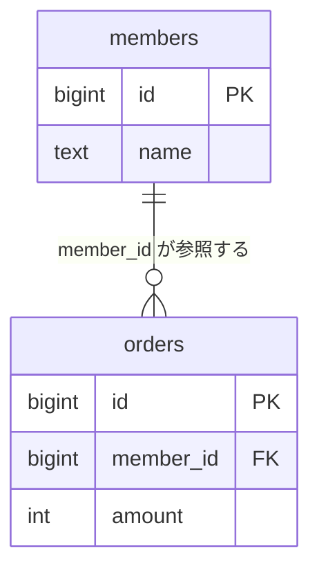
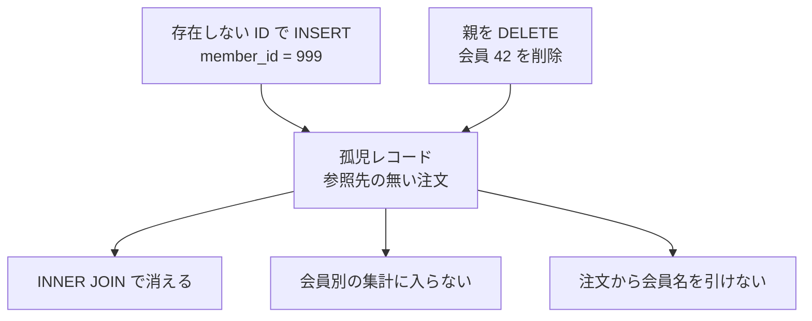
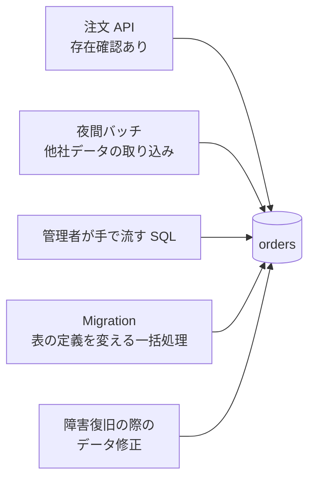
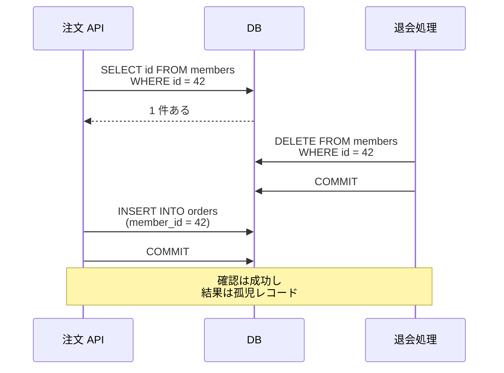
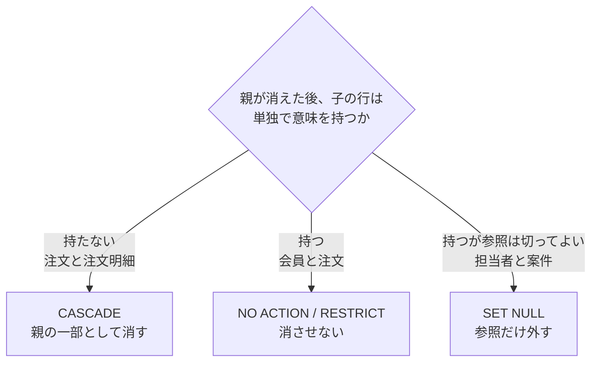
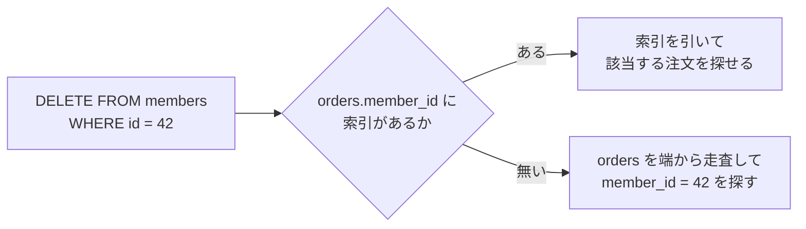

外部キー制約（foreign key constraint）は、ある表の列に入っている値が、別の表に実在する行を指している事を DB（データベース）に保証させる仕組みです。この保証が保たれている状態を参照整合性（referential integrity）と呼びます。

PostgreSQL のドキュメントは、この制約が[「the values in a column (or a group of columns) must match the values appearing in some row of another table」（1 つの列、または複数の列の組の値が、別の表のいずれかの行に現れる値と一致しなければならない）事を指定すると説明しています](https://www.postgresql.org/docs/current/ddl-constraints.html)。

この制約が必要になる場面の代表は、注文の一覧に「存在しない会員の ID」が混ざった時の調査です。会員の表と突き合わせる集計では指す先の無い注文が結果から落ちるので、注文表を素直に合計した値と食い違います。値が入った経路も、`INSERT` の時なのか会員を消した時なのかも、後から辿れません。

本ノートで、説明する範囲も決めておきます。ここでは、1 つの DB の中で表と表を結ぶ外部キー制約を扱い、サービスをまたいだ参照は「外部キーを張らない場合、誰が整合性を守るのか」でだけ触れます。以降の SQL は PostgreSQL の構文で書き、会員（`members`）と注文（`orders`）を例に使います。2 つの表の関係を以下に示します。



上図の `||--o{` は、`members` の 1 行に対して `orders` が 0 行以上ぶら下がる関係を表します。PK は主キー（その表で行を一意に決める列）、FK は外部キーです。参照される `members` を親、参照する `orders` を子と呼びます。

制約は子の表へ書きます。PostgreSQL では、参照先に主キー・一意制約・部分索引ではない一意索引のどれかが必要です。参照する値が参照先で一意に特定できないと、この `CREATE TABLE` 自体が失敗します。

```sql
CREATE TABLE members (
    id   BIGINT PRIMARY KEY,
    name TEXT NOT NULL
);

CREATE TABLE orders (
    id        BIGINT PRIMARY KEY,
    member_id BIGINT NOT NULL REFERENCES members (id),
    amount    INT NOT NULL
);
```

---

### 外部キーが無い時に残るのは、行ではなく矛盾

制約を書かなかった場合、`member_id` はただの整数の列になります。DB は、その値が `members` の誰かを指しているかどうかを見ません。参照先の無い子の行は孤児レコードと呼ばれ、次の 2 つの経路で生まれます。



どちらの経路でも、`INSERT` や `DELETE` はエラーを返しません。制約が無いので、DB にとっては正常な書き込みです。孤児が生まれた瞬間には何も起きず、後から読む時に影響が出ます。

```sql
-- 外部キー制約を張っていない orders の場合。members に id = 999 の行は無い
INSERT INTO orders (id, member_id, amount) VALUES (1001, 999, 3000);
```

この行を含む注文表に会員名を付けて一覧する問い合わせを考えます。`orders` と `members` を `INNER JOIN` で繋ぐと、対応する会員の行が無い注文 1001 は結果から落ちます。`orders` を単独で合計した売上とは、3,000 円の差が出ます。

この差が読み取りの誤りではない点が、調査を長引かせる原因になります。どちらの問い合わせも書いた通りに動いており、`JOIN` の結果が正しい以上、DB は矛盾を報告しません。孤児は、探しに行った人にだけ見えます。

---

### アプリケーションでの存在確認が届かない範囲

外部キー制約を張らずに、注文を作る処理の中で会員の存在を確かめる方法もあります。注文 API のコードへ `SELECT` を 1 本足せば済む、という判断です。この方法が守れるのは、その処理を通った書き込みだけになります。表を更新する経路が 1 本だとは限りません。

同じ `orders` を更新し得る経路を以下に示します。



上図で存在確認を持つのは注文 API だけです。経路が増えるたびに同じ検査を書き足す設計になり、書き足し忘れは構文の誤りではないので、DB が自動で止める事はありません。孤児が混ざった結果として返る行数の増減も、正常な結果と区別が付きません。

外部キー制約は、この検査を DB へ 1 つ置きます。どの経路から来た `INSERT` でも同じ検査が掛かり、通らない書き込みはエラーで止まります。守れる範囲を広げているのは、検査の内容ではなく検査を置いた位置です。

ただし、制約を書けば全部の経路が塞がる訳ではありません。制約が有効になっている事が要ります。SQLite は[「Foreign key constraints are disabled by default (for backwards compatibility), so must be enabled separately for each database connection.」（外部キー制約は既定で無効で、接続ごとに有効にする必要がある）と書いています](https://www.sqlite.org/foreignkeys.html)。

制約を後から張る場合は、検査の範囲に注意が要ります。PostgreSQL で `NOT VALID` を付けると、制約を足す前からある行の一括検査を省けます。以降の `INSERT` と `UPDATE` には制約が掛かり、既存の行は後から `VALIDATE CONSTRAINT` で検証できます。

参照の列が `NULL` を許す場合も、外部キー制約は通ります。PostgreSQL は[「Normally, a referencing row need not satisfy the foreign key constraint if any of its referencing columns are null.」（参照する側の列のいずれかが NULL であれば、通常その行は外部キー制約を満たす必要が無い）と書いています](https://www.postgresql.org/docs/current/ddl-constraints.html)。

---

### 存在を確かめてから書くまでの間に、親は消える

アプリケーションでの存在確認には、経路の数とは別の弱点があります。`SELECT` で親の行を確かめてから `INSERT` するまでの間に、別のトランザクションが親を消せる点です。経路を 1 本へ絞り込んでも、この弱点は残ります。

トランザクションは、まとめて成功か失敗かを決める書き込みのひとかたまりで、`COMMIT` で確定します。2 つのトランザクションが重なった時の順序を以下に示します。



上図の注文 API は、自分の見た結果に従って正しく動いています。確認した時点では会員 42 が実在し、`INSERT` を出す時点では実在しません。読み取りが指す状態と書き込みが置かれる状態は別の時点になります。そのため、間に入った削除を検知できません。

競合した時にどう振る舞うかは、分離レベル・ロックの取り方・DBMS（Database Management System）の実装方式で変わります。ただし、そのどれもが「`orders.member_id` は必ず `members.id` を指す」という業務上の制約を宣言する物ではありません。分離レベルそのものは [Transaction Isolation](../transaction-isolation/) のノートで扱っています。

外部キー制約を書けば、存在確認と競合の処理を DB が担当します。親の削除と子の追加が競合した場合も、DB が必要な待機や制約の検査を行い、制約へ違反する状態を確定させません。アプリケーションが `SELECT` で確かめる形と違い、確認と書き込みが別々の判断に分かれないためです。

アプリケーションで保証するなら、注文を `INSERT` する処理だけでなく、会員を `DELETE` する処理も含めて同じ規約で足並みをそろえる必要があります。守る対象が 1 つの処理から、親と子を触る全ての処理へ広がります。

---

### ON DELETE の指定は、親子の所有関係を表す

外部キー制約を張ると、親の行を消す操作の意味を決める必要が出ます。`ON DELETE` に何を書くかで、削除が子へどう及ぶのかが変わります。PostgreSQL が用意している指定を以下に示します。

| 指定 | 親を `DELETE` した時 | 注意する点 |
| --- | --- | --- |
| `NO ACTION` | 子が残っていればエラー | 既定。`DEFERRABLE` を付けた制約でだけ検査を遅らせられる |
| `RESTRICT` | 子が残っていればエラー | 検査を遅らせられない。事後の状態が違反にならない操作も拒否する |
| `CASCADE` | 子も一緒に消える | 連鎖は子の子へも続く |
| `SET NULL` | 子は残り、参照の列が `NULL` になる | 参照の列が `NOT NULL` なら、その `DELETE` は失敗する |
| `SET DEFAULT` | 子は残り、参照の列が既定値になる | 既定値が `NULL` 以外なら、その値を持つ親の行が要る |

`NO ACTION` と `RESTRICT` は、どちらも子が残っていれば親を消せません。PostgreSQL のドキュメントは `RESTRICT` について[「RESTRICT does not allow the check to be deferred until later in the transaction」（RESTRICT は、検査をトランザクションの後ろへ遅らせる事を許さない）と書いています](https://www.postgresql.org/docs/current/ddl-constraints.html)。

検査を遅らせられると、親と子をまとめて差し替える処理を書けます。途中で一時的に参照先が欠けても、`COMMIT` の時点でそろっていればよい、という形です。遅らせるには制約へ `DEFERRABLE` を付ける必要があり、既定は `NOT DEFERRABLE` なので、上の DDL のままでは遅れません。なお、上の 5 つは PostgreSQL の指定です。利用できる指定や検査のタイミングは DBMS によって違うので、他を使う場合はドキュメントで確かめる事になります。

どれを選ぶかは、性能や書きやすさではなく、子の行が親なしで意味を持つかどうかで決まります。判断の分かれ目を以下に示します。



上図の注文明細は、注文 1 件に含まれる商品ごとの行です。注文が消えれば残す理由が無く、所有している側が消える時に一緒に消える関係なので `CASCADE` が合います。会員と注文は違い、退会しても過去の売上の記録として残す必要があります。案件から担当者への参照のように、相手が居なくなっても行そのものは残したい関係では `SET NULL` が合います。

`CASCADE` を「親を消す時に子を消す手間が省ける指定」として選ぶと、この判断が飛びます。連鎖は子の子へも続きます。会員を 1 行消した結果として、注文と注文明細がまとめて消える構成にもなります。行を残したい要求そのものは、[Soft Delete](../soft-delete/) のノートで扱う設計課題です。

なお、親の主キーを書き換える場合の指定が `ON UPDATE` で、書ける語は `ON DELETE` とほぼ同じです。主キーを後から変えない設計にしていれば、出番はほとんどありません。

---

### 利点

- 制約が有効である限り、どの経路から来た書き込みでも参照先の無い行が入らない
- 親の削除と子の追加が競合しても、参照整合性の維持を DB へ任せられる
- 親を消した時の扱いが表の定義に宣言として残り、経路ごとの実装に散らない
- 表と表の関係が定義から読み取れ、後から構造を辿れる

---

### 欠点

以下は、参照の検査を DB へ寄せた結果として現れる制約です。

- 子への書き込みのたびに親の存在を確かめるので、書き込みの負担が増える
- 親の削除や更新のたびに子を探すので、子の列に索引が無いと表の走査になる
- 表をまたぐ検査なので、親と子が別のノードへ分かれる構成では張りにくい
- 一括での投入や DB の移行で、親から先に入れるという順序の縛りが出る
- `CASCADE` の連鎖が、設計時に想定した範囲を超えて広がる事がある

索引は、列の値から該当する行の位置を引ける補助の構造で、これが無いと DB は表を先頭から読む事になります。2 つ目の索引の扱いは DBMS によって違い、PostgreSQL は[「the declaration of a foreign key constraint does not automatically create an index on the referencing columns」（外部キー制約の宣言は、参照する列へ索引を自動では作らない）と書いています](https://www.postgresql.org/docs/current/ddl-constraints.html)。

DBMS によっては自動で作る物もあります。索引の有無で親の削除がどう変わるのかを以下に示します。



上図の索引が無い経路では、子の表が大きくなるほど親を 1 行消す操作が重くなります。索引があっても、条件に一致する行が表の大部分を占める場合は走査が選ばれます。索引そのものの構造は [B-Tree](../b-tree/) のノートで扱っています。

3 つ目のノードをまたぐ構成についても、分散を前提に作られた DBMS には外部キーを支援する物があります。手元の DBMS で張れるかどうかは、ドキュメントで確かめる事になります。

---

### 外部キーを張らない場合、誰が整合性を守るのか

外部キー制約を置かない構成もあります。代表的なのは次の 3 つです。

- 親と子が別のサービスの DB にあり、参照が DB の外をまたぐ
- シャーディング（1 つの表を複数のサーバへ分けて置く構成）で親と子が別のノードにある
- 履歴や監査ログのように、現在の親との参照整合性より、記録した時点の情報をそのまま残す事を優先する

前の 2 つは、制約を置ける場所に親が居ない形です。3 つ目は親が同じ DB に居るので事情が違います。追記しかしないから張れないのではなく、現在の会員との関係を保つ必要が無く、その時点の記録として独立して残す事に意味があるためです。`RESTRICT` で親の削除を止めるのも `CASCADE` で消すのも、この要求には合いません。

3 つ目では、`SET NULL` で参照だけ外す選択も残っています。参照の列を `NOT NULL` にできない事と、消えた相手が誰だったかを別の列へ写しておく必要が出る事が、その代償です。記録として残す列を別に持てるなら、この形なら外部キー制約を保ったまま行を残せます。

制約を外した場合、参照整合性を守る担当は DB の外へ移ります。移し先は、代表的には次の 3 つです。

- 親と子を変更する経路を管理下へ寄せ、作成・更新・削除の全部で同じ参照整合性の規約を守る
- 孤児を定期的に検出し、業務の判断で直すか消すかを決める
- 孤児が居る前提で読み、表示を組み立てる処理で欠けた参照を扱う

1 つ目は、注文を作る API を 1 本にするだけでは足りません。会員を消す処理が別にある限り、その処理へも同じ規約を通さないと隙間が残ります。2 つ目の検出は、`LEFT JOIN` で書けます。この結合は対応する会員が無くても注文の行を残し、会員の列を `NULL` にします。

```sql
SELECT o.id, o.member_id
FROM orders o
LEFT JOIN members m ON m.id = o.member_id
WHERE o.member_id IS NOT NULL
  AND m.id IS NULL;
```

`m.id IS NULL` が孤児の条件になるのは、`members.id` が `NOT NULL` の主キーだからです。`o.member_id IS NOT NULL` を足しているのは、初めから誰も参照していない行と、参照先が消えた行を混ぜないためです。2 つは業務上の扱いが違います。

検出は、孤児が生まれる事を止めません。見付かった時点で、その注文をどう扱うのかという業務の判断が要ります。3 つ目の「居る前提で読む」は、その判断を読み取りの処理へ埋め込む方法で、会員名の欄へ「退会済み」と出すような扱いになります。

外部キーを張らない設計そのものは、条件がそろえば妥当な選択です。決めておく事は、参照先の存在を誰がいつ確かめるのか、確かめられなかった行をどう扱うのかの 2 つになります。この 2 つを決めないまま制約を外すと、担当が誰にも割り当てられていない状態になります。
