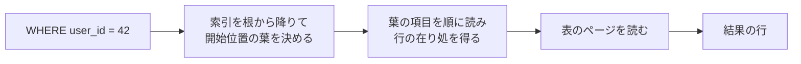
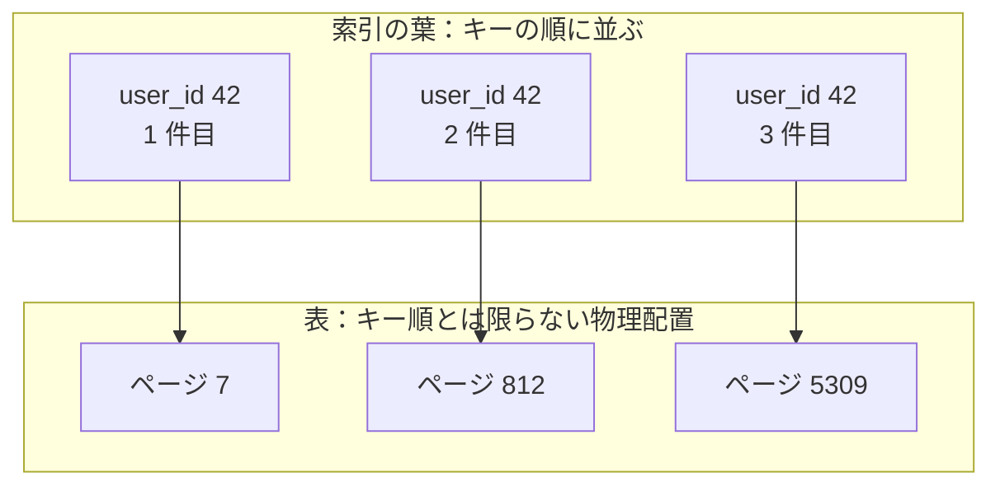
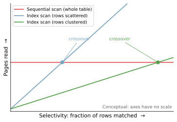
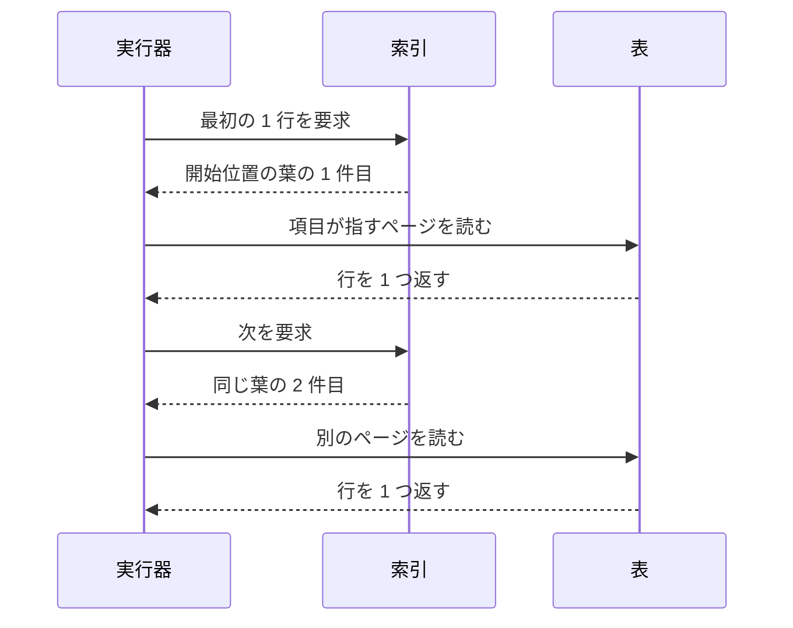
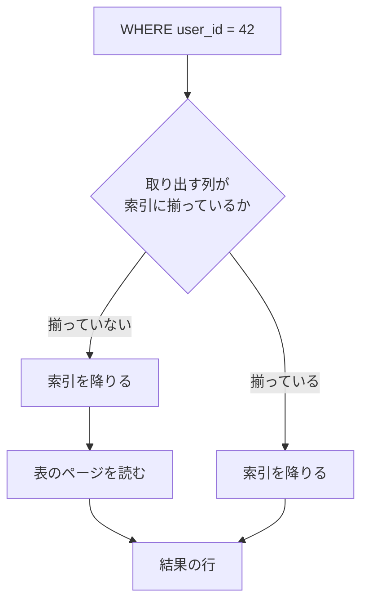
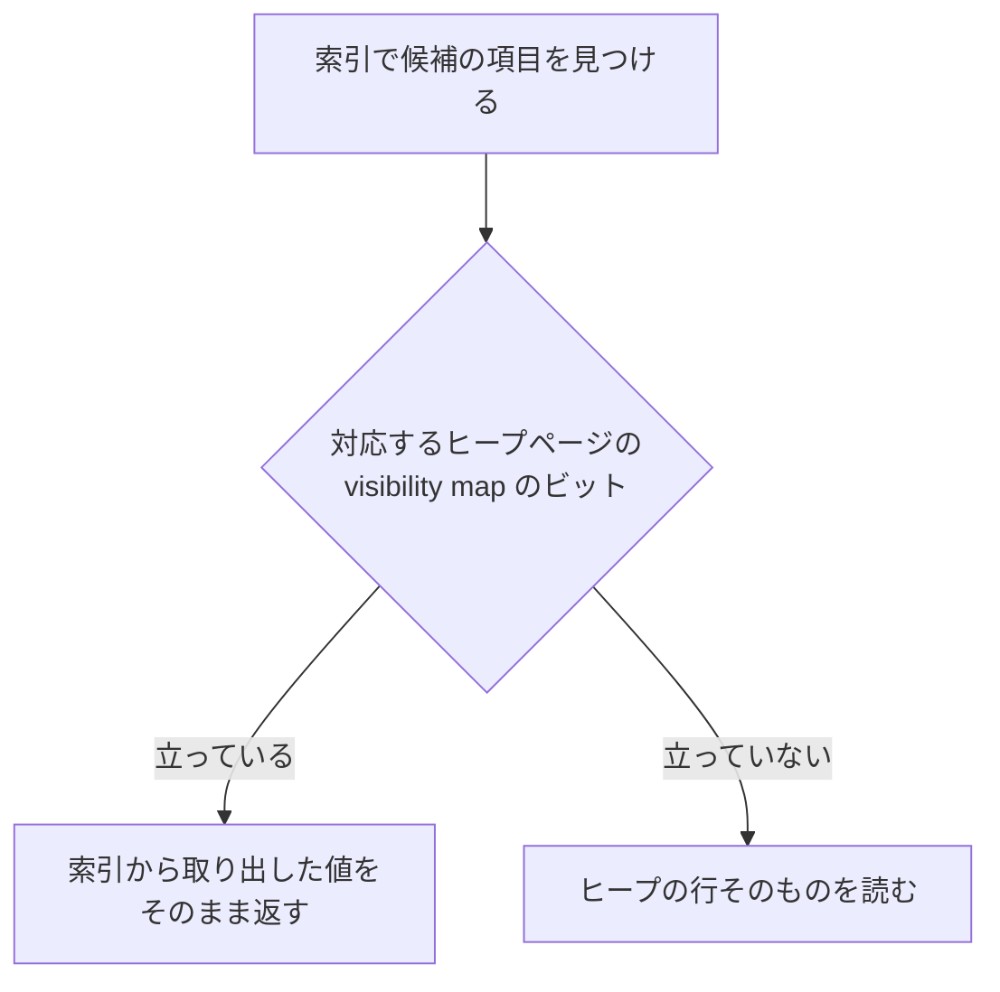
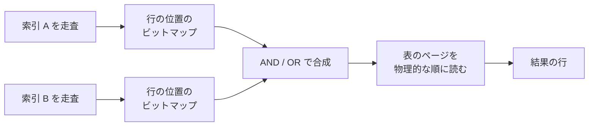

Index Scan は、索引（インデックス）を辿って条件に一致する行の在り処を求め、そこから表の行を読み出す方法です。DB（データベース）が 1 つの表から行を取り出す手段の 1 つで、表を先頭から順に読む全走査（sequential scan）と対になります。

開発者がこの名前を目にするのは、遅い問い合わせの実行計画を眺めている時ではないでしょうか。実行計画とは、DB がその問い合わせをどの手順で処理すると決めたのかを表す出力です。PostgreSQL の `EXPLAIN` では `Index Scan`、SQLite の `EXPLAIN QUERY PLAN` では `SEARCH ... USING INDEX` という行が出ます。

一覧画面の表示に数秒かかるので索引を足したのに応答時間が戻らない、という場面で開くのがこの出力です。そこに `Seq Scan` や `SCAN` が並んでいれば、足した索引は使われていません。

索引が存在する事と、問い合わせがその索引で速くなる事は別です。DB は索引を辿った後で表の行を読みに行く事が多く、そこで読むページの枚数が応答時間を大きく左右します。以降では、Index Scan が索引と表の間で何をしているのかと、同じ索引が効く場合と効かない場合の分かれ目を追います。

条件に一致する行が返るまでの流れを以下に示します。



上記の図の最初の 2 段は索引の中だけで完結し、最後の「表のページを読む」は条件によっては省けます。問い合わせごとに読む量が大きく動くのは、この段が残るかどうかと、そこで何枚のページを読むかで決まります。

---

### 前提と説明の範囲

前提を 2 つ置きます。1 つ目は、DB が表も索引もページという固定長の区画に区切って管理し、ストレージとの読み書きもページ単位で行う事です。1 枚のページには複数の行が載り、一度読んだページはバッファキャッシュというメモリ上の控えにしばらく残ります。

2 つ目は、B-Tree 系の索引がキーの順に並んだ木で、一番上のノードを根、一番下に並ぶノードを葉と呼ぶ事です。探索は根から葉に 1 段ずつ進むので、以降ではこの動きを「降りる」と書きます。木の構造は [B-Tree](/notes/database-systems/b-tree/) のノートで扱っています。

本ノートでは、1 台の DB が B-Tree 系の索引を 1 本引いて `SELECT` の行を取り出す場合を追います。行を更新した時の索引の維持と、複数の処理が同時に読み書きする時の並行制御には触れません。どの方法を選ぶかを決める枠組みは [Query Processing](/notes/database-systems/query-processing/) のノートにあります。

索引と表が別々に置かれる構成も前提に含めます。InnoDB の主キー索引のように葉が行そのものを持つクラスタ化索引では、表を読みに行く段が最初からありません。

`EXPLAIN` に現れる名前も、取り出し方として何を持つかも DBMS（Database Management System）で違います。以降では、多くの DBMS で見られる「索引を降りて表の行を読む」形を軸に置き、実装で割れる所は都度断ります。

---

### なぜ索引を引くだけでは終わらないのか

索引の葉が持つのは、キーと、そのキーに対応する行を見つけるための情報です。行の全ての列が入っている訳ではないので、必要な列の値が索引に無ければ、DB は葉から得た情報を頼りに表のページを読みに行きます。

多くの場合、問題になりやすいのは表のページを読む部分です。木を降りる間に読む索引のページは段数の分だけで、上の段ほどバッファキャッシュに残りやすいからです。

索引の中で隣り合うキーは、表の中でも隣り合うとは限りません。PostgreSQL のヒープのように行を空いた場所に置いていく構成では、表の並びとキーの順序に関係がありません。一致した 100 行が 100 枚の別々のページに載っていれば、表のページを 100 枚読む事になります。

同じ 3 件が、索引と表でどう並ぶのかは、以下の通りです。



上記の図では、索引を 1 枚読んで得た 3 件のために表を 3 枚読んでいます。

この散らばり具合は、行が挿入・更新されてきた履歴で決まり、問い合わせの書き方では動きません。PostgreSQL は、列ごとの統計情報の 1 つとして、この値を `pg_stats` の `correlation` に持っています。

ドキュメントは、この値が -1 か +1 に近い時、その列への index scan が「[estimated to be cheaper than when it is near zero, due to reduction of random access to the disk](https://www.postgresql.org/docs/current/view-pg-stats.html)」（0 に近い時より安いと見積もられる。ディスクへのランダムアクセスが減るため）と書かれています。

一致する行が増えるほど、この 2 段目の読み出しは積み上がります。一方、全走査が読むページの枚数は、条件で絞れた割合、つまり選択性（selectivity）では動きません。そのため、2 つの経路が読む枚数はどこかで入れ替わります。



上記の図に目盛りを置いていないのは、交点の位置が実測ではなく、表の大きさと行の散らばり具合（scattered／clustered）で決まるためです。表が小さいほど全走査の読む枚数そのものが少ないので、交点は左へ寄ります。PostgreSQL のドキュメントは、100 行から 1 行を選ぶ例について、その 100 行がおそらく 1 枚のディスクページに収まるので「[there is no plan that can beat sequentially fetching 1 disk page](https://www.postgresql.org/docs/current/indexes-examine.html)」（1 枚のディスクページを順に読む事に勝てる計画は無い）と書かれています。

ここまでを 1 本にまとめると、Index Scan で読む量はおよそ「索引で読むページ + 表で読むページ」になります。コストモデルとしては粗いものの、以降の節を読む見取り図としては使えます。

- 選択性：条件に一致する行を減らし、両方の項を小さくする
- correlation：表で読むページの散らばりを抑える
- index-only scan：表で読むページを減らす
- bitmap scan：表のページを読む順序を変える
- `LIMIT`：必要な所で走査を止める

---

### 索引を降りてから表の行を読む

Index Scan の動きは、冒頭の図に示した 3 つの段に分かれます。条件を外れるキーに当たった所で、葉を読み進める段が終わります。

この 3 つを動かすのが実行器で、実行計画の各段を実際に走らせる部分を指します。最初の 2 行を取り出すまでの往復は以下の通りです。



上記の図の表への読み出しは、その行が載っているページがバッファキャッシュに残っていればメモリの読み取りで済み、残っていなければストレージへの読み出しになります。`user_id` の値が同じ行が表の中で近くにまとまっているかどうかで、実際にストレージまで取りに行く回数が変わります。

同じ動きが範囲の条件にも効きます。`created_at BETWEEN ... AND ...` なら、開始位置の葉まで 1 度降りた後は、条件を外れるまでキーを順に読み進めるだけです。索引がキーの順に並んでいるので、`ORDER BY` の指定が索引の並び順と一致していれば、その順序をそのまま結果の順序として使えます。

実行計画の各段は、上の段から行を要求されると下の段から取り出して返す形で動きます。`LIMIT 10` を付けた問い合わせなら、10 行を返した時点で索引を読み進める必要が無くなります。

同じ実行計画に並ぶ整列やハッシュ表の構築は、入力をある程度、多くは全件読み終えないと 1 行目を返せません。Index Scan は途中で止められるので、先頭の数行が返るまでの速さが違います。

---

### 表への読み出しを減らす index-only scan

必要な列が全て索引に入っていれば、2 段目を省ける場合があります。PostgreSQL はこの形を index-only scan と呼び、「[which can answer queries from an index alone without any heap access](https://www.postgresql.org/docs/current/indexes-index-only-scans.html)」（ヒープに一切アクセスせずに、索引だけで問い合わせに答えられる）と書かれています。ヒープとは、表の行の本体を格納した領域です。

索引の種類にも条件が付きます。PostgreSQL では B-tree 索引が常に対応する一方、対応しない種類もあります。

ある問い合わせに必要な列が全て入っている索引は、その問い合わせに対する covering index と呼ばれます。MySQL の用語集も covering index を「[An index that includes all the columns retrieved by a query.](https://dev.mysql.com/doc/refman/8.4/en/glossary.html)」（問い合わせが取り出す全ての列を含む索引）と定義しています。

索引の種類ではなく問い合わせとの組み合わせで決まるので、同じ索引でも、ある問い合わせには covering index になり、別の問い合わせにはなりません。

取り出す列だけを変えると実行計画がどう動くのかは、手元の SQLite（3.44.4）で確かめられます。張ってある索引は 1 本で、`user_id` と `amount` の 2 列をこの順に並べた複合索引です。

```sql
-- orders は 100 万件。user_id は 1 万種類で、1 つの値につきおよそ 100 行。
-- CREATE INDEX idx_orders_user_amount ON orders(user_id, amount);
EXPLAIN QUERY PLAN SELECT status FROM orders WHERE user_id = 42;
EXPLAIN QUERY PLAN SELECT amount FROM orders WHERE user_id = 42;
```

返ってきた実行計画は次の通りです。

```text
QUERY PLAN
`--SEARCH orders USING INDEX idx_orders_user_amount (user_id=?)

QUERY PLAN
`--SEARCH orders USING COVERING INDEX idx_orders_user_amount (user_id=?)
```

条件も索引も同じで、違うのは取り出す列だけです。`status` は索引に入っていないので表を読む必要があり、`amount` は索引に入っているので `USING COVERING INDEX` に変わりました。SQLite のドキュメントは、この最適化には「[saves one binary search for each row](https://www.sqlite.org/optoverview.html)」（1 行ごとに二分探索を 1 回節約する）と説明されています。

なお、揃っているかの判定は `CREATE INDEX` に書いた列だけでは決まりません。SQLite の索引項目は rowid も持つので、rowid である `INTEGER PRIMARY KEY` の列は、索引に書かなくても揃っている側に入ります。InnoDB のセカンダリ索引が主キーの列を含むのと同じ形です。

以下が 2 つの経路の分かれ目です。



上記の図の揃っている経路では、一致する行が多い問い合わせほど「表のページを読む」を省けた時の差が大きくなります。索引に列を足せばこの経路に寄せられるため、PostgreSQL は検索の対象にしない列を索引に載せる `INCLUDE` を用意しています。

ドキュメントは、この形で「[some columns are just "payload" and are not part of the search key](https://www.postgresql.org/docs/current/indexes-index-only-scans.html)」（一部の列は payload でしかなく、検索キーの一部にはならない）索引を作れると書かれています。

注意点として、表を読まずに済むかどうかは列が揃っているかだけでは決まりません。PostgreSQL の索引は、その行が今の処理から見えて良いかの情報を持ちません。そのため、候補の項目を見つけた後で、対応するヒープページの visibility map のビットを確認すると[ドキュメント](https://www.postgresql.org/docs/current/indexes-index-only-scans.html)は説明しています（原文では「checks the visibility map bit for the corresponding heap page」）。

visibility map は、ヒープページ 1 枚につき 1 ビットを持つ一覧です。そのページに載る全ての行が、現在と将来の全てのトランザクションから見えると分かっている時にビットが立ちます。ビットを確認してからの分かれ道は以下の通りです。



上記の図の下の経路が残るので、index-only scan はヒープへの読み出しを大きく減らす形であって、必ず 0 にする形ではありません。実際に何回ヒープを読みに行ったのかは、[`EXPLAIN ANALYZE`](https://www.postgresql.org/docs/current/using-explain.html) の出力に出る `Heap Fetches` で分かります。index-only scan のドキュメントも、この形が有利になるのはヒープページの相当な割合でビットが立っている場合だけだと断っています。

---

### 行の位置を集めてページ順に読む

表への読み出しが散らばる問題には、行の位置を先に集めておき、集め終わってから表を読みに行く手もあります。PostgreSQL では索引 1 本の場合にもこの形が選ばれ、複数の索引を組み合わせる際には、必要な索引をそれぞれ走査して「[prepares a bitmap in memory giving the locations of table rows](https://www.postgresql.org/docs/current/indexes-bitmap-scans.html)」（表の行の位置を示すビットマップをメモリ上に用意する）と説明されています。

このビットマップは、表の中での行の位置の順に並んでいます。どの索引から作っても並び方が同じなので、問い合わせに応じて AND や OR で重ねられます。重ね終えてから表の行を読みに行く点が、1 行ごとに往復する形との違いです。

2 本の索引を合成する場合の流れは以下の通りです。



上記の図の最後で表を読む順序は、索引に並んでいた順ではなく物理的な順です。同じページに載っている行をまとめて処理でき、ページを何度も読み直す動きが減ります。同じドキュメントは、その代償として「[any ordering of the original indexes is lost](https://www.postgresql.org/docs/current/indexes-bitmap-scans.html)」（元の索引が持っていた順序は失われる）と書き、`ORDER BY` があれば別に整列の段が必要だと続けています。

先頭の 1 行が返るまでの時間も変わります。ビットマップを合成し終えるまで表を読み始められないので、索引を降りた直後に 1 行目が返るという性質は失われます。

ビットマップが割り当てられたメモリに収まらない場合の扱いにも注意が必要です。PostgreSQL は行単位での保持を諦めてページ単位に落とし、そのページでは条件を読み直して判定します。この取り出し方を備えているかどうかと、それが `EXPLAIN` にどういう名前で出るかは DBMS で違います。使っている DBMS のドキュメントで引く必要があります。

---

### 索引があっても絞り込みに使いにくい条件

索引が存在していても、絞り込みに使いにくい条件があります。1 つ目の型は、索引の構造と問い合わせ条件が噛み合わないものです。

| 条件 | なぜ絞り込みに効きにくいか |
| --- | --- |
| 列に関数や演算を掛けている | 通常の列索引に入っているのは元の値なので、計算後の値では葉を辿れない |
| 複合索引の先頭列に条件が無い | 一般には走査する範囲を狭めにくい |

2 つ目の型は、索引を使う候補は作れるものの、コストの見積もりで全走査に負けるものです。

| 条件 | なぜ全走査が選ばれるか |
| --- | --- |
| 一致する行が表の大部分を占める | 索引を使う候補より、全走査の方が安いと見積もられる |
| 統計情報が古い | 推定行数が実際とずれ、全走査の方が安いと見積もられる |

1 つ目の型は、先ほどの SQLite で再現できます。取り出す列を `SELECT status` に固定したまま条件だけを変えると、`WHERE user_id + 0 = 42` も `WHERE amount = 42` も `SCAN orders` になりました。

SQLite のドキュメントには、`SCAN` が全ての行を訪れる事を表し、索引で定義された順に辿る場合も含むと書かれています。`SEARCH` については、表の行の一部だけを訪れる事を表すと[同じページ](https://www.sqlite.org/eqp.html)は説明しています（原文では「only a subset of the table rows are visited」）。絞り込めているかどうかは、この 2 語の差に出ます。

1 つ目の型の 2 行には、それぞれ回避手段と例外があります。

関数や演算を掛けた条件について、PostgreSQL は式に対して索引を作れるので、`lower(col1) = 'value'` のような条件でも、`lower(col1)` の結果に対して索引を定義してあれば索引を使えると[ドキュメント](https://www.postgresql.org/docs/current/indexes-expressional.html)は書いています（原文では「This query can use an index if one has been defined on the result of the `lower(col1)` function」）。列そのものに張った索引で足りない場合の選択肢になります。

先頭列に条件が無い場合の制約は、複合索引の並び順から出ています。PostgreSQL は、複合索引が索引の列の任意の部分集合を含む条件で使えるとした上で、「[the index is most efficient when there are constraints on the leading (leftmost) columns](https://www.postgresql.org/docs/current/indexes-multicolumn.html)」（索引が最も効率的なのは、先頭（最も左）の列に制約がある時）と書かれています。

先頭列の条件が無くても、索引を読む事自体はできます。多くの場合は索引の全体を読む形になり、走査する範囲が絞られません。何を読むのが安いかはそこで改めて見積もられ、表の全走査が選ばれる事もあります。

例外として、同じページは skip scan にも触れています。先頭列の取り得る値がごく少ないとプランナが見積もった場合に、その値ごとの等値の条件を内部で作り、「[skip over most of the index](https://www.postgresql.org/docs/current/indexes-multicolumn.html)」（索引の大半を読み飛ばす）形で走査する範囲を減らします。

2 つ目の型は、どちらの行も見積もりの結果として現れます。実際の行数そのものではなく、統計から見積もった推定行数を材料にコストが計算されるからです。統計が古ければ、一致する行が少ない条件でも全走査の方が安いという見積もりが出ます。

索引が使われない理由を調べたい時は、PostgreSQL の `enable_seqscan` のような設定を使い、全走査を選びにくくして別の計画が成立するかを確かめます。[ドキュメント](https://www.postgresql.org/docs/current/indexes-examine.html)を踏まえると、それでも全走査が選ばれるなら、条件が索引と噛み合っていないなどのより根本的な理由がある可能性が高いと考えられます（原文では「there is probably a more fundamental reason why the index is not being used」）。

---

### 利点

- 表の行数が増えても、読む量は表の大きさではなく一致する行数でおおむね決まる
- 索引の並び順をそのまま使えるため、`ORDER BY` の整列を省ける場合がある
- 先頭の数行だけが必要な問い合わせでは、途中で走査を止められる
- 必要な列が索引に揃っていれば、表への読み出しを大きく減らせる

---

### 欠点

以下は、条件に一致する行だけに届く事を優先した結果として現れる制約です。

- 索引と表の 2 か所を読むため、一致する行が増えるほど表を読む回数が積み上がる
- 条件の書き方で索引を使えるかどうかが変わり、些細な違いで実行計画が動く
- 索引を増やすほど、行を更新するたびに書き換える対象が増える

---

### Index Scan の効果が小さくなりやすいケース

- 条件に一致する行が表の大部分を占め、索引を辿った末にほとんどのページを読む場合
- 表が小さく、全体が数ページに収まる場合
- 索引の順序と表の並び順の相関が低く、一致した行が多数のページに散っている場合
- 取り出す列が多く、索引だけでは揃わない場合

1 つ目で効いているのは選択性、つまり条件で絞り込んだ結果が表全体のどれくらいの割合に収まるかです。値の種類が少ない列だから索引が働かない、という話ではありません。値が 2 種類でも、片方が全体の 0.01% しか無ければ、その値で絞り込む問い合わせに索引が効く場合があります。

3 つ目と 4 つ目は、表や索引の作り方を変えれば効果が戻る事があります。PostgreSQL の `CLUSTER` のように、索引の順序に合わせて表の行を並べ直す操作を持つ DBMS もあります。取り出す列を減らすか索引に足すかで、index-only scan の経路に移せる事もあります。

多くの場合、Index Scan の速さを大きく左右するのは、索引を降りる回数よりも、条件で候補をどこまで絞れたかと、その候補に届くために表のページを何枚読むかです。先に置いた「索引で読むページ + 表で読むページ」のうち、表の項が効きやすくなります。

どの手段が選ばれるかを最後に決めるのは、統計情報を見て候補のコストを比べる部分（プランナ）です。PostgreSQL のように索引を名指しするヒントを持たない DBMS では、書き手にできるのは選ばれ得る候補を用意する所までだと考えられます。
