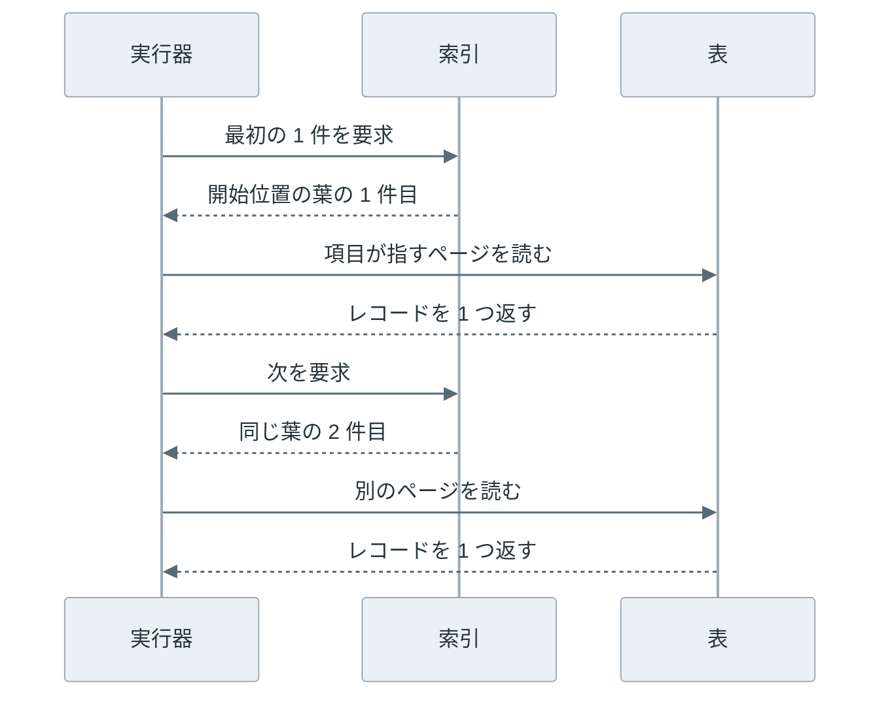
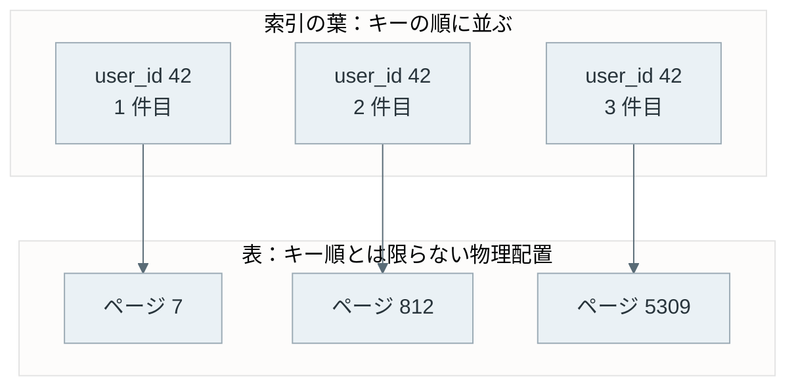
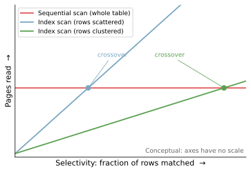
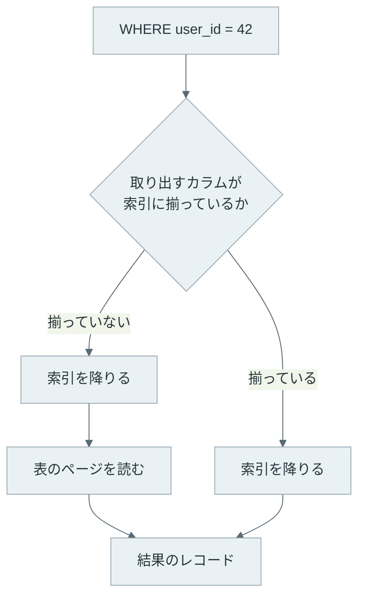
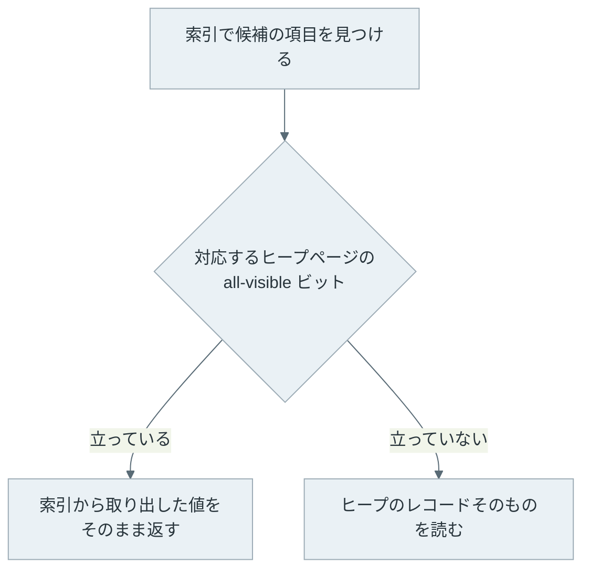
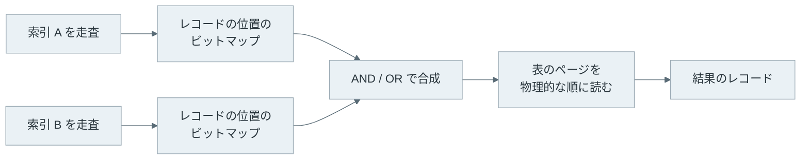
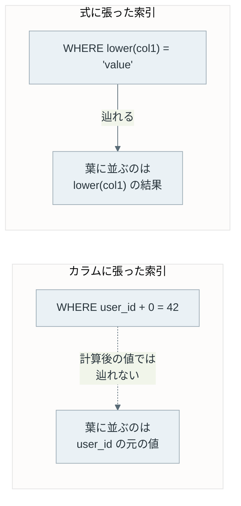
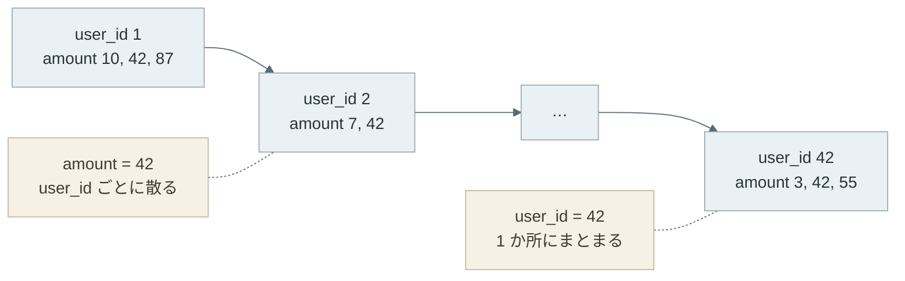

Index Scan は、索引（インデックス）を辿って条件に一致するレコードの在り処を求め、そこから表のレコードを読み出す方法です。DB（データベース）が 1 つの表からレコードを取り出す手段の 1 つで、表を先頭から順に読む全走査（sequential scan）と対になります。

遅い SQL の実行計画を確認すると、Index Scan という処理名が出てくることがあります。実行計画とは、DB がその問い合わせをどの手順で処理すると決めたのかを表す出力で、その手順を選ぶ DB の部品をプランナと呼びます。一覧画面の表示に数秒かかるので索引を足したのに応答時間が戻らない、という場面で開くのがこの出力です。

索引が存在することと、問い合わせがその索引で速くなることは別です。DB は索引を辿った後で表のレコードを読みに行くことが多く、そこで読むページの枚数が応答時間を大きく左右します。

条件に一致するレコードが返るまでの流れを以下に示します。


```mermaid
%%{init: {"theme":"base","themeVariables":{"primaryColor":"#eaf1f5","primaryTextColor":"#28343b","primaryBorderColor":"#9cabb5","lineColor":"#596b76","textColor":"#28343b","actorBkg":"#eaf1f5","actorBorder":"#9cabb5","actorTextColor":"#28343b","actorLineColor":"#9cabb5","signalColor":"#596b76","signalTextColor":"#28343b","noteBkgColor":"#f7f1e5","noteBorderColor":"#c5b99b","noteTextColor":"#403c32","activationBkgColor":"#edf3ef","activationBorderColor":"#9aafa1"}}}%%
flowchart LR
    C["WHERE user_id = 42"] --> D["索引を根から降りて<br/>開始位置の葉を決める"]
    D --> L["葉の項目を順に読み<br/>レコードの在り処を得る"]
    L --> T["表のページを読む"]
    T --> R["結果のレコード"]
    classDef default fill:#eaf1f5,stroke:#9cabb5,color:#28343b;
```

上記の図の「索引を根から降りる」「葉の項目を順に読む」は索引の中だけで完結し、「表のページを読む」は条件によっては省けます。

<br>

本記事では、1 台の DB が [B-Tree](/notes/database-systems/b-tree/) 系の索引を 1 本引いて `SELECT` のレコードを取り出す場合を例に、Index Scan が索引と表の間で何をしているのかと、同じ索引で速くなる場合とならない場合の分かれ目を説明します。取り上げる疑問は次の通りです。

- Index Scan は、索引を降りた後に表のレコードをどう読むのか。
- 同じ 100 件を返す Index Scan で、読むページが 4 枚と 103 枚に分かれるのはなぜか。
- index-only scan と bitmap scan は、表への読み出しをどう減らすのか。
- 索引があっても絞り込みに使いにくいのは、どんな条件なのか。

レコードを更新した時の索引の維持と、複数の処理が同時に読み書きする時の並行制御には触れません。どの方法を選ぶかを決める枠組みは [Query Processing](/notes/database-systems/query-processing/) のノートにあります。

---

### 前提

前提を 3 つ置きます。1 つ目は、DB が表も索引もページという固定長の区画に区切って管理し、ストレージとの読み書きもページ単位で行うことです。1 枚のページには複数のレコードが載り、一度読んだページはバッファキャッシュというメモリ上の控えにしばらく残ります。

2 つ目は、B-Tree 系の索引がキーの順に並んだ木で、一番上のノードを根、一番下に並ぶノードを葉と呼ぶことです。探索は根から葉に 1 段ずつ進むので、以降ではこの動きを「降りる」と書きます。木の構造は [B-Tree](/notes/database-systems/b-tree/) のノートで扱っています。

3 つ目は、索引と表が別々に置かれる構成です。InnoDB の主キー索引のように葉がレコードそのものを持つクラスタ化索引では、表を読みに行く段が最初からありません。

<br>

`EXPLAIN` に出る名前も、どの取り出し方を備えているかも、DBMS（Database Management System）で違います。例えば、PostgreSQL の `EXPLAIN` では `Index Scan`、SQLite の `EXPLAIN QUERY PLAN` では `SEARCH ... USING INDEX` という行が出ます。PostgreSQL の `Seq Scan` は表の順次走査です。一方、SQLite の `SCAN` は索引順の全走査も含むため、その語だけでは索引の使用を判断できません。`USING INDEX` や `USING COVERING INDEX` の有無も確認します。本記事では索引と表を別々に読む構成を説明し、DBMS ごとの差も補足します。

例えば、次の SQLite の実行計画には `SCAN` と `USING COVERING INDEX` が同時に現れます。`v` の順に索引全体を読み、必要なカラムも索引だけから取得します。

```sql
CREATE TABLE scan_demo (id INTEGER PRIMARY KEY, v INTEGER);
INSERT INTO scan_demo VALUES (1, 30), (2, 10), (3, 20);
CREATE INDEX scan_demo_v ON scan_demo(v);
EXPLAIN QUERY PLAN SELECT v FROM scan_demo ORDER BY v;
```

```text
SCAN scan_demo USING COVERING INDEX scan_demo_v
```

これは [SQLite の SCAN と SEARCH の区別](https://www.sqlite.org/eqp.html)を確かめる例です。実行計画の表示形式はバージョンで変わる場合があります。

---

### 索引を降りて表のレコードを読む流れ {#索引を降りて表の行を読む流れ}

Index Scan の処理は、索引を降りる、葉を読み進める、表のレコードを読む、という 3 つに分かれます。条件を外れるキーに当たった所で、葉を読み進める段が終わります。

この 3 つを動かすのは実行器です。実行器とは、実行計画の各段を実際に走らせる部分を指します。以下は、最初の 2 件を取り出すまでの往復です。


```mermaid
%%{init: {"theme":"base","themeVariables":{"primaryColor":"#eaf1f5","primaryTextColor":"#28343b","primaryBorderColor":"#9cabb5","lineColor":"#596b76","textColor":"#28343b","actorBkg":"#eaf1f5","actorBorder":"#9cabb5","actorTextColor":"#28343b","actorLineColor":"#9cabb5","signalColor":"#596b76","signalTextColor":"#28343b","noteBkgColor":"#f7f1e5","noteBorderColor":"#c5b99b","noteTextColor":"#403c32","activationBkgColor":"#edf3ef","activationBorderColor":"#9aafa1"}}}%%
sequenceDiagram
    participant E as 実行器
    participant I as 索引
    participant T as 表
    E->>I: 最初の 1 件を要求
    I-->>E: 開始位置の葉の 1 件目
    E->>T: 項目が指すページを読む
    T-->>E: レコードを 1 つ返す
    E->>I: 次を要求
    I-->>E: 同じ葉の 2 件目
    E->>T: 別のページを読む
    T-->>E: レコードを 1 つ返す
```

上記の図の表への読み出しは、そのレコードが載っているページがバッファキャッシュに残っていればメモリの読み取りで済み、残っていなければストレージへの読み出しになります。

同じ動きは範囲の条件にも使えます。`created_at BETWEEN ... AND ...` なら、開始位置の葉まで 1 度降りた後は、条件を外れるまでキーを順に読み進めるだけです。索引がキーの順に並んでいるので、`ORDER BY` の指定が索引の並び順と一致していれば、その順序をそのまま結果の順序として使えます。

このように索引順で結果を返せる問い合わせに `LIMIT 10` を付ければ、10 件を返した時点で走査を止められます。一方、並べ替え（Sort）やハッシュ表を作る段（Hash）は、入力をほぼ全件読むまで次の処理へ結果を渡せません。

---

### 索引を引くだけで終わらない理由

索引の葉が持つのは、キーと、そのキーに対応するレコードを見つけるための情報です。レコードの全てのカラムが入っているわけではないので、必要なカラムの値が索引に無ければ、DB は葉から得た情報を頼りに表のページを読みに行きます。

多くの場合、問題になりやすいのは表のページを読む部分です。木を降りる間に読む索引のページは段数の分だけで、上の段ほどバッファキャッシュに残りやすいからです。

索引の中で隣り合うキーは、表の中でも隣り合うとは限りません。PostgreSQL のヒープ（表のレコードの本体を格納した領域）のようにレコードを空いた場所に置いていく構成では、表の並びとキーの順序に関係がありません。一致した 100 件が 100 枚の別々のページに載っていれば、表のページを 100 枚読みます。

例えば、同じ 3 件は索引と表で次のように並びます。


```mermaid
%%{init: {"theme":"base","themeVariables":{"primaryColor":"#eaf1f5","primaryTextColor":"#28343b","primaryBorderColor":"#9cabb5","lineColor":"#596b76","textColor":"#28343b","actorBkg":"#eaf1f5","actorBorder":"#9cabb5","actorTextColor":"#28343b","actorLineColor":"#9cabb5","signalColor":"#596b76","signalTextColor":"#28343b","noteBkgColor":"#f7f1e5","noteBorderColor":"#c5b99b","noteTextColor":"#403c32","activationBkgColor":"#edf3ef","activationBorderColor":"#9aafa1"}}}%%
flowchart TB
    subgraph IDX["索引の葉：キーの順に並ぶ"]
        K1["user_id 42<br/>1 件目"]
        K2["user_id 42<br/>2 件目"]
        K3["user_id 42<br/>3 件目"]
    end
    subgraph TBL["表：キー順とは限らない物理配置"]
        P1["ページ 7"]
        P2["ページ 812"]
        P3["ページ 5309"]
    end
    K1 --> P1
    K2 --> P2
    K3 --> P3
    classDef default fill:#eaf1f5,stroke:#9cabb5,color:#28343b;
```

上記の図では、索引を 1 枚読んで得た 3 件のために表を 3 枚読んでいます。

この散らばり具合は、レコードが挿入・更新されてきた履歴で決まり、問い合わせの書き方では動きません。PostgreSQL は、この散らばり具合を数値にして、カラムごとの統計情報（DB がカラムごとに集計しておく値の分布などの情報）の 1 つとして `pg_stats` の `correlation` に持っています。

correlation は、カラムの値の順と表の中でのレコードの並び順がどれだけ一致しているかを -1〜+1 で表し、+1 は同じ順、-1 は逆順、0 付近は無関係に散らばった状態です。プランナは、この値が ±1 に近いほど、ディスクへのランダムアクセスが減るとして、そのカラムへの index scan を安く見積もります（[pg_stats](https://www.postgresql.org/docs/current/view-pg-stats.html)）。

<br>

PostgreSQL 17.10 で、100 万件の注文を `user_id` の順に並べた表 `orders_sorted` と、同じレコードをランダムな順に並べた表 `orders_random` を作り、どちらにも `user_id` の索引を張りました。`correlation` は 1 とほぼ 0 です。

`user_id = 4242` に一致する 100 件の、索引に無いカラム `status` を取り出した結果（抜粋）は以下の通りです。散らばった表ではプランナが bitmap scan（表をページの順に読む取り出し方）を選ぶので、`enable_bitmapscan` を off にして両方とも Index Scan に揃えています。

```text
 Index Scan using orders_sorted_user_id_idx on orders_sorted (actual rows=100 loops=1)
   Buffers: shared hit=1 read=3

 Index Scan using orders_random_user_id_idx on orders_random (actual rows=100 loops=1)
   Buffers: shared hit=39 read=64
```

`Buffers` は、その走査で触ったページの延べ枚数です（hit はバッファキャッシュにあった枚数、read はストレージから読んだ枚数）。同じ 100 件を返すのに、並んだ表では 4 枚、散らばった表では 103 枚を読んでいます。索引を降りる分は数枚なので、前に書いた表の 100 枚がほぼそのまま出ています。

一致するレコードが増えるほど、表のページの読み出しは積み上がります。一方、全走査が読むページの枚数は、条件で絞れた割合、つまり選択性（selectivity）では動きません。そのため、2 つの経路が読む枚数はどこかで入れ替わります。



上記の図に目盛りを置いていないのは、実測ではない概念図で、交点の位置も表の大きさとレコードの散らばり具合（scattered／clustered）で動くためです。表が小さいほど全走査の読む枚数そのものが少ないので、交点は左へ寄ります。PostgreSQL のドキュメントには、100 件から 1 件を選ぶ例について、その 100 件がおそらく 1 枚のディスクページに収まるので「[there is no plan that can beat sequentially fetching 1 disk page](https://www.postgresql.org/docs/current/indexes-examine.html)」（1 枚のディスクページを順に読むことに勝てる計画は無い）とあります。

Index Scan で読む量を整理すると、およそ「索引で読むページ + 表で読むページ」で、選択性と correlation で決まります。読む量を減らす手段は次の 3 つです。

- index-only scan：表で読むページを減らす
- bitmap scan：表のページを読む順序を変える
- `LIMIT`：必要な所で走査を止める

---

### 表への読み出しを減らす index-only scan

必要なカラムが全て索引に入っていれば、表への読み出しを省ける場合があります。PostgreSQL ではこの形を index-only scan と呼びます。

ある問い合わせに必要なカラムが全て入っている索引は、その問い合わせに対する [covering index](https://dev.mysql.com/doc/refman/8.4/en/glossary.html) と呼ばれます。covering index に当たるかどうかは、索引の種類ではなく問い合わせとの組み合わせで決まります。

取り出すカラムだけを変えると実行計画がどう動くのかは、手元の SQLite（3.44.4）で確かめられます。張ってある索引は 1 本で、`user_id` と `amount` の 2 カラムをこの順に並べた複合索引です。

```sql
-- orders は 100 万件。user_id は 1 万種類で、1 つの値につきおよそ 100 行。
-- CREATE INDEX idx_orders_user_amount ON orders(user_id, amount);
EXPLAIN QUERY PLAN SELECT status FROM orders WHERE user_id = 42;
EXPLAIN QUERY PLAN SELECT amount FROM orders WHERE user_id = 42;
```

返ってきた実行計画は次の通りです。

```text
QUERY PLAN
`--SEARCH orders USING INDEX idx_orders_user_amount (user_id=?)

QUERY PLAN
`--SEARCH orders USING COVERING INDEX idx_orders_user_amount (user_id=?)
```

条件も索引も同じで、違うのは取り出すカラムだけです。`status` は索引に入っていないので表を読む必要があり、`amount` は索引に入っているので `USING COVERING INDEX` に変わりました。SQLite のドキュメントには、この最適化の効果として「[saves one binary search for each row](https://www.sqlite.org/optoverview.html)」（1 件ごとに二分探索を 1 回節約する）とあります。

以下が 2 つの経路の分かれ目です。


```mermaid
%%{init: {"theme":"base","themeVariables":{"primaryColor":"#eaf1f5","primaryTextColor":"#28343b","primaryBorderColor":"#9cabb5","lineColor":"#596b76","textColor":"#28343b","actorBkg":"#eaf1f5","actorBorder":"#9cabb5","actorTextColor":"#28343b","actorLineColor":"#9cabb5","signalColor":"#596b76","signalTextColor":"#28343b","noteBkgColor":"#f7f1e5","noteBorderColor":"#c5b99b","noteTextColor":"#403c32","activationBkgColor":"#edf3ef","activationBorderColor":"#9aafa1"}}}%%
flowchart TB
    Q["WHERE user_id = 42"] --> D{"取り出すカラムが<br/>索引に揃っているか"}
    D -->|"揃っていない"| A1["索引を降りる"]
    A1 --> A2["表のページを読む"]
    A2 --> R["結果のレコード"]
    D -->|"揃っている"| B1["索引を降りる"]
    B1 --> R
    classDef default fill:#eaf1f5,stroke:#9cabb5,color:#28343b;
```

上記の図の揃っている経路では、一致するレコードが多い問い合わせほど「表のページを読む」を省けた時の差が大きくなります。索引にカラムを足せばこの経路に寄せられるため、PostgreSQL は検索の対象にしないカラムを索引に載せる `INCLUDE` を用意しています。

<br>

表を読まずに済むかどうかは、カラムが揃っているかだけでは決まりません。PostgreSQL はレコードを更新・削除しても古いレコードをしばらく残すので、索引の項目が指すレコードを今のトランザクションが読んでよいとは限りません。PostgreSQL の索引は、この「見えるかどうか」の情報を持ちません。

そこで使うのが、ページ内のレコードが全トランザクションから見えるかなどを記録する [visibility map](https://www.postgresql.org/docs/current/storage-vm.html) です。ヒープページ 1 枚につき 2 ビットを持ちます。`all-visible` は全てのレコードが各トランザクションから見えると分かっていること、`all-frozen` は全てのレコードが freeze 済みであることを記録します。freeze は、古いトランザクション ID の周回に備える処理です。

[index-only scan](https://www.postgresql.org/docs/current/indexes-index-only-scans.html) でヒープを読まずに済むかの判断に使うのは、`all-visible` のビットです。`all-frozen` は主に VACUUM の処理で使われ、索引だけで返すための追加条件ではありません。以下は `all-visible` を確認してからの分かれ道です。


```mermaid
%%{init: {"theme":"base","themeVariables":{"primaryColor":"#eaf1f5","primaryTextColor":"#28343b","primaryBorderColor":"#9cabb5","lineColor":"#596b76","textColor":"#28343b","actorBkg":"#eaf1f5","actorBorder":"#9cabb5","actorTextColor":"#28343b","actorLineColor":"#9cabb5","signalColor":"#596b76","signalTextColor":"#28343b","noteBkgColor":"#f7f1e5","noteBorderColor":"#c5b99b","noteTextColor":"#403c32","activationBkgColor":"#edf3ef","activationBorderColor":"#9aafa1"}}}%%
flowchart TB
    F["索引で候補の項目を見つける"] --> V{"対応するヒープページの<br/>all-visible ビット"}
    V -->|"立っている"| A["索引から取り出した値を<br/>そのまま返す"]
    V -->|"立っていない"| B["ヒープのレコードそのものを読む"]
    classDef default fill:#eaf1f5,stroke:#9cabb5,color:#28343b;
```

上記の図の下の経路が残るので、index-only scan はヒープへの読み出しを大きく減らす形であって、必ず 0 にする形ではありません。実際に何回ヒープを読みに行ったのかは、[`EXPLAIN ANALYZE`](https://www.postgresql.org/docs/current/using-explain.html) の出力に出る `Heap Fetches` で分かります。

---

### レコードの位置を集めてページ順に読む bitmap scan {#行の位置を集めてページ順に読む-bitmap-scan}

表への読み出しが散らばる問題には、索引から一致したレコードの位置を先に全部集めて印を付け、その後で表をページの順に読む手もあります。これが bitmap scan で、PostgreSQL では索引 1 本の場合にもこの形が選ばれます。複数の索引を組み合わせる際には、必要な索引をそれぞれ走査して「[prepares a bitmap in memory giving the locations of table rows](https://www.postgresql.org/docs/current/indexes-bitmap-scans.html)」（表のレコードの位置を示すビットマップをメモリ上に用意する）と説明されています。

このビットマップは、表の中でのレコードの位置の順に並んでいます。どの索引から作っても並び方が同じなので、問い合わせに応じて AND や OR で重ねられます。

例えば、2 本の索引を合成する場合は次の流れになります。


```mermaid
%%{init: {"theme":"base","themeVariables":{"primaryColor":"#eaf1f5","primaryTextColor":"#28343b","primaryBorderColor":"#9cabb5","lineColor":"#596b76","textColor":"#28343b","actorBkg":"#eaf1f5","actorBorder":"#9cabb5","actorTextColor":"#28343b","actorLineColor":"#9cabb5","signalColor":"#596b76","signalTextColor":"#28343b","noteBkgColor":"#f7f1e5","noteBorderColor":"#c5b99b","noteTextColor":"#403c32","activationBkgColor":"#edf3ef","activationBorderColor":"#9aafa1"}}}%%
flowchart LR
    I1["索引 A を走査"] --> B1["レコードの位置の<br/>ビットマップ"]
    I2["索引 B を走査"] --> B2["レコードの位置の<br/>ビットマップ"]
    B1 --> AN["AND / OR で合成"]
    B2 --> AN
    AN --> S["表のページを<br/>物理的な順に読む"]
    S --> R["結果のレコード"]
    classDef default fill:#eaf1f5,stroke:#9cabb5,color:#28343b;
```

上記の図の最後で表を読む順序は、索引に並んでいた順ではなく物理的な順です。同じページに載っているレコードをまとめて処理でき、ページを何度も読み直す動きが減ります。同じドキュメントは、その代償として「[any ordering of the original indexes is lost](https://www.postgresql.org/docs/current/indexes-bitmap-scans.html)」（元の索引が持っていた順序は失われる）と書き、`ORDER BY` があれば別に整列の段が必要だと続けています。

先頭の 1 件が返るまでの時間も変わります。ビットマップを合成し終えるまで表を読み始められないので、索引を降りた直後に 1 件目が返るという性質は失われます。

ビットマップが割り当てられたメモリに収まらない場合の扱いにも注意が必要です。PostgreSQL はレコード単位での保持を諦めてページ単位に落とします。そうするとページ内のどのレコードが一致したかが分からなくなるので、そのページの全てのレコードで条件を確かめ直します。

---

### 索引があっても絞り込みに使いにくい条件

索引の構造と問い合わせ条件が噛み合わないと、索引があっても走査する範囲を絞れません。

| 条件 | なぜ絞り込みに使いにくいか |
| --- | --- |
| カラムに関数や演算を掛けている | 通常のカラム索引に入っているのは元の値なので、計算後の値では葉を辿れない |
| 複合索引の先頭カラムに条件が無い | 一般には走査する範囲を狭めにくい |

この型は、先ほどの SQLite で再現できます。取り出すカラムを `SELECT status` に固定したまま条件だけを変えると、`WHERE user_id + 0 = 42` も `WHERE amount = 42` も `SCAN orders` になりました。

`SCAN` は索引の順に辿る場合も含めて全てのレコードを訪れること、`SEARCH` は表のレコードの一部だけを訪れることを表します（[SQLite のドキュメント](https://www.sqlite.org/eqp.html)）。絞り込めているかどうかは、この 2 語の差に出ます。

最初の表に挙げた 2 つの条件には、それぞれ回避手段と例外があります。

関数や演算を掛けた条件には、式に張る索引で対応できます。PostgreSQL の[ドキュメント](https://www.postgresql.org/docs/current/indexes-expressional.html)によれば、`lower(col1)` の結果に索引を定義してあれば、`lower(col1) = 'value'` という条件でも索引を使えます。以下は、カラムと式に張った索引の比較です。


```mermaid
%%{init: {"theme":"base","themeVariables":{"primaryColor":"#eaf1f5","primaryTextColor":"#28343b","primaryBorderColor":"#9cabb5","lineColor":"#596b76","textColor":"#28343b","actorBkg":"#eaf1f5","actorBorder":"#9cabb5","actorTextColor":"#28343b","actorLineColor":"#9cabb5","signalColor":"#596b76","signalTextColor":"#28343b","noteBkgColor":"#f7f1e5","noteBorderColor":"#c5b99b","noteTextColor":"#403c32","activationBkgColor":"#edf3ef","activationBorderColor":"#9aafa1"}}}%%
flowchart LR
    subgraph COL["カラムに張った索引"]
        direction TB
        Q1["WHERE user_id + 0 = 42"] -.->|"計算後の値では<br/>辿れない"| K1["葉に並ぶのは<br/>user_id の元の値"]
    end
    subgraph EXP["式に張った索引"]
        direction TB
        Q2["WHERE lower(col1) = 'value'"] -->|"辿れる"| K2["葉に並ぶのは<br/>lower(col1) の結果"]
    end
    classDef default fill:#eaf1f5,stroke:#9cabb5,color:#28343b;
```

先頭カラムに条件が無い場合の制約は、複合索引の並び順から出ています。PostgreSQL は、複合索引が索引のカラムの任意の部分集合を含む条件で使えるとした上で、「[the index is most efficient when there are constraints on the leading (leftmost) columns](https://www.postgresql.org/docs/current/indexes-multicolumn.html)」（索引が最も効率的なのは、先頭（最も左）のカラムに制約がある時）としています。

以下は、先ほどの複合索引 `(user_id, amount)` の葉の並びです。`amount` の値は説明用です。


```mermaid
%%{init: {"theme":"base","themeVariables":{"primaryColor":"#eaf1f5","primaryTextColor":"#28343b","primaryBorderColor":"#9cabb5","lineColor":"#596b76","textColor":"#28343b","actorBkg":"#eaf1f5","actorBorder":"#9cabb5","actorTextColor":"#28343b","actorLineColor":"#9cabb5","signalColor":"#596b76","signalTextColor":"#28343b","noteBkgColor":"#f7f1e5","noteBorderColor":"#c5b99b","noteTextColor":"#403c32","activationBkgColor":"#edf3ef","activationBorderColor":"#9aafa1"}}}%%
flowchart LR
    P1["user_id 1<br/>amount 10, 42, 87"] --> P2["user_id 2<br/>amount 7, 42"] --> P3["…"] --> P4["user_id 42<br/>amount 3, 42, 55"]
    N1["user_id = 42<br/>1 か所にまとまる"]:::note -.- P4
    N2["amount = 42<br/>user_id ごとに散る"]:::note -.- P2
    classDef default fill:#eaf1f5,stroke:#9cabb5,color:#28343b;
    classDef note fill:#f7f1e5,stroke:#c5b99b,color:#403c32;
```

先頭カラムの条件が無くても、索引を読むこと自体はできます。ただし、上記の図の `amount = 42` のように項目が散ると、多くの場合は索引の全体を読む形になり、走査する範囲が絞られません。何を読むのが安いかはそこで改めて見積もられ、表の全走査が選ばれることもあります。

例外として、PostgreSQL の複合索引のドキュメントは skip scan にも触れています。skip scan は、先頭カラムの取り得る値がごく少ないとプランナが見積もった場合に、その値ごとの等値の条件を内部で作り、「[skip over most of the index](https://www.postgresql.org/docs/current/indexes-multicolumn.html)」（索引の大半を読み飛ばす）形で走査する範囲を減らす方法です。

---

### 見積もりで全走査に負ける条件

条件に合う索引があっても、プランナが全走査の方を安いと見積もれば、索引を使う実行計画は選ばれません。

| 条件 | なぜ全走査が選ばれるか |
| --- | --- |
| 一致するレコードが表の大部分を占める | 索引を使う候補より、全走査の方が安いと見積もられる |
| 統計情報が古い | 推定レコード数が実際とずれ、全走査の方が安いと見積もられる |

上記の表のどちらの行も、見積もりの結果として現れます。実際のレコード数そのものではなく、統計から見積もった推定レコード数を材料にコストが計算されるからです。

索引が使われない理由を調べたい時は、PostgreSQL の `enable_seqscan` のような設定を使い、全走査を選びにくくして別の計画が成立するかを確かめます。[ドキュメント](https://www.postgresql.org/docs/current/indexes-examine.html)を踏まえると、それでも全走査が選ばれるなら、条件が索引と噛み合っていないなどのより根本的な理由がある可能性が高いと考えられます。

---

### 利点

- 表のレコード数が増えても、読む量は表の大きさではなく一致するレコード数でおおむね決まる
- 索引の並び順をそのまま使えるため、`ORDER BY` の整列を省ける場合がある
- 先頭の数件だけが必要な問い合わせでは、途中で走査を止められる
- 必要なカラムが索引に揃っていれば、表への読み出しを大きく減らせる

---

### 欠点

Index Scan は、条件に一致するレコードだけに届く代わりに、表の並びと条件の書き方に左右されます。そのため、次の制約があります。

- 索引と表の 2 か所を読むため、一致するレコードが増えるほど表を読む回数が積み上がる
- 条件の書き方で索引を使えるかどうかが変わり、些細な違いで実行計画が動く
- 索引を増やすほど、レコードを更新するたびに書き換える対象が増える

---

### Index Scan の効果が小さくなりやすいケース

- 条件に一致するレコードが表の大部分を占め、索引を辿った末にほとんどのページを読む場合
- 表が小さく、全体が数ページに収まる場合
- 索引の順序と表の並び順の相関が低く、一致したレコードが多数のページに散っている場合
- 取り出すカラムが多く、索引だけでは揃わない場合

1 つ目で影響しているのは選択性です。値の種類が少ないカラムだから索引が働かない、という話ではありません。値が 2 種類でも、片方が全体の 0.01% しか無ければ、その値で絞り込む問い合わせでは索引で読む量を減らせる場合があります。

3 つ目と 4 つ目は、表や索引の作り方を変えれば効果が戻ることがあります。PostgreSQL の `CLUSTER` のように、索引の順序に合わせて表のレコードを並べ直す操作を持つ DBMS もあります。

どの手段が選ばれるかを最後に決めるのは、冒頭で触れたプランナです。PostgreSQL のように索引を名指しするヒントを持たない DBMS では、開発者は、プランナが選べる実行計画を増やすように索引や問い合わせを設計します。
