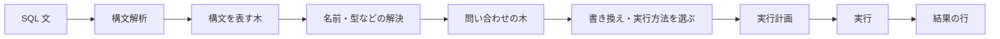
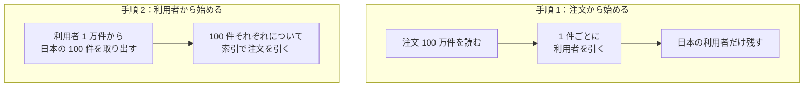
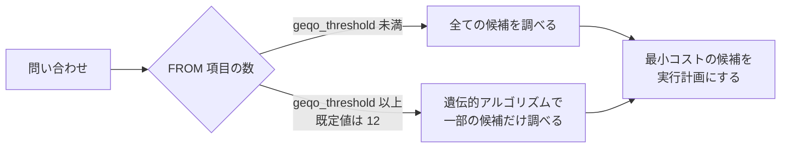
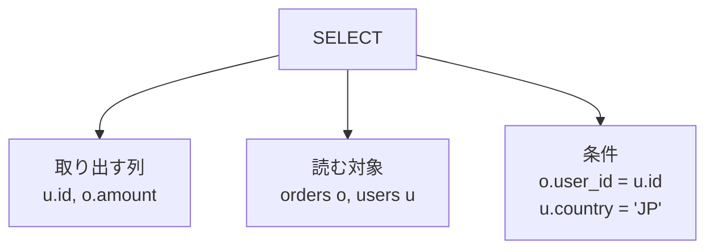
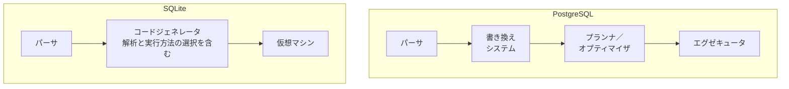
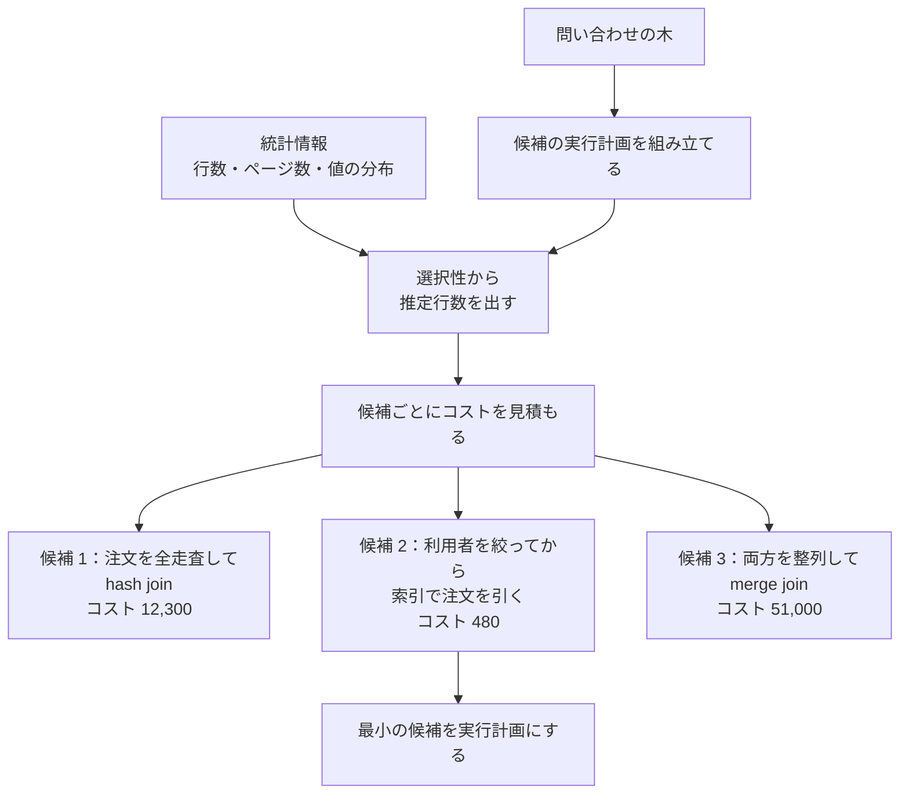
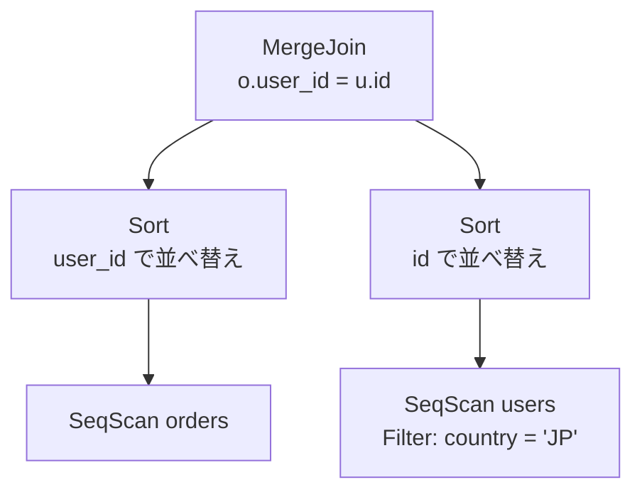
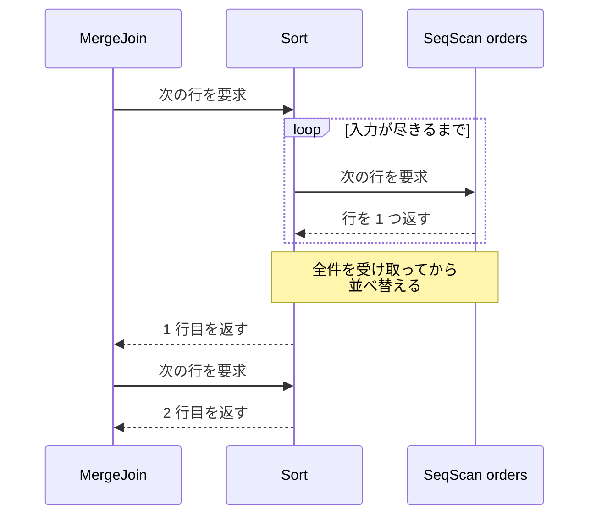

Query Processing（問い合わせ処理）は、DB（データベース）が受け取った SQL 文を実行可能な手順に変換し、その手順を動かして結果の行を返すまでの処理です。ここで選ばれた手順を実行計画（クエリプラン、query plan）と呼びます。

この仕組みの名前が表に出るのは、応答の遅い問い合わせを調べている時です。PostgreSQL で `EXPLAIN SELECT ...` と打つと、`Seq Scan` `Index Scan` `Hash Join` のような語が並んだ木が返ってきます。出力の形は DBMS（Database Management System）で違い、MySQL の `EXPLAIN` は形式を指定しなければ表の形になります。

MySQL のマニュアルは、オプティマイザが選んだ操作の集まりを「[query execution plan](https://dev.mysql.com/doc/refman/8.4/en/execution-plan-information.html)」（クエリ実行計画）と呼んでいます。オプティマイザとは、実行方法を選ぶ段階に付いた名前です。この木を読めるようになると、遅い問い合わせのどの部分が原因なのかを絞り込めます。

昨日まで速かった SQL が今日から遅い、という現象の理由も、木を見比べれば見当が付きます。以下では、DB がその木をどう作り、どう動かすのかを追います。

SQL 文が結果の行になるまでの流れを以下に示します。



上記の図の流れで DB が引き受けているのは、条件に合う行を集める作業だけではありません。どの手順でそれを集めるかを決める作業も含まれます。同じ SQL 文でも、表の大きさや索引（インデックス）の有無が変われば、「実行方法を選ぶ」から出てくる実行計画は変わります。

---

### 前提と説明の範囲

処理を何段階に分けるかと、それぞれの段階の呼び名は DBMS で違います。[PostgreSQL のドキュメント](https://www.postgresql.org/docs/current/query-path.html)は、接続の確立を別にするとパーサ、書き換えシステム、プランナ／オプティマイザ、エグゼキュータの 4 つに分けて説明しています。

以降では、どの DBMS にも現れる「構文を解析して名前や型を解決する」「実行方法を選ぶ」「選んだ手順を動かす」の 3 つを軸に置き、実装で割れる所は都度断ります。本ノートでは、1 台の DB が 1 本の `SELECT` を処理する流れを追います。複数の問い合わせが同時に走る時の並行制御と、処理を複数のノードや複数の CPU に分散する構成には触れません。

---

### なぜ DB が実行手順を決めるのか

SQL は、欲しい結果の条件を書く言語です。どの表をどの順に読み、どの索引を使うかという手順は書きません。同じ結果を返す手順は複数あり、どれを選ぶかで読む行数が桁違いに変わります。例えば、利用者の表が 1 万件、注文の表が 100 万件あり、日本の利用者の注文だけを取り出すとします。

素朴に考えても、次の 2 つの手順が思い付きます。



上記の図の手順 1 では、最後に捨てる行まで含めて 100 万件を突き合わせます。手順 2 で突き合わせの起点になるのは 100 件だけです。どちらも同じ行の集まりを返します。ただし、起点になる行数は 4 桁違います。手順 2 も日本の 100 件を選ぶために利用者 1 万件を読むので、読む総量の差はこれより小さくなります。

手順 2 の有利さを大きく左右するのは、注文の表にある索引です。索引は、列の値から該当する行の在り処を引ける別のデータ構造で、表を全部読まずに目的の行に届きます。日本の利用者 100 件それぞれについて `user_id` から対応する注文だけを探せるので、100 万件を読む手順 1 との差が開きます。索引の構造は [B-Tree](/notes/database-systems/b-tree/) のノートで扱っています。

索引が無くても、同じ結合の順で処理する事自体はできます。その場合は起点の 100 件それぞれについて注文の表を繰り返し調べる事になり、手順 2 の方がかえって高コストになり得ます。どの順で結合するかと、内側の入力にどう届くかは別の選択で、後者が変わればどちらの手順が速いかも変わります。索引の構造は [B-Tree](/notes/database-systems/b-tree/) のノートで扱っています。

実際にどちらが選ばれるのかは、SQLite の実行計画で分かります。注文の表を `FROM` の先頭に書いた形です。

```sql
-- users は 1 万件（うち country が 'JP' の行は 100 件）、orders は 100 万件。
-- orders.user_id には索引を張ってあり、users.country には索引が無い。
EXPLAIN QUERY PLAN
SELECT u.id, o.amount
  FROM orders o JOIN users u ON o.user_id = u.id
 WHERE u.country = 'JP';
```

返ってきた実行計画は次の通りです。

```text
QUERY PLAN
|--SCAN u
`--SEARCH o USING INDEX idx_orders_user_id (user_id=?)
```

2 行をどう読むのかは、SQLite のドキュメントで確かめられます。`SCAN` は表を全部読む事、`SEARCH` は行の一部だけを訪れる事を表し、並び順については「[The order of the entries indicates the nesting order.](https://www.sqlite.org/eqp.html)」（項目の並び順が入れ子の順序を表す）と書かれています。先に並ぶ側が外側の繰り返しになります。

上の出力で外側に来ているのは、`FROM` の 2 番目に書いた `u`、つまり利用者の表です。`country` に索引が無いため全部読み、そこで得た日本の 100 件それぞれについて、内側で注文の表を索引で引いています。`(user_id=?)` の `?` には、外側から渡る `u.id` の値が入ります。上記の図の手順 2 と同じ形です。

どちらの表を外側にするかは、統計情報や推定行数、条件を通る行の割合、候補ごとの見積もりコストを合わせて決まります。索引はその材料の 1 つで、この例ではそれが効いた、という読み方になります。

`FROM` の順を入れ替えて注文の表を後ろに書いても、返ってくる実行計画は同じでした。SQLite のドキュメントも、この出力には「[how the query is actually evaluated, not how it is specified in the SQL statement](https://www.sqlite.org/eqp.html)」（SQL 文にどう書かれたかではなく、問い合わせが実際にどう評価されるか）を示すと書かれています。なお、出力の形式はバージョンで変わる事があります。

既定では、SQL に書いた順序は読む順序の指示になっていません。指示にする手段は別に用意されています。SQLite は `CROSS JOIN` と書かれた結合だけ順序を並べ替えず、「[the programmer can force SQLite to choose a particular loop nesting order](https://www.sqlite.org/optoverview.html)」（プログラマが特定のループの入れ子順序を SQLite に強制できる）と説明されています。

同じ結果を返す実行計画のそれぞれは、ここでは候補と呼びます。候補の数は、結合する表が増えるほど急に増えます。

PostgreSQL のドキュメントには、「[examining each possible way in which a query can be executed would take an excessive amount of time and memory](https://www.postgresql.org/docs/current/planner-optimizer.html)」（問い合わせを実行し得る全ての方法を調べると、過大な時間とメモリが掛かる）場合があると書き、結合の数がしきい値を超えると遺伝的アルゴリズムによる探索に切り替えると説明されています。

以下が切り替わり方です。



遺伝的アルゴリズムは、良い候補どうしを組み合わせて少しずつ改善する探索の方法で、全ての候補を調べません。上記の図の分岐は PostgreSQL のもので、探索を打ち切る条件は DBMS ごとに違います。最適な手順を必ず選ぶのではなく、妥当な手順を現実的な時間で選ぶという割り切りが、`geqo_threshold` のような設定項目として表に出ています。

---

### 構文解析と名前の解決で問い合わせの木を作る

最初の段階は構文解析です。文字列として届いた SQL が、取り出す列・読む対象・条件といった部品に分解され、SQL の文法だけを頼りにした木になります。

PostgreSQL のドキュメントは、この段階では「[It does not make any lookups in the system catalogs](https://www.postgresql.org/docs/current/parser-stage.html)」（システムカタログを一切引かない）と書かれています。木の中に `users` という名前が有っても、それがどの表を指すのかはまだ確かめていません。

先ほどの `SELECT` を木にすると、次の形になります。



上記の図の木に、読む順序も使う索引も入っていません。実行計画に進むには、この木にもう 2 種類の情報が必要です。

1 つ目は、名前と型の解決です。`users` という表と `country` という列が本当にあるのか、`country` の型が何なのかは、DB が自身のスキーマを格納したカタログを引いて確かめます。

PostgreSQL はこの処理を transformation process と呼びます。パーサが返した木を入力に取って「[the semantic interpretation needed to understand which tables, functions, and operators are referenced by the query](https://www.postgresql.org/docs/current/parser-stage.html)」（どの表・関数・演算子を参照しているのかを理解するのに必要な意味解釈）を行い、できた構造を query tree と呼ぶ、と書かれています。

つまり、構文だけを表す木（parse tree）と、DB が意味を解決し終えた問い合わせの木（query tree）は別のものです。形は似ていても、名前がどの実体を指すのかが決まっています。

同じページは、後者には「[structurally similar to the raw parse tree in most places, but it has many differences in detail](https://www.postgresql.org/docs/current/parser-stage.html)」（大部分は raw parse tree と構造が似ているが、細部には多くの違いがある）だと書かれています。

2 つ目は、書き換えの規則です。例えばビューを読む問い合わせでは、ビューの名前が、その定義に書かれた問い合わせに置き換わります。PostgreSQL は、書き換えシステムが問い合わせの木に対して「[looks for any rules (stored in the system catalogs) to apply to the query tree](https://www.postgresql.org/docs/current/query-path.html)」（システムカタログに格納された規則の中から、問い合わせの木に適用できるものを探す）と説明されています。

この 2 つをどこで、どういう区切りで行うかは DBMS で違います。PostgreSQL と SQLite の段階の分け方は以下の通りです。



上記の図の SQLite に、独立した書き換えの段階はありません。木を組み立てた後に「[the code generator runs to analyze the parse tree and generate bytecode](https://www.sqlite.org/arch.html)」（コードジェネレータが動き、parse tree を解析してバイトコードを生成する）段階が置かれ、木からバイトコードまでが 1 つの流れになっています。段階の数と呼び名が違っても、名前や型の解決を挟んでから実行方法の選択に進む順序は共通しています。

---

### コストで実行方法を選ぶ

実行方法を選ぶ段階の仕事について、PostgreSQL のドキュメントには「[The task of the planner/optimizer is to create an optimal execution plan.](https://www.postgresql.org/docs/current/planner-optimizer.html)」（プランナ／オプティマイザの仕事は、最適な実行計画を作る事だ）と書かれています。候補の中から、見積もったコストが最も小さいものを選びます。なお、`ORDER BY` を書いていなければ、行の並ぶ順序は選ばれた手順によって変わり得ます。

選択肢は大きく 2 種類あります。1 つは、1 つの表から行をどう取り出すかです。表を先頭から順に読む方法（sequential scan）と、索引を辿って必要な行だけを読む方法（index scan）が代表になります。同じ動作でも `EXPLAIN` での名前は DBMS で違い、表の全走査を PostgreSQL は `Seq Scan`、SQLite は `SCAN` と表示します。

もう 1 つは、2 つの行の集まりをどう突き合わせるかです。PostgreSQL が用意している 3 つは以下の通りです。

| 結合アルゴリズム | やり方 | 選ばれやすい場面 |
| --- | --- | --- |
| nested loop join | 外側の入力から得た 1 行ごとに、内側の入力から一致する行を探す | 外側の入力の行数が少なく、内側を索引で引ける |
| merge join | 結合に使う列で両方の入力を整列してから、並行に読んで突き合わせる | 結合列の順序が索引で得られるか、整列してでも各入力を 1 回ずつの走査で済ませたい |
| hash join | 片方の入力を先に読んでハッシュ表を作り、もう片方を読みながら突き合わせる | 等値の結合で、ハッシュ表が作業用のメモリに収まる |

表の中の外側・内側や片方・もう片方は、実行時にどちらの入力から読むかを指します。SQL 文で先に書いた表がそのまま外側になる訳ではないのは、先の SQLite の例で見た通りです。

3 つ目の列に書いたのは、その手段が選ばれやすい条件です。その場面で必ず選ばれるという意味ではありません。どの手段を持つかも DBMS で違うので、`EXPLAIN` に出てくる名前はその DBMS のドキュメントで引く必要があります。

どの候補を選ぶかを決める材料が、統計情報です。PostgreSQL は表と索引の行数とディスクブロック数を `pg_class` に、列の値の分布を `pg_statistic` に持ちます。ドキュメントは、`pg_statistic` の項目が `ANALYZE` と `VACUUM ANALYZE` で更新され、更新した直後でも「[always approximate](https://www.postgresql.org/docs/current/planner-stats.html)」（常に近似）だと断っています。

`pg_class` が持つ行数とブロック数は、`CREATE INDEX` のような一部の DDL でも更新されます。更新の間隔が空くほど、実際の値との差は開きます。

統計を見て選ぶ作りは PostgreSQL に限りません。SQLite のドキュメントにも、「[SQLite uses a cost-based query planner that estimates the CPU and disk I/O costs of various competing query plans](https://www.sqlite.org/optoverview.html)」（SQLite はコストに基づいたクエリプランナを使い、競合する複数の実行計画について CPU とディスク入出力のコストを見積もる）と書かれています。

統計は `ANALYZE` で集められ、`sqlite_stat` で始まる名前の表に格納されます。ただし SQLite で `ANALYZE` を実行するかどうかは任意で、集めていない間は組み込みの既定の推定値が使われます。

統計からコストが決まるまでには、間に 1 段挟まります。DB はまず統計を使って、各条件を通った後に何行残るかを見積もります。行数そのものは cardinality と呼ばれ、統計から見積もったその値が推定行数（cardinality estimate）です。見積もりに使うのが選択性、つまり条件を通る行の割合です。`country = 'JP'` が全体の 1% を通す条件だと推定できれば、1 万件の表からは 100 行が残る、という具合です。

推定行数が決まると、その行数を読むのに何ページ触るか、突き合わせに何回の比較が必要かを換算した値がコストになります。候補が実行計画に決まるまでの流れは以下の通りです。図の中のコストの値は、説明のために置いた例です。



上記の図で比べているのは、実際に測った時間ではなく見積もりの値です。前の段がずれれば後ろの段もずれるので、土台にある統計が実際のデータとずれていれば候補の順位も入れ替わります。実行計画が突然変わったように見える現象は、この土台の変化が主な原因の 1 つになります。

---

### 見積もりが外れやすいケース

推定行数がずれる原因は、統計の古さだけではありません。代表的な場面を以下に挙げます。

- 列どうしに相関がある条件で絞り込む場合
- 統計を集めた後で、大量の行を入れ替えた表を読む場合
- 実行時まで値が決まらないパラメータを条件に使う場合
- 結合を何段も重ね、中間結果の行数の誤差が積み上がる場合

1 つ目の相関とは、`country = 'JP' AND city = '東京'` のように、片方が決まるともう片方の取り得る値が絞られる関係を指します。列ごとの分布だけを持っている場合、DB は 2 つの条件が独立だとみなして、それぞれの選択性を掛け合わせます。

例えば `country = 'JP'` を通る行が 1%、`city = '東京'` を通る行が 1% なら、掛け合わせた見積もりは 0.01% です。東京の行がほぼ全て日本であれば、実際に残るのは 1% に近く、見積もりは 2 桁ずれます。PostgreSQL は、この種の相関を扱うために `CREATE STATISTICS` で複数列の統計を作る手段を用意しています。

見積もりが外れても、結果の行が間違う訳ではありません。ずれるのは、どの手順が速いかという判断だけです。ずれているかどうかは、実行せずに計画だけを表示する `EXPLAIN` では分かりません。PostgreSQL は、`EXPLAIN` に `ANALYZE` を付けると実際に問い合わせを実行し、「[the true row counts and true run time](https://www.postgresql.org/docs/current/using-explain.html)」（実際の行数と実際の実行時間）を見積もりと並べて表示すると書かれています。

同じページは、見積もった行数には「[reasonably close to reality](https://www.postgresql.org/docs/current/using-explain.html)」（実際と十分に近い）かどうかを見る事が最も重要だと書かれています。見積もりと実際が大きく開いている演算子を探すと、遅さの原因を絞り込めます。なお、`EXPLAIN ANALYZE` は問い合わせを実際に動かすので、更新を伴う文で使う時は影響に注意が必要です。

---

### 実行器が計画を 1 行ずつ引き出す

実行計画は、行を作る部品を組み合わせた木です。表を走査する、2 つの入力を結合する、並べ替える、といった 1 つ 1 つの部品を演算子と呼びます。SQL に書く `=` や `AND` の演算子とは別のものを指します。

先ほどの問い合わせを merge join で処理するとしたら、という例は以下の通りです。前の段階の問い合わせの木とは別の木で、実行方法を選ぶ段階がそこから作ります。



上記の図で、元の SQL に書いた条件は 2 か所に分かれました。`u.country = 'JP'` は利用者の表を走査する所で行を絞る条件になり、`o.user_id = u.id` は 2 つの入力を突き合わせる条件になっています。1 つの表だけで判定できる条件を走査する演算子に寄せると、結合に渡る行数が減ります。

この木を動かす段階について、PostgreSQL のドキュメントには「[This is essentially a demand-pull pipeline mechanism.](https://www.postgresql.org/docs/current/executor.html)」（これは本質的に、要求で引き出すパイプラインの仕組みだ）と書かれています。上の演算子が下の演算子に次の 1 行を要求し、要求された演算子が 1 行だけ返します。返す行が尽きた演算子は、その旨を呼び出し元に伝えます。

この作りは、Goetz Graefe 氏の論文「Query Evaluation Techniques for Large Databases」（ACM Computing Surveys 25(2)）で整理されています。論文は演算子を 3 つの手続きに分けます。

3 つの手続きの名前は、ファイル走査での呼び名を全ての演算子に流用したものです。論文は「[In a file scan, these functions are called open, next, and close procedures; we adopt these names for all operators.](https://cs.uwaterloo.ca/~david/cs848s13/graefe.pdf)」（ファイル走査では、これらの機能を open・next・close の手続きと呼ぶ。本稿では、この名前を全ての演算子に用いる）と書かれています。

この形で実装した演算子は、論文の中で iterator と呼ばれています。同じ箇所は、商用システムでは row-source などとも呼ばれると紹介しています。名前が違っても手続きの形は揃っているので、演算子どうしを組み合わせて複雑な実行計画を作れます。

上記の図のうち、注文の表を並べ替える入力だけを取り出し、要求と応答の往復は以下の通りです。



上記の図の `SeqScan orders` は、要求を受けるたびに表から 1 行を返しています。一方で `Sort` は、1 行目を返す前に入力を全部読み切っています。入力の順序を全く利用できない整列では、全件が揃わないと先頭が決まらないからです。ハッシュ表を作る側の入力にも同じ性質があります。

このように、最初の 1 行を返す前に入力を多く、場合によっては全部読む必要がある演算子を blocking operator と呼びます。行の流れがそこで一度せき止められるので、利用する側から見ると結果の 1 行目が返るまでの時間が延びます。`LIMIT` を付けて先頭の数行だけを取り出す問い合わせでは、この差が応答時間に出ます。

読み込んだ中間データを保持する必要があるため、メモリも使います。実装によっては、作業用に割り当てられたメモリに収まらない場合に、中間データの一部を一時ファイルなどのストレージに書き出して処理を続けます。整列やハッシュ表の構築が入る計画では、入力の行数が増えた時にメモリ内で完結するかどうかで所要時間が変わり得ます。

演算子の木を辿る作りが唯一の形ではありません。前掲の図のとおり、[SQLite](https://www.sqlite.org/arch.html) は SQL のテキストをバイトコードにコンパイルし、そのバイトコードを仮想マシンで動かします。バイトコードは、DB の内部だけで使う小さな命令列です。

アプリケーションが `sqlite3_step()` を呼ぶと、その命令列が仮想マシンに渡って動きます。1 行ずつ結果を作って返す点は木を辿る作りと共通していて、違うのは木を降りるか命令列を進むかという実行の形です。

---

### 利点

- 表の大きさやデータの偏りが変わっても、SQL を書き直さずに実行手順だけが変わる
- 索引を追加すると、既存の問い合わせもその索引を使う候補を持てる
- 手順を書かずに済むため、SQL が業務上の条件だけを表す短い文で収まる
- 統計を更新した時も、DB のバージョンを上げて実装が変わった時も、その時点の情報と実装で手順が選び直される

---

### 欠点

以下は、手順の決定を DB に預け、データの分布に応じて選ばせる事を優先した結果として現れる制約です。

- 既定では手順を書き手が書かないので、何が選ばれたのかは `EXPLAIN` で確かめるまで分からない
- 統計情報が古いと、実際の行数とかけ離れた見積もりのまま手順が選ばれる
- 結合する表が増えるほど候補が増え、実行計画を作る処理に時間が掛かる
- データ量や統計の更新をきっかけに手順が変わり、同じ SQL の応答時間が動く

多くの DBMS は、選ばれる手順に人が介入する手段を別に用意しています。特定のアルゴリズムを避けさせる設定、特定の索引を優先させる指定、探索する候補の範囲を狭める設定、実行方法をより強く指定するヒントなど、形はさまざまです。どこまで強制できるかは DBMS と機能によって違い、あくまで選ばれやすさを変えるだけのものもあります。
