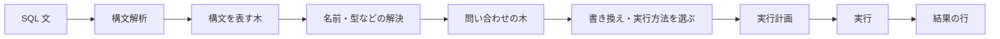
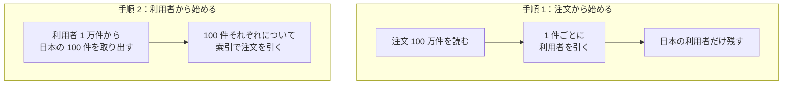
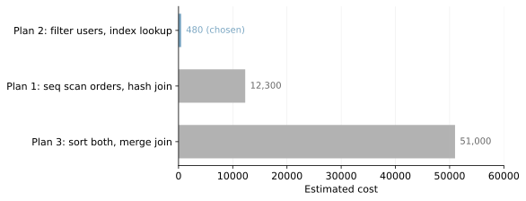
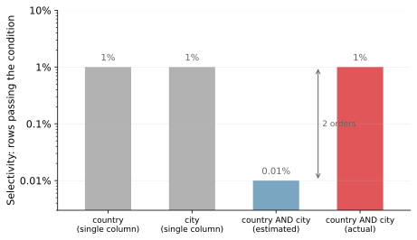
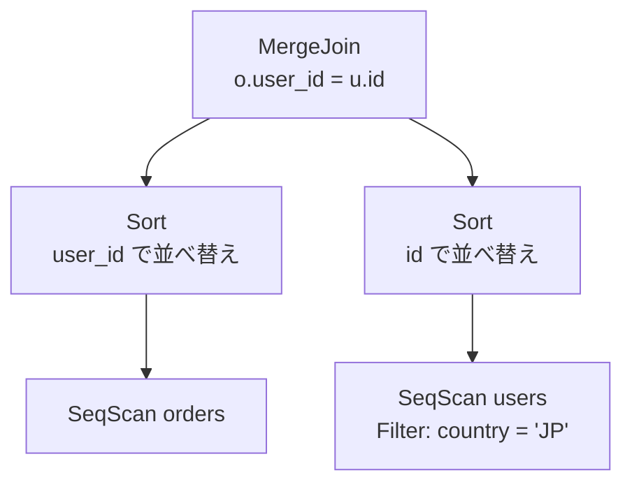
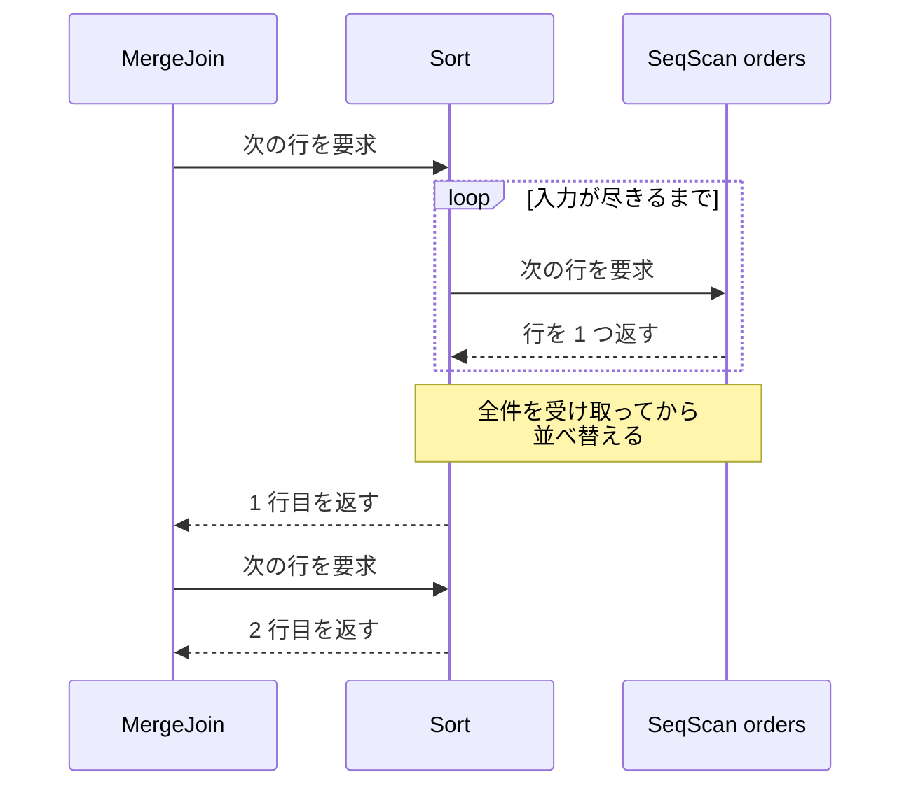

Query Processing（問い合わせ処理）は、DB（データベース）が受け取った SQL 文を実行可能な手順に変換し、その手順を動かして結果の行を返すまでの処理です。ここで選ばれた手順を実行計画（クエリプラン、query plan）と呼びます。

この仕組みの名前が表に出るのは、応答の遅い問い合わせを調べている時です。PostgreSQL で `EXPLAIN SELECT ...` と打つと、`Seq Scan` `Index Scan` `Hash Join` のような語が並んだ、実行計画の木が返ってきます。出力の形は DBMS（Database Management System）で違い、MySQL の `EXPLAIN` は形式を指定しなければ表の形になります。

この木を読めるようになると、遅い問い合わせのどの部分が原因なのかを絞り込めます。昨日まで速かった SQL が今日から遅い、という現象の理由も、木を見比べれば見当が付きます。SQL 文が結果の行になるまでの流れは以下の通りです。



DB は条件に合う行を集めるだけでなく、どの手順で集めるかも決めています。同じ SQL 文でも、表の大きさや索引（インデックス）の有無が変われば、「実行方法を選ぶ」段階から出てくる実行計画は変わります。

---

### 前提と説明の範囲

処理を何段階に分けるかと、それぞれの段階の呼び名は DBMS で違います。[PostgreSQL のドキュメント](https://www.postgresql.org/docs/current/query-path.html)は、接続の確立を別にするとパーサ、書き換えシステム、プランナ／オプティマイザ、エグゼキュータの 4 つに分けて説明しています。

以降では、どの DBMS にも現れる「構文を解析して名前や型を解決する」「実行方法を選ぶ」「選んだ手順を動かす」の 3 つを軸に置き、実装で割れる所は都度断ります。本ノートでは、1 台の DB が 1 本の `SELECT` を処理する流れを追います。複数の問い合わせが同時に走る時の並行制御と、処理を複数のノードや複数の CPU に分散する構成には触れません。

---

### なぜ DB が実行手順を決めるのか

SQL は、欲しい結果の条件を書く言語です。どの表をどの順に読み、どの索引を使うかという手順は書きません。同じ結果を返す手順は複数あり、どれを選ぶかで読む行数が桁違いに変わります。例えば、利用者の表が 1 万件、注文の表が 100 万件あり、日本の利用者の注文だけを取り出すとします。

素朴に考えても、次の 2 つの手順が思い付きます。



どちらの手順も同じ行の集まりを返します。しかし、突き合わせの起点になるのは、手順 1 では最後に捨てる行まで含めた 100 万件、手順 2 では 100 件で、4 桁の差があります。手順 2 も日本の 100 件を選ぶために利用者 1 万件を読むので、読む総量の差はこれより小さくなります。

手順 2 の有利さを大きく左右するのは、注文の表にある索引です。索引は、列の値から該当する行の在り処を引ける別のデータ構造で、表を全部読まずに目的の行に届きます。日本の利用者 100 件それぞれについて `user_id` から対応する注文だけを探せるので、100 万件を読む手順 1 との差が開きます。索引の構造は [B-Tree](/notes/database-systems/b-tree/) のノートで扱っています。

索引が無くても、同じ結合の順で処理する事自体はできます。その場合は起点の 100 件それぞれについて注文の表を繰り返し調べる事になり、手順 2 の方がかえって高コストになり得ます。結合の順序と、後から読む表の読み方は別々の選択で、読み方が変われば速い手順も入れ替わります。

どちらが選ばれるかは、アプリケーションに組み込んで使う DB である SQLite の実行計画で分かります。以下は、注文の表を `FROM` の先頭に書いた問い合わせです。

```sql
-- users は 1 万件（うち country が 'JP' の行は 100 件）、orders は 100 万件。
-- orders.user_id には索引を張ってあり、users.country には索引が無い。
EXPLAIN QUERY PLAN
SELECT u.id, o.amount
  FROM orders o JOIN users u ON o.user_id = u.id
 WHERE u.country = 'JP';
```

返ってきた実行計画は次の通りです。

```text
QUERY PLAN
|--SCAN u
`--SEARCH o USING INDEX idx_orders_user_id (user_id=?)
```

[SQLite のドキュメント](https://www.sqlite.org/eqp.html)によれば、`SCAN` は表を全部読む事、`SEARCH` は行の一部だけを訪れる事を表し、項目の並び順は入れ子の順序を表します。先に並ぶ項目が外側の繰り返しになります。

上の出力で外側に来ているのは、`FROM` の 2 番目に書いた `u`、つまり利用者の表です。`country` に索引が無いため全部読み、そこで得た日本の 100 件それぞれについて、内側で注文の表を索引で引いています。`(user_id=?)` の `?` には、外側から渡る `u.id` の値が入ります。手順 2 と同じ形です。

`FROM` の順を入れ替えて注文の表を後ろに書いても、返ってくる実行計画は同じでした。同じドキュメントによれば、この出力が示すのは、SQL 文にどう書かれたかではなく、問い合わせがどう評価されるかです。なお、出力の形式はバージョンで変わる事があります。

[SQLite の結合](https://www.sqlite.org/optoverview.html)は入れ子のループで、既定では `FROM` の左端の表が外側になります。ただし、良い索引を使えるなら入れ子の順序を変えます。並べ替えの対象になるのは内部結合で、外部結合（`LEFT JOIN` など）は常に書いた順に評価されます。

どちらの表を外側にするかの材料は、索引の有無と、表の行数や条件を通る行の割合の見積もりです。この例では見積もりの材料を集める `ANALYZE` を実行しておらず、SQLite は表の実際の行数を知りません。表を空にしても、同じ実行計画になりました。

同じ結果を返す実行計画は複数あり、その 1 つ 1 つを候補と呼びます。候補の数は結合する表が増えるほど急に増え、全ての候補を調べると過大な時間とメモリが掛かる場合があります。[PostgreSQL](https://www.postgresql.org/docs/current/planner-optimizer.html) は、結合する表の数がしきい値（設定項目 `geqo_threshold`）より少ない間は候補をほぼ網羅的に調べ、しきい値に達すると遺伝的アルゴリズムによる探索に切り替えます。

遺伝的アルゴリズムは、良い候補どうしを組み合わせて少しずつ改善する探索の方法で、全ての候補を調べません。最適な手順を必ず選ぶのではなく、妥当な手順を現実的な時間で選ぶという割り切りが、`geqo_threshold` のような設定項目として表に出ています。候補の絞り方は DBMS ごとに違い、[SQLite](https://www.sqlite.org/queryplanner-ng.html) は結合順を探す各段で良い経路を少数だけ残し、全ての候補を調べずに計画を作ります。

---

### 構文解析と名前の解決で問い合わせの木を作る

最初の段階は構文解析です。文字列として届いた SQL が、取り出す列・読む対象・条件といった部品に分解され、SQL の文法だけを頼りにした木になります。先ほどの `SELECT` なら、取り出す列の `u.id, o.amount`、読む対象の `orders o JOIN users u` とその結合条件 `o.user_id = u.id`、`WHERE` の条件 `u.country = 'JP'` が部品になります。

PostgreSQL の構文解析は、DB が自身のスキーマを格納したカタログを一切引きません（[PostgreSQL のドキュメント](https://www.postgresql.org/docs/current/parser-stage.html)）。そのため、木の中に `users` という名前が有っても、それがどの表を指すのかはまだ確かめていません。木には読む順序も使う索引も入っておらず、実行計画に進む前に、名前と型の解決と、書き換えが行われます。

名前と型の解決では、カタログを引いて、`users` という表と `country` という列が本当にあるのか、`country` の型が何なのかを確かめます。PostgreSQL はこの処理を transformation process と呼び、どの表・関数・演算子を参照しているのかを理解するための意味解釈を行います。

PostgreSQL では、構文だけを表す木（parse tree）とは別に、transformation process が意味を解決し終えた問い合わせの木（query tree）を作ります。query tree の構造は大部分で parse tree に似ていて、名前がどの実体を指すのかが決まっている点などの細部が違います。

書き換えでは、例えばビューを読む問い合わせなら、ビューの名前がその定義に書かれた問い合わせに置き換わります。[PostgreSQL の書き換えシステム](https://www.postgresql.org/docs/current/query-path.html)は、システムカタログに格納された規則の中から、問い合わせの木に適用できるものを探して適用します。

この 2 つをどこで、どういう区切りで行うかは DBMS で違います。[SQLite](https://www.sqlite.org/arch.html) には独立した書き換えの段階が無く、パーサが木を組み立てた後に、コードジェネレータがその木を解析してバイトコード（DB の内部だけで使う小さな命令列）を生成します。

PostgreSQL の段階と並べると、SQLite では名前の解決から実行方法の選択までをコードジェネレータが受け持ち、エグゼキュータと同じく計画を動かすのは、バイトコードを実行する仮想マシンです。段階の数と呼び名が違っても、名前や型の解決を挟んでから実行方法の選択に進む順序は共通しています。

---

### コストで実行方法を選ぶ

[PostgreSQL のプランナ／オプティマイザ](https://www.postgresql.org/docs/current/planner-optimizer.html)は、調べた候補の中から、見積もったコストが最も小さいものを選び、エグゼキュータに渡す実行計画にします。なお、`ORDER BY` を書いていなければ、行の並ぶ順序は選ばれた手順によって変わり得ます。

候補どうしで大きく違うのは、表を結合する順序、1 つの表から行を取り出す方法、2 つの行の集まりを突き合わせる方法です。結合の順序は、前の節の手順 1 と手順 2 の違いです。

行の取り出し方は、表を先頭から順に読む方法（sequential scan）と、索引を辿って必要な行だけを読む方法（index scan）が代表です。同じ動作でも `EXPLAIN` での名前は DBMS で違い、表の全走査を PostgreSQL は `Seq Scan`、SQLite は `SCAN` と表示します。

突き合わせ方として PostgreSQL が用意している 3 つは以下の通りです。

| 結合アルゴリズム | やり方 | 選ばれやすい場面 |
| --- | --- | --- |
| nested loop join | 外側の入力から得た 1 行ごとに、内側の入力から一致する行を探す | 外側の入力の行数が少なく、内側を索引で引ける |
| merge join | 結合に使う列で両方の入力を整列してから、並行に読んで突き合わせる | 結合列の順序が索引で得られるか、整列してでも各入力を 1 回ずつの走査で済ませたい |
| hash join | 片方の入力を先に読んでハッシュ表を作り、もう片方を読みながら突き合わせる | 等値の結合で、ハッシュ表が作業用のメモリに収まる |

上の表に書いた外側・内側や片方・もう片方は、実行時にどちらの入力から読むかを指し、SQL 文で先に書いた表とは限りません。選ばれやすい場面の列は、その場面で必ず選ばれるという意味ではありません。どの手段を持つかも DBMS で違うので、`EXPLAIN` に出てくる名前はその DBMS のドキュメントで引く必要があります。

どの候補を選ぶかを決める材料が、統計情報です。PostgreSQL は、表と索引の行数とディスクブロック数を `pg_class` に、列の値の分布を `pg_statistic` に持ちます。どちらも問い合わせのたびには更新されません。

`pg_class` の値は `VACUUM`・`ANALYZE`・`CREATE INDEX` のような一部の命令で更新され、プランナはその値を表の現在の物理的な大きさに合わせて換算して使います。`pg_statistic` の項目は `ANALYZE` と `VACUUM ANALYZE` で更新され、更新した直後でも「[always approximate](https://www.postgresql.org/docs/current/planner-stats.html)」（常に近似）です。

統計からコストが決まるまでには、間に 1 段挟まります。DB はまず統計から、条件を通る行の割合である選択性（selectivity）を見積もり、各条件を通った後に何行残るかを出します。この行数の見積もりが推定行数（cardinality estimate）で、実際に残る行数（cardinality）とは別の値です。`country = 'JP'` が全体の 1% を通す条件だと推定できれば、1 万件の表からは 100 行が残る、という具合です。

推定行数が決まると、その行数を読むのに何ページ触るか、突き合わせに何回の比較が必要かを換算した値が、候補ごとのコストになります。先ほどの例で候補を 3 つ挙げると、注文を全走査して hash join する候補 1、手順 2 と同じく利用者を絞ってから索引で注文を引く候補 2、両方を整列して merge join する候補 3 です。以下は、この 3 つに説明のためのコストを置いた例です。



上記の図の値は、測った時間ではなく見積もりです。統計がずれれば推定行数がずれ、推定行数がずれればコストもずれるので、統計が実際のデータと離れていれば候補の順位も入れ替わります。実行計画が突然変わったように見える現象は、統計の変化が主な原因の 1 つです。

コストで選ぶ作りは PostgreSQL に限りません。[SQLite](https://www.sqlite.org/optoverview.html) も、競合する複数の実行計画について CPU とディスク入出力のコストを見積もります。統計は `ANALYZE` で集めて、`sqlite_stat` で始まる名前の表に格納します。ただし `ANALYZE` を実行するかどうかは任意で、集めていない間は組み込みの既定の推定値が使われます。先の SQLite の例も、この推定値と索引の有無から実行計画が選ばれていました。

---

### 見積もりが外れやすいケース

推定行数がずれる原因は、統計の古さだけではありません。代表的な場面は以下の通りです。

- 列どうしに相関がある条件で絞り込む場合
- 統計を集めた後で、大量の行を入れ替えた表を読む場合
- 実行時まで値が決まらないパラメータを条件に使う場合
- 結合を何段も重ね、中間結果の行数の誤差が積み上がる場合

列どうしの相関とは、`country = 'JP' AND city = '東京'` のように、片方が決まるともう片方の取り得る値が絞られる関係を指します。列ごとの分布だけを持っている場合、DB は 2 つの条件が独立だとみなして、それぞれの選択性を掛け合わせます。

例えば `country = 'JP'` を通る行が 1%、`city = '東京'` を通る行が 1% だとします。東京の行がほぼ全て日本である場合、独立とみなして掛け合わせた見積もり（estimated）と、実際に残る割合（actual）は次のように離れます。



PostgreSQL は、この種の相関を扱うために `CREATE STATISTICS` で複数列の統計を作る手段を用意しています。

見積もりが外れても、結果の行が間違う訳ではありません。ずれるのは、どの手順が速いかという判断だけです。ずれているかどうかは、計画だけを表示する `EXPLAIN` では分かりません。[PostgreSQL](https://www.postgresql.org/docs/current/using-explain.html) の `EXPLAIN` は、`ANALYZE` を付けると問い合わせを実行し、計画の各部分で数えた行数と実行時間を見積もりと並べて表示します。

同じページでは、見積もった行数が「[reasonably close to reality](https://www.postgresql.org/docs/current/using-explain.html)」（実際と十分に近い）かどうかを見る事が、多くの場合に最も重要だと書かれています。計画の中で見積もりと実際が大きく開いている箇所を探すと、遅さの原因を絞り込めます。なお、`EXPLAIN ANALYZE` は問い合わせを動かすので、更新を伴う文で使う時は影響に注意が必要です。

---

### 実行器が実行計画から行を引き出す

実行計画は、行を作る部品を組み合わせた木です。表を走査する、2 つの入力を結合する、並べ替える、といった 1 つ 1 つの部品を演算子と呼びます。SQL に書く `=` や `AND` の演算子とは別のものを指します。

以下は、先ほどの問い合わせを merge join で処理する場合の実行計画です。名前の解決を経て作った問い合わせの木とは別の木で、実行方法を選ぶ段階がそこから作ります。



上記の図で、元の SQL の 2 つの条件は別々の演算子に置かれています。`u.country = 'JP'` は利用者の表を走査する所で行を絞る条件になり、`o.user_id = u.id` は 2 つの入力を突き合わせる条件になっています。1 つの表だけで判定できる条件を走査する演算子に寄せると、結合に渡る行数が減ります。

PostgreSQL の実行器（エグゼキュータ）では、上の演算子が下の演算子に次の 1 行を要求し、要求された演算子が 1 行だけ返します。返す行が尽きた演算子は、その旨を呼び出し元に伝えます。この作りは、PostgreSQL のドキュメントで「[demand-pull pipeline mechanism](https://www.postgresql.org/docs/current/executor.html)」（要求で引き出すパイプラインの仕組み）と呼ばれています。

同じ作りは、Goetz Graefe 氏の論文「[Query Evaluation Techniques for Large Databases](https://cs.uwaterloo.ca/~david/cs848s13/graefe.pdf)」（ACM Computing Surveys 25(2)）で、演算子が次の 1 件（通常は 1 行）を必要とするたびに、入力の演算子を手続きとして呼び出す形として整理されています。この形で作った演算子は iterator や row-source などの名前で呼ばれ、組み合わせていくらでも複雑な実行計画を組み立てられます。

実装を簡単にする工夫として、各演算子の処理は準備・1 件の生成・後始末の 3 つの手続きに分けられ、ファイル走査での呼び名に倣って open・next・close と名付けられています。

上記の実行計画の木から、`MergeJoin` の下で注文の表を並べ替える枝（`Sort` と `SeqScan orders`）だけを取り出すと、要求と応答の往復は以下の通りです。



上記の図の `Sort` は、1 行目を返す前に入力を全部読み切っています。入力の順序を全く利用できない整列では、全件が揃わないと先頭が決まらないからです。hash join でハッシュ表を作る方の入力にも、同じ性質があります。

このように、最初の 1 行を返す前に入力を多く、場合によっては全部読む必要がある演算子を blocking operator と呼びます。行の流れがそこで一度せき止められるので、結果の 1 行目が返るまでの時間が延びます。`LIMIT` を付けて先頭の数行だけを取り出す問い合わせでは、この差が応答時間に出ます。

読み込んだ中間データを保持するので、メモリも使います。実装によっては、作業用に割り当てられたメモリに収まらない場合に、中間データの一部を一時ファイルなどのストレージに書き出して処理を続けます。整列やハッシュ表の構築が入る計画では、入力の行数が増えた時にメモリ内で完結するかどうかで所要時間が変わり得ます。

演算子の木を辿る作りが唯一の形ではありません。SQLite では、アプリケーションが `sqlite3_step()` を呼ぶと、コードジェネレータが生成したバイトコードが仮想マシンに渡って動きます。1 行ずつ結果を作って返す点は木を辿る作りと共通していて、違うのは木を降りるか命令列を進むかという実行の形です。

---

### 利点

- 表の大きさやデータの偏りが変わっても、SQL を書き直さずに実行手順だけが変わる
- 索引を追加すると、既存の問い合わせもその索引を使う候補を持てる
- 手順を書かずに済むため、SQL が業務上の条件だけを表す短い文で収まる
- 統計を更新した時も、DB のバージョンを上げて実装が変わった時も、その時点の情報と実装で手順が選び直される

---

### 欠点

以下は、手順の決定を DB に預け、データの分布に応じて選ばせる事を優先した結果として現れる制約です。

- 既定では手順を書き手が書かないので、何が選ばれたのかは `EXPLAIN` で確かめるまで分からない
- 統計情報が古いと、実際の行数とかけ離れた見積もりのまま手順が選ばれる
- 結合する表が増えるほど候補が増え、広く探索する DBMS では実行計画を作る処理に時間が掛かる
- データ量や統計の更新をきっかけに手順が変わり、同じ SQL の応答時間が動く

多くの DBMS は、選ばれる手順に人が介入する手段を別に用意しています。特定のアルゴリズムを避けさせる設定、特定の索引を優先させる指定、探索する候補の範囲を狭める設定、実行方法をより強く指定するヒントなど、形はさまざまです。例えば [SQLite](https://www.sqlite.org/optoverview.html) は、`CROSS JOIN` と書いた結合の順序を並べ替えないので、書き手がループの入れ子の順序を固定できます。どこまで強制できるかは DBMS と機能によって違い、あくまで選ばれやすさを変えるだけのものもあります。
