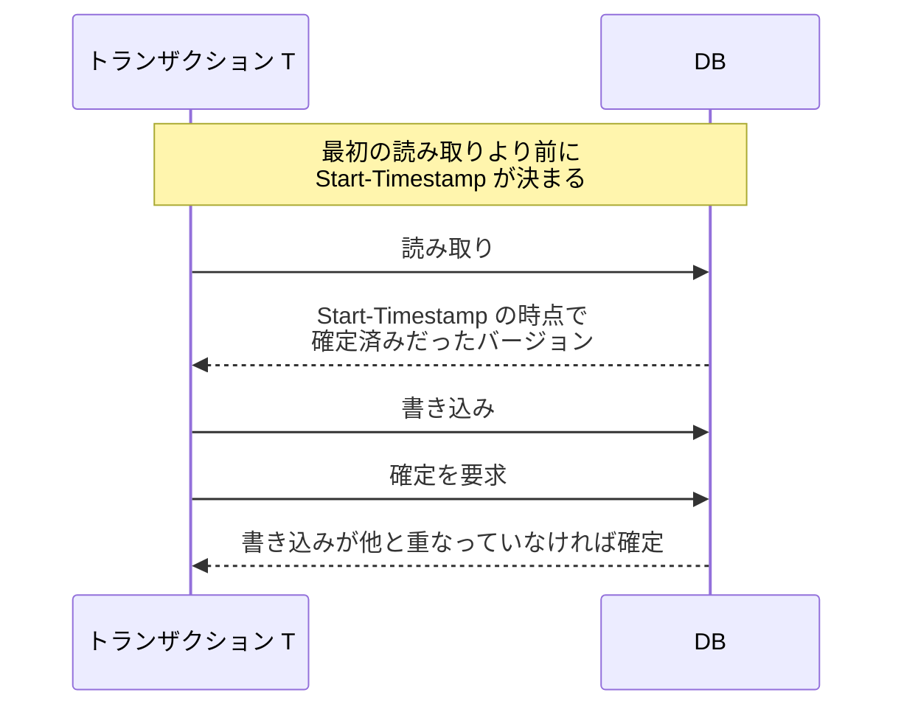
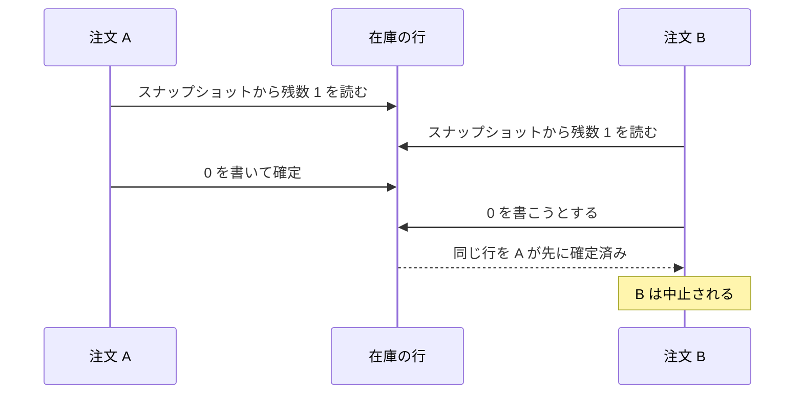
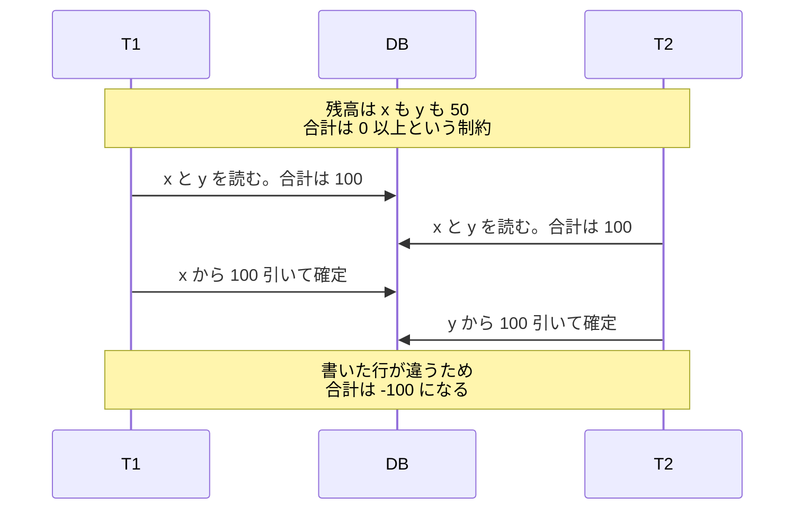
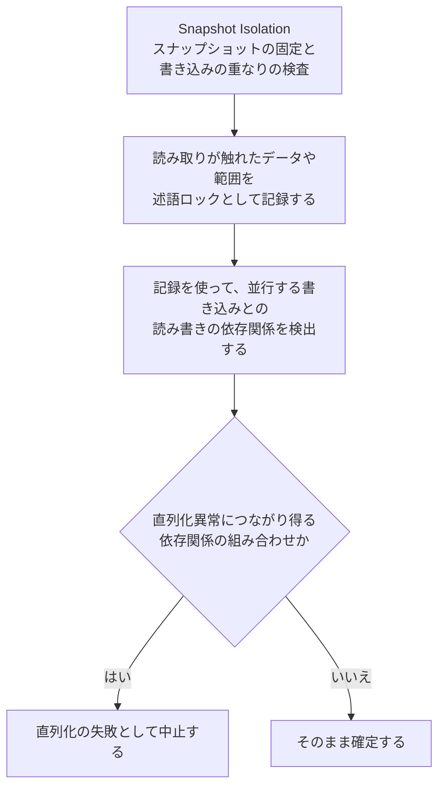

Snapshot Isolation は、トランザクションごとに 1 つのスナップショットを固定して読み、書き込みが重なった時に片方を中止する分離の方式です。Berenson 氏らが 1995 年に発表した論文「[A Critique of ANSI SQL Isolation Levels](https://www.microsoft.com/en-us/research/wp-content/uploads/2016/02/tr-95-51.pdf)」が定義しました。SQL 標準で名前が定義された 4 つの分離レベルとは別に定義された方式で、標準の表には出てきません。

この方式が効いてくる場面の代表は、長い集計と更新が同時に走る業務です。締め日の売上を集計する処理が数分走っている間も、注文の登録は止めたくないとします。読み取りをロックで守る作りでは、集計が読んだ行は集計が終わるまで更新できません。スナップショットから読めば、集計は途中で値の動かない結果を得ながら、注文の登録を止めずに済みます。

1 本のトランザクションが、読みと書きで何を基準にするのかを以下に示します。

上図の Start-Timestamp は、最初の読み取りより前に決まります。以降の読み取りは全部この 1 つの時点を基準にし、判定が入るのは書き込みの可否だけです。

---

### 前提と説明の範囲

本ノートで、説明する範囲も決めておきます。分離レベルの意味と、dirty read・nonrepeatable read・phantom read・lost update という異常の名前は [Transaction Isolation](../transaction-isolation/) で扱っているので、ここでは繰り返しません。行のバージョンを併存させる MVCC の仕組みも同じノートにあります。

ここで見るのは、Snapshot Isolation が何を防いで何を防がないのか、その線が他の実現方式とどう違うのかです。

---

### スナップショットを固定して読む

論文は、各トランザクションが Start-Timestamp（読み取りの基準時点）で確定済みだったデータのスナップショットから読む方式だと説明しています。Start-Timestamp は最初の読み取りより前であればよく、以降の読み取りは全部この時点を基準にします。

固定されるのは、他のトランザクションが後から確定した変更に対してです。自分がそのトランザクションの中で書いた変更は、後の読み取りから見えます。

読み手は書き手の確定を待ちません。論文も、Snapshot Isolation で走るトランザクションは、Start-Timestamp のスナップショットを保てる限り読み取りで止められる事がないと述べています。読み手が書き手を止める事もないので、集計の間も更新は進みます。

---

### first-committer-wins で書き込みの重なりを止める

読み取りが待たないだけでは、[Transaction Isolation](../transaction-isolation/) の冒頭で見た在庫の取り合いは止まりません。2 本とも同じ残数 1 を読み、両方が 0 を書けてしまいます。Snapshot Isolation は、書き込みに検査を置いてこれを止めます。

論文が定めた条件は、T1 が確定できるのは、T1 の実行区間 [Start-Timestamp, Commit-Timestamp] の中に Commit-Timestamp を持つ別のトランザクションが、T1 も書いたデータを書いていない場合に限る、というものです。満たさなければ T1 は中止されます。論文はこの規律を first-committer-wins と呼び、lost update を防ぐと述べています。

上図では注文 A が先に確定するので、同じ行を書こうとした注文 B が中止されます。読み取りは待たずに済み、決着は確定の時点に集まります。

commit の時点で検査するこの形は、論文が置いた概念モデルです。実装が同じ形を取るとは限りません。PostgreSQL の REPEATABLE READ は、書き込みの時点で先に更新した相手を待ち、相手が確定していれば直列化の失敗として中止します。[Transaction Isolation](../transaction-isolation/) の「書き込みの競合をどう処理するか」で見た 3 番目の形です。待ちが入る点が違い、片方が中止される結果は同じです。

---

### 別々の行を書く write skew

first-committer-wins が見ているのは、同じデータへの書き込みが重なったかどうかです。2 本が別々の行を書けば、この検査には掛かりません。論文が write skew と名付けた異常で、制約が 2 つの行にまたがっている場合に現れます。

2 つの口座に掛かる制約が破れる様子を以下に示します。

上図の 2 本は同じ内容のスナップショットを見て、それぞれ x と y という別の行を書きます。書き込みが重なっていないので first-committer-wins は働かず、両方とも確定します。どちらのトランザクションも自分のスナップショットの中では合計 0 を残す計算をしており、制約を破っているのは確定した後の状態だけです。

論文も、個々の残高は負になってよく合計だけが非負であればよい銀行の制約を例に挙げています。書き込みが重ならなければ検査に掛からないので、壊れる条件は 2 つの行にまたがる制約に限りません。条件に合う行を数える制約も、2 本がそれぞれ別の行を挿入する事で壊れます。

---

### locking REPEATABLE READ との違い

論文は、Snapshot Isolation と REPEATABLE READ を包含関係にない 2 つとして置いています。ここで論文が指す REPEATABLE READ は、読み取りのロックを確定まで持つ形で実現したものです。比べているのは 2 つの実現方式であって、標準のレベル名ではありません。

2 つの性質を以下に示します。

| | locking REPEATABLE READ | Snapshot Isolation |
| --- | --- | --- |
| 読み取りの作り | 読んだ行のロックを確定まで持つ | 固定したスナップショットから読む |
| 同じデータで競合した時 | 読んだ行への書き込みが待たされる | 読み取りと書き込みは待ち合わせない |
| write skew | 読んだ行を相手が書けないので起きない | 起きる |
| 同じ条件で読み直した時 | 条件に合う行が新しく挿入されると結果が変わる | スナップショットが動かないので結果は変わらない |

上の表の下 2 行が逆を向いています。片方が防ぐ異常をもう片方が許すので、どちらが強いとは決まりません。

---

### PostgreSQL の REPEATABLE READ との関係

PostgreSQL のドキュメントは、[自身の REPEATABLE READ が「Snapshot Isolation」として学術文献や他の DB で知られる技術で実装されていると書いています](https://www.postgresql.org/docs/current/transaction-iso.html)。同じドキュメントは、2 本が互いの集計結果を別々の行として書き足す例を挙げ、REPEATABLE READ なら 2 本とも確定できると説明しています。write skew がそのまま出る、という事です。

REPEATABLE READ という名前が Snapshot Isolation を意味するわけではありません。標準が定めているのは、そのレベルで起きてはならない現象までで、実現方式は DBMS が決めます。同じ名前で読み取りのロックを使う実装なら、write skew は起きません。手元の DBMS がどちらなのかは、ドキュメントで確かめる事になります。

---

### Serializable Snapshot Isolation が足す検査

Snapshot Isolation に直列化異常の検査を足し、write skew のような異常を防ぐ方式の 1 つが Serializable Snapshot Isolation（SSI）です。SERIALIZABLE の実現方法が SSI だけ、という事ではありません。

PostgreSQL のドキュメントは、[SERIALIZABLE が「Serializable Snapshot Isolation」（SSI）で実装されており、Snapshot Isolation に直列化異常の検査を足した技術だと説明しています](https://www.postgresql.org/docs/current/transaction-iso.html)。

足されるのは、トランザクションの間の読み書きの依存関係を追う仕組みです。PostgreSQL は、読み取りが実際に触れたデータや範囲を述語ロック（predicate lock）として記録します。ドキュメントは、この記録が、ある書き込みが並行するトランザクションの先の読み取りの結果を変えていたかどうかを判定するためのものだと説明しています。

記録した依存関係のうち、直列化異常につながり得る組み合わせが見付かると、そのトランザクションは直列化の失敗として中止されます。述語ロックは依存関係を見付けるための材料で、判定そのものではありません。

述語ロックは名前にロックが付いていても、PostgreSQL のドキュメントによれば待ちを起こさず、デッドロックの原因にもなりません。依存関係の監視そのものが相手を待たせない代わりに、監視のコストと直列化の失敗が生じ得るので、呼び出す側には再試行の処理が要ります。

保証されるのは、競合する相手も SERIALIZABLE で走っている場合です。片方だけを SERIALIZABLE にしても、もう片方が REPEATABLE READ で走っていれば直列化は保証されません。

---

### 明示的なロックで押さえられる範囲

アプリケーション側で write skew を止める手もあります。`SELECT ... FOR UPDATE` のように、読む時点で行にロックを取る書き方です。ロックを取れば、その行は自分のトランザクションが終わるまで他から更新されません。

口座の例なら、T1 と T2 の両方が x と y の 2 行を同じ規則でロックして読む必要があります。片方だけがロックを取っても、もう片方が同じ規則に従わなければ write skew は一般には防げません。ロックの取り方をトランザクションの間で揃える事が前提になります。

押さえられるのは、壊れる制約に関わる行を全部ロックできる場合です。まだ存在しない行が制約に関わるなら、行ロックには掴む対象がありません。条件に合う行が後から挿入されて制約が壊れる形は、行ロックの外に残ります。

PostgreSQL のドキュメントも、REPEATABLE READ で業務上の規則を守らせるなら、競合するトランザクションを止める明示的なロックを慎重に使う必要があると注意しています。加えて、`LOCK TABLE` のような明示的なロックで書き込みを止めて最新の確定状態を検査する場合は、スナップショットが固定される前にロックを取る必要があります。アプリケーション側での整合性の検査を扱う[ページが、REPEATABLE READ では問い合わせを実行する前にロックを取るよう注意しています](https://www.postgresql.org/docs/current/applevel-consistency.html)。

スナップショットが先に固定されていると、ロックを取って以降の書き込みを止めても、ロックを取る前に別のトランザクションが確定した変更は見えないままになるためです。[Soft Delete](../soft-delete/) のノートでも、状態の遷移を直列化する手当てとして同じ書き方を挙げています。

---

### 利点

- 読み取りが書き込みを待たないので、長い集計と更新を同時に走らせられる
- 他のトランザクションが途中で確定した変更で、複数の問い合わせの基準時点がずれない
- lost update が DBMS の検査で止まり、アプリケーション側で読み直しを組む手間が減る
- 書き込みをしないトランザクションは、first-committer-wins では中止されない

---

### 欠点

以下は、Snapshot Isolation を使う時に考慮する必要がある制約です。

- 別々の行を書く write skew が残り、壊れた事は結果の値としてだけ現れる
- 書き込みが重なったトランザクションは中止されるので、再試行の処理が要る
- 古いバージョンを保持する領域が要り、長いトランザクションがあるほど溜まる
- SQL 標準に Snapshot Isolation という分離レベル名が無く、標準のレベル名だけからは実現方式を判別できない
