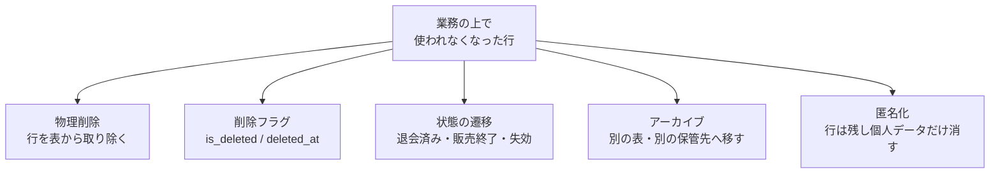
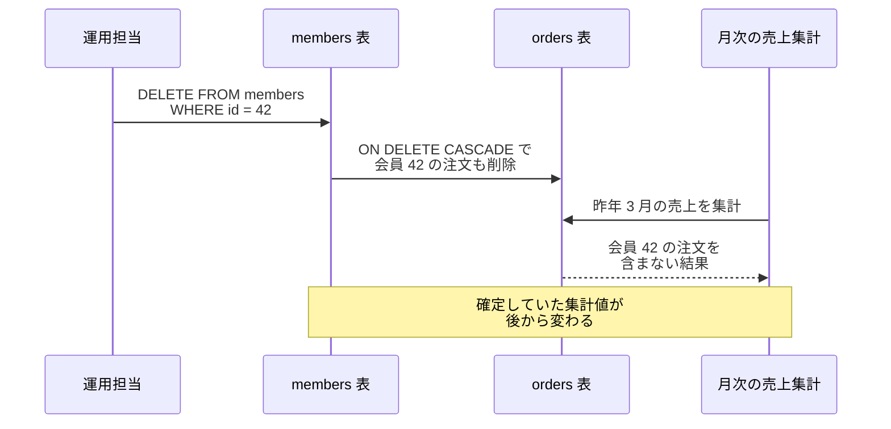
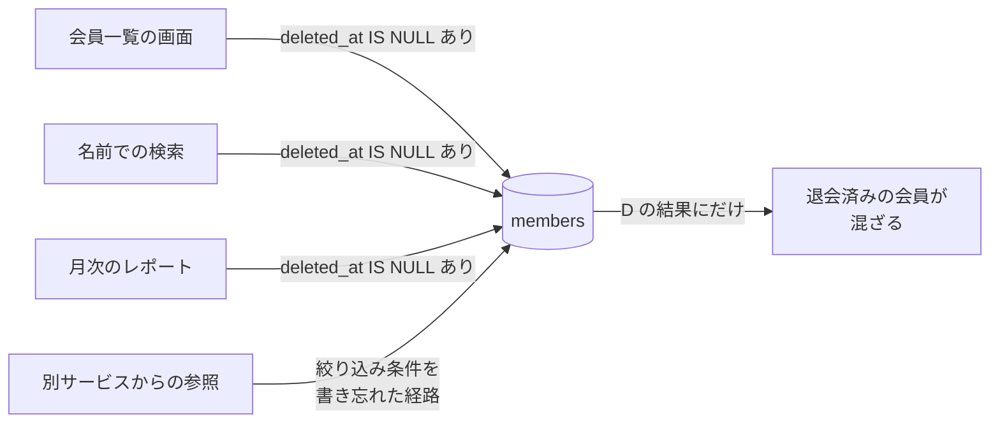
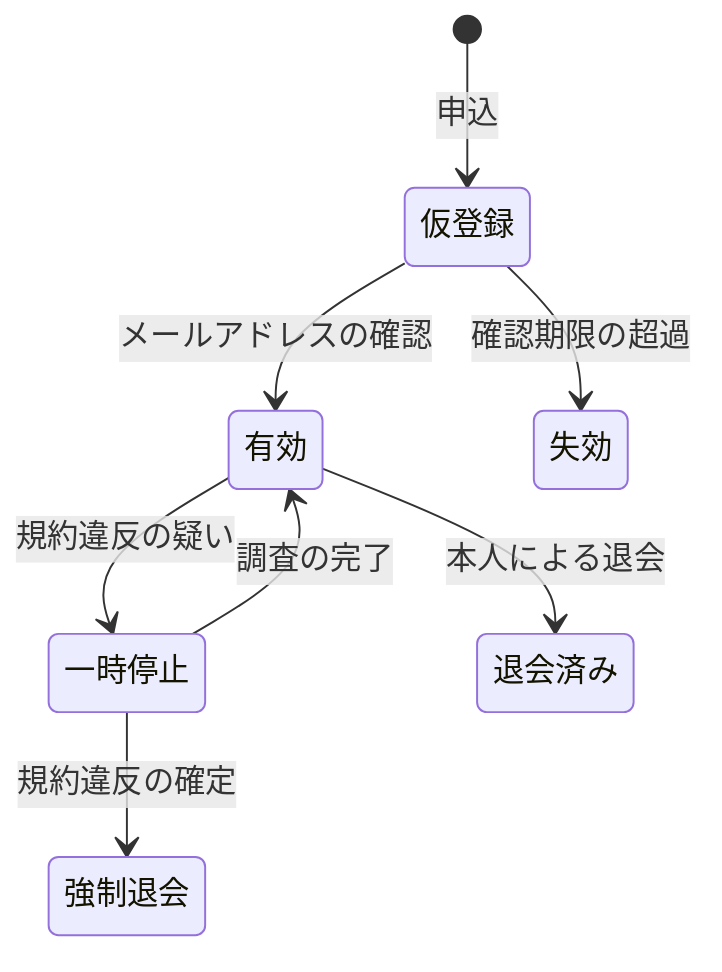
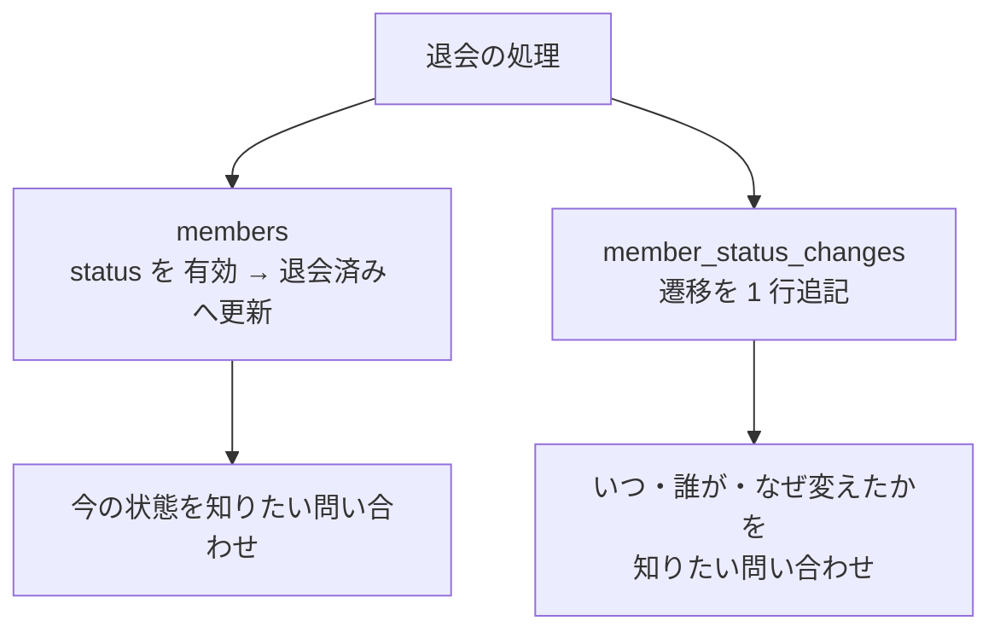
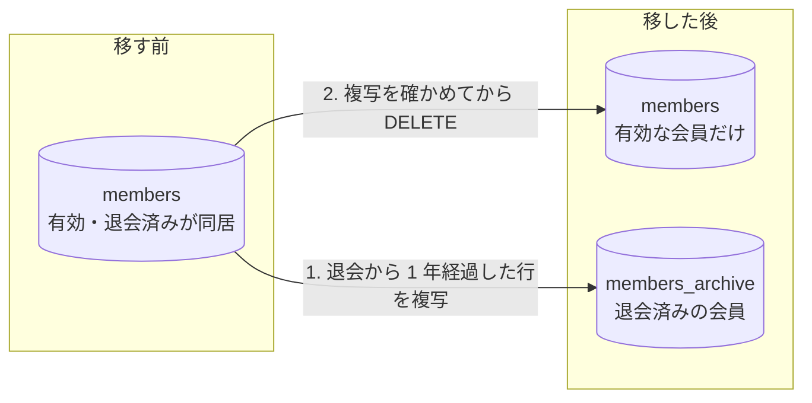

削除フラグとは、行を `DELETE` する代わりに「削除済み」を表す列を立て、通常の問い合わせからその行を除外する設計です。`is_deleted` のような真偽値の列や、`deleted_at` のような日時の列で表し、論理削除（logical delete、soft delete）とも呼ばれます。行そのものを表から取り除く物理削除と対になる語です。

この設計が持ち出される場面の代表は、退会した会員の扱いです。会員の行を `DELETE` で取り除くと、外部キーの設計によっては過去の注文まで消えたり、注文から会員を辿る経路が失われたりします。どちらにしても、問い合わせ対応で「去年の 3 月に何を買ったか」に答えるのが難しくなります。誤った操作を元へ戻したい、監査に備えて記録を残したい、という要望も同じ形で現れます。行を残したまま無い事にする列を 1 つ足せば、これらが一度に片付くように見えます。

本ノートで、説明する範囲も決めておきます。ここでは、RDB（リレーショナルデータベース）の表に削除フラグを置く設計を扱い、分散 DB（データベース）が複製の間で消去を伝えるために置く tombstone のような内部的な印は対象外とします。注文した時点の氏名や住所を残すかどうかも、会員の行を消すかどうかとは別の設計課題なので扱いません。業務の上で使われなくなった行に対して取れる手は、代表的には以下の 5 つの方向で考えられます。



上図の 5 つは排他的な分類ではなく、抽象度も揃っていません。状態を遷移させた行を後からアーカイブへ移す、行を残したまま個人データだけを匿名化する、といった組み合わせが実際には現れます。以降では、削除フラグが何を解決し、代わりに何を持ち込むのかを見た上で、状態の遷移・履歴・アーカイブがそれぞれどの部分を引き受けるのかを整理します。

---

### なぜ行を消さずに残そうとするのか

`DELETE` は行を表から取り除きます。その行を別の表が参照していた場合に何が起きるかは、外部キー制約に付ける指定で決まります。外部キー制約とは、ある表の列の値が、別の表に実在する行を指している事を DB に保証させる仕組みです。会員と注文のように片方が片方を参照している構造では、`DELETE` の影響が 1 つの表に留まりません。

会員の行を消した時に何が起きるかを以下に示します。外部キー制約へ `ON DELETE CASCADE` を指定した場合の例です。



上図の会員 42 は、`orders` の行ごと消えています。`ON DELETE CASCADE` は、親の行を消した時に子の行も消すという指定です。`ON DELETE RESTRICT` へ変えれば注文は守られます。その代わり、注文が 1 件でも残っている会員は消せなくなり、「退会した会員を消す」という操作そのものが成立しません。

`ON DELETE SET NULL` なら、会員を消した上で注文の行も残せます。ただし `orders.member_id` が `NULL` になるので、注文から会員を辿る経路は失われます。どの指定を選んでも、会員の行を消す限り何かは失われます。

消えて困る理由として、代表的には 3 つあります。1 つ目は、上図のように確定していた集計や帳票の値が後から変わる事。2 つ目は、`ON DELETE SET NULL` を指定した場合や外部キー制約を張っていない場合に、注文から会員を辿る経路が切れる事。3 つ目は、誤った操作を元へ戻せない事です。契約・取引・入出金のように、後から「その時点で何が成立していたか」を問われるデータでは、この 3 つが全部効きます。

行を消したくないという要求は、ここまでの理由から見て妥当です。問題になるのは、その要求に対して `is_deleted` という列で答えた時に、消したくない理由が列名のどこにも残らない点にあります。

---

### 削除フラグが問い合わせと制約へ広げる影響

削除フラグを 1 つ置くと、有効な行だけを読みたい全ての問い合わせが、「削除済みを除く」絞り込み条件を必要とします。会員の表へ `deleted_at` を置いた例を以下に示します。以降の SQL は PostgreSQL の構文です。

```sql
CREATE TABLE members (
    id         BIGINT PRIMARY KEY,
    email      TEXT NOT NULL,
    name       TEXT NOT NULL,
    deleted_at TIMESTAMPTZ,
    UNIQUE (email)
);
```

`deleted_at` が `NULL` なら有効、日時が入っていれば削除済み、という約束です。この約束は DDL（Data Definition Language、表や索引を定義する SQL）のどこにも書かれておらず、`members` を読む全てのコードが `WHERE deleted_at IS NULL` を守る事で成り立ちます。守る場所は 1 箇所ではありません。



上図で絞り込み条件を持たないのは `別サービスからの参照` だけです。書き漏れは構文の誤りではないため実行時にエラーにならず、返る行数が多い事も正常な結果と区別が付きません。`JOIN` の先の表にも同じ絞り込み条件が要るので、削除フラグを持つ表が増えるほど守る箇所も増えていきます。

有効な行だけを返すビューを用意する、PostgreSQL の行レベルセキュリティで絞り込み条件を DB へ寄せる、といった方法で書き漏れの余地は狭められます。ただし、その表を触る経路を全部その仕組みへ通す必要があります。管理画面のように退会済みも含めて一覧したい経路は存在するので、絞り込み条件の有無だけを見て、意図して外したのか書き忘れたのかを機械的に判定する事はできません。

制約についても影響が出ます。上の DDL には `UNIQUE (email)` を付けています。この制約は削除済みの行にも掛かります。そのため、一度退会した会員と同じメールアドレスでは新規に登録できません。

| id | email | deleted_at | 登録の可否 |
| --- | --- | --- | --- |
| 42 | taro@example.com | 2026-03-01 10:00 | 退会済みとして残っている |
| 51 | taro@example.com | NULL | `UNIQUE (email)` 違反で入らない |

PostgreSQL や SQLite のように部分索引を持つ製品なら、索引に載せる行を選ぶ条件（predicate）を付けて、その条件を満たす行だけへ一意性を課せます。条件に合う行の間だけで一意性を強制し、合わない行は縛りません。

公式ドキュメントは、部分索引の使い道の 1 つとして[「This enforces uniqueness among the rows that satisfy the index predicate, without constraining those that do not.」と説明しています](https://www.postgresql.org/docs/current/indexes-partial.html)。

表に付けた `UNIQUE (email)` を外し、代わりに次の索引を置きます。

```sql
CREATE UNIQUE INDEX members_email_active_idx
    ON members (email)
    WHERE deleted_at IS NULL;
```

この索引は `deleted_at` が `NULL` の行だけを対象にします。退会済みの行と同じメールアドレスで新規に登録でき、有効な会員どうしで同じアドレスが重複する事は防げます。裏返すと、条件から外れた行は縛られないので、退会済みの行どうしで同じアドレスは何行でも並びます。登録と退会を繰り返した会員の行は、その分だけ積み上がります。

部分索引は全ての製品にあるわけではありません。例えば MySQL は `WHERE` 句を付けて索引を作る構文を持たないため、[式の値を索引する functional key parts](https://dev.mysql.com/doc/refman/8.4/en/create-index.html) で代用します。退会済みなら `NULL` を返す式に一意索引を張ると、`NULL` は一意性の検査から外れるので同じ効果を得られます。索引そのものの構造は [B-Tree](../b-tree/) のノートで扱っています。

外部キー制約も同じ問題を抱えます。通常の外部キーが保証するのは参照先の行が存在する事までで、その行が業務上まだ有効かどうかまでは見ません。`orders` から `members` への外部キーも、`member_id` に対応する行が `members` にある事だけを確かめ、`deleted_at` が `NULL` かどうかは確かめません。

その結果、退会済みの会員に対して新しい注文を作る操作は、この制約では止まりません。DB の制約だけで禁じたい場合は、複合キーやトリガーといった追加の設計が要ります。

---

### 「削除」を業務の状態遷移として書き直す

`is_deleted` や `deleted_at` は、業務の語彙ではありません。和田卓人氏の「[SQL アンチパターン 幻の第 26 章「とりあえず削除フラグ」](https://www.slideshare.net/slideshow/ronsakucasual/52256922)」は、解決策への糸口として ledsun 氏の「[論理削除フラグという名の死亡フラグ](https://ledsun.hatenablog.com/entry/2015/03/27/015203)」から一文を引いています。引かれているのは「私の経験上は、ユーザーから「論理削除」という言葉を聞いたことがありません」で、引用元ではこの後に、退職や売上の打ち消しといった実際に聞く要件が並べられています。

同じ所を指した文章に、Udi Dahan 氏の [Don't Delete – Just Don't](https://udidahan.com/2009/09/01/dont-delete-just-dont/) があります。「don't think about deleting entities. Look for the reason why.」と書き、続けてエンティティが移り変わる状態を理解するよう促しています。ユーザーが削除と呼ぶ操作の裏には、商品の販売終了・注文のキャンセル・従業員の解雇や退職といった、それぞれ違う業務上の意図があるという説明です。

画面のボタンが「削除」でも、業務にはその操作を指す名前が既にあります。対応の例を以下に挙げます。

| 画面での操作 | 業務での呼び名 | 遷移後の状態 |
| --- | --- | --- |
| 会員の削除 | 退会 | 退会済み |
| 商品の削除 | 販売終了 | 販売終了 |
| 注文の削除 | キャンセル | キャンセル済み |
| 投稿の削除 | 公開の取り下げ | 公開停止 |

呼び名が決まると、その状態から次にどこへ動けるのかも決まります。会員を例に取った遷移を以下に示します。



上図では、退会済み・強制退会・失効が別々の状態として並んでいます。削除フラグを使うと、この 3 つが `is_deleted = 1` という 1 つの値になります。状態を列で持てば、再入会を認めるかどうか、返金の対象になるかどうかを状態ごとに決められます。

表としては、`members` から `deleted_at` を落とし、代わりに `status TEXT NOT NULL` のような列を置く形になります。取り得る値を `CHECK` 制約で列挙すれば、想定外の文字列は入りません。ただし `CHECK` が縛れるのは値の集合だけです。上図に矢印の無い遷移（退会済みから一時停止へ戻す等）まで禁じるなら、アプリケーションで検査するか、トリガーなど別の仕組みが要ります。

和田卓人氏の資料はまとめで「全てのテーブルに削除フラグはおかしい」「状態遷移で考えるほうがマシ」と書いています。表ごとに、そこにある行が業務上どう終わるのかは違います。全ての表へ同じ列を機械的に足す設計は、その違いを 1 つの真偽値へ畳んでしまうと考えられます。

---

### 状態の列に残らない履歴を別の表へ記録する

状態を列で持つ設計にも、削除フラグと共通する限界があります。`status` を `UPDATE` で書き換えると、書き換える前の値はその列に残りません。「いつ退会したのか」「一度退会してから再入会したのか」に、現在の状態を持つ列だけでは答えられません。

状態を書き換える前の値が製品側に残る仕組みもあります。SQL Server の temporal table や MariaDB のシステムバージョニングは、`UPDATE` の前の値を自動で保持します。そうした仕組みを使わない場合、遷移そのものを残すには、遷移を 1 行として追記する表を別に置きます。以下は PostgreSQL の構文で書いた例です。

```sql
CREATE TABLE member_status_changes (
    id          BIGSERIAL PRIMARY KEY,
    member_id   BIGINT NOT NULL REFERENCES members (id),
    from_status TEXT,
    to_status   TEXT NOT NULL,
    reason      TEXT,
    changed_by  BIGINT,
    changed_at  TIMESTAMPTZ NOT NULL DEFAULT now()
);
```

この表は追記だけを行う運用にします。DDL は書き換えを禁止しないので、追記だけに保ちたいなら、`UPDATE` と `DELETE` の権限をアプリケーションの利用者から外すといった手当てが別に要ります。1 回の退会処理が何を書くのかを以下に示します。



上図の `members` への更新と `member_status_changes` への追記は、同じトランザクション（複数の書き込みをまとめて、成功か失敗かのどちらかにする単位）で行います。片方だけが成功すると、現在の状態と遷移の記録が食い違ったまま残るためです。

なお `now()` はトランザクションの開始時刻を返すので、1 回の処理で複数行を追記すると `changed_at` が同じ値になります。同一トランザクションの中の変更順序まで記録する必要があるなら、`sequence_no` のような順序を明示する値を別に持たせます。

トランザクションが揃えるのは、2 つの書き込みが両方成功するか両方失敗するかだけです。履歴が正しい遷移の並びになる事までは保証しません。同じ会員を 2 つの処理が同時に遷移させると、両方が `有効` を読んで別々の遷移を追記し、辻褄の合わない並びが残ります。`SELECT ... FOR UPDATE` での行ロックのように、遷移を直列化する手当てが別に要ります。

現在の状態を保存せず、遷移の記録だけから状態を毎回組み立てる方式が [Event Sourcing](../../software-architecture/event-sourcing/) です。ここで挙げた履歴テーブルは現在の状態を `members` に残しているので、Event Sourcing とは別の設計になります。追記する 1 行を業務の出来事として名前を付けて扱う考え方は [Domain Event](../../software-architecture/domain-event/) で整理しています。

---

### 使わなくなった行をアーカイブへ移す

状態の列を足しても、現行の表から行が減るわけではありません。退会済みの会員が 10 年分積み上がった表は、有効な会員だけを読む問い合わせにとって余分な行を抱えた状態になります。アーカイブは、その行を現行の表から取り除いて別の場所へ移す方法です。

移す前と移した後の構成を以下に示します。



上図の移送は、複写してから消すという順序で行います。物理削除だけを行う場合と違い、退会済みの会員の行は `members_archive` に残るので、過去の注文からその会員を参照する経路を残せます。ただし、保持期間を置いている間は退会済みの行が `members` に残ります。絞り込み条件が不要になるわけではなく、守る対象が直近 1 年に退会した会員だけへ縮む、という効果です。退会と同時に移す設計にすれば、`members` から絞り込み条件そのものを外せます。

移す時に決める事が 2 つあります。1 つ目は移す条件で、退会から 1 年といった保持期間を業務の要件として決めます。2 つ目は参照の扱いです。`orders` から `members` への外部キーが張られている場合、親の行を消す `DELETE` はその制約で止まります。

止まらないようにする手は 3 つあります。子の行も同時にアーカイブへ移す、`orders` に会員名などの必要な値を複写しておいて外部キーを外す、参照先を `members_archive` へ張り替える、のいずれかです。どれを選ぶかは、移送先を同じ DB の別の表にするか、集計用の別の保管先にするかでも変わります。

移送先が同じ DB の別の表なら、複写と `DELETE` を 1 つのトランザクションにまとめられます。別の DB や別の保管先へ移す場合は 1 つのトランザクションで括れない事があるので、複写だけが済んで `DELETE` が失敗した状態を想定し、途中から再実行できる手順にしておきます。

---

### 消去そのものが要件になる場合

ここまでは、行を残す前提で書いてきました。残せない場合もあります。個人データの消去を求められた時が、その代表です。GDPR（General Data Protection Regulation、EU 一般データ保護規則）の第 17 条は、消去権（right to erasure）を定めています。

同条の第 1 項は、[「The data subject shall have the right to obtain from the controller the erasure of personal data concerning him or her without undue delay」と書いています](https://gdpr-info.eu/art-17-gdpr/)。データ主体は、自分に関する個人データの消去を不当な遅滞なく行うよう管理者へ求められる、という内容です。

この権利は無条件ではありません。引用した一文は `where one of the following grounds applies` と続き、収集の目的が達成された場合や同意が撤回された場合など、(a) から (f) の発動事由が並びます。第 3 項にも例外があり、法的義務の遵守や、法的請求の主張・行使・防御に必要な場合が挙がっています。何をどこまで消すのかの判断は法務の領域にあり、設計側が決めるのは、消すと決まった時に消せる構造を持っているかどうかだけだと考えられます。

削除フラグは、行を残したまま見えなくする設計です。消去の要求に対しては、`deleted_at` へ日時を入れても要件を満たしません。消去の経路を作るなら、対象の表だけでなく、バックアップ・ログ・派生した集計表・検索エンジンへ取り込んだ複製まで含めて、どこに何が残るのかを洗い出す事になります。

消去の対象は個人データであって、行そのものではありません。要件を満たす形で不可逆に匿名化できる場合は、行や取引の記録を残しながら、識別可能な個人データを取り除く設計も選択肢になります。どこまで匿名化すれば足りるのかは、扱うデータと法的な要件によって変わります。

注意点として、削除フラグを最初の選択肢として置いた設計ほど、消去の経路を持たないまま運用が始まります。全ての表へ機械的に列を足す設計は、消せる仕組みではなく、消したように見せる仕組みだけを増やすためです。

---

### 利点

以下は、導入の手数の少なさを優先した結果として得られる性質です。

- 既存の表へ列を 1 つ追加するだけで導入できる
- 行そのものは、列の値を戻す事で復元しやすい
- 参照先の行が残るため、外部キー制約を壊さずに済む
- `ON DELETE CASCADE` などによって、子の行まで物理的に消える事を避けられる

---

### 欠点

以下は、業務上の意味を 1 つの列へ畳んだ結果として現れる制約です。

- 有効な行だけを読みたい全ての問い合わせに、削除済みを除く絞り込み条件が要る
- 絞り込み条件の書き漏れがエラーにならず、結果に混ざった時点では気付けない
- 一意制約が削除済みの行にも掛かり、同じ値での再登録を妨げる
- 素直に書いた外部キー制約では、削除済みの親を参照する子の作成を止められない
- 退会・強制退会・失効という違う終わり方が、同じ値になる
- 個人データの消去を求められた時に、列を書き換えるだけでは要件を満たせない

---

### 削除フラグが妥当になりやすいケース

- 状態が有効と無効の 2 つしかなく、業務にもその 2 つ以外の呼び名が無い場合
- 行を読む経路が 1 つのアプリケーションに閉じていて、絞り込み条件の抜けを検査できる場合
- 消した行を短い期間だけ戻せれば良く、長期の履歴が要らない場合
- 設定値やタグのような、業務上の状態遷移を持たないデータを扱う場合

いずれの場合も、列名を業務の語へ寄せておくと、後から状態を増やす時の判断が楽になります。`is_deleted` ではなく `canceled_at` や `retired_at` と書けば、その表の行がどう終わるのかが名前から読み取れます。削除フラグを避けるかどうかより、その表の行が業務上どう終わるのかを先に決める事の方が、設計の判断としては手前にあります。
