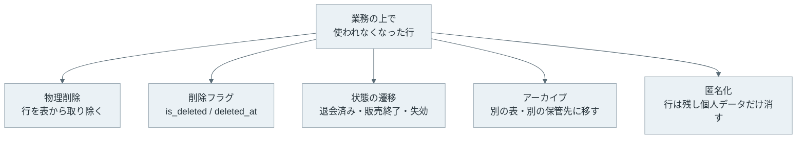
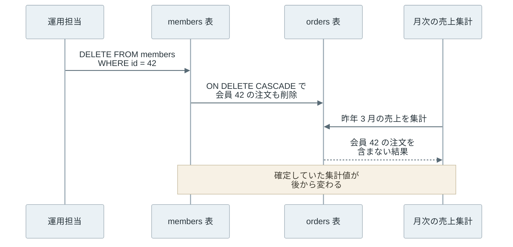
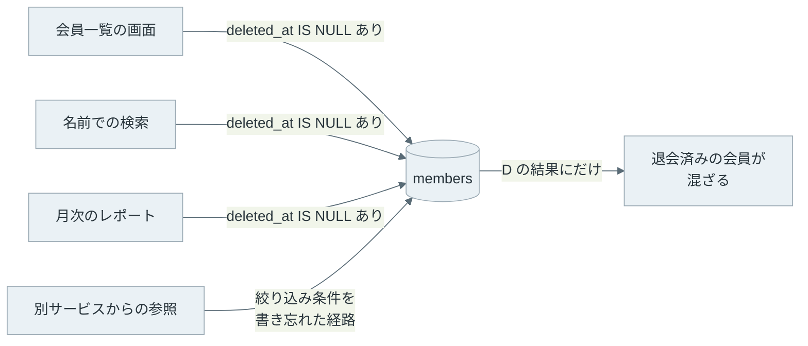
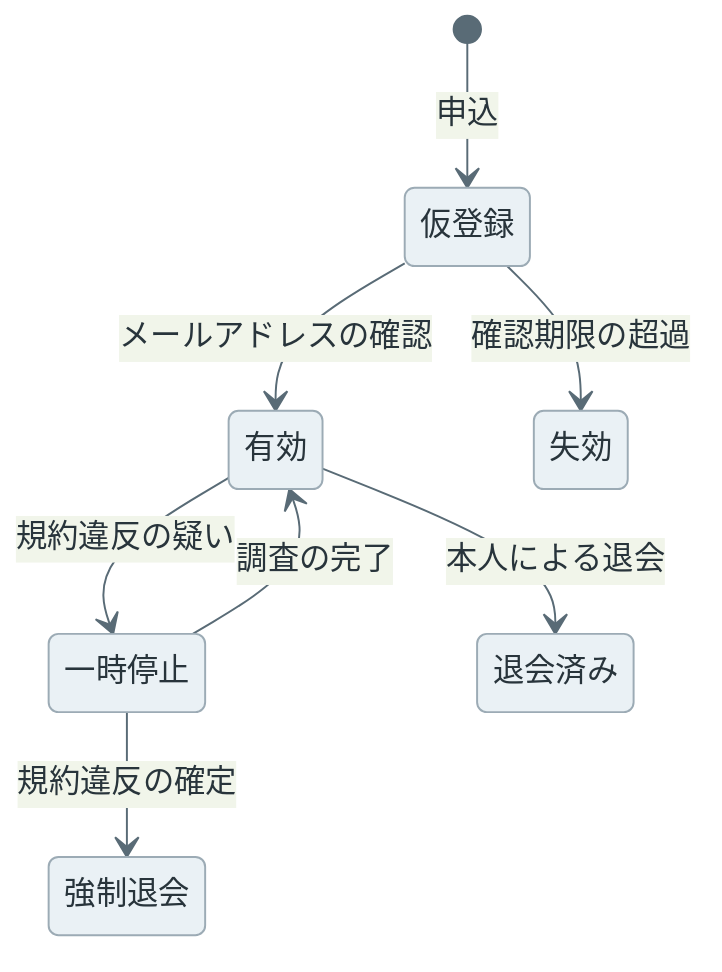
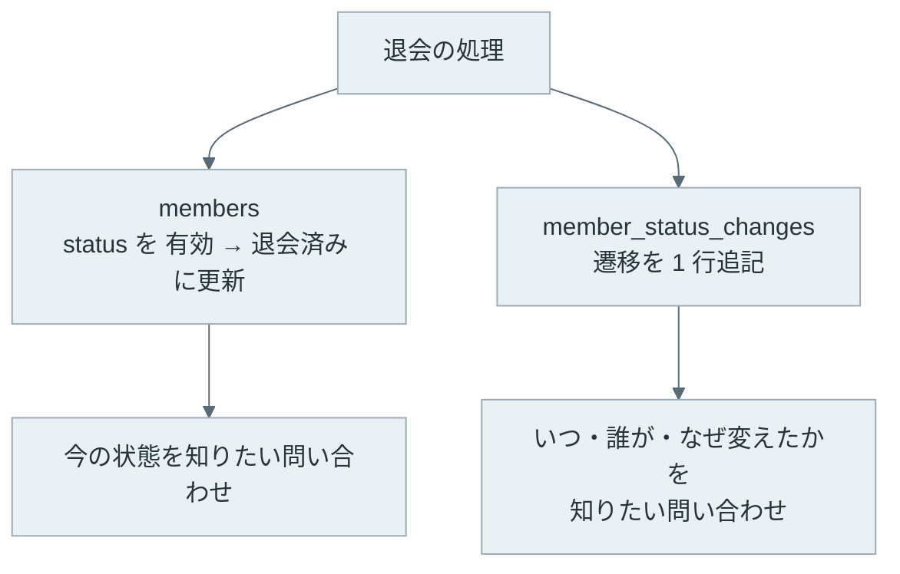
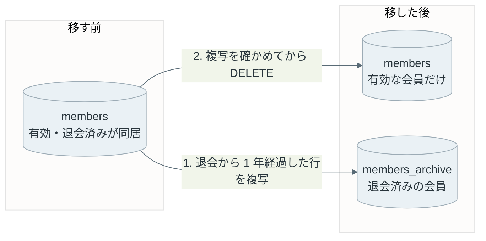
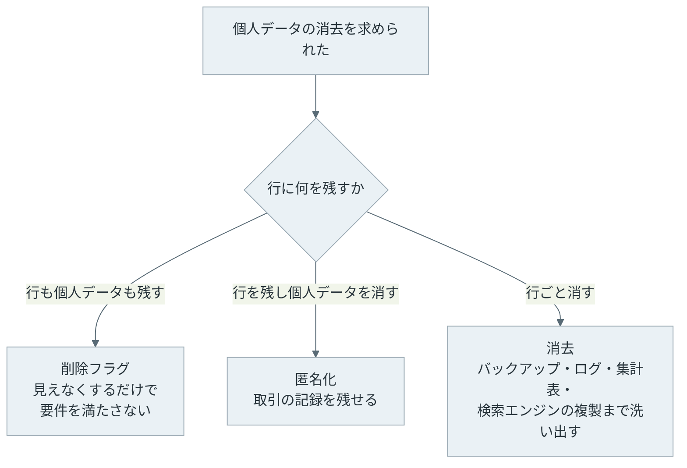

削除フラグとは、行を `DELETE` する代わりに「削除済み」を表す列を足し、通常の問い合わせからその行を除外する設計です。`is_deleted` のような真偽値の列や、`deleted_at` のような日時の列で表し、論理削除（logical delete、soft delete）とも呼ばれます。行そのものを表から取り除く物理削除と対になる語です。

この設計が持ち出される場面の代表は、退会した会員の扱いです。会員の行を `DELETE` で取り除くと、注文が会員を参照する外部キー（参照先の行が実在することを保証する制約）の設計によっては過去の注文まで消えたり、注文から会員を辿る経路が失われたりします。どちらでも、問い合わせ対応で「去年の 3 月に何を買ったか」に答えるのが難しくなります。誤った操作を元に戻したい、監査に備えて記録を残したい、という要望も同じ形で現れます。行を残したまま無いことにする列を 1 つ足せば、これらが一度に片付くように見えます。

業務の上で使われなくなった行の扱い方には、主に以下の 5 つがあります。


```mermaid
%%{init: {"theme":"base","themeVariables":{"primaryColor":"#eaf1f5","primaryTextColor":"#28343b","primaryBorderColor":"#9cabb5","lineColor":"#596b76","textColor":"#28343b","actorBkg":"#eaf1f5","actorBorder":"#9cabb5","actorTextColor":"#28343b","actorLineColor":"#9cabb5","signalColor":"#596b76","signalTextColor":"#28343b","noteBkgColor":"#f7f1e5","noteBorderColor":"#c5b99b","noteTextColor":"#403c32","activationBkgColor":"#edf3ef","activationBorderColor":"#9aafa1"}}}%%
flowchart TD
    S["業務の上で<br/>使われなくなった行"] --> A["物理削除<br/>行を表から取り除く"]
    S --> B["削除フラグ<br/>is_deleted / deleted_at"]
    S --> C["状態の遷移<br/>退会済み・販売終了・失効"]
    S --> D["アーカイブ<br/>別の表・別の保管先に移す"]
    S --> E["匿名化<br/>行は残し個人データだけ消す"]
    classDef default fill:#eaf1f5,stroke:#9cabb5,color:#28343b;
```

実際の設計では、5 つのどれか 1 つを選ぶより組み合わせる方が普通です。状態を遷移させた行を後からアーカイブに移す、行を残したまま個人データだけを匿名化する、といった具合です。

本記事では、RDB（リレーショナルデータベース）の表に削除フラグを置く設計を説明します。行を残したい理由から始めて、次の疑問に答えていきます。

- なぜ行を消さずに残そうとするのか。
- バックアップから戻せる削除でも、なぜ行を残す仕組みが求められるのか。
- 削除フラグは、問い合わせと制約にどんな影響を及ぼすのか。
- 削除フラグに求めていた役割のうち、状態の遷移・履歴の表・アーカイブはそれぞれどれを引き受けるのか。
- 個人データの消去を求められた時、残した行をどう扱うのか。
- 削除フラグが妥当になりやすいのは、どんな場合なのか。

分散 DB（データベース）が複製の間で消去を伝えるために置く tombstone のような内部的な印には触れません。注文した時点の氏名や住所を残すかどうかも、会員の行を消すかどうかとは別の設計課題なので扱いません。

---

### 行を消さずに残そうとする理由

`DELETE` は行を表から取り除きます。その行を別の表が参照していた場合に何が起きるかは、外部キー制約に付ける `ON DELETE` の指定で決まります。会員と注文のように一方が他方を参照している構造では、`DELETE` の影響が 1 つの表に留まりません。

会員の行を消した時に何が起きるかを以下に示します。外部キー制約に `ON DELETE CASCADE` を指定した場合の例です。


```mermaid
%%{init: {"theme":"base","themeVariables":{"primaryColor":"#eaf1f5","primaryTextColor":"#28343b","primaryBorderColor":"#9cabb5","lineColor":"#596b76","textColor":"#28343b","actorBkg":"#eaf1f5","actorBorder":"#9cabb5","actorTextColor":"#28343b","actorLineColor":"#9cabb5","signalColor":"#596b76","signalTextColor":"#28343b","noteBkgColor":"#f7f1e5","noteBorderColor":"#c5b99b","noteTextColor":"#403c32","activationBkgColor":"#edf3ef","activationBorderColor":"#9aafa1"}}}%%
sequenceDiagram
    participant OP as 運用担当
    participant M as members 表
    participant O as orders 表
    participant R as 月次の売上集計
    OP->>M: DELETE FROM members<br/>WHERE id = 42
    M->>O: ON DELETE CASCADE で<br/>会員 42 の注文も削除
    R->>O: 昨年 3 月の売上を集計
    O-->>R: 会員 42 の注文を<br/>含まない結果
    Note over M,R: 確定していた集計値が<br/>後から変わる
```

`ON DELETE` の指定を変えると何が守られ、何が失われるのかを整理すると、以下の通りです。

| `ON DELETE` の指定 | 会員を消した時の注文 | 失うもの |
| --- | --- | --- |
| `CASCADE` | 一緒に消える | 過去の注文 |
| `RESTRICT` | 残る | 「退会した会員を消す」操作が成立しない |
| `SET NULL` | 残る（`member_id` は `NULL`） | 注文から会員を辿る経路 |

どの指定を選んでも、会員の行を消す限り何かは失われます。消えて困る理由は、代表的には 3 つあります。

- 上記の図のように、確定していた集計や帳票の値が後から変わる
- `ON DELETE SET NULL` を選んだ場合や外部キー制約が無い場合に、注文から会員を辿る経路が切れる
- 誤った操作を元に戻せない

契約・取引・入出金のように、後から「その時点で何が成立していたか」を問われるデータでは、この 3 つが全部当てはまります。

3 つ目は、バックアップがあっても軽くは済みません。表の行ではなく顧客の環境ごとの削除ですが、大きな規模では 2022 年 4 月 5 日に起きました。Atlassian（Jira や Confluence を提供する企業）は、古いアプリを顧客のサイト（顧客ごとのクラウド環境）から消す保守作業で ID を取り違え、サイト全体の ID を削除の API に渡しました。この API はどちらの ID も受け付けて入力を正しいと見なす作りだったので、775 の顧客の 883 サイトがその場で削除されました。

失われたデータは削除前の 5 分以内に留まりましたが、バックアップからサイトを大量に戻す手順が無く、一部の顧客では[復旧に最長 14 日](https://www.atlassian.com/engineering/post-incident-review-april-2022-outage)掛かりました。Atlassian が再発防止の 1 つ目に挙げたのは、保持期間が過ぎるまで本番環境からデータを消さない方針と、無効化（deactivation）を経た後にだけ削除を許す確認を設ける計画でした。Atlassian はこれを soft delete と呼んでいますが、挙げられた中身は列 1 つの削除フラグではなく、後の節で扱う状態の遷移と保持期間に近いものです。

行を消したくないという要求は、ここまでの理由から見て妥当です。問題は、その要求に `is_deleted` という 1 列で答えると、問い合わせ・制約・業務の意味のそれぞれに影響が及ぶ点です。

---

### 削除フラグが問い合わせと制約に及ぼす影響

削除フラグを 1 つ置くと、有効な行だけを読みたい全ての問い合わせが、「削除済みを除く」絞り込み条件を必要とします。以下は、会員の表に `deleted_at` を置いた例です。以降の SQL は PostgreSQL の構文です。

```sql
CREATE TABLE members (
    id         BIGINT PRIMARY KEY,
    email      TEXT NOT NULL,
    name       TEXT NOT NULL,
    deleted_at TIMESTAMPTZ,
    UNIQUE (email)
);
```

`deleted_at` が `NULL` なら有効、日時が入っていれば削除済み、という約束です。この約束は DDL（Data Definition Language、表や索引を定義する SQL）のどこにも書かれておらず、`members` を読む全てのコードが `WHERE deleted_at IS NULL` を守ることで成り立ちます。


```mermaid
%%{init: {"theme":"base","themeVariables":{"primaryColor":"#eaf1f5","primaryTextColor":"#28343b","primaryBorderColor":"#9cabb5","lineColor":"#596b76","textColor":"#28343b","actorBkg":"#eaf1f5","actorBorder":"#9cabb5","actorTextColor":"#28343b","actorLineColor":"#9cabb5","signalColor":"#596b76","signalTextColor":"#28343b","noteBkgColor":"#f7f1e5","noteBorderColor":"#c5b99b","noteTextColor":"#403c32","activationBkgColor":"#edf3ef","activationBorderColor":"#9aafa1"}}}%%
flowchart LR
    A["会員一覧の画面"] -->|"deleted_at IS NULL あり"| M[(members)]
    B["名前での検索"] -->|"deleted_at IS NULL あり"| M
    C["月次のレポート"] -->|"deleted_at IS NULL あり"| M
    D["別サービスからの参照"] -->|"絞り込み条件を<br/>書き忘れた経路"| M
    M -->|"D の結果にだけ"| X["退会済みの会員が<br/>混ざる"]
    classDef default fill:#eaf1f5,stroke:#9cabb5,color:#28343b;
```

書き漏れは構文の誤りではないため実行時にエラーにならず、返る行数が多いことも正常な結果と区別が付きません。`JOIN` の先の表にも同じ絞り込み条件が必要なので、削除フラグを持つ表が増えるほど守る箇所も増えていきます。

有効な行だけを返すビューを用意する、PostgreSQL の行レベルセキュリティ（読める行の条件を DB に設定する機能）で絞り込み条件を DB に寄せる、といった方法で書き漏れの余地は狭められます。ただし、その表を触る経路を全部その仕組みに通す必要があります。退会済みも含めて一覧したい管理画面のような経路もあるので、絞り込み条件が無いことだけでは書き忘れと判定できません。

制約についても影響が出ます。上記の DDL の `UNIQUE (email)` は削除済みの行にも掛かるので、一度退会した会員と同じメールアドレスでは新規に登録できません。

| id | email | deleted_at | 登録の可否 |
| --- | --- | --- | --- |
| 42 | taro@example.com | 2026-03-01 10:00 | 退会済みとして残っている |
| 51 | taro@example.com | NULL | `UNIQUE (email)` 違反で入らない |

PostgreSQL や SQLite のように[部分索引](https://www.postgresql.org/docs/current/indexes-partial.html)を持つ DBMS（Database Management System）なら、索引に載せる行を選ぶ条件（predicate）を付けて、その条件を満たす行だけに一意性を課せます。

表に付けた `UNIQUE (email)` を外し、代わりに次の索引を置きます。

```sql
CREATE UNIQUE INDEX members_email_active_idx
    ON members (email)
    WHERE deleted_at IS NULL;
```

この索引は `deleted_at` が `NULL` の行だけを対象にします。退会済みの行と同じメールアドレスで新規に登録でき、有効な会員どうしで同じアドレスが重複することは防げます。裏返すと、条件から外れた行は縛られないので、退会済みの行どうしで同じアドレスは何行でも並びます。

部分索引は全ての DBMS にあるわけではありません。例えば MySQL は `WHERE` 句を付けて索引を作る構文を持たないため、[式の値に索引を張る functional key parts](https://dev.mysql.com/doc/refman/8.4/en/create-index.html) で代用します。退会済みなら `NULL` を返す式に一意索引を張ると、`NULL` は一意性の検査から外れるので同じ効果を得られます。索引の構造は [B-Tree](../b-tree/) のノートで扱っています。

外部キー制約も同じ問題を抱えます。通常の外部キーが保証するのは参照先の行が存在することまでで、`deleted_at` が `NULL` かどうかまでは見ません。

その結果、退会済みの会員に対して新しい注文を作る操作は、この制約では止まりません。DB の制約だけで禁じたい場合は、会員の状態まで含めた複合キーで参照する、行の追加時に DB が自動で実行する処理（トリガー）で検査する、といった追加の設計が必要です。

---

### 「削除」から業務の状態遷移への書き直し

`is_deleted` や `deleted_at` は、業務の語彙ではありません。ユーザーが「削除」と呼ぶ操作の裏には、退会・販売終了・キャンセルのような別々の業務上の意図があります。和田卓人氏の「[SQL アンチパターン 幻の第 26 章「とりあえず削除フラグ」](https://www.slideshare.net/slideshow/ronsakucasual/52256922)」は、解決策への糸口として ledsun 氏の「[論理削除フラグという名の死亡フラグ](https://ledsun.hatenablog.com/entry/2015/03/27/015203)」から「私の経験上は、ユーザーから「論理削除」という言葉を聞いたことがありません」という一文を引いています。引用元ではこの後に、退職や売上の打ち消しといった実際に聞く要件が並べられています。

同じ点を指摘した文章に、Udi Dahan 氏の [Don't Delete – Just Don't](https://udidahan.com/2009/09/01/dont-delete-just-dont/) があります。「don't think about deleting entities. Look for the reason why.」（エンティティを削除することを考えるのではなく、その理由を探しなさい）と書き、続けてエンティティが移り変わる状態を理解するよう促しています。

画面のボタンが「削除」でも、業務にはその操作を指す名前が既にあります。対応の例を以下に挙げます。

| 画面での操作 | 業務での呼び名 | 遷移後の状態 |
| --- | --- | --- |
| 会員の削除 | 退会 | 退会済み |
| 商品の削除 | 販売終了 | 販売終了 |
| 注文の削除 | キャンセル | キャンセル済み |
| 投稿の削除 | 公開の取り下げ | 公開停止 |

呼び名が決まると、その状態から次にどこに動けるのかも決まります。例えば、会員の遷移は次のようになります。


```mermaid
%%{init: {"theme":"base","themeVariables":{"primaryColor":"#eaf1f5","primaryTextColor":"#28343b","primaryBorderColor":"#9cabb5","lineColor":"#596b76","textColor":"#28343b","actorBkg":"#eaf1f5","actorBorder":"#9cabb5","actorTextColor":"#28343b","actorLineColor":"#9cabb5","signalColor":"#596b76","signalTextColor":"#28343b","noteBkgColor":"#f7f1e5","noteBorderColor":"#c5b99b","noteTextColor":"#403c32","activationBkgColor":"#edf3ef","activationBorderColor":"#9aafa1"}}}%%
stateDiagram-v2
    [*] --> 仮登録: 申込
    仮登録 --> 有効: メールアドレスの確認
    仮登録 --> 失効: 確認期限の超過
    有効 --> 一時停止: 規約違反の疑い
    一時停止 --> 有効: 調査の完了
    有効 --> 退会済み: 本人による退会
    一時停止 --> 強制退会: 規約違反の確定
```

上記の図では、退会済み・強制退会・失効が別々の状態として並んでいます。削除フラグを使うと、この 3 つが `is_deleted = 1` という 1 つの値になります。状態を列で持てば、再入会を認めるかどうか、返金の対象になるかどうかを状態ごとに決められます。

表としては、`members` から `deleted_at` を落とし、代わりに `status TEXT NOT NULL` のような列を置く形になります。取り得る値を `CHECK` 制約で列挙すれば、想定外の文字列は入りません。ただし `CHECK` が縛れるのは値の集合だけです。上記の図に矢印の無い遷移（退会済みから一時停止に戻す等）まで禁じるなら、アプリケーションで検査するか、トリガーなど別の仕組みが必要です。

表ごとに、そこにある行が業務上どう終わるのかは違います。全ての表に同じ列を機械的に足す設計は、その違いを 1 つの真偽値に畳んでしまいます。

---

### 状態の列に残らない履歴を記録する別の表

状態を列で持つ設計にも、削除フラグと共通する限界があります。`status` を `UPDATE` で書き換えると、書き換える前の値はその列に残りません。「いつ退会したのか」「一度退会してから再入会したのか」に、現在の状態を持つ列だけでは答えられません。

状態を書き換える前の値が DBMS 側に残る仕組みもあります。SQL Server の temporal table や MariaDB のシステムバージョニングは、`UPDATE` の前の値を自動で保持します。そうした仕組みを使わない場合、遷移を残すには、遷移を 1 行として追記する表を別に置きます。以下は PostgreSQL の構文で書いた例です。

```sql
CREATE TABLE member_status_changes (
    id          BIGSERIAL PRIMARY KEY,
    member_id   BIGINT NOT NULL REFERENCES members (id),
    from_status TEXT,
    to_status   TEXT NOT NULL,
    reason      TEXT,
    changed_by  BIGINT,
    changed_at  TIMESTAMPTZ NOT NULL DEFAULT now()
);
```

DDL は書き換えを禁止しないので、この表を追記だけに保つには、`UPDATE` と `DELETE` の権限をアプリケーションの利用者から外すといった手当てが別に必要です。1 回の退会処理が書き込む先を以下の図に示します。


```mermaid
%%{init: {"theme":"base","themeVariables":{"primaryColor":"#eaf1f5","primaryTextColor":"#28343b","primaryBorderColor":"#9cabb5","lineColor":"#596b76","textColor":"#28343b","actorBkg":"#eaf1f5","actorBorder":"#9cabb5","actorTextColor":"#28343b","actorLineColor":"#9cabb5","signalColor":"#596b76","signalTextColor":"#28343b","noteBkgColor":"#f7f1e5","noteBorderColor":"#c5b99b","noteTextColor":"#403c32","activationBkgColor":"#edf3ef","activationBorderColor":"#9aafa1"}}}%%
flowchart TB
    U["退会の処理"] --> M["members<br/>status を 有効 → 退会済み に更新"]
    U --> H["member_status_changes<br/>遷移を 1 行追記"]
    M --> Q1["今の状態を知りたい問い合わせ"]
    H --> Q2["いつ・誰が・なぜ変えたかを<br/>知りたい問い合わせ"]
    classDef default fill:#eaf1f5,stroke:#9cabb5,color:#28343b;
```

上記の図の `members` への更新と `member_status_changes` への追記は、同じトランザクション（複数の書き込みをまとめて、成功か失敗かのどちらかにする単位）で行います。片方だけが成功すると、現在の状態と遷移の記録が食い違ったまま残るからです。

トランザクションが揃えるのは、2 つの書き込みが両方成功するか両方失敗するかだけです。履歴が正しい遷移の並びになることまでは保証しません。同じ会員を 2 つの処理が同時に遷移させると、両方が `有効` を読んで別々の遷移を追記し、辻褄の合わない並びが残ります。同じ会員の遷移を 1 本ずつ順に処理させる手当てが別に必要です。例えば `SELECT ... FOR UPDATE` で会員の行をロックすると、後から来た処理は先の処理の確定を待ちます。

現在の状態を保存せず、遷移の記録だけから状態を毎回組み立てる方式が [Event Sourcing](../../software-architecture/event-sourcing/) です。ここで挙げた履歴テーブルは現在の状態を `members` に残しているので、Event Sourcing とは別の設計になります。追記する 1 行を業務の出来事として名前を付けて扱う考え方は [Domain Event](../../software-architecture/domain-event/) で整理しています。

---

### 使わなくなった行のアーカイブへの移動

状態の列を足しても、現行の表から行が減るわけではありません。退会済みの会員が 10 年分積み上がった表は、有効な会員だけを読む問い合わせにとって余分な行を抱えた状態になります。アーカイブは、その行を現行の表から取り除いて別の場所に移す方法です。

以下は、移す前と移した後の構成です。


```mermaid
%%{init: {"theme":"base","themeVariables":{"primaryColor":"#eaf1f5","primaryTextColor":"#28343b","primaryBorderColor":"#9cabb5","lineColor":"#596b76","textColor":"#28343b","actorBkg":"#eaf1f5","actorBorder":"#9cabb5","actorTextColor":"#28343b","actorLineColor":"#9cabb5","signalColor":"#596b76","signalTextColor":"#28343b","noteBkgColor":"#f7f1e5","noteBorderColor":"#c5b99b","noteTextColor":"#403c32","activationBkgColor":"#edf3ef","activationBorderColor":"#9aafa1"}}}%%
flowchart LR
    subgraph before["移す前"]
        M1[(members<br/>有効・退会済みが同居)]
    end
    subgraph after["移した後"]
        M2[(members<br/>有効な会員だけ)]
        AR[(members_archive<br/>退会済みの会員)]
    end
    M1 -->|"1. 退会から 1 年経過した行を複写"| AR
    M1 -->|"2. 複写を確かめてから DELETE"| M2
    classDef default fill:#eaf1f5,stroke:#9cabb5,color:#28343b;
```

上記の図の移送は、複写してから消すという順序で行います。退会済みの会員の行は `members_archive` に残るので、過去の注文からその会員を参照する経路を残せます。ただし、保持期間を置いている間は退会済みの行が `members` に残ります。`status = '有効'` の絞り込み条件は残りますが、除く対象が直近 1 年に退会した会員だけに減ります。退会と同時に移す設計にすれば、`members` から絞り込み条件を外せます。

移す時に決めることが 2 つあります。1 つ目は移す条件で、退会から 1 年といった保持期間を業務の要件として決めます。2 つ目は参照の扱いです。`orders` から `members` への外部キーが `RESTRICT` や既定の `NO ACTION` なら、親の行を消す `DELETE` はその制約で止まり、`CASCADE` なら注文まで消えます。

注文を残したまま親の行を移す手は 3 つあります。

- 子の行も同時にアーカイブに移す
- `orders` に会員名などの必要な値を複写しておいて外部キーを外す
- 参照先を `members_archive` に張り替える

移送先が同じ DB の別の表なら、複写と `DELETE` を 1 つのトランザクションにまとめられます。別の DB や別の保管先に移す場合は 1 つのトランザクションで括れないことがあるので、複写だけが済んで `DELETE` が失敗した状態を想定し、途中から再実行できる手順にしておきます。

---

### 消去が要件になる場合

行を残せない場合もあります。個人データの消去を求められた時が、その代表です。GDPR（General Data Protection Regulation、EU 一般データ保護規則）の第 17 条は、消去権（right to erasure）を定めています。

同条の第 1 項には、「[The data subject shall have the right to obtain from the controller the erasure of personal data concerning him or her without undue delay](https://gdpr-info.eu/art-17-gdpr/)」（データ主体は、自分に関する個人データの消去を不当な遅滞なく行うよう管理者に求める権利を持つ）とあります。

この権利は無条件ではありません。引用した一文は `where one of the following grounds applies` と続き、収集の目的が達成された場合や同意が撤回された場合など、(a) から (f) の発動事由が並びます。第 3 項にも例外があり、法的義務の遵守や、法的請求の主張・行使・防御に必要な場合が挙がっています。

消去の対象は個人データであって、行そのものではありません。行に何を残すかで、取れる手が分かれます。


```mermaid
%%{init: {"theme":"base","themeVariables":{"primaryColor":"#eaf1f5","primaryTextColor":"#28343b","primaryBorderColor":"#9cabb5","lineColor":"#596b76","textColor":"#28343b","actorBkg":"#eaf1f5","actorBorder":"#9cabb5","actorTextColor":"#28343b","actorLineColor":"#9cabb5","signalColor":"#596b76","signalTextColor":"#28343b","noteBkgColor":"#f7f1e5","noteBorderColor":"#c5b99b","noteTextColor":"#403c32","activationBkgColor":"#edf3ef","activationBorderColor":"#9aafa1"}}}%%
flowchart TB
    R["個人データの消去を求められた"] --> D{"行に何を残すか"}
    D -->|"行も個人データも残す"| F["削除フラグ<br/>見えなくするだけで<br/>要件を満たさない"]
    D -->|"行を残し個人データを消す"| A["匿名化<br/>取引の記録を残せる"]
    D -->|"行ごと消す"| E["消去<br/>バックアップ・ログ・集計表・<br/>検索エンジンの複製まで洗い出す"]
    classDef default fill:#eaf1f5,stroke:#9cabb5,color:#28343b;
```

上記の図の匿名化を選べるかどうかは、匿名化した値から元の個人データを辿れないようにできるかで決まります。

削除フラグを最初の選択肢として置いた設計ほど、消去の経路を持たないまま運用が始まります。全ての表に機械的に列を足す設計は、消せる仕組みではなく、消したように見せる仕組みだけを増やすからです。

---

### 利点

削除フラグは、行を表に残したまま、列の値だけで有効と削除済みを切り替えます。そのため、次の利点があります。

- 既存の表に列を 1 つ追加するだけで導入できる
- 行そのものは、列の値を戻すことで復元しやすい
- 参照先の行が残るため、外部キー制約を壊さずに済む
- `ON DELETE CASCADE` などによって、子の行まで物理的に消えることを避けられる

---

### 欠点

一方で、削除フラグは業務上の終わり方の違いを 1 つの列に畳みます。その結果、次の制約があります。

- 有効な行だけを読みたい全ての問い合わせに、削除済みを除く絞り込み条件が必要
- 絞り込み条件の書き漏れがエラーにならず、結果に混ざった時点では気付けない
- 一意制約が削除済みの行にも掛かり、同じ値での再登録を妨げる
- 素直に書いた外部キー制約では、削除済みの親を参照する子の作成を止められない
- 退会・強制退会・失効という違う終わり方が、同じ値になる
- 個人データの消去を求められた時に、列を書き換えるだけでは要件を満たせない

---

### 削除フラグが妥当になりやすいケース

- 状態が有効と無効の 2 つしかなく、業務にもその 2 つ以外の呼び名が無い場合
- 行を読む経路が 1 つのアプリケーションに閉じていて、絞り込み条件の抜けを検査できる場合
- 消した行を短い期間だけ戻せれば良く、長期の履歴が必要ない場合
- 設定値やタグのような、業務上の状態遷移を持たないデータを扱う場合

いずれの場合も、列名を業務の語に寄せておくと、後から状態を増やす時の判断が楽になります。`is_deleted` ではなく `canceled_at` や `retired_at` と書けば、その表の行がどう終わるのかが名前から読み取れます。
