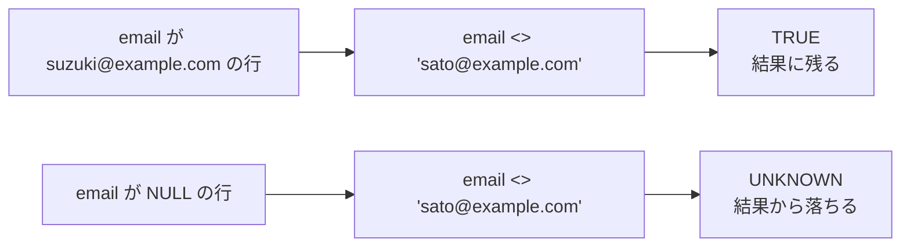
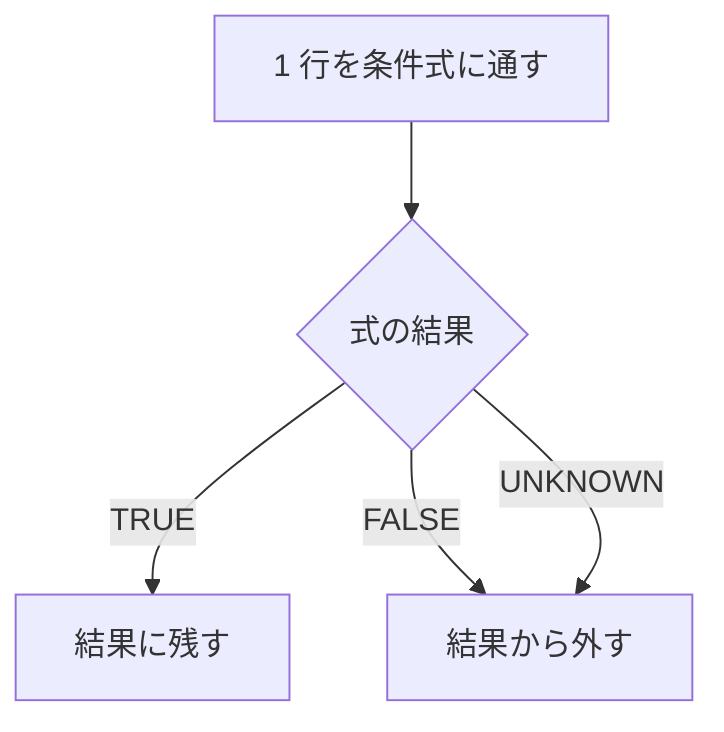
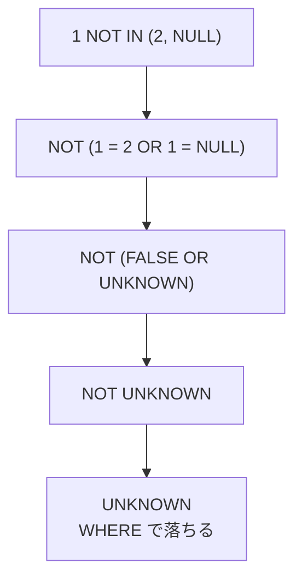
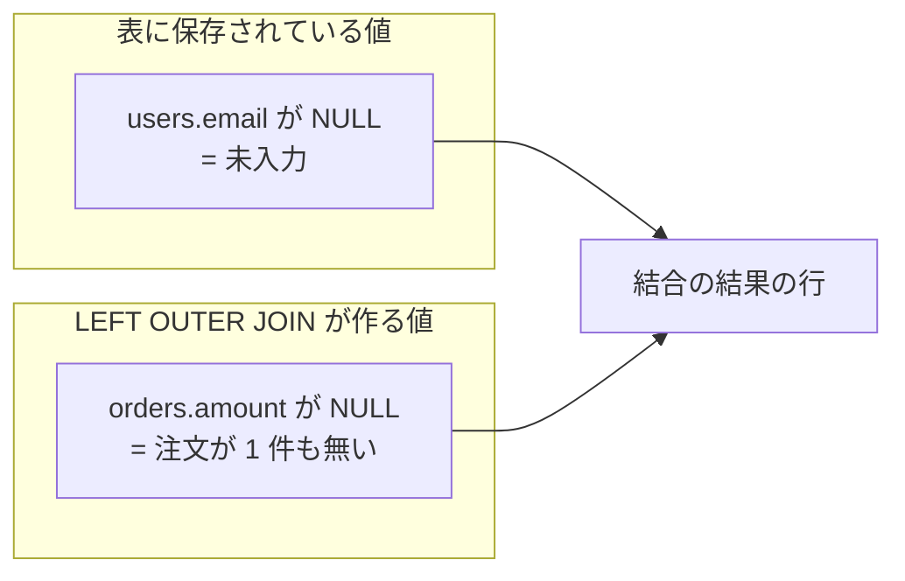
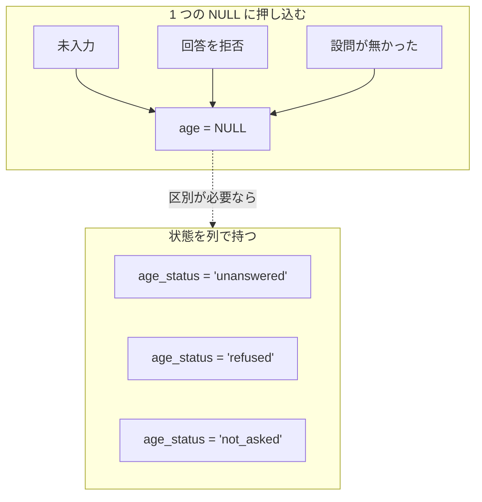

`NULL` は、値が存在しない事や不明である事を表すために SQL が特別扱いする印です。数値の 0、空文字列、真偽値の `false`、要素が 0 個の配列は、どれも通常の値なので `NULL` とは別に扱われます。

読者が最初に引っかかる 3 点に、先に答えを置きます。

- `NULL` は空の値ではありません。通常の値とは異なる扱いになるため、`=` や `<>` で比較しても結果は TRUE / FALSE に決まらず UNKNOWN になります
- `column = NULL` で検索できないのは、比較の結果が TRUE でも FALSE でもない第 3 の結果になり、`WHERE` がそれを残さないためです
- 書いた条件どおりに行が絞られない事があるのは、この第 3 の結果が式の全体に伝わり、`NOT` や `NOT IN` を通った先で直感と違う結果になるためです

この扱いが効いてくる場面の代表は、任意入力の列を持つ表の検索です。会員登録でメールアドレスを任意にすると、未入力の会員は `email` が `NULL` になります。「佐藤さん以外の会員」を出すつもりで `WHERE email <> 'sato@example.com'` と書くと、未入力の会員は結果に入りません。エラーにはならず、行数が少ない事も正常な結果と区別が付きません。

同じ条件が、値の入った行と `NULL` の行でどう分かれるのかを以下に示します。



以降では、上記の図の UNKNOWN がどこから来て、`WHERE`・`NOT IN`・集約関数・一意制約・`JOIN` にそれぞれどう波及するのかを追います。

---

### 前提と説明の範囲

本ノートでは、SQL が `NULL` をどう扱うかと、その扱いが表の設計に与える影響を説明します。プログラミング言語の null 参照や JSON の null には触れません。`NULL` の扱いには SQL 標準が定めている部分と、DBMS（Database Management System）ごとに決めて良い部分があるので、標準の規則を軸に置き、実装で割れる所は都度断ります。

例には次の表を使います。動かして確かめた結果は SQLite 3.44.4 のものです。

```sql
CREATE TABLE users (
    id         BIGINT PRIMARY KEY,
    name       VARCHAR(100) NOT NULL,
    email      VARCHAR(255),
    age        INTEGER,
    deleted_at TIMESTAMP
);
```

入っているデータは次の 4 行とします。

| id | name | email | age | deleted_at |
| --- | --- | --- | --- | --- |
| 1 | 佐藤 | sato@example.com | 20 | `NULL` |
| 2 | 鈴木 | suzuki@example.com | 31 | `NULL` |
| 3 | 高橋 | `NULL` | `NULL` | `NULL` |
| 4 | 田中 | `NULL` | 45 | 2026-03-01 10:00 |

---

### なぜ NULL を普通の値として扱えないのか

`NULL` が特別扱いされている事は、他の「空っぽに見える値」との違いに出ます。MySQL のマニュアルは、0 や空文字列を `NOT NULL` の列に入れられる事を挙げて、「[These are in fact values, whereas `NULL` means 'not having a value.'](https://dev.mysql.com/doc/refman/8.4/en/working-with-null.html)」（これらは実際には値であり、`NULL` は「値を持っていない」事を意味する）と書かれています。0 は数量が 0 である事を表し、空文字列には長さ 0 の文字列が入っています。

ただし、空文字列を `NULL` と別扱いするかは DBMS で割れます。Oracle には「[The database currently treats a character value with a length of zero as null.](https://docs.oracle.com/en/database/oracle/oracle-database/23/sqlrf/Nulls.html)」（データベースは現在、長さ 0 の文字値を null として扱う）と書かれています。同じ箇所は、将来のリリースでもそうとは限らないとも断っています。

`NULL` が何を表しているのかも 1 つに決まっていません。未入力・不明・該当なし・まだ決まっていない、のどれでも同じ `NULL` になります。この違いをどう扱うかは「NULL に何を意味させるか」で扱います。

値が存在しないか不明であるため、通常の比較では TRUE / FALSE を決められません。

PostgreSQL のドキュメントには、「[SQL uses a three-valued logic system with true, false, and `null`, which represents "unknown".](https://www.postgresql.org/docs/current/functions-logical.html)」（SQL は true・false・「unknown」を表す null からなる三値論理を使う）と書かれています。真と偽に UNKNOWN を足した 3 つで論理を組み立てる、という規則です。

ここから 1 つの規則が出ます。`=`・`<>`・`<`・`>` のような比較演算子は、左右のどちらか一方でも `NULL` なら結果が UNKNOWN になります。`NULL = NULL` も `NULL <> 20` も UNKNOWN で、片方の値が分かっているかどうかは関係ありません。分からない値と比べた答えは分からない、という事です。

以降では、列に値が無い状態を `NULL`、比較や論理式で真偽を決められない結果を UNKNOWN と書き分けます。問い合わせ結果では、UNKNOWN となった式が `NULL` として現れる事があります。

UNKNOWN は、それを含む式の全体に伝わります。AND・OR・NOT の結果は以下の通りです。PostgreSQL のドキュメントが載せている真理値表から、UNKNOWN が関わる行だけを抜き出したものです。

| a | b | a AND b | a OR b | NOT a |
| --- | --- | --- | --- | --- |
| TRUE | UNKNOWN | UNKNOWN | TRUE | FALSE |
| FALSE | UNKNOWN | FALSE | UNKNOWN | TRUE |
| UNKNOWN | UNKNOWN | UNKNOWN | UNKNOWN | UNKNOWN |

上の表で UNKNOWN が消えているのは 2 か所だけです。AND の片方が FALSE なら結果は FALSE、OR の片方が TRUE なら結果は TRUE で、もう片方が何であっても変わりません。最終列は後の節で効いてきます。`NOT` が反転できるのは TRUE と FALSE だけなので、UNKNOWN は UNKNOWN のまま残ります。なお、引用元の表は UNKNOWN を `NULL` と表記しています。

比較演算子の結果が UNKNOWN にしかならない以上、`NULL` かどうかを判定するには専用の書き方が必要です。`IS NULL` と `IS NOT NULL` は値どうしを比べず、その列が `NULL` かどうかだけを TRUE か FALSE で返します。

MySQL のマニュアルにも、「[You cannot use arithmetic comparison operators such as `=`, `<`, or `<>` to test for `NULL`.](https://dev.mysql.com/doc/refman/8.4/en/working-with-null.html)」（`=`、`<`、`<>` のような算術比較演算子で `NULL` を判定する事はできない）と書かれています。

ここまでは比較演算子と論理演算子に限った規則です。`GROUP BY`・`DISTINCT`・`UNION` は `NULL` どうしを同じものとして 1 つに畳みます。比較にも、`NULL` を同一として扱う専用の述語があります。

```sql
SELECT NULL = NULL;                      -- NULL（UNKNOWN）
SELECT NULL IS NOT DISTINCT FROM NULL;   -- 1（TRUE）
```

PostgreSQL のドキュメントは `IS NOT DISTINCT FROM` について、「[it returns true when both inputs are null, and false when only one input is null](https://www.postgresql.org/docs/current/functions-comparison.html)」（両方の入力が null なら true、片方だけが null なら false を返す）と書かれています。同じ箇所は、この述語の中では null を「unknown」ではなく通常のデータ値のように扱うとも説明しています。

上の結果は手元の SQLite で確かめたものです。`=` では `NULL` どうしを一致とみなせない場面で、こうした述語が選択肢になります。対応の有無と構文は DBMS で違うので、使う前にドキュメントで確かめる事になります。

---

### 三値論理と検索条件

`WHERE` が残すのは、条件が TRUE になった行だけです。FALSE と UNKNOWN はどちらも残りません。`NULL` が絡む条件で行が消えるのは、この 1 つの規則からきています。

3 つの結果がどう扱われるのかは、以下の通りです。



FALSE と UNKNOWN が同じ行き先になる点が、`NULL` を含む検索の要になります。真理値表で見たとおり `NOT` は UNKNOWN を反転できないので、条件を否定しても同じ行が落ちます。

ここまでの規則が実際にどう出るのかは、4 つの問い合わせで確かめられます。

```sql
SELECT NULL = NULL;                        -- NULL（UNKNOWN）
SELECT * FROM users WHERE age <> 20;       -- id = 2, 4（id = 3 は落ちる）
SELECT * FROM users WHERE email = NULL;    -- 0 行
SELECT * FROM users WHERE email IS NULL;   -- id = 3, 4
```

2 番目の「20 歳ではない会員」では、`age` が `NULL` の高橋さんが落ちます。`age` が分からない以上、20 歳かどうか自体が判定できないからです。`NULL <> 20` は FALSE ではなく UNKNOWN になり、`WHERE` の結果から外れます。3 番目が 0 行なのも同じ理由で、`email = NULL` は全ての行で UNKNOWN になります。

どちらも構文としては正しいので、エラーも警告も出ません。目的を果たすのは 4 番目の `IS NULL` だけです。

未入力の行も含めたいなら、条件を `WHERE age <> 20 OR age IS NULL` と書きます。`NULL` の行をどう扱いたいのかは、書き手が明示する事になります。

`COALESCE(age, -1) <> 20` のように、`NULL` を別の値に置き換えてから比べる方法もあります。`COALESCE` は引数を左から見て最初に `NULL` でない値を返す関数で、全ての引数が `NULL` なら `NULL` を返します。ここでの `-1` は問い合わせを評価する間だけ使う値で、表に `-1` を保存する設計とは別です。

同じ三値論理を使っていても、判定の向きが逆の場所があります。`CHECK` 制約は FALSE になった行だけを弾くので、UNKNOWN になる行は通ります。`CHECK (age > 0)` を張った列に `NULL` を入れる操作は、この制約では止まりません。

---

### NOT IN が 1 行も返さない理由

`NOT IN` は、`NULL` が最も分かりにくい形で効く場所です。ブロックした会員を除いた一覧は、次のように書けます。

```sql
-- blocked_users.user_id には 2 と NULL が入っている
SELECT * FROM users
 WHERE id NOT IN (SELECT user_id FROM blocked_users);   -- 0 行

SELECT * FROM users u
 WHERE NOT EXISTS (SELECT 1 FROM blocked_users b
                    WHERE b.user_id = u.id);            -- id = 1, 3, 4
```

上の `NOT IN` は 1 行も返しません。`blocked_users.user_id` に `NULL` が 1 つ混ざっただけで、ブロックされていない 3 人も消えます。理由は、`NOT IN` が等値比較の OR に展開されるからです。

id が 1 の行について、式が段階的にどう畳まれるのかは、以下の通りです。



分かれ目は 3 段目です。OR が TRUE に確定するのは片方が TRUE の時だけなので、一致するものが 1 つも無くても UNKNOWN が残ります。否定しても UNKNOWN のままなので、`WHERE` はこの行を落とします。

id が 2 の行では `2 = 2` が TRUE になるので、`NOT TRUE` で FALSE になります。ブロック済みの会員は正しく除かれ、それ以外の会員も全部消える、という結果です。集合に `NULL` が 1 つでも入ると、`NOT IN` が TRUE を返す行が無くなります。

`NOT EXISTS` が 3 行を返すのは、判定の形が違うためです。`EXISTS` は、括弧の中に書いた副問い合わせ（別の `SELECT` を入れ子にしたもの）が 1 行以上返したかどうかだけを見ます。行が返れば TRUE、返らなければ FALSE になり、`NOT EXISTS` はその 2 つを反転します。

副問い合わせの中でも UNKNOWN は発生します。`b.user_id = u.id` は `NULL` の行に対して UNKNOWN になり、その行は副問い合わせの `WHERE` で落ちます。`EXISTS` が受け取るのは残った行の有無なので、外側には TRUE か FALSE で伝わります。

主な対策は、副問い合わせに `WHERE user_id IS NOT NULL` を加える、`user_id` を `NOT NULL` にする、`NOT EXISTS` で書く、の 3 つです。列が `NOT NULL` だと分かっている場合を除けば、`NOT EXISTS` の方が結果を読み違えにくいと考えられます。

ただし、`NOT IN` と `NOT EXISTS` が常に同じ結果になるわけではありません。外側の列が `NULL` の行について、`NOT EXISTS` は残し、`NOT IN` は落とします。上の例は `id` が主キーなので差が出ません。書き換える時は、外側の列が `NOT NULL` かどうかを確かめる事になります。

---

### 集約関数・一意制約・OUTER JOIN での扱い

`NULL` の扱いは、検索条件の外にも及びます。ここでは効き方の違う 3 か所を見ます。

#### 集約関数ごとに NULL の扱いが違う

PostgreSQL のドキュメントは、`count(*)` を「[Computes the number of input rows.](https://www.postgresql.org/docs/current/functions-aggregate.html)」（入力行の数を計算する）、`count(any)` を「[Computes the number of input rows in which the input value is not null.](https://www.postgresql.org/docs/current/functions-aggregate.html)」（入力値が null でない入力行の数を計算する）と定義しています。

`sum` と `avg` も、同じページで「non-null input values」（null でない入力値）を対象にすると書かれています。先ほどの 4 行に対する結果を並べます。`age` は 20・31・`NULL`・45 の 4 つです。

| 式 | 結果 | 理由 |
| --- | --- | --- |
| `COUNT(*)` | 4 | 行の数を数える |
| `COUNT(email)` | 2 | `NULL` でない値の数を数える |
| `AVG(age)` | 32 | 96 を 4 ではなく 3 で割る |
| `SUM(age)` | 96 | `NULL` を足し込まない |

`AVG` の分母が行数ではなく、値が入っている行の数である点は、集計値を読む側に効いてきます。未入力を 0 とみなした平均が欲しいなら、`AVG(COALESCE(age, 0))` のように書き手が指定します。

対象の行が 1 つも無い場合も注意が必要です。同じページは、`count` を除く関数が「[return a null value when no rows are selected](https://www.postgresql.org/docs/current/functions-aggregate.html)」（行が 1 つも選ばれない時に null を返す）と書き、`sum` が 0 ではなく null を返す事を例に挙げています。合計を 0 として扱いたいなら `COALESCE` で包みます。

#### 一意制約が NULL を重複と見るかは実装で決まる

同じ値を 2 行に入れられなくする一意制約も、`NULL` に対しては直感と違う動きをします。PostgreSQL は「[By default, two null values are not considered equal in this comparison.](https://www.postgresql.org/docs/current/ddl-constraints.html)」（既定では、この比較において 2 つの null は等しいとみなされない）と書いており、`email` に一意制約を張っても、`email` が `NULL` の会員は何行でも入ります。

ここは DBMS ごとに割れます。同じページは「[The default null treatment in unique constraints is implementation-defined according to the SQL standard](https://www.postgresql.org/docs/current/ddl-constraints.html)」（一意制約における null の既定の扱いは、SQL 標準では実装定義である）と断り、他の実装は異なる振る舞いをすると続けています。

PostgreSQL 自身も `NULLS NOT DISTINCT` を付ければ `NULL` どうしを重複として扱えます。「`NULL` は一意制約に引っかからない」を SQL 全体の規則として覚えると、移植した先で別の結果になります。

#### OUTER JOIN は NULL を作り出す

`LEFT OUTER JOIN` は、左の表の行を必ず残し、右の表に相手が居ない行では右側の列を `NULL` で埋める結合です。PostgreSQL は、結合条件を満たす相手が無い行には「[a joined row is added with null values in columns of T2](https://www.postgresql.org/docs/current/queries-table-expressions.html)」（T2 の列を null にした結合行が追加される）と書かれています。埋めるための `NULL` は、表のどこにも保存されていません。

`users` に注文の表 `orders` を左外部結合した場合の、2 種類の `NULL` は以下の通りです。



上記の図の 2 つは、どちらも `NULL` として同じ結果に並びます。意味は別で、片方は「値が入力されていない」、もう片方は「結合の相手が存在しない」です。

生成された `NULL` は条件の書き方にも効きます。注文の無い会員を探すなら、結合を終えた結果に対して `WHERE o.id IS NULL` と書きます。この時に見る列には、`o.id` のような `NOT NULL` の列を選びます。`o.amount` のような nullable な列で同じ事をすると、注文はあるが金額が未入力の行まで混ざります。

同じ条件を `ON` 句に書くと、結合の相手を選ぶ段階で効きます。相手が居ない会員も `NULL` 付きで残るため、絞り込みになりません。

---

### NULL に何を意味させるか

ここまでの扱いを踏まえると、設計側の問いは「`NULL` を使うかどうか」ではなく「この列の `NULL` が何を意味するのか」になります。意味が 1 つに決まっていれば、`NULL` は素直な表現です。`deleted_at` が `NULL` なら有効、日時が入っていれば削除済み、という [Soft Delete](../soft-delete/) の使い方はその例で、`NULL` は「まだ削除されていない」の 1 つだけを表します。

問題が起きるのは、違う状態を 1 つの `NULL` に押し込んだ時です。`age` が `NULL` の会員について、回答を拒否したのか、入力欄を飛ばしたのか、設問自体が無かったのかは、列からは読み取れません。

押し込んだ場合と分けた場合は以下の通りです。



上記の図で分けた側は、`age` を `NULL` のまま残しつつ、なぜ `NULL` なのかを `age_status` で持ちます。集計から除く条件を状態ごとに変えられるので、「拒否した人を除いた平均」のような問い合わせが書けます。分ける先は列に限らず、回答そのものを別の表に移す形も選べます。

判断の基準は、その違いで処理が変わる場面があるかどうかです。変わらないなら、状態列は読む側の負担を増やすだけになります。

その一方で、`NOT NULL` を付けられる列に付けておく価値も大きくなります。その列を表から直接扱う限り、格納値に `NULL` が無いので、比較式でその列自身の `NULL` に由来する UNKNOWN を考える必要が減ります。読む側のコードからも `NULL` の分岐が減ります。

ただし、`NOT NULL` が縛るのは格納される値だけです。`OUTER JOIN` が埋める `NULL` と、行が 1 つも選ばれなかった集約が返す `NULL` は、`NOT NULL` の列からでも現れます。

とはいえ、値がまだ入っていない時期が業務として実在する列もあります。そこを無理に `NOT NULL` にすると、次に述べる代用値の問題が出ます。

---

### sentinel value で代用しない

`NULL` を避けるために、「値が無い」を表す特別な値を決めて入れる方法もあります。空文字列・0・`1970-01-01`・`9999-12-31` のような値で、sentinel value と呼びます。`NOT NULL` を付けられるので、一見すると `NULL` の問題を回避したように見えます。

実際には、問題の場所が移るだけです。`NULL` は SQL が特別扱いする印なので、`SUM`・`AVG`・`COUNT(column)` などでは入力が集計対象から外れ、専用の述語で判定でき、`NOT NULL` 制約で入力を禁じられます。sentinel value は普通の値なので、同じ事をしたければ書き手が組み立てる事になります。

| 観点 | `NULL` | sentinel value |
| --- | --- | --- |
| 集約関数 | `SUM` や `AVG` から自動で外れる | 0 や `9999-12-31` が計算に混ざる |
| 判定 | `IS NULL` という専用の述語がある | 値の約束をスキーマの外で共有する |
| 入力の禁止 | `NOT NULL` を 1 つ書けば済む | 列ごとに `CHECK` 制約を書く |
| 意味の衝突 | 値が無い事だけを表す | 本物の 0 や本物の日付と区別が付かない |

表の最終行が最も効きます。年齢に 0 を入れる設計では、0 歳の会員が現れた時点で意味が衝突します。日付の `9999-12-31` も、期限の比較でそのまま最大値として扱われるので、「期限が最も遠い契約」を求めた結果に紛れ込みます。

とはいえ、sentinel value が常に誤りというわけではありません。判定には条件が 2 つ要ります。その値が本物の値として入り得ない事と、集約・並べ替え・範囲の比較に混ざっても意味が壊れない事です。`9999-12-31` は 1 つ目を満たしても、2 つ目で外れます。

`NULL` を排除する事そのものを目的にすると、この 2 つの判定を飛ばして代用値を選ぶ事になります。

---

### NULL が自然に現れるケース

- 後から埋まる値を持つ列（退会日時、配送完了日時、承認日時）
- 条件によっては永久に埋まらない列（解約理由、備考）
- 任意入力の項目で、未入力と空文字列を区別したい列
- `OUTER JOIN` の結果として、相手の行が無い事を表す場合

---

### NULL が問題を起こしやすいケース

以下は、`NULL` が通常の値とは異なる規則で扱われる事から生じる注意点です。

- 比較演算子を使った条件から、`NULL` の行が肯定形でも否定形でも落ちる
- 集合に `NULL` が混ざると、`NOT IN` の条件が TRUE になる行が無くなる
- 一意制約での扱いが DBMS ごとに違い、移植した先で結果が変わる
- 違う理由の「値が無い」が 1 つの `NULL` に畳まれ、後から区別できない

---

### NULL を見たときに考えること

- この `NULL` は何を意味するのか。未入力・不明・該当なし・未定のどれか
- `NOT NULL` にできない理由は何か。付けられるなら付ける
- 複数の状態を 1 つの `NULL` に押し込めていないか
- その列を使う条件式で UNKNOWN が出て、行が落ちないか
- sentinel value に置き換える方が、かえって不自然にならないか

`NULL` 自体が問題なのではなく、その意味と SQL 上での扱いを決めないまま nullable な列を作る事が問題になります。列に `NULL` があるかどうかより、その「値が無い」が何を意味し、検索・集約・制約でどう扱われるのかが決まっている事が先に来ます。
