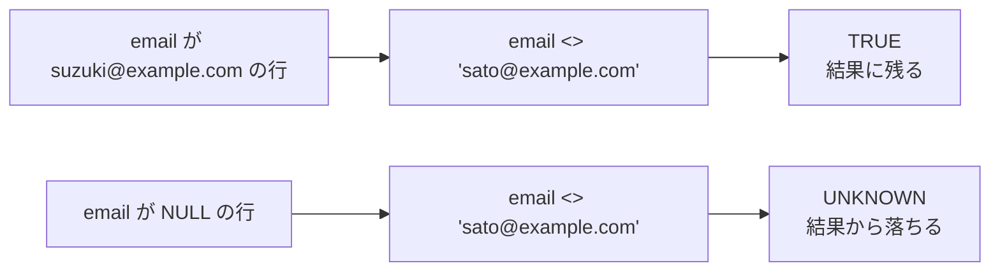
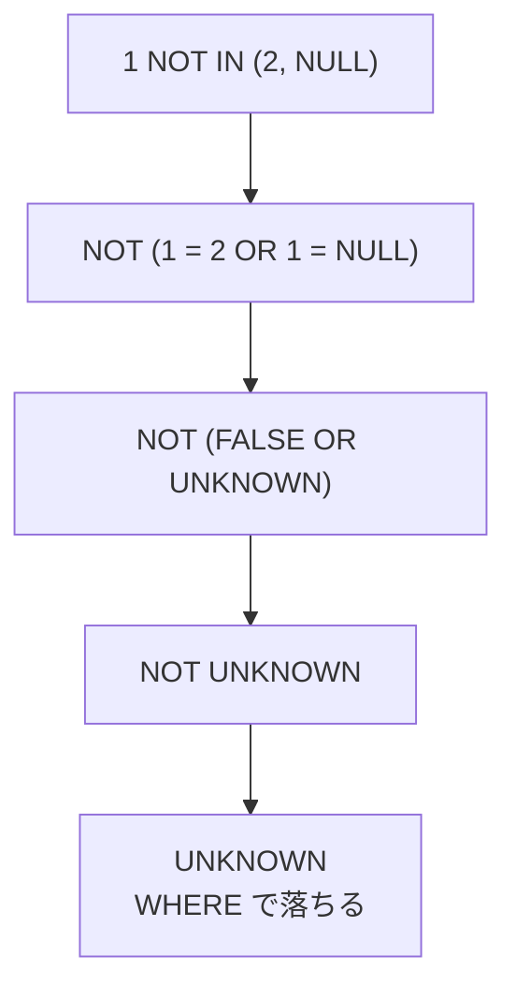
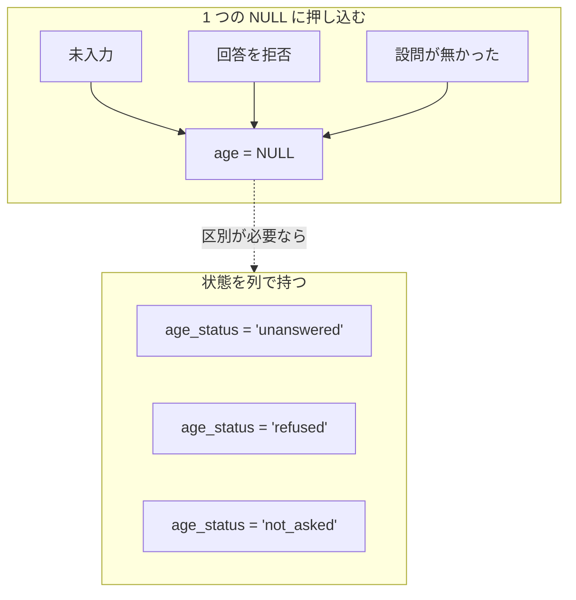

`NULL` は、値が存在しない事や不明である事を表すために SQL が特別扱いする印です。数値の 0、真偽値の `false`、要素が 0 個の配列は、どれも通常の値なので `NULL` とは別に扱われます。

`=` や `<>` で `NULL` と比べると、結果は TRUE でも FALSE でもない UNKNOWN になります。`WHERE` は条件が TRUE になった行だけを残すので、`column = NULL` と書いても 1 行も返りません。条件を `NOT` で否定しても UNKNOWN は UNKNOWN のままなので、落ちた行は戻りません。

この扱いが効いてくる場面の代表は、任意入力の列を持つ表の検索です。会員登録でメールアドレスを任意にすると、未入力の会員は `email` が `NULL` になります。「佐藤さん以外の会員」を出すつもりで `WHERE email <> 'sato@example.com'` と書くと、未入力の会員は結果に入りません。エラーにはならず、行数が少ない事も正常な結果と区別が付きません。

同じ条件が、値の入った行と `NULL` の行でどう分かれるのかを以下に示します。



---

### 前提と説明の範囲

本ノートでは、SQL が `NULL` をどう扱うかと、その扱いが表の設計に与える影響を説明します。プログラミング言語の null 参照や JSON の null には触れません。`NULL` の扱いには SQL 標準が定めている部分と、DBMS（Database Management System）ごとに決めて良い部分があるので、標準の規則を軸に置き、実装で割れる所は都度断ります。

例には次の表を使います。動かして確かめた結果は SQLite 3.44.4 のものです。

```sql
CREATE TABLE users (
    id         BIGINT PRIMARY KEY,
    name       VARCHAR(100) NOT NULL,
    email      VARCHAR(255),
    age        INTEGER,
    deleted_at TIMESTAMP
);
```

入っているデータは次の 4 行とします。

| id | name | email | age | deleted_at |
| --- | --- | --- | --- | --- |
| 1 | 佐藤 | sato@example.com | 20 | `NULL` |
| 2 | 鈴木 | suzuki@example.com | 31 | `NULL` |
| 3 | 高橋 | `NULL` | `NULL` | `NULL` |
| 4 | 田中 | `NULL` | 45 | 2026-03-01 10:00 |

---

### なぜ NULL を普通の値として扱えないのか

0 は数量が 0 である事を表し、空文字列には長さ 0 の文字列が入っています。[MySQL のマニュアル](https://dev.mysql.com/doc/refman/8.4/en/working-with-null.html)では、0 と空文字列は値なので `NOT NULL` の列にも入れられ、`NULL` は値を持っていない事を表すと説明されています。

ただし、空文字列を `NULL` と別扱いするかは DBMS で割れます。Oracle Database は現在、長さ 0 の文字列を `NULL` として扱います。[SQL 言語リファレンス](https://docs.oracle.com/en/database/oracle/oracle-database/23/sqlrf/Nulls.html)には、将来のリリースでもそうとは限らないという注意も書かれています。

`NULL` は値が存在しないか不明な事を表すので、比べても TRUE か FALSE かを決められません。SQL の論理式は、TRUE と FALSE に UNKNOWN を加えた 3 つの値を取ります。この 3 つの値で論理式を組み立てる規則は、三値論理（three-valued logic）と呼ばれます（[PostgreSQL のドキュメント](https://www.postgresql.org/docs/current/functions-logical.html)）。

以降では、列に値が無い状態を `NULL`、比較や論理式で真偽を決められない結果を UNKNOWN と書き分けます。問い合わせ結果では、UNKNOWN となった式が `NULL` として現れる事があります。

`=`・`<>`・`<`・`>` のような比較演算子は、左右のどちらか一方でも `NULL` なら結果が UNKNOWN になります。`NULL = NULL` も `NULL <> 20` も UNKNOWN で、片方の値が分かっているかどうかは関係ありません。

UNKNOWN は、それを含む式の全体に伝わります。以下は、PostgreSQL のドキュメントが載せている真理値表から、UNKNOWN が関わる行だけを抜き出したものです（元の表は UNKNOWN を `NULL` と表記しています）。

| a | b | a AND b | a OR b | NOT a |
| --- | --- | --- | --- | --- |
| TRUE | UNKNOWN | UNKNOWN | TRUE | FALSE |
| FALSE | UNKNOWN | FALSE | UNKNOWN | TRUE |
| UNKNOWN | UNKNOWN | UNKNOWN | UNKNOWN | UNKNOWN |

上の表で UNKNOWN が消えているのは 2 か所だけです。AND の片方が FALSE なら結果は FALSE、OR の片方が TRUE なら結果は TRUE で、もう片方が何であっても変わりません。`NOT` が反転できるのは TRUE と FALSE だけなので、UNKNOWN は UNKNOWN のまま残ります。

比較演算子の結果が UNKNOWN にしかならない以上、`NULL` かどうかを判定するには専用の書き方が必要です。`IS NULL` と `IS NOT NULL` は値どうしを比べず、その列が `NULL` かどうかだけを TRUE か FALSE で返します。

ここまでは比較演算子と論理演算子に限った規則です。`GROUP BY`・`DISTINCT`・`UNION` は `NULL` どうしを同じものとして 1 つに畳みます。比較にも、`NULL` でない入力どうしなら `=` と同じ結果を返し、両方が `NULL` なら TRUE、片方だけが `NULL` なら FALSE を返す `IS NOT DISTINCT FROM` という述語があります（[PostgreSQL のドキュメント](https://www.postgresql.org/docs/current/functions-comparison.html)）。

手元の SQLite でも、`SELECT NULL IS NOT DISTINCT FROM NULL;` は 1（TRUE）を返します。`=` では `NULL` どうしを一致とみなせない場面で、こうした述語が選択肢になります。対応の有無と構文は DBMS で違うので、使う前にドキュメントで確かめる事になります。

---

### 三値論理と検索条件

`WHERE` が残すのは、条件が TRUE になった行だけです。FALSE と UNKNOWN はどちらも残りません。`NULL` が絡む条件で行が消えるのは、この 1 つの規則からきています。`NOT` は UNKNOWN を反転できないので、条件を否定しても、UNKNOWN になった行は落ちたままです。

次の 4 つの問い合わせで、この規則がどう出るのかを確かめられます。

```sql
SELECT NULL = NULL;                        -- NULL（UNKNOWN）
SELECT * FROM users WHERE age <> 20;       -- id = 2, 4（id = 3 は落ちる）
SELECT * FROM users WHERE email = NULL;    -- 0 行
SELECT * FROM users WHERE email IS NULL;   -- id = 3, 4
```

2 番目の「20 歳ではない会員」では、`age` が `NULL` の高橋さんが落ちます。`NULL <> 20` が FALSE ではなく UNKNOWN になり、`WHERE` の結果から外れるからです。3 番目が 0 行なのも同じ理由で、`email = NULL` は全ての行で UNKNOWN になります。

どちらも構文としては正しいので、エラーも警告も出ません。`email` が `NULL` の行を探すなら、4 番目の `IS NULL` で書きます。未入力の行も含めて「20 歳ではない会員」を出したいなら、`WHERE age <> 20 OR age IS NULL` と書きます。

`COALESCE(age, -1) <> 20` のように、`NULL` を別の値に置き換えてから比べる方法もあります。`COALESCE` は引数を左から見て最初に `NULL` でない値を返す関数で、全ての引数が `NULL` なら `NULL` を返します。ここでの `-1` は問い合わせを評価する間だけ使う値で、表に `-1` を保存する設計とは別です。

同じ三値論理を使っていても、判定の向きが逆の場所があります。`CHECK` 制約は FALSE になった行だけを弾くので、UNKNOWN になる行は通ります。`CHECK (age > 0)` を張った列にも、`NULL` は入れられます。

---

### NOT IN が 1 行も返さない理由

`NOT IN` は、`NULL` が最も分かりにくい形で効く場所です。ブロックした会員を除いた一覧は、次のように書けます。

```sql
-- blocked_users.user_id には 2 と NULL が入っている
SELECT * FROM users
 WHERE id NOT IN (SELECT user_id FROM blocked_users);   -- 0 行

SELECT * FROM users u
 WHERE NOT EXISTS (SELECT 1 FROM blocked_users b
                    WHERE b.user_id = u.id);            -- id = 1, 3, 4
```

上の `NOT IN` は 1 行も返しません。`blocked_users.user_id` に `NULL` が 1 つ混ざっただけで、ブロックされていない 3 人も消えます。理由は、`NOT IN` が等値比較の OR に展開されるからです。id が 1 の行では、式が次のように畳まれます。



分かれ目は 3 段目です。一致する値が 1 つも無くても、`FALSE OR UNKNOWN` は FALSE ではなく UNKNOWN になり、`NOT` を通しても UNKNOWN のまま残ります。id が 2 の行は `2 = 2` が TRUE なので、`NOT` を通した結果は FALSE になります。つまり、集合に `NULL` が 1 つでも入ると、`NOT IN` が TRUE を返す行は無くなります。

`NOT EXISTS` が 3 行を返すのは、判定の形が違うからです。`EXISTS` は、括弧の中に書いた副問い合わせ（別の `SELECT` を入れ子にしたもの）が 1 行以上返したかどうかだけを見て、TRUE か FALSE を返します。副問い合わせの中で `b.user_id = u.id` が UNKNOWN になった行は、その `WHERE` で落ちるだけで、外側には UNKNOWN として伝わりません。

主な対策は、副問い合わせに `WHERE user_id IS NOT NULL` を加える、`user_id` を `NOT NULL` にする、`NOT EXISTS` で書く、の 3 つです。列が `NOT NULL` だと分かっている場合を除けば、`NOT EXISTS` の方が結果を読み違えにくいと考えられます。

ただし、`NOT IN` を `NOT EXISTS` に書き換えて結果が変わるのは、上の例のように副問い合わせが返す値に `NULL` が混ざる場合だけではありません。外側の列が `NULL` の行も、`NOT IN` の右辺が 1 行以上ある限り、`NOT EXISTS` では残り、`NOT IN` では落ちます。上の例の `id` は主キーなので、外側の `NULL` による差は出ません。書き換える時は、外側の列が `NOT NULL` かどうかも確かめる事になります。

---

### 集約関数・一意制約・OUTER JOIN での扱い

`NULL` の扱いは、検索条件の外にも及びます。

#### 集約関数ごとに NULL の扱いが違う

[PostgreSQL のドキュメント](https://www.postgresql.org/docs/current/functions-aggregate.html)では、`count(*)` は入力行の数を数え、列や式を渡した `count` と `sum`・`avg` は `NULL` でない入力値だけを対象にすると定義されています。先ほどの 4 行に当てた結果は以下の通りです。`age` は 20・31・`NULL`・45 の 4 つです。

| 式 | 結果 | 理由 |
| --- | --- | --- |
| `COUNT(*)` | 4 | 行の数を数える |
| `COUNT(email)` | 2 | `NULL` でない値の数を数える |
| `AVG(age)` | 32 | 96 を 4 ではなく 3 で割る |
| `SUM(age)` | 96 | `NULL` を足し込まない |

`AVG` の分母は行数ではなく、値が入っている行の数です。未入力を 0 とみなした平均が欲しいなら、`AVG(COALESCE(age, 0))` のように書き手が指定します。

PostgreSQL が汎用の集約関数として挙げる `count`・`sum`・`avg` などは、行が 1 つも選ばれない時、`count` を除いて `NULL` を返します（[同じページ](https://www.postgresql.org/docs/current/functions-aggregate.html)）。例えば `SUM` は 0 ではなく `NULL` を返すので、合計を 0 として扱いたいなら `COALESCE` で包みます。

#### 一意制約で NULL を重複と見るかの既定は実装で決まる

同じ値を 2 行に入れられなくする一意制約も、`NULL` に対しては直感と違う動きをします。PostgreSQL は既定で 2 つの `NULL` を等しいと見なさないので、`email` に一意制約を張っても、`email` が `NULL` の会員は何行でも入ります。

ここは DBMS ごとに割れます。PostgreSQL のドキュメントには「[The default null treatment in unique constraints is implementation-defined according to the SQL standard](https://www.postgresql.org/docs/current/ddl-constraints.html)」（一意制約における null の既定の扱いは、SQL 標準では実装定義である）とあり、他の実装は異なる振る舞いをするとも書かれています。

PostgreSQL 自身も、15 以降は `NULLS NOT DISTINCT` を付ければ `NULL` どうしを重複として扱えます。「`NULL` は一意制約に引っかからない」を SQL 全体の規則として覚えると、移植した先で別の結果になります。

#### OUTER JOIN は NULL を作り出す

`LEFT OUTER JOIN` は、左の表の行を必ず残し、右の表に相手が居ない行では右側の列を `NULL` で埋める結合です（[PostgreSQL のドキュメント](https://www.postgresql.org/docs/current/queries-table-expressions.html)）。埋めるための `NULL` は、表のどこにも保存されていません。

注文の表 `orders` は `id`（主キー）・`user_id`・`amount` を持ち、`(10, 1, 1200)` と `(11, 2, NULL)` の 2 行が入っているとします。`users u LEFT OUTER JOIN orders o ON o.user_id = u.id` の結果には、2 種類の `NULL` が同じ形で並びます。

| name | email | o.id | o.amount |
| --- | --- | --- | --- |
| 佐藤 | sato@example.com | 10 | 1200 |
| 鈴木 | suzuki@example.com | 11 | `NULL` |
| 高橋 | `NULL` | `NULL` | `NULL` |
| 田中 | `NULL` | `NULL` | `NULL` |

高橋さんの `email` は表に保存された `NULL` で、値が入力されていない事を表します。同じ行の `o.id` と `o.amount` は結合が埋めた `NULL` で、注文が 1 件も無い事を表します。鈴木さんの `o.amount` は、注文はあるが金額が未入力の `NULL` です。

生成された `NULL` は条件の書き方にも効きます。注文の無い会員を探すなら、結合を終えた結果に対して `WHERE o.id IS NULL` と書きます。この時に見る列には、`o.id` のような `NOT NULL` の列を選びます。`o.amount` で同じ事をすると、鈴木さんのように注文はあるが金額が未入力の行まで混ざります。

同じ条件を `ON` 句に書くと、結合の相手を選ぶ段階で効きます。相手が居ない会員も `NULL` 付きで残るため、絞り込みになりません。

---

### NULL に何を意味させるか

ここまでの扱いを踏まえると、設計側の問いは「`NULL` を使うかどうか」ではなく「この列の `NULL` が何を意味するのか」になります。意味が 1 つに決まっていれば、`NULL` は素直な表現です。`deleted_at` が `NULL` なら有効、日時が入っていれば削除済み、という [Soft Delete](../soft-delete/) の使い方はその例で、`NULL` は「まだ削除されていない」の 1 つだけを表します。

問題が起きるのは、違う状態を 1 つの `NULL` に押し込んだ時です。`age` が `NULL` の会員について、回答を拒否したのか、入力欄を飛ばしたのか、設問自体が無かったのかは、列からは読み取れません。

押し込んだ場合と分けた場合は以下の通りです。



上記の図の「状態を列で持つ」では、`age` を `NULL` のまま残しつつ、なぜ `NULL` なのかを `age_status` で持ちます。集計から除く条件を状態ごとに変えられるので、「拒否した人を除いた平均」のような問い合わせが書けます。分ける先は列に限らず、回答そのものを別の表に移す形も選べます。

判断の基準は、その違いで処理が変わる場面があるかどうかです。変わらないなら、状態列は読む側の負担を増やすだけになります。

値が必ず入る列には、`NOT NULL` を付けた方が良いです。格納値に `NULL` が無ければ、その列を条件に使っても、列自身の `NULL` が原因で UNKNOWN になる事はありません。読み出すコードからも `NULL` の分岐が減ります。

ただし、`NOT NULL` が縛るのは格納される値だけです。`OUTER JOIN` が埋める `NULL` と、行が 1 つも選ばれなかった集約が返す `NULL` は、`NOT NULL` の列からでも現れます。

とはいえ、値がまだ入っていない時期が業務として実在する列もあります。そこを無理に `NOT NULL` にすると、次に述べる代用値の問題が出ます。

---

### sentinel value で代用しない

`NULL` を避けるために、「値が無い」を表す特別な値を決めて入れる方法もあります。空文字列・0・`1970-01-01`・`9999-12-31` のような値で、sentinel value と呼びます。`NOT NULL` を付けられるので、一見すると `NULL` の問題を回避したように見えます。

しかし、問題の場所が移るだけです。sentinel value は普通の値なので、`NULL` であれば SQL が特別に扱ってくれる次の点も、書き手が自分で組み立てる事になります。

| 観点 | `NULL` | sentinel value |
| --- | --- | --- |
| 集約関数 | `SUM` や `AVG` から自動で外れる | 0 や `9999-12-31` が計算に混ざる |
| 判定 | `IS NULL` という専用の述語がある | 値の約束をスキーマの外で共有する |
| 入力の禁止 | `NOT NULL` を 1 つ書けば済む | 列ごとに `CHECK` 制約を書く |
| 意味の衝突 | 値が無い事だけを表す | 本物の 0 や本物の日付と区別が付かない |

表の最終行が最も効きます。例えば、年齢に 0 を入れる設計では、0 歳の会員が現れた時点で意味が衝突します。日付の `9999-12-31` も、期限の比較でそのまま最大値として扱われるので、「期限が最も遠い契約」を求めた結果に紛れ込みます。

とはいえ、sentinel value が常に誤りというわけではありません。判定には条件が 2 つ必要です。その値が本物の値として入り得ない事と、集約・並べ替え・範囲の比較に混ざっても意味が壊れない事です。`9999-12-31` は 1 つ目を満たしても、2 つ目で外れます。

`NULL` を排除する事を目的にすると、この 2 つの判定を飛ばして代用値を選ぶ事になります。

---

### NULL が自然に現れるケース

- 後から埋まる値を持つ列（退会日時、配送完了日時、承認日時）
- 条件によっては永久に埋まらない列（解約理由、備考）
- 任意入力の項目で、未入力と空文字列を区別したい列
- `OUTER JOIN` の結果として、相手の行が無い事を表す場合

---

### NULL が問題を起こしやすいケース

- 比較演算子を使った条件から、`NULL` の行が肯定形でも否定形でも落ちる
- 集合に `NULL` が混ざると、`NOT IN` の条件が TRUE になる行が無くなる
- 一意制約での既定の扱いが DBMS ごとに違い、移植した先で結果が変わる
- 違う理由の「値が無い」が 1 つの `NULL` に畳まれ、後から区別できない
