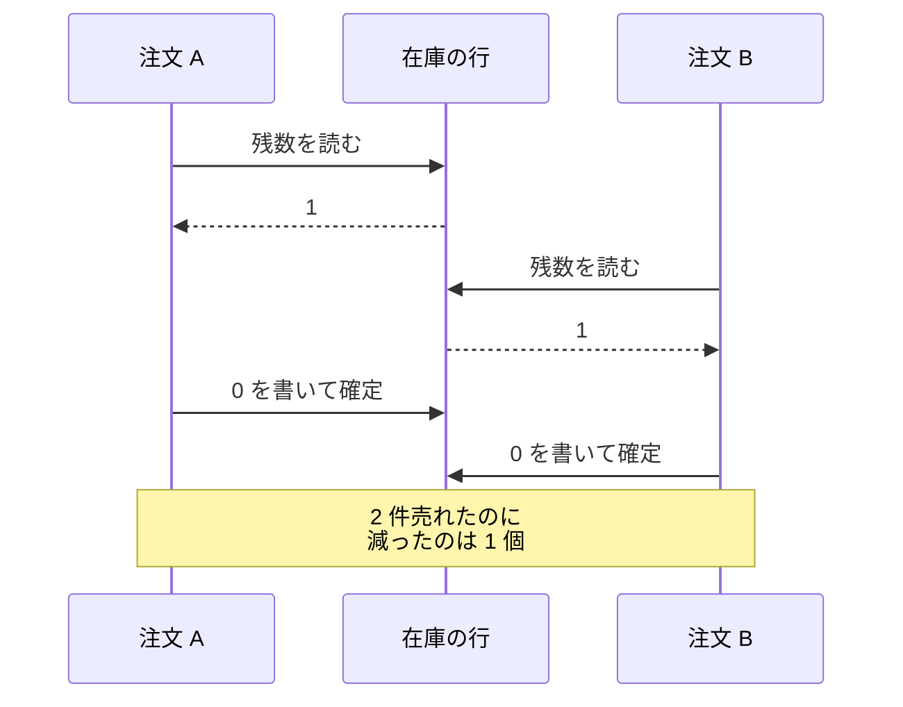
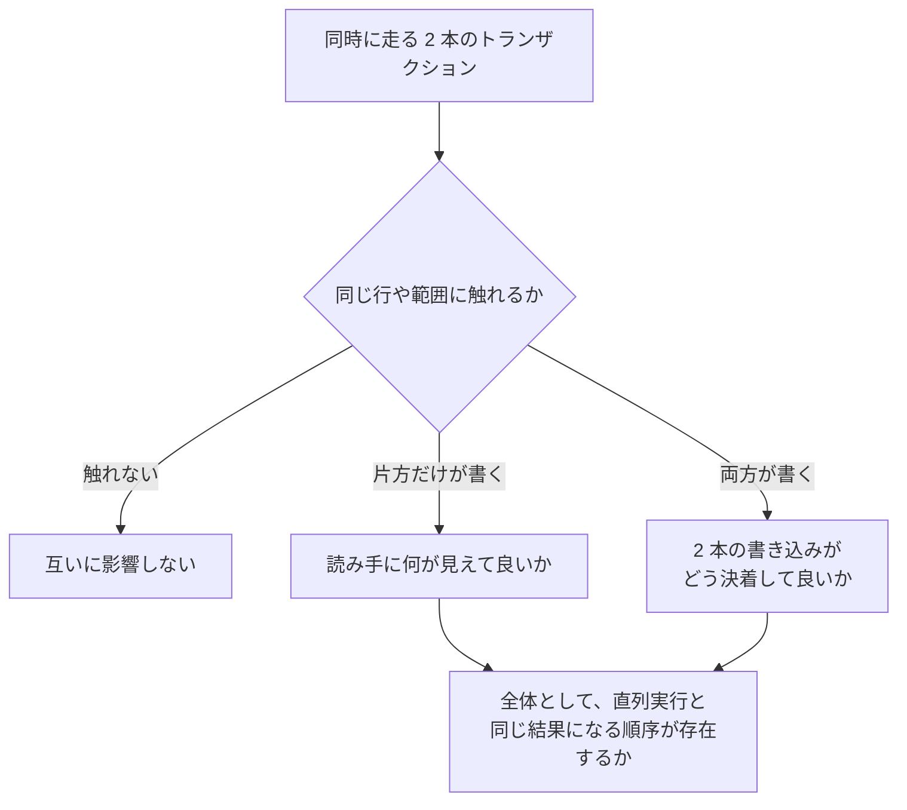
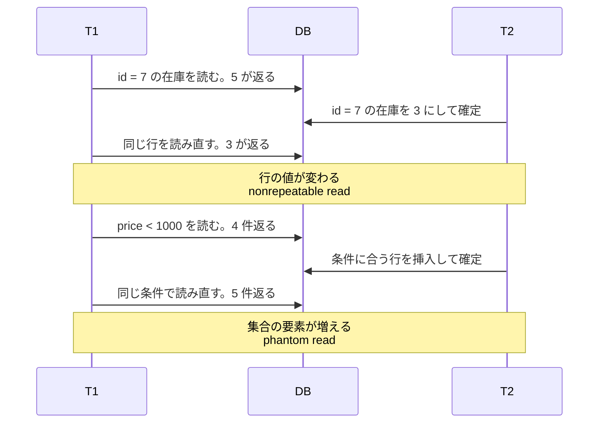
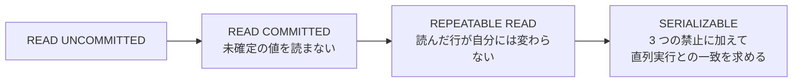
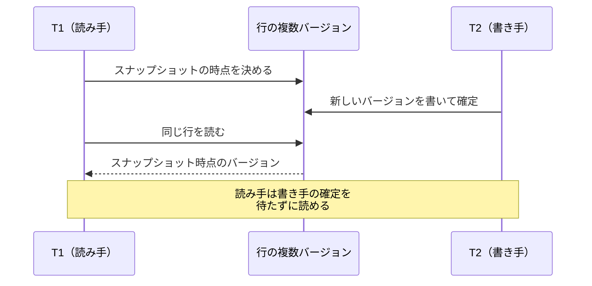
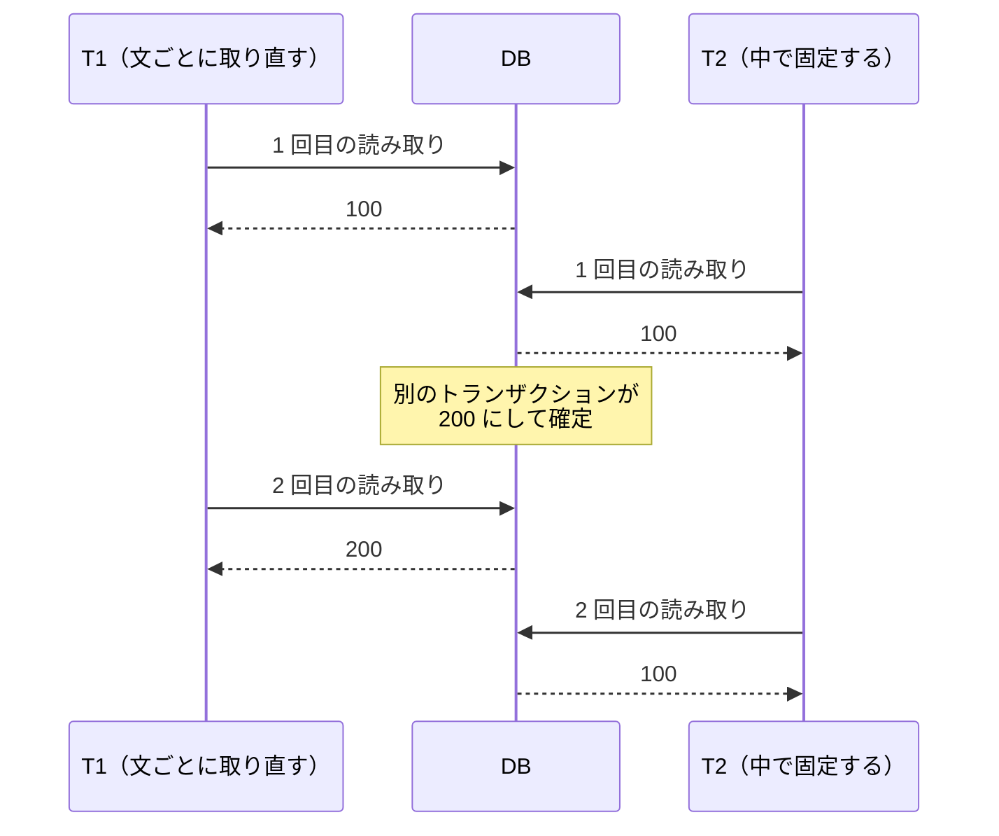
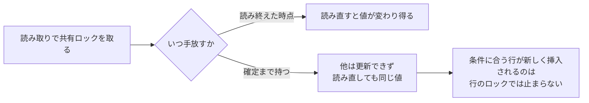
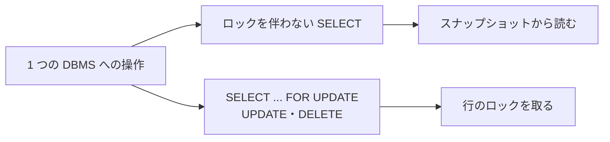

Transaction Isolation（分離）は、複数のトランザクションを同時に実行した時に、互いの読み書きがどのように観測され、どのような結果まで許されるかを定める規則です。ACID（Atomicity、Consistency、Isolation、Durability。原子性・一貫性・分離・耐久性）の I です。

トランザクションは複数の読み書きを 1 つのまとまりとして扱う単位で、まとまりを全部反映して終える事を確定（commit）、全部無かった事にして終える事を中止（abort）と言います。

この規則は、接続ライブラリの設定項目や `SET TRANSACTION ISOLATION LEVEL` という文として表に出ます。分離が効いてくる場面の代表は、在庫の引き当てです。残り 1 個の商品に 2 件の注文がほぼ同時に届くと、どちらの処理も残数として 1 を読み、そこから 1 を引いた 0 を書きます。読んだ値をアプリケーション側で計算して書き戻す形なので、DB から見れば 2 件とも正しい更新です。

同じ行を読んでから書く 2 本のトランザクションを以下に示します。

上記の図で注文 B が読んだ 1 は、注文 A が書き込む前の値です。この異常は lost update と呼ばれます。分離レベルの選び方によっては 2 件目が中止され、中止されなければエラーは出ないまま在庫が 0 になり、後の棚卸しで数が合わない事だけが残ります。以降では、こうした異常の型と、分離レベルという段階がそれをどこまで防ぐのかを追います。

---

### 前提と説明の範囲

本ノートでは、1 台の DBMS（Database Management System）の中で複数のトランザクションが同時に走る場合を扱い、複数の DB にまたがる更新は [2PC](../../distributed-systems/two-phase-commit/) の題材とします。ACID のうち原子性と耐久性を支える仕組みは [WAL](../../distributed-systems/write-ahead-log/) で扱っているので、ここでは分離だけを見ます。

分離レベルには SQL 標準が定めている部分と DBMS ごとに決めて良い部分があるので、標準の規則を軸に置き、実装で割れる所は都度断ります。

---

### なぜ分離レベルという段階があるのか

正しさだけを求めるなら、トランザクションを 1 本ずつ順に実行すれば済みます。同時に 1 本しか走っていなければ、互いの途中経過を読む事も、自分が読んだ値を横から書き換えられる事もありません。ただし、この方式では接続を増やしても処理量が伸びず、1 本の長いトランザクションが後続を全部待たせます。そこで DBMS は、複数のトランザクションを重ねて実行しつつ、1 本ずつ実行した場合と同じ結果に近づけます。

SQL 標準の最も強いレベルは、この一致そのものを要求しています。PostgreSQL のドキュメントは Serializable について、並行実行してにも「[guaranteed to produce the same effect as running them one at a time in some order](https://www.postgresql.org/docs/current/transaction-iso.html)」（何らかの順序で 1 本ずつ実行した場合と同じ結果になる事が保証される）と書かれています。

残りの 3 レベルは、並行するトランザクションの相互作用から生じる現象のうち、各レベルで起きてはならないものによって定義されています。全部を直列実行と一致させるのではなく、許す現象を増やす事で、DBMS がより高い並行性を取りやすくします。減るコストが待ちなのか、中止と再試行なのか、検査なのかは実現方式で変わるので、レベルを下げれば必ず速くなるとは限りません。

2 本のトランザクションが重なった時、分離レベルが何を定めるのかは、以下の通りです。

分離レベルが定めるのは、並行実行でどのような観測と結果を許すかです。上記の図に並べた 3 つの問いがその中身です。

どう実現するかは、分離レベルが決めていません。DBMS はこの保証を満たすために、読み取りの可視性を制御したり、競合する処理を待たせたり、中止したりします。同じレベル名でも DBMS ごとに挙動が違うのは、この手段が別だからです。

---

### 同時実行で現れる異常

標準が名前を付けた異常は 3 つで、どれも 1 本のトランザクションの読み書きの間に、別のトランザクションの書き込みが入り込む形をしています。標準はこれらを現象（phenomena）と呼びます。

| 異常 | 何が起きるか |
| --- | --- |
| dirty read | 別のトランザクションが書いた、まだ確定していない値を読む |
| nonrepeatable read | 一度読んだ行を読み直すと、値が変わっているか行が消えている |
| phantom read | 同じ検索条件で読み直すと、条件に合う行の集合が変わっている |

後ろの 2 つの違いは、変わるのが読んだ行なのか、条件に合う行の集合なのかです。集合が変われば phantom read に当てはまるので、挿入で行が増える形だけとは限りません。

PostgreSQL のドキュメントは、同じ検索条件の問い合わせを実行し直したトランザクションが「[finds that the set of rows satisfying the condition has changed due to another recently-committed transaction](https://www.postgresql.org/docs/current/transaction-iso.html)」（最近確定した別のトランザクションによって、条件を満たす行の集合が変わっている事を見付ける）現象を phantom read と定義しています。

1 本のトランザクションの中で、2 種類の読み直しを並べた流れは以下の通りです。

上記の図の後半のように条件に合う行が入れ替わる場合、読んだ行を 1 つずつロックしても防げません。この点が、phantom read を分けて扱う理由になります。

標準の 3 つに入っていない異常もあります。Berenson 氏らが 1995 年に発表した論文「[A Critique of ANSI SQL Isolation Levels](https://www.microsoft.com/en-us/research/wp-content/uploads/2016/02/tr-95-51.pdf)」は、3 つの現象では商用の DBMS が実装している分離レベルを区別できないと指摘し、異常を足しました。足された異常には、確定していない書き込みを別のトランザクションが上書きする dirty write と、冒頭の在庫の例で挙げた lost update が入ります。

論文は、nonrepeatable read を広く解釈した P2 を禁止すれば lost update も併せて防げると書かれています。効いているのは論文が採る広い解釈であって、標準の表で REPEATABLE READ を選べばどの DBMS でも lost update が防がれる、という意味にはなりません。何をどう防ぐかは、以降で見る実現方式で決まります。

もう 1 つが write skew です。2 本のトランザクションがそれぞれ別の行を書いた結果、両方が読んでいた条件だけが壊れる異常で、[Snapshot Isolation](../snapshot-isolation/) で扱います。

---

### SQL 標準が定めた 4 つの分離レベル

4 つのレベルと、そこで起きてはならない現象の対応は以下の通りです。

| 分離レベル | dirty read | nonrepeatable read | phantom read |
| --- | --- | --- | --- |
| READ UNCOMMITTED | 起き得る | 起き得る | 起き得る |
| READ COMMITTED | 起きない | 起き得る | 起き得る |
| REPEATABLE READ | 起きない | 起きない | 起き得る |
| SERIALIZABLE | 起きない | 起きない | 起きない |

上の表の「起き得る」は、その現象を標準が禁止していないという意味で、実装がそれより強く保証しても標準には反しません。PostgreSQL のドキュメントは、自身の REPEATABLE READ が phantom read を許さない事に触れた上で、「[higher guarantees are acceptable](https://www.postgresql.org/docs/current/transaction-iso.html)」（より強い保証は許容される）と書かれています。

最終行の SERIALIZABLE だけは、この 3 列で定義が尽きるわけではありません。各レベルが 1 つ手前に何を足すのかは、以下の通りです。

Berenson 氏らの論文は、SQL 標準の 4.28 項が SERIALIZABLE に「commonly known as fully serializable execution」（一般に完全な直列化可能実行として知られるもの）を求めている点を指摘し、3 つの現象を禁止しただけの水準は ANOMALY SERIALIZABLE という別の名前で呼んでいます。3 つを禁止すれば直列化可能になる、という読み方は同じ論文が誤解として名指ししたものです。

SERIALIZABLE が要求しているのは、並行実行の結果が何らかの直列実行と同じ効果になる事です。3 つの現象は、そこから外れる形のうち名前が付いた一部にすぎず、名前の付いていない外れ方が残っていれば直列実行とは一致しません。

同じレベル名でも、DBMS による差があります。PostgreSQL は 4 つ全部を指定として受け付けるものの、内部では 3 つしか実装しておらず、ドキュメントには「[PostgreSQL's Read Uncommitted mode behaves like Read Committed](https://www.postgresql.org/docs/current/transaction-iso.html)」（PostgreSQL の Read Uncommitted モードは Read Committed と同じように動く）と書かれています。

[Oracle Database のドキュメント](https://docs.oracle.com/en/database/oracle/oracle-database/23/cncpt/data-concurrency-and-consistency.html)は、提供する分離レベルとして read committed（既定）と serializable、および読み取り専用のモードを挙げており、read uncommitted と repeatable read は挙げていません。MySQL の [InnoDB](https://dev.mysql.com/doc/refman/8.4/en/innodb-transaction-isolation-levels.html) は、4 つ全部に対応した上で既定を REPEATABLE READ としています。設定するレベル名を揃えても、実際に防がれる現象は揃いません。

---

### 読み取りで何を可視にするか

保証を満たす仕組みを理解するため、ここでは読み取りの可視性と書き込み競合に分けて見ます。この 2 つで整理し切れるとは限らず、実際の保証は依存関係の検査などを含む複数の仕組みの組み合わせで作られる事もあります。まず読み取りの可視性です。何を可視にするかを制御する代表的な方法として、スナップショットとロックがあります。

スナップショットとは、複数あるバージョンのうちどれをその読み取りから可視とするかを決める基準です。ある論理的な時点を決め、その時点で確定していたバージョンだけを見せます。DB 全体を複製するわけではありません。行の複数のバージョンを保持し、スナップショットに従って可視なバージョンを選ぶ方式が MVCC（Multiversion Concurrency Control）です。

上記の図の T1 が待たされないのは、新しいバージョンと古いバージョンが同時に存在するからです。代わりに、古いバージョンを保持する領域と、不要になったバージョンを回収する処理が必要です。古いバージョンを別に取っておくのか、undo ログから作り直すのかは実装で分かれます。

時点をいつ決め直すかは、分離レベルと DBMS で変わります。同じ 2 回の読み取りが、2 つの方式でどう分かれるのかは、以下の通りです。

上記の図の T2 が 2 回目でも 100 を読むのは、スナップショットが動かないからです。固定されるのは他のトランザクションの確定に対してで、自分がそのトランザクションの中で書いた変更は後の読み取りから見えます。

どちらの方式になるかはレベルで決まり、PostgreSQL と InnoDB はどちらも READ COMMITTED が文ごと、REPEATABLE READ が固定です。

PostgreSQL のドキュメントは、READ COMMITTED の `SELECT` には「[sees a snapshot of the database as of the instant the query begins to run](https://www.postgresql.org/docs/current/transaction-iso.html)」（問い合わせが動き始めた瞬間のデータベースのスナップショットを見る）と書かれています。InnoDB も同じで、読み取りごとに新しいスナップショットを取ります。

同じ REPEATABLE READ でも、固定の基準になるのは PostgreSQL が最初の文、InnoDB が最初の読み取りです。InnoDB のドキュメントは、同じトランザクションの consistent read には「[the snapshot established by the first such read in that transaction](https://dev.mysql.com/doc/refman/8.4/en/innodb-consistent-read.html)」（そのトランザクションの中で最初のそうした読み取りで確立されたスナップショット）を読み続けると書かれています。

PostgreSQL の REPEATABLE READ が基準にするのは、トランザクションの中で最初に実行したトランザクション制御以外の文の開始時点です。どちらも `BEGIN` を発行した時点ではありません。

もう 1 つの方法がロックです。読み取りの前に共有ロックを取れば、確定していない値を読む事はなくなります。いつ手放すかで段階が分かれます。

Berenson 氏らの論文は、2 相ロック（two-phase locking）を規律どおりに使えば直列化可能性を保証できると述べています。2 相ロックとは、ロックを取り終えてから解放を始め、解放後は新しいロックを取らない規律です。

範囲をロックして phantom read を防ぐ実装では、条件に合う行が新しく挿入される値の隙間まで対象にする必要があります。MySQL の InnoDB はこの方法を使い、単位になるのは [Index Scan](../index-scan/) で見た索引の範囲です。ドキュメントは、一意索引を一意な条件で引く場合、見付けたレコードだけをロックして隙間はロックしないと書かれています。

それ以外の検索条件では、ロックを伴う読み取りと `UPDATE`・`DELETE` が、走査した索引の範囲を「[using gap locks or next-key locks to block insertions by other sessions into the gaps covered by the range](https://dev.mysql.com/doc/refman/8.4/en/innodb-transaction-isolation-levels.html)」（gap lock か next-key lock で、その範囲に含まれる隙間への他セッションからの挿入を防ぐ）形でロックします。

範囲をロックして待たせる方法だけが選択肢ではありません。別の DBMS には、範囲をロックする代わりに、読み書きの依存関係を検査する方式もあります。

スナップショットとロックの性質は以下の通りです。読み取りの可視性だけの比較で、書き込み同士の競合はこの表の外にあります。

| | スナップショットから読む | ロックを取って読む |
| --- | --- | --- |
| 通常の読み取りと書き込みの関係 | 互いをブロックしにくい | 互いに待つ |
| 追加で必要な資源 | 古いバージョンの保持と回収 | ロックの管理 |
| 読み取りの一貫性の決まり方 | スナップショットの時点で決まる | ロックを保持する期間で決まる |

左の列を「しにくい」と書かれているのは、スナップショットを使う DBMS でも待ちが起きるからです。`SELECT ... FOR UPDATE` のようにロックを伴う読み取り、テーブル定義の変更、書き込み同士の競合は、この仕組みの外にあります。

---

### 書き込みの競合をどう処理するか

2 本のトランザクションが同じ行を書こうとした時の扱いは、大きく 3 通りに分かれます。

- ロックで待たせる。先に取った方が確定するまで、もう一方は止まる
- 競合を検査して片方を中止する。確定の時点で判定する形が代表になる
- 待たせた上で中止する。相手の確定を待ち、確定していたら自分を中止する

PostgreSQL の REPEATABLE READ は 3 番目です。ドキュメントは、先に更新した側が確定していれば「[rolled back with the message ERROR: could not serialize access due to concurrent update](https://www.postgresql.org/docs/current/transaction-iso.html)」（ERROR: could not serialize access due to concurrent update というメッセージでロールバックされる）と書かれています。

Oracle の serializable も同じ形で、トランザクションの開始後に確定した更新に当たると `ORA-08177` を返します。どの方式を採るかで、アプリケーションが用意する後始末が変わります。待たせる方式ならデッドロックへの備え、中止させる方式なら再試行の処理が必要です。

読み取りの可視性と書き込み競合は分けて考えられ、1 つの DBMS が複数の方式を組み合わせます。同じ DBMS の中で操作ごとにどちらが働くのかは、以下の通りです。

上記の図の分かれ方は、InnoDB と PostgreSQL のどちらにも当てはまります。MVCC とロックは、DBMS ごとにどちらか一方を選ぶ二択ではありません。どちらが働くかは操作ごとに決まります。

InnoDB のドキュメント自身にも、「[InnoDB supports each of the transaction isolation levels described here using different locking strategies](https://dev.mysql.com/doc/refman/8.4/en/innodb-transaction-isolation-levels.html)」（InnoDB はここで説明した各分離レベルに、それぞれ違うロック戦略で対応している）と書かれています。

読み取りをトランザクション単位のスナップショットで固定し、書き込みは同じデータへの競合を検出して捌く、という組み方が Snapshot Isolation です。冒頭の在庫の例のような競合は防げる一方、別々の行を書き換えて制約を壊す write skew は残ります。[Snapshot Isolation](../snapshot-isolation/) で扱います。

---

### 利点

- 同時に走るトランザクションの数を増やしながら、1 本ずつ実行した結果に近づけられる
- 段階を選べる DBMS では、必要な正しさと並行実行のコストの釣り合いをトランザクション単位で決められる
- 異常に名前が付いているため、起きた不具合をどのレベルなら防げるかを判断できる
- 強い分離を DBMS が引き受ける範囲では、アプリケーションのロック設計を減らせる

---

### 欠点

以下は、並行性を保ちながら正しさを確保しようとした結果として現れる制約です。

- 強い分離では待ち・中止と再試行・競合検査などのコストが増える場合があり、どこに現れるかは実現方式で変わる
- 同じレベル名でも DBMS ごとに保証が違い、移す時に挙動が変わる
- 中止されたトランザクションを再試行する処理が、アプリケーション側に必要
- 弱いレベルで起きる異常はエラーにならず結果の値としてだけ現れるため、テストで気付きにくい

---

### 分離レベルの引き上げでは解けないケース

- 画面の表示から更新までの間に人の操作を挟む更新
- DB の外にある処理（メールの送信、外部 API の呼び出し）を含む一連の作業
- 複数の DB やサービスにまたがる更新
- 同じ行への更新が集中していて、中止と再試行が積み上がる場合

1 つ目は、トランザクションを開いたまま人の操作を待つと、その間ロックと接続を握り続ける事になるからです。読んだ時のバージョン番号を更新条件に入れ、値が変わっていたら弾く方法（楽観ロック）が使われます。2 つ目と 3 つ目は、DB のロックやスナップショットが届かない状態を含むためで、複数の DB にまたがる確定は [2PC](../../distributed-systems/two-phase-commit/) の題材になります。4 つ目は、レベルを上げるほど中止が増える形なので、更新の当たり方そのものを変える判断が必要です。
