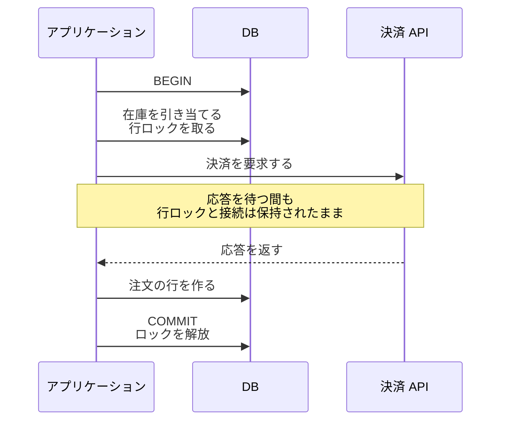
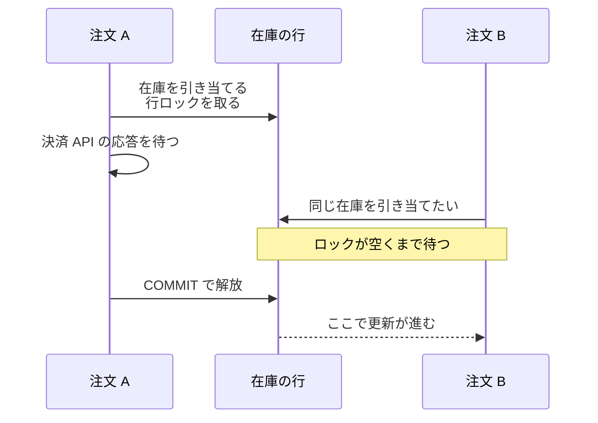
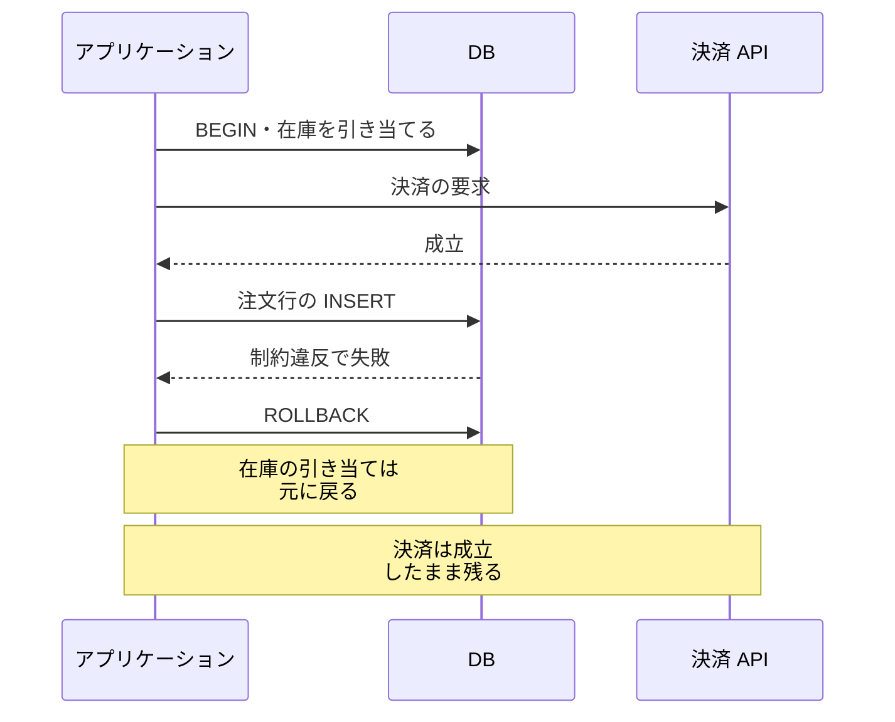
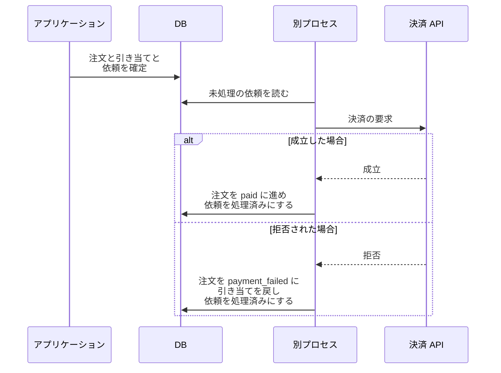

Transaction Scope（トランザクションの範囲）は、`BEGIN` から `COMMIT` までの間にどの処理を入れるかの決め方です。失敗したら全部戻したい処理をまとめて入れる箱ではありません。範囲を広げるほど DB 接続を長く保持し、早い段階で取った行ロックも後続処理の間ずっと保持する事になります。

この決め方が必要なのは、1 つの要求で 2 つ以上の書き込みが必要になり、`BEGIN` と `COMMIT` をどこに置くか選ぶ時です。どこまでを 1 つのトランザクションに入れるかは、書いた本人が決めます。DBMS（Database Management System）は指定された範囲をそのまま守るだけで、その範囲が広すぎるとは教えてくれません。

範囲が問題になる場面の代表は、外部システムの呼び出しが途中に挟まる処理です。在庫を引き当て、決済 API を呼び、注文の行を作る、という 3 つの処理があるとします。どれかが失敗したら全部無かった事にしたいので、3 つをまとめて 1 つのトランザクションで囲みたくなります。

本ノートでは PostgreSQL の挙動を基本に説明します。複数の行を違う順序でロックして互いに待つ状態は [Deadlock](../deadlock/)、他のトランザクションの変更がどこまで見えるかを定める分離レベルは [Transaction Isolation](../transaction-isolation/)、複数の DB にまたがる確定は [2PC（Two-Phase Commit、2 相コミット）](../../distributed-systems/two-phase-commit/) の題材とします。

3 つの処理を 1 つのトランザクションに入れた形を以下に示します。以降で問題にするのはこの形です。

この形では、決済 API の応答時間がそのままロックの保持時間に足されます。以降では、保持している間に何が起きるのかと、外部の呼び出しをどこに出すのかを見ます。

---

### なぜトランザクションを広げると困るのか

行を更新すると、DBMS はその行にロックを取ります。行ロックは通常、トランザクションが終わるまで保持されます。セーブポイント（トランザクションの途中に置く戻り先）を置いた後に取得したロックは、そのセーブポイントまで巻き戻した場合にも解放されます。保持している間に待たされるのは、同じ行を更新しようとしたトランザクションと、`SELECT ... FOR UPDATE` のように競合するモードのロックを取ろうとしたトランザクションです。ロックを伴わない通常の `SELECT` は、この行レベルロックでは待ちません。

PostgreSQL のドキュメントには、「[Row-level locks are released at transaction end or during savepoint rollback, just like table-level locks](https://www.postgresql.org/docs/current/explicit-locking.html)」（行レベルのロックは、表レベルのロックと同じく、トランザクションの終了時かセーブポイントの巻き戻し時に解放される）と書かれています。その結果、ロックを取った後に入れた処理が長いほど、競合した書き手の待ち時間も長くなります。

決済 API をトランザクションの中で呼んだ場合に、後続がどこで止まるのかは、以下の通りです。

上記の図の注文 B の待ち時間は、注文 A がロックを解放するまでの時間に引っ張られます。トランザクションの中に決済 API の待ち時間を入れると、その外部システムの遅延まで待ち時間に加わります。待ちを打ち切るかどうかは設定で決まり、PostgreSQL の `lock_timeout` は既定では無効になっています。影響はロックだけに留まりません。トランザクションを開いている間は、DB への接続も 1 本占有します。

接続の占有は、接続プールを使う言語では特に見えにくい形で効きます。Go の `database/sql` のドキュメントは、「[Once DB.Begin is called, the returned Tx is bound to a single connection](https://pkg.go.dev/database/sql)」（DB.Begin を呼ぶと、返された Tx は 1 本の接続に結び付けられる）と書いており、その接続がプールに戻るのは `Commit` か `Rollback` の後です。

外部 API の応答が数秒に伸びると、その間ずっと 1 本を握ります。上限まで接続が埋まると、その注文と関係のない処理まで接続を取れずに待ちます。

開いたままのトランザクションは、[古い行バージョンを `VACUUM` が回収できる時点](https://www.postgresql.org/docs/current/routine-vacuuming.html)を遅らせ、表の膨張につながる事があります。PostgreSQL は [`idle_in_transaction_session_timeout` の説明](https://www.postgresql.org/docs/current/runtime-config-client.html)で、開いたトランザクションがあると、そのトランザクションにはまだ見える可能性のある古い行バージョンを `VACUUM` が除去できず、長く続けば表の膨張につながると説明されています。どこまで遅れるかは分離レベルとスナップショットの持ち方で変わるので、[Transaction Isolation](../transaction-isolation/) に譲ります。

---

### 外部 API の呼び出しはロールバックで戻らない

外部 API をトランザクションの中で呼ぶと、待ち時間に加えて、DB を巻き戻しても外部で起きた事は戻らない、という問題が出ます。トランザクションを中止すれば、その中で書いた行は元に戻ります。戻る対象は DB の中だけです。

決済が成立した後で、注文行の `INSERT` が制約違反で失敗した場合の流れは以下の通りです。

上記の図の `ROLLBACK` で在庫の引き当ては消えます。利用者から見ると、代金を払ったのに注文が残っていない状態になります。取り消すには、アプリケーションから補償の要求（返金や決済の取り消し）を明示的に送る事になります。

外部の副作用が戻らないのと似た問題が、DB の内側にも 1 つあります。`COMMIT` がエラーを返した場合は、上記の図ほど単純になりません。DB サーバが確定を終えた後、成功の応答を返す途中で接続が切れる事があり、アプリケーションからは確定できたのかどうかを判断できません。

そのため、`COMMIT` のエラーを未確定と決め付けて処理をやり直すと、確定済みの更新に二重に反映される場合があります。確かめるには、注文 ID や処理 ID のように、トランザクションを始める前に生成した一意なキーで結果を読み直し、この試行が確定しているかを見ます。既存の行を `UPDATE` するだけの処理では、行の有無を見ても判断できないので、そのキーを更新の中に残しておく事になります。

---

### 決済の依頼を DB に残してから呼ぶ

トランザクションを DB の更新だけに絞り、決済の呼び出しを確定の後に置くと、保持時間は DB の中の処理で決まります。代わりに、確定した直後にプロセスが落ちると呼び出しが漏れます。在庫は引き当てられ、注文の行もあるのに、決済だけが行われていない状態になります。

漏れを別のプロセスに拾わせる方法が、呼ぶべき事を DB の行として残す形です。注文を `pending_payment` の状態で作り、在庫を引き当て、「決済を呼ぶ」という依頼の行を書くところまでを 1 つのトランザクションにします。別のプロセスがその依頼を読んで決済 API を呼び、成立したら注文を `paid` に進めます。

DB の更新と同じトランザクションで配送すべきメッセージを記録し、後から別プロセスが配送する形は [Transactional Outbox](../../distributed-systems/transactional-outbox/) と呼ばれます。ここでは、その配送先を決済 API とした形を使います。

以下が確定と呼び出しを分けた形です。

上記の図の依頼の行は、注文と在庫の更新と同じトランザクションに入ります。そのため、注文と在庫だけが確定して、対応する依頼の記録だけが漏れる状態を避けられます。決済 API を呼んだ後の更新も、注文の状態と依頼の処理済みであるかを同じトランザクションで確定します。片方だけが残ると、依頼の状態と注文の状態が食い違います。

同じ依頼が再送されるのは、決済 API では成立したのに、その結果をローカルの DB に記録する前に別プロセスが落ちた場合です。依頼は未処理のまま残るので、次に読んだ時にもう一度送られます。後で冪等性が必要なのは、この経路があるからです。

残高不足やカードの拒否で決済が成立しない事は珍しくないので、拒否された時の行き先も先に決めます。上記の図では注文を `payment_failed` に進め、引き当てた在庫を戻しています。巻き戻しで消すのではなく、失敗も状態として残す形になります。

以下が 3 つの置き方の性質です。

| 置き方 | ロックと接続の保持時間 | 失敗した時に残るもの |
| --- | --- | --- |
| トランザクションの中で呼ぶ | 相手の応答時間が加わる | 巻き戻しても外部の副作用が残る |
| 確定してから呼ぶ | DB の中の処理で決まる | 確定と呼び出しの間で落ちると呼び出しが漏れる。呼び出し結果が不明な場合は再試行で重複し得る |
| 依頼を同じトランザクションで記録し、別プロセスが呼ぶ | DB の中の処理で決まる | 記録が残るため後から拾えるが、API の成功と依頼の処理済み化の間で落ちると再送される |

再送を安全に扱うには、同じ依頼を呼び出し先で冪等（べきとう、idempotent）に扱える仕組みが必要です。ここでの冪等は、同じ要求を繰り返しても、業務上の効果が 1 回分を超えて増えない性質です。決済 API であれば、要求ごとに一意な鍵（idempotency key）を添えて、同じ鍵の 2 度目の要求では課金を増やさない形が使われます。

依頼を記録するだけでは、配送そのものは進みません。成功を確認できるまで未処理の依頼を再試行する形にすると、同じ依頼が複数回配送される可能性があります。重ねて届いた要求を安全に扱えるかどうかは、呼び出し先の冪等性にも依存します。

---

### 利点

- 行ロックの保持時間が DB の中の処理で決まり、相手のシステムの遅延に左右されなくなる
- 応答待ちで DB 接続を握らないので、同時に捌ける件数が接続の本数で頭打ちになりにくい
- 巻き戻す対象が DB の中だけになり、外部の副作用は補償という別の手段で扱うと決められる
- 依頼を DB に残す形なら、確定した仕事はプロセスの停止だけでは失われない

---

### 欠点

以下は、1 つのトランザクションで囲む範囲を狭めた結果として現れる制約です。

- 注文が `pending_payment` のまま残る時間が生まれ、その状態を画面と集計の両方で扱う事になる
- 依頼を別プロセスに預けると、業務と直接関係のない表とプロセスを運用し続ける事になる
- 呼び出し先が重複排除に使える識別子や仕組みを提供していない場合は、ローカルの DB だけで重複した外部の副作用を完全に防ぐ事はできない。結果の照会や業務上の一意キー、補償処理などを組み合わせて扱う
- 外部の失敗を巻き戻しではなく、注文の状態遷移として設計し直す事になる

---

### トランザクションを短くしても残るケース

- 複数の行を更新する処理どうしが、違う順序でロックを取る場合
- 画面の表示から更新までの間に人の操作を挟む更新
- 同じ行への更新が集中していて、範囲を狭めても待ちが積み上がる場合
- 読んだ値をもとに書き戻す処理で、同時実行の異常が結果に現れる場合

1 つ目は、範囲を狭めても消えません。2 本のトランザクションが同じ 2 行を逆の順で更新すると、互いの解放を待ってどちらも進まなくなります。この形と、順序を揃える方法は [Deadlock](../deadlock/) で扱います。

2 つ目は、人の操作を待つ間はトランザクションを開いたままにせず、表示時から値が変わっていないかを更新時に検査します。読んだ時のバージョン番号を更新条件に入れ、値が変わっていたら弾く方法（楽観ロック）が使われます。画面を開いている時間はアプリケーション側で決められないので、その間の行ロックを DB に預けない、という範囲の判断になります。3 つ目は範囲ではなく、更新が特定の 1 行に集中している事の問題なので、更新を 1 行に集めない設計に変える判断が必要です。4 つ目の異常と分離レベルの関係は [Transaction Isolation](../transaction-isolation/) の題材です。
