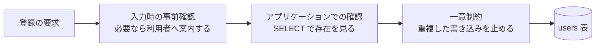
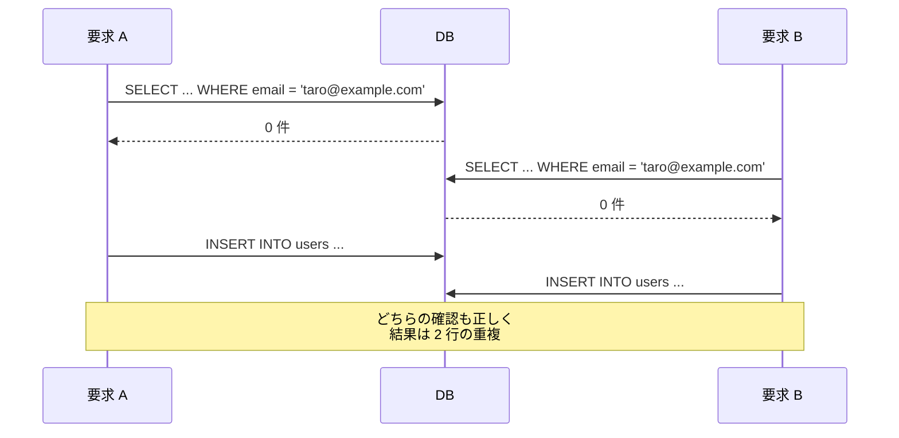
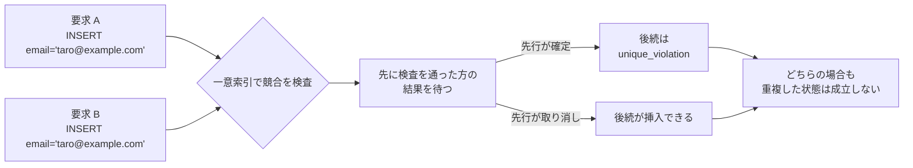
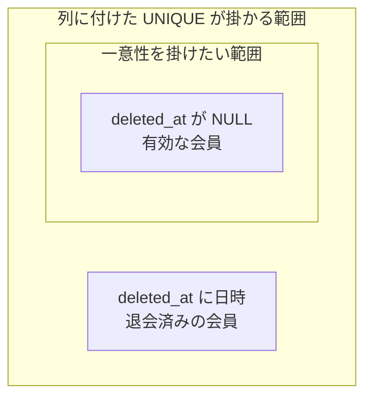
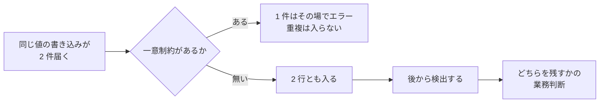

一意制約（unique constraint）は、ある列、または複数の列の組に入っている値が表の中で重複しない事を DB（データベース）に保証させる仕組みです。SQL では、列の定義へ `UNIQUE` を書くか、表に対して `UNIQUE (列名, ...)` を書いて宣言します。

PostgreSQL のドキュメントは、この制約が[「ensure that the data contained in a column, or a group of columns, is unique among all the rows in the table」（1 つの列、または複数の列の組に入っているデータが、表の全ての行の中で一意である事を保証する）物だと説明しています](https://www.postgresql.org/docs/current/ddl-constraints.html)。

この制約が必要になる場面の代表は、会員登録のメールアドレスです。同じアドレスで 2 件のアカウントができると、パスワード再設定のメールがどちらへ届くのかが決まらず、問い合わせを受けた時にどちらが本人の物かも判定できません。重複を消して片方へ寄せる作業は、後になるほど難しくなります。

本ノートで、説明する範囲も決めておきます。ここでは、1 つの表の中で値を重複させない制約を扱い、以降の SQL は PostgreSQL の構文で書きます。重複を止められる場所を以下に示します。



上図の前の 2 つは、重複を早く見付けるために使えます。一意制約は、並行する書き込みを含めて、重複した状態が表へ確定するのを最後に止めます。ここで扱うのは一意制約です。制約を伴わない一意索引や排他制約のように、同じ位置で止める仕組みは他にもあります。

---

### なぜ存在確認してから INSERT しても重複するのか

アプリケーションで重複を防ぐ素直な書き方は、`SELECT` で同じ値の行を探し、無ければ `INSERT` する手順です。1 件ずつ順番に処理される限り、この手順は正しく動きます。壊れるのは、同じ値を持つ要求が同時に届いた時です。

2 つの要求が重なった時の順序を以下に示します。



確認した時点ではまだ相手の行が無く、`INSERT` を出す時点では相手が入っています。読み取りが指す状態と書き込みが置かれる状態が別の時点になるので、間に入った挿入を検知できません。要求の数が増えるほど、この重なりが起こる機会も増えます。

分離レベルという設定を上げれば、この競合を止められる場合もあります。ただし、止まるかどうかは設定と実装で変わり、表の定義を見ただけでは分かりません。「`users.email` は表の中で重複しない」という業務上の要求を宣言する物でもありません。分離レベルそのものは [Transaction Isolation](../transaction-isolation/) のノートで扱っています。

`SELECT` による確認を消す必要はありません。必要に応じて利用者へ早く案内する、重複の理由を業務の言葉で説明する、といった役割はこの確認にしか果たせません。ただし、それは利用者への案内であって、一意性の保証ではありません。

---

### 一意制約が競合を 1 件へ絞る

一意制約は、書き込みそのものを検査の対象にします。PostgreSQL では、一意制約を足すと、対象の列または列の組に対する一意索引が自動で作られます。索引とは、列の値と、その値を持つ行の位置を並べて持つ補助の構造です。以降は、PostgreSQL の既定である `NOT DEFERRABLE` な一意制約を前提にします。

一意索引は、同じキーを持つ複数の有効な行が同時に成立しないよう検査します。`INSERT` の際に一意索引を使って競合する行を検査し、相手の状態に応じて待機するか、一意制約違反として書き込みを止めます。アプリケーションが書く `SELECT` は値を読むだけで、その値を自分のために取っておく訳ではありません。索引の構造は [B-Tree](../b-tree/) のノートで扱っています。

同じ値の `INSERT` が同時に走った時に何が起きるのかを以下に示します。



上図で重要なのは、どちらが成功するかではなく、重複した状態が成立しない点です。後から来た方は、競合する相手がまだ確定していなければ結果を待ちます。相手が確定すれば重複として弾かれ、取り消されていれば挿入できます。

失敗した方には、一意制約に違反したというエラーが返ります。SQLSTATE は、SQL のエラーに付く 5 文字の符号です。PostgreSQL は、この違反へ [`23505`（`unique_violation`）を割り当てています](https://www.postgresql.org/docs/current/errcodes-appendix.html)。アプリケーションは、この符号を見て「メールアドレスの重複」という業務上のエラーへ変換できます。利用者へどこまで理由を明示するかは、画面や API の要件に合わせて別に決めます。

この経路を想定外の失敗として扱い、HTTP の 500 を返す実装にすると、業務のエラーとして返せる要求まで障害になります。同じ値の登録が同時に届くのは、異常な事態ではありません。

---

### 組み合わせで一意にする複合 UNIQUE

一意にしたい単位は、1 つの列とは限りません。外部の認証サービスと利用者を結び付ける表では、「同じ利用者が同じサービスを 2 回登録できない」という制約になります。列を並べて書くと、その組み合わせに対して一意性が掛かります。

```sql
CREATE TABLE users (
    id    BIGINT PRIMARY KEY,
    email TEXT NOT NULL UNIQUE
);

CREATE TABLE identities (
    user_id  BIGINT NOT NULL REFERENCES users (id),
    provider TEXT   NOT NULL,
    subject  TEXT   NOT NULL,
    UNIQUE (user_id, provider)
);
```

`users` の `id` に付けた `PRIMARY KEY` は、`UNIQUE` と `NOT NULL` を合わせた制約に加えて、その列をその表の代表的な識別子として宣言します。一意制約は 1 つの表へ何本でも置けます。`PRIMARY KEY` は 1 つだけです。`UNIQUE (user_id, provider)` で何が入って何が弾かれるのかを以下に示します。

| user_id | provider | 結果 |
| --- | --- | --- |
| 1 | github | 1 行目として入る |
| 1 | google | 入る。`provider` が違う |
| 2 | github | 入る。`user_id` が違う |
| 1 | github | 弾かれる。組み合わせが 1 行目と同じ |

制約を `UNIQUE (user_id)` にすると、1 人の利用者は 1 つのサービスしか登録できなくなります。逆に `UNIQUE (provider)` にすると、そのサービスを使えるのが全体で 1 人だけになります。一意性の制約として決めるのは、どの列の組を 1 つの単位と見なすかです。

列を並べる順序は、この判定を変えません。`UNIQUE (user_id, provider)` と `UNIQUE (provider, user_id)` は、重複と見なす行が同じになります。順序が効いてくるのは、自動で作られた複合索引を検索にも使う場合で、どの列を先頭へ置くのが良いかは検索の条件との組み合わせで決まります。

同じ表へ別の一意制約を重ねる事もできます。`identities` に `UNIQUE (provider, subject)` を足せば、外部のサービスが持つ利用者の識別子 1 つに対して、`users` の行を 1 つへ限定できます。

---

### 一意性に穴が空く NULL と論理削除

1 つ目の穴は `NULL` です。PostgreSQL は既定で 2 つの `NULL` を等しいと見なさないので、`email` に一意制約を張っても `email` が `NULL` の行は何行でも入ります。`NULLS NOT DISTINCT` を付ければ重複として扱えます。この扱いは DBMS（Database Management System）ごとに割れるので、[NULL](../sql-null/) のノートで扱っています。

もう 1 つの穴は、行を消さずに「削除済み」の印を付ける設計です。例えば `deleted_at` という列を足し、退会した時に日時を入れて、有効な会員は `NULL` のままにします。制約は削除済みの行にも掛かるので、一度退会した会員と同じアドレスでは再登録できません。設計そのものの是非は [Soft Delete](../soft-delete/) のノートで扱っています。

どちらも、一意性を掛けたい範囲と、制約が実際に掛かる範囲がずれる形です。範囲のずれを以下に示します。



上図の内側が掛けたい範囲で、外側が実際に掛かる範囲です。有効な会員だけへ一意性を掛けたい場合、PostgreSQL では索引に載せる行を条件で絞れます。列に付けた `UNIQUE` を外し、退会した日時を持つ列を足した上で置き換えます。

```sql
ALTER TABLE users DROP CONSTRAINT users_email_key;
ALTER TABLE users ADD COLUMN deleted_at TIMESTAMPTZ;

CREATE UNIQUE INDEX users_email_active_idx
    ON users (email)
    WHERE deleted_at IS NULL;
```

この部分索引は `deleted_at` が `NULL` の行だけを対象にします。退会済みの行と同じアドレスで新規に登録でき、有効な会員どうしでの重複は防げます。裏返すと、条件から外れた行は縛られないので、退会済みの行どうしでは同じアドレスが何行でも並びます。

部分索引は全ての DBMS にある機能ではないので、手元の DBMS で同じ事を書けるかはドキュメントで確かめる事になります。

---

### ON CONFLICT で衝突した時の動作を決める

一意制約に違反した `INSERT` は、既定ではエラーになります。エラーを受けてから、衝突した既存の行へ `UPDATE` を投げ直す方法も考えられます。ただし PostgreSQL では違反でトランザクションが中断するので、SAVEPOINT を張るか、トランザクションを分け直す必要があります。分け直せば、その 2 文の間にまた競合が入ります。PostgreSQL の `ON CONFLICT` 句は、この往復を避けて、衝突した時の動作を `INSERT` の中で決める書き方です。

ドキュメントは、この句が[一意制約違反または排他制約違反のエラーを起こす代わりの動作を指定する物だと説明しています](https://www.postgresql.org/docs/current/sql-insert.html)。書ける動作は 2 つです。

| 指定 | 衝突した行への動作 | 使う場面 |
| --- | --- | --- |
| `DO NOTHING` | 挿入しない。エラーにもしない | 既にあるなら、そのままでよい |
| `DO UPDATE` | 衝突した既存の行を更新する | 最新の値で上書きしたい |

```sql
INSERT INTO users (id, email) VALUES (5, 'taro@example.com')
ON CONFLICT (email) WHERE deleted_at IS NULL DO NOTHING;

INSERT INTO identities (user_id, provider, subject)
VALUES (1, 'github', 'u-123')
ON CONFLICT (user_id, provider) DO UPDATE
    SET subject = EXCLUDED.subject;
```

`ON CONFLICT` の括弧に書くのは制約の名前ではなく列で、そこからどの一意索引を調停に使うのかが推論されます。制約の名前で指定する `ON CONSTRAINT` の形もあります。`DO UPDATE` ではこの指定が必要です。`DO NOTHING` では省けます。省いた場合は、一意制約や一意索引など `ON CONFLICT` が競合判定に使える全ての対象について、衝突した行を挿入しません。

`EXCLUDED` は挿入しようとした行を指す名前で、上の例では新しい `subject` を既存の行へ書き戻しています。`users` の一意性は部分索引へ置き換えてあるので、`ON CONFLICT` にも索引と同じ条件を添えます。条件を落とすと、どの索引との衝突なのかが決まらず、`INSERT` はエラーになります。

`DO NOTHING` を選ぶのは、競合した時に既存の行をそのまま採用してよい場合です。`DO UPDATE` は、既存の行を新しい値で更新してよい場合になります。どちらを選ぶかは、その競合を業務としてどう解釈するかで決まります。競合そのものを異常と見なし、エラーのまま扱う方が正しい場合もあります。

---

### 利点

- 経路や実装によらず、重複した行そのものが表へ入らない
- 競合した書き込みが同時に届いても、成立するのは 1 件だけになる
- 一意にしたい単位が、列の組として表の定義に残る
- 一意索引が作られるので、その列での検索も引きやすくなる

---

### 欠点

以下は、重複の判定を DB へ寄せた結果として現れる制約です。

- 書き込みのたびに検査が入り、索引の維持と合わせて書き込みの負担が増える
- 一意にする単位を後から変えると、既存の重複を片付けるまで制約を張れない
- 制約に違反した時のエラーは、アプリケーションが業務の言葉へ変換する必要がある
- 表をまたぐ重複や、表記ゆれを含んだ重複には掛からない

4 つ目は、一意制約が DB の比較した結果だけを見る事から来ます。通常の `text` へ張った一意制約では、`Taro@example.com` と `taro@example.com` を別の値として扱う構成になります。一意制約が働く相手は、業務として同じと見なしたい値ではなく、DB が比較する値です。必要なら、その手前で正規化するか、比較の方法を決める事になります。

---

### UNIQUE を張らない場合、誰が重複を止めるのか

一意制約を置かない構成もあります。代表的なのは、重複が業務の要求として許される場合と、重複を後から人が判断して寄せる運用にしている場合です。同じ氏名の会員や、同じ件名の問い合わせは、重複していても誤りではありません。

判断が要るのは、重複を許さないつもりでいながら制約を書いていない場合です。この時に重複を止める担当は、DB の外へ移ります。移し先は、代表的には次の 3 つです。

- 書き込みの経路を管理下へ寄せ、その全部で同じ確認を通す
- 重複を定期的に検出し、業務の判断でどちらを残すかを決める
- 重複した行がある前提で読み、表示や集計を組み立てる処理でそれらを 1 件へ畳む

1 つ目は、「なぜ存在確認してから INSERT しても重複するのか」で見た通り、経路をそろえても競合の隙間が残ります。2 つ目と 3 つ目は、重複が生まれる事を止めずに、後から辻褄を合わせる方針です。制約の有無で、辻褄を合わせる場所がどこへ移るのかを以下に示します。



上図の「後から検出する」へ進む経路では、判断を下すまでの間、重複した行を読んだ集計や通知が出続けます。どちらを残してよいのかは表の外にある業務の要求で決まるので、機械的には片付きません。重複は、長ければ検出を回す間隔のあいだ残り続けます。

一意にしたい単位が業務の要求として決まっているなら、その宣言は表の定義に置けます。画面での案内もアプリケーションでの確認も、利用者を待たせずに気付かせるためには要ります。ただし、それらは重複を減らす装置であって、重複を止める装置ではありません。最後に止める場所を決めていない設計は、止まらなかった時に誰が直すのかも決めていない設計になります。
