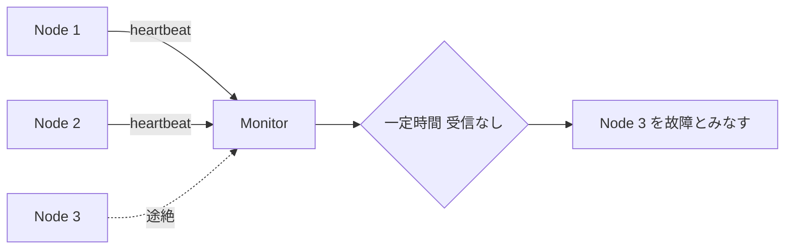
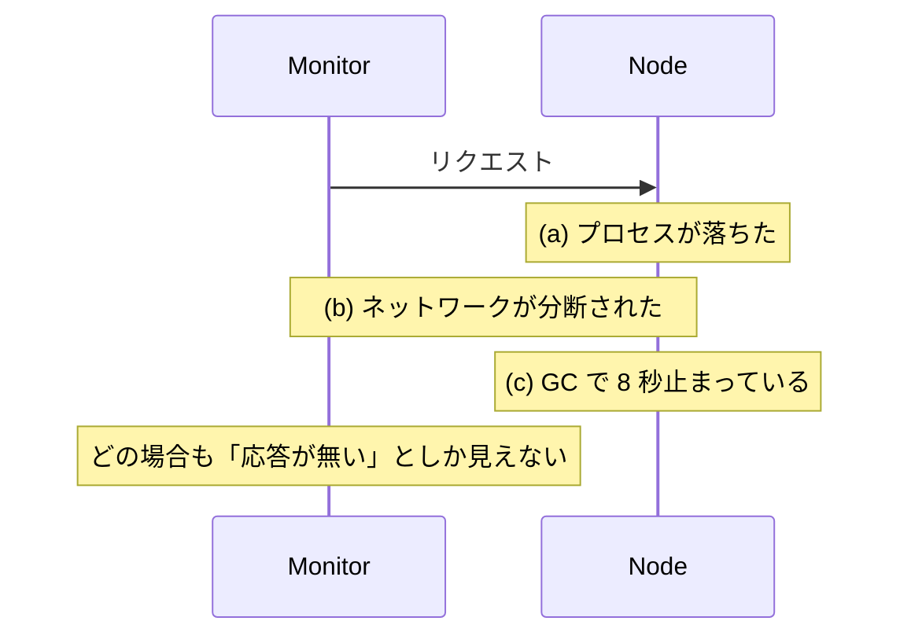
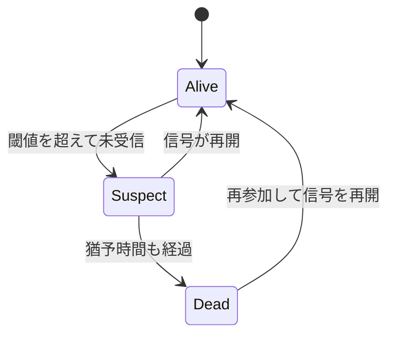

ハートビート（heartbeat）は、ノードが「自分は生きている」という短い信号を一定間隔で送り続け、受け取る側がその途絶をもって障害と判断する仕組みです。

分散システムでは、あるノードが応答しない理由を外から確定できません。プロセスが落ちたのか、ネットワークが詰まっているのか、単に処理が重いだけなのか、観測できるのは「応答が返ってこない」という一点だけです。ハートビートは、この曖昧さを「一定時間内に信号が来たか」という判定可能な形へ落とし込んでいます。

登場人物と信号の向きを以下に示します。監視される側が能動的に送る push 型が基本形です。

上図の点線部分が途絶えた信号を表し、Monitor は信号の不着を手がかりに Node 3 の故障を判断します。「故障しました」という報告が届くのではなく、「何も届かない事」が情報になる点がハートビートの本質です。落ちたノードは自分が落ちた事を報告できないので、これ以外に手がありません。

---

### なぜハートビートが必要なのか

障害を検知できないクラスタは、壊れたノードへ仕事を送り続けます。

その結果、リーダーが落ちても誰も代わりに立たず、書き込みが止まったままになります。レプリカが落ちてもシャードの再配置が始まらず、冗長度が下がった事に誰も気付きません。ロードバランサは死んだバックエンドへリクエストを流し続けます。障害を検知できれば、復旧処理を開始できます。

ハートビートの代案として、TCP の接続断が候補になるのではないかと考える方がいるかもしれません。しかし、TCP 接続監視では適切に障害を検知できないケースがあります。例えば、プロセスが生きていてもデッドロックや GC の長時間停止で応答しなくなる事があり、その間ソケットは正常に開いたままです。経路上のファイアウォールやロードバランサが黙ってパケットを捨てると、送信側は接続が切れた事に長い間気付けません。

応答が無いときに Monitor から見える現象を以下に示します。

3 つのケースは原因も対処も違うのに、Monitor から見える現象は同じです。非同期ネットワークでは「遅いだけのノード」と「落ちたノード」を確実に見分けられません。これは実装の工夫で解決できません。

実用的な障害検知は「確実に見分ける」を諦め、「一定時間待って来なければ落ちたとみなす」と割り切ります。ハートビートは、最小のコストで割り切りを実現しています。

---

### 仕組み

構成要素は、送信間隔・タイムアウト・状態遷移の 3 つだけです。

ノードは間隔 `T` ごとに信号を送り、監視側は最後に受信した時刻からの経過が閾値を超えたら故障とみなします。閾値は間隔の数倍に取るのが通常で、1 回や 2 回の取りこぼしで故障扱いにしないための余裕を持たせます。

#### push 型と pull 型

監視される側が送るか、監視する側が取りに行くかで 2 通りあります。

| | push 型 | pull 型 |
| --- | --- | --- |
| 信号の向き | ノード → 監視側 | 監視側 → ノード |
| 代表例 | Raft の `AppendEntries`、Cassandra の gossip | Kubernetes の liveness probe、Prometheus の scrape |
| ノード追加時 | ノード側が宛先を知る必要がある | 監視側が対象一覧を持つ必要がある |
| 検知できる範囲 | ノードが動いている事 | ノードが要求に応答できる事 |

pull 型は「応答を返せるか」まで確認するため、プロセスは生きているが処理が詰まっている状態を検出できます。その一方で、監視対象の一覧を管理側が持つ必要があり、ノードが動的に増減する構成では管理が重くなりがちです。

#### 状態遷移

二値（生きている／死んでいる）で扱うと、一時的な遅延で即座に故障扱いになります。多くの実装は間に猶予の状態を挟みます。

Suspect は「怪しいが、まだ復旧を始めない」段階です。ここで即座にリーダー再選出やデータ再配置を走らせると、実際には生きていたノードのために無駄な負荷が生じます。SWIM は、この段階で他のノードへ代理の ping を頼む方式です。監視側から 1 本の経路で届かなくても、別のノードを経由すれば応答が返る事があります。複数の視点で確認してから故障を確定させる事で、経路の一時的な不調による誤検知を減らします。

#### タイムアウトの決め方

閾値の設定は、検知の速さと誤検知率のトレードオフになります。

| 閾値 | 検知の速さ | 誤検知 | 向く状況 |
| --- | --- | --- | --- |
| 短い（間隔の 2〜3 倍） | 速い | 増える | 同一データセンタ内、遅延が安定している |
| 長い（間隔の 5〜10 倍） | 遅い | 減る | 拠点をまたぐ、遅延のばらつきが大きい |

固定値を決めきれない環境では、Phi Accrual Failure Detector のように「疑わしさ」を連続値で出す方式もあります。過去の到着間隔の分布から「今この時点で未着である事の異常さ」を数値化し、閾値を利用側が選びます。

Phi Accrual Failure Detectorは、直近のハートビート到着間隔を記録して分布を推定し、「最後の受信からの経過時間が、その分布から見てどれだけ外れているか」を `phi` という 1 つの数値で表します。`phi` は「今ここで故障と判断した場合に、それが誤りである確率」の常用対数を反転した値になっており、`phi = 1` で誤判断の確率が 10%、`phi = 2` で 1%、`phi = 3` で 0.1% という対応です。

利用側は許容できる誤検知率から閾値を決められ、同じ検知器の上で「警告は `phi = 5`、クラスタからの切り離しは `phi = 8`」のように複数の閾値を使い分けられます。遅延のばらつきが大きい環境では固定閾値より扱いやすいと考えられます。

---

### 利点

- 実装が小さい。定期送信と最終受信時刻の比較だけで成立する
- 落ちたノードが自己申告できないという制約に対し、信号の不在で回避できる
- 通信量が予測できる。ノード数と間隔から一定に見積もれる
- 既存の通信に相乗りできる。データ複製のための通信をそのまま兼用する実装が多い

---

### 欠点

- 遅いノードと落ちたノードを区別できない。誤検知を完全には無くせない
- 検知が必ず遅れる。閾値の分だけ、障害発生から気付くまでに時間が空く
- 相互監視の構成では通信量が `O(n^2)` に膨らむ
- 信号が届く事しか保証しない。ディスクが壊れて読み書きに失敗していても、応答さえ返れば健全と判定される

通信量の問題は、相互監視の構成を避けて解決します。gossip 方式では各ノードがランダムに選んだ少数のノードとだけ情報を交換し、故障の情報がクラスタ全体へ伝播します。1 ノードあたりの負荷はノード数にほぼ依存しなくなります。

---

### 適さないケース

- 秒未満の検知が要求される場面。閾値を詰めると誤検知が跳ね上がる
- 拠点をまたぐ広域構成で、閾値を短く保ちたい場合。往復遅延のばらつきがそのまま誤検知になる
- ノードが数万台に及ぶ構成での中央集約型。監視側が単一障害点になるため、gossip 方式へ切り替える
- 処理の正しさまで担保したい場合。ハートビートは応答の有無しか見ておらず、計算結果の正しさは別の仕組みで検証する

---

### 似た仕組みとの比較

障害検知の周辺には、目的の近い仕組みがいくつかあります。

| | Heartbeat | Lease | Gossip | Phi Accrual |
| --- | --- | --- | --- | --- |
| 主な目的 | 生存の確認 | 権利の期限付き付与 | 情報の伝播 | 疑わしさの数値化 |
| 出力 | 生／死の二値 | 有効／失効 | 各ノードの認識 | 連続値 |
| 通信量 | `O(n)` 〜 `O(n^2)` | `O(n)` | `O(n log n)` 程度 | Heartbeat と同じ |
| 代表例 | Raft, kubelet | Chubby, etcd の lease | Cassandra, Serf | Cassandra, Akka |

Lease はハートビートと対比されがちですが、目的が違います。ハートビートが「生きているか」を問うのに対し、Lease は「この期限まで、あなたがリーダーである権利を与える」という契約です。期限切れの判断が権利保持者の側でも行える点が重要で、分断された旧リーダーが自分で権利を手放せるため、二重リーダーを防ぎやすくなります。実装ではハートビートで Lease を更新する事が多く、両者は競合せずに重なります。
