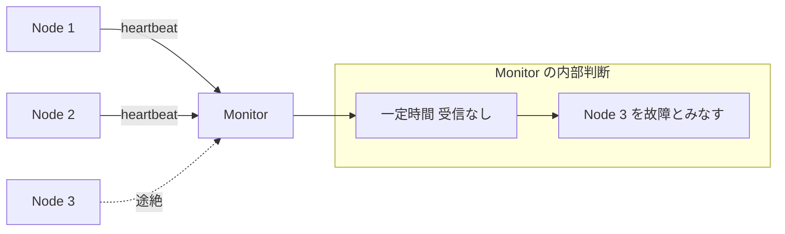
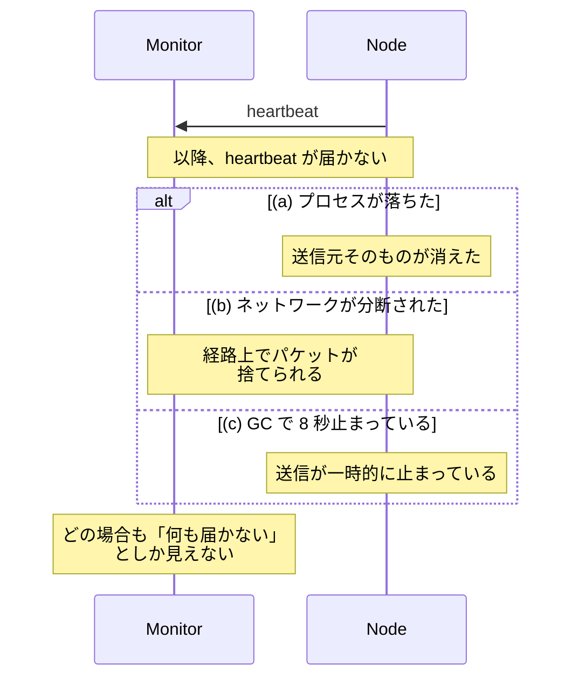
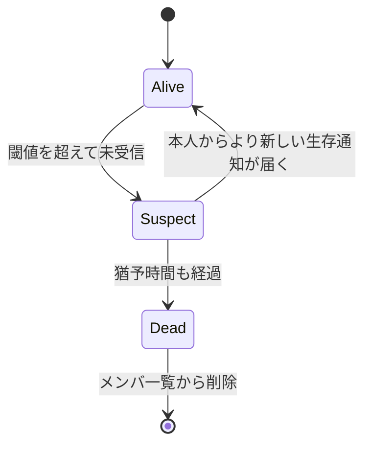

ハートビート（heartbeat）は、ノードが「自分は生きている」という短い信号を一定間隔で送り続け、受け取る側がその途絶をもって障害と判断する仕組みです。ここでは、ノードが停止する故障だけを扱います。誤った値を返す故障（ビザンチン障害）の検知は、ハートビートの範囲外です。

分散システムでは、あるノードが応答しない理由を外から確定できません。プロセスが落ちたのか、ネットワークが詰まっているのか、単に処理が重いだけなのか、観測できるのは「応答が返ってこない」という一点だけです。ハートビートは、この曖昧さを「一定時間内に信号が来たか」という判定可能な形に落とし込んでいます。

登場人物と信号の向きを以下に示します。監視される側から送る形が基本です。

上記の図の点線部分が途絶えた信号を表し、Monitor は信号の不着を手がかりに Node 3 の故障を判断します。「故障しました」という報告が届くのではなく、「何も届かない事」が情報になる点がハートビートの本質です。落ちたノードは自分の停止を報告できないため、信号の不在を手がかりにする以外の方法がありません。

---

### なぜハートビートが必要なのか

障害を検知できないクラスタは、壊れたノードに仕事を送り続けます。

その結果、ロードバランサは死んだバックエンドにリクエストを流し続けます。書き込みを 1 台に集約する構成では、その 1 台（リーダー）が落ちても誰も代わりに立たず、書き込みが止まったままになります。同じデータの複製（レプリカ）が落ちても作り直しが始まらず、残った 1 台が壊れたらデータそのものが失われます。障害を検知できれば、復旧処理を開始できます。

ハートビートの代案として、TCP の接続断が候補になるのではないかと考える方がいるかもしれません。しかし、TCP 接続監視では適切に障害を検知できないケースがあります。TCP は接続を保ったまま通信する規約なので、切断を検知すれば故障が分かるように見えます。

ただし、プロセスが生きていてもデッドロックや GC（Garbage Collection）の長時間停止で応答しなくなる事があり、その間ソケットは正常に開いたままです。経路上のファイアウォールやロードバランサが黙ってパケットを捨てると、送信側は接続が切れた事に長い間気付けません。

信号が途絶えたときに Monitor から見える現象は以下の通りです。3 つの分岐は同時に起きるのではなく、どれか 1 つが起きている状況を表します。

上記の図の 3 つのケースは原因も対処も違うのに、Monitor から見える現象は同じです。非同期ネットワーク（メッセージの遅延に上限を置かないモデル）では、「遅いだけのノード」と「落ちたノード」を確実に見分けられません。遅いだけのノードには、いつ返事が来るかの上限がありません。上限が無い以上、何秒待っても「まだ遅いだけ」という可能性が残ります。これは実装の工夫で解決できません。

実用的な障害検知は「確実に見分ける」を諦め、「一定時間待って来なければ落ちたとみなす」と割り切ります。ハートビートは、最小のコストで割り切りを実現しています。

---

### 構成要素と監視の形

構成要素は、送信間隔・タイムアウト・状態遷移の 3 つだけです。

ノードは間隔 `T` ごとに信号を送り、監視側は最後に受信した時刻からの経過が閾値を超えたら故障とみなします。閾値は間隔の数倍に取るのが通常で、1 回や 2 回の取りこぼしで故障扱いにしないための余裕を持たせます。具体的には、1 秒ごとに信号を送り、5 秒間受信が無ければ故障とみなす設定です。

監視の形は 2 通りあります。1 台の監視役が全ノードを見る中央集約型と、各ノードが互いを見る相互監視型です。ノード数を `n` とすると、1 周期に流れるメッセージは中央集約型で `n` 本、相互監視型で `n × (n-1)` 本になります。中央集約型は通信量が少ない代わりに、監視役に負荷が集中し、そこが落ちると誰も故障を検知できません。相互監視型は特定の監視役に依存しない一方で、ノードが増えると通信量が急に膨らみます。

---

### push 型と pull 型

監視される側が送るか、監視する側が取りに行くかで 2 通りあります。

| | push 型 | pull 型 |
| --- | --- | --- |
| 信号の向き | ノード → 監視側 | 監視側 → ノード |
| 代表例 | Raft の `AppendEntries` | Kubernetes の liveness probe |
| ノード追加時 | ノード側が宛先を知る必要がある | 監視側が対象一覧を持つ必要がある |
| 信号を作る主体 | 監視される側 | 監視する側の要求に応じて答える |

何を検知できるかは、信号を誰が作っているかで決まります。アプリの本体が信号を作っていれば処理の詰まりまで伝わり、専用のスレッドが作っていれば「プロセスが動いている事」しか伝わりません。この違いは push と pull のどちらでも起こります。pull 型はこれに加えて、監視対象の一覧を管理側が持つ必要があり、ノードが動的に増減する構成では管理が重くなりがちです。

上表の Raft は、リーダーを 1 台選んで全ノードのログを揃える合意アルゴリズムです。ここでは監視される側がリーダー、監視する側がフォロワーになります。リーダーが `AppendEntries` を送り続け、フォロワーは一定時間それが届かない事でリーダーの故障を判断します。同時に、リーダーは送った `AppendEntries` に応答が返るかどうかでフォロワーの生存を知ります。そのため、1 つの通信で両方向の監視が成り立っています。

Kubernetes には両方の形があります。各ノードで動くエージェント（kubelet）が中央の API server 上にある [Lease](../lease/) オブジェクト（期限付きで権利を貸す仕組み）を更新して[ノードの死活を伝える](https://kubernetes.io/docs/concepts/architecture/leases/)のが push、その kubelet が同じノードのコンテナに [liveness probe](https://kubernetes.io/docs/concepts/workloads/pods/pod-lifecycle/) を送るのが pull です。見ている対象が違うため、後者はノード自体の障害を検知できません。

---

### 状態遷移

二値（生きている／死んでいる）で扱うと、一時的な遅延で即座に故障扱いになります。多くの実装は間に猶予の状態を挟みます。

Suspect は「怪しい。ただし、まだ復旧を始めない」段階です。ここで即座にリーダー再選出やデータ再配置を走らせると、実際にはノードが生きているため無駄な負荷が生じます。

[SWIM](https://www.cs.cornell.edu/projects/Quicksilver/public_pdfs/SWIM.pdf)（他ノードに代理確認を頼む方式のプロトコル）は、Suspect に落とす前に他のノードに代理の確認を頼みます。監視側から 1 本の経路で届かなくても、別のノードを経由すれば応答が返る事があります。代理の確認も失敗した場合に限って Suspect とし、猶予時間が過ぎてから故障を確定させます。複数の視点で確認する事で、経路の一時的な不調による誤検知を減らせます。

上記の図の Dead は終端になっています。SWIM では、各ノードが自分の世代番号（incarnation number）を持ち、Suspect と広められたノードは、より大きい世代番号を付けた生存通知でそれを打ち消します。一方、SWIM の論文では、Dead の通知が世代番号に関係なく他の通知を上書きすると決められています。そのため、世代番号を上げても Dead は覆せません。一度 Dead が確定したノードはメンバ一覧から削除され、復帰するには別のメンバとして参加し直します。

---

### タイムアウトの決め方

閾値の設定は、検知の速さと誤検知率のトレードオフになります。

| 閾値 | 検知の速さ | 誤検知 | 向く状況 |
| --- | --- | --- | --- |
| 短い（間隔の 2〜3 倍） | 速い | 増える | 同一データセンタ内、遅延が安定している |
| 長い（間隔の 5〜10 倍） | 遅い | 減る | 拠点をまたぐ、遅延のばらつきが大きい |

閾値を短くしすぎた場合、誤検知より後続の処理が問題になります。生きているリーダーを故障とみなして再選出を始めると、旧リーダーが応答を再開した直後にまた別の再選出が走り、選出を繰り返すだけでクラスタが仕事を進められなくなります。過半数の票を必要としない構成では、分断の両側でそれぞれリーダーが立つ split brain（二重リーダー）も、誤検知を起点として起こります。

過半数を要求する構成では、少数派は票を集められないためリーダーが立ちません。それでも、旧リーダーが自分をリーダーだと思い込んだまま動き続ける状態は残ります。この状態を止めるのは、[Lease](../lease/) のように権利に期限を持たせる仕組みの役目です。

経過時間の計測には、単調増加する時計（monotonic clock）を使います。壁時計は、時刻をネットワーク越しに合わせる NTP（Network Time Protocol）の補正で進んだり巻き戻ったりします。そのまま差分を取ると、補正の分だけ故障判定が早まったり遅れたりします。

---

### 疑わしさを連続値で扱う

固定値を決めきれない環境では、生死の二値ではなく「疑わしさ」を連続値で出す方式もあります。

Phi Accrual Failure Detector は、Hayashibara 氏らが 2004 年に発表した論文「[The φ accrual failure detector](https://dspace.jaist.ac.jp/dspace/handle/10119/4784)」で提案された方式です。直近のハートビート到着間隔を記録して分布を推定し、「最後の受信からの経過時間が、その分布から見てどれだけ外れているか」を `phi` という 1 つの数値で表します。定義は `phi = -log10(P)` です。

最後の受信から `t` 秒が経ったとして、`P` は「到着間隔に当てはめた確率モデルの上で、間隔が `t` 秒より長くなる確率」を表します。言い換えると、信号がまだ届いていないだけで、この後に届く確率です。`phi` が 1 増えるたびに `P` は 1/10 になり、`phi = 1` はモデル上の `P` が 10%、`phi = 2` は 1%、`phi = 3` は 0.1% である事に対応します。これはモデルが実際の遅延分布と一致する場合の値で、現実の障害確率や誤検知率を直接表す値ではありません。

`P` は、過去の到着間隔に分布を当てはめた推定値です。当てはめる分布は実装によって違い、上記の論文と [Akka](https://doc.akka.io/libraries/akka-core/current/typed/failure-detector.html) は正規分布、Cassandra は指数分布を使います。どの分布を選んでも、到着間隔の傾向が急に変わった直後は推定が追いつきません。

利用側は許容できる疑わしさの水準から閾値を決められ、同じ検知器の上で「警告は `phi = 5`、クラスタからの切り離しは `phi = 8`」のように複数の閾値を使い分けられます。遅延のばらつきが大きい環境では固定閾値より扱いやすいと考えられます。

---

### 利点

- 定期送信と最終受信時刻の比較だけで実装できる
- 落ちたノードが自己申告できなくても、信号の不在から検知できる
- 通信量をノード数と間隔から一定に見積もれる
- 既存の通信に相乗りできる。データ複製の通信を兼用する実装が多い

---

### 欠点

以下は、実装の小ささと通信量の予測しやすさを優先した結果として現れる制約です。

- 遅いノードと落ちたノードを区別できず、誤検知を完全には無くせない
- 閾値の分だけ、障害発生から気付くまでに時間が空く
- 相互監視の構成では、1 周期あたりの通信量が `O(n^2)` に膨らむ
- 信号が届く事しか保証しない。ディスクが壊れていても応答さえ返れば健全と判定される
- 送信を専用のスレッドが担っていると、本体が止まっていても信号は流れ続ける
- 監視側の停止や過負荷が、全ノードの一斉故障判定として現れる

通信量の問題は、相互監視の構成を避けて解決します。gossip 方式では各ノードがランダムに選んだ少数のノードとだけ情報を交換し、故障の情報がクラスタ全体に伝播します。1 ノードが 1 周期に送るメッセージの本数は、ノード数に依存しなくなります。ただし、1 通に載せる情報量を抑える工夫が無ければ、本数が一定でも通信量はノード数とともに増えます。

---

### 適さないケース

- 秒未満の検知が要求される場面。閾値を詰めると誤検知が跳ね上がる
- 拠点をまたぐ広域構成。往復遅延のばらつきがそのまま誤検知になる
- ノードが数万台に及ぶ構成での中央集約型。監視側に負荷が集中する
- 処理の正しさまで担保したい場合。応答の有無しか見ていない

---

### 似た仕組みとの比較

障害検知の周辺には、目的の近い仕組みがいくつかあります。

| | Heartbeat | Lease | Gossip | Phi Accrual |
| --- | --- | --- | --- | --- |
| 主な目的 | 生存の確認 | 権利の期限付き付与 | 情報の伝播 | 疑わしさの数値化 |
| 出力 | 生／死の二値 | 有効／失効 | 各ノードの認識 | 連続値 |
| 通信量 | 1 周期あたり `O(n)` 〜 `O(n^2)` | 1 周期あたり `O(n)` | 情報 1 件が全体に届くまでで `O(n log n)` 程度 | Heartbeat と同じ |
| 代表例 | Raft, kubelet | Chubby, etcd の lease | Cassandra, Serf | Cassandra, Akka |

[Lease](../lease/) はハートビートと対比されがちです。ただし、両者は目的が違います。ハートビートが「生きているか」を問うのに対し、Lease は「この期限まで、あなたがリーダーである権利を与える」という契約です。期限切れの判断を権利保持者も行える点が重要で、分断された旧リーダーは、期限が過ぎた時点で自分から書き込みをやめます。そのため、新リーダーと同時に書き込む時間帯を大幅に狭められます。

ただし、期限を確認した直後に停止する可能性は残るため、完全に塞ぐには [Lease](../lease/) で説明する fencing token が必要です。ただし、この安全性は貸す側と借りる側で時計の進む速さのずれに上限がある事を前提としています。ハートビートが使うのは 1 台の中での経過時間だけなので、ノード間で時計を合わせる必要はありません。実装ではハートビートで Lease を更新する事が多く、両者は競合せずに重なります。
