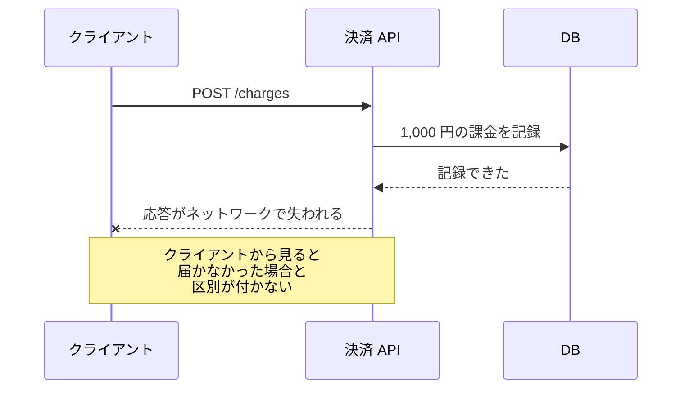
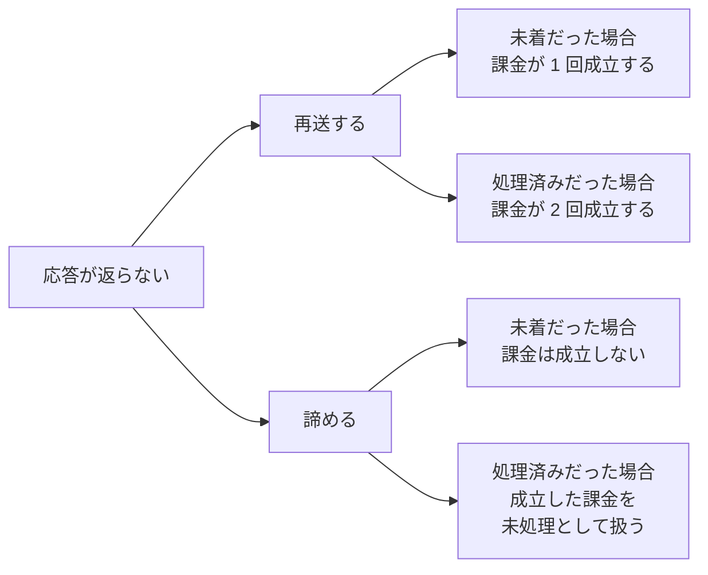
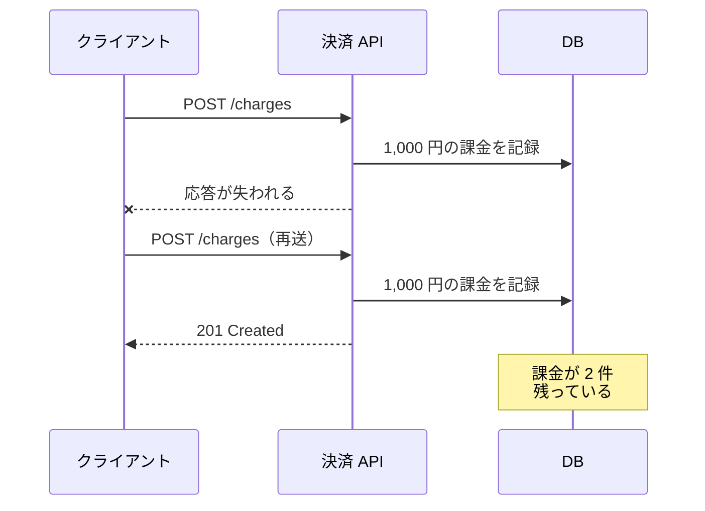
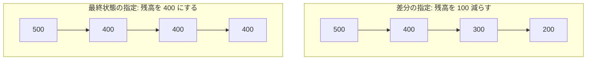
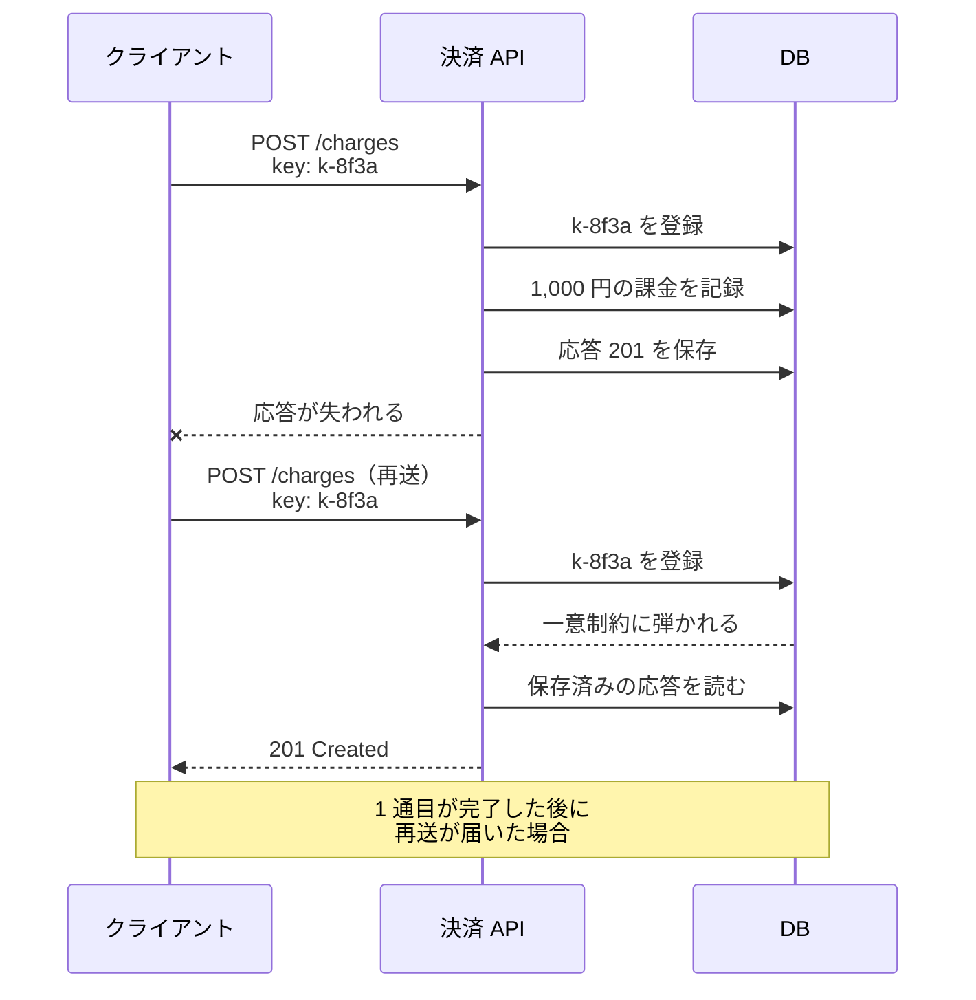
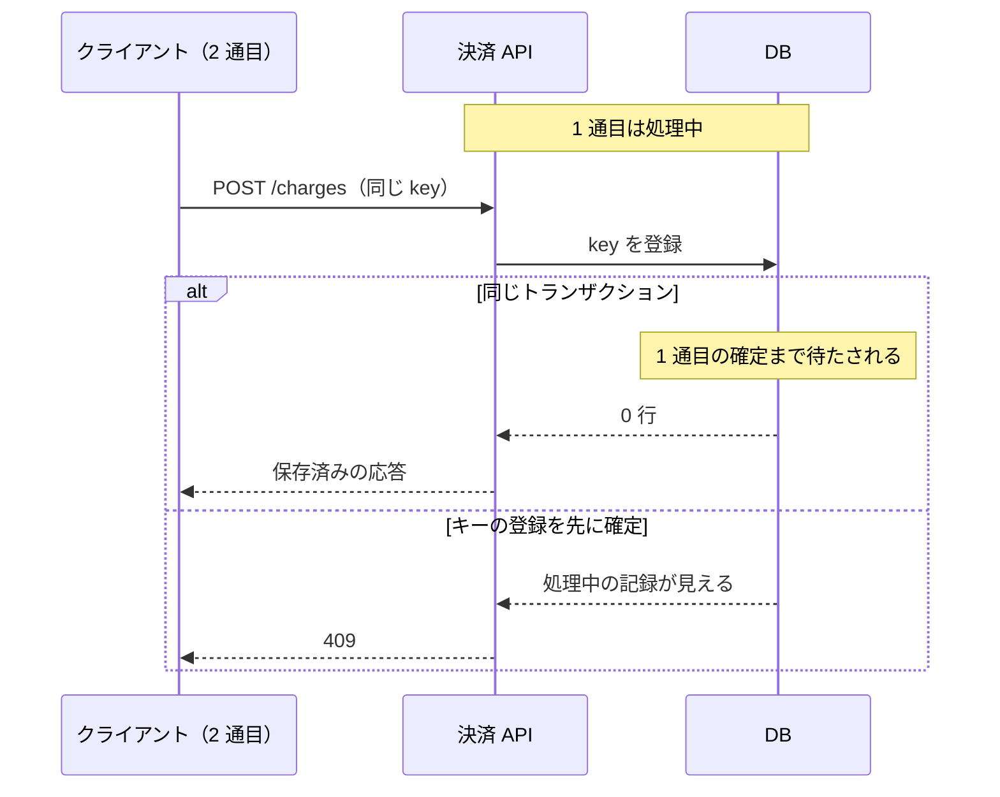
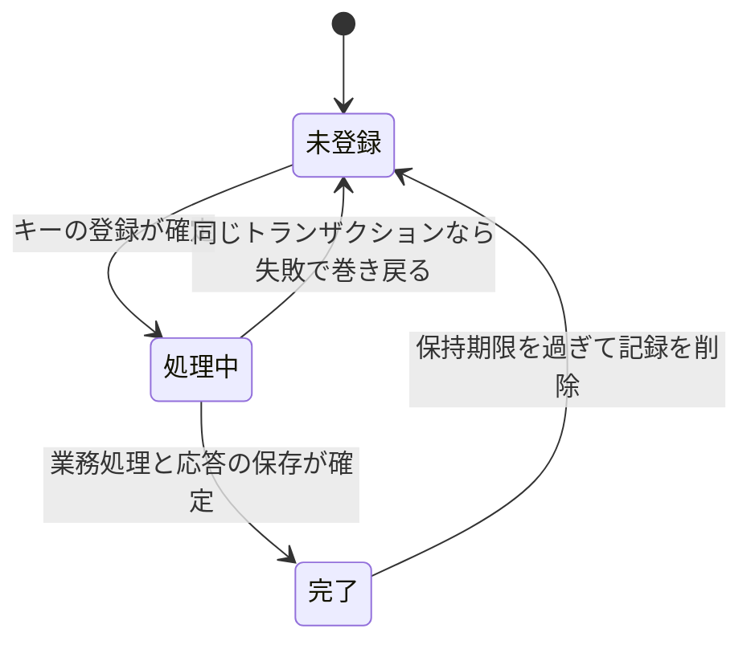

決済 API に課金の POST を送り、504 Gateway Timeout が返ってきたとします。課金が成立したのか、要求が届かないまま終わったのかは、この応答からは分かりません。

冪等（べきとう、idempotent）は、同じ操作を 1 回実行した時と、繰り返し実行した時とで、要求した側が意図した結果が同じになる性質です。上の POST が冪等なら、もう一度送っても課金は 1 回分に留まります。本ノートでは、要求の再送で生じる重複を扱い、誤った値を返す故障（ビザンチン障害）と、複数の要求を跨いだ順序の保証は対象外とします。



クライアントに届いた情報は「応答が無い」の 1 種類だけで、サーバに何が残ったかは含まれていません。応答が途絶えても相手の状態は分からない構図は、[Heartbeat](../heartbeat/) が扱う「遅いノードと落ちたノードを見分けられない」問題と同じです。

---

### なぜ再送だけでは足りないのか

区別が付かない以上、送信側が選べるのは再送するか諦めるかの 2 つで、どちらを選んでも壊れる場合が残ります。



諦めれば重複はできない代わりに、成立した課金が送信側では未処理のまま残ります。成功を確認できるまで再試行する方式では、同じ要求が複数回届く可能性があります。1 回分の課金を作る要求が 2 通届けば、素朴な実装は 2 回分の課金を作ります。



壊れているのは再送ではなく、同じ要求を繰り返し受け取る前提で作られていない処理の方です。そのため、繰り返しに耐える形を用意するのは、API を提供する側になります。

---

### 繰り返しても結果が変わらない操作を選ぶ

一番単純な方法は、繰り返しても結果が変わらない書き方を選ぶ事です。残高 500 の口座に「残高を 100 減らす」と「残高を 400 にする」を 3 回ずつ適用すると、以下の通りに分かれます。



「残高を 100 減らす」は、実行した回数だけ残高が減ります。一方、「残高を 400 にする」は、同じ要求だけを繰り返す限り最終状態が 400 のままです。

HTTP のメソッドにも同じ区別が入っています。例えば PUT は、要求の本文が表す状態で、指定した URL のリソースを作成または置き換えるよう求めるメソッドです。同じ本文で何度送っても、意図している状態は最後の 1 通と変わりません。

HTTP の意味論を定める RFC 9110 は、PUT・DELETE と safe なメソッド（GET、HEAD、OPTIONS、TRACE。クライアントが状態変更を要求しない操作）を冪等なメソッドとして挙げています。

定義は、「[the intended effect on the server of multiple identical requests with that method is the same as the effect for a single such request](https://www.rfc-editor.org/rfc/rfc9110.html#name-idempotent-methods)」（同じ要求を複数回送った時にサーバへ意図される結果が、1 回送った時と同じ）と書かれています。

揃うのは意図された結果だけで、サーバが要求ごとにログを残すような副作用は妨げません。応答の中身も揃いません。通信が失敗した時の自動再送を論じた箇所に「[though the response might differ](https://www.rfc-editor.org/rfc/rfc9110.html#name-idempotent-methods)」（応答は異なるかもしれないが）という譲歩が置かれています。

つまり DELETE の 2 回目が 404 を返しても、削除済みという意図された結果は同じなので、冪等性は壊れていないと読めます。

冪等と safe も別の性質で、冪等なメソッドはサーバの状態を変えて構いません。なお RFC 9110 は、非冪等なメソッドをクライアントが原則として自動で再試行しないよう求めています。仕様書が使う SHOULD NOT は、原則として避けるという強さです。

冒頭の課金の POST は、この書き換えができません。最終状態を指定できるのは、書き込む先が要求の中で決まっている操作です。新規の課金や伝票番号の採番は、実行するたびに別の対象ができるので、上書きすべき先がありません。

---

### 冪等キーで重複した要求を見分ける

最終状態を指定する形に書き直せない場合は、要求に一意な値を付けて見分けます。この値を冪等キー（idempotency key）と呼び、クライアントが要求ごとに生成して添えます。

サーバはキーを記録してから業務処理（ここでは課金を記録する処理）を行い、同じキーの 2 度目には業務処理を再実行せず、記録済みの応答を返します。



応答まで保存するのは、冪等の要件ではありません。クライアントは自分の要求が初回か再送かを区別できないので、同じ応答を返しておくと呼び出し側の分岐が不要になります。

DB の一意制約が保証するのは、同じキーを持つ複数の要求を同時に初回として扱わない排他です。同じ値を持つ行を 2 つ作れないので、同時に届いた 2 通のうち登録に成功するのは片方だけになります。存在を確認してから記録する順序だと、2 通が両方とも「まだ無い」を読む余地が残ります。

この排他が効くのは登録の瞬間で、業務処理との整合は別に設計する必要があります。キーの記録と課金の記録を同じトランザクションに入れるのが素直な作りで、分けた場合は、キーは登録済みで課金は無い記録や、その逆の記録ができます。どこまでを 1 つのトランザクションに入れるかは [Transaction Scope](../../database-systems/transaction-scope/) の題材です。

PostgreSQL は、`ON CONFLICT` 句で一意制約の衝突を扱えます。以下が、冪等キーのテーブルと登録の一例です。

```sql
CREATE TABLE idempotency_keys (
    id          bigserial   PRIMARY KEY,
    key         text        NOT NULL UNIQUE,
    fingerprint text        NOT NULL,
    status      text        NOT NULL DEFAULT 'in_progress',
    response    jsonb,
    expires_at  timestamptz NOT NULL
);

-- 行が返れば初回の要求、0 行なら同じキーの要求が既にある
INSERT INTO idempotency_keys (key, fingerprint, expires_at)
VALUES ('k-8f3a', 'sha256:3f6c9d2a', now() + interval '24 hours')
ON CONFLICT (key) DO NOTHING
RETURNING id;
```

処理中と完了を `status` で分ける事も、保持期間を 24 時間にする事も、このコードが選んだ設計です。仕様が定めた形ではありません。受信済みのイベント ID を一意制約付きで記録する形も同じ作りで、[Domain Event](../../software-architecture/domain-event/) で扱っています。

このキーを運ぶ Idempotency-Key リクエストヘッダは、IETF の HTTPAPI ワーキンググループの Internet-Draft [The Idempotency-Key HTTP Header Field](https://datatracker.ietf.org/doc/html/draft-ietf-httpapi-idempotency-key-header-07) が定義しています。2025 年 10 月提出の draft-07 が最新で、2026 年 4 月 18 日に失効したまま RFC にはなっていません。

---

### 処理中に届いた再送をどう扱うか

1 通目の処理が終わる前に 2 通目が届く場合、2 通目に何を返せるかは、キーの記録をどのトランザクションに置いたかで変わります。



同じトランザクションに置くと、処理中の記録は確定前なので他の要求から見えません。2 通目の登録が止まるのはそのためで、1 通目が中止されれば、2 通目の登録が成功して業務処理に進みます。

キーの登録を先に確定させると、処理中である事が他の要求から見えます。処理中の要求と同じキーが届いた場合の応答には、この草案で 409 が推奨されています。409 は、対象リソースの現在の状態と衝突していて、解消すれば送り直せる場合に使う応答です。

キーの登録を先に確定させる方法は、処理中の要求を検出して 409 を返す実装の一つです。処理中をどう検出するかは、仕様の範囲外です。代償は、キーだけが残って業務処理が完了しないウィンドウができる事です。

どちらを選んでも、409 や待ち時間を受け取ったクライアントは、課金が成立したかどうかを知らないままです。冪等キーが揃えるのは結果を 1 回分に保つ所までで、1 通目の完了を待って同じ応答を返す事は含まれません。同じキーのまま間隔を空けて送り直せば、完了後は保存済みの応答が返ります。

---

### キーの寿命と使い回し

キーの記録は、いつか消さなければ増え続けます。有効期限のポリシーは、API を提供する側が定めて文書化する事が求められています。具体的な期間は示されていません。



記録が消えた後の再送は、初回の要求として素通りします。そのため、期限が送信側の再試行を続ける期間より短いと、重複排除は最後まで効きません。逆に期限を延ばすほど、記録は増えます。

同じキーを違う本文で使い回された要求は、再送として扱えません。この場合の応答には、422 が割り当てられています。422 は、本文の構文は正しいのに、その内容の指示を処理できない場合に使う応答です。前述のテーブルの `fingerprint` 列は、この判定のために本文の指紋を保存しておく列です。要求の本文から作った指紋（idempotency fingerprint）をキーと併用する判定も認められています。

キーを生成するのはクライアントで、UUID のようなランダムな識別子が推奨されています。再送のたびに新しいキーを作る実装では、サーバの記録と結び付かず、重複排除が働きません。

---

### 利点

- 応答が失われた要求について、結果を 1 回分に保ったまま再試行できる
- 再試行の判断をクライアントに任せられ、サーバは重複の判定だけを持てる
- 一意制約という DB の既存の仕組みで、同時に届いた 2 通も同じ経路で扱える
- 1 通目が完了した後なら、2 度目の要求にも同じ応答を返せる

---

### 欠点

以下は、要求が重複したかどうかを送信側に判断させない事を優先した結果として現れる制約です。

- キーの記録と業務処理をどのトランザクションに入れるか、対象の API ごとに決める必要がある
- キーの記録が課金のテーブルとは別に増え、削除の運用を決める必要がある
- 重複排除が効く範囲が保持期限に縛られ、期限を過ぎた再送は素通りする
- 処理中の再送を待たせるか 409 で返すかが、トランザクションの置き方で変わる

---

### 適さないケース

- 差分の指定を最終状態の指定に書き換えられ、キーを持たずに繰り返しに耐えられる操作
- 同じ要求が複数回届いても業務上の結果が変わらない、読み取りだけの操作
- 要求ごとに新しい対象を作る事が目的で、重複した要求も別々の要求として扱いたい操作
