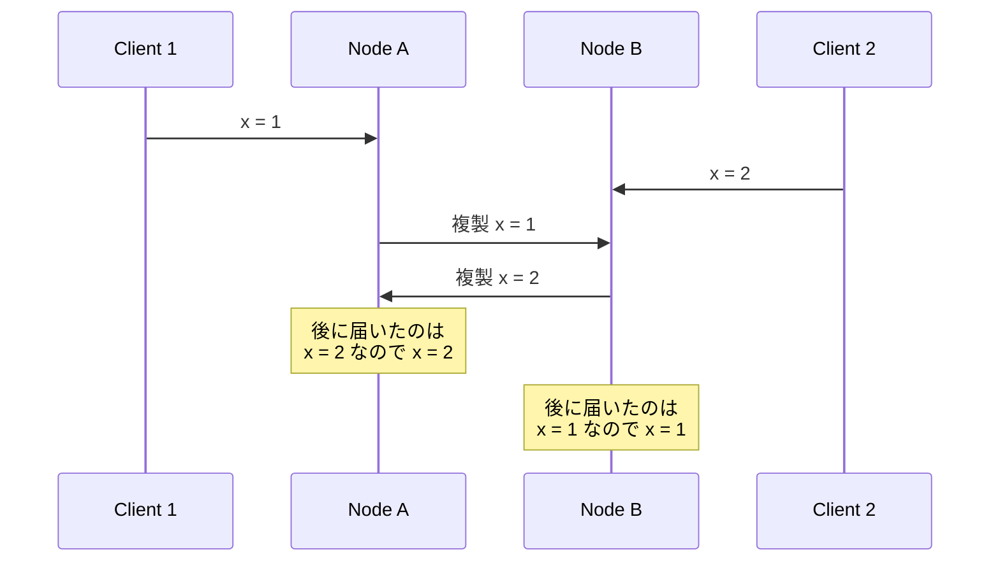
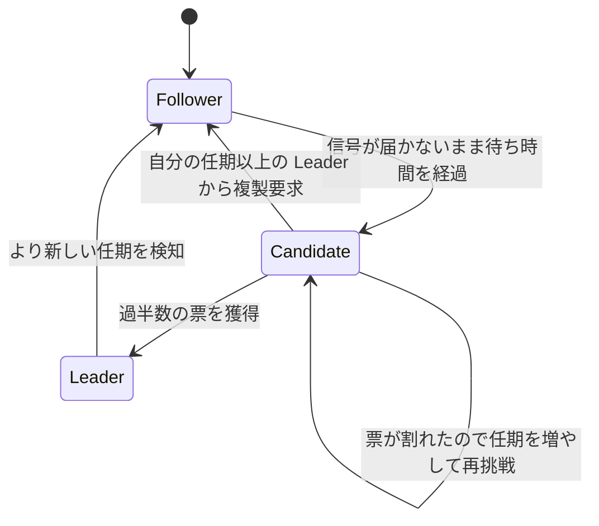
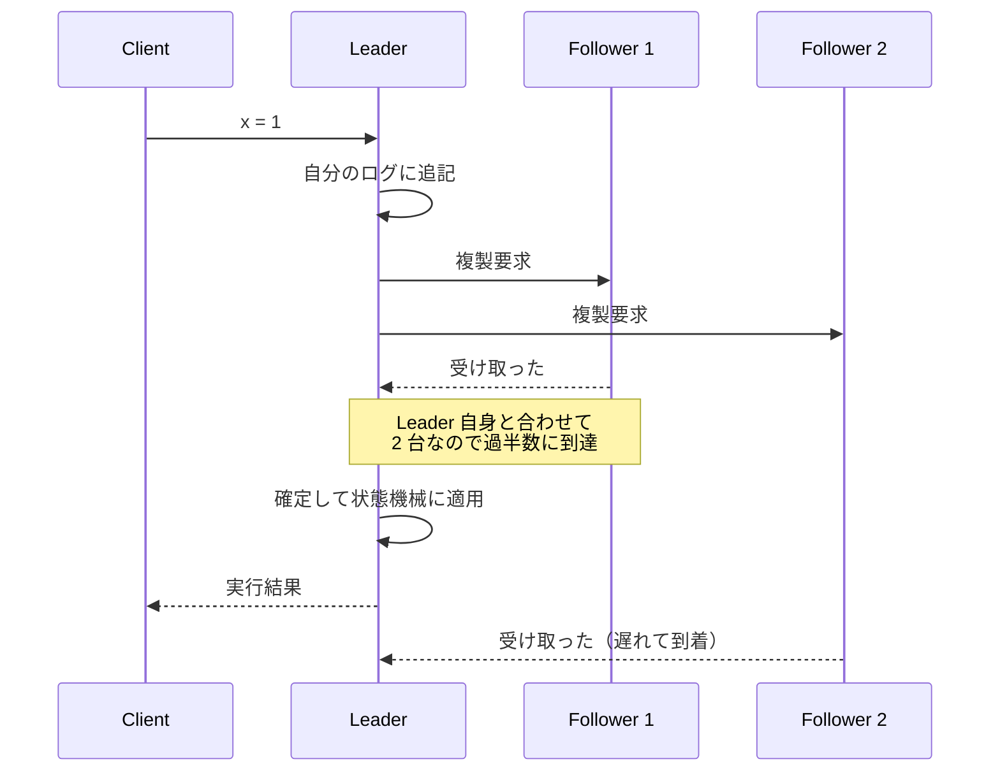
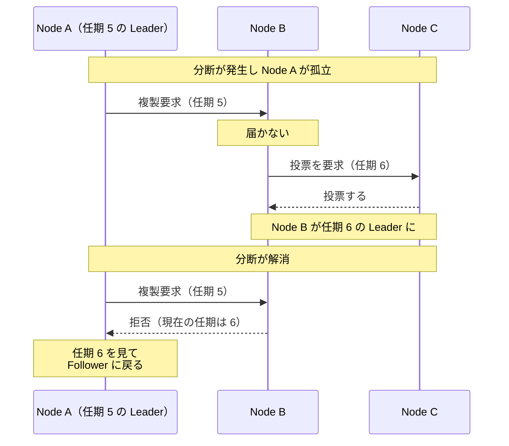

Leader and Followers は、同じデータを複製して持つノードのうち 1 台を Leader に決め、更新を全て Leader が受け付けて残りの Follower に配る構成です。更新の受け口が 1 台に絞られるため、同じデータへの更新の順序は Leader が決めた 1 つに定まります。

例えば、在庫や座席のように同じ 1 件を複数の要求が取り合うデータでは、更新の順序が結果を決めます。1 台のノードだけで持てば順序は 1 つに定まりますが、そのノードが止まると更新も読み取りも止まります。止まらないように複製を増やすと、今度は同じデータへの更新が別々のノードに届き、順序が食い違います。

Follower は、Client から更新を受け取っても自分では処理せず、Client を Leader に案内します。Leader から届いた内容は、自分の複製に反映します。Leader が落ちた場合は、残った Follower の中から次の Leader を選び直します。Leader を務めるノードは入れ替わり、役割は固定されていません。

想定する故障は、ノードの停止とネットワークの分断の 2 つです。誤った値を返す故障（ビザンチン障害）には触れません。仕組みの説明には Raft を使います。Raft は、複製したログを全ノードで同じ順序に揃えるための合意アルゴリズムで、動作が論文で細部まで規定されています。

パターンの名前は Unmesh Joshi 氏の書籍『Patterns of Distributed Systems』（邦訳『分散システムのためのデザインパターン』）で使われているもので、Martin Fowler 氏のサイトにも [Leader and Followers](https://martinfowler.com/articles/patterns-of-distributed-systems/leader-follower.html) として要約が置かれています。要約の解法の節には「クラスタの中の 1 台を Leader として選ぶ。Leader はクラスタ全体を代表して決定を下し、その決定を他の全サーバに伝播させる」と書かれています。

---

### なぜ Leader が必要なのか

全ノードが対等に更新を受け付ける構成では、同じデータへの更新が別々のノードに同時に届きます。各ノードは自分が受け取った順に処理してから相手に複製するので、到着の順序が入れ替わると、追加の併合規則を置かない限り、最終的に残る値がノードごとに食い違います。

2 台が独立に更新を受け付けた場合に何が起きるかは、以下の通りです。



上記の図で問題なのは、どちらのノードも自分の見た順序で正しく処理しており、間違った動作をしていない点です。順序を決める場所がどこにも無いため、正しく動いた結果として値が 2 通りに割れています。後から一方を選び直すには、どちらが後の更新なのかを判定する材料が別に必要です。

[クォーラム](../quorum/)で読み書きの相手を重ねれば足りるのではないか、と考える方がいるかもしれません。過半数を要求すると、書き込みに関わったノードの集合と読み取りに関わったノードの集合は、必ず 1 台以上を共有します。ただし、共有するノードが 2 つの更新を両方受け取っている事と、どちらが後の更新なのかを判定できる事は別です。数を数えるだけの過半数には、順序を決める規約が含まれていません。

更新の順序を 1 つに決めるには、全ノードが共有できる 1 つの並びが必要です。Leader and Followers は、その並びを決める役目を Leader に集約します。更新は必ず Leader を通り、Follower は Leader がログに並べた順に複製するので、後から順序を復元する手順を用意せずに済みます。ただし、全ノードに共通の並びとして残るのは、後の節で説明する確定を済ませた更新だけです。確定前の更新は、Leader が交代すると切り捨てられる場合があります。

並びを決める役を 1 台に固定しない解き方もあり、その代表が Leslie Lamport 氏の合意アルゴリズム Paxos です。合意アルゴリズムの役目は、提案された値のうち 1 つだけが選ばれる事を保証する事です（[Paxos Made Simple](https://lamport.azurewebsites.net/pubs/paxos-simple.pdf)）。Paxos では、提案を出すノードが値に番号（提案番号）を付けて過半数の受け入れを求めます。1 つの値だけが選ばれるという保証は固定された Leader を前提とせず、提案番号とクォーラムだけで守られます。

しかし、提案を出すノードが複数居ると、互いに大きな番号を出し合い、何も選ばれないまま進まなくなる場合があります。そのため、進み続けるには提案を出す役を 1 台に定める必要があります（同じ論文の 2.4 節）。その役の選出が失敗しても、1 つの値だけが選ばれるという保証は崩れません。ログの各位置について Paxos を繰り返し、安定した Leader で処理を効率化する構成が、一般に Multi-Paxos と呼ばれます。

---

### 任期と選出

Leader は固定ではなく、落ちた時に選び直せる必要があります。Raft は時間を任期（term）という単調増加する番号で区切り、1 つの任期に立つ Leader を最大 1 台に制限します。Diego Ongaro と John Ousterhout が 2014 年に発表した [Raft の論文](https://raft.github.io/raft.pdf)は、この性質を Election Safety と呼び、「1 つの任期で選ばれる Leader は最大 1 台」と定義しています。

Follower は Leader から定期的に届く信号を待ちます。信号が一定時間届かなければ、Leader が落ちたと判断して自分が Candidate になり、任期を 1 つ増やして他のノードに投票を求めます。クラスタの全構成ノードのうち過半数から票を集めたノードが、その任期の Leader になります。数えるのは応答があったノードの中の過半数ではなく、構成に含まれる全ノードの過半数です。信号そのものは[ハートビート](../heartbeat/)で、Raft では中身が空の複製要求を流用しています。

以下が役割の遷移です。



上記の図で Candidate から Candidate に戻る経路は、複数のノードが同時に Candidate になって票が割れた場合を表します。全ノードが同じ待ち時間を使うと、票の割れが繰り返されます。そのため、Raft は待ち時間をランダムな幅で散らし、選出を始めるたびに引き直します。Leader から Follower に戻る経路は、自分より新しい任期を検知した時に通ります。分断から復帰した旧 Leader がここを通るので、「古い Leader を締め出す」で改めて扱います。

投票を受け取った側の処理は短く書けます。Leader が 2 台立つのを防いでいるのは、1 つの任期で 2 票を投じない事と、当選に過半数を要求する事の組み合わせです。過半数の集合はどの 2 つを取っても 1 台以上を共有するので、共有するノードが 1 票しか出さなければ、同じ任期に 2 台が過半数に届く事はありません。

```go
// handleRequestVote は、Candidate から届いた投票要求を処理します。
// ログの新しさの検査（Raft 論文 5.4 節）は省略しています。
func (n *node) handleRequestVote(term int, candidateID string) bool {
	if term < n.currentTerm {
		return false // 古い任期からの要求は拒否する
	}
	if term > n.currentTerm {
		// 新しい任期を見たら、投票の記録を捨てて Follower に戻る
		n.currentTerm = term
		n.votedFor = ""
		n.role = roleFollower
	}
	if n.votedFor != "" && n.votedFor != candidateID {
		return false // 同じ任期で 2 台に投票しない
	}
	n.votedFor = candidateID
	return true
}
```

上のコードは `currentTerm` と `votedFor` をメモリ上で書き換えているだけで、実装としては不足しています。Raft は、この 2 つとログを RPC（Remote Procedure Call、遠隔手続き呼び出し）に応答する前に安定ストレージに書く事を要求しています。投票した直後に再起動して `votedFor` を失うと、同じ任期でもう 1 台に投票してしまい、Leader が 2 台立ちます。

省略したログの新しさの検査は、確定済みのエントリ（Leader が過半数への複製を確かめ、以後取り消されないと判断したログの 1 件）を守るために効いています。Raft は、自分のログが Candidate より新しいノードに投票を拒否させます。確定済みのエントリは過半数が持っており、票を集めるにも過半数が必要なので、その 2 つは必ず重なります。確定済みのエントリを持たないノードは、重なったノードに拒否されて Leader になれません。重なりが効く理屈は[クォーラム](../quorum/)と同じです。

期間を区切って権利を与える点は、[Lease](../lease/) と同じ発想です。違いは期限の決め方にあり、Lease は時間の経過で切れるのに対し、任期はより新しい任期の出現で切れます。任期は時計を参照しないので、ノード間で時刻を合わせる必要がありません。その代わり、誰かが新しい任期を始めるまで古い Leader は自分の失効を知りません。

時刻を合わせずに済むのは安全性（safety、誤った結果を出さない性質）の話で、処理が前に進むかどうかはタイミングに依存します。Raft は、信号が往復する時間・選出の待ち時間・ノードが故障する平均間隔が、この順に十分な差で並ぶ事を前提にしています。待ち時間が往復の時間に近いと、生きている Leader が居るのに選出が始まり、更新が進まなくなります。

---

### 更新の複製と確定

Client の更新を受け取った Leader は、まず自分のログの末尾に追記し、続けて同じ内容を Follower に送ります。ログは [WAL](../write-ahead-log/)（Write-Ahead Log、書き込み先行ログ）と同じ追記型の列で、Leader が決めた順序をそのまま保持します。追記した 1 件をエントリと呼びます。

現在の任期で作られたエントリが過半数のノードに複製された時点で、Leader はそのエントリを確定（commit）させます。確定は実行と同じではありません。Leader は確定したエントリを自分の状態機械（state machine、ログのコマンドを順に適用して状態を作る部分）に適用し、その実行結果を Client に返します。

追記しかしないのは Leader のログだけです。Follower のログは Leader のものと突き合わせられ、食い違う位置から後ろが削られます。Raft は、Leader が追記しかしない性質を Leader Append-Only と呼び、「Leader は自分のログのエントリを上書きも削除もせず、追記だけを行う」と定義しています。

以下が確定までの往復です。



上記の図で Leader が Client に応答したのは、Follower 2 の応答が届く前です。全ノードの応答を待たないため、1 台が遅れていても更新は進みます。遅れた Follower は、後から届いた分を自分のログに追記して追い付きます。

Leader は、Follower ごとに「どこまで複製できたか」の位置を `matchIndex` として持ち、確定済みの末尾を `commitIndex` として持ちます。確定の判定は、`matchIndex` を数えて過半数に届いた位置まで `commitIndex` を進める処理になります。

```go
// advanceCommitIndex は、過半数に複製できた位置まで commitIndex を進めます。
// Leader を務めているノードだけが呼びます。
// n.log は Raft 論文に合わせて添字 1 から使い、log[0] は番兵です。
// commitIndex の初期値 0 は、まだ何も確定していない事を表します。
func (n *node) advanceCommitIndex() {
	total := len(n.matchIndex) + 1 // Follower の数と、Leader 自身の 1 台
	for i := len(n.log) - 1; i > n.commitIndex; i-- {
		if n.log[i].Term != n.currentTerm {
			continue // 過去の任期のエントリは、応答数だけでは確定させない
		}
		agreed := 1 // Leader は自分のログに追記済み
		for _, m := range n.matchIndex {
			if m >= i {
				agreed++
			}
		}
		if agreed*2 > total {
			n.commitIndex = i
			return
		}
	}
}
```

注意点として、複製の数で確定させるのは現在の任期で作られたエントリだけ、という条件が入っています。Raft 論文の Figure 2 は確定の規則を「`N > commitIndex` かつ過半数の `matchIndex[i] >= N` かつ `log[N].term == currentTerm` を満たす N があれば `commitIndex = N` とする」と規定しており、`log[N].term == currentTerm` がこの条件です。

過去の任期のエントリは、過半数に複製されていても、後の Leader に上書きされる場合があります。そのエントリを持たないノードでも、ログの末尾により新しい任期のエントリがあれば、ログの新しさの検査を通って Leader に選ばれる事があるからです（論文の Figure 8）。

現在の任期のエントリが過半数に複製されると、そのエントリを持たないノードは検査に落ち、Leader になれません。Raft は、2 つのログの同じ位置に同じ任期のエントリがあれば、そこまでの内容が全て一致するように保っています。そのため、Leader が `commitIndex` を現在の任期のエントリの位置まで進めると、その手前にある過去の任期のエントリも確定済みの範囲に入ります。

---

### 古い Leader を締め出す

ネットワークが分断されると、Leader が生きているのに Follower がその信号を受け取れない状態になります。多数派（過半数が残った側）のノードは新しい Leader を選び、少数派に取り残された旧 Leader は自分が Leader のつもりで動き続けます。1 台に集約したはずの更新の受け口が、一時的に 2 台に増えます。

分断が起きてから旧 Leader が締め出されるまでは以下の通りです。



上記の図の Node A は、拒否の応答に含まれる任期番号を見て、初めて自分が交代させられた事を知ります。番号の大小だけで新旧を判定しており、時計は参照していません。権利を渡すたびに大きくなる番号で古い操作を拒否する点は、[Lease](../lease/) の fencing token と同じ発想です。

分断されている間、Node A が更新を確定させる事はありません。確定には過半数の応答が必要で、少数派は定義上その数に届かないからです。確定していない更新なので、Client に完了を返してもいません。分断が解消すると、Node A のログは任期 6 の Leader のものと突き合わせられ、食い違う位置から後ろが削られます。削られるのは衝突した範囲だけで、新しい Leader のログと一致している部分はそのまま残ります。

締め出しは、複製要求を受け取ったノードの数行で成立します。

```go
// handleAppendEntries は、Leader から届いた複製要求を処理します。
// ログの整合性検査と追記（Raft 論文 5.3 節）は省略しています。
func (n *node) handleAppendEntries(args appendEntriesArgs) appendEntriesReply {
	if args.Term < n.currentTerm {
		// 分断から復帰した旧 Leader は、ここで弾かれる。
		// 応答に自分の任期を載せるので、旧 Leader は交代を知る
		return appendEntriesReply{Term: n.currentTerm, Success: false}
	}
	if args.Term > n.currentTerm {
		n.currentTerm = args.Term
		n.votedFor = ""
	}
	n.role = roleFollower
	n.leaderID = args.LeaderID // Client を現在の Leader に案内するために覚える
	return appendEntriesReply{Term: n.currentTerm, Success: true}
}
```

---

### 読み取りをどこに流すか

読み取りを Follower に分散させると、Leader の負荷は下がります。その代わり、確定した更新がまだ届いていない Follower は古い値を返します。更新の直後に自分の書いた値を読み返す用途では、この遅れが表に出ます。

常に最新の値が必要な読み取りは、Leader を経由させます。Raft は、そのために 2 つの手順を要求しています（論文 8 節）。1 つ目は、Leader が就任した直後に自分の任期の空エントリを確定させる事です。`advanceCommitIndex` は現在の任期のエントリしか複製の数で数えないので、自分の任期のエントリを 1 つ確定させるまで、就任した Leader はどこまでが確定済みなのかを把握できません。

2 つ目は、読み取りに応答する前に過半数とハートビートを交換する事です。交代させられた事に気付いていない旧 Leader が古い値を返す可能性は、ここで消えます。新しい Leader が既に立っていれば、過半数のうち少なくとも 1 台が新しい任期を返します。古い任期のまま過半数から応答が揃えば、自分がまだ Leader だと確かめられます。

論文は 2 つ目の代替として、ハートビートを Lease のように扱う方法も挙げています。読み取りのたびに過半数に問い合わせずに済む代わりに、読み取りの安全性だけがタイミングに依存し、ノード間の時計のずれに上限がある事を仮定します。任期の比較やログの複製そのものが時計に依存するわけではありません。

ここまでの厳密さが必要ない読み取りであれば、Follower に流して構いません。集計や一覧の表示のように、数秒古い値でも判断が変わらない用途が候補になります。

---

### 利点

- 確定した更新の順序が Leader のログの並びに定まり、順序を後から復元する仕組みが必要ない
- 過半数の応答で確定するため、一部のノードが遅れても更新が進む
- Follower は Leader の内容を写すだけなので、複製の処理が単純になる
- Leader が落ちても、過半数のノードが残っていれば選び直して処理を続けられる
- Raft のように任期の番号で新旧を判定する実装なら、時計を合わせずに古い Leader を排除できる

---

### 欠点

以下は、更新の順序を 1 台で決める事を優先した結果として現れる制約です。

- 更新が全て Leader を通るため、書き込みの性能が Leader 1 台の性能で頭打ちになる
- Leader が落ちてから次が決まるまで、更新を受け付けられない時間が生じる
- 選出の待ち時間を短くすると誤検知による交代が増え、長くすると復旧が遅れる
- 拠点をまたぐ構成では、確定のたびに Leader と過半数の間の往復の時間が加わる
- Follower から読むと、確定済みの更新がまだ届いていない値が返る場合がある

---

### 適さないケース

- 書き込みが多く、1 台では捌けないワークロード。データを分割して Leader を複数立てる構成を検討する
- 分断中も両側で更新を受け付けたいシステム。CRDT（Conflict-free Replicated Data Type）のように、並行な更新の順序を決めなくても、同じ更新を受け取ったノードどうしが同じ状態に揃うデータ型を検討する。扱えるデータの形は限られ、分断中に両側で更新を受け付けられるかは複製の構成でも変わる
- 数百台のノードを 1 つの合意グループに参加させる構成。1 つのグループは数台に絞るのが前提で、システム全体の台数が多い事は問題にならない。規模を広げるなら、データを分割して小さなグループを複数立てる
- 更新が稀で、1 台の停止による短い中断を許容できるシステム
