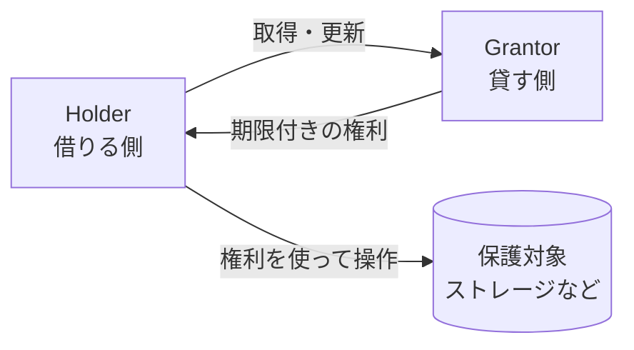
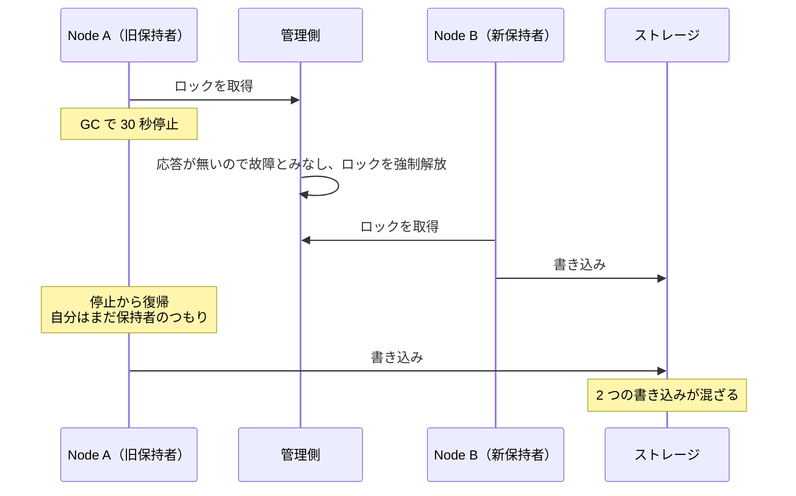
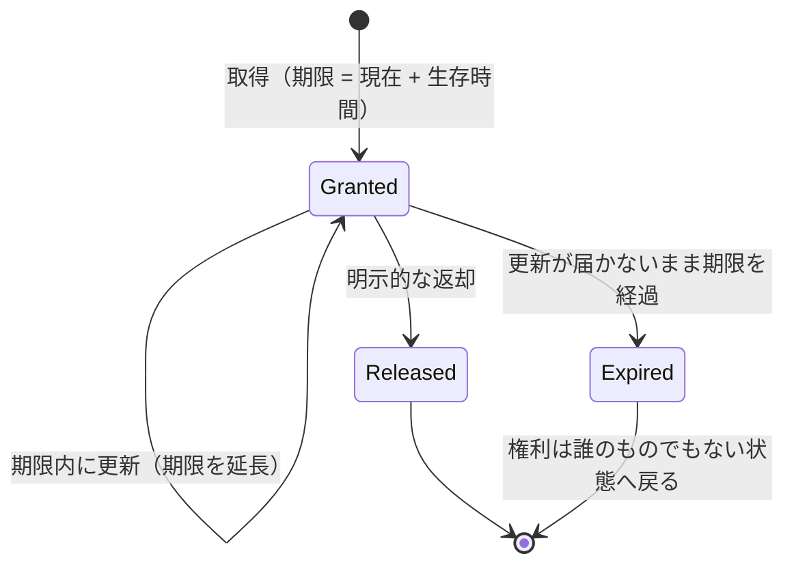
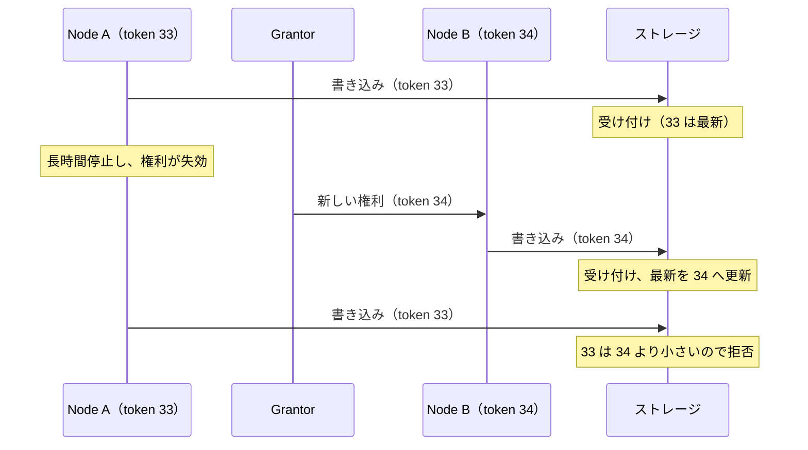

Lease（リース）は、ある権利を期限付きで貸し出し、期限が過ぎたら自動的に失効させる仕組みです。貸す側は「これから 10 秒間、あなたがリーダーです」と伝え、借りた側は期限が来る前に更新を続けます。更新が途切れれば、誰の操作も無しに権利は消えます。

権利を渡す時に困るのは、渡した相手が黙って消える場合です。相手が落ちたのか、ネットワークが詰まっているのかを外から確定できないため、「返してもらう」という手順は当てにできません。Lease は返却を相手の行動に頼らず、時間の経過だけで成立させています。ここでは、書き込みを 1 台へ集約する構成でのリーダーの座や、1 台だけが触ってよい資源の使用権を貸す用途を扱います。

登場人物を以下に示します。

上図の Grantor は権利の管理だけを担当し、保護対象への操作は Holder が行います。権利の貸し借りと実際の操作が別の経路を通るため、保護対象は「操作してきた相手が今も権利を持っているか」を知りません。これが後の fencing token の話につながります。なお、Grantor 自身が落ちると権利の記録ごと失われるため、実際の実装では Grantor を複数ノードで複製します（後述の etcd は Raft で記録を揃える）。

---

### なぜ Lease が必要なのか

期限の無いロックは、保持者が落ちた時点で解放されなくなります。解放できるのは本人だけなので、後続の処理は管理者が手で消すまで待ち続けます。ここでは期限の無いロックを例に、期限が何を解決するのかを見ます。なお、実運用の分散ロックサービスは、期限やセッションの仕組みを内蔵しています。

[ハートビート](../heartbeat/)で保持者の生死を見張り、落ちたと判断した時点で管理側がロックを強制的に解放すればよい、と考える方がいるかもしれません。しかし、この方法は誤検知に耐えられません。停止したノードと、応答が遅いだけのノードを確実に区別する手段が無いからです。

保持者の同意なしにロックを強制解放し、次のノードが取得した場合に何が起きるかを以下に示します。図中の GC（Garbage Collection）は、使われなくなったメモリを回収する処理で、実行中はプロセスが数秒から数十秒止まる事があります。

上図で効いているのは、管理側がロックを解放して Node B が取得しても、Node A 側の認識が変わらない点です。停止していた間に何が起きたかを知る手段が無いため、復帰した瞬間から保持者として振る舞います。

Lease は、この認識のずれを縮めます。権利に期限が入っているので、Node A は復帰した時点で「自分の権利は既に切れている」と自分で判断できます。判断の材料が自分の中だけで完結するため、管理側と連絡が取れない状態でも成立します。

ただし、ずれが完全に消えるわけではありません。「期限が切れていないか確認する」処理と「書き込む」処理の間で停止が起きれば、有効だと判断した直後に止まり、失効した後で書き込みます。停止はどの時点でも起こり得るので、確認処理を足しても塞げません。残る隙間は、後述の fencing token が塞ぎます。

---

### 4 つの操作と状態遷移

操作は、取得・更新・返却・失効の 4 つです。権利を貸す長さを生存時間（TTL、Time To Live）と呼びます。4 つの操作が状態をどう動かすかを以下に示します。

上図の `Released` は、仕事が終わった Holder が期限を待たずに自分から返す経路です。一方、`Expired` への遷移には誰の操作も要りません。返却が届かなかった場合の受け皿が `Expired` で、Lease の特徴はこの経路にあります。

両者が数えるのは経過時間だけで、絶対時刻は見ません。ここで起点の取り方が効きます。Holder は要求を送った時刻から数え、Grantor は応答を返した時刻から数えます。通信の往復にかかった分だけ Holder の期限が先に来るため、Holder が権利を手放してから Grantor が次の相手へ貸すまでに空白ができます。

---

### 時計について何を前提にしているか

Lease の安全性は、貸す側と借りる側の時計が同じ時刻を指している事には依存しません。依存するのは、両者の時計の進む速さのずれに上限がある事です。具体的には、Grantor の 10 秒と Holder の 10 秒が、たかだか数パーセントしかずれないという仮定を置きます。

この仮定があるため、実装では起点をずらすだけでなく、時計のずれの分もマージンとして見込みます。Holder は自分の数えた期限よりさらに早く権利を手放し、Grantor はさらに遅く次の相手へ貸します。空白の時間を広く取るほど安全側に倒れ、その分だけ切り替えが遅くなります。

---

### fencing token

[fencing token](https://martin.kleppmann.com/2016/02/08/how-to-do-distributed-locking.html) とは、権利を貸すたびに大きくなる番号で、保護対象が古い権利からの操作を拒否するために使います。Grantor が権利と一緒に渡し、番号が減る事は無いため、大小の比較だけで新旧を判定できます。

これが必要になるのは、Lease が 2 つの仮定に頼っているためです。1 つは、貸す側と借りる側で時計の進む速さのずれに上限がある事。もう 1 つは、Holder が保護対象へ操作する時点で Lease がまだ有効である事です。

2 つ目の仮定は簡単に破れます。処理そのものは最初の期限内に終わらせなくてよく、長くかかるなら更新して期限を延ばせます。ただし、GC 停止や仮想マシンの一時停止で Holder が数十秒止まると、更新が届かないまま期限が過ぎ、失効に気付かない Holder の書き込みが後から実行されます。この間も時計は正しく進んでいるため、時計の仮定を強めても防げません。

失効に気付かないまま書き込んだ操作が、番号の比較で拒否される流れを以下に示します。

上図のストレージは、権利の期限を知りません。受け取った番号が過去のものかどうかだけを見て判断しています。Lease が時間で守り、fencing token が順序で守る、という二段構えです。

この 2 つは対等ではありません。停止はどの時点でも起こり得るので、番号を検査できる保護対象では、書き込みの正しさを最後に担保しているのは fencing token です。とは言え、番号の比較でできるのは古い操作を拒否する事だけで、次に誰が権利を持つのかは決められません。担当を決めて全体を止めずに進める役目は Lease にあります。

---

### 実装の例

具体的には、分散 KVS（Key-Value Store、キーと値を複数ノードで保持する DB）の [etcd](https://etcd.io/docs/v3.5/learning/api/) が lease を API として持っています。生存時間を指定して lease を作り（実際の長さはサーバが決める）、キーをその lease に属させると、更新が途絶えた後にそれらのキーがまとめて削除されます。

更新は `LeaseKeepAlive`、明示的な返却は `LeaseRevoke` です。リーダーの座を表すキーを lease に属させておけば、保持者が落ちた後にキーが消え、次の候補が取得できるようになります。

Google の分散ロックサービス [Chubby](https://research.google/pubs/pub27897/) も同じ考え方を実装しています。Chubby はクライアントとの間でセッションを維持し、期限が切れたセッションのロックを解放します。この時、保持者の障害で空いたロックは、一定時間ほかのクライアントへ与えません。この待ち時間はクライアントが指定でき、論文の時点では上限が 1 分でした。fencing token に相当する番号を検査できない保護対象を守るための近似手段で、停止していた保持者がまだ書き込んでいる可能性を時間で吸収しています。

---

### 利点

- 保持者が落ちても、時間の経過だけで権利が戻る
- 管理者の介入も、他ノードによる強制解除も要らない
- 借りた側が自分で失効を判断できるので、Grantor と連絡が取れなくても二重の権利者が生まれにくい
- 期限の記録と更新の受け付けだけで実装できる

---

### 欠点

以下は、権利の返却を相手の行動に頼らない事を優先した結果として現れる制約です。

- 保持者が明らかに落ちていても、期限が来るまで次の担当者は動けない
- 時計の進む速さのずれに上限があるという仮定に頼る
- 操作の時点で Lease が有効という仮定も要る。長い処理は更新で延ばせるものの、GC 停止や仮想マシンの一時停止で破れる
- 期限を長くすると復旧が遅れ、短くすると更新の通信が増える
- 更新の通信と実際の仕事は別なので、何も進まない Holder が権利を占有し続ける
- Grantor を複製すると、新しいリーダーが既存の期限を知らないまま二重に貸す危険が出る

---

### 適さないケース

- 障害から数十ミリ秒で切り替えたい場面。期限を詰めると一時的な遅延で失効する
- 仮想マシンの一時停止など、時計の進み方が保証できない環境
- 保護対象が番号を検査できず、時計の仮定も置けない場合。二重書き込みを防げない
- 権利の受け渡しが稀で、人手による切り替えで足りるシステム

---

### 似た仕組みとの比較

権利の管理という観点では、いくつかの仕組みが並びます。

| | Lease | 素朴な相互排除 | Heartbeat | fencing token |
|---|---|---|---|---|
| 主な目的 | 期限付きの権利の付与 | 排他の保証 | 生存の確認 | 古い操作の排除 |
| 保持者が落ちた場合 | 期限が来れば自動で失効 | 解放されない | 検知するだけ | 関与しない |
| 失効を判断できる場所 | 貸す側と借りる側の両方が独立に判断でき、結論のずれに上限がある | 判断の仕組みが無い | 監視側 | 判断しない。渡された番号の新旧だけを見る |
| 前提 | 時計の進む速さのずれに上限。停止や遅延が期限より短い事 | 保持者が生きている限り必ず解放する事 | 遅延の大きさについての見積もり | 番号を検査できる保護対象と、単調性を保証する発行元 |

[ハートビート](../heartbeat/)と Lease は、どちらも定期的な信号で成り立つため混同されやすいものの、答えている問いが違います。ハートビートは「生きているか」を監視側へ知らせ、Lease は「いつまで権利があるか」を借りた側に持たせます。ハートビートも時計を使うものの、閾値を間隔の数倍に取るため、許容できるずれは Lease より桁違いに大きくなります。

実装では Lease の更新をハートビートが兼ねる形が多く、両者は競合せずに重なります。生存の報告が届いている間だけ権利が延びる、という関係になります。
