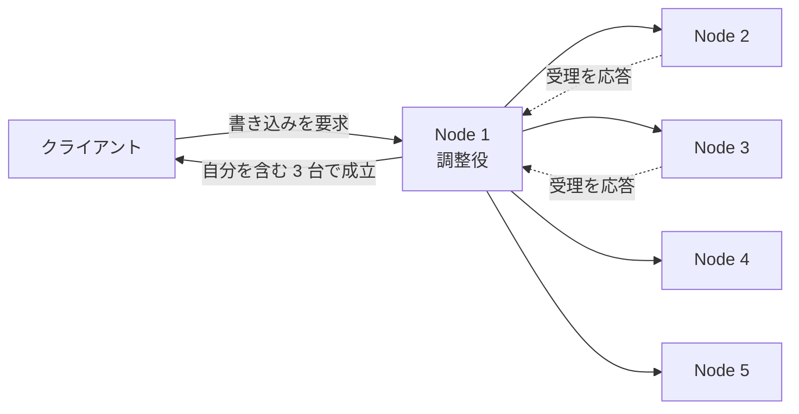
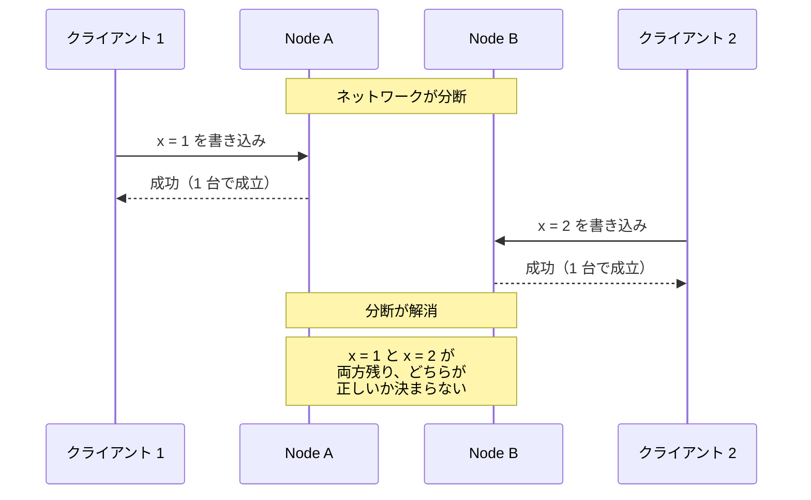
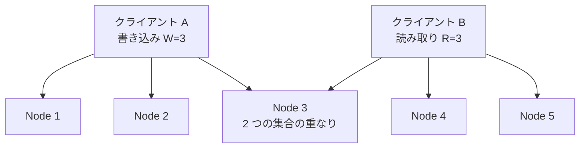
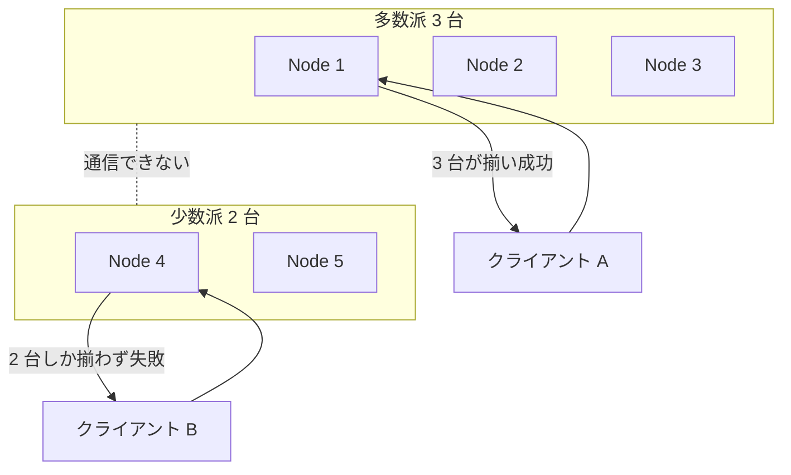

Quorum（クォーラム、定足数）は、ある操作を成立させるために応答が必要なノードの最小数です。同じ値を複数のノードに持たせる複製の構成では、全ノードの応答を待たず、この数だけ集まった時点で操作を確定させます。最も広く使われるのは過半数を要求する構成で、N 台のクラスタなら `N / 2 + 1` 台（小数点以下は切り捨て）の応答で成立します。前提として、故障はノードの停止とネットワークの分断だけを考えます。誤った値を返す故障（ビザンチン障害）には触れません。

効いているのは台数そのものではなく、過半数を選ぶと顔ぶれが必ず重なる事です。5 台から 3 台を選び、別の操作がまた 3 台を選ぶと、合わせて 6 台分を選んだ事になります。5 台しか居ないので、どちらの 3 台にも入るノードが 1 台以上残ります。

同時に 2 つの書き込みが走ると、多くのノードは片方しか受け取らず、競合が起きている事に気付けません。2 つとも受け取るのは重なったノードだけで、そこで古い方を断れます。重なりが保証するのは、その判断ができるノードが必ず居る事までです。断る規則は別に必要です。

書き込みが成立するまでの流れを以下に示します。

上記の図の調整役は、クライアントの要求を最初に受けたノードが務めます。複製を持つ 5 台のうちの 1 台なので、N に数えるのは複製の台数だけです。調整役が落ちた場合は、クライアントが別のノードに送り直します。数えているのは自分を含めた台数で、残る 2 台の応答は待ちません。遅いノードや落ちたノードの遅延がクライアントの待ち時間に響かない事が、クォーラムを使う直接の理由です。

---

### なぜ Quorum が必要なのか

成立に必要な応答数は、1 台から N 台までのどこかを選ぶ事になります。N 台にすると、値は必ず全台に揃うものの、1 台が落ちただけで書き込みが止まります。1 台にすると、応答は速い代わりに、書いた値を持たないノードが残ります。

1 台で成立させる構成の問題は、ネットワークが分断された時に表に出ます。分断された両側が、それぞれ独立に書き込みを受け付けます。

上記の図で問題になるのは、分断が解消した後です。どちらのクライアントも成功の応答を受け取っているため、一方を捨てると、成功した筈の更新が消えます。全ノードの応答を待つ構成なら、この状態は起きません。分断中はどちらも全台の応答を集められず、両側とも書き込みを断るからです。しかし、分断が無い平常時でも 1 台の停止で全体が止まるため、複製した意味が薄くなります。

過半数は、1 台と N 台の中間です。互いに素な過半数の集合は同時に 2 つ作れないため、分断中に書き込みが成立するのは多数派だけです。少数派は必要な応答数を集められず、書き込みを断ります。

---

### 集合を重ねる 2 つの条件

N 台の複製に対して、書き込みに必要な応答数を W、読み取りに必要な応答数を R と書きます。この 2 つには、目的の違う条件が 2 つあります。`W + R > N` を満たすと、書き込みに参加したノードの集合と、読み取りが応答を集めた集合は、必ず 1 台以上重なります。重なったノードは、最後に成功した書き込みの値を持っています。ただし、集めた R 個の応答のうちどれが最新かを見分ける手段は別に必要です（後述）。

`W > N / 2` を満たすと、書き込み同士も必ず重なります。ここで注意が必要なのは、重なりが排他を意味しない点です。重なったノードが値の新旧を比べて古い側を断る規則を持って初めて、一方だけが成立します。規則を置かなければ、重なったノードは両方を受理し、2 つのバージョンが残ります。

重なりの様子は以下の通りです。

上記の図の Node 3 が重なりです。N は 5、W と R はどちらも 3 なので `W + R = 6` となり、N より大きくなります。5 台から 3 台ずつをどう選んでも、共有されるノードが 1 台以上残ります。

---

### どの値が新しいかを見分ける

読み取りが集めた 3 つの値のうちどれが新しいのかは、値そのものからは分かりません。単調に増えるバージョン番号を値に添えておき、番号の大きい方を新しいと判定します。書き込みが 1 台を必ず経由する構成なら、そのノードが採番すれば番号は 1 本に並びます。

複数のノードが並行して書き込みを受け付ける構成では、単一の番号だけでは、並行して起きた 2 つの更新と後から起きた更新を区別できません。区別する必要がある場合は、ノードごとのカウンタを組として保持し、一方の更新が他方を因果的に含むか、両者が並行更新であるかを判定します。並行して起きた更新どうしの優先順位までは決まらないため、別に競合解決の規則が必要です。

書き込みが W に届かないまま失敗した場合、既に受理したノードには値が残ります。クライアントには失敗が返るため、その書き込みは成立していません。後から同じ値が別の経路で広がって成立する場合もあるので、書き込みの失敗は「成立しなかった」ではなく「成立したかどうか分からない」を意味します。同じ操作をやり直せるようにクライアントを作る事になります。

---

### W と R の配分

W は書き込みに必要な応答数、R は読み取りに必要な応答数で、この組み合わせは 1 通りではありません。複製が 3 台（N = 3）の場合は以下の通りです。

| 書き込み W | 読み取り R | 読み書きが重なる `W + R > N` | 書き込み同士が重なる `W > N / 2` | 性質 |
|---|---|---|---|---|
| 1 台 | 3 台 | ○ | ✕ | 書き込みが速い。1 台でも落ちると読めず、同時書き込みが両方成立する |
| 2 台 | 2 台 | ○ | ○ | 読み取りも書き込みも 1 台の障害に耐える |
| 3 台 | 1 台 | ○ | ○ | 読み取りが速い。1 台でも落ちると書き込めない |

W = R = `N / 2 + 1` を選んだ構成を過半数クォーラム（majority quorum）と呼びます。2 つの条件を同時に満たし、読み書きのどちらも同じ台数で済むため、既定の選択になります。読み取りが書き込みより桁違いに多い構成では R を小さく寄せる配分も向いていると考えられます。ただし、その分だけ W が大きくなり、書き込みが少数の障害で止まりやすくなります。

R と W を利用者の設定として外に出した例に、Amazon が社内向けに作った複製付きの Key-Value ストアである [Dynamo](https://www.allthingsdistributed.com/files/amazon-dynamo-sosp2007.pdf)（2007 年の論文）があります。Dynamo は `R + W > N` を満たす設定を quorum-like と呼び、`W > N / 2` は要求しません。

よく使われる `N = 3`、`R = 2`、`W = 2` の構成は `W > N / 2` を満たします。それでも、同時書き込みで生じた複数のバージョンはどちらも残ります。論文は、残ったバージョンを読み取りの時にクライアントへ全部渡し、併合の判断をアプリケーションに任せる、という使い方を挙げています。重なるだけでは片方が消えない例がここにあります。

注意点として、Dynamo が使うのは sloppy quorum と呼ばれる方式です。ノードが落ちている間は本来の N 台以外に書くため、`R + W > N` を設定しても、上で説明した重なりは保証されません。

---

### 台数と耐えられる障害数

過半数を割った時点で、クラスタは書き込みを止めます。そのため、耐えられる障害数は台数から決まります。f 台の障害に耐えるには `2f + 1` 台が必要だ、と言い換えられます。

| クラスタの台数 | 過半数 | 耐えられる障害数 |
|---|---|---|
| 3 | 2 | 1 |
| 4 | 3 | 1 |
| 5 | 3 | 2 |
| 6 | 4 | 2 |
| 7 | 4 | 3 |

`2f + 1` という関係は、[Majority Quorum のパターン解説](https://martinfowler.com/articles/patterns-of-distributed-systems/majority-quorum.html)に載っています。台数を偶数にしても、耐えられる障害数は 1 台少ない奇数台の場合と変わりません。故障し得るノードだけが増えるため、奇数台で構成します。

上の台数表と、偶数台が損になる話は、KVS（Key-Value Store）である etcd の [FAQ](https://etcd.io/docs/v3.5/faq/) に載っているものです。etcd は、複数のノードが同じ値に合意する処理を Raft というアルゴリズムで実装しており、その合意の成立条件が過半数のクォーラムです。FAQ は、台数を増やすとデータを複製する先が増えて書き込みの性能が落ちるため 7 台以下に収めるよう勧めており、5 台なら 2 台の障害に耐えられて多くの場合はそれで足りる、と書かれています。

---

### 分断が起きた場合

5 台が 3 台と 2 台に分断された場合は以下の通りです。

上記の図で分かれ目になっているのは、要求を受けたノードがどちら側に居るかだけです。少数派に送ったクライアント B は失敗を受け取り、別のノードに送り直すまで書き込めません。多数派が残る分かれ方であれば、クラスタ全体としては分断中も書き込みを受け付けられ、値が 2 箇所で別々に進む事はありません。5 台が 2 台・2 台・1 台に割れた場合は、どこも過半数を作れないので全体が止まります。

少数派が断るのは、過半数を必要とする操作だけです。実装によっては、少数派のノードが単独で読み取りに応答し、古い値を返します。全台に書いておけば読み取りが 1 台で済むのではないか、と考える方がいるかもしれません。その配分は N = 5、W = 5、R = 1 に相当し、分断されると多数派でも書き込めなくなります。分断中に進み続けるには、W を過半数まで下げる必要があります。

分断が解消すると、少数派は多数派から差分を受け取って追い付きます。追い付かせる処理はクォーラムの外にあり、ログを複製する仕組みや、読み取りの時に古い値を見つけて直す仕組みが担当します。W を過半数に取り、成功を返す前にディスクに書き終えているなら、少数派で成立した書き込みは無いため、クライアントに成功を返した更新が失われる事もありません。W が過半数に届かない配分では、少数派でも書き込みが成立するので、この性質は成り立ちません。

---

### 利点

- 遅いノードや落ちたノードの応答を待たずに操作を確定できる
- 互いに素な過半数の集合は作れないため、分断中も更新を 1 箇所に寄せられる
- 台数から耐えられる障害数が決まり、構成を見積もりやすい
- W と R の配分で、書き込みと読み取りのどちらを速くするか選べる

---

### 欠点

以下は、少数の障害からの復旧を待たずに進む事と、更新の成立を 1 箇所に絞る事を優先した結果として現れる制約です。

- 過半数を割ると、生き残ったノードがあっても書き込みを止める
- 台数を偶数にしても耐えられる障害数は増えず、通信量だけが増える
- どの値が新しいのかを判定するバージョン番号を別に用意する必要がある
- 応答の遅いノードは毎回クォーラムから外れ、追い付くまでの間は古い値を持つ
- 拠点をまたぐ構成では、過半数を集めるたびに拠点間の往復の時間が待ち時間に加わる

---

### 適さないケース

- 分断中も両側で書き込みを受け付けたいシステム。CRDT のように後から併合できるデータ型を検討する
- ノードが数百台に広がる構成。クォーラムを数える対象は数台に絞り、残りは読み取り用の複製に回す
- 複製を持たない単一ノードのシステム
- 書き込みの待ち時間に上限があり、過半数目のノードの応答を待てない場合

CRDT（Conflict-free Replicated Data Type）とは、複数のノードが独立に更新しても、後から併合すれば必ず同じ結果に収束するように作ったデータ型です。集合への要素の追加やカウンタの増加のように、適用の順序が入れ替わっても結果が変わらない操作だけを提供します。クォーラムが応答数で解いている競合の問題は、データ型の性質で回避されます。

---

### 似た仕組みとの比較

成立に必要な応答数の選び方で性質がどう変わるかは、以下の通りです。

| | 全ノードの応答を待つ | 過半数クォーラム | 1 台の応答で成立 |
|---|---|---|---|
| 必要な応答数 | N | `N / 2 + 1` | 1 |
| 耐えられる障害数 | 0 | `(N - 1) / 2`（切り捨て） | N - 1 |
| 分断中の書き込み | 両側とも止まる | 多数派だけ受け付ける | 両側が受け付ける |
| 値の食い違い | 起きない | 古い側を断る規則があれば起きない | 起きる |
| 待ち時間を決めるノード | 最も遅い 1 台 | 過半数目の 1 台 | 最も速い 1 台 |

クォーラムは単独で使う仕組みではなく、他の仕組みの土台になります。分かりやすいのが [WAL](../write-ahead-log/)（Write-Ahead Log、書き込み先行ログ）の高位ウォーターマークで、これは記録した変更のうち、どこまでをクライアントに見せて良いかを示す位置です。

その位置を「過半数のノードに複製できた所まで」と決める方式は、集合が重なる性質を利用しています。書き込みを受け付ける代表のノードは過半数の票で選ばれ、票を出すのは、自分のログが候補より新しくないノードだけです。確定済みの変更を持つ過半数と、票を出した過半数は必ず重なるため、確定済みの変更を持たないノードは代表になれません。なお、過半数に複製されたという事実だけでは確定になりません。代表が交代する経路の都合で、確定と扱って良い条件はもう少し狭くなります。

[Lease](../lease/) も同じ性質を利用しています。権利を貸す側のノードを複製する構成では、期限の記録を過半数で揃えておくと、貸す側が落ちても次のノードが既存の期限を引き継げます。
