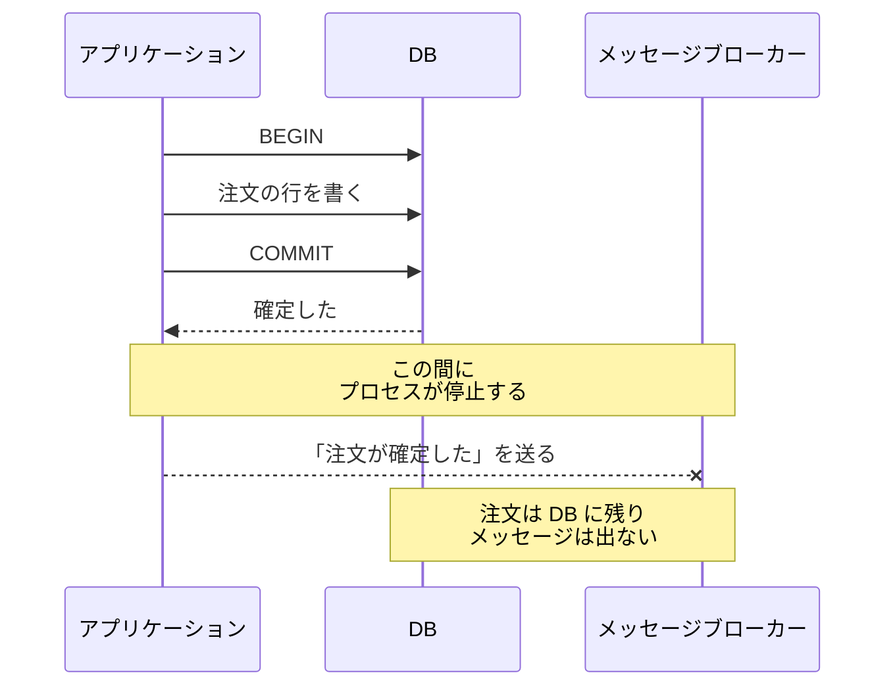
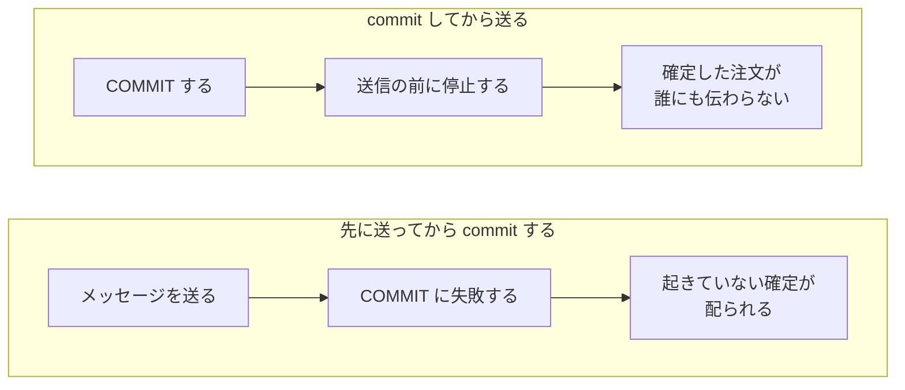
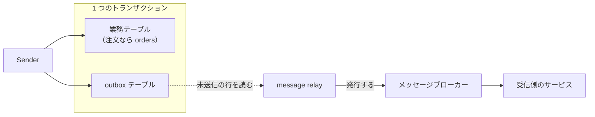
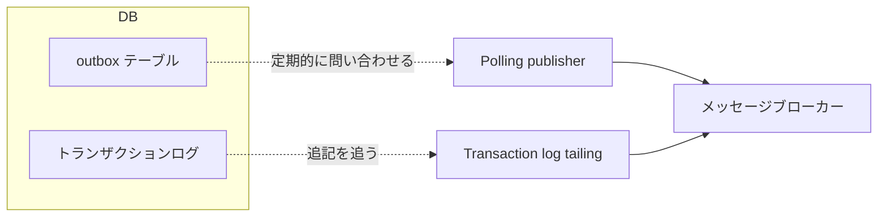
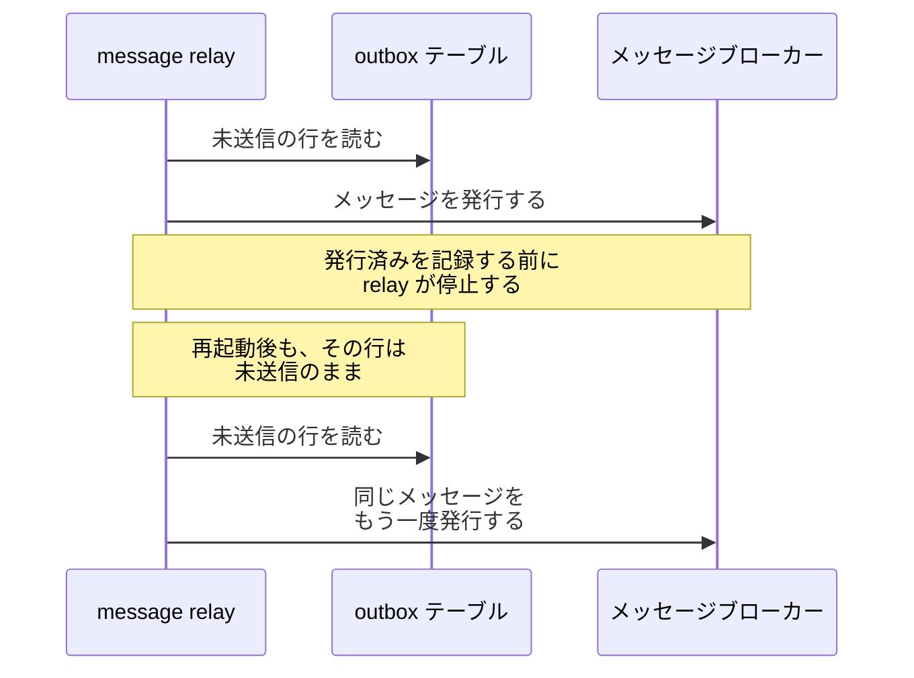
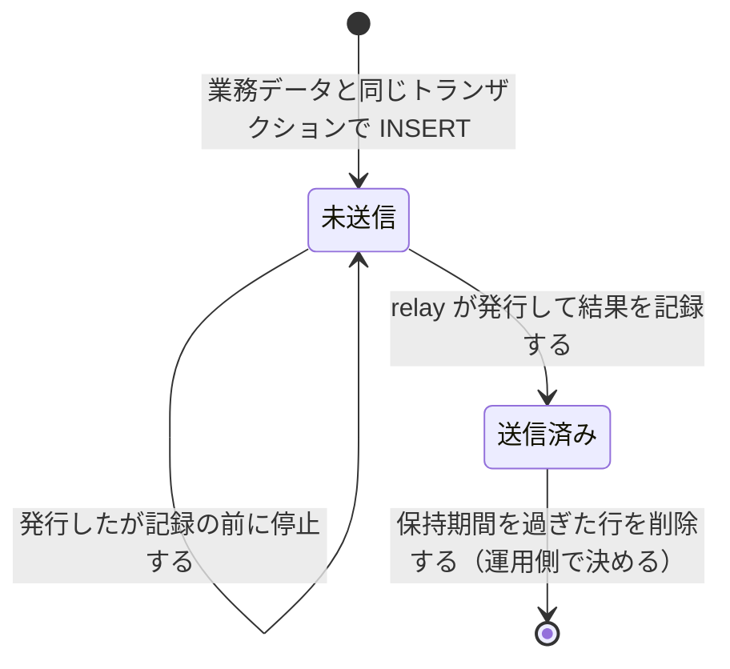

書き込み先が 2 つある注文を例に説明を始めましょう。書き込み先の 1 つは注文の記録をする DB、もう 1 つは在庫や配送を担う別のサービスに「注文が確定した」と伝えるためのメッセージブローカー（メッセージを預かって配る仕組み）です。

Transactional Outbox は、送るべきメッセージを業務データの更新と同じトランザクションで書き、別のプロセスがそれを後からブローカーに送るパターンです。書き込み先を DB の 1 箇所に寄せる事で、2 つの書き込みが食い違う余地を減らします。

注文を確定した直後にプロセスが停止すると、不都合がある状況が発生します。



注文を確定した事実と、それを外に知らせたかどうかが、この 1 回の停止でずれます。在庫を担うサービスは注文の存在を知らないまま動き続け、アプリケーションから見ると失敗した処理は 1 つもありません。

本ノートでは、この食い違いを防ぐ方法を説明します。受け取った側で重複をどう排除するかの実装と、複数サービスにまたがる業務の取り消しには触れません。

---

### なぜ 2 つの書き込みが食い違うのか

冒頭で見たのは commit の後で止まる場合です。順序を入れ替えても、壊れ方が入れ替わるだけになります。



例えば、決済の完了を伝えるメッセージを先に送ると、受け取った側は領収書を発行します。その後でトランザクションが中止されれば、DB に存在しない決済の領収書だけが残ります。

2 つの書き込みを 1 つの操作にまとめる手段としては、[2PC](../two-phase-commit/) があります。関わった全員の最終的な判断を確定か中止のどちらか一方に揃えるプロトコルで、DB とブローカーを 2 つの参加者として並べれば、片方だけが成立した状態を避けられます。

しかし、[Pattern: Transactional outbox の説明](https://microservices.io/patterns/data/transactional-outbox.html)はこの手を選ばない理由を 2 つ挙げています。1 つは、DB とメッセージブローカーの一方または両方が 2PC に対応していない場合がある事です。もう 1 つは、対応していたとしても、サービスを DB とブローカーの両方に結合させるのは望ましくない事が多い、という点です。

---

### 書き込み先を DB の 1 箇所に寄せる

壊れる原因は順序の選び方ではなく、1 つの処理が 2 つの書き込み先を持っている事です。そのため Transactional Outbox は、ブローカーへの送信をトランザクションの外に押し出さず、送るべきメッセージを DB の中に書きます。



メッセージを送る側を Sender、outbox の行をブローカーに発行するプロセスを message relay と呼びます。Sender はブローカーと直接やり取りしないため、ブローカーが停止しても、直ちに注文の受け付けが止まるわけではありません。

commit が成立すれば、配送すべきメッセージが outbox に残り、rollback すれば業務データもろとも消えます。トランザクションが決めるのはここまでです。実際にブローカーへ届くのは、relay が outbox を読んで発行してからになります。

この例で同じトランザクションに入るのは、この 2 つの INSERT です。以下が、PostgreSQL での一例です。

```sql
BEGIN;

INSERT INTO orders (id, customer_id, total_amount, status)
VALUES ('01J8Z3', 42, 12800, 'confirmed');

INSERT INTO outbox (id, aggregate_id, event_type, payload)
VALUES ('01J8Z4', '01J8Z3', 'OrderConfirmed',
        '{"order_id": "01J8Z3", "total_amount": 12800}'::jsonb);

COMMIT;
```

outbox の 3 つの列は、どの注文についての出来事かを指す `aggregate_id`、出来事の種類を表す `event_type`、受け取る側が読む中身の `payload` です。列の設計と relay のコードは [Domain Event](../../software-architecture/domain-event/) が、トランザクションに何を入れるかは [Transaction Scope](../../database-systems/transaction-scope/) が扱っています。

2 つ目の INSERT の前にプロセスが停止すると、commit に達していないので、1 つ目の変更も確定しません。

---

### relay が outbox を読む 2 つの方法

outbox に溜まった行をブローカーに送る方法は、relay が何を読むかで 2 つに分かれます。Polling publisher は outbox テーブルを繰り返し読み、まだ送っていない行を見つけて発行します。Transaction log tailing は、DB が自分の永続化のために書いているトランザクションログを追い、outbox に挿入された各メッセージを発行します。



トランザクションログは、[WAL](../write-ahead-log/) のように更新を順に書き足していく記録です。仕組みは DB ごとに違い、MySQL の binlog、PostgreSQL の WAL、AWS DynamoDB の table streams が挙げられています。

DB の変更を捕捉して外部に流す仕組みは一般に CDC（Change Data Capture）と呼ばれ、Transaction log tailing はその 1 つです。

挙げられている主な性質は、以下の通りです。

| 観点 | Polling publisher | Transaction log tailing |
|---|---|---|
| 読む先 | outbox テーブル | DB のトランザクションログ |
| 利点 | 特定のトランザクションログ機構に依存しにくい | commit 済みの変更をトランザクションログから追跡できる |
| 欠点 | 順序通りに発行するのが難しい。全ての NoSQL の DB が対応している訳ではない | DB 固有の解決策が必要。重複した発行を避けるのが難しい |

読む先が違っても、outbox に書く側の処理は変わりません。変わるのは、メッセージがどの順序で何回ブローカーに発行されるかです。

---

### 何が保証され、何が保証されないか

outbox に配送すべきメッセージが残るかどうかは、commit の成否と一致します。しかし、送られる回数までは一致しません。relay がブローカーに発行した後、発行済みを記録する前に落ちると、再起動後に同じメッセージをもう一度発行します。



発行と記録は別の書き込みなので、その間で落ちた事を再起動後の relay は区別できません。relay が未送信のメッセージを継続して再試行する前提では、取りこぼしを避ける代わりに同じメッセージを複数回発行し得ます。この配送方式を at-least-once と呼びます。

relay が決めるのはブローカーへ発行するまでで、受信側のサービスに何回届くかはブローカーの配送保証にも左右されます。どちらの経路でも重複はあり得るので、受け取る側は冪等（べきとう、idempotent）でなければなりません。実現の方法は [Idempotency](../idempotency/) が扱っています。

順序も同じで、保証の範囲が段階に分かれます。アプリケーションが送った順序でブローカーに発行される事は利点として挙げられている一方で、Polling publisher の欠点には順序通りの発行が難しい事が挙げられており、この性質は relay の実装で変わります。受信側それぞれに同じ順序で届く事は、多くの場合に必要になるものの、このパターンでは扱われていません。

Polling publisher で送信済みを outbox に記録する実装では、1 行を未送信と送信済みの 2 状態で扱えます。



この実装で送信済みになった行をいつまで置くかは、このパターンが決めていません。行が積み上がるほど未送信の行を探す読み取りは重くなるので、削除の周期は運用側で決める事になります。

---

### 利点

- 2PC を使わずに、DB の更新と配送すべきメッセージの記録のずれを防げる
- 配送すべきメッセージが outbox に残るのは、DB のトランザクションが commit した場合だけである
- メッセージの順序を保つよう設計できるが、実際の保証は relay の実装に依存する
- ブローカーへの同期送信を待たず、業務データと outbox の記録を commit できる

---

### 欠点

最初の 2 つはパターンの説明が挙げているもので、残りは outbox を持つ事の代償です。

- outbox への INSERT を書き忘れると、DB だけが更新されてメッセージが出ない状態に戻る
- relay が同じメッセージを 2 回以上発行し得るので、受け取る側を冪等にする必要がある
- 業務と直接関係のない outbox テーブルと relay プロセスを運用し続ける事になる
- 送信済みの行を削除する周期を別に決めて運用する必要がある

---

### 適さないケース

以下は、ここまでの性質から導いた判断です。

- 送信の成否をその場で呼び出し元に返す必要がある、同期の要求応答
- 状態の変化をイベントの並びとして保存する [Event Sourcing](../../software-architecture/event-sourcing/) を採っていて、その記録からそのまま配送できる場合
- 受け取る側を冪等にできず、重複した発行を許容できない処理
