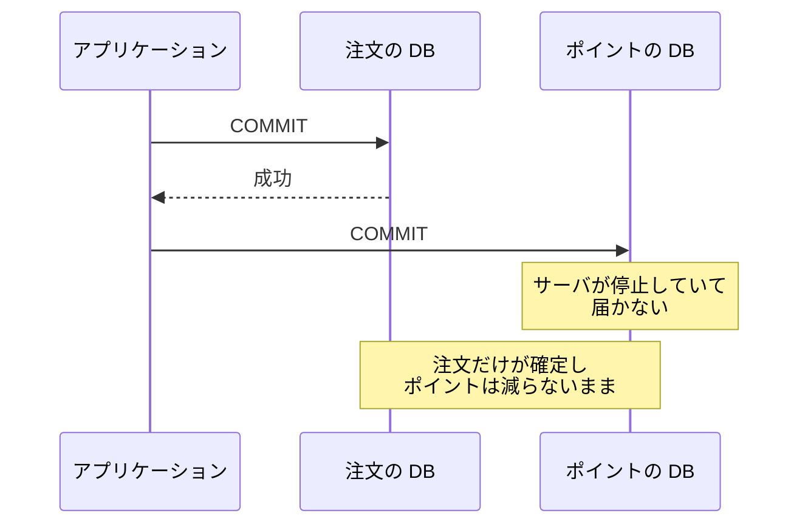
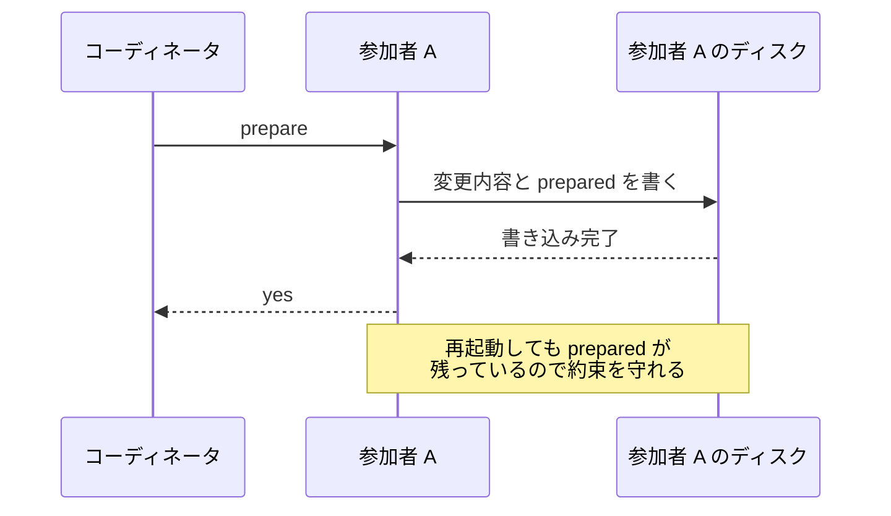
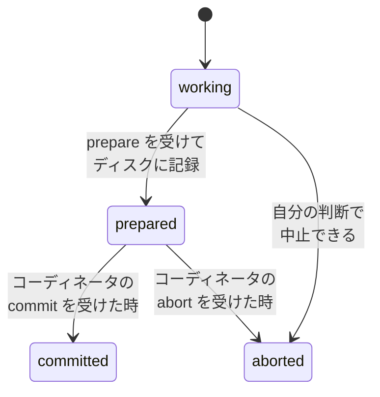
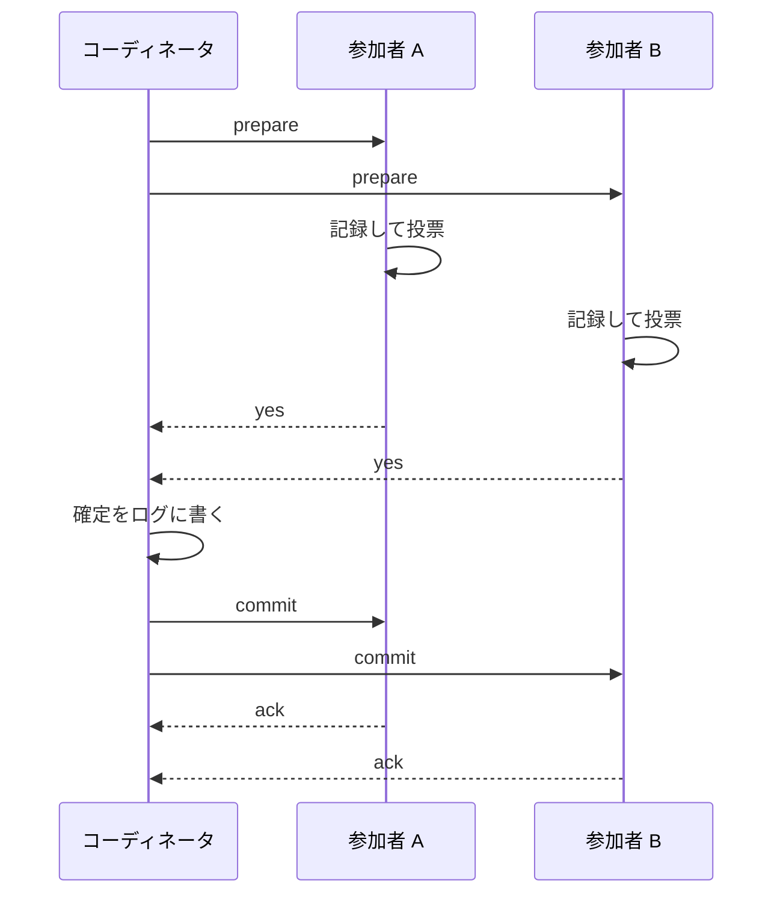
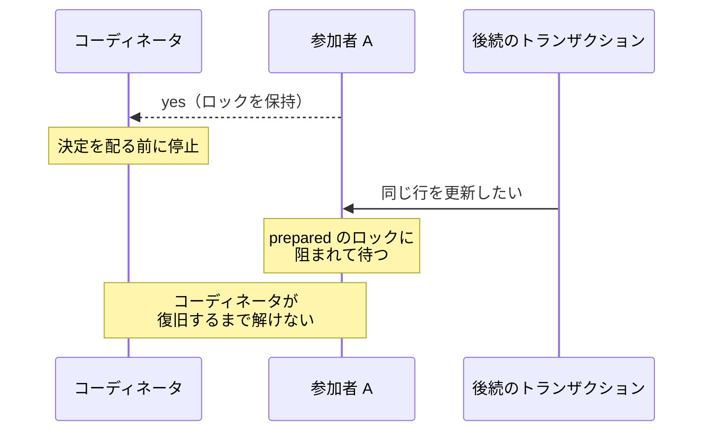
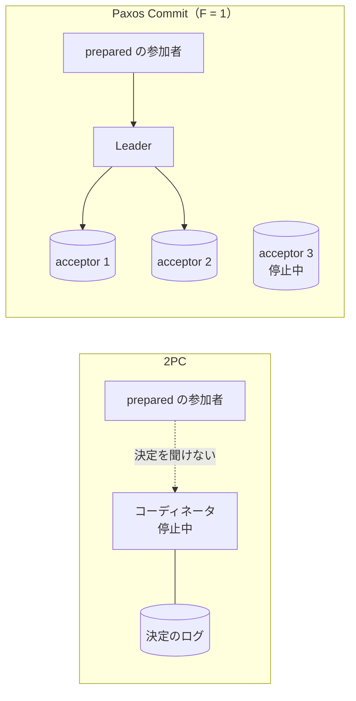

2PC（Two-Phase Commit、2 相コミット）は、複数の DB にまたがる 1 つの更新について、関わった全員の最終的な判断が確定（commit）か中止（abort）のどちらか一方に揃うようにする手順です。確定できるかを全員に問い合わせる準備フェーズと、決めた結果を配る決定フェーズの 2 段階で進む事が名前の由来です。想定する故障は、参加するプロセスの停止と通信の途絶です。誤った値を返す故障（ビザンチン障害）には触れません。

この手順が必要な場面の代表は、1 つの業務処理が複数の DB を書き換える時です。例えば、注文を記録する DB と、支払いに使うポイントの残高を持つ DB が別のサーバにある EC サイトで、ポイント払いの注文を受けるとします。注文が確定したのにポイントの更新は中止された、という食い違った結末は、後から人手で突き合わせて直す作業を生みます。

登場するのは、確定か中止かを決めて参加者に配るコーディネータと、自分のローカルトランザクションを実際に確定・中止する参加者です。上の例では、注文の DB が参加者 A、ポイントの DB が参加者 B で、コーディネータは 2 つの DB とは別に動くトランザクションマネージャが務める構成を考えます。

2PC は、ある参加者は確定・別の参加者は中止という最終的な判断の分裂を防ぐ事を目的にしています。揃うのは最終的な判断であって、複数の DB の変更が同じ瞬間に見え始める事までは保証しません。決定を配っている途中には、片方が確定済みで、もう片方はまだ決定を待っている、という瞬間があり得ます。

Jim Gray 氏と Leslie Lamport 氏の論文「[Consensus on Transaction Commit](https://lamport.azurewebsites.net/video/consensus-on-transaction-commit.pdf)」（2004 年）は、コーディネータと参加者を transaction manager、resource manager と呼び、2PC を単一のコーディネータで合意に到達する古典的なトランザクションコミットのプロトコルとして説明しています。

---

### なぜコミットの合図を 2 回に分けるのか

素朴な方法は、アプリケーションが 2 つの DB に順番に COMMIT を送る事です。この方法は、1 つ目の COMMIT と 2 つ目の COMMIT の間に故障が挟まると壊れます。具体的には、以下の流れで片方だけが成立します。

上記の図の注文の確定は取り消せません。ローカルトランザクションの原子性（変更を全て反映するか、全て無かった事にするかの性質）は 1 台の DB の中で閉じており、確定した変更は以後に始まる読み取りから見えます。後から注文を打ち消す更新を入れる事はできるものの、それは新しい別の更新であり、間の時間には片方だけの状態が読まれています。

2 回の COMMIT の間隔は短いため、壊れる事は滅多に無いと考える方がいるかもしれません。それでも、確定の件数が積み上がるほど、この故障は無視できなくなります。しかも、片方だけが成立した事に気付いて直す仕組みは、この構成のどこにもありません。

壊れた原因は、確定という後戻りできない一線を各参加者がばらばらの瞬間にまたいでいる事です。そのため 2PC は、確定の前に「言われればいつでも確定できる」状態を全員に作らせ、全員がそこに到達した事を見届けてから、確定の合図を一斉に配ります。

---

### 準備フェーズ - 確定できる状態を作って投票する

前提として、注文とポイントの更新は、アプリケーションが各 DB のローカルトランザクションとして実行済みです。各参加者は更新対象の行のロックを取り、確定しないまま持っています。2PC が引き受けるのは、この確定の段階だけです。

コーディネータは、全参加者に prepare（準備の要求）を送ります。受け取った参加者は、トランザクションの変更内容と「準備が完了した」という記録をディスクに書いてから、確定に応じられるなら yes、応じられないなら no を返します。この返事が投票になります。

yes の返事は、コーディネータに言われればいつでも確定するという約束です。参加者は、返事の後に再起動しても約束を守れるように、クラッシュしても消えないディスクに先に書きます。prepare を受けてから yes を返すまでの順序は以下の通りです。

書き込みと yes の順序が逆だと、再起動した参加者は自分が何を約束したのかを知らないまま、コーディネータから commit を受け取る事になります。

この永続化には DB の [WAL](../write-ahead-log/) などが使われ、PostgreSQL では PREPARE TRANSACTION がこの状態を作ります。[公式ドキュメント](https://www.postgresql.org/docs/current/sql-prepare-transaction.html)は、このコマンドの後で「トランザクションはセッションから切り離され、その状態は完全にディスクに保存される。コミットが要求される前に DB がクラッシュしても、コミットに成功する見込みが非常に高い」と説明されています。

yes と答えた参加者は、自分から中止する権利を手放します。準備の前なら、参加者はいつでも自分の判断で中止できます（制約違反やタイムアウトが典型）。準備の後は、確定か中止かを決める権限がコーディネータに一本化されます。参加者が独断で選ぶ操作は塞がれていないものの、選べば最終的な判断を揃える保証が壊れます。この一本化があるから、コーディネータは全員の yes を見た時点で、勝手に中止した参加者が出る事を心配せずに確定を配れます。

以下が参加者の状態遷移です。

上記の図の prepared から出る 2 本の矢印は、どちらもコーディネータの決定を条件にしています。参加者は、更新対象へのロックを保持したまま prepared に留まり、決定を待ちます。

---

### 決定フェーズ - 結果を記録してから配る

コーディネータが確定を選べるのは、全参加者の yes が揃った時だけです。1 台でも no を返すか応答が間に合わなければ、コーディネータは中止を選び、参加者に abort を送ります。

選んだ決定は、参加者に配る前に自分のログに書きます。この書き込みで、トランザクション全体の結果が決まります。書く前にコーディネータが落ちれば、再起動後に中止を選び直せます。書いた後に落ちても、ログを読んで同じ決定を配り直せます。この順序が、決定を 1 度きりにする保証の要になります。

prepare から確定までの全体の流れは以下の通りです。

参加者は、commit を受け取った時点で自分のローカルトランザクションを確定できます。上記の図の ack（acknowledgment、受領の応答）は、コーディネータが完了を確かめるための応答で、2 つのフェーズそのものとは別の役割です。ack が返らない参加者には、コーディネータが決定を送り直します。決定はログに残っているので、何度送っても同じ結果です。再起動した参加者も、ディスクに prepared の記録を見付けたらコーディネータに問い合わせ、決定を受け取り直します。

上記の図のとおり、確定までには prepare の要求と投票、commit の通知という複数回の通信に加え、参加者・コーディネータ双方のディスクへの書き込みが挟まります。ack で完了を確かめる実装では、その応答も加わります。この遅延は確定のたびに掛かり、参加者が増えるほどメッセージの数も比例して増えます。

---

### コーディネータの停止が参加者を縛る

yes と答えた後、決定が届く前にコーディネータが落ちると、参加者は動けなくなります。確定も中止も自分では選べないからです。この宙吊りは in-doubt と呼ばれます。上の論文は、この弱点を「コーディネータの故障は、修復されるまでプロトコルを塞き止め得る。特に、全参加者が yes を送った直後に故障すると、残された参加者は確定と中止のどちらが選ばれたのかを知る術が無い」と要約しています。

他の参加者に聞いて回る手はあります。誰かが既に commit か abort を受け取っていれば、決定はその受け取った内容だと分かる筈です。しかし、全員が prepared のままなら決められません。コーディネータが確定をログに書いた直後に落ちた可能性が残り、その場合、復旧したコーディネータはログの確定を配り直すので、待ち切れずに中止した参加者と食い違います。

in-doubt の間、参加者はロックを保持し続けます。その結果、同じ行に触る後続のトランザクションが次々に詰まります。PostgreSQL のドキュメントも、prepared のトランザクションは保持していたロックを持ち続けると述べ、長時間放置しないよう注意した上で、外部のトランザクションマネージャが速やかに確定か中止を指示する前提の機能だと明記しています。

コーディネータの停止で何が詰まるかは、以下の通りです。

コーディネータが止まっても、確定と中止が食い違う結末にはなりません。壊れるのは進行性（liveness、処理が前に進む性質）で、決定を知らない参加者は安全に止まったまま待ちます。この待ちが blocking と呼ばれる代償です。上記の図の詰まりを解く正攻法は、コーディネータの復旧です。

blocking を避ける狙いで提案されてきた手順は、non-blocking commit protocol と総称されます。その代表的な系統が 3 相コミット（Three-Phase Commit）で、決定の前に状態を 1 つ足し、コーディネータが止まっても残ったノードだけで判断できる条件を作ろうとします。ただし、成り立つための前提条件と正しさには注意が必要です。上の論文も、それらについて、明確に述べられた正しさの条件を満たすと証明された完全なアルゴリズムを知らないと評しています。

論文が代わりに提案する Paxos Commit は、合意アルゴリズムの Paxos（[Leader and Followers](../leader-and-followers/) で触れた、提案された値のうち 1 つだけを選ぶ手順）を参加者ごとに 1 つずつ動かし、それぞれの Prepared / Aborted という判断を複製します。

判断を記録するのは acceptor（合意の記録役）で、acceptor が何台まで同時に故障しても進めたいかを F として 2F + 1 台を置きます。1 台の故障まで許すなら F = 1 で、acceptor は 3 台になります。提案をまとめる Leader が 1 台に定まり、その Leader と F + 1 台以上の acceptor が十分な期間通信できていれば、決定まで進められます。

決定の記録がどこにあるのかは、2PC と並べると以下の通りです。

上記の図の Paxos Commit では、acceptor が 1 台止まっていても、1 台に定まった Leader が参加者と残り 2 台の acceptor に通信できれば、参加者は決定を知る事ができます。故障に強くなる代わりに、メッセージの数は増えます。F = 0 にして acceptor と Leader を 1 台ずつ同じノードに置くと、Paxos Commit は 2PC と本質的に同じ手順になります。そのノードで Leader と acceptor を兼ねるのが、2PC のコーディネータです。

Paxos Commit でも、トランザクションを確定できるのは、参加者ごとの Paxos が全て Prepared を選んだ時だけです。過半数（2F + 1 台のうち F + 1 台）で足りるのは、参加者 1 つ分の判断を複製して持つ acceptor の間に限られます。

全員の Prepared を求める理由は、参加者がそれぞれ別の資源を管理している事にあると整理できます。冒頭の例で、ポイントの DB が残高不足で中止を選んだなら、注文の DB が yes を返していても全体は確定にできません。この点が、同じデータを複製して持つノードの間で過半数を使う [Leader and Followers](../leader-and-followers/) や[クォーラム](../quorum/)との違いです。

---

### 利点

- 最終的な決定が参加者の間で確定と中止に分裂する事を防げる
- 参加者は、ローカルトランザクションの仕組み（WAL とロック）をほぼそのまま流用できる
- X/Open XA として標準化され、対応する DB やミドルウェアを組み合わせて使える

3 番目の XA は、Transaction Manager（コーディネータの役）と Resource Manager（参加者の役）の間のインターフェースを定めた仕様で、標準化団体 X/Open の文書「Distributed Transaction Processing: The XA Specification」として発行されています。例えば MySQL は、[XA トランザクションのドキュメント](https://dev.mysql.com/doc/refman/8.4/en/xa.html)で、実装がこの文書に基づくと明記しています。

同じドキュメントは、複数の DB にまたがるトランザクションの全体をグローバルトランザクションと呼び、「それ自体はトランザクションである複数の処理が、全体として成功するか、全体として巻き戻されるかのどちらかでなければならないもの」と説明されています。

---

### 欠点

以下は、最終的な判断を全参加者で揃える事を優先した帰結です。

- 1 台でも準備に失敗すると全体が中止になり、参加者が増えるほど確定に進める見込みが下がる
- prepared の参加者はロックを持ったまま待ち、決定が遅れるほど後続のトランザクションを巻き込む
- コーディネータが進行性の単一障害点になる。故障しても結果は分裂せず安全に止まる代わりに、prepared のまま決定を知らない参加者が blocking する
- 確定のたびに複数回の通信と、参加者・コーディネータ双方のディスクへの書き込みが掛かる

---

### 適さないケース

- 参加者に他の組織のサービスが混ざる統合。相手にロックの保持と in-doubt の受け入れを要求する事になる
- 書き込みの遅延とスループットを最優先する経路
- DB の更新を先に確定し、イベントを介して別のサービスを後から追随させる結果整合で足りる業務。[Transactional Outbox](../transactional-outbox/) は、そのイベント発行を確実にする代表的な方法になる
