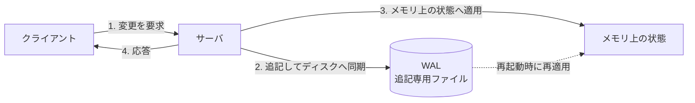
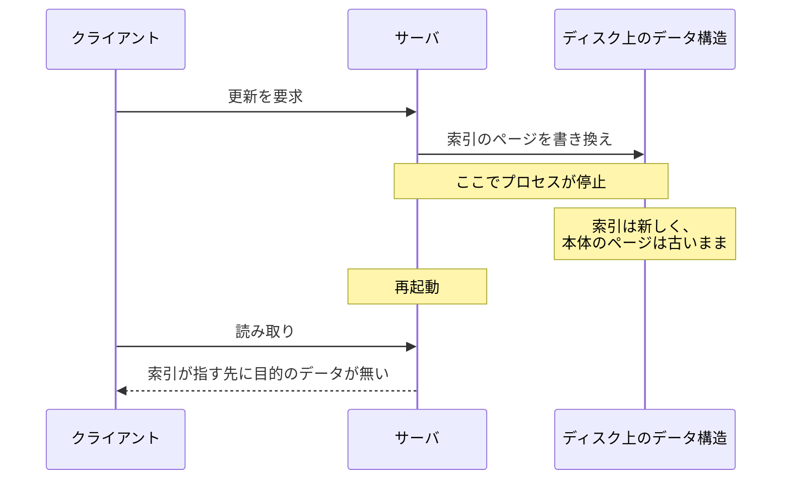
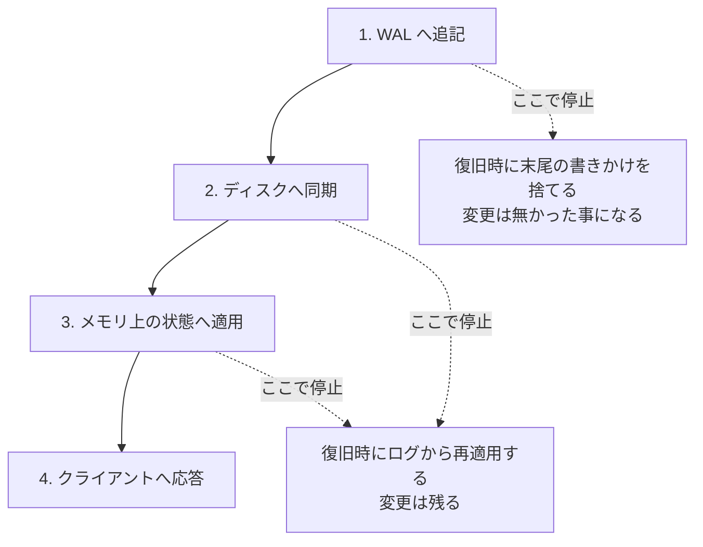
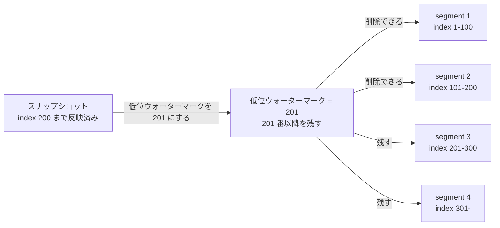
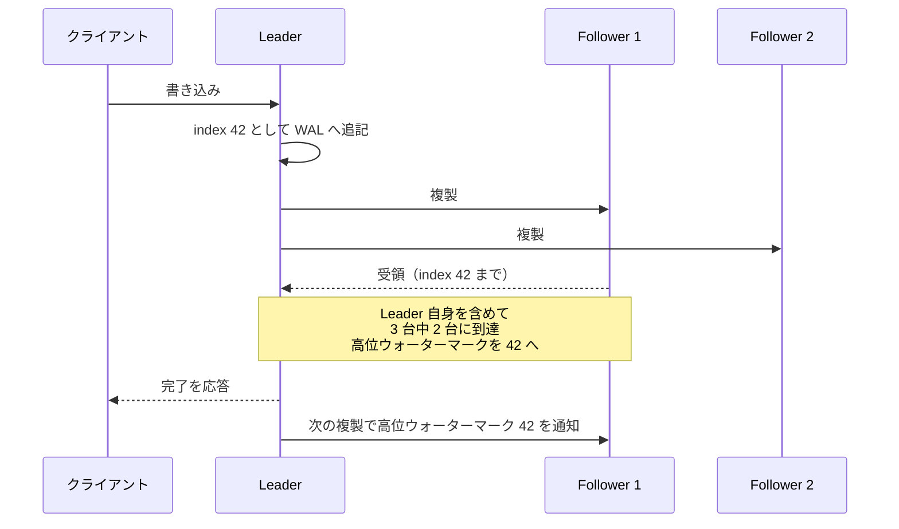

WAL（Write-Ahead Log、書き込み先行ログ）は、状態を変更する前にその変更内容を追記専用のファイルへ書き、ディスクへ書き終えてから応答を返す仕組みです。再起動した時は、スナップショットやチェックポイント以降のログを読み直して同じ変更を適用し、停止する直前の状態を復元します。利用できるスナップショットが無ければ、ログの先頭から再生します。ここでは、1 台のサーバが状態を失わないための WAL から、ログを複製した時に現れる 2 つの位置までを扱います。

低位ウォーターマーク（Low-Water Mark）はログのどこまでを捨ててよいかを示す位置、高位ウォーターマーク（High-Water Mark）はどこまでをクライアントへ見せてよいかを示す位置です。トランザクションの分離レベルや、ログを使った時点復旧は扱いません。

書き込みが到着してから応答するまでの経路を以下に示します。



上図で順番が効いているのは 2 と 3 です。ディスクへ書き終えるのが先で、メモリ上の状態を変えるのは後になります。逆順にすると、応答を返した変更がディスクに残っていない状態が生まれます。点線の経路は通常の処理では通らず、再起動の時だけ通ります。

---

### なぜ WAL が必要なのか

状態をディスク上のデータ構造へ直接書けばよいと考える方がいるかもしれません。しかし、この方法は 2 つの理由で成立しません。1 つは速度、もう 1 つは中断です。

速度の面では、索引や表のページ（ディスクへ読み書きする固定長の単位）はディスク上で離れた位置にあるため、更新のたびに複数箇所へ書き込む事になります。WAL は末尾へ追記するだけなので、書き込み位置が連続します。[PostgreSQL のドキュメント](https://www.postgresql.org/docs/current/wal-intro.html)も、ディスク書き込みが減る理由として、コミットのたびに変更した全てのデータファイルを同期する代わりに WAL だけを同期すれば済む点を挙げています。

中断はより深刻です。複数のページを書き換える途中でプロセスが停止すると、一部だけが更新された状態が残ります。

その状況を以下に示します。



上図で壊れているのは、索引と本体の対応です。どちらのページも単体では読めるため、サーバは矛盾に気付かないまま古いデータを返すか、存在しない位置を参照します。停止はどの瞬間にも起こり得るので、書き込む順番を工夫しても、複数箇所の更新を分割不能にはできません。

WAL は、この問題を「変更内容を 1 箇所へ記録してから、実際の更新を行う」という順序に置き換えて解きます。記録が完了していれば、更新の途中で止まっても再適用でやり直せます。記録が完了していなければ、その変更は無かった事にできます。

中断そのものは無くなりません。変わるのは、中断が半端な状態を残す場所です。ディスク上のデータ構造を直接更新する方式では、離れた複数のページが半端なまま残り、どこが食い違っているのかを後から判定できません。WAL で書きかけになり得るのはログ末尾の 1 件だけなので、そこを読み飛ばせば残りは全て完全なエントリです。

停止した時点ごとに、復旧後どうなるかを以下に示します。



上図の分かれ目は、2 の同期が終わったかどうかだけです。終わる前に止まれば変更は消え、終わった後に止まれば必ず適用されます。どちらへ転んでも、応答を返すのは 4 の時点なので、応答済みの変更が失われる事はありません。

---

### 仕組み

WAL に何を書くかは実装によって違います。状態を変えるコマンドをそのまま書く方式と、変更後のページの内容を書く方式があり、PostgreSQL は後者に近い形でページに対する変更を記録します。以下ではコマンドを書く方式で説明します。

1 件のエントリには、順序を表す通し番号（index）と、再適用に必要なデータ、そして壊れを検出するためのチェックサムを持たせます。index はログの中での連番で、DB の索引とは関係がありません。チェックサムは、データから計算した短い値で、内容が 1 ビットでも変われば別の値になります。

Go で書くと次のようになります。先頭 8 バイトが長さ（4 バイト）とチェックサム（4 バイト）で、続く本体の先頭 8 バイトが index です。

```go
// maxEntrySize は、壊れた長さから巨大な確保が走る事を防ぐ上限です。
const maxEntrySize = 8 << 20

// Entry は WAL に 1 件追記する状態変更です。
type Entry struct {
	Index uint64
	Data  []byte
}

// Append は entry をログ末尾へ追記し、ディスクへ書き終えるまで戻りません。
func Append(f *os.File, e Entry) error {
	body := make([]byte, 8+len(e.Data))
	binary.BigEndian.PutUint64(body, e.Index)
	copy(body[8:], e.Data)

	record := make([]byte, 8+len(body))
	binary.BigEndian.PutUint32(record, uint32(len(body)))
	copy(record[8:], body)
	// チェックサムは長さと本体の両方を覆う。
	binary.BigEndian.PutUint32(record[4:], crc32.ChecksumIEEE(append(record[:4:4], body...)))

	if _, err := f.Write(record); err != nil {
		return err
	}
	return f.Sync()
}
```

最後の `f.Sync()` が耐久性を決めています。`Write` が返った時点でデータは OS のページキャッシュ（OS が書き込みを一旦ためておくメモリ上の領域）にあり、電源が落ちれば消えます。`Sync` はそれをディスクへ書き出す指示です。1 件ごとに同期すると遅くなるため、複数の書き込みをまとめて 1 回で同期する実装が使われます。まとめている間は応答も待つ事になるので、応答時間と引き換えの調整になります。

同期を省いた場合に失われるものは、電源断やカーネルの停止で消える直近の書き込みだけです。プロセスだけが落ちた場合はページキャッシュが残るため、WAL は機能します。PostgreSQL はこの割り切りを[非同期コミット](https://www.postgresql.org/docs/current/wal-async-commit.html)として設定で選べるようにしています。

復旧では、先頭から読んで書きかけの位置で止めます。

```go
// Replay は先頭から順に読み、書きかけの位置で打ち切ります。
func Replay(r io.Reader) ([]Entry, error) {
	var entries []Entry
	header := make([]byte, 8)
	for {
		if _, err := io.ReadFull(r, header); err != nil {
			return entries, truncatedOrFailed(err)
		}
		size := binary.BigEndian.Uint32(header)
		if size < 8 || size > maxEntrySize {
			return entries, nil // ゼロ埋めや壊れた長さ
		}
		body := make([]byte, size)
		if _, err := io.ReadFull(r, body); err != nil {
			return entries, truncatedOrFailed(err)
		}
		if crc32.ChecksumIEEE(append(header[:4:4], body...)) != binary.BigEndian.Uint32(header[4:]) {
			return entries, nil // 本体か長さが壊れている
		}
		entries = append(entries, Entry{
			Index: binary.BigEndian.Uint64(body),
			Data:  body[8:],
		})
	}
}

// truncatedOrFailed は、書きかけによる終端を正常とし、それ以外は失敗として返します。
func truncatedOrFailed(err error) error {
	if errors.Is(err, io.EOF) || errors.Is(err, io.ErrUnexpectedEOF) {
		return nil
	}
	return err
}
```

打ち切りの判断が 3 種類ある点が復旧の要点です。停止した瞬間に書いていたエントリは、ヘッダの途中で切れているか、本体が途中までしか届いていないか、中身が壊れています。`io.ReadFull` の失敗が前の 2 つ、チェックサムの不一致が最後の 1 つを捉えます。長さの検査を先に置いているのは、事前確保でゼロ埋めされたファイル末尾を終端として扱うためです。ゼロが並ぶ位置を長さ 0 のエントリとして読むと、その先で本体が空のまま index を取り出す事になります。

これが安全なのは、壊れる位置がログの末尾に限られるという前提があるからです。読み取りの途中で本物の入出力エラーが起きた場合は、そこで打ち切らずにエラーを返します。読めなかったログを「そこで終わり」として起動を続けると、確定したデータを黙って捨てる事になります。

再適用に必要な性質がもう 1 つあります。同じエントリを 2 回適用しても結果が変わらない事で、これを冪等（べきとう、idempotent）と呼びます。一般的な作り方は、適用済みの index を状態と一緒に保存し、復旧時にそこまでを読み飛ばす方法です。エントリを「残高を 100 増やす」ではなく「残高を 500 にする」と書く方法もあります。

上のコードが扱っていない事を以下に挙げます。

- 複数の Writer：`Append` に排他制御が無く、同時に呼ぶと書き込みが混ざる
- 親ディレクトリの同期：省くと、クラッシュ後に新しいファイルが存在しない事がある
- 複製：他のサーバへ配るなら、エントリへ Leader の任期も記録する

メモリ上の状態をディスクへ一度も書かないと、復旧は常にログの先頭からになり、ログも伸び続けます。一定の間隔でメモリ上の状態をまとめてディスクへ保存したものをスナップショットと呼び、ここから再開すればそれ以前のログは要らなくなります。

---

### 低位ウォーターマーク

WAL は追記しかしないため、放置すればディスクを使い切ります。低位ウォーターマークとは、[この位置より前のログを捨ててよい](https://martinfowler.com/articles/patterns-of-distributed-systems/low-watermark.html)と宣言する index です。削除の判断をログの機構から切り離し、どこまで捨ててよいかを外から与える形にしています。

削除を実行できる単位にするため、ログは一定の大きさごとにファイルへ分けます。分けた 1 ファイルをセグメントと呼びます。ファイルの途中を削っても空きは戻らないので、ファイルごと消せる境界が要ります。

index 200 までを反映したスナップショットを取った後、どのセグメントが削除できるようになるかを以下に示します。



上図のスナップショットは、index 200 までを適用した後の状態をそのまま保存したものです。この状態から再開できるので、index 200 以前のエントリを再適用する必要はありません。segment 1 と segment 2 がファイルごと削除の対象になり、復旧はスナップショットの読み込みと index 201 以降の再適用に変わります。

低位ウォーターマークの決め方で代表的なのは 2 つです。1 つはスナップショットに基づく方法で、上図がこれにあたります。もう 1 つは保持期間に基づく方法で、書かれてから一定時間が過ぎたエントリを消します。前者は状態の復元に必要な分だけを正確に残し、後者は状態の復元に必要かどうかを見ずに時間だけで決めます。ほかに、ログ全体のサイズ上限で決める方法や、利用する側が位置を明示的に指定する方法もあります。

---

### 高位ウォーターマーク

WAL が守るのは、1 台のサーバが停止して再起動するまでの範囲です。そのサーバが壊れたままなら、誰も読み書きできません。可用性を上げるには、同じログを複数のサーバへ複製します。

複製の構成では、1 台が Leader になって書き込みを受け付け、残りの Follower へログを配ります。Leader が落ちたら、残ったサーバの中から新しい Leader を選び直します。この時に問題になるのが、Leader が受け取ったエントリのうち、どこまでが失われないと言えるのかです。Leader のログに書いてあるという事実だけでは、Leader が壊れた瞬間にそのエントリごと消えます。

高位ウォーターマークとは、[複製が確定した最後のエントリの index](https://martinfowler.com/articles/patterns-of-distributed-systems/high-watermark.html) です。確定の条件は実装によって違います。過半数のサーバへ複製された時点を確定とする方式では、次の Leader は必ず過半数の同意で選ばれるため、過半数が持つエントリは新しい Leader にも残ります。[Apache Kafka](https://kafka.apache.org/) は過半数ではなく、追い付いているレプリカの集合（ISR、In-Sync Replicas）の全員が受け取った時点を確定とします。

過半数を条件とする方式で、Leader が書き込みを受け取ってから高位ウォーターマークが進むまでの流れを以下に示します。



上図で応答を返す位置が、Follower 2 の受領を待たずに来ている点が可用性に効いています。数えているのは Leader 自身を含めた台数で、3 台のうち 2 台へ書けていれば過半数になります。1 台が遅れていても書き込みは進みます。

ここで注意点があります。[Raft](https://raft.github.io/raft.pdf) は、過半数へ複製された事だけでは確定と扱いません。Leader が自分の任期（term）で作ったエントリが過半数へ複製された時点で確定とし、それより前のエントリはまとめて確定します。前の任期のエントリを複製数だけで確定と判断すると、後から選ばれた Leader がそれを上書きする経路が残るためです（Raft 論文の Figure 8）。

高位ウォーターマークより後ろのエントリは、Leader のログには存在するのにクライアントからは見えません。Leader が交代すると、新しい Leader は自分のログを正として、食い違う部分を Follower に上書きさせます。この時、前の Leader にしか無かったエントリは消えます。確定していないエントリは、新しい Leader がそれを持っていれば後から確定し、持っていなければ消えます。どちらに転ぶか分からないものを読ませないための線が、高位ウォーターマークです。

そのため、この位置は「ここまでは見せてよい」ではなく「ここより後ろは見せてはいけない」という上限です。実際に読み取りへ応じてよいかには別の条件が付きます。Raft では Follower は読み取りに応答せず、Leader も就任した直後は追加の手続きを経るまで読み取りに応えません（Raft 論文 §8）。

なお、Kafka は Follower が切り捨てる位置を高位ウォーターマークから決めていました。高位ウォーターマークが Follower へ伝わるのは遅れるため、この方式ではログの内容が食い違ったり、確定済みのデータが失われたりする場合があります。現在は、Leader の担当期間ごとに増える番号（leader epoch）をログへ記録し、Follower が Leader へ問い合わせて切り捨て位置を教えてもらう方式になっています（[KIP-101](https://cwiki.apache.org/confluence/display/KAFKA/KIP-101+-+Alter+Replication+Protocol+to+use+Leader+Epoch+rather+than+High+Watermark+for+Truncation)）。

---

### 3 つの位置の関係

1 台のサーバのログの上には、意味の違う 3 つの位置が同時に存在します。

| 位置 | 意味 | 進める条件 |
|---|---|---|
| 低位ウォーターマーク | この前は削除してよい | スナップショット完了か保持期間の経過 |
| 高位ウォーターマーク | ここより後ろは見せない | 実装が定める複製の条件を満たす |
| ログ末尾 | 追記された最後のエントリ | 新しい書き込みを受け付ける |

3 つは、低位ウォーターマーク、高位ウォーターマーク、ログ末尾の順に並びます。ただし、この並びは自動的に保たれるものではありません。保持期間で削除を決める方式は、確定したかどうかを見ずに時間だけで判断するため、放っておけば確定前のエントリを消します。実装で、低位ウォーターマークが高位ウォーターマークより先へ進まないという制限を別に課す事になります。

比べる対象が別のサーバになると、この並びは崩れます。遅れている Follower のログ末尾は、Leader の高位ウォーターマークより手前に来ます。3 つを並べて見られるのは、同じサーバのログを見ている時だけです。

低位ウォーターマークとログ末尾の差は、再起動時に読み直すエントリの量を表し、この差が大きいほど復旧に時間がかかります。高位ウォーターマークとログ末尾の差は、複製が追い付いていない量を表します。2 つの差を分けて見る事で、復旧時間と複製の遅れを別々に把握できます。

---

### 利点

- 追記だけで耐久性を確保でき、データ構造の更新をディスクへ同期しなくてよい
- 書き込み位置が連続するため、複数箇所を書き換えるより同期の負荷が小さい
- 複数の変更をまとめて 1 回の同期にでき、書き込みが多いほど効きやすい
- 復旧の手順が順方向の再適用だけになり、壊れた位置で打ち切る判断も単純になる
- 同じログを他のサーバへ送れば、そのまま複製の材料になる

---

### 欠点

以下は、耐久性を追記だけで担保する事を優先した結果として現れる制約です。

- 同じ内容をログとデータ構造へ 2 度書くため、書き込み量が増える
- ログを捨てる仕組みを別に用意しないとディスクを使い切る
- 状態を変えるコマンドが、再適用しても結果が変わらない性質を満たす必要がある
- 復旧時間がログの長さに比例し、スナップショットの間隔で決まる
- 複製した場合、確定していないエントリを読ませない制御が別に要る

---

### 適さないケース

- 停止したら状態を捨てて作り直してよいキャッシュのような用途
- 1 件あたりのデータが大きく、ログとデータ構造への 2 度書きが帯域を圧迫する場合
- 書き込みがほとんど無く、読み取りだけが続くシステム
- 電源断で直近の書き込みが消えても構わず、応答時間を最優先する場合
