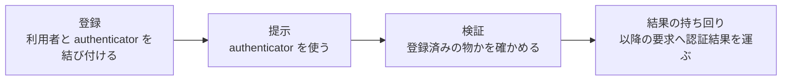
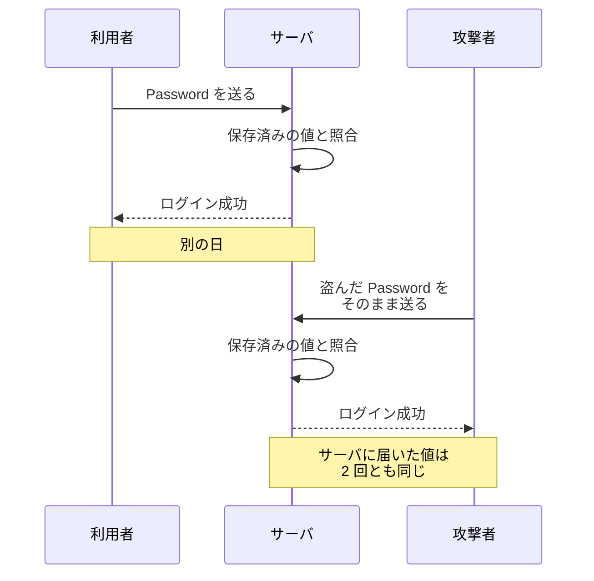
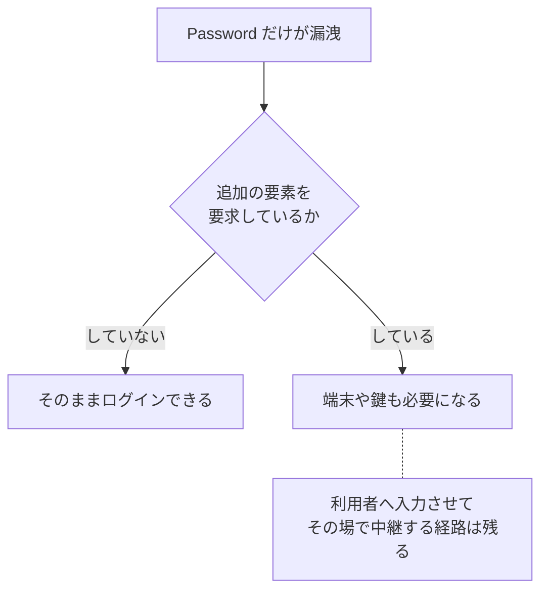
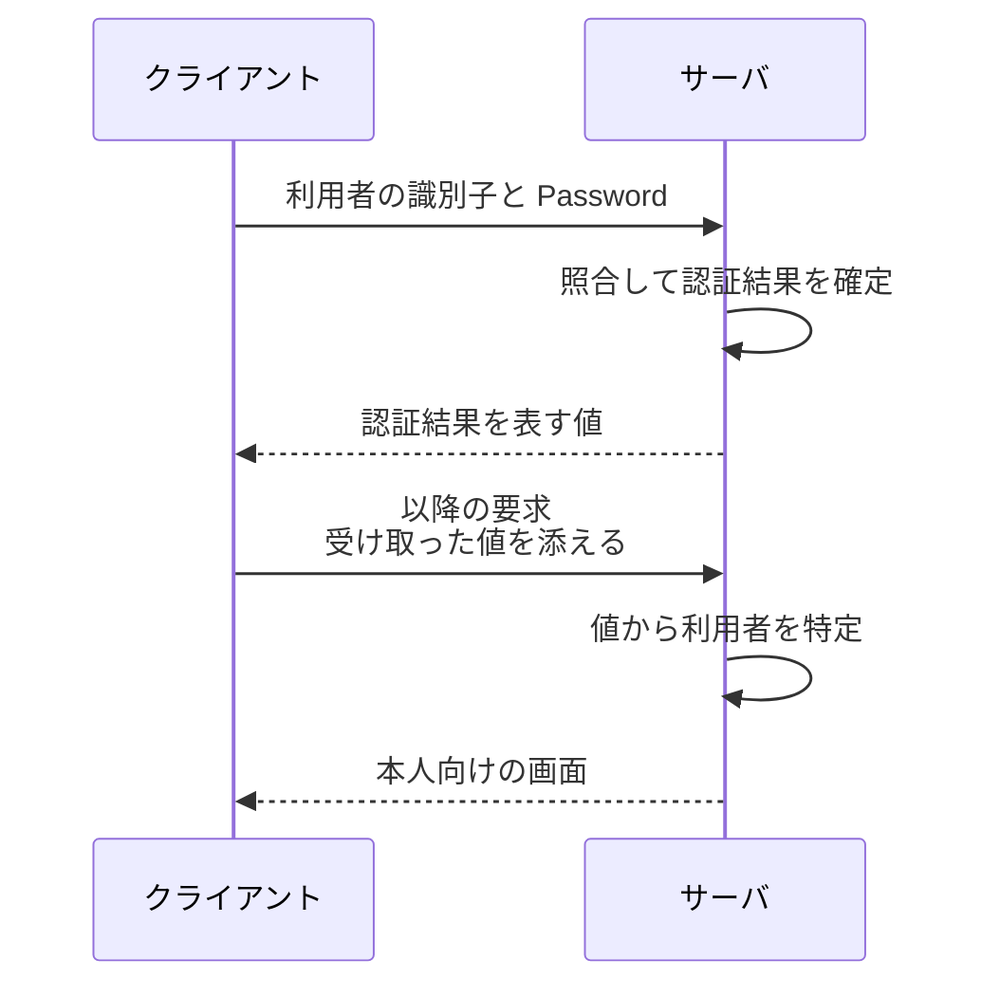
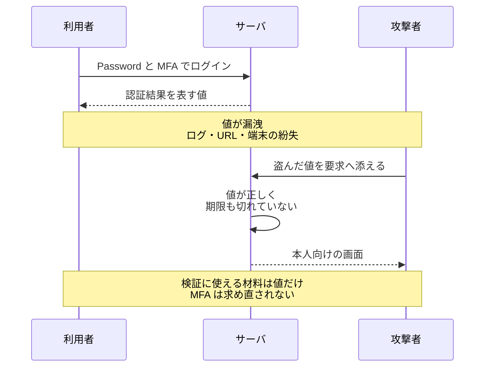
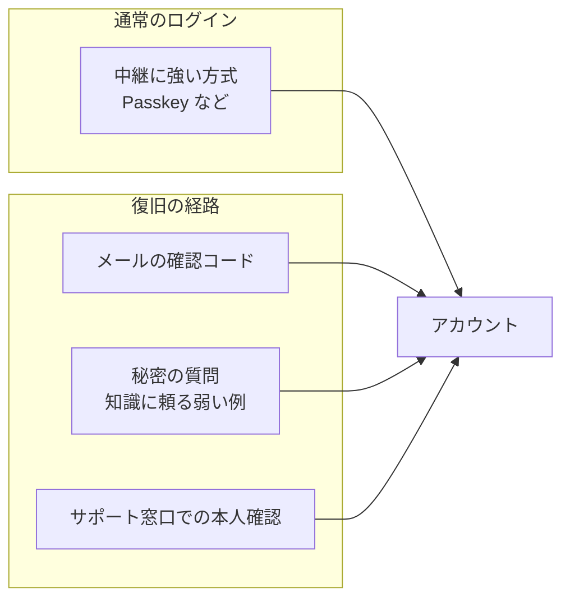
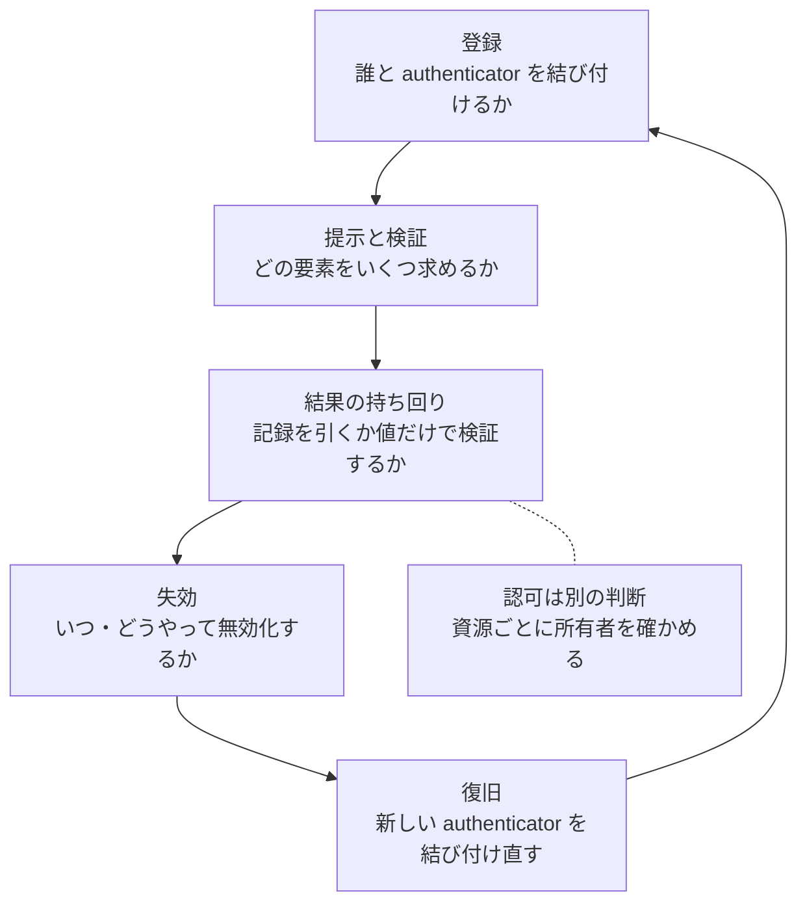

Authentication（認証）は、アクセスしてきた相手が、登録済みの利用者へ結び付けた authenticator を提示・制御できる事を確かめ、その結果をその利用者として扱う根拠にする処理です。authenticator（認証器）は、Password、セキュリティキー、OTP（One-Time Password）を生成するアプリ、秘密鍵を保持する端末のような、認証に使う手段を指します。

この処理が必要な場面の代表は、注文履歴と配送先と決済手段が並ぶ画面です。開いてよいのは本人だけなので、サーバは画面を返す前に相手を確かめます。ここでサーバが観測しているのは「登録済みの authenticator を使った検証に成功した」という事実だけで、そこから「本人だ」までには飛躍があります。

本ノートで、説明する範囲も決めておきます。ここでは、Web アプリケーションが自分の利用者を認証する場合を扱い、組織をまたいで認証結果を受け渡す SAML や OpenID Connect の詳細は扱いません。1 回のログインで何が起きるかを以下に示します。

上図の登録が、後の全ての判断の土台になります。ここで結び付ける相手を誤ると、以降の検証をどれだけ厳密にしても別人を通し続けます。

---

### なぜ「値が一致した」が「本人だ」にならないのか

Password による認証では、届いた文字列と保存済みの値を突き合わせます。サーバが保存しているのは文字列そのものではなく、利用者ごとに違う salt を混ぜて password hashing function に掛けた検証用の値です。届いた文字列へ同じ計算を掛けて、その値と比べます。

どう保存しても、比べているのは届いた値だけです。送ってきたのが登録した利用者なのか、その値を手に入れた別の相手なのかは区別できません。盗まれた Password が使われた時に、サーバから何が見えるのかを以下に示します。

上図の 2 回目の要求を止める材料は、照合の中にはありません。信用の根拠は照合そのものではなく、「その authenticator の制御を本人だけが持っている」とどこまで期待できるかにあります。認証方式の違いは、この性質をどう保つかの違いです。

ここで「本人確認」と呼んでいる物も、現実世界の身元の確認ではありません。氏名や生年月日のような属性を利用者へ結び付ける工程は identity proofing（身元確認）と呼ばれ、認証とは別の工程になります。そのため、身元の裏付けが弱いまま作られたアカウントは、どれだけ強い認証方式を載せてもその弱さを引き継ぎます。

---

### 認証要素は、何に寄りかかっているかが違う

authenticator は、何を根拠に本人だと見なすかで整理できます。軸になるのは、記憶している事・物を持っている事・身体や振る舞いの特徴の 3 つです。3 つが何を確かめ、どこで外れるのかを以下に示します。

| 要素 | 確かめている事 | 例 | 外れる経路 |
| --- | --- | --- | --- |
| 知識 | 記憶している値を出せる | Password、PIN（暗証番号） | 推測・漏洩・入力先の誤り |
| 所持 | 登録済みの物を今持っている | セキュリティキー、秘密鍵を持つ端末 | 盗難・紛失・複製 |
| 生体 | 身体や振る舞いの特徴が一致する | 指紋、顔、虹彩 | 偽造・照合の誤り |

生体は、単独の authenticator としてサーバへ送られるとは限りません。[Passkey](../passkey/) では、指紋や PIN の照合を端末の中で行う user verification（利用者の確認）として使い、その結果によって秘密鍵を使う事が許可されます。サーバへ届くのは秘密鍵で作った署名と、確認が済んだかどうかの印です。NIST SP 800-63B も、生体的特徴が[それ単独では認証器と認められないとしています](https://pages.nist.gov/800-63-4/sp800-63b.html)。

3 つの軸へ無理に収めると、何へ寄りかかっているのかが見えなくなります。SMS で送る確認コードは、登録済みの電話番号を持つ端末へ届くという意味で所持の要素として使われます。ただし、その保証は SIM swap や電話番号の移転で崩れます。

メールで送る確認コードは形が似ていても、確かめているのはそのメールアカウントへログインできる事で、強さはそのメールアカウントの認証に依存します。なお、NIST SP 800-63B はメールを out-of-band authenticator として扱いません。復旧の経路でよく使われる形なので、「Account Recovery が認証の強さの上限になりやすい」で改めて扱います。

MFA（Multi-Factor Authentication、多要素認証）は、異なる要素を 2 つ以上そろえないと通らないようにする考え方です。認証の保証水準（AAL、Authentication Assurance Level）を 3 段に分けた 2 段目の AAL2 も、異なる 2 つの要素の保持と制御を安全な認証プロトコルで証明する事を[要件の 1 つに置いています](https://pages.nist.gov/800-63-4/sp800-63b.html)。要素を重ねると何が変わるのかを以下に示します。

上図で MFA が塞いでいるのは、漏洩した値だけで通る経路です。攻撃者が偽サイトを用意して確認コードをその場で本物のサーバへ中継する経路と、認証を通した後に発行された値を盗む経路は残ります。後の経路は「持ち回る値は、持っている相手をそのまま通す」で扱います。

中継への強さは方式で分かれます。同じ指針は、フィッシング耐性の方法としてチャネルの束縛と検証者名の束縛の[2 つを挙げています](https://pages.nist.gov/800-63-4/sp800-63b.html)。[Passkey](../passkey/) は後者にあたり、偽サイトのドメインで作られた値は本物のサーバの検証を通りません。

---

### 認証の結果を以降の要求へ持ち回る

HTTP の要求は 1 本ずつ独立しているので、要求のたびに authenticator を使う形も取れます。HTTP Basic 認証がそれにあたり、クライアントは同じ範囲への要求へ利用者名と Password を毎回付け直します。ログインのたびに発行して個別に失効させられる認証状態を持たないので、止める手段は Password の変更やアカウントの無効化になります。

そのため、1 回の認証の結果を表す値を発行し、以降の要求ではその値を提示させる形が広く使われます。ログインから以降の要求までの流れを以下に示します。

上図の 2 本目の矢印より後には Password が出てこず、認証の代わりを務めているのはサーバが発行した値です。設計の分かれ目は「Session か Token か」という名前ではなく、検証のたびにサーバの記録を引くかどうかにあります。

| | 記録を引いて検証する | 値の中だけで検証する |
| --- | --- | --- |
| 値の中身 | 記録を指す識別子。値そのものに意味は無い | 利用者の識別子・有効期限と、その保護 |
| 検証の仕方 | 記録を引いて突き合わせる | 署名や MAC を検証する |
| 失効のさせ方 | 記録を消せば以降の照会で弾ける | 有効期限切れを待つか、失効の記録を別に引く |
| 保存の負担 | 発行した分だけ記録が要る | 記録を持たない構成にできる |

Session ID は左の列の代表で、Cookie で運ぶ構成が広く使われます。Token も、中身を持たない opaque token を発行してサーバへ問い合わせる方式なら左の列に入ります。JWT（JSON Web Token）のような self-contained token は右の列を取りやすく、値の中に必要な情報が入っているので記録を引かずに済みます。

右の列で検証を成り立たせているのは、値へ添える暗号学的な保護です。署名や MAC（Message Authentication Code）を付けておけば、中身を 1 文字でも書き換えた値を検出できます。非対称鍵による署名なら、発行する相手が秘密鍵で署名し、検証する相手は公開鍵で確かめます。要点は JWT を使う事ではなく、検証に必要な情報を値そのものへ持たせられる点です。

失効の行が、設計に効く差です。値の中だけで検証する方式には、個別の値を狙って無効にする手段がありません。ここを詰めずに有効期限を長く取ると、ログアウトしたはずの端末や、盗まれた値が期限まで動き続けます。

---

### 持ち回る値は、持っている相手をそのまま通す

発行した値は、提示すれば通るという意味で authenticator と同じ性質を持ちます。Session ID を Cookie で運ぶ構成も同じで、Cookie はサーバが発行した値をブラウザが保存し、同じサイトへの要求へ自動で添える仕組みなので、値を持っている事がそのまま提示になります。

この性質を名前にした形式が Bearer Token です。RFC 6750 は[「any party in possession of the token (a "bearer") can use the token in any way that any other party in possession of it can」（その Token を保持するどの当事者も、他の保持者と同じようにその Token を使える）という性質を持つセキュリティトークンだと定義しています](https://www.rfc-editor.org/rfc/rfc6750#section-1.2)。

値が漏れた時に何が起きるのかを以下に示します。

上図で攻撃者の要求を止められないのは、サーバが利用者と区別する材料を持たないためです。ログインへ MFA を足しても、盗んだ値をそのまま使う経路は防げません。Password や MFA を使った初回の認証はログインの時点で終わっており、この値はその結果を運んでいるだけだからです。

そのため、値が経路上に露出しない事が前提になります。RFC 6750 も、Bearer Token を伴う要求で常に TLS か同等の転送路の保護を使うよう[求めています](https://www.rfc-editor.org/rfc/rfc6750#section-5.3)。TLS は、通信路を暗号化して経路上での盗み見と書き換えを防ぐ規約です。

漏洩そのものを完全には避けられません。そのため、被害の続く時間を短くする手や、盗んだ値だけでは通らないようにする手が併用されます。有効期限を分単位まで縮める、重要な操作の前に認証をやり直させる、といった方法です。OAuth では [DPoP](https://www.rfc-editor.org/rfc/rfc9449.html)（Demonstrating Proof of Possession）のように、Access Token を鍵へ結び付け、要求のたびに対応する秘密鍵の保持を証明させる方法もあります。

---

### Account Recovery が認証の強さの上限になりやすい

利用者は端末を失い、Password を忘れます。復旧の経路を用意しないと、そのアカウントは二度と開けなくなります。Account Recovery とは、利用できる authenticator を失った利用者が、新しい authenticator をアカウントへ結び付けられる状態へ戻るための手順です。

攻撃者から見ると、この復旧の経路も入口の 1 つです。ログインの経路と復旧の経路のどちらでも試せる状況では、アカウントの強さは弱い方の経路へ引き寄せられます。2 つの経路を以下に示します。

上図の復旧の経路に並べた 3 つは、どれも通常のログインとは別の材料で通ります。メールの確認コードで復旧できるなら、そのアカウントの強さはメールアカウントの強さに寄りかかります。秘密の質問は、知識に頼る弱い例として置いています。答えは公開情報や過去の漏洩から推測できてしまいます。

サポート窓口での本人確認も、認証の一部として扱う対象です。オペレータが電話で伝えられた氏名と生年月日だけで Password を再発行できるなら、その手順が最も通りやすい入口になります。頼る材料は、本人が知っていそうな知識ではなく、既に登録されている別の authenticator・あらかじめ渡した Recovery Code・確認済みの Recovery Contact のように、登録の時点で結び付けた物へ寄せる事になります。

弱い復旧の経路を減らす手当ての 1 つに、authenticator をあらかじめ複数登録させる方法があります。予備が登録されていれば、端末を 1 台失っても通常の経路で通れます。復旧のためだけに弱い手順を用意する必要が減る、という効き方です。

もう 1 つは、復旧の経路そのものを強くする方向です。既に身元確認を行っているアカウントなら、復旧の時に identity proofing の一部をやり直し、以前確認した人物との一致を改めて確かめる方法もあります。復旧の完了までに待機期間を置いて本人へ通知し、取り消せるようにする方法も、突破がそのまま乗っ取りにならないようにする手当てです。

---

### Authentication と Authorization を分ける

Authorization（認可）は、その相手にその操作を許すかどうかを決める処理です。相手が誰かを確かめる認証とは、答える問いが違います。

| | Authentication | Authorization |
| --- | --- | --- |
| 答える問い | どの利用者として扱うか | その利用者にこの操作を許すか |
| 判断の材料 | authenticator の検証結果 | 利用者の属性・役割・資源の所有者 |

2 つを混ぜると、認証を通した相手が他人の資源へ届く実装ができます。他人の注文番号を URL に入れると中身が見える、という形が代表です。認証は「誰か」までしか答えないので、その資源の所有者かどうかは要求ごとに確かめる事になります。ここを省くと、正規の利用者が全員分の記録を読める状態になります。役割や所有者をどう表すかという認可の設計は、ここでは扱いません。

---

### 実装で Authentication として設計する範囲

ログイン画面と照合の処理だけを Authentication として扱うと、ここまでで見た穴がその外側に残ります。設計の対象になる範囲を以下に示します。

上図は、冒頭で見た 1 回のログインの流れへ、失効と復旧を足した形です。復旧から登録へ線が戻るのは、復旧が新しい authenticator を結び付け直す処理だからです。そこを登録の内容を追認するだけの手順にすると、最も通りやすい入口になります。点線で外した認可は、通った相手に何を許すかの判断なので、この流れとは別に設計します。

失効の段は、ログアウト・Password の変更・端末の紛失の届け出に対して、発行済みの値をどう扱うかの設計です。持ち回りで値の中だけで検証する形を選んでいれば、無効になるまでの時間の上限は有効期限の長さで決まります。個別に無効化したいなら、失効の記録を引く構成を併せて選ぶ事になります。

「ログインできた相手を本人として扱ってよい」と言うには、この 5 つの段のどこにも弱い所が無い事が要ります。authenticator の制御を本人だけが持っていると期待できる事は、その前提の 1 つにすぎません。登録で正しい相手へ結び付けられている事と、発行後の値が奪われない事も併せて要ります。攻撃者は段を選べるので、認証方式の比較は最も弱い段を直した後に効いてきます。
