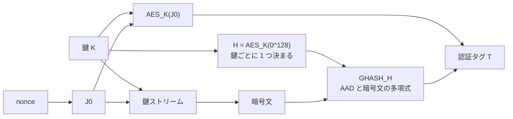
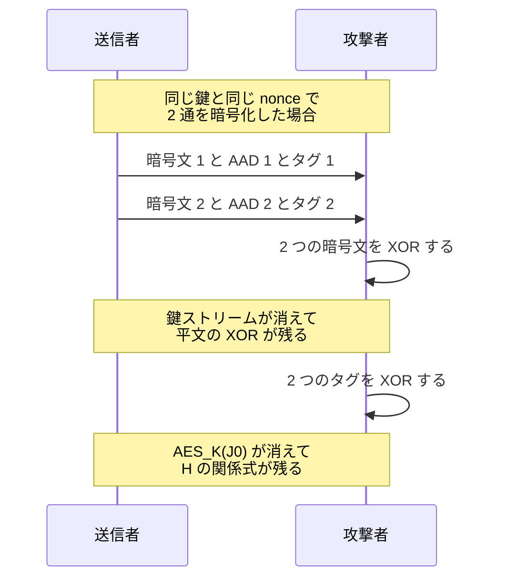
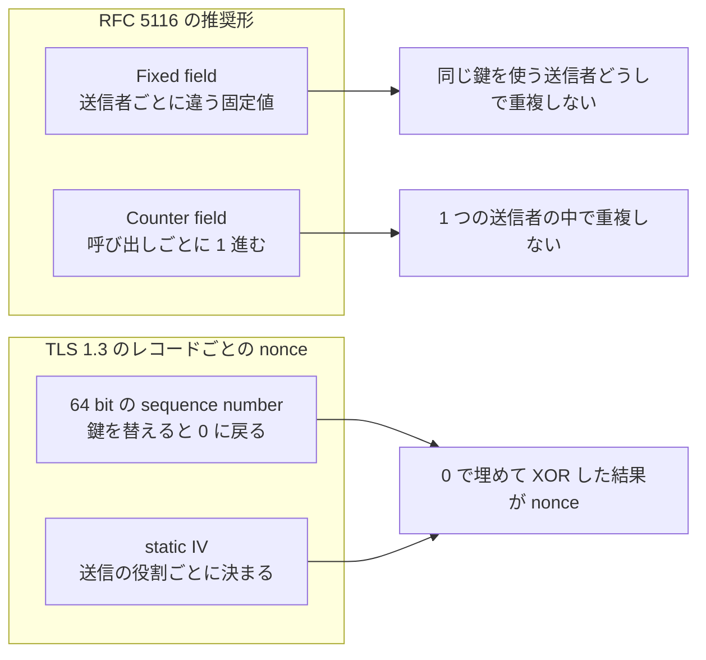
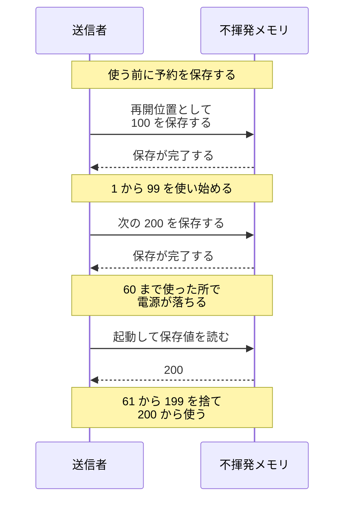
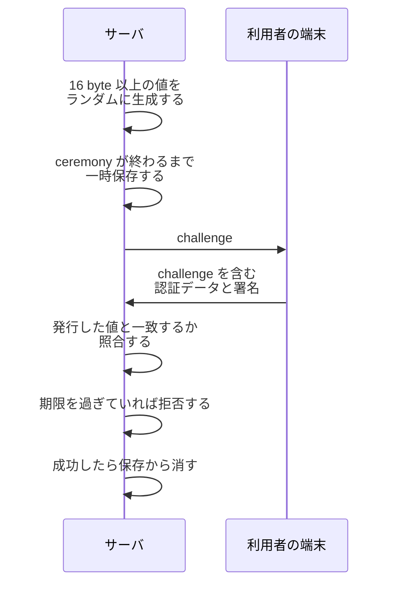
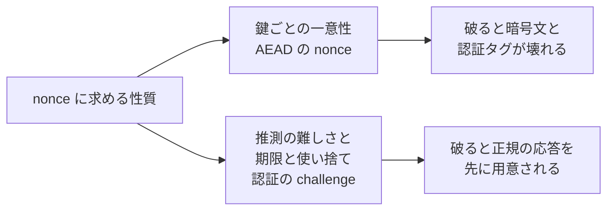
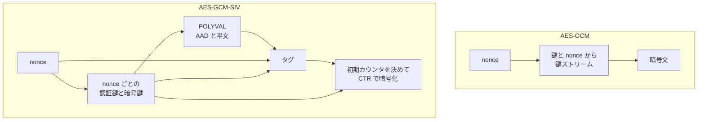

同じ鍵と同じ nonce で、内容の違う 2 通のメッセージを暗号化すると、攻撃者は 2 通の平文の関係を計算できます。改竄の検出のために暗号文に添える認証タグも、その鍵で作った物は信用できなくなります。鍵は漏れておらず、暗号文の形式も普段通りで、受信側の復号も成功します。起きたのは、毎回変えるはずだった値が 1 つ重なった事だけです。

その値を選ぶのは、多くの場合ライブラリではなく呼び出す側です。暗号化と改竄の検出を 1 つの操作で行う方式を AEAD（authenticated encryption with associated data）と呼び、その 1 つである AES-GCM を低レベルな API で呼ぶと、鍵とは別に nonce という値を渡します。nonce を内部で作る高レベルな API もあります。

nonce は number used once から来た呼び名です。[RFC 4949](https://www.rfc-editor.org/rfc/rfc4949.txt) は「A random or non-repeating value that is included in data exchanged by a protocol, usually for the purpose of guaranteeing liveness and thus detecting and protecting against replay attacks」（プロトコルがやり取りするデータに含める、ランダムまたは繰り返さない値。多くは liveness、つまり相手がその場で応答している事を保証し、それによって replay 攻撃を検出して防ぐ目的で使う）と定義しています。replay は、過去のやり取りを記録して後から送り直す攻撃です。

しかし、この名前で呼ばれる値に求められる性質は、1 つに揃っていません。AEAD が求めるのは鍵ごとの一意性です。認証で使う challenge が求めるのはランダム性と推測の難しさで、そこに有効期限と、1 度使ったら受け付けない扱いが加わります。本ノートでは、その「一度」が何に対する一度なのかと、用途ごとに何が要求されるのかを扱います。

---

### なぜ鍵と nonce の組を一度しか使えないのか

AES-GCM は、鍵と nonce から鍵ストリーム（平文と同じ長さの疑似乱数列）を作り、平文と XOR して暗号文にします。XOR は bit を桁ごとに比べ、違えば 1、同じなら 0 を返す演算で、同じ値を 2 回 XOR すると元に戻ります。

同じ鍵ストリームを 2 度使うと、この性質を攻撃者が利用できます。平文を `P1`・`P2`、鍵ストリームを `K` と書くと、暗号文は `P1 xor K` と `P2 xor K` で、2 つを XOR すると `K` が消えて `P1 xor P2` が残ります。攻撃者は鍵を知らないまま、2 通の平文の関係を手に入れます。

壊れるのは、中身を隠す機密性だけではありません。認証タグが書き換えを検出する範囲は暗号文だけでなく、AAD（additional authenticated data。暗号化はせず、改竄の検出だけを受け持たせるデータで、宛先やヘッダのような部分を入れます）も含みます。

nonce が 96 bit で、タグを短縮せずに 128 bit すべて使う場合、その組み立ては次の 2 段です。`AES_K(x)` は鍵 `K` で `x` を暗号化する事、`0^128` は 0 が 128 個並んだブロックを表します。

```text
H = AES_K(0^128)
T = AES_K(J0) xor GHASH_H(AAD, ciphertext)
```

`H` は鍵で 0 のブロックを暗号化した値で、鍵ごとに 1 つ決まります。nonce は入りません。`J0` は nonce から作られる値で、`GHASH_H` は `H` を未知数と見ると、AAD と暗号文を係数に持つ多項式の計算です。



タグを nonce に結び付けているのは `AES_K(J0)` です。タグ全体は nonce にも依存するので、同じ鍵と同じ nonce を 2 度使えば `AES_K(J0)` も同じ値になります。

2 つのタグを XOR すると共通の `AES_K(J0)` が消え、`H` を未知数とする関係式が残ります。1 組では `H` の候補が複数残りますが、同じ鍵と同じ nonce で作られた暗号文とタグの組を集めるほど、候補は減ります。



候補が 1 つに絞れると、攻撃者は観測した暗号文・AAD・タグからその nonce の `AES_K(J0)` を復元し、改変した暗号文と AAD に合うタグを計算できます。観測していない nonce では `AES_K(J0)` が分からないので、何も見ずに任意のタグを作れる訳ではありません。

しかし `H` はその鍵に 1 つなので、影響は再利用した nonce だけに閉じません。[RFC 5116](https://www.rfc-editor.org/rfc/rfc5116.txt) §5.1.1 には、内容の違う 2 通で nonce を再利用すると「undermines all of the authenticity and integrity protection provided by that key」（その鍵が与える認証と完全性の保護の全てを損なう）と書かれています。完全性は、データが書き換えられていない事です。そのため、その鍵で作ったタグは以後も信用できないものとして扱い、鍵ごと交換します。

毎回違う値を入れれば良い、で済まないのは、この失敗が暗号ライブラリの外で起きるからです。誰が番号を割り当てるのか、その状態が再起動をまたいで残るのか、という 2 つで決まります。

---

### 「一度」を数える範囲は鍵ごとに決まる

AEAD の要求は、nonce が単独で世界に 1 つである事ではありません。求められるのは「the pair of (key, nonce) shall only ever be used once」（鍵と nonce の組が 1 度しか使われない事）です（[RFC 8452](https://www.rfc-editor.org/rfc/rfc8452.txt) §1）。鍵が違えば同じ nonce をもう一度使えるので、鍵を替えるたびに 0 から数え直せます。

TLS（Transport Layer Security）1.3 がこの性質を使っています。レコードごとの 64 bit の sequence number を読み取りと書き込みで別々に持ち、接続の開始時と鍵を替えた時に 0 に戻します。ある traffic key（レコードの暗号化に使う鍵）で最初に送るレコードの sequence number は 0 です（[RFC 8446](https://www.rfc-editor.org/rfc/rfc8446.txt) §5.3）。

64 bit は使い切る事を想定していない大きさですが、wrap しそうな実装は rekey（使っている鍵を新しい鍵に入れ替える処理）か接続の切断を求められます。番号を 0 に巻き戻して同じ鍵で使い続ける事は、規格が認めていません。

数える範囲が鍵ではない nonce もあります。ログインで使う challenge の範囲は、1 回の登録や認証のやり取り（ceremony）です。

---

### カウンタで一意にする

カウンタの状態を保存できるなら、番号を 1 ずつ進めるのが確実です。確率に頼らず、同じ値が 2 度出ない事を手順で決められます。

RFC 5116 §3.2 が推奨する形式は、Fixed field と Counter field の連結です。Fixed field は送信者ごとに違う固定値、Counter field は呼び出しごとに進む部分で、12 octet（96 bit。octet は 8 bit）の nonce で Counter field を 4 octet とする組み合わせを実装が扱える事が SHOULD です（MUST・SHOULD は、仕様で必須と推奨を表す語です）。

TLS 1.3 の作り方は、この推奨形とは別です。sequence number をネットワークバイト順で書き、IV（initialization vector。暗号化の入力に添える初期値）の長さまで左を 0 で埋めてから、送信の役割ごとに決まる static IV と XOR します。その結果がレコードごとの nonce です。



Fixed field は暗号文に添えて送れますが、static IV は traffic key と一緒に導かれる固定値で、外には出ません。復号側が nonce を得られれば良いので、nonce の一部を保存された位置のような文脈から組み立てる形も認められています（RFC 5116 §3.2.1。推奨される形式では、Counter field と装置ごとの field は明示的に送る部分に置きます）。

一意性が壊れる場面の 1 つは、同じ鍵を複数の送信者が使う場合です。それぞれが 0 から数え始めれば組は重なるので、RFC 5116 §3.2 は、装置ごとに違う Fixed field を使う事を MUST で求めています。

もう 1 つは、再起動でカウンタの状態が失われる場合です。1 つの鍵を再起動をまたいで使い続けるなら、カウンタを不揮発なメモリに置き、使う前に保存します。保存する値は、使用済みの最大値ではなく、これから使う区間の先にある番号です。



予約を先に保存すれば、保存の完了を待つ間も番号を使えます。予約した範囲を使い切っても保存が終わっていなければ、完了するまで新しい nonce の発行を止めます。crash の後は保存されていた値から始めるので、使い残した番号は捨てます。

番号が飛ぶ事は問題になりませんが、同じ番号を 2 度使う事は問題になります。順序を逆にして使ってから保存すると、保存が間に合わなかった分は必ずもう一度使われます。

---

### 乱数で作る場合に管理する事

カウンタの状態を安全に保存できない場合、nonce を乱数で作る選択肢があります。ただし乱数は、どんな場合でもカウンタの代わりになる訳ではありません。カウンタは手順で重複を排除しますが、乱数では衝突の確率が残るので、鍵あたりの発行回数と、許容する確率を管理します。生成器に求める性質は [Random Number](../random-number/) のノートで扱っています。

方式が受け取る長さと、値の作り方は別の話です。RFC 5116 が定める `AEAD_AES_128_GCM` と `AEAD_AES_256_GCM` の nonce は 12 octet 固定で、受け取れる長さの下限と上限が同じ値です（§5.1、§5.2）。乱数で作る時に確かめるのは、その長さで何本発行すると衝突の確率がどこまで上がるかです。具体的には、[NIST SP 800-38D](https://nvlpubs.nist.gov/nistpubs/Legacy/SP/nistspecialpublication800-38d.pdf) は 96 bit の IV を乱数から作る構成について、その鍵を使う全ての暗号化主体を合わせた呼び出しを 2^32 回以下に収める事を求めています。

判断の順序は以下の通りです。

| 状況 | 手段 |
| --- | --- |
| カウンタの状態を安全に保存して読み戻せる | カウンタで採番する |
| 同じ鍵を複数の主体が使う | 主体ごとに Fixed field を割り当てるか、鍵を分ける |
| 番号の割り当ての調整が難しい | 鍵を替えて、数える範囲を作り直す |
| 一意性を保証できない | 方式ごとのランダム nonce の制限（長さ・鍵あたりの発行回数・衝突の確率）を評価する |
| 評価しても一意性を保証できない | nonce が重なっても被害が広がらない AEAD を検討する |

RFC 5116 §3.1 が挙げている手は、装置ごとに違う field、不揮発メモリへの保存、鍵の入れ替えです。一意性を保証できないなら乱数を使え、という推奨はありません。

---

### 用途ごとに違う要求

AEAD の nonce は、一意でありさえすれば予測されて構いません。鍵ストリームを作るには鍵と nonce の両方が必要なので、nonce を手に入れただけの相手には再現できません。TLS 1.3 の sequence number も 0 から 1 ずつ進み、何番目のレコードかは通信を見ていれば分かります。

一方、replay を防ぐ側の nonce は、予測できない事を求めます。サーバが毎回違う値を出し、利用者が手元の秘密鍵でその値を含むデータに署名して返す仕組みです。値を予測できると、攻撃者は将来の値に先回りして利用者に署名させ、その応答を後から提出できます。

challenge は、この目的でサーバが出す 1 回限りの値です。[W3C Web Authentication Level 3](https://www.w3.org/TR/webauthn-3/) §13.4.3 は、Relying Party が信頼できる環境、つまり通常はサーバ側でランダムに生成する事、返ってきた challenge が発行した値と一致する事、推測が現実的でなくなるだけのエントロピーを含む事を MUST で求めています。16 byte 以上の長さ、ceremony が終わるまでの一時保存、ceremony の timeout の推奨上限と同程度の有効期限は SHOULD です。



説明を単純化すると、利用者側は challenge を含む認証データに署名して返します。実際の署名の対象は、authenticatorData と、challenge を含む clientDataJSON のハッシュを繋いだ値です（[Passkey](../passkey/)）。

仕様が replay 対策の根拠に置いているのは、challenge がランダムで推測できない事です。推測できなければ、将来の値に先回りして署名を集める攻撃が成り立ちません。

記録した応答をそのまま送り直す攻撃は、サーバ側の運用で弾きます。発行した値との照合と有効期限、そして成功した challenge を保存から消す扱いです。一時保存が ceremony の終わりまでなので、終わった challenge には照合が通りません。

要求が違えば、破った時に失う物も違います。



一意性が壊れると、その鍵で作った暗号文とタグの保護が失われます。推測の難しさが壊れても暗号文は無事で、失われるのは、応答を返したのが本人だという判断です。

---

### 一意性を保証できない場合の AEAD

鍵と nonce の組が重複する原因は、暗号方式の外にあります。複数の送信者と再起動のほかに、仮想マシンやディスクイメージの複製と、複数のホストへ分散した番号の割り当てがあります。複製はカウンタと乱数のどちらでも起き、カウンタなら保存済みの番号ごと複製先に渡り、乱数なら生成器の seed（生成器に最初に与える値）まで一緒にコピーされる場合があります（[Random Number](../random-number/)）。

nonce が繰り返されても、被害が広がらない AEAD もあります。RFC 8452 が定める AES-GCM-SIV は、同じ鍵と nonce で 2 通を暗号化しても、機密性と完全性が一度に崩れないように設計された方式です。

作り方は、2 つの鍵の導出から始まります。鍵と nonce から、その nonce だけで使う認証鍵と暗号鍵を導きます。AAD と平文を通した POLYVAL（GHASH と同じ役割で、入力を 1 つの値に潰す計算）の結果に nonce を混ぜ、暗号鍵で暗号化した値がタグです。そのタグから作る値を CTR（counter）モードの初期カウンタにして、平文を暗号化します。



AES-GCM の鍵ストリームは鍵と nonce だけから決まるので、nonce が同じなら平文が違っても同じ鍵ストリームが出ます。AES-GCM-SIV では平文と AAD が POLYVAL を通ってタグに入り、そのタグが初期カウンタを決めるので、入力が違えば鍵ストリームも変わります。

その結果、同じ nonce で 2 通を暗号化しても平文の XOR は漏れません。nonce ごとに認証鍵と暗号鍵を導出するため、ある nonce に関する情報は、別の nonce で使う内部鍵にそのまま波及しません。漏れるのは、2 通の入力が同じだったかどうかだけです。決定的な方式では、nonce・AAD・平文が全て一致すれば暗号文とタグも一致するので、この 1 bit は隠せません。

RFC 8452 は Internet Standards Track の仕様ではなく、IRTF（Internet Research Task Force）の研究グループである CFRG（Crypto Forum Research Group）の consensus として公開された Informational RFC です。その §9 は、同じ nonce を繰り返す回数に応じて鍵あたりのメッセージ数と 1 通の平文の大きさに上限を置き、実装が未認証の平文を外に出す事を MUST NOT で禁じています。

再利用に耐える方式に移しても、nonce を毎回変える設計は残ります。§9 は nonce をランダムに生成する事を RECOMMENDED とし、固定の nonce を方針として使う事は勧めていません。同じ nonce を使い続ければ、同じ入力を 2 度送った事が観測者に見え続けるからです。
