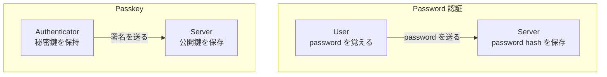
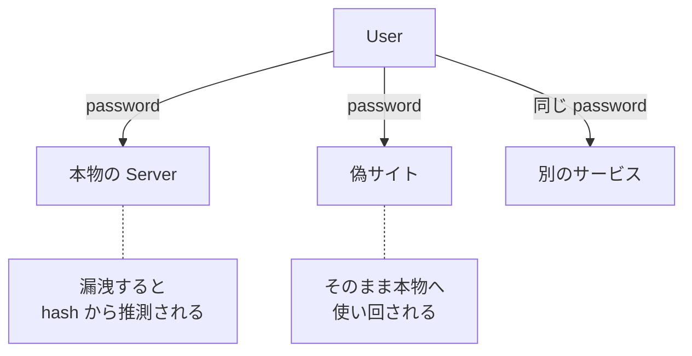
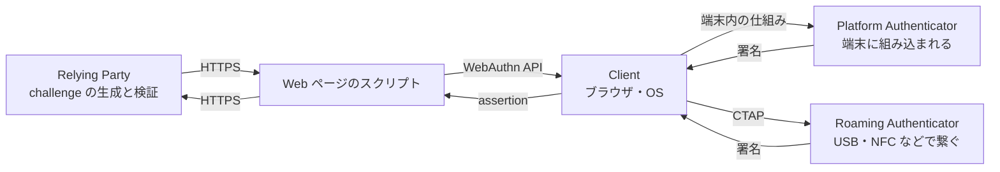
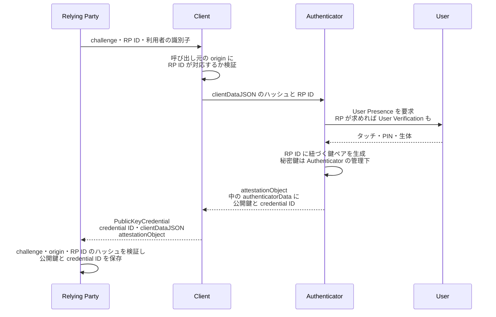
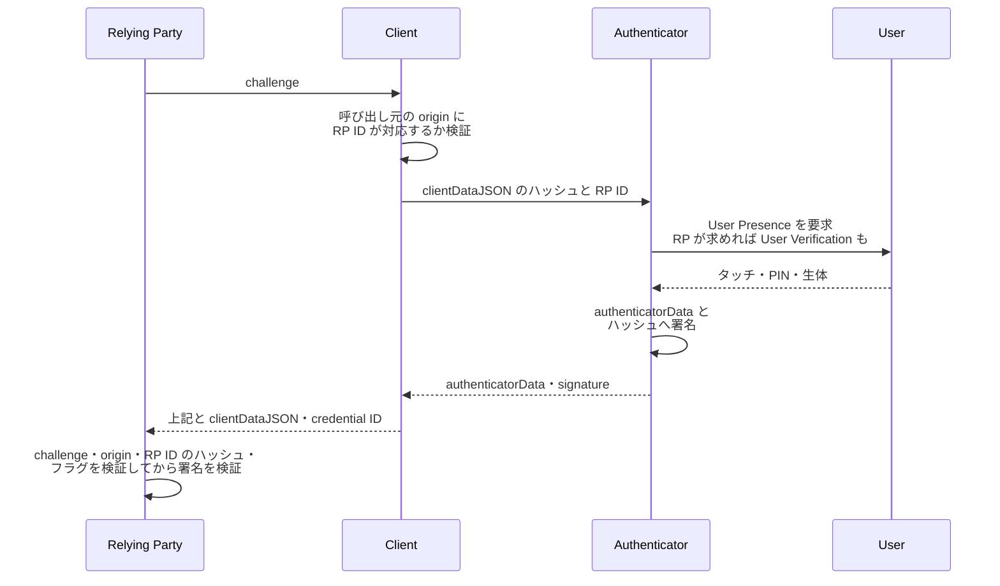
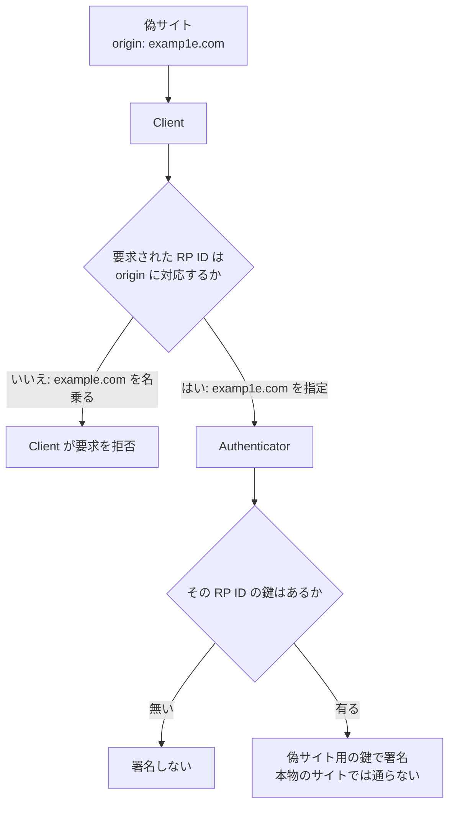
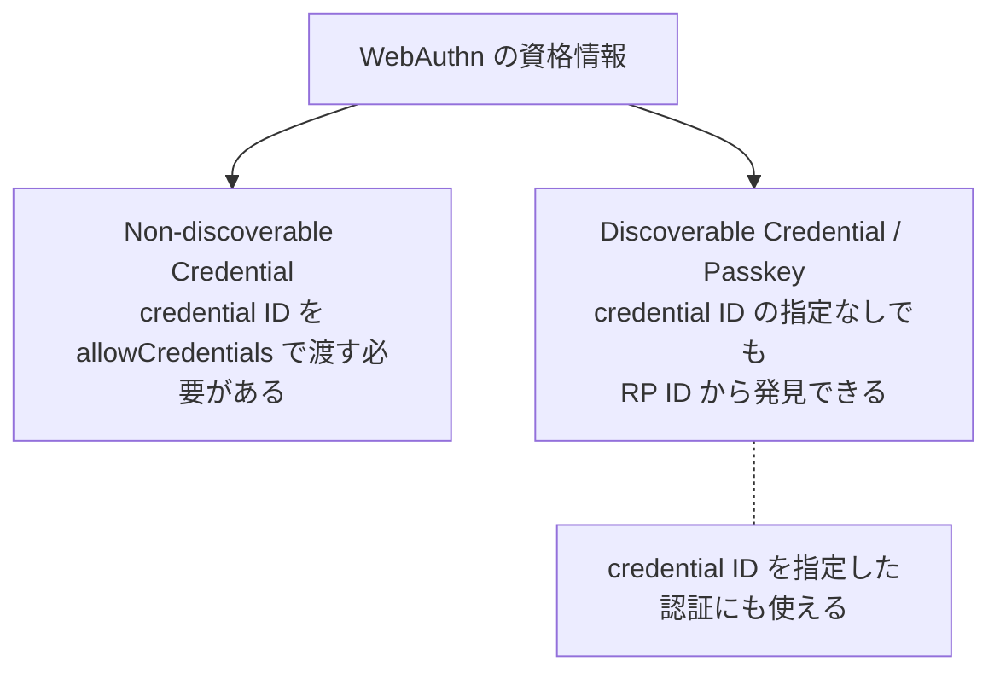
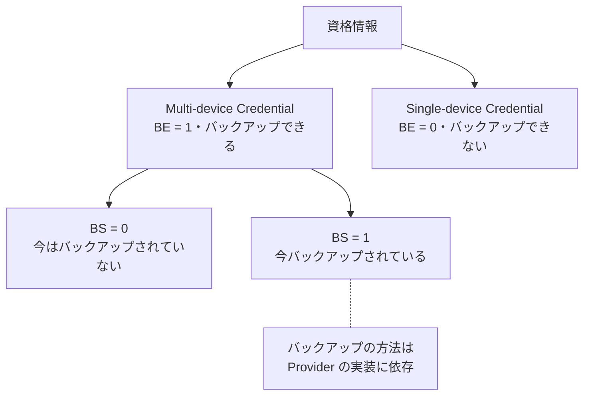

Passkey は、Authenticator が管理する秘密鍵を Relying Party のサーバへ渡さずに署名を作り、サーバが対になる公開鍵で署名を検証する認証の方式です。FIDO Alliance は passkey を「[a FIDO authentication credential based on FIDO standards](https://fidoalliance.org/passkeys/)」（FIDO 標準に基づく認証資格情報）と定義し、端末のロックを解除するのと同じ操作でアプリや Web サイトへサインインできるものだと説明しています。

この方式が必要な場面の代表は、ログイン画面をそのまま真似た偽サイトへの入力です。Password は利用者が読み書きできる文字列なので、相手を間違えればそのまま攻撃者の手に渡り、本物のサイトで使われます。署名は、宛先のドメインと 1 回限りの乱数へ結び付いた値になるので、覗き見ても別のサイトや次回のログインでは通りません。

2 つの方式で、どこに何が置かれるのかを以下に示します。

上図の Passkey では、秘密鍵が Authenticator の管理下に留まり、サーバへ渡るのは署名です。秘密鍵で作った署名は、対になる公開鍵で検証できます。公開鍵から秘密鍵を導く事はできないため、検証する側は署名を作れません。

この非対称のおかげで、サーバは秘密鍵を預からずに「相手が秘密鍵を持っている事」を確かめられます。保存している公開鍵が漏洩しても、それだけでは他人が署名を作る材料になりません。

---

### 前提と説明の範囲

本ノートで、説明する範囲も決めておきます。ここでは、Web ブラウザから Passkey を使う場合の処理の流れを扱い、Authenticator の内部実装・組織での配布運用は扱いません。Authenticator の出自を Relying Party へ証明する attestation の検証方式も範囲外にします。以降、単に「サーバ」と書く場合は、認証を行う Relying Party のサーバを指します。

署名を作る手順と検証の計算は [Digital Signature](../../blockchain-systems/digital-signature/) のノートで扱っているので、ここでは繰り返しません。ハッシュ値の性質は [Hash Function](../../blockchain-systems/hash-function/) のノートにあります。

---

### なぜ Password をサーバへ預ける方式が破られるのか

Password 認証が前提にしているのは、利用者とサーバが同じ文字列を共有している状態です。サーバは照合のために hash を保存し、利用者は入力のために文字列を覚えます。共有している以上、攻撃者はその文字列を利用者からもサーバからも狙えます。

同じ文字列が届き得る先を以下に示します。

上図の偽サイトへ向かう経路が phishing です。利用者が相手のドメインを見誤ると、認証に要る材料がそろった形で攻撃者へ渡ります。別のサービスへ同じ文字列を使い回していれば、1 か所の漏洩が他のサービスへ波及します。

本物のサーバから hash が漏れた場合も、元の文字列が残ります。利用者が選ぶ文字列は候補が限られるので、攻撃者は候補を片端から hash に掛けて、保存されていた値と突き合わせられます。

Password に TOTP や SMS の確認コードを足すと、Password だけを盗まれた場合の被害は抑えられます。ただし、再利用できる共有秘密という Password そのものの性質は残ります。Passkey が変えているのは、サーバが保存する値と、利用者が相手へ渡す値の両方です。

---

### 誰が何を担当するのか

Passkey という言葉は資格情報を指し、それを扱う仕組みは複数の仕様に分かれています。役割は 3 つの主体で整理できます。

- Relying Party: 認証したい Web アプリケーションと、そのサーバ
- Client: ブラウザや OS。WebAuthn の API を実装する
- Authenticator: 鍵を作り、保持し、署名する部品

Authenticator には、端末に組み込まれた Platform Authenticator と、USB や NFC などで繋ぐ Roaming Authenticator があります。W3C の [Web Authentication 仕様](https://www.w3.org/TR/webauthn-3/)は、この部品を次のように定義しています。

「that can register a user with a given Relying Party and later assert possession of the registered public key credential」（ある Relying Party に対して利用者を登録し、後から登録済みの公開鍵資格情報の保持を主張できるもの）

定義はこの後に「[and optionally verify the user to the Relying Party](https://www.w3.org/TR/webauthn-3/#authenticator)」（任意で、利用者を Relying Party へ確認する）と続きます。通常の認証では、操作している人が居る事を User Presence で確認し、利用者が誰かの確認は Relying Party の要求に応じて加わります。

主体とプロトコルの関係を以下に示します。

上図の WebAuthn は、Web ページのスクリプトが Client を呼び出すための API です。Client と Roaming Authenticator の間は CTAP（Client to Authenticator Protocol）で繋がります。Platform Authenticator へは端末の中の仕組みで繋がるので、CTAP を通るとは限りません。

Authenticator が返す署名と付随データの組を assertion と呼び、これがサーバまで運ばれます。

FIDO Alliance は、この 2 つの標準について「[The same standards, commonly known as FIDO2 (WebAuthn and CTAP), are leveraged to deploy FIDO with passkeys for sign-in.](https://fidoalliance.org/passkeys/)」（サインインで passkey を使う FIDO の実現には、FIDO2 として知られる WebAuthn と CTAP という同じ標準が使われる）と説明しています。

---

### Registration で公開鍵をサーバへ預ける

登録は、サーバが 1 回限りの乱数である challenge を作る所から始まります。ブラウザは `navigator.credentials.create()` を呼び、Authenticator が鍵ペアを作ります。図には RP ID と clientDataJSON も出てきます。前者は資格情報を紐づける対象を表す識別子、後者は Client が組み立てる要求のデータです。登録の流れを以下に示します。

上図の clientDataJSON には、要求の種類・challenge・呼び出し元の origin が入ります。origin は、ページを読み込んだ URL のスキーム・ホスト・ポートの組で、ブラウザが決める値です。ページのスクリプトから書き換える手段はありません。

Authenticator へ渡るのは clientDataJSON のハッシュで、origin そのものは届きません。どの URL から呼ばれたのかの判断は Client が担います。RP ID は通常サービスのドメインになり、Authenticator は RP ID ごとに鍵を分けて扱います。

1 件の資格情報には、秘密鍵・その資格情報を指す credential ID・RP ID が入ります。Client が返す `PublicKeyCredential` には credential ID があり、その `response` に clientDataJSON と attestationObject が入ります。attestationObject の中の authenticatorData には、Authenticator が作った公開鍵などの登録情報が含まれます。

サーバは、ここから以降の認証で使う公開鍵と credential ID を取り出し、利用者の識別子と結び付けて保存します。秘密鍵そのものがサーバへ渡る事はありません。

---

### Authentication で challenge への署名を検証する

認証でも、始まりはサーバが作る challenge です。ブラウザは `navigator.credentials.get()` を呼び、Authenticator は登録済みの秘密鍵で署名を作ります。認証の流れを以下に示します。

上図の authenticatorData には、RP ID のハッシュ・利用者の確認結果を表すフラグ・signCount が入ります。署名の対象は、この authenticatorData と clientDataJSON のハッシュを繋いだ値です。その結果、challenge も origin も署名の範囲に入ります。

署名の検証で分かるのは、署名の対象が書き換えられていない事と、登録済みの公開鍵に対応する秘密鍵で署名された事です。署名が正しくても、その中の challenge や origin がサーバの期待した値だったとは限りません。

そのためサーバは、署名の検証とは別に、challenge が自分の出した値か、origin が期待する相手か、RP ID のハッシュが自分のものかを 1 つずつ突き合わせます。

W3C の仕様は、この流れの概説として「[extracts the credential ID, looks up the registered credential public key in its database, and verifies the assertion signature](https://www.w3.org/TR/webauthn-3/#sctn-sample-scenarios)」（credential ID を取り出し、DB に登録済みの公開鍵を引いて、assertion の署名を検証する）と書いています。

規範的な検証の手順は、challenge・origin・RP ID のハッシュ・フラグの確認まで含めて仕様が定めています。

signCount は、対応する Authenticator が実装している場合に、認証に伴って増える署名カウンタです。資格情報が複製されると、複製した Authenticator と元の Authenticator がそれぞれ独立に数えるので、サーバから見た増え方が乱れます。

保存済みの値と整合しない値が届いた場合、資格情報の複製などを疑うシグナルとして使えます。ただし、実装の都合や並行した認証でも同じ状態は起こり、カウンタを持たない Authenticator は常に 0 を返します。複製の検出をこの値だけで組み立てる形にはなりません。

---

### RP ID と origin が偽サイトでの利用を止める

Passkey が phishing に強いのは、利用者ではなく Client が、要求された RP ID と呼び出し元の origin を照合するためです。判断の材料になるのは、利用者が読む画面の見た目ではありません。偽サイトが Passkey を要求した場合に何が起きるかを以下に示します。

上図の分岐は 2 段に分かれます。Client は、スクリプトが指定した RP ID が呼び出し元の origin に対応する事を確かめ、対応しない RP ID を渡された要求を拒否します。偽サイトが本物のドメインを RP ID として名乗っても、ここで止まります。

偽サイトが自分の origin を RP ID として指定した場合は、Authenticator まで届きます。Authenticator は origin を見ませんが、鍵が RP ID ごとに分かれているので、そこで作れる署名は偽サイト向けの鍵によるものだけです。

サーバも、自分が出した値と、受け取った clientDataJSON の origin と challenge、authenticatorData の中の RP ID のハッシュを突き合わせます。この 3 段のどこにも、利用者がアドレス欄を目で確かめる手順は入っていません。

守られるのは、この手順が始まってからの範囲です。偽サイトが「Passkey を使えないので Password で」と誘導する経路は、手順の外側に残ります。

---

### User Presence と User Verification を分ける

利用者に対する確認は 2 種類あり、どちらも Authenticator の中で完結します。混同しやすいので、認証そのものと合わせて整理します。

| 用語 | 誰が何を確かめるか | 結果の伝わり方 |
| --- | --- | --- |
| Authentication | サーバが、公開鍵で署名を検証する | assertion の検証結果 |
| User Presence | Authenticator が、人が操作している事を確かめる | authenticatorData の UP フラグ |
| User Verification | Authenticator が、PIN や生体で利用者をローカルに検証する | authenticatorData の UV フラグ |

User Presence は、セキュリティキーへ触れるような単純な操作で満たされます。User Verification は PIN の入力や生体認証で、その Authenticator を使ってよい相手かどうかまで確かめます。通常の認証の手順では User Presence が求められ、Relying Party はさらに User Verification を必須にするかどうかを選べます。

確かめているのは、Authenticator を操作している利用者です。氏名のような現実世界の身元を Relying Party へ証明する仕組みではありません。

生体情報は、この確認のために Authenticator の中で照合されます。サーバへ送られるのは、確認が済んだかどうかを表すフラグだけです。指紋の画像や特徴量が Web サーバへ渡る構成ではありません。

2 つのフラグは authenticatorData の中にあり、署名の対象へ含まれます。途中の経路やスクリプトから立て直す事はできません。

---

### Discoverable Credential が資格情報の発見を担う

WebAuthn の資格情報は、credential ID の指定が要るかどうかで 2 通りに分かれます。2 つの性質を以下に示します。

W3C の仕様は Discoverable Credential について「[usable in authentication ceremonies where the Relying Party does not provide any credential IDs](https://www.w3.org/TR/webauthn-3/#client-side-discoverable-credential)」（Relying Party が credential ID を 1 つも渡さない認証で使える）と定義しています。

同じ仕様は、Discoverable Credential が「[also usable in authentication ceremonies where credential IDs are given](https://www.w3.org/TR/webauthn-3/#client-side-discoverable-credential)」（credential ID が与えられる認証でも使える）とも注記しています。上図の点線が示すとおり、発見できる事と credential ID を指定して使う事は排他ではありません。

Non-discoverable な資格情報の方は、credential ID を `allowCredentials` で渡す必要があると仕様が書いています。指定なしでも使えるかどうかが、2 つの分かれ目です。

WebAuthn Level 3 は、この Discoverable Credential の別名として passkey を挙げており、ここでもその用語法に従います。FIDO Alliance の一般向けの説明では、より広い意味で passkey という語が使われる場合があります。

旧称の resident credential・resident key については、[passkeys.dev](https://passkeys.dev/docs/reference/terms/) が古い呼び方だと整理しています。概念の名前は移った一方、WebAuthn の API には `residentKey` というパラメータ名が今も残っています。

Relying Party が利用者を先に特定しなくても Authenticator が資格情報を発見できるので、Username の入力欄を置かないログインの画面を作れます。入力欄が消えるのは、資格情報を見付ける担当が Authenticator へ移った結果です。

---

### Multi-device Credential と Single-device Credential

「秘密鍵は絶対に端末から出ない」という説明は、Passkey 全体には当てはまりません。[W3C の仕様](https://www.w3.org/TR/webauthn-3/#sctn-credential-backup)は、資格情報をバックアップできるかどうかを Backup Eligibility（BE）、今バックアップされているかどうかを Backup State（BS）として、authenticatorData のフラグで表します。

BE は作成時に決まり、後から変わりません。仕様は「[A backup eligible public key credential source is referred to as a multi-device credential](https://www.w3.org/TR/webauthn-3/#sctn-credential-backup)」（バックアップの対象にできる公開鍵資格情報は multi-device credential と呼ばれる）と書いています。対象にできないものは single-device credential と呼ばれます。

BS は現在の状態を表し、時間とともに変わります。BE が 1 の資格情報でも、今すでに別の端末へ同期されているとは限りません。3 つの状態を以下に示します。

上図の BS が 1 の資格情報は、現在バックアップ済みの状態です。仕様が表すのはここまでで、バックアップや端末の間の同期をどう実現するかは、Passkey Provider など資格情報を管理する仕組みに依存します。

Passkey Provider は、passkey の作成と保存を担うソフトウェアです。OS やブラウザに組み込まれたものと、独立した資格情報管理ソフトのどちらもあります。

ここでいうバックアップと、想定外の credential clone は別の概念です。バックアップできる事・今バックアップされている事・想定しない複製の 3 つは、それぞれ別の状態になります。

Relying Party は、authenticatorData の BE を見て Multi-device Credential か Single-device Credential かを判断できます。BE が 1 なら、さらに BS を見て、今バックアップされているかを確かめられます。

これらのフラグは署名の対象に含まれるので、通信の途中で書き換えれば署名の検証で弾かれます。一方で、その値を出した Authenticator の実装や性質まで信頼してよいかは別の問題で、attestation のような根拠が要ります。

仕様が挙げている使い道も、single-device credential を弾く方向ではありません。端末を 1 台失うと復旧できなくなるため、追加の Authenticator を登録させるか、復旧の手続きを用意するよう勧めています。

---

### 利点

- サーバが保存するのは公開鍵なので、DB が漏洩しても署名を作る材料にならない
- 利用者が相手のドメインを見誤っても、Client が RP ID と origin を照合して要求を止める
- サーバが challenge を 1 回限りの値として扱う限り、記録した通信を再利用できない
- Discoverable Credential では、Username の入力なしでログインの候補を出せる
- サービスごとに別の鍵が作られ、使い回しが構造として起こらない

---

### 欠点

以下は、利用者が覚えて入力する材料をなくし、鍵の保管を端末と Passkey Provider へ寄せた結果として現れる制約です。

- 端末を失うと、その端末にしかない資格情報は使えなくなる
- 復旧の手段はサーバ側の設計に残り、そこが弱ければ認証全体の強さが頭打ちになる
- 同期される Passkey では、Passkey Provider の保護の強さに依存する
- 別の系列の端末やブラウザへ移る際に、同期の仕組みが引き継がれるとは限らない
- 代替の認証手段を残すと、攻撃者が狙う経路として残り続ける

復旧の設計は、Passkey を導入しても消えない課題です。端末の紛失に備えて複数の Authenticator を登録しておく方法と、サーバ側の復旧手続きを用意する方法があります。後者を Password やメールの確認コードで組むと、phishing に強い経路を作った意味が、その手続きの強さで頭打ちになります。
