鍵の長さを 256 bit にしても、その鍵を作った seed（種。生成器に最初に与える値）の取り得る値が 15 bit 分しかないなら、攻撃者が試す鍵は 32768 通りです。暗号の安全性は攻撃者がその値を当てられない事に支えられていて、当てられない値を作るのが乱数の役目です。

乱数を必要とするのは、TLS サーバの鍵を作る処理、ログインで challenge（相手が答えを用意できない 1 回限りの値）を出す処理、電子署名を作る処理などです。作られる値は、暗号鍵・IV（initialization vector。暗号化のたびに変える初期値）・nonce（1 回しか使わない値）・salt（ハッシュに混ぜる公開の値）・署名ごとの秘密の値 k・session ID などです。本ノートでは、暗号で使う乱数を扱います。

典型的なアプリケーションでは、これらの値の多くを OS や暗号ライブラリが持つ共通の CSPRNG（暗号として安全な擬似乱数生成器）から取得します。物理現象やシステムの状態から予測できない bit を集める entropy source（エントロピー源）が seed を作り、DRBG（deterministic random bit generator。seed を決まった手順で伸ばし、必要な長さの bit 列を返す関数）がそれを伸ばします。決定的なので、同じ seed を入れれば同じ bit 列が何度でも出ます。

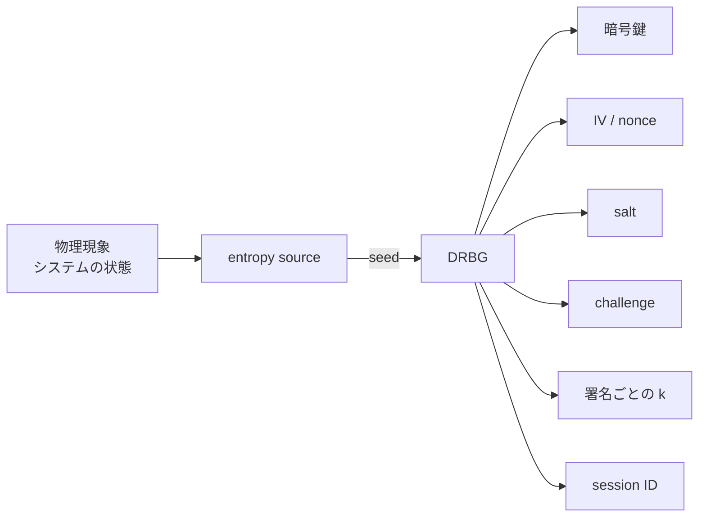

上記の図の DRBG が予測できる値を返すなら、その生成器に依存する用途は同時に影響を受けます。予測できない事を要求するのは、暗号鍵・challenge・署名の k・session ID です。IV と nonce に必要な性質は暗号方式によって違うので、後の節で扱います。

ただし、用途ごとに別の生成器や独立した状態を持つ実装もあり、決定的 ECDSA のように署名の k を生成器から取得しない方式もあります。

例えば [Passkey](../passkey/) の認証でサーバが出す challenge を予測できると、将来使われる challenge に対する正規の応答を先に作らせておく preplay が成り立ちます。秘密鍵を持たない攻撃者が署名を作れるようになる、という意味ではありません。

なお、統計的なランダムさと予測不能性は別の性質です。分布が一様でも、次の値を計算できる生成器があります。

---

### なぜ予測できない値が必要なのか

探索の量を決めるのは、鍵の長さではなく seed が持つ情報量です。128 bit の鍵でも、8 bit の seed で初期化した擬似乱数生成器で作れば、攻撃者が試すのは 256 個です（[RFC 4086](https://www.rfc-editor.org/rfc/rfc4086.txt) §2）。

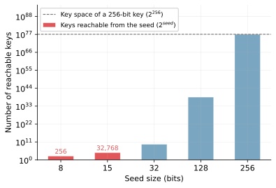

8 bit と 15 bit の棒は、256 bit 鍵の水平線から 70 桁以上、下にあります。鍵長を 512 bit へ伸ばしても、seed から到達できる鍵の個数は 256 個と 32768 個のままです。

seed のエントロピーが落ちる事故は、配布された製品でも起きています。Debian の OpenSSL では、valgrind の警告を消すためにコメントアウトした `md_rand.c` の 2 行のうち 1 行が、エントロピー（entropy。予測できなさを bit で数えた量）をプールに追加する呼び出しでした（CVE-2008-0166）。

その結果、seed に残ったのはプロセス ID だけで、範囲は 1 から 32767 です。乱数列はアーキテクチャごとに 32767 通りに収まりました（[Debian Wiki SSLkeys](https://wiki.debian.org/SSLkeys)）。影響は SSH・OpenVPN・DNSSEC の鍵、X.509 証明書で使う鍵材料、SSL/TLS の session key に及んでいます（[DSA-1571-1](https://www.debian.org/security/2008/dsa-1571)）。

攻撃者は、同じ生成器を手元で再現して seed を総当たりします。

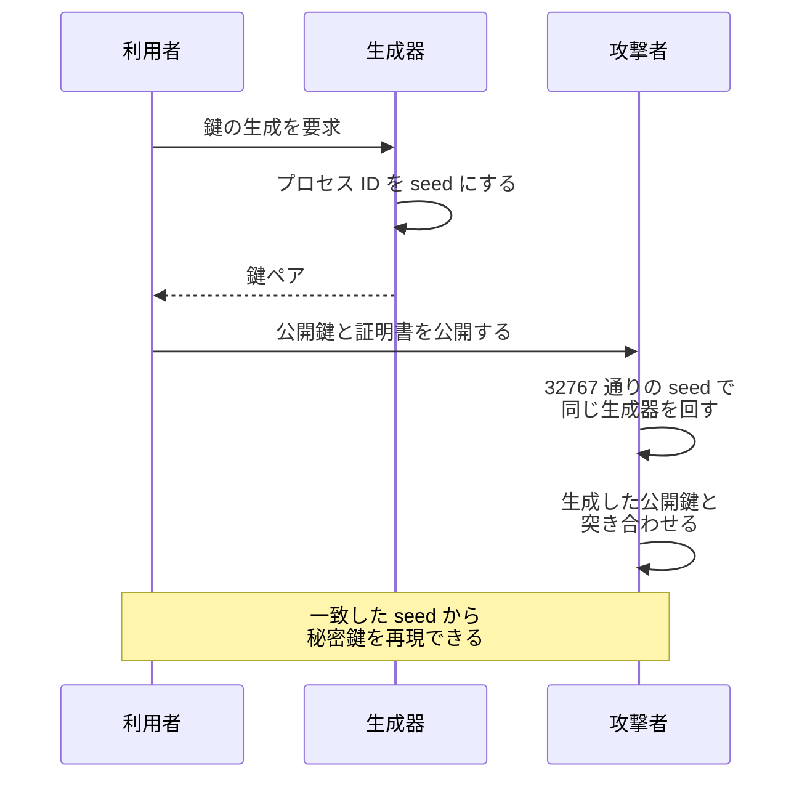

この攻撃は、RSA の演算にも SSH のプロトコルにも触れていません。壊れたのは seed を作る部分だけで、鍵の形式は正しく、接続も普段通り成立します。

---

### 予測できなさを min-entropy で数える

min-entropy は、最も出やすい値の確率を `p_max` とした時の `-log2(p_max)` で、最頻値から順に推測する攻撃を想定した保守的な見積もりです（NIST の SP（Special Publication）[800-90B](https://csrc.nist.gov/pubs/sp/800/90/b/final) §2.1）。

つまり min-entropy が H bit なら、どの値が観測される確率も `2^-H` 以下で、1 回目で当たる確率も `2^-H` を超えません。k 通りの値を取る変数では min-entropy の上限が `log2 k` で、この上限に届くのは分布が一様な場合だけです。

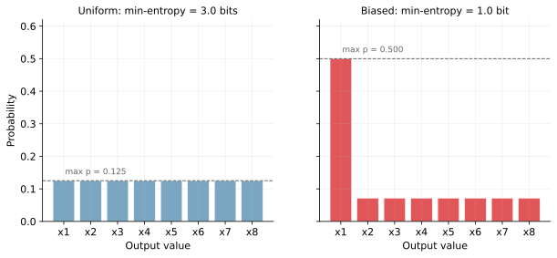

候補はどちらも 8 通りです。しかし 1 回目で当たる確率は 12.5% と 50% で 4 倍違います。平均ではなく最頻値を見るので、確率の寄りがそのまま数値に出ます。

統計テストを通る事と予測できない事は別です。計算機が無かった時代には、乱数を印刷した数表が統計の標本抽出に使われていました。この数表に並ぶ値は、分布や離れた位置どうしの相関を見る Knuth 氏の統計テストを全て通ります。

しかし、攻撃者も同じ数表を持っていると考えるべきです。出力を数個見れば読んでいる位置が分かり、その先の値はそのまま読み取れます（[RFC 4086](https://www.rfc-editor.org/rfc/rfc4086.txt) §6.1.3）。線形合同法などの伝統的な擬似乱数生成器も、同じ節で暗号に適さないと整理されています。

---

### エントロピー源と DRBG の分担

[NIST SP 800-90B](https://csrc.nist.gov/pubs/sp/800/90/b/final) §2.2 が定めるエントロピー源（entropy source）は、3 つの部品でできています。予測できない bit を集める noise source、偏りを減らす決定的な関数の conditioning component（省略可）、壊れていないかを検査する health test です。


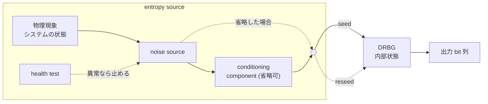

90B の health test が対象にするのは entropy source で、DRBG 側には 90A が別に self-test を求めています。破線の reseed は、新しいエントロピーを内部状態へ入れ直します。

noise source は、entropy source と乱数生成器全体にとっての root of security（安全性の根）です。ここが予測できる出力しか作らない場合、後ろのどの部品もその不足を補えないので、この生成器を使うアプリケーションの安全性は担保できません（[NIST SP 800-90B](https://csrc.nist.gov/pubs/sp/800/90/b/final) §2.2.1）。

出力の予測できなさは seed のエントロピーを超えません。90A は、seed に入れるエントロピーが、名乗る security strength 以上である事を求めています。DRBG は、ハッシュ関数やブロック暗号といった暗号学的プリミティブを使い、出力から内部状態を効率よく復元できないように構成されます（[NIST SP 800-90A Rev. 1](https://csrc.nist.gov/pubs/sp/800/90/a/r1/final)）。ハッシュ関数を使う構成が寄りかかるのは、出力から入力を戻せない性質です（[Hash Function](../../blockchain-systems/hash-function/)）。

backtracking resistance は、ある時点より後で内部状態を知った攻撃者が、それより前の出力と本物の乱数列を並べても、どちらがどちらか判定できない性質です。prediction resistance は、それより後の出力について同じ事が言える性質で、reseed で取り戻します。

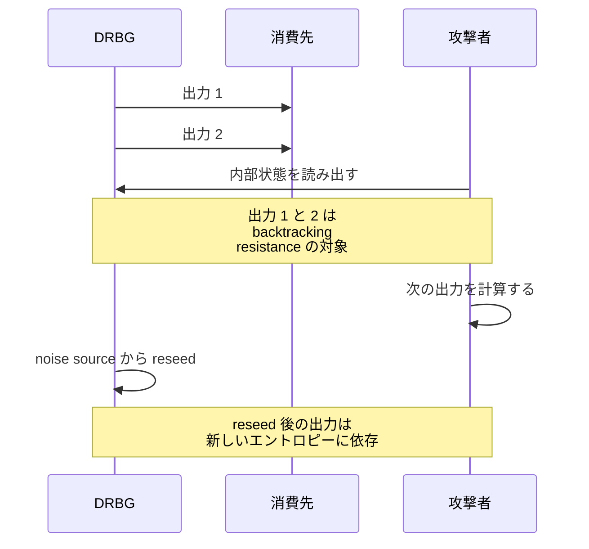

backtracking resistance を持つ構成なら、内部状態が漏れても、それより前の出力は守られます。90A の DRBG 機構は、いずれもこの性質を持つように設計されています。prediction resistance の方は、要求のたびに新しいエントロピーで reseed して初めて得られる性質で、reseed しない限り、漏れた状態から先の出力は計算されます。

どちらも、実装が名乗る security strength（想定する攻撃者の計算量の上限。128 bit なら 2^128 回）に見合う計算量を攻撃者が実行できない、という仮定の下の話です（[NIST SP 800-90A Rev. 1](https://csrc.nist.gov/pubs/sp/800/90/a/r1/final) §8.8）。

90A は DRBG mechanism、90B は entropy source を定め、両者を組み合わせた RBG（random bit generator）の構成は [SP 800-90C](https://csrc.nist.gov/pubs/sp/800/90/c/final) が定めています。

---

### OS が渡す乱数を呼ぶ

実際の OS がこの構成をそのまま採用しているとは限りません。以降は Linux と Go を例に取ります。noise source を自分で集めるアプリケーションはほとんどありません。カーネルが割り込みなどから bit を集めてプールに入れ、その出力を配っているからです。Linux の入口は 2 つあります。

`getrandom(2)` は urandom source から読んだ値でバッファを埋めるシステムコールで、乱数生成器の seed としても暗号の用途としても使えます。要求どおりの長さが埋まる保証があるのは、プールが初期化済みで、かつ 256 byte 以下を読む場合だけです。それより大きい要求は途中で返る事があるので、戻り値を確かめて残りを読みます。`/dev/urandom` は同じ source から読み出せるデバイスファイルです。違いは、プールが初期化されるまでの振る舞いに出ます。

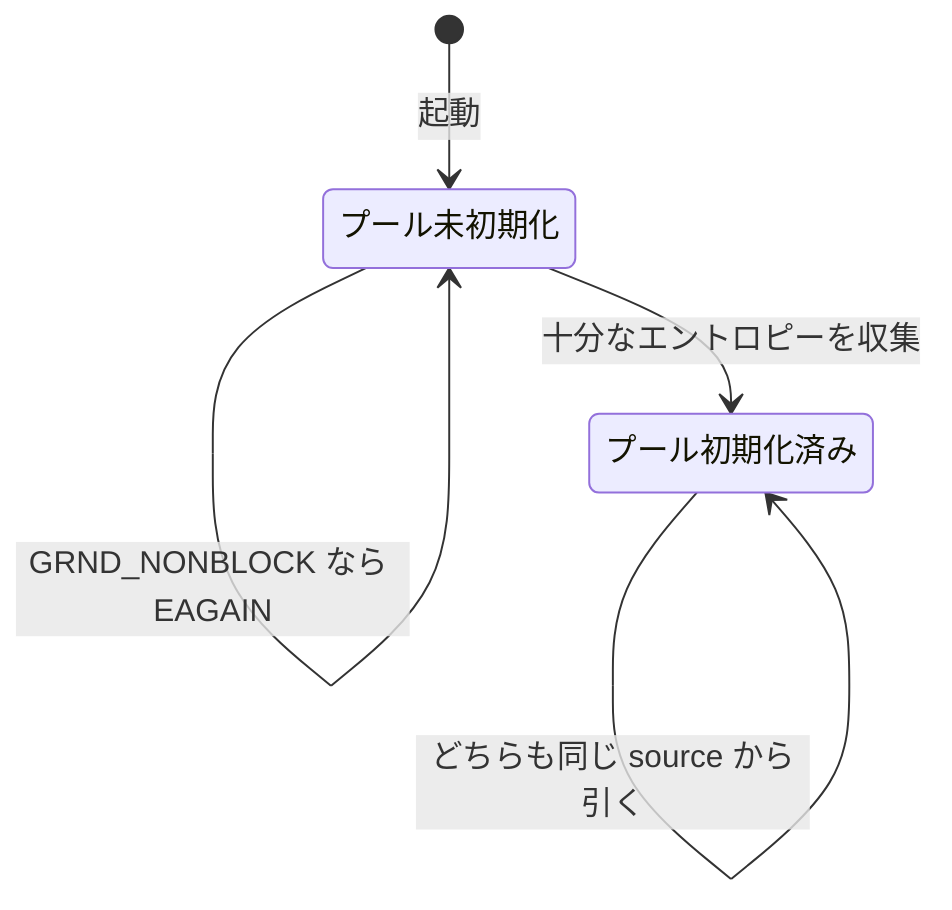

初期化前の `/dev/urandom` はエントロピーの低い値を返す場合があり、`getrandom()` は `GRND_NONBLOCK` 無しならそこで block します。初期化後は、どちらを読んでも同じ質の値が得られます（[random(7)](https://man7.org/linux/man-pages/man7/random.7.html)）。ここで質と呼んでいるのは、min-entropy が用途に対して十分かどうかです。

同じ区別は言語のライブラリにも出ます。Go の `math/rand` は、seed の与え方によらず出力を予測される場合があり、シミュレーション向けです（[math/rand](https://pkg.go.dev/math/rand)）。暗号の用途で呼ぶのは `crypto/rand` で、これは OS の乱数源を読む層です。Go 1.24 以降の `Read` はエラーを返さず、渡したスライスを最後まで埋めます（[crypto/rand](https://pkg.go.dev/crypto/rand)）。それより前のバージョンではエラーを返し得るので、戻り値を確かめます。

```go
package main

import "crypto/rand"

// newKey は 32 byte の鍵を作る。OS の乱数を読み、渡したスライスを最後まで埋める
func newKey() []byte {
	key := make([]byte, 32)
	rand.Read(key)
	return key
}
```

そのため起動直後は、プールの初期化に使える材料が集まりきっていない時間帯があります。組み込み機器や、起動直後に鍵を作る仮想マシンがこの時間帯に入ります。同じディスクイメージから複製したホストも同じで、複製元の状態まで一緒に運ばれます。

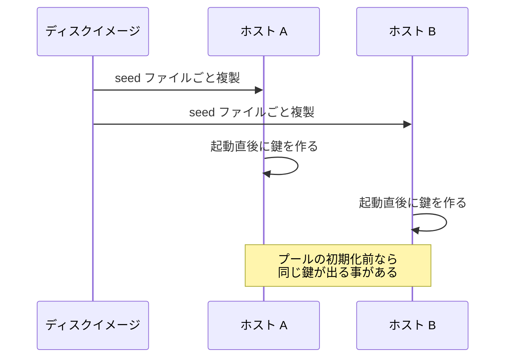

初回起動で seed を作り直す手当てが要るのは、複製先が同じ値を出す事を防ぐためです。

---

### 一様に選び、二度使わない

生成器が返すのは bit 列で、必要なのはある範囲の整数です。1 byte を読んで 200 通りへ落とすために剰余を取ると、値ごとの出現回数が揃いません。

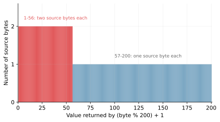

1 から 56 の値は 2 倍出やすく、この偏りは modulo bias と呼ばれます。具体的には、最頻値の確率が 2/256 なので min-entropy は 7 bit になり、一様に選べた場合の 7.64 bit を下回ります。

偏りを消すのは、範囲に収まらない値を捨てて引き直す rejection sampling です。0 から 255 のうち 200 以上の 56 個を捨てれば、残る 200 通りが同じ確率で出ます。Go の `crypto/rand` の `Int` がこの引き直しを行います。

```go
package main

import (
	"crypto/rand"
	"math/big"
)

// pick は 0 以上 200 未満の値を一様に選ぶ。範囲外の値は捨てて引き直される
func pick() (*big.Int, error) {
	return rand.Int(rand.Reader, big.NewInt(200))
}
```

偏りを残した実装が問題になるのは、署名方式です。DSA と ECDSA（楕円曲線を使う DSA）は電子署名の方式で、この 2 つは署名ごとに k を選びます。k は、選び方にわずかな偏りがあるだけで、署名方式への攻撃に変えられる場合があります（[RFC 6979](https://www.rfc-editor.org/rfc/rfc6979.txt) §1）。偏り方によっては、複数の署名から k についての情報を集めて、秘密鍵の復元につなげられます。

一様に選ぶ要求は署名に限りません。[Shamir's Secret Sharing](../shamir-secret-sharing/) は多項式の係数を独立な一様乱数として選ぶ事で、閾値未満の Share から Secret の候補を絞れない性質を得ているので、係数が偏るとその性質が崩れます。

nonce と IV に必要な性質は、暗号方式によって違います。

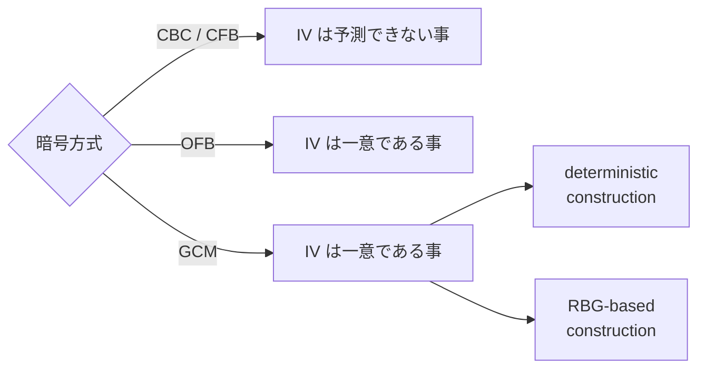

CBC と CFB は予測できない IV を求め、OFB は一意な IV を求めます（[NIST SP 800-38A](https://nvlpubs.nist.gov/nistpubs/Legacy/SP/nistspecialpublication800-38a.pdf) §5.3）。以降は、一意性が効く例として AES-GCM を扱います。IV の作り方は、カウンタなどで決める deterministic construction と、乱数で作る RBG-based construction の 2 通りです。

AES-GCM（認証付き暗号の方式）は、同じ鍵での暗号化の呼び出しを 2^32 回以下に収める事を求めます。この制約が適用されないのは、96 bit の IV を deterministic construction だけで生成する実装です（[NIST SP 800-38D](https://nvlpubs.nist.gov/nistpubs/Legacy/SP/nistspecialpublication800-38d.pdf) §8.3）。RBG-based construction では、96 bit 以上を乱数にした上でこの回数に収めます。衝突の確率がゼロになるわけではなく、NIST はこの 2 つを満たせば一意性の要求を満たすのに十分だとしています。

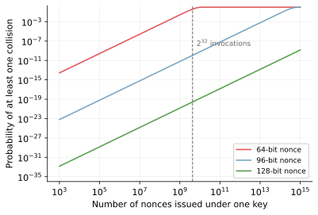

2^32 本を発行した時点の衝突確率は、96 bit なら 2^-33 程度、128 bit ならさらに 9 桁以上小さくなります。64 bit では同じ本数で 4 割近くに達し、発行数が増えるほど長さの差が無視できなくなります。

k の使い回しは、確率ではなく計算の問題です。ECDSA の署名は `r` と `s` の 2 つの値の組で、`r` は k だけから決まります。同じ k で 2 通署名すると `r` が一致するので、攻撃者には k が共通だと分かります。未知数は k と秘密鍵の 2 つ、`s` の式は 2 本あるので、連立させると両方とも解けます。

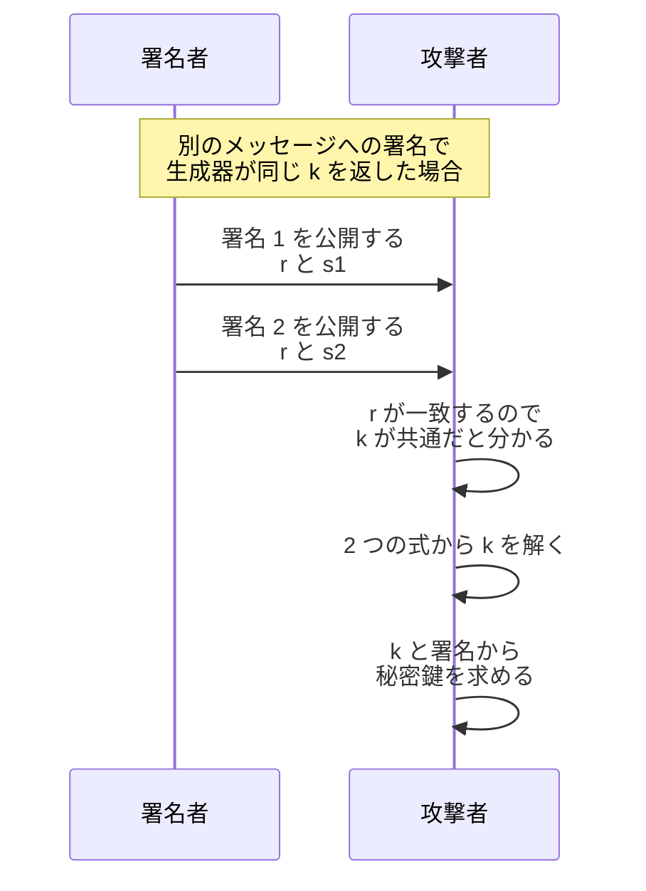

攻撃者が触るのは公開された 2 つの署名だけで、署名者の端末には近付きません（[Digital Signature](../../blockchain-systems/digital-signature/)）。

この危険を乱数なしで避ける設計もあります。決定的 ECDSA は k を秘密鍵とメッセージから HMAC（鍵付きハッシュ）で導出し、署名の生成時に乱数を使いません。ただし秘密鍵の生成には、min-entropy が鍵長に対して十分な乱数が必要です（[RFC 6979](https://www.rfc-editor.org/rfc/rfc6979.txt) §4）。

---

### 利点

- エントロピーの収集と乱数生成器の管理を OS に任せられ、呼び出しは 1 つで済む
- security strength に足りる seed があれば、DRBG がそこから必要な長さの bit 列を作れる
- min-entropy で予測できなさを bit で数え、鍵長と seed の大きさを比べられる
- backtracking resistance と reseed で、内部状態の漏洩が過去と将来の出力へ及ぶ範囲を抑えられる
- rejection sampling で有限の範囲から一様に選ぶ手順は、用途を問わず同じ形で使える

---

### 壊れた時に何が起きるか

乱数生成器の失敗は、使う側から見えない形で現れます。

- 生成器が壊れても出力は正常な bit 列に見え、出力だけでは異常が分からない
- DSA / ECDSA の実装では、乱数源の質が足りているかを自動テストで確実には検出できない
- 共通の生成器が壊れると、そこから値を取る用途が同時に影響を受ける
- 内部状態が漏れると、reseed までの出力を攻撃者が計算できる
- プールが初期化されていなくても、`/dev/urandom` は値を返す

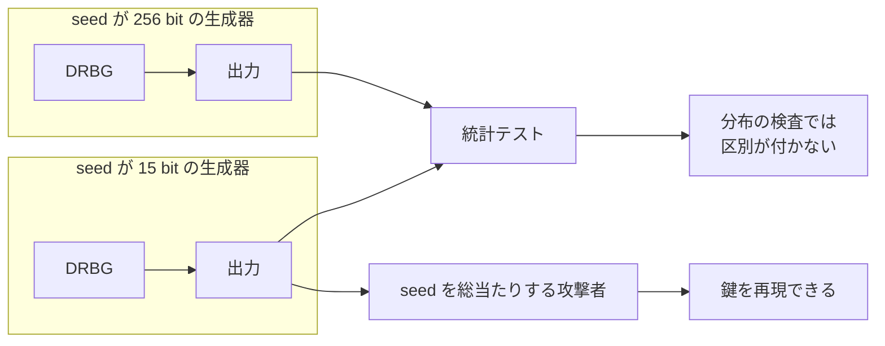

統計テストが見ているのは出力の分布で、どれだけの候補から選ばれた値かは見ていません。seed が 15 bit でも、分布の偏りは見えません。

署名の生成のように乱数が結果に現れない処理では、見分けにくさがさらに強く出ます。乱数を使う性質そのものが実装のテストを難しくするからです（[RFC 6979](https://www.rfc-editor.org/rfc/rfc6979.txt) §1）。

---

### 乱数の質が効きにくいケース

判断の基準は、その値を攻撃者が当てた時に何が起きるかです。ログの相関に使う識別子なら、当てられても得られる物はほとんどありません。しかし、同じ値が資源へのアクセスを許すなら、challenge と同じ扱いになります。

- 再現性のために seed を固定するシミュレーションや単体テスト
- 決定的 ECDSA のように、必要な値を秘密鍵とメッセージから導出する署名
- 公開されても損害が出ず、一意性だけが必要な識別子

要求が別の方向へ向く用途もあります。[Timelock Encryption](../timelock-encryption/) が使う drand の乱数ビーコンは、出力を公開して誰でも検証できる事を求めるので、予測できなさに加えて、単独の参加者が値を選べない事が要求されます。
