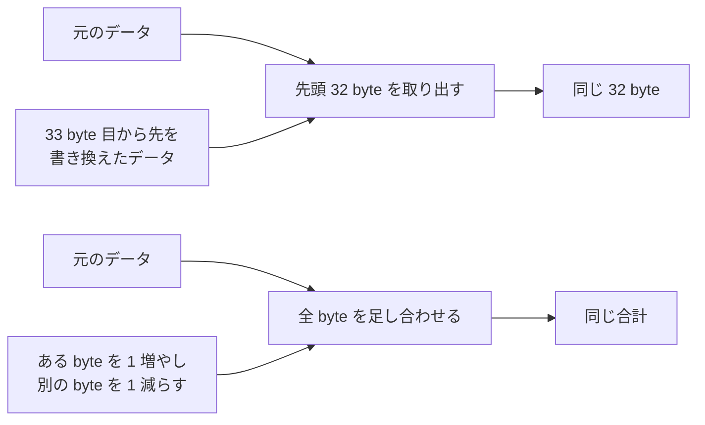
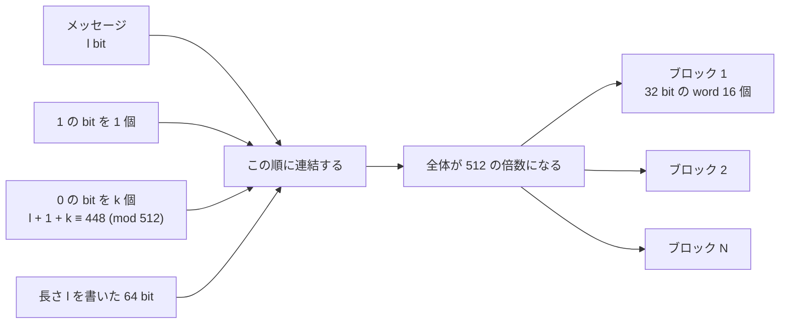
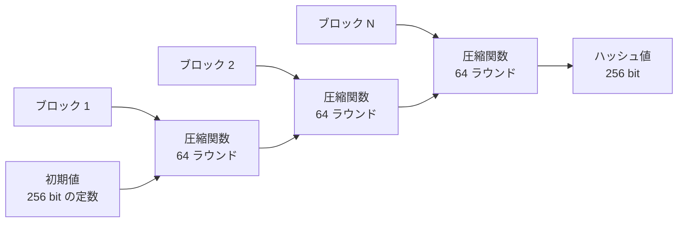
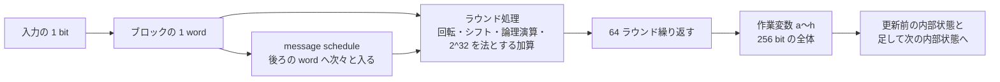
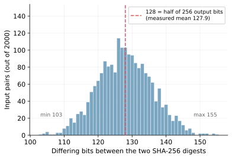

Hash Function（ハッシュ関数）とは、長さの異なるデータを固定長の値へ変換する関数です。変換後の値をハッシュ値と呼びます。

SHA-256（Secure Hash Algorithm 256）はハッシュ関数の 1 つで、仕様上扱える範囲であれば、入力の長さに関係なく 256 bit のハッシュ値を返します。1 byte のファイルと、0 で埋めた 64 MiB のファイルで、この事を確かめます。

```console
$ wc -c note.txt disk.img
       1 note.txt
67108864 disk.img
67108865 total
$ sha256sum note.txt disk.img
ca978112ca1bbdcafac231b39a23dc4da786eff8147c4e72b9807785afee48bb  note.txt
3b6a07d0d404fab4e23b6d34bc6696a6a312dd92821332385e5af7c01c421351  disk.img
```

note.txt は 1 byte、disk.img は 64 MiB ですが、SHA-256 の出力はどちらも 16 進数 64 文字です。16 進数 1 文字は 4 bit なので、出力長はいずれも 256 bit です。本ノートでは、長さの決まっていない入力から 256 bit のハッシュ値ができるまでの手順を説明します。

ハッシュ値は、配布物が途中で書き換えられていないかの確認に使われます。ダウンロードページに載っている 16 進数の文字列は、この用途で置かれています。ただし、この確認が成り立つ前提は、比較元の 64 文字を信頼できる経路で手に入れている事です。配布物と掲載されたハッシュ値の両方を差し替えられる相手に対しては、値が一致しても配布元が本物だという根拠になりません。

---

### なぜ素朴な縮め方では足りないのか

固定長に縮めるだけなら、先頭 32 byte を取り出す、全 byte を 1 byte の枠の中で足し合わせる、といった方法でも実現できます。しかし、どちらの方法でも、同じ値になる別のデータを手で作れます。



配布物の検証では、値の一致だけを根拠に同じデータだと判断します。攻撃者が、手元のファイルと同じ値を持つ別のファイルを作れる時点で、この判断は成り立ちません。検証に必要なのは、与えられたデータと同じハッシュ値を持つ別のデータを見つけにくい事です。

---

### 入力をブロック単位に分割する

SHA-256 の内部にある圧縮処理は、512 bit 単位でブロックを受け取ります。そのため、入力の後ろに bit を加え、全体を 512 の倍数にします。

この手順は padding（詰め物）と呼ばれ、[FIPS 180-4](https://nvlpubs.nist.gov/nistpubs/FIPS/NIST.FIPS.180-4.pdf) §5.1.1 が定めています。メッセージの長さを l bit として、まず 1 の bit を 1 個加え、続けて `l + 1 + k ≡ 448 (mod 512)`（512 で割った余りが 448）を満たす最小の非負の k だけ 0 の bit を加え、最後に l 自身を 64 bit で書きます。



1 ブロックは、32 bit のまとまりを 1 つの word（語）として、16 個に分けて読みます（同 §5.2.1）。先に加える 1 の bit があるので、元のデータの終わりと 0 埋めの始まりを区別できます。

長さを 64 bit で書く事から、SHA-256 が対象とするのは 2^64 bit 未満のメッセージです（同 §6.2）。

---

### 内部状態を何度も更新する

SHA-256 は 32 bit の word 8 個、合わせて 256 bit の値を持ち、ブロックを 1 つ読むごとにこの値を更新します。ここではこの 256 bit を内部状態と呼びます。仕様では、最初の内部状態を初期ハッシュ値、各ブロックを処理した後の値を中間ハッシュ値と呼びます。初期値は FIPS 180-4 §5.3.3 が定数として定めているので、どんな入力でも計算は同じ所から始まります。

512 bit のブロックと 256 bit の内部状態から次の 256 bit を作るので、この処理を圧縮関数と呼びます（同 §6.2.2）。圧縮関数は、8 個の作業変数 a〜h を内部状態で初期化して 64 ラウンド回します。回し終えた作業変数と、更新前の内部状態を word ごとに足した結果が、次の内部状態です。この足し算は `2^32` で割った余りを取り、32 bit に収まらない上位の桁を捨てます。これを `2^32` を法とする加算と呼びます。



ブロックを N 個読み終えた時の内部状態が、そのままハッシュ値です。入力が長くなると増えるのは更新の回数だけで、更新される領域は 256 bit のまま変わりません。長さの決まっていないデータから固定長のハッシュ値ができるのは、固定サイズの内部状態をブロックごとに繰り返し更新し、最後の状態を出力するからです。

先頭から順にブロックを渡せるので、入力全体をメモリに載せる必要もありません。ただし、内部状態が入力を蓄えているわけではありません。256 bit で表せる値は有限なので、多くの入力が同じハッシュ値に写ります。

---

### 1 bit の違いが出力全体に広がる理由

1 bit だけ違う 2 つの入力から、共通点の見えない 2 つのハッシュ値が出ます。この広がりを雪崩効果（avalanche effect）と呼びます。これを作るのは、1 ブロックの中で働く message schedule（メッセージスケジュール）とラウンド処理です。

SHA-256 が使う論理関数は 6 個です（FIPS 180-4 §4.1.2）。message schedule は `σ0` と `σ1` を使い、ラウンド処理は `Σ0`・`Σ1`・`Ch`・`Maj` を使います。

`Σ0` と `Σ1` は右回転（ROTR）と XOR から、`σ0` と `σ1` は右回転・右シフト（SHR）・XOR から、`Ch` は AND・XOR・NOT から、`Maj` は AND と XOR から作られます。XOR は 2 つの bit を比べて、違えば 1 を返す演算です。

message schedule は、64 ラウンドが使う word `W_t` を用意する手順です（同 §6.2.2）。t が 0 から 15 なら `W_t` はブロックの word そのままですが、16 から 63 では、前に決まっている 4 つの word を `σ1(W_{t-2}) + W_{t-7} + σ0(W_{t-15}) + W_{t-16}` の形で、`2^32` を法として加算します。そのため、ある word の違いは、それより後ろの word に次々と伝わります。

各ラウンドは、`Σ0`・`Σ1`・`Ch`・`Maj` の出力・ラウンドごとに決まる定数・message schedule の word を `2^32` を法とする加算で混ぜます。回転とシフトが 1 つの word の中で bit の位置を動かし、加算の桁上がりが下の桁の違いを上の桁に伝えます。



32 byte の入力で 1 bit だけ違う組を 2000 件作り、ハッシュ値で異なる bit の数を数えました。



2000 組の平均は 127.9 bit で、最も少ない組でも 103 bit、最も多い組で 155 bit が違いました。ただし、bit がよく混ざる事は、狙ったハッシュ値になる入力を効率よく作れない事の証明にはなりません。混ざり方の観測と、効率的な攻撃が無い事の確認は別です。

---

### 原像・第二原像・衝突は別の性質

ハッシュ値から、その値に対応する入力を効率よく求めにくい性質を原像計算困難性と呼びます。同じハッシュ値になる入力を見つけにくい事は、これとは別の性質です。探す対象は、攻撃者が何を与えられているかで 3 つに分かれます。

| 探索 | 何を探すか | 理想的な 256 bit ハッシュ関数で必要な計算量 |
| --- | --- | --- |
| 原像探索 | 与えられたハッシュ値に対応する入力 | 約 `2^256` |
| 第二原像探索 | 与えられた入力と同じハッシュ値になる、別の入力 | 約 `2^256` |
| 衝突探索 | 攻撃者が両方の入力を選んでよい、同じハッシュ値になる組 | 約 `2^128` |

衝突探索だけが `2^128` で済むのは、攻撃者が 2 つの入力をどちらも選べるからです。原像探索は与えられた 1 つのハッシュ値に当てる必要がありますが、衝突探索は自分で計算したハッシュ値を溜めていき、溜めた中のどれか 2 つが一致すれば成功します。一致し得る組の数は溜めた個数の 2 乗に比例して増えるため、出力が `2^256` 通りあっても `2^128` 個ほど溜めた時点で一致が起こります。23 人集まれば誕生日の同じ組が半々の確率で現れるのと同じ数え方で、この探し方を誕生日攻撃と呼びます。

3 つの性質がそれぞれどの場面で効くかは、Blockchain Systems セクションの [Hash Function](../../blockchain-systems/hash-function/) のノートで扱っています。

同じハッシュ値になる入力の組は必ず存在するので、成り立っているのは「衝突しない」ではなく「見つけるのに現実的でない計算量が必要」です。


SHA-256 の安全性に数学的な証明はありません。根拠になっているのは、64 ラウンドすべてを実行する SHA-256 に対して、原像・第二原像・衝突を現実的な計算量で求める攻撃が知られていない、という実績です。ラウンド数を減らした SHA-256 への解析は公表されており、解析そのものが無いわけではありません。
