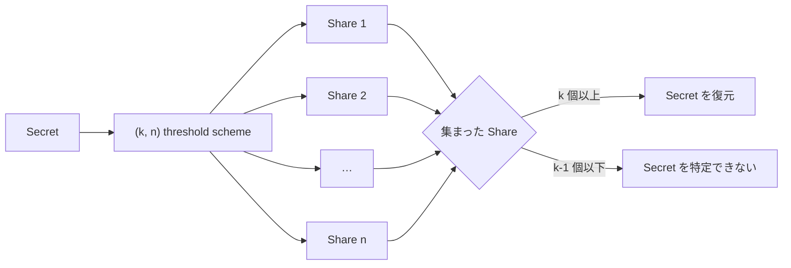
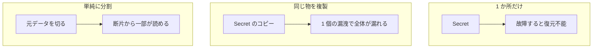
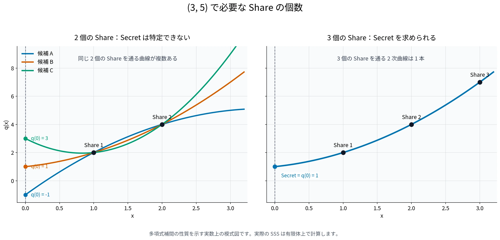
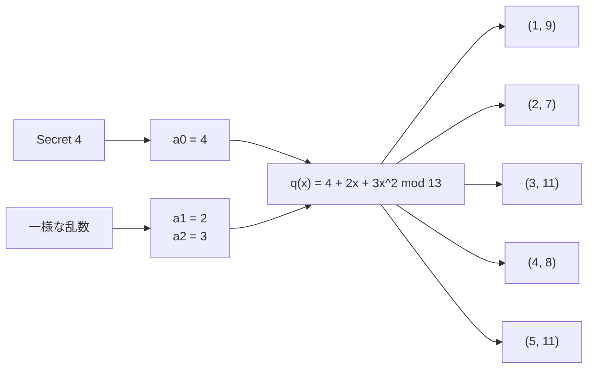
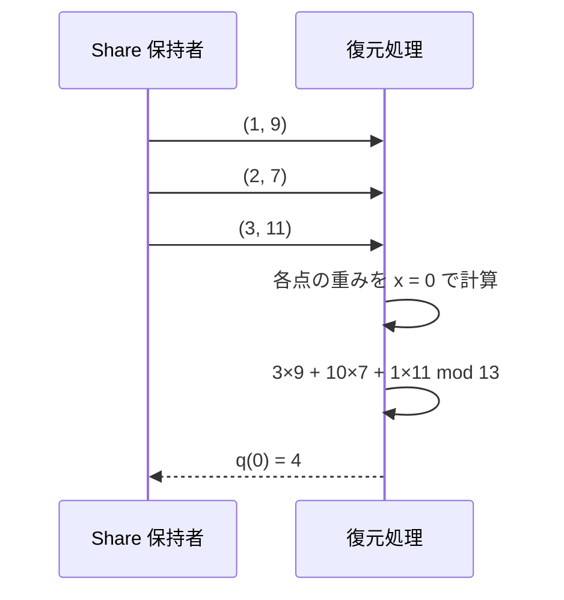
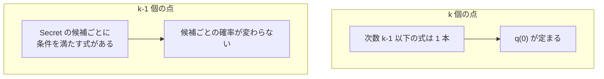
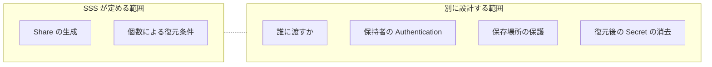
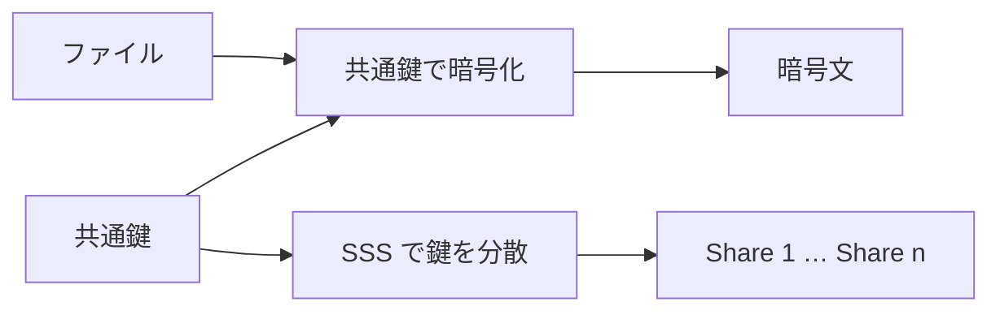

Shamir's Secret Sharing（SSS）は、1 つの Secret を n 個の Share に分け、そのうち異なる任意の k 個以上で復元できる秘密分散方式です。復元に必要な個数 k を閾値（threshold）と呼び、`(k, n)` threshold scheme と表します。

例えば、サービスの署名鍵を 1 台に置けば、その端末の故障で鍵を失います。鍵を 5 人全員にコピーすると、1 人分のコピーが漏洩しただけで鍵全体が知られます。`(3, 5)` の SSS は、2 個を失っても復元でき、漏れた Share が 2 個までなら Secret の候補を絞れない状態を作ります。

この分岐は Share を持つ人の身元を判定しません。閾値以上の数の Share を集められる主体なら、正規の管理者でも攻撃者でも Secret を復元できます。

---

### なぜ Secret を分散する必要があるのか

鍵の保管では、失わない事と漏らさない事を両立させる必要があります。1 か所だけに保管すると紛失に弱く、同じ鍵のコピーを増やすと漏洩の入口も増えます。ファイルを順番に切る方法では、1 個の断片から元データの一部がそのまま読めます。

SSS は、n-k 個までの紛失と k-1 個までの漏洩を別々に数えます。`(3, 5)` なら、5 か所のうち 3 か所から Share を回収できる可用性と、3 個未満の Share からは Secret の情報が得られない秘匿性を同時に持たせられます。

---

### 3 個の Share で 2 次式を決める

`(3, 5)` の k = 3 は、直感的には 2 次式に対応します。Secret を多項式の `x = 0` の値 `q(0)` に置き、0 ではない、異なる 5 個の x 座標で求めた点を Share として配ります。

x 座標が異なる 3 点があれば、それらを通る次数 2 以下の式は 1 本に定まるため、`q(0)` を求められます。2 点しかない場合は、その 2 点を通り、`q(0)` が異なる 2 次式を複数作れるので、どれが元の式なのか分かりません。

次の図は、多項式補間の性質を理解するために実数上で描いた模式図です。実際の SSS の計算は有限体上で行います。

左では、同じ 2 個の Share を通る曲線ごとに `q(0)` が異なります。右では 3 個の Share を通る 2 次式が 1 本に定まり、その `q(0)` として Secret を求められます。

---

### Secret を定数項に置いて Share を作る

SSS では、dealer（Share の生成役）が次数 k-1 以下の多項式を作ります。`k = 3` なら `q(x) = a_0 + a_1x + a_2x^2` という 2 次式です。定数項 `a_0` に Secret を入れ、ほかの係数は互いに独立な一様乱数として選びます。

Share は多項式の断片ではなく、異なる x 座標で計算した点 `(x, q(x))` です。値の偏りを残さないため、以下は素数 13 で割った余りの世界で計算します。Secret を 4、残りの係数を 2 と 3 にすると、`q(x) = 4 + 2x + 3x^2 mod 13` です。

| Share | 計算 |
| --- | --- |
| `(1, 9)` | `4 + 2 + 3 = 9` |
| `(2, 7)` | `4 + 4 + 12 = 20 mod 13` |
| `(3, 11)` | `4 + 6 + 27 = 37 mod 13` |
| `(4, 8)` | `4 + 8 + 48 = 60 mod 13` |
| `(5, 11)` | `4 + 10 + 75 = 89 mod 13` |

同じ Secret をもう一度分けても、乱数で選ぶ係数が変われば Share も変わります。dealer が多項式を保存し続ける構成では、dealer だけで元の Share を再生成できます。再生成が不要なら、多項式と Secret を復元できないように消します。

---

### k 個の点から定数項を取り出す

x 座標が異なる k 個の点があると、次数 k-1 以下で全ての点を通る多項式は 1 本に定まります。2 点から直線が決まる関係を k 個の点と次数 k-1 以下の多項式に広げたものです。

ラグランジュ補間（Lagrange interpolation）は、集めた各点について「自分の x 座標では 1、ほかの x 座標では 0」になる基底多項式を作り、Share の y 値を掛けて足します。Secret だけが目的なら多項式の全係数を求めず、`x = 0` の値 `q(0)` を直接計算できます。

この例の重み 3、10、1 は、13 で割った余りの世界で計算した値です。例えば `(1, 9)` の重みは `(0-2)(0-3) / ((1-2)(1-3)) = 3` です。異なる 3 個の Share を選ぶと重みは変わりますが、全て同じ多項式上の点なので `q(0)` は 4 に戻ります。

k-1 個では、Secret の候補ごとに条件を満たす多項式を 1 本ずつ作れます。2 個の Share しかない場合、定数項を 0 と仮定する 2 次式も、1 と仮定する 2 次式も、12 と仮定する 2 次式も存在します。

[Shamir 氏の 1979 年の論文](https://people.cs.pitt.edu/~litman/courses/cs2001/lectures/lecture-02-p612-shamir.pdf)は、Secret の各候補が事前に等確率なら、k-1 個以下の Share を得た後も確率が変わらない事を `(k, n)` threshold scheme の条件にしています。

より一般には、k-1 個以下の Share を観測しても Secret の事前分布（Share を見る前の候補ごとの確率）は変化しません。乱数係数を独立かつ一様に選ぶので、各候補には同じ数の多項式が対応します。これは総当たりの計算量ではなく、Share から情報を得られないという性質です。

---

### 有限体が候補の偏りを消す

整数上で係数を正の数から選ぶと、Share の y 座標から Secret の範囲を推測できます。`q(1) = a_0 + a_1 + a_2` なら、正の係数を足した結果から `a_0` の上限が見えるからです。

有限体では、足し算・引き算・掛け算・0 以外での割り算が、有限個の要素の中で閉じます。割り算は逆元の掛け算で、mod 13 では `2 × 7 = 1` なので 7 が 2 の逆元です。値が 13 に達すると 0 に戻り、k-1 個の点に対して 13 個の Secret 候補が同じ数だけ残ります。

| | 整数上で計算 | 有限体上で計算 |
| --- | --- | --- |
| 値の範囲 | 増え続ける | 有限個に収まる |
| 割り算 | 割り切れない場合がある | 0 以外は逆元で計算できる |
| k-1 個を見た結果 | 係数の選び方によって偏る | 候補ごとの確率が変わらない |

一般には、Secret を有限体の要素として表現・符号化します。素数 p を法とするこの例では、Secret を表現でき、かつ Share の x 座標として異なる非ゼロ要素を n 個取れるほど十分に大きな p を選びます。乱数係数は有限体から一様に選びます。

---

### 紛失・漏洩と SSS が守らない範囲

SSS が保証する範囲は、正しく生成された異なる Share の個数で表せます。

| 状況 | 結果 |
| --- | --- |
| n-k 個まで紛失 | 残った k 個で復元できる |
| k 個未満しか残らない | 正規の保持者も復元できない |
| k-1 個まで漏洩 | Secret の候補を絞れない |
| k 個以上漏洩 | 攻撃者も Secret を復元できる |

Share 保持者が誰なのかを確かめる処理は [Authentication](../authentication/) です。Share の配布先は Authorization（認可）や配布ポリシーで決め、配送経路と保存場所は別に保護します。

SSS には Share の改竄検出も含まれません。値を置き換えられる経路があるなら、改竄された Share を検出できる検証可能秘密分散などを別に検討します。復元時には Secret が 1 か所のメモリに現れ、その端末も攻撃対象になります。

---

### 単純分割・暗号化との違い

単純分割は元データの区間を各ファイルに保存します。暗号化は鍵を持つ相手に復号を許し、SSS は threshold 以上の Share を取得できる集合に復元を許します。暗号化だけでは、復号鍵をどこに置くかという問題が残ります。

大きなファイルを SSS で直接分けると、元データと同程度の Share を n 個保管します。そのためファイルを共通鍵で暗号化し、小さな共通鍵だけを SSS で分ける構成があります。

この構成では、ファイルの秘匿を暗号方式が担い、共通鍵の復元条件を SSS が担います。「[【TypeScript】ファイルを分割し、任意の分割ファイル数で復元できる nao1215/horcrux を作った話【分霊箱】](/post/ja/2025-10-05-typescript%E3%83%95%E3%82%A1%E3%82%A4%E3%83%AB%E3%82%92%E5%88%86%E5%89%B2%E3%81%97%E4%BB%BB%E6%84%8F%E3%81%AE%E5%88%86%E5%89%B2%E3%83%95%E3%82%A1%E3%82%A4%E3%83%AB%E6%95%B0/)」は、この組み合わせを実装した例です。

---

### 利点

- n-k 個を失っても、残りの Share から復元できる
- k-1 個以下の Share は、Secret の候補を絞る情報を与えない
- k と n を変える事で、漏洩への耐性と回収のしやすさを調整できる

---

### 欠点

- dealer を使う構成では、生成時に dealer が正しく動作する事を前提とする
- Share の真正性を別の手段で保証しなければ、改竄された値を復元処理へ混ぜられる
- 復元時には Secret が 1 か所に集まり、その場所が攻撃対象になる
- n 個の Share を保管するため、Secret を直接分けると総量が増える

---

### 適さないケース

- 頻繁に使う鍵について、使用のたびに k 人から Share を回収する必要がある用途
- dealer と復元端末を信頼できず、Share の検証機能も追加できない構成
- k 個の Share を長期にわたって回収できる見込みのない保管用途
