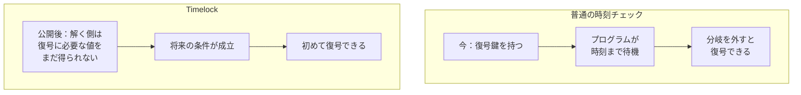
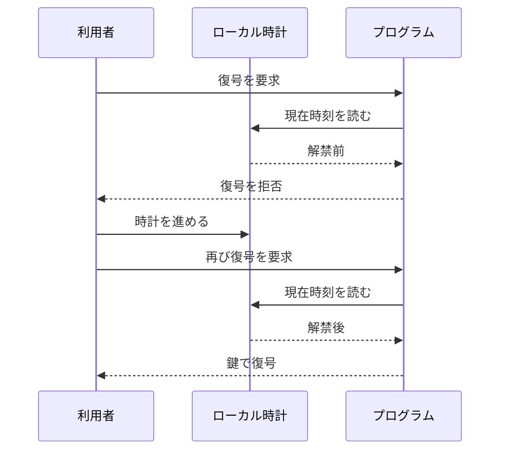
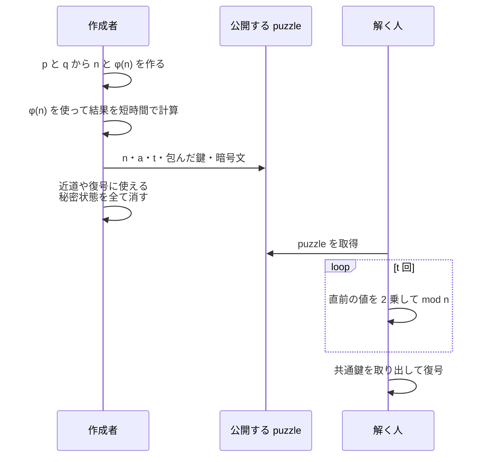
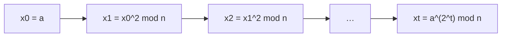
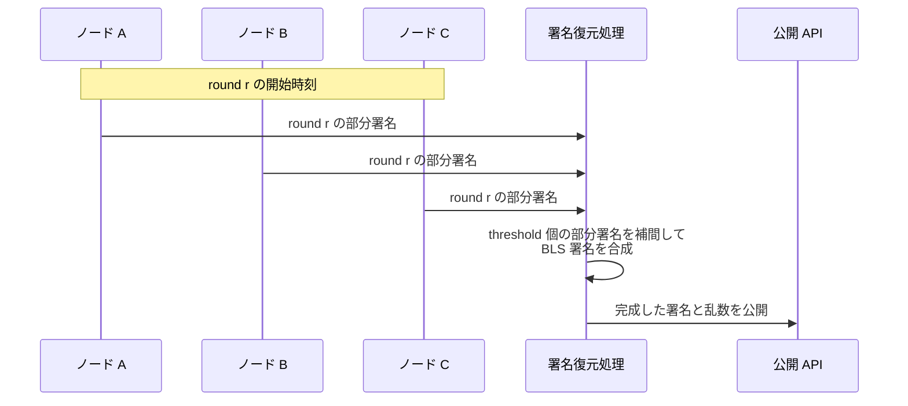
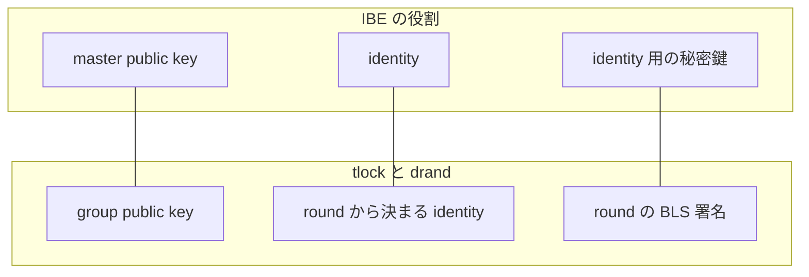
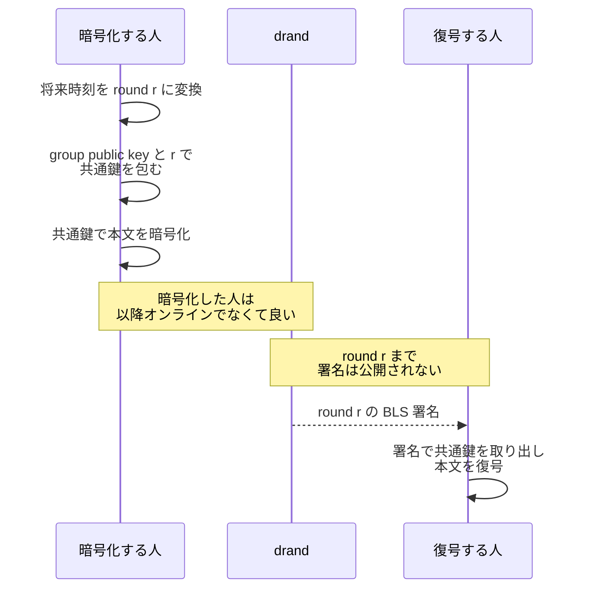

Timed-release Cryptography（時限公開暗号）は、あらかじめ作成した暗号文を、将来の条件が成立するまで復号できないようにする仕組みです。方式の前提が守られていれば、暗号化した本人も条件成立前には復号できません。

例えば封印入札（締切まで入札内容を非公開にする方式）では、締切前に主催者が内容を読むと、後から届く入札に影響します。締切後に公開される値があれば、入札者はその時刻に不在でも構いません。

Timelock は、利用者が復号鍵を最初から持ち、プログラムだけが待機する構成とは違います。公開後に解く側は、復号に必要な値や計算結果を条件成立まで得られません。

違いは以下の通りです。

| 方式 | 解く側が復号まで得られない物 | 復号条件 |
| --- | --- | --- |
| Time-lock Puzzle | 逐次計算の結果 | 逐次計算を終える |
| drand / tlock | 将来の round の署名 | round の署名を取得する |

---

### なぜ時計や sleep では Timelock にならないのか

時刻情報を用いた単純な分岐による実装、例えば`if now >= unlockAt { decrypt() }` という分岐は、時計とプログラムを管理できる環境で復号時刻を制御する方法です。しかし、利用者が復号鍵を持っていれば、ローカル時計を進める、条件分岐を削る、復号関数を直接呼ぶ、という変更で待ち時間を外せます。

sleep も待機処理を消せば終わります。鍵を時刻サーバ 1 台に預けると、運用者が予定より早く鍵を渡せる一方、サーバが停止すれば鍵を受け取れません。

[Rivest 氏、Shamir 氏、Wagner 氏の 1996 年の論文](https://publications.csail.mit.edu/lcs/pubs/pdf/MIT-LCS-TR-684.pdf)は、Timed-release Cryptography の実現方法として、連続した計算を要求する方法と、将来まで値を公開しない trusted agent を使う方法を分けています。

---

### Time-lock Puzzle は逐次計算を要求する

Time-lock Puzzle は、連続した計算が必要な問題を公開し、その解で共通鍵を取り出します。論文の方式では、大きな素数 p と q の積 `n = pq` を作り、`a^(2^t) mod n` を鍵の保護に使います。t は実時間ではなく、必要な 2 乗の回数です。

作成者は p と q から `φ(n) = (p-1)(q-1)` を求め、指数を `φ(n)` で簡約すれば t 回の逐次計算を省けます。公開後に作成者も早く開けないよう、p、q、`φ(n)`、短縮した指数、共通鍵など、近道や復号に使える秘密状態を全て消す必要があります。

解く人は n、a、t などの puzzle を受け取りますが、p と q は知りません。逐次 2 乗を大幅に高速化する方法がないという仮定の下では、解く人は repeated squaring（繰り返し 2 乗）を t 回行います。この逐次性は、素因数分解困難性だけから証明されている訳ではありません。

各段は直前の値を必要とするため、t 個の計算を別々の CPU に配る単純な並列化は使えません。とは言え、1 回の 2 乗を速くするハードウェアや、より速い実装の影響は受けます。論文も CPU time と real time を近付ける事が難点だと述べています。

| 指定する物 | 実際に決まる物 | 変動要因 |
| --- | --- | --- |
| 2 乗の回数 t | 逐次計算の量 | アルゴリズム・CPU・専用ハード |
| 想定した秒数 T | 作成時点の見積もり | 将来の計算能力 |
| 復号を始める時刻 | puzzle は指定しない | 解く人が計算を開始した時刻 |

つまり Time-lock Puzzle は絶対時刻を保証しません。公開直後から計算を始める想定なら「およそ何時間後」を狙えますが、計算開始が遅れれば復号も遅れ、計算能力が見積もりを上回れば早く開きます。

---

### drand は round ごとに threshold 署名を公開する

drand は、一定間隔の round ごとに公開検証できる乱数を生成する randomness beacon（乱数ビーコン）です。genesis time は round 1 の基準時刻、period は round の間隔です。`floor((time - genesis) / period) + 1` は、その時刻に対応する round 番号を返します。drand の停止や遅延があれば、その round の署名がまだ公開されていない場合があります。期限前に開けない事を優先するなら、対象時刻以後に始まる最初の round を選びます。

セットアップでは DKG（Distributed Key Generation、分散鍵生成）を実行し、各ノードが秘密鍵 Share を得ます。全体の秘密鍵を知る単独の dealer は存在しません。round の時刻になると各ノードが部分 BLS（Boneh-Lynn-Shacham）署名を出し、threshold 個から 1 つの署名を合成します。

[drand の暗号方式の説明](https://docs.drand.love/docs/cryptography/)によれば、threshold 未満の秘密鍵 Share からは将来の署名を予測できません。この構成は [Shamir's Secret Sharing](../shamir-secret-sharing/) と同じ多項式補間を使いますが、Secret を復元せずに部分署名を合成します。

round と時刻の対応は決定的なので、暗号化時に将来の round を指定できます。しかし、単独ノードの時計が解禁を決める訳ではありません。threshold 個の正しい部分署名が集まった時に署名が生成されます。

---

### tlock は将来の署名を IBE の秘密鍵として使う

tlock は group public key と将来の round 番号で暗号化し、その round の BLS 署名で復号します。この対応には IBE（Identity-Based Encryption、識別子ベース暗号）を使います。IBE は文字列などの identity を公開鍵とし、master secret key から identity に対応する秘密鍵を生成する方式です。

tlock では、drand の group public key が IBE の master public key に、将来の round 番号から決定的に求まる署名対象メッセージが identity に、BLS 署名が identity 用の秘密鍵に対応します。master secret key に相当する値は単独の場所に生成せず、各 drand ノードが自分の Share だけを持ちます。

暗号化時に必要なのは group public key と round 番号で、将来の署名は必要ありません。tlock は payload をランダムな共通鍵で暗号化し、その小さな鍵を round の identity に対する IBE で包みます。これは [tlock の公式リポジトリ](https://github.com/drand/tlock)が説明する hybrid encryption の構成です。

復号者は暗号化した本人から鍵を受け取りません。署名は公開値なので、解禁後は暗号文を持つ誰でも復号できます。受信者を限定する場合は、公開鍵暗号を別に重ねます。

tlock には unchained な drand ネットワークが必要です。unchained mode は、各ノードが署名するメッセージを round 番号だけから決められます。chained mode は直前 round の未公開署名も次のメッセージに含めるため、将来の identity を暗号化時に確定できません。

---

### 前提が崩れる条件

Time-lock Puzzle と tlock では、予定より早く復号される障害と、復号できなくなる障害が異なります。

| 前提・故障 | Time-lock Puzzle | drand / tlock |
| --- | --- | --- |
| 計算能力の進歩 | 実時間が短くなる | round の進行条件には影響しない |
| 時刻の精度 | 計算能力と開始時刻で変わる | 正しい時計運用と period の粒度に依存する |
| threshold の破り | threshold を使わない | 将来の署名を早く作られ、早期復号される |
| ネットワーク停止 | オフラインで計算できる | 新しい署名が出ず、復号が遅れる |
| 暗号仮定の破り | 素因数分解、または逐次性に関する仮定の破りで近道を得る | いずれかの暗号方式が破られると秘匿性を失う |
| 量子計算機 | RSA 型の仮定が崩れる | 現在のペアリング暗号の仮定が崩れる |

[drand の Security Model](https://docs.drand.love/docs/security-model/)は、threshold 未満のノードからは将来の beacon を導出できず、threshold 以上を侵害すると導出できると区別しています。後者では乱数を好きな値に変更できなくても、tlock の暗号文を予定より早く開く能力を得ます。

停止しても早期復号は起きませんが、復号は遅れます。ネットワークが復旧して対象 round の署名を出せば復号できます。公開済みの署名は保持または取得できる限り使えますが、対象の署名を作らず秘密鍵 Share も失われれば、その round の暗号文は復号できません。

いずれも耐量子方式ではなく、指定時刻までの秘匿を永久に保証するものではありません。

---

### 利点

- Time-lock Puzzle は第三者やネットワークを使わず、計算量で待ち時間を作れる
- drand / tlock は将来の round を指定し、暗号化した本人が不在でも公開値から復号できる
- drand / tlock は単独の時刻サーバではなく、threshold のノード集合に依存する

---

### 欠点

- Time-lock Puzzle の実時間は、解く計算機の能力と計算開始時刻で変わる
- Time-lock Puzzle は待っている間も逐次計算を続ける必要がある
- tlock は drand の継続稼働と、threshold 以上の運用者が結託しない仮定に依存する
- 解禁後の BLS 署名は公開されるため、暗号文を持つ相手を区別できない

---

### 適さないケース

- 絶対時刻を細かい粒度で保証したい用途に Time-lock Puzzle を使う場合
- drand が停止しても必ず取り出せなければならない長期保管
- 現在の暗号学的仮定が数十年後も成り立つ事を前提とする保管
