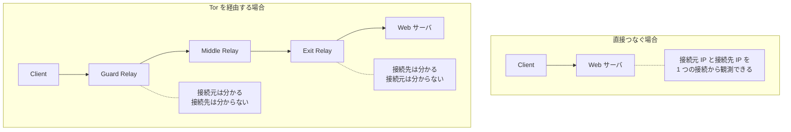
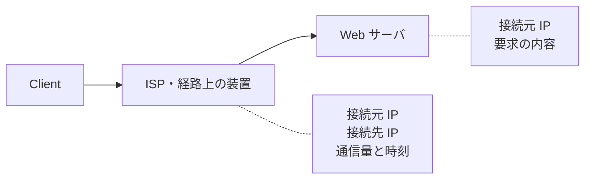
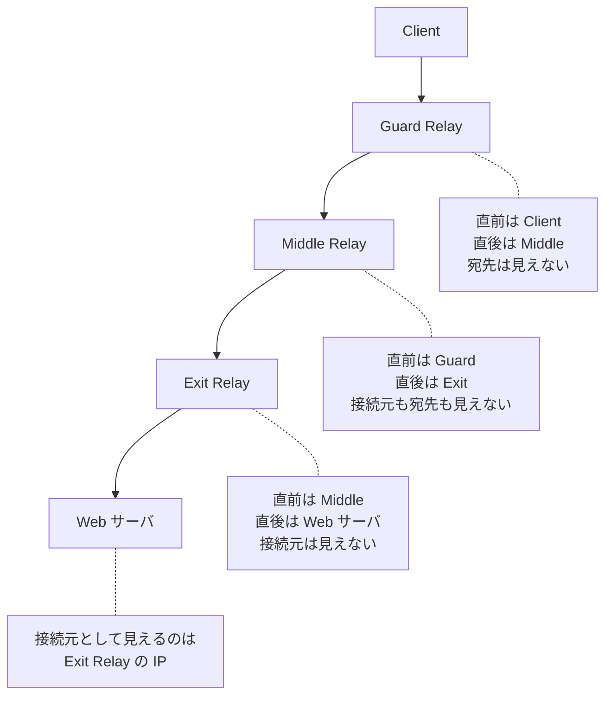
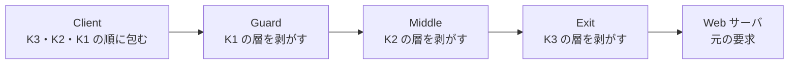
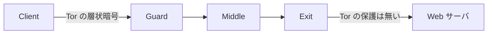
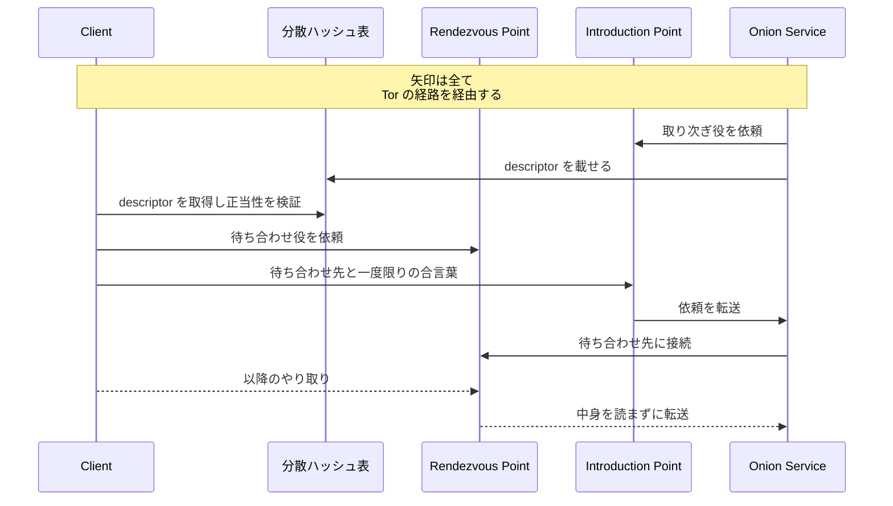
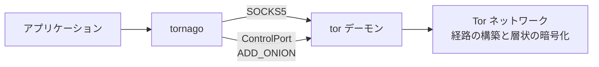

Tor は、通信を複数のリレー（中継役のサーバ）に順に通し、経路のどの 1 台からも接続元と接続先の両方が見えないようにする通信の仕組みです。通常の Web サイトに接続する場合は、Guard・Middle・Exit という 3 台のリレーを経由します。名前は The Onion Router に由来し、リレーごとに別の鍵で通信を包む構造から付いています。

この仕組みが必要な場面の代表は、素性を明かさずに行いたい調査です。例えば、自社の情報が無断で転載されていないかを Web サイトで確かめたい時、普通の HTTP クライアントで接続すると、相手のサーバには調査する側の IP アドレスが残ります。誰が見に来たのかを相手に渡さずに中身を取得したい、という要求がここで出てきます。

直接つないだ場合と、Tor を経由した場合の違いを以下に示します。

上記の図の Tor を経由する経路で壊しているのは、接続元と接続先を 1 か所から観測できる状態です。

---

### 前提と説明の範囲

本ノートでは、Tor クライアントが経路を作って通信する部分と、`.onion` のアドレスに接続する部分を説明します。リレーの運用方法、Tor Browser の設定手順、特定のサイトへの到達方法には触れません。

暗号方式の中身も範囲外にします。鍵の合意手順と暗号の種類は Tor の仕様が定めており、ここで必要なのは「リレーごとに別の鍵で包む」という構造だけです。

---

### なぜ接続元と接続先を切り離す必要があるのか

TCP/IP の通信では、パケットの先頭に送信元 IP アドレスと宛先 IP アドレスが平文で入ります。HTTPS が守るのは中身であって、この 2 つのアドレスは経路上の装置から見えたままです。IP アドレスから契約者や組織が絞り込まれる事もあるため、身元に繋がる情報として扱う必要があります。

通常の接続で誰が何を観測できるかは、以下の通りです。

上記の図の ISP（Internet Service Provider、契約している回線業者）と経路上の装置は、中身を読めなくても「誰が、どこに、いつ、どれだけ」を記録できます。接続先の Web サーバは、要求の中身に加えて、接続してきた相手の IP アドレスを受け取ります。経路の途中と接続先の両方に、接続元を指す値が残ります。

素朴な対策は、プロキシを 1 台挟んで接続元を付け替える方法です。この形では、そのプロキシ 1 台が接続元と接続先の両方を知る事になります。

[Tor Project の説明](https://support.torproject.org/about/how-is-tor-different-from-other-proxies/)も、単純なプロキシには「a single point of trust and failure」（信頼と障害が集まる単一の点）を作ると書かれています。Tor はこれに対して、層状に暗号化したうえで通信を複数のリレーに通します。

---

### Onion Routing でリレーごとに知る事を分ける

Onion Routing は、通信を複数の中継役に順に通し、どの 1 台も直前と直後しか知らない状態を作る方式です。Tor クライアントは、まずリレーの一覧を取得します。一覧はディレクトリ権威（directory authority）と呼ばれる複数の運用者が署名した文書として配られ、クライアントはその中から選んだリレーを繋いで経路（circuit）を作ります。経路上の位置には呼び名が付きます。

- Guard Relay: クライアントが直接つなぐ 1 台目
- Middle Relay: 2 台目。Tor の内部だけと通信する
- Exit Relay: 3 台目。ここから Tor の外にある宛先に接続する

台数は利用者が選ぶ設定ではありません。Tor Project には「[the path length is hard-coded at three (except if you're accessing an onion service)](https://support.torproject.org/about-tor/using-and-sharing/circuit-length/)」（onion service にアクセスする場合を除き、経路の長さは 3 に固定されている）と説明されています。

Tor の設計論文「[Tor: The Second-Generation Onion Router](https://svn-archive.torproject.org/svn/projects/design-paper/tor-design.html)」は、経路上の各ノードについて「knows its predecessor and successor, but no other nodes in the circuit」（直前と直後は知るものの、経路上のほかのノードは知らない）と書かれています。

各地点が何を知るのかは、以下の通りです。

上記の図で効いているのは、接続元を知る Guard Relay と接続先を知る Exit Relay の間に、両隣の IP アドレスしか知らない Middle Relay が挟まっている構造です。

観測できる情報を整理すると次のようになります。

| 地点 | 接続元 IP | 最終的な接続先 | 通信の中身 |
| --- | --- | --- | --- |
| ISP・経路上の装置 | 見える | 見えない | 見えない |
| Guard Relay | 見える | 見えない | 見えない |
| Middle Relay | 見えない | 見えない | 見えない |
| Exit Relay | 見えない | 見える | HTTPS でなければ見える |
| Web サーバ | 見えない | ー | 見える |

表の 1 行目が示すとおり、契約している回線業者から接続先は隠れます。Guard Relay への接続そのものは見えるので、Tor を使っている事実までは隠せません。

1 台目だけは、経路を作るたびにネットワーク全体から選び直す訳ではありません。[Tor の guard 仕様](https://spec.torproject.org/guard-spec/index.html)には「Tor clients choose a small number of guard nodes」（Tor クライアントは少数の guard ノードを選ぶ）と書かれています。

毎回ネットワーク全体から入口を選ぶ構成では、経路を作り直す回数が増えるほど、攻撃者のリレーが 1 台目に入る経路が現れる可能性が上がります。

同じ仕様は、この扱いの狙いを「to prevent an attacker who controls some fraction of the network from observing a fraction of every user's traffic」（ネットワークの一部を支配する攻撃者が、全ユーザの通信の一部を観測する事を防ぐため）だと説明されています。

候補を少数に絞って使い続けると、攻撃者のリレーが 1 台目に入る機会が、経路を作り直す回数に比例して増える形を避けられます。1 台に永久に固定するのではなく、候補の入れ替えも起こります。

---

### 層ごとの鍵で包んで送る

経路の各リレーが、自分の層だけを開けて次のリレーに渡す状態になるのは、クライアントが鍵を作る順序によります。クライアントは経路を 1 台ずつ伸ばしながら、各リレーとの handshake を通じて、そのリレーとの通信に使う鍵材料をそれぞれ導出します。

最初に Guard Relay との間で鍵を導出し、その鍵で暗号化した通信の中を通して Middle Relay と handshake します。次に、その 2 重の暗号の中を通して Exit Relay と handshake します。この入れ子のおかげで、Guard Relay は Middle Relay 以降の鍵を知りません。

Tor Project はこの鍵について「[these extra layers of encryption mean that only the exit relay can read the cells](https://support.torproject.org/about-tor/how-tor-works/key-management/)」（この追加の暗号層により、cell を読めるのは exit relay だけになる）と説明されています。cell は、Tor が経路上で通信を運ぶ単位です。

包み方と剥がし方は以下の通りです。図の K1・K2・K3 は 1 リレーにつき 1 つの鍵として書いた概念上の表記で、実際には送信と受信の方向などに応じた鍵が導出されます。

上記の図の Guard Relay は K1 の層だけを開け、同じ経路の次のリレーに流します。転送先は経路を伸ばす時に決まっており、cell を開けると指示が現れる訳ではありません。残りは K2 と K3 で包まれたままなので、中身も最終的な宛先も読めません。

玉ねぎのように暗号を剥がす、という言い方だけでは、なぜ 1 台目が中身を読めないのかまで伝わりません。読めない理由は、鍵を導出した順序によって、Guard Relay が自分の層の鍵しか持たない事にあります。

---

### Exit Relay から先は Tor の暗号化が掛からない

層は Exit Relay で全部剥がれます。そのため、Exit Relay から Web サーバまでの区間には、Tor による暗号化が残りません。Tor Project も、暗号化される範囲を「[between the Tor client (on your computer) and where it pops out somewhere else in the world](https://support.torproject.org/about/how-is-tor-different-from-other-proxies/)」（コンピュータ上の Tor クライアントと、世界のどこかで通信が外に出る地点との間）だと書かれています。

暗号化が効く区間は以下の通りです。

上記の図のとおり、Tor を使う事と、中身が送信者から受信者まで通しで暗号化される事（End-to-End の暗号化）は別です。Exit Relay から中身を隠すのは HTTPS の仕事で、Tor が隠すのは経路の情報です。

Tor Project の案内も、機微な情報を渡す相手について「[display a padlock or onion icon in the address bar, include https:// in the URL, and display the proper expected name for the website](https://support.torproject.org/faq/staying-anonymous/)」（アドレス欄に錠前か onion のアイコンが出ていて、URL に https:// が含まれ、サイトの名前が期待どおりに表示される）事を確かめるよう注意しています。

Tor だけを使う場合と、HTTPS を併用する場合の違いを次に示します。

| | Tor のみ | Tor と HTTPS |
| --- | --- | --- |
| 接続元と接続先の結び付き | Tor が隠す | Tor が隠す |
| 通信の中身 | Exit Relay 以降は平文 | Client から暗号化を終端する地点まで暗号化される |
| Exit Relay から見えるもの | 接続先と平文の中身 | 接続先と暗号文 |

---

### Onion Service は Exit Relay を通らない

`.onion` で終わるアドレスへの接続では、通信が Tor ネットワークの外に出ません。宛先がインターネット上の IP アドレスではなく、サービスの公開鍵から作ったアドレスなので、外に出す Exit Relay が必要ない構成になります。

[Tor Project の解説](https://community.torproject.org/onion-services/overview/)によると、サービスはまず複数のリレーに長期の経路を張り、自分への取り次ぎ役（introduction point）になってもらいます。この経路も Tor の経路なので、「the server does not reveal the service location to the introduction points」（サーバは取り次ぎ役に対して自分の所在を明かさない）状態が保たれます。

サービスは取り次ぎ役の一覧を署名付きの descriptor としてまとめ、Tor ネットワーク上の分散ハッシュ表に載せます。クライアントは `.onion` のアドレスに含まれる公開鍵を起点として descriptor の正当性を[検証](../../blockchain-systems/digital-signature/)し、取り次ぎ役の情報を取り出します。アドレスがサービスの identity と結び付いているので、別のサービスが用意した descriptor は通りません。接続の流れは以下の通りです。

上記の図の Rendezvous Point は、クライアントが選んだ待ち合わせ役で、クライアント側の経路の 3 台目です。クライアントとサービスがそれぞれ自分の経路を張った先で落ち合うので、Rendezvous Point が接するのは両方の経路の終端だけになり、どちらの IP アドレスも分かりません。接続はクライアント側 3 台とサービス側 3 台の、合計 6 台を経由します。

同じ解説も、この役には「simply relays (end-to-end encrypted) messages from client to service and vice versa」（クライアントとサービスの間で、End-to-End に暗号化されたメッセージを中継するだけ）だと書かれています。その結果、既定の構成では、クライアントはサービスの IP アドレスを知らず、サービスもクライアントの IP アドレスを知らないまま通信できます。

通信が Tor の外に出ない点も、通常の Web アクセスとの違いになります。Tor Project には「[All traffic between Tor users and onion services is end-to-end encrypted](https://support.torproject.org/tor-browser/features/onion-services/)」（Tor ユーザと onion service の間の通信は全て End-to-End に暗号化される）と書き、HTTPS で接続するかどうかを気にする必要はないと説明されています。

守られるのはクライアントとサービスの間の転送路で、繋いだ先が意図した相手かどうかは別の問題です。`.onion` のアドレスは長い文字列なので、似せたアドレスに誘導される余地は残ります。

---

### Tor が守らない範囲

「Tor を使えば匿名」という要約は成り立ちません。設計論文が最初に断っているのは、全ての通信路を観測できる攻撃者を想定していない事です。

論文は、ネットワークの全ての通信路を観測できる攻撃者を global passive adversary と呼び、匿名性の設計で最もよく想定される脅威として挙げています。

そのうえで「[like all practical low-latency systems, Tor does not protect against such a strong adversary](https://svn-archive.torproject.org/svn/projects/design-paper/tor-design.html)」（遅延の小さい実用的なシステムがどれもそうであるように、Tor はこれほど強い攻撃者からは守らない）と書かれています。実際に想定するのは、通信の一部を観測できる相手です。

想定の外に残る攻撃を次に示します。

| 攻撃 | 何が起きるか | Tor での位置付け |
| --- | --- | --- |
| Global passive adversary | 全ての通信路を観測される | 設計上の想定外 |
| Traffic correlation | 両端の時刻と通信量の型を突き合わせられる | 最小限しか隠せないと論文が明言 |
| Malicious exit relay | HTTPS でない通信の中身を読まれる | 経路の構造として残る |
| Browser fingerprinting | ブラウザの特徴の組み合わせで利用者が結び付けられる | Tor Browser 側の対処 |
| Application layer leak | Tor を通さない通信や、利用者が入力した情報が出る | Tor の外側 |

Traffic correlation は、経路の中身を解読しない攻撃です。両端を観測できる攻撃者は、global passive adversary でなくてもこの攻撃を行えます。

論文はこの攻撃について「[can confirm a suspicion that Alice is talking to Bob if the timing and volume patterns of the traffic on the connection are distinct enough](https://svn-archive.torproject.org/svn/projects/design-paper/tor-design.html)」（通信の時刻と量の型が十分に特徴的であれば、Alice が Bob と通信しているという疑いを裏付けられる）と書かれています。

同じ論文が「Tor only minimally hides such correlations」（Tor がこの相関を隠せるのは最小限にとどまる）と認めているとおり、守りは限定的です。

Malicious exit relay は、Exit Relay の運用者が中身を読める構造から出てきます。HTTPS を使っていれば読めるのは暗号文だけです。

Browser fingerprinting は、経路ではなくブラウザの実装が相手です。Tor Project は fingerprinting を「[the systematic collection of information about the web browser to make educated guesses about its identity or characteristics](https://support.torproject.org/anti-fingerprinting/)」（Web ブラウザに関する情報を体系的に集め、その識別情報や特徴を推測する事）と説明されています。

対処は Tor Browser 側にあり、ブラウザが自分の種類を名乗る User-Agent の値を揃える、画面の大きさをいくつかの区分に丸める、といった方法で利用者どうしを似せています。

Application layer leak は、通信が Tor に入る前の問題です。Tor Project には「[Tor only protects applications that are properly configured to send their Internet traffic through Tor.](https://support.torproject.org/faq/staying-anonymous/)」（Tor が守るのは、通信を Tor に通すよう正しく設定されたアプリケーションだけ）と書かれています。

利用者が自分で明かす情報も同じ層にあります。サイトにログインしたり氏名を入力したりすれば、経路がどれだけ隠れていても、その相手に対しては匿名ではなくなります。

---

### tornago が使っている Tor の機能

ここまでの仕組みを踏まえると、Tor を利用するプログラムが実際に触る部分は限られます。[nao1215/tornago](https://github.com/nao1215/tornago) は、Go から Tor 経由の通信と Onion Service の作成を扱うためのライブラリで、Tor のロジックを実装し直したものではありません。tor コマンド（デーモン）に 2 つの口から指示を出します。デーモンは自分で起動する事も、既に動いているものに繋ぐ事もできます。

- SOCKS5 プロキシ: アプリケーションの TCP / HTTP 通信を Tor の経路に流す口
- ControlPort: tor デーモンに命令を送る口。Onion Service の作成や経路の作り直しで使う

以下が役割の分かれ方です。

上記の図のとおり、Guard Relay の選択も層ごとの暗号化も tor デーモンの仕事で、tornago が扱うのは構築済みの経路を使うための口です。Onion Service を立てる場合は、ControlPort に `ADD_ONION` を送ってアドレスを作り、その 80 番ポートをローカルの HTTP サーバに転送する対応付けを設定します。

注意点として、ControlPort は tor デーモンを操作する管理用の口です。Onion Service の作成や経路の制御まで行えるので、外部のネットワークに開かず、cookie 認証やパスワード認証を設定したうえで使います。

[Tor の control 仕様](https://spec.torproject.org/control-spec/implementation-notes.html)も「If the control port is open and no authentication operation is enabled, Tor trusts any local user that connects to the control port.」（ControlPort が開いていて認証が有効になっていない場合、tor は接続してきたローカルの利用者を誰でも信頼する）と書き、この状態を勧めていません。

作った経緯と実装の詳細は「[【Golang】tor client/server を実装するための nao1215/tornago ライブラリを作った話](/post/ja/2025-11-21golangtornago%E3%83%A9%E3%82%A4%E3%83%96%E3%83%A9%E3%83%AA%E3%82%92%E4%BD%9C%E3%81%A3%E3%81%9F%E8%A9%B1/)」で扱っています。

---

### 利点

- 経路上の 1 台からは、接続元と接続先の両方を観測できない
- 入口に使う候補を少数に絞るので、経路を作り直すたびに攻撃者のリレーに当たる機会が増える形を避けられる
- Onion Service では、双方が相手の IP アドレスを知らないまま通信できる
- リレーの一覧が公開されており、単一の事業者を信頼する前提を置かずに済む
- TCP の通信を SOCKS5 プロキシに向け、名前解決も Tor 側に委ねれば、既存のアプリケーションを通せる

---

### 欠点

以下は、遅延の小さい通信を保ったまま経路を隠す事を優先した結果として現れる制約です。

- 複数のリレーを経由し、経路が地理的に遠回りになる事もあるため、直接つなぐ場合より遅延が大きい
- リレーの一覧に署名するディレクトリ権威への信頼は残る
- 経路の両端を観測できる攻撃者に対しては、通信の型を突き合わせられる
- Exit Relay から先には Tor の暗号化が掛からず、中身の保護は HTTPS に依存する
- ブラウザやアプリケーションが出す情報は経路の外にあり、Tor では隠せない
- 経路の構築とディレクトリ情報の取得に時間が掛かり、利用可能になるまで待ちが入る
