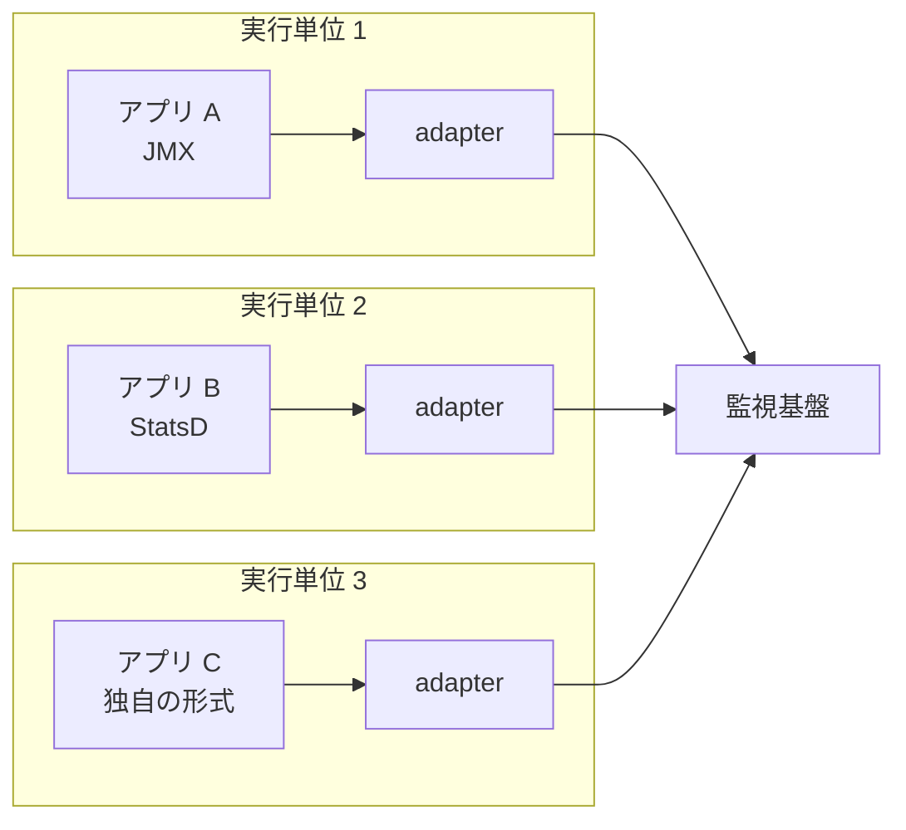
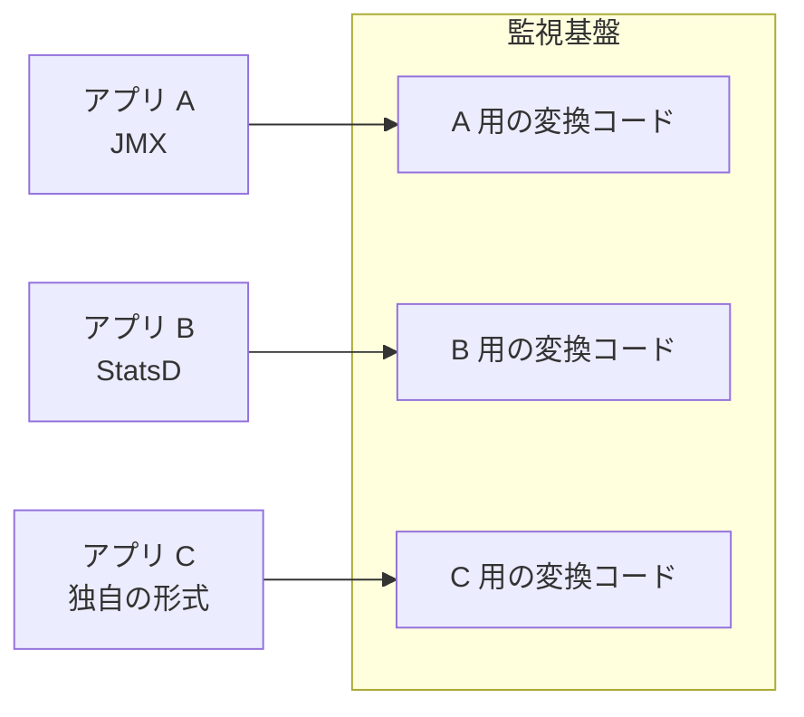
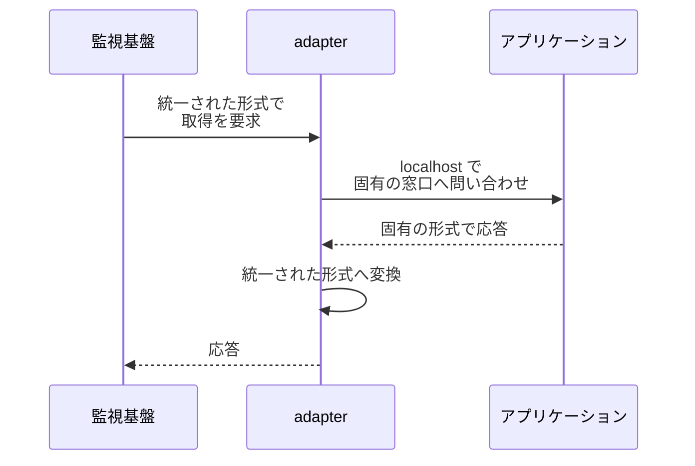

Adapter とは、アプリケーションと同じ実行単位へ配置し、外から見える出力とインターフェースを統一する補助コンテナです。アプリケーションのコードには手を入れず、外から見た形だけを揃えます。

実行単位（同じマシンへまとめて配置され、まとめて作られ削除されるコンテナの集まり）・実行基盤（コンテナの配置とライフサイクルを管理する基盤）・volume（同じ実行単位の複数のコンテナから同じ内容が見えるファイルの置き場）は、[Sidecar](../sidecar/) と同じ意味で使います。同じ実行単位のコンテナはネットワークを共有する設定にできるため、隣のコンテナへ localhost で届きます。

この名前は、Brendan Burns が 2015 年 6 月 29 日に公開したブログ「[The Distributed System ToolKit: Patterns for Composite Containers](https://kubernetes.io/blog/2015/06/the-distributed-system-toolkit-patterns/)」で、Sidecar・Ambassador と並ぶ 3 つのパターンの 3 つ目として紹介されました。同ブログは Adapter を「出力を標準化し、正規化する」と説明しています。

体系化した論文「[Design Patterns for Container-based Distributed Systems](https://www.usenix.org/conference/hotcloud16/workshop-program/presentation/burns)」の 4.3 節は、「Ambassador パターンがアプリケーションへ外の世界を単純化して見せるのに対し、Adapter は外の世界へ、単純化され均質にされたアプリケーションの姿を見せる」と書き、それを「複数のコンテナにまたがって出力とインターフェースを標準化する事で行う」としています。

論文とブログが挙げる監視の例を以下に示します。

上図の監視基盤が知っているのは 1 つの形式だけです。3 つのアプリケーションはそれぞれ別の方法でメトリクスを出しており、その違いを吸収するのが各実行単位の adapter です。JMX（Java Management Extensions）は Java の管理と監視のための仕様で、アプリケーションが登録した情報を外から読み書きする窓口です。

StatsD は、メトリクスを短いテキスト 1 行で送るプロトコルと、それを受けて集約するデーモンを指します。どちらも監視基盤が直接読める形とは限らず、そのままでは監視基盤ごとに読み方を用意する事になります。

---

### なぜ Adapter が必要なのか

出力の形式を最初から揃えておければ、変換は要りません。論文もその方法に触れており、Google 社内ではコードの規約によって統一を実現していると書いています。同じ節は続けて、それはソフトウェアを一から作る場合にしかできないとも書いています。

一から作れない相手は必ず混ざります。オープンソースのミドルウェアや、手を入れられない既存のシステムがそれにあたります。論文は、Adapter パターンによって、レガシーとオープンソースの雑多な世界が、元のアプリケーションを改変せずに統一されたインターフェースを提示できるようになるとしています。

変換をアプリケーションの外へ出さず、監視基盤の中に持たせる方法もあります。その場合に何が起きるのかを以下に示します。

上図では、変換のコードが監視基盤の中に集まっています。アプリケーションが 1 つ増えるたびに監視基盤へ手を入れる事になり、変換の誤りが監視基盤そのものを壊す位置に置かれます。論文も、複数種類のバックエンドと通信できる既存の監視ソリューションはあるとした上で、それらは監視システム自身の中にアプリケーション固有のコードを持つため、関心の分離が不十分になると書いています。

---

### 接点と変換の向き

論文の 4.3 節は、メインのコンテナが localhost または共有のローカルボリュームを通じて adapter と通信できると書いています。どちらを使うかは、アプリケーションが出力を何で出しているかで決まります。監視基盤がメトリクスを取りに来る構成では、adapter がアプリケーションとは別のポートで待ち受け、外部からそのポートへ問い合わせを受ける形にできます。

| アプリケーションの出し方 | 接点 | adapter が行う事 |
|---|---|---|
| ポートを開いて問い合わせに答える | localhost | 問い合わせて、統一された形式へ変換する |
| ファイルへ書き出す | 共有 volume | 読み取って、統一された形式へ変換する |
| 一定間隔で外へ送る | localhost | 受け取って、統一された形式で送り直す |

上表の監視の例では、変換されるデータはアプリケーションから外へ向かいます。1 行目と 2 行目は adapter が取りに行く形、3 行目はアプリケーションが送る形です。起点は違っても、どれもアプリケーション固有の出力を外向けの形式へ揃えています。3 行目には注意点があり、送り先を localhost の adapter へ向け直す設定だけはアプリケーションに要ります。コードを触らずに済むという性質は、この設定までは免除しません。

論文の 4.3 節は、標準化する対象を「出力とインターフェース」と書いています。原典が具体例として扱っているのは監視のインターフェースです。ただし、定義がインターフェースまで含んでいるので、外から来る要求の受け口を揃える構成にも当てはまります。例えば、外部が新しい形式で呼びたいのにアプリケーションが古い形式しか受け付けない場合、adapter が受け口になって変換します。要求を受け取る向きは監視の例と逆になります。それでも、アプリケーションがサーバとして外へ見せる形を揃えている点は変わりません。

---

### 取得の起点

監視の用途では、監視基盤が一定間隔でメトリクスを取りに来る形が多くなります。Prometheus の exporter をアプリケーションと同じ実行単位へ同居させる使い方が、この形にあたります。

Prometheus はメトリクスを取りに来て蓄える監視基盤で、[公式ドキュメント](https://prometheus.io/docs/instrumenting/exporters/)は exporter について、サードパーティのシステムから既存のメトリクスを Prometheus のメトリクスとして書き出す助けになるライブラリとサーバだと説明しています。同ページは、その用途が「HAProxy や Linux のシステム統計のように、対象のシステムへ直接 Prometheus のメトリクスを組み込む事が現実的でない場合に有用」だと書いています。

取りに来る形での往復を以下に示します。

上図でアプリケーションのコードは変わっていません。変換が起きるのは adapter の中だけで、取りに来る形であれば、アプリケーションは自分がどの形式で監視されているのかを知りません。監視基盤を別の製品へ入れ替える場合も、アプリケーションは変えずに済みます。adapter が OpenMetrics のような標準の形式で出していて、新しい監視基盤も同じ形式を読めるなら、adapter も変えずに済みます。

差が残る場合は、adapter か監視基盤の設定のどちらかで吸収します。Adapter の価値は、監視の製品ごとに adapter を取り替える所ではありません。アプリケーション固有のインターフェースと外向けの標準的なインターフェースの境界が、アプリケーションの外に置ける所にあります。

exporter を必ず同居させるわけではありません。Prometheus の[複数対象を 1 つの exporter で見る形の解説](https://prometheus.io/docs/guides/multi-target-exporter/)は、exporter がメトリクスの取得元のマシンで動く必要はないと書いています。1 台の exporter が多数の対象を担当する構成もあり、それは変換のコードを 1 箇所へ集める形なので、ここで扱う Adapter とは配置が違います。

同居させる場合でも、対象によっては設定が要ります。Java のアプリケーションから JMX を別のコンテナから読むには、リモート接続を有効にする起動オプションが要ります。[jmx_exporter の公式ドキュメント](https://prometheus.github.io/jmx_exporter/)は、同じ JVM の中で動く Java Agent としての利用を大半の利用者へ勧めており、その理由にリモート JMX の設定を避けられる事を挙げています。変換をプロセスの中へ入れるか別のコンテナへ出すかは、この手間と、独立した更新や資源の分離とのトレードオフになります。

---

### メトリクス以外の用途

同じ形は、出力と接点を持つ物なら何にでも当てはまります。日時とログレベルの書き方がまちまちなログを 1 つの構造へ揃える用途と、生死の判定の仕方が違うアプリケーションへ共通の窓口を用意する用途が代表的です。どれも、変換の規則を実行単位の中に閉じ込めて、外から見た形だけを揃えている点で同じです。

---

### 利点

- アプリケーションを改変せずに、外から見た形を揃えられる
- 変換のコードが監視基盤から出るため、アプリケーションが増えても監視基盤へアプリケーション固有の変換コードを足さずに済む
- 同じ形式で出力する複数のアプリケーションへ、同じ adapter を使い回せる
- 変換の規則が実行単位の中に閉じ、監視基盤の更新と切り離せる
- ソースを触れないオープンソースや既存のシステムも、同じ扱いに乗せられる

1 番目と 5 番目は、論文が Adapter の中心に置いている性質です。手を入れられる相手だけなら、出力を揃える規約を決めれば済みます。Adapter が効くのは、手を入れられない相手が混ざった時です。

---

### 欠点

以下は、アプリケーションを改変せずに外向きの形を揃える事を優先した結果として現れる制約です。

- 実行単位ごとに adapter のコピーが動き、消費する資源がその数に比例して増える
- 統一された形式に無い項目は、捨てるか独自の名前で載せるかのどちらかになる
- アプリケーションの出力形式が変わると adapter が壊れ、アプリケーションのテストでは気付けない
- 業務と関係のない変換の対応表が、アプリケーションの数だけ保守の対象として残る
- 変換を挟む分だけ、値が外から見えるまでに追加の遅延が生じる

3 番目は、アプリケーションと adapter が別々に更新できる事の裏返しです。壊れた事に気付く経路を別に用意しないと、監視だけが静かに止まります。

---

### 分ける利益が小さいケース

- アプリケーションを自分たちで改変でき、最初から統一された形式で出力させられる構成
- 出力する形式が既に 1 つに揃っている構成
- 変換の規則が複雑で、対応表の保守がアプリケーションの改変より重くなる構成
- 実行単位の数が多く、adapter の常駐メモリの総量が無視できない構成

1 番目は論文が示した条件そのもので、一から作れるならその時点では Adapter が要りません。ただし、オープンソースのミドルウェアを 1 つ足した時点で改変できない相手が現れます。監視基盤が期待する形式そのものが変わった場合も、揃え直す手間は同じ所へ戻ってきます。

---

### GoF の Adapter との違い

同じ名前のパターンが書籍『デザインパターン』にもあるため、混同する方がいるかもしれません。同書の著者 4 人は GoF（Gang of Four）と呼ばれます。GoF の Adapter は、既存のクラスが持つインターフェースを呼び出す側が期待する形へ変換するオブジェクトです。変換して形を合わせるという発想は同じで、違うのは合わせる境界です。

GoF の Adapter はオブジェクトやクラスの境界でインターフェースを合わせ、ここでの Adapter はコンテナの境界でアプリケーションと外部のインターフェースを合わせます。境界が変われば、繋ぎ方も変わります。変換は関数呼び出しではなく localhost の通信か共有 volume 上のファイルで行われ、変換の対象も「メソッドのシグネチャ」から「出力の形式と接点」へ移ります。

---

### Sidecar・Ambassador との違い

原典では、[Sidecar](../sidecar/)・Adapter・[Ambassador](../ambassador/) は並列した 3 つのパターンです。ブログは 3 つを Example #1 から #3 として順に挙げ、論文も 4.1・4.2・4.3 節へ並べています。Adapter が Sidecar の下位分類だとは書かれていません。3 つの定義を並べた表は Sidecar のノートに置いてあります。

一方で、現在の Kubernetes 周辺では、メインのコンテナと同居する補助コンテナ全般を sidecar と呼ぶ用法が広まっています。その用法では Adapter も sidecar の 1 つとして数えられます。原典の分類と現在の呼び方が食い違っている状態なので、どちらの意味で使われているのかは文脈で判断する事になります。

Adapter と Ambassador は、誰の複雑さを引き受けるのかが逆になります。論文の 4.3 節も、Ambassador との対比という形で Adapter を定義しています。判定は通信の向きではなく、アプリケーションの役割で行います。

| | Adapter | Ambassador |
|---|---|---|
| 単純化する対象 | 外から見たアプリケーション | アプリケーションから見た外の世界 |
| 引き受ける差 | 出力やインターフェースの違い | 接続先や通信方法の違い |
| アプリケーションとの連携 | localhost や共有 volume などで元の出力を受け取る | localhost などで通信を仲介する |
| 論文が挙げる例 | 監視のインターフェースを揃える変換 | memcache の分散配置を隠すプロキシ |

1 つの実行単位に両方を置く構成も作れます。その場合はアプリケーションが繋ぐ先も、外から見える形も、どちらも 1 つに定まります。
