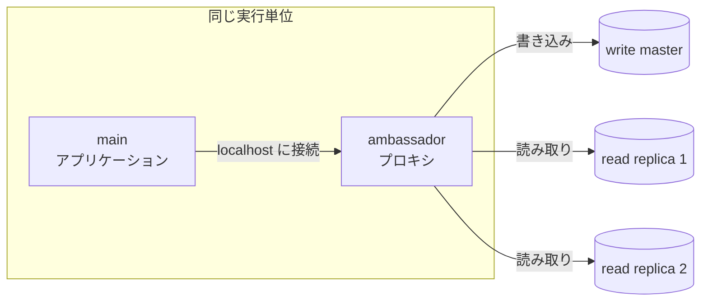
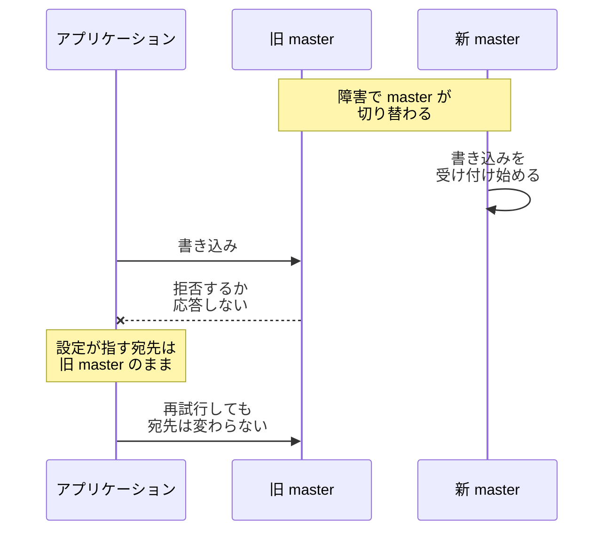
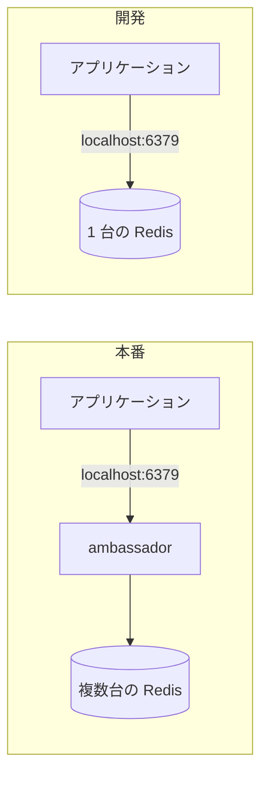

Ambassador とは、アプリケーションのコンテナと同じ実行単位に配置し、外部との通信を代わりに引き受ける補助コンテナです。通信を代わりに受け取って転送する物をプロキシと呼び、Ambassador はその 1 つです。例えばアプリケーションから外に接続する構成では、アプリケーションは localhost の 1 つの宛先に話し、実際の接続先が何台あるのか、どれに振り分けるのかは Ambassador が判断します。

同じ実行単位のコンテナがネットワークを共有する構成では、隣のコンテナに localhost で届きます。共有するかどうかは実行基盤と設定で決まります。実行単位（同じマシンにまとめて配置され、まとめて作られ削除されるコンテナの集まり）と実行基盤（コンテナの配置とライフサイクルを管理する基盤）は、[Sidecar](../sidecar/) と同じ意味で使います。

この名前は、Brendan Burns 氏が 2015 年 6 月 29 日に公開したブログ「[The Distributed System ToolKit: Patterns for Composite Containers](https://kubernetes.io/blog/2015/06/the-distributed-system-toolkit-patterns/)」で、Sidecar・Adapter と並ぶ 3 つのパターンの 2 つ目として紹介されました。同ブログは Ambassador を「ローカルの接続を外の世界に仲介する」と説明されています。

体系化したのは Brendan Burns 氏と David Oppenheimer 氏の論文「[Design Patterns for Container-based Distributed Systems](https://www.usenix.org/conference/hotcloud16/workshop-program/presentation/burns)」で、その 4.2 節は「Ambassador コンテナは、メインのコンテナに向かう通信と、そこから出る通信を仲介する」と書いています。

上記ブログが挙げる Redis の例を以下に示します。Redis は主にメモリ上でデータを扱うデータストアで、書き込みを受け付ける 1 台と、読み取り専用の複製を複数台という構成を組めます。

上記の図のアプリケーションが知っているのは、localhost の 1 つの宛先だけです。書き込みを master に、読み取りを replica に振り分けるのは ambassador で、replica が 2 台から 5 台に増えた時に構成を追いかける責任も ambassador に移ります。

構成の変化を検知する実装ならアプリケーションを触らずに追随でき、そうでなければ ambassador の設定を書き換えます。ブログも、アプリケーションから見れば localhost の Redis に繋いでいるだけだと書かれています。

---

### なぜ Ambassador が必要なのか

接続先が 1 台で済む間は、アプリケーションが直接繋げば足ります。台数が増えて役割で宛先が分かれると、どれに繋ぐのかという判断がアプリケーションの中に入ってきます。判断が入ると、接続先の一覧と振り分けの規則がアプリケーションの設定として必要になります。

この判断と設定をクライアントライブラリに任せる方法もあります。この場合、言語ごとに対応するライブラリが必要な点は [Sidecar](../sidecar/) で見たのと同じです。ambassador に出せば、言語に関わらず同じプロキシを使い回せます。加えて、静的な接続先の一覧を各アプリケーションに配る方式では、構成が変わるたびにその全部を配り直す事になります。クライアントライブラリが DNS の再解決や構成の問い合わせを持っていれば、配り直しは必要ありません。

書き込みを受け付ける 1 台が障害で切り替わった場合に何が起きうるのかは、以下の通りです。

上記の図のアプリケーションは、旧 master の宛先を静的な設定として持っているため、切り替わりを検出できません。旧 master が停止していれば応答が返らず、読み取り専用の複製に降格していれば、接続はできても書き込みだけが拒否されます。どちらでも、設定を書き換えるまで書き込みは失敗し続けます。アプリケーションやクライアントライブラリが DNS の再解決や構成の問い合わせを持っていれば、Ambassador を使わなくても追随できます。

宛先を選ぶ責任を ambassador に出すと、この追随をアプリケーションの外で扱えます。追随できるかどうかは ambassador の実装で決まります。論文が挙げる twemproxy は複数台への振り分けを行うプロキシで、master の切り替わりを検知して宛先を張り替える機能は持ちません。

自動で追随させたい場合は、構成の変化を検知する実装を選ぶ事になります。手で書き換える場合も、触る対象がアプリケーションから ambassador に移るので、アプリケーションのイメージを作り直さずに済みます。

論文の 4.2 節は、この構成がプログラマの作業を 3 つの点で単純にすると書かれています。1 つ目は、localhost の 1 台に繋ぐ事だけを考えてプログラムを書けば良い事です。2 つ目は、ambassador の代わりに本物の memcache をローカルで動かせば、アプリケーションを単体でテストできる事です。

3 つ目は、別の言語で書かれたアプリケーションからも同じ ambassador を使い回せる事です。memcache はメモリ上にデータを置くキャッシュで、論文はこれを複数台に分散させる twemproxy というプロキシを ambassador の例に挙げています。

---

### 成立の条件

Ambassador が localhost という接点で成り立つのは、同じ実行単位のコンテナがネットワークを共有するからです。論文の 4.2 節にも「Ambassador が可能なのは、同じマシン上のコンテナが同じ localhost のネットワークインターフェースを共有するためである」と書かれています。

2015 年のブログはこの性質をもう一歩踏み込んで説明しており、2 つのコンテナがネットワーク名前空間（コンテナごとに分けられたネットワークの区画）を共有して IP アドレスを共有するため、アプリケーションは localhost に接続を開くだけでプロキシを見付けられ、宛先を探す仕組みが必要ないとしています。宛先を探すとは、接続先の IP アドレスとポートを実行時に調べる事です。

ネットワークを共有するかどうかは実行基盤で決まります。Kubernetes の Pod は、同じ Pod の中のコンテナがネットワーク名前空間を共有するので、localhost がそのまま使えます。どのコンテナ実行基盤でも共有されるわけではありません。

例えば、Amazon ECS の Linux/EC2 での既定である bridge モードでは、同じ Task のコンテナがそれぞれ別のアドレスを持ちます。共有しない設定では、アプリケーションが ambassador を別のアドレスで呼ぶ事になり、宛先を探す手間が戻ってきます。同じマシンに居る相手なので探す範囲は狭いものの、接続先の設定がアプリケーションに 1 つ残る点は変わりません。

---

### 何を引き受けるか

アプリケーションから外に出る責任は以下の通りです。

| ambassador が引き受ける処理 | アプリケーションから消えるもの |
|---|---|
| 宛先の探索と選択 | 接続先の一覧を持つ設定 |
| 役割による振り分け | 読み取りと書き込みで宛先を変える分岐 |
| 外部への接続の確立と再利用 | 外部サーバごとの接続の管理 |
| 失敗した時の再試行と切り替え | 再試行の実装 |

どこまで引き受けるのかは ambassador の実装で決まります。表の全部を担う実装もあれば、振り分けだけを行う実装もあります。ネットワークを共有する構成であれば、アプリケーションから見た接点が localhost の 1 つの宛先である点は、どの実装でも共通します。アプリケーションには、その localhost の ambassador との接続が残ります。

4 行目の再試行には条件が付きます。同じ操作を 2 回実行しても結果が変わらない冪等な操作でなければ、ambassador の再試行が二重の書き込みになります。アプリケーションは再試行が起きた事を知りません。ambassador 自身で再試行の可否を安全に判断できない場合は、アプリケーションや設定から、再試行して良い操作かを伝える仕組みが必要です。

---

### 開発では外せる

接点が localhost の 1 つの宛先に固定されている事は、開発の場面でも効きます。ブログは、開発環境ではプロキシを飛ばして、localhost で動く Redis に直接繋げば良いと書かれています。振り分けの必要が無い環境では、振り分ける物を置かなければ済むという事です。

本番と開発で何が変わるのかは、以下の通りです。

上記の図の 6379 は Redis が既定で使うポートで、2 つの構成でアプリケーションが繋ぐ先は同じです。アプリケーションのコードも設定も変えずに、ポートの先に居る相手だけを差し替えられます。テストのたびに複数台の Redis を用意せずに済むので、準備が軽くなります。

---

### 利点

- アプリケーションは localhost の 1 つの宛先だけを知ればよく、接続先の構成がコードから消える
- 同じ ambassador を使う範囲では、宛先の一覧と振り分けの規則を共通化できる
- ambassador を外して同じポートの 1 台に繋げば、アプリケーションを単体でテストできる
- 別の言語で書かれたアプリケーションからも、同じ ambassador を使い回せる
- 接続先の選択と、実装によっては接続の再利用や再試行も、アプリケーションの外に出せる

3 番目と 4 番目は論文が挙げている利点で、1 番目はその前提です。接点が localhost の 1 つの宛先に定まっているからこそ、本番の ambassador と開発の 1 台を同じポートで入れ替えられます。

---

### 欠点

以下は、宛先を選ぶ責任をアプリケーションの外に出す事を優先した結果として現れる制約です。

- 通信の経路が 1 段増え、往復のたびに遅延が加わる
- ambassador が停止すると外部との通信も止まる
- アプリケーションから見た宛先が 1 つなので、どの実体に繋がったのかがアプリケーションのログに残らない
- 実行単位ごとに ambassador のコピーが動き、その分の常駐メモリと CPU が必要
- 読み書きの振り分けのように中身を見る処理を任せる場合は、扱えるプロトコルが ambassador の対応範囲に縛られる

2 番目は、[Sidecar](../sidecar/) の利点として挙げた障害の境界が効かない用途です。ログの転送のように、止まってもアプリケーションが機能を失わない補助とは性質が違います。3 番目については、切り分けに ambassador のログを併せて読む事になります。

4 番目の常駐コストが問題になる規模では、マシンごとに 1 つだけ置く構成も採れます。同じ責任を持たせられる一方で、アプリケーションと同じ実行単位に置く論文の Ambassador とは性質が変わります。localhost で届く前提もライフサイクルを共有する前提も外れ、1 つの停止が同じマシンの全てに及びます。

---

### 分ける利益が小さいケース

- 接続先が 1 台に固定されていて、増える見込みも役割による分岐も無い構成
- 使っているクライアントライブラリが宛先の探索と切り替えを既に持っていて、言語も 1 つの構成
- 許容できる遅延が小さく、プロキシを 1 段挟む余裕が無い通信
- 独自のプロトコルで通信していて、仲介できる実装が無い構成

2 番目の構成でも、扱う言語が 1 つ増えた時点で、同じ探索と切り替えをもう 1 つの言語で用意する事になります。言語が増える見込みがあるなら、その時点で外に出す価値が出てくると考えられます。

---

### Sidecar・Adapter との違い

[Sidecar](../sidecar/)・Ambassador・[Adapter](../adapter/) は、並列した 3 つのパターンとして示されており、Ambassador が Sidecar の下位分類だとは書かれていません。3 つの定義を並べた表は Sidecar のノートに置いてあります。現在の Kubernetes 周辺では、同居する補助コンテナ全般を sidecar と呼ぶ用法も広まっており、その用法では Ambassador も sidecar の 1 つとして数えられます。

Ambassador と Adapter は、誰の複雑さを引き受けるのかが逆になります。Ambassador は外の世界をアプリケーションに単純化して見せ、Adapter はアプリケーションを外の世界に均質な形で見せます。通信の向きでは切り分けられません。論文の定義でも Ambassador は出入り両方の通信を仲介しており、判定は、アプリケーションがクライアントとして外に出て行く時の複雑さを引き受けるのか、サーバとして外に見せる形を揃えるのかで行います。

| | Ambassador | Adapter |
|---|---|---|
| 単純化する対象 | アプリケーションから見た外の世界 | 外から見たアプリケーション |
| 引き受ける差 | 接続先や通信方法の違い | 出力やインターフェースの違い |
| アプリケーションとの連携 | localhost などで通信を仲介する | localhost や共有 volume などで元の出力を受け取る |
| 論文が挙げる例 | memcache の分散配置を隠すプロキシ | 監視のインターフェースを揃える変換 |

service mesh のプロキシは Ambassador ではないか、と考える方がいるかもしれません。論文の分類に当てはめれば、出入りの通信を仲介する役割は Ambassador 的な位置に当たります。呼び方の上では sidecar プロキシで定着しており、この食い違いは Sidecar のノートでも触れています。名前より、同じ実行単位に置く事で何を独立させたいのかで判断する方が現実的だと考えられます。
